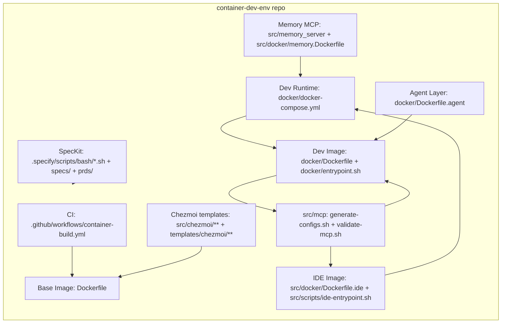

# Architecture Review (Architect Agent) -- 2026-01-23

Repository: `container-dev-env`  
Scope: repository-wide architecture, boundaries, Docker/Compose strategy, Chezmoi + templates, shell/script conventions, SpecKit pipeline, testing/CI, security posture, and extensibility.

This repo already contains two useful prior reviews (`docs/architect-review_review_2026-01-23.md`, `docs/security-auditor_review_2026-01-23.md`). This document consolidates, expands, and turns those findings into a pragmatic architecture roadmap.

---

## Overview

`container-dev-env` is evolving into a "multi-product monorepo" for reproducible development environments:

- A published base dev image (`Dockerfile` + `.github/workflows/container-build.yml`).
- A local dev container stack with explicit volume architecture (`docker/docker-compose.yml`, `docker/Dockerfile`, `docker/entrypoint.sh`).
- Optional add-on stacks: agent layer (`docker/Dockerfile.agent`, `docker/docker-compose.agent.yml`), IDE container (`src/docker/Dockerfile.ide`, `src/docker/docker-compose.ide.yml`), MCP config tooling (`src/mcp/*`), and a persistent memory MCP server (`src/memory_server/*`, `src/docker/memory.Dockerfile`).
- A strong spec-driven workflow backbone (`specs/`, `prds/`, `.specify/`) and a surprisingly comprehensive BATS + pytest test suite (`tests/`).

Primary architectural risk: multiple container build surfaces and runtime stacks are overlapping but not clearly "canonical," which creates drift, inconsistent security controls, and CI coverage gaps.

---

## Current Architecture (Component Map)

### Repo layout (high signal)

- `Dockerfile`: "Base Image" build (Debian pinned tag + Python 3.14 from `python:3.14-slim-bookworm`, Node via NodeSource, Chezmoi + age). Built/pushed in CI (`.github/workflows/container-build.yml`).
- `docker/`: "Dev Container Runtime" build + compose (volume architecture + entrypoint worktree validation + MCP init).
  - `docker/docker-compose.yml`: hybrid bind mounts + named volumes + tmpfs.
  - `docker/Dockerfile`: dev image + MCP stage (installs Node, Python tooling, MCP servers).
  - `docker/entrypoint.sh`: volume validation/permission fixes + MCP validation/generation.
- `docker/docker-compose.agent.yml` + `docker/Dockerfile.agent`: optional agent layer (OpenCode + optional Claude Code + `src/agent/*` wrapper).
- `src/agent/`: a standalone subsystem: session state, action logs, checkpoints, background tasks, backend selection (`src/agent/agent.sh`, `src/agent/lib/*.sh`).
- `src/mcp/`: "config compiler" + security validation for MCP server definitions (`src/mcp/generate-configs.sh`, `src/mcp/validate-mcp.sh`).
- `src/memory_server/` + `src/memory_init/`: Python package providing an MCP server and memory initialization CLI (`pyproject.toml`, `uv.lock`).
- `src/docker/`: "image fragments" / layers:
  - `src/docker/Dockerfile.ide` + `src/docker/docker-compose.ide.yml`: OpenVSCode server with token auth.
  - `src/docker/Dockerfile.ai-extensions`: installs Continue/Cline VSIX + MCP tools + telemetry blocks.
  - `src/docker/memory.Dockerfile`: memory server container.
  - `src/docker/Dockerfile`: OpenCode install stage with checksum verification (not consistently reused elsewhere).
- `scripts/`: host-facing operational scripts (secrets setup/edit/load, volume health, container acceptance tests).
- `src/notify.sh` + `src/notify-sanitize.sh` + tests: notification subsystem (ntfy/slack) with sanitization and retry logic.
- `specs/`, `prds/`, `.specify/`: SpecKit pipeline and feature-by-feature specs/contracts.

### Component interactions (conceptual)

---

## Strengths

- Strong documentation "navigation architecture" and conventions (`docs/navigation.md`, `docs/architecture/overview.md`, `docs/decisions/001-use-markdown-for-documentation.md`).
- Volume architecture is both well-designed and well-operationalized (`docs/volume-architecture.md`, `docker/docker-compose.yml`, `docker/entrypoint.sh`, `scripts/volume-health.sh`).
- Spec-driven delivery workflow is concrete and automatable (`docs/spec-driven-development-pipeline.md`, `.specify/scripts/bash/*`, `specs/*`).
- Solid automated test investment across multiple layers:
  - Shell: BATS unit/integration/contract tests (`tests/**/*.bats`).
  - Python: pytest + ruff + mypy configuration (`pyproject.toml`, `tests/**/*.py`).
- Non-root is the default execution model across multiple images (`Dockerfile`, `docker/Dockerfile`, `src/docker/Dockerfile.ide`, `src/docker/memory.Dockerfile`).
- MCP config toolchain includes meaningful security checks (hardcoded credential detection) and multi-tool output generation (`src/mcp/validate-mcp.sh`, `src/mcp/generate-configs.sh`, `tests/contract/test_config_schema.bats`).

---

## Issues / Risks

### High (architecture + security)

- Unclear canonical container stack; likely drift already happening. There are overlapping build surfaces: `Dockerfile` vs `docker/Dockerfile` vs `src/docker/*`. CI builds only `Dockerfile` (see `.github/workflows/container-build.yml`), while day-to-day devcontainer usage points at `docker/docker-compose.yml` (`.devcontainer/devcontainer.json`). This makes it easy to break the real product without CI noticing.
- Agent wrapper command execution risk: `src/agent/agent.sh` builds a command string and runs `eval` (see prior audit in `docs/security-auditor_review_2026-01-23.md`). This is a classic injection sink for user-provided task descriptions.
- Supply-chain exposure patterns exist in multiple builds:
  - Curl-pipe-shell installers in `Dockerfile` (NodeSource + Chezmoi installer).
  - Binary downloads without checksum verification in `docker/Dockerfile.agent` (OpenCode; optional Claude installer).
  - VSIX downloads without checksum verification in `src/scripts/install-extensions.sh`.
- Secrets handling is conceptually strong but operationally inconsistent:
  - `docs/secrets-guide.md` recommends sourcing `scripts/secrets-load.sh` in entrypoints/shell rc, but the main runtime entrypoint (`docker/entrypoint.sh`) does not load it.
  - `scripts/secrets-load.sh` uses `source "$file"` (code execution risk if the file is tampered with).
  - IDE auth token handling is not "Docker inspect invisible" in practice: token is an env var (`src/docker/docker-compose.ide.yml`) and is passed as a process argument (`src/scripts/ide-entrypoint.sh`).
- Passwordless sudo is widespread (`Dockerfile`, `docker/Dockerfile`, `docker/Dockerfile.agent`) which increases blast radius of any injection/supply-chain issue (container-root + host bind mount impact).

### Medium (maintainability + determinism + CI)

- CI path filters miss most of the active surface area: `.github/workflows/container-build.yml` ignores changes under `docker/**`, `src/**`, `templates/**`, `pyproject.toml`, `uv.lock`, etc.
- Inconsistent shell strict mode and conventions: some scripts use `set -e` without `-u`, and some omit `pipefail` (e.g., `docker/entrypoint.sh`, `src/mcp/validate-mcp.sh`, `src/mcp/generate-configs.sh`, `scripts/test-container.sh`, `scripts/volume-health.sh`). This undermines the repo's own standard (ShellCheck clean + strict mode).
- User identity naming drift: the repo uses both `dev` and `developer` as container users (`Dockerfile`/`docker/Dockerfile` vs `docker/Dockerfile.agent`/`src/docker/memory.Dockerfile`). This complicates volume ownership, docs, and scripts.
- Docs vs implementation mismatch: `docs/architecture/overview.md` describes Go/Rust toolchains but the current `Dockerfile` excerpted tooling does not show them. This may be planned, but it currently reads as drift.

### Low (quality-of-life + extensibility)

- "Image taxonomy" is implicit (you infer it from files). New contributors will not know which Dockerfile/compose file is "the default" for which scenario without reading many files.
- Some configs are parsed in brittle ways (e.g., YAML parsing in `src/notify.sh` via `sed`, JSON parsing in `src/scripts/ide-entrypoint.sh` via `grep`), which is OK in constrained formats but should be treated as contracts with tests (you already have tests -- keep expanding them if formats evolve).

---

## Recommendations (Prioritized)

### P0 -- Must address (security + architectural integrity)

1. Define and enforce the canonical "image/compose matrix" (ADR-worthy).
   - Add an ADR clarifying which build artifacts are supported and their intended users:
     - `Dockerfile` (published base image)
     - `docker/Dockerfile` + `docker/docker-compose.yml` (devcontainer runtime)
     - `docker/Dockerfile.agent` + `docker/docker-compose.agent.yml` (agent add-on)
     - `src/docker/Dockerfile.ide` + `src/docker/docker-compose.ide.yml` (IDE)
     - `src/docker/memory.Dockerfile` (memory MCP server)
   - Link it from `docs/architecture/overview.md` and add a short "Repo Map" in `README.md`.
2. Remove `eval` from the agent wrapper execution path.
   - Refactor `src/agent/agent.sh` to build argv arrays and `exec "${cmd[@]}"`.
   - Add hostile-input unit tests (quotes, semicolons, `$()`) to `tests/unit/test_cli.bats` / `tests/contract/test_cli_interface.bats`.
3. Close CI coverage gaps for the real repo surface.
   - Update `.github/workflows/container-build.yml` `paths:` to include at least `docker/**`, `src/**`, `templates/**`, `pyproject.toml`, `uv.lock`, `Makefile`.
   - Add a CI job that runs:
     - Shell: `shellcheck` over `docker/**/*.sh`, `scripts/**/*.sh`, `src/**/*.sh` (or a curated list).
     - BATS: `bats tests/unit tests/integration tests/contract`.
     - Python: `ruff`, `mypy`, `pytest` for `src/memory_server` / `src/memory_init`.
4. Supply-chain hardening baseline.
   - Replace curl-pipe-shell where feasible; otherwise pin + verify (GPG keys, checksums).
   - Reuse the verified OpenCode install stage (`src/docker/Dockerfile`) or replicate its checksum verification in `docker/Dockerfile.agent`.
   - Add checksums for VSIX downloads in `src/scripts/install-extensions.sh` (store expected SHA256 in-repo).
   - Pin GitHub actions to commit SHAs (especially `ludeeus/action-shellcheck@master` in `.github/workflows/worktree-tests.yml`).

### P1 -- Should address (reduce drift + improve determinism)

1. Consolidate Docker build logic (reduce duplication).
   - Option A (recommended): treat `docker/Dockerfile` as the canonical runtime image and make `Dockerfile` import/reuse stages or vice versa (shared base stage for OS/user/tooling).
   - Option B: keep them separate but document them as distinct products and enforce separate CI builds/tests.
2. Standardize shell strict mode and shared libraries.
   - Bring key scripts to `set -euo pipefail` (or explicitly justify exceptions in headers).
   - Consider a small shared shell lib for repeat patterns (logging, argument parsing, platform helpers) similar to `src/scripts/lib/common.sh`.
3. Make secret injection "real" end-to-end (or explicitly scope it).
   - Decide whether the devcontainer runtime (`docker/entrypoint.sh`) should load secrets automatically (align with `docs/secrets-guide.md`), or revise docs/README to state it's manual/opt-in.
   - Replace `source`-based secret loading in `scripts/secrets-load.sh` with a safe parser that exports `KEY=value` without executing code; enforce permissions (e.g., fail if group/world-writable).
4. Normalize container user naming (`dev` vs `developer`) across images and docs to reduce operational surprises.

### P2 -- Nice-to-have (extensibility + clarity)

1. Add a single "How to run each stack" doc.
   - E.g., `docs/architecture/images-and-entrypoints.md` listing commands and use cases:
     - devcontainer (`docker/docker-compose.yml`, `.devcontainer/devcontainer.json`)
     - IDE (`make ide-up`, `src/docker/docker-compose.ide.yml`)
     - agent (`docker/docker-compose.agent.yml`)
     - memory server (`src/docker/memory.Dockerfile`)
2. Introduce a simple "toolchain manifest" approach for adding languages/features without scattering edits across multiple Dockerfiles.
   - Example: a YAML manifest used to generate install steps or at least to document "what's installed where."
3. Extend contract testing around configs treated as interfaces:
   - IDE token contract (`src/docker/docker-compose.ide.yml`, `src/scripts/ide-entrypoint.sh`).
   - Notification config schema (`src/notify.yaml.template`, `src/notify.sh`).

---

## Suggested Follow-ups

1. Write ADR: "Canonical Images and Compose Entry Points" under `docs/decisions/`.
2. Implement and test: agent `eval` removal in `src/agent/agent.sh`.
3. Update CI:
   - Expand `.github/workflows/container-build.yml` path filters.
   - Add a repo-wide test workflow (shellcheck + bats + python toolchain).
4. Decide/implement secret-loading policy:
   - Either integrate `scripts/secrets-load.sh` into runtime entrypoints safely, or narrow the docs to "manual load via shell rc."
5. Produce a short "Repo Map" section in `README.md` that points to:
   - `docs/navigation.md`
   - `docker/` vs `src/docker/`
   - `specs/` + `.specify/` workflow

---

## Appendix: Notable Files Reviewed

### Top-level / CI

- `README.md`
- `Makefile`
- `.devcontainer/devcontainer.json`
- `.github/workflows/container-build.yml`
- `.github/workflows/worktree-tests.yml`

### Core docs

- `docs/navigation.md`
- `docs/architecture/overview.md`
- `docs/decisions/001-use-markdown-for-documentation.md`
- `docs/spec-driven-development-pipeline.md`
- `docs/volume-architecture.md`
- `docs/secrets-guide.md`
- `docs/security-guidance.md`
- `docs/security/authentication.md`
- `docs/architect-review_review_2026-01-23.md`
- `docs/security-auditor_review_2026-01-23.md`

### Container stacks

- `Dockerfile`
- `docker/docker-compose.yml`
- `docker/Dockerfile`
- `docker/entrypoint.sh`
- `docker/Dockerfile.agent`
- `docker/docker-compose.agent.yml`
- `src/docker/Dockerfile.ide`
- `src/docker/docker-compose.ide.yml`
- `src/scripts/ide-entrypoint.sh`
- `src/docker/Dockerfile.ai-extensions`
- `src/scripts/install-extensions.sh`
- `src/docker/memory.Dockerfile`
- `src/docker/memory-entrypoint.sh`

### Chezmoi + templates

- `templates/chezmoi/private_dot_secrets.env.age.tmpl`
- `src/chezmoi/dot_config/opencode/config.yaml.tmpl`
- `src/chezmoi/voice-input/dot_config/voice-input/settings.yaml.tmpl`

### SpecKit pipeline

- `.specify/config.json`
- `.specify/scripts/bash/check-prerequisites.sh`
- `.specify/scripts/bash/create-new-feature.sh`

### MCP + memory subsystems

- `src/mcp/generate-configs.sh`
- `src/mcp/validate-mcp.sh`
- `pyproject.toml`
- `uv.lock`
- `src/memory_server/server.py`
- `src/memory_server/config.py`

### Secrets + ops scripts

- `scripts/secrets-setup.sh`
- `scripts/secrets-load.sh`
- `scripts/secrets-edit.sh`
- `scripts/test-container.sh`
- `scripts/volume-health.sh`

### Tests (sampled)

- `tests/contract/test_cli_interface.bats`
- `tests/contract/test_config_schema.bats`
- `tests/unit/test_shell_safety.bats`
- `tests/**/*.py`
