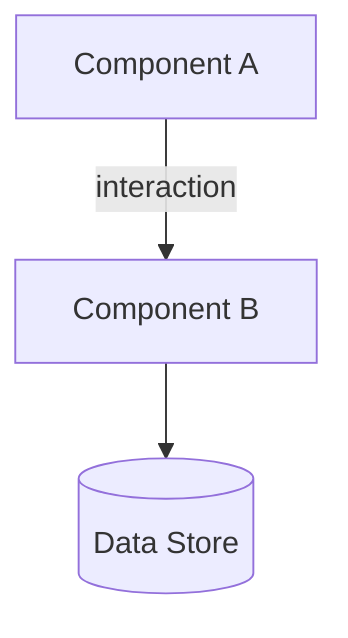

# Architecture Overview

> High-level system structure, component relationships, and design patterns.
> AI agents: reference this before proposing structural changes.

## Prerequisites

- None

## System Description

[2-3 sentences describing what the system does and its primary boundaries.]

## Components

### [Component Name]

**Purpose**: [What this component does]
**Technology**: [Tech stack used]
**Communicates with**: [Other components it interacts with]

---

## System Diagram

[Brief prose description of what the diagram shows and why it matters.]

## Design Patterns

- **[Pattern Name]**: [Where and why it's used]

## Key Constraints

- [Architectural constraints that affect all components]

## Related

- `docs/decisions/`

## Next steps

- `docs/decisions/`
