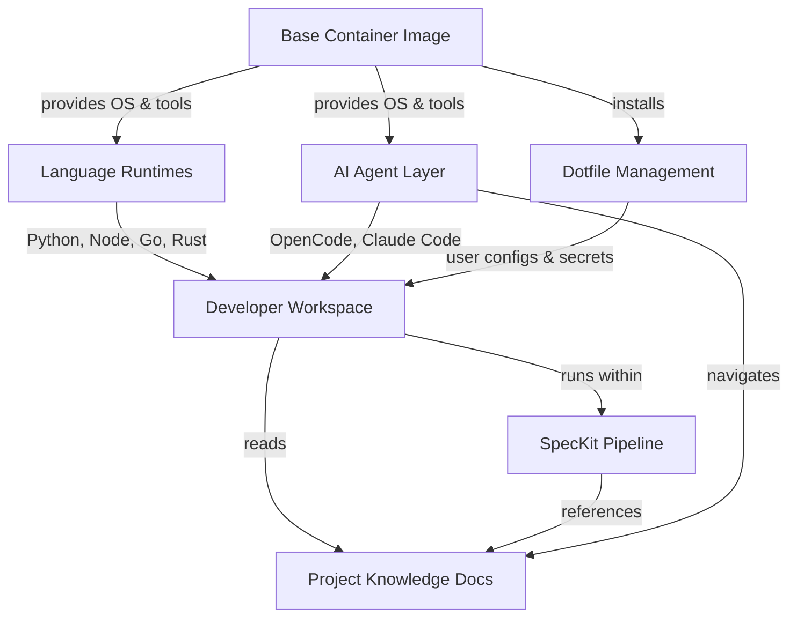
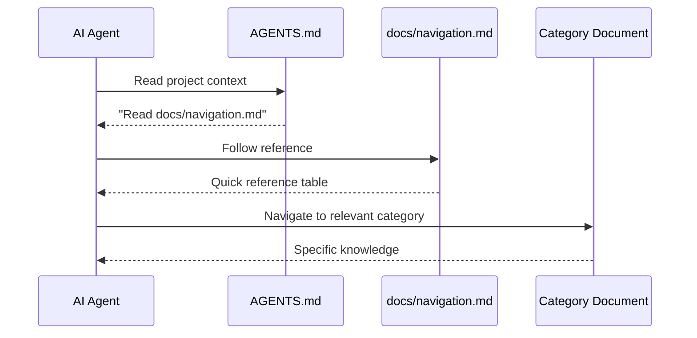

# Architecture Overview

> High-level system structure, component relationships, and design patterns.
> AI agents: reference this before proposing structural changes.

## System Description

Container Dev Env is a containerized development environment system that produces reproducible, multi-language workspaces with integrated AI coding assistants. It packages language runtimes (Python, Node.js, Go, Rust), development tools, and AI agents (OpenCode, Claude Code) into Docker images that developers can use on any machine with zero manual setup.

## Components

### Base Container Image

**Purpose**: Foundation layer providing OS, common dev tools, and non-root user setup
**Technology**: Debian Bookworm-slim, Docker multi-stage build
**Communicates with**: Language Runtime layers, AI Agent layer

---

### Language Runtimes

**Purpose**: Provide Python 3.14+, Node.js 22.x LTS, Go, and Rust toolchains
**Technology**: Official language distributions installed on base image
**Communicates with**: Base Container Image (depends on), Developer Workspace (serves)

---

### Dotfile Management (Chezmoi)

**Purpose**: Template and deploy user configuration files with optional age encryption for secrets
**Technology**: Chezmoi (Go binary), age (encryption), Go templates
**Communicates with**: Base Container Image (installed into), Developer Workspace (configures)

---

### AI Agent Layer

**Purpose**: Provide terminal-based AI coding assistants pre-configured in the container
**Technology**: OpenCode (Go binary), Claude Code (Node.js binary, optional)
**Communicates with**: Language Runtimes (uses), Developer Workspace (assists)

---

### Developer Workspace

**Purpose**: The running container instance where developers write and test code
**Technology**: Docker volumes for persistence, bind mounts for project files
**Communicates with**: All other components (consumes services from each)

---

### SpecKit Pipeline

**Purpose**: Specification-driven development workflow for planning and implementing features
**Technology**: Bash scripts, Markdown templates
**Communicates with**: Developer Workspace (runs within), Project Knowledge docs (references)

---

### Project Knowledge (this feature)

**Purpose**: Structured documentation system that AI agents can navigate to understand architecture, decisions, and domain concepts
**Technology**: Static Markdown files in `docs/` directory
**Communicates with**: AI Agent Layer (consumed by), SpecKit Pipeline (referenced by)

---

## System Diagram

The following diagram shows how the container layers stack and interact. The base image provides the foundation, with language runtimes and AI tools layered on top. The developer workspace is the running instance that combines all layers.

## Documentation Discovery Flow

The following sequence diagram shows how an AI agent discovers and uses project knowledge documentation. The agent reads AGENTS.md, follows the reference to the navigation guide, and then navigates to the relevant category.

## Design Patterns

- **Layered Container Architecture**: Base image → runtime layers → tool layers → workspace. Each layer adds capabilities without modifying lower layers.
- **Template-Driven Configuration**: Chezmoi Go templates for user-specific values, ADR templates for decisions, SpecKit templates for specifications.
- **Progressive Disclosure**: AGENTS.md points to navigation guide, which points to category documents. Keeps root context lean.
- **Feature-per-Branch**: Each numbered feature gets its own branch, spec directory, and implementation plan.

## Key Constraints

- All components must run inside containers (Constitution Principle I)
- Multi-architecture support required (arm64 + amd64)
- Image size under 2GB for full-stack image
- Build time under 5 minutes on CI
- All dependencies MIT-compatible licensed
- No secrets baked into images
