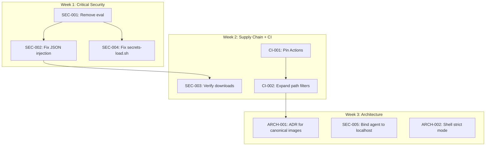

# Consolidated Improvement Backlog

> Security • Architecture • CI/CD • Performance • Maintainability

> **Document Type:** Consolidated Review Findings  
> **Source Reviews:** 5 independent reviews (2026-01-23)  
> **Status:** Ready for Triage  
> **Last Updated:** 2026-01-23

## Prerequisites

- None

---

## Executive Summary

Five independent reviews of `container-dev-env` converged on **2 critical security vulnerabilities** that require immediate remediation, plus **6 high-priority issues** affecting security posture and CI reliability. The reviews also identified architectural drift as a systemic maintainability risk.

**Consensus Finding:** The `eval`-based command execution in the agent wrapper is flagged by ALL five reviews as a critical injection vulnerability.

---

## Priority Legend

| Priority | Definition | SLA |
|----------|------------|-----|
| 🔴 **P0 - Critical** | Active security vulnerability; blocks release | Fix immediately |
| 🟠 **P1 - High** | Security risk or architectural blocker | Fix this sprint |
| 🟡 **P2 - Medium** | Maintainability/drift risk | Plan within 2 sprints |
| 🟢 **P3 - Low** | Quality improvement | Backlog |

---

## 🔴 P0 — Critical (Security Blockers)

### SEC-001: Command Injection via `eval` in Agent Wrapper

| Attribute | Value |
|-----------|-------|
| **Location** | `src/agent/agent.sh:656`, `src/agent/lib/provider.sh:125-144` |
| **Flagged By** | ALL 5 reviews (100% consensus) |
| **Attack Vector** | Task descriptions containing shell metacharacters (`;`, `$()`, backticks) escape quoting and execute arbitrary code |
| **Impact** | Container code execution → with passwordless sudo → container-root |

**Remediation Steps:**
1. Remove `eval` from execution path
2. Build command as bash array: `cmd=(opencode run "$task")`
3. Execute with: `"${cmd[@]}"` or `exec "${cmd[@]}"`
4. Add hostile-input unit tests to `tests/unit/test_cli.bats`:
   - Task with embedded quotes: `"Review \"Project\""`
   - Task with semicolon: `"task; rm -rf /"`
   - Task with subshell: `"$(whoami)"`
   - Task with backticks: `` `id` ``

**Acceptance Criteria:**
- [ ] `eval` removed from `src/agent/agent.sh`
- [ ] Command construction uses bash arrays
- [ ] BATS tests pass for all hostile input patterns
- [ ] ShellCheck passes on modified files

---

### SEC-002: JSON Injection in Logging/Session Management

| Attribute | Value |
|-----------|-------|
| **Location** | `src/agent/lib/log.sh:99-101`, `src/agent/lib/session.sh:45-66` |
| **Flagged By** | 4 reviews (codex, gemini, security-auditor, architect-agent) |
| **Attack Vector** | Unescaped `"`, `\`, newlines in `task_description`, `target`, `details` break JSON structure |
| **Impact** | Log integrity violation; downstream JSON parsers crash or misparse |

**Remediation Steps:**
1. Replace `printf '{..."%s"...}'` with `jq` construction:
   ```bash
   jq -n --arg target "$target" --arg details "$details" \
     '{timestamp: now|todate, target: $target, details: $details}'
   ```
2. Add unit tests for quotes/newlines in all JSON-producing functions

**Acceptance Criteria:**
- [ ] All JSON construction uses `jq --arg` for user-controlled fields
- [ ] Unit tests verify valid JSON for inputs containing `"`, `\`, `\n`
- [ ] `jq .` successfully parses all generated session/log files

---

## 🟠 P1 — High Priority

### SEC-003: Supply-Chain Risk — Unverified Downloads

| Attribute | Value |
|-----------|-------|
| **Locations** | `Dockerfile:76-78` (NodeSource), `Dockerfile:88-89` (Chezmoi), `docker/Dockerfile.agent` (OpenCode), `src/scripts/install-extensions.sh` (VSIX) |
| **Flagged By** | 4 reviews |
| **Risk** | Compromised upstream → malicious code baked into images |

**Remediation Steps:**

| Component | Current State | Target State |
|-----------|---------------|--------------|
| NodeSource | `curl \| bash` | Debian packages OR pinned GPG key verification |
| Chezmoi | `curl \| sh` | Distro package OR checksum-verified release |
| OpenCode | No verification in `Dockerfile.agent` | Reuse pattern from `src/docker/Dockerfile` (SHA256 verification) |
| VSIX extensions | No checksums | Store expected SHA256 in-repo; verify after download |

**Acceptance Criteria:**
- [ ] No `curl | bash/sh` patterns without integrity verification
- [ ] SHA256 checksums stored in-repo for all downloaded binaries
- [ ] Verification step added to each download

---

### SEC-004: Secrets Loader Executes Arbitrary Shell

| Attribute | Value |
|-----------|-------|
| **Location** | `scripts/secrets-load.sh:212-215` |
| **Flagged By** | 3 reviews (codex, security-auditor, architect-agent) |
| **Attack Vector** | `source "$file"` executes command substitutions/backticks if secrets file is tampered |
| **Impact** | Code execution at shell startup |

**Remediation Steps:**
1. Replace `source` with safe line-by-line parsing:
   ```bash
   while IFS='=' read -r key value; do
     [[ "$key" =~ ^[A-Z_][A-Z0-9_]*$ ]] || continue
     export "$key=$value"
   done < "$file"
   ```
2. Reject lines containing `$`, backticks, or `$()`
3. Enforce `0600` permissions; fail if group/world-writable

**Acceptance Criteria:**
- [ ] `source` removed from secrets loading path
- [ ] Permission check enforced (fail on insecure permissions)
- [ ] Unit test verifies command substitutions are NOT executed

---

### SEC-005: Agent Server Port Exposed on All Interfaces

| Attribute | Value |
|-----------|-------|
| **Location** | `docker/docker-compose.agent.yml` |
| **Flagged By** | 2 reviews (security-auditor, architect-agent) |
| **Risk** | `0.0.0.0` binding exposes agent to local network |

**Remediation Steps:**
1. Change port mapping: `127.0.0.1:${AGENT_SERVER_PORT:-4096}:4096`
2. Require `OPENCODE_SERVER_PASSWORD` when server mode enabled
3. Fail closed if auth not configured

**Acceptance Criteria:**
- [ ] Port bound to localhost only
- [ ] Server mode requires password (or explicit opt-out documented)

---

### SEC-006: `secrets-edit.sh` Value Corruption

| Attribute | Value |
|-----------|-------|
| **Location** | `scripts/secrets-edit.sh:187-200` |
| **Flagged By** | 2 reviews (codex, security-auditor) |
| **Risk** | `sed` substitution breaks on `&`, `|`, `\`; `echo` mangles `-n` |

**Remediation Steps:**
1. Replace `sed` substitution with line-by-line file rewrite
2. Use `printf '%s\n'` instead of `echo`
3. Add tests for common secret characters: `/`, `+`, `=`, `&`, `|`

**Acceptance Criteria:**
- [ ] Round-trip test passes for values containing all special characters
- [ ] No `sed` with user-controlled replacement text

---

### CI-001: GitHub Actions Unpinned

| Attribute | Value |
|-----------|-------|
| **Location** | `.github/workflows/worktree-tests.yml:51-66` (`@master`) |
| **Flagged By** | 4 reviews |
| **Risk** | Supply-chain; action content can change without notice |

**Remediation Steps:**
1. Pin `ludeeus/action-shellcheck` to commit SHA
2. Pin all other third-party actions to SHAs
3. Add Dependabot config for GitHub Actions

**Acceptance Criteria:**
- [ ] No `@master` or `@main` refs in any workflow
- [ ] `.github/dependabot.yml` includes `github-actions` ecosystem

---

### CI-002: CI Path Filters Miss Primary Surface Area

| Attribute | Value |
|-----------|-------|
| **Location** | `.github/workflows/container-build.yml` |
| **Flagged By** | 3 reviews |
| **Risk** | Changes under `docker/**`, `src/**`, `templates/**` bypass CI |

**Remediation Steps:**
Update `paths:` trigger to include:
```yaml
paths:
  - 'Dockerfile'
  - 'docker/**'
  - 'src/**'
  - 'templates/**'
  - 'scripts/**'
  - 'pyproject.toml'
  - 'uv.lock'
  - 'Makefile'
```

**Acceptance Criteria:**
- [ ] PR modifying `docker/Dockerfile` triggers build workflow
- [ ] PR modifying `src/agent/` triggers build workflow

---

## 🟡 P2 — Medium Priority

### ARCH-001: Unclear Canonical Container Stack

| Attribute | Value |
|-----------|-------|
| **Flagged By** | 3 reviews (all architecture reviews) |
| **Risk** | Drift between `Dockerfile`, `docker/Dockerfile`, `src/docker/*`; unclear "blessed" entrypoint |

**Remediation Steps:**
1. Create ADR: `docs/decisions/NNN-canonical-images.md`
2. Document which image is canonical for each use case:
   - Base dev image (published)
   - Devcontainer runtime
   - Agent add-on
   - IDE
   - Memory server
3. Add "Repo Map" section to `README.md`

**Acceptance Criteria:**
- [ ] ADR merged and linked from `docs/architecture/overview.md`
- [ ] README includes "Which container do I use?" guidance

---

### ARCH-002: Shell Strict Mode Inconsistencies

| Attribute | Value |
|-----------|-------|
| **Locations** | `docker/entrypoint.sh`, `scripts/health-check.sh`, `scripts/test-worktree.sh`, `scripts/test-container.sh`, `scripts/volume-health.sh` |
| **Flagged By** | 3 reviews |
| **Risk** | Unset vars and pipeline failures missed; behavior diverges |

**Remediation Steps:**
1. Standardize on `set -euo pipefail`
2. Fix resulting issues explicitly
3. Document exceptions in script headers where intentional

**Acceptance Criteria:**
- [ ] All scripts in `scripts/`, `docker/`, `src/scripts/` use `set -euo pipefail` or document why not
- [ ] ShellCheck CI job covers all script directories

---

### ARCH-003: Passwordless Sudo Broadens Blast Radius

| Attribute | Value |
|-----------|-------|
| **Locations** | `Dockerfile`, `docker/Dockerfile`, `docker/entrypoint.sh` |
| **Flagged By** | 2 reviews |
| **Risk** | Any process as `dev` user can become container-root |

**Remediation Steps:**
1. Run entrypoint permission-fix steps as root
2. `exec` as non-root user for main process
3. If sudo needed, restrict to specific commands via sudoers

**Acceptance Criteria:**
- [ ] Passwordless `ALL` removed or scoped to specific commands
- [ ] Entrypoint documented if sudo retained

---

### ARCH-004: User Identity Naming Drift

| Attribute | Value |
|-----------|-------|
| **Locations** | `dev` in some images, `developer` in others |
| **Flagged By** | 2 reviews |
| **Risk** | Volume ownership confusion; script assumptions fail |

**Remediation Steps:**
1. Decide on canonical username (recommend `dev`)
2. Update all Dockerfiles to match
3. Update docs and scripts

**Acceptance Criteria:**
- [ ] Single username across all container images
- [ ] No references to alternate username in active configs

---

### PERF-001: Inefficient Session Lookup

| Attribute | Value |
|-----------|-------|
| **Location** | `src/agent/lib/session.sh` (`find_latest_session`) |
| **Flagged By** | 1 review (gemini) |
| **Risk** | O(N) file parsing; degrades as session count grows |

**Remediation Steps:**
1. Embed timestamp in filename: `YYYY-MM-DD-HHMMSS_UUID.json`
2. Sort via `ls` or globbing without file I/O
3. OR maintain `latest` symlink

**Acceptance Criteria:**
- [ ] `find_latest_session` does not parse all files
- [ ] Performance test: 1000 sessions completes in <1s

---

### SEC-007: Base Images Not Pinned to Digests

| Attribute | Value |
|-----------|-------|
| **Locations** | All Dockerfiles |
| **Flagged By** | 2 reviews |
| **Risk** | Tags can be repointed upstream |

**Remediation Steps:**
1. Pin `FROM ...@sha256:<digest>`
2. Add scheduled workflow to update digests

**Acceptance Criteria:**
- [ ] All `FROM` statements include digest
- [ ] Dependabot or Renovate configured for base images

---

## 🟢 P3 — Low Priority

### DOC-001: Realistic Secret Examples in Docs

| Attribute | Value |
|-----------|-------|
| **Locations** | `docs/secrets-guide.md`, `scripts/secrets-setup.sh` |
| **Flagged By** | 1 review |
| **Risk** | False positives in scanners; normalizes secret-like values in docs |

**Remediation:** Replace with clearly fake placeholders (e.g., `EXAMPLE_TOKEN_VALUE`)

---

### DOC-002: Docs/Implementation Mismatch

| Attribute | Value |
|-----------|-------|
| **Location** | `docs/architecture/overview.md` mentions Go/Rust toolchains not in Dockerfile |
| **Flagged By** | 1 review |

**Remediation:** Sync docs with actual toolchain or document as planned

---

### DOC-018: Expand Configuration Reference Coverage

| Attribute | Value |
|-----------|-------|
| **Location** | `docs/reference/configuration.md` |
| **Risk** | Users miss less-common settings and fall back to reading source |

**Remediation:** Inventory user-facing settings across Compose files and scripts and document them (especially agent/IDE settings).

---

### DOC-019: Deepen Feature Guide Verification Steps

| Attribute | Value |
|-----------|-------|
| **Locations** | `docs/features/*.md` |
| **Risk** | Guides are readable but not always fully copy/paste verifiable |

**Remediation:** Add concrete verification commands/output expectations per feature.

---

### MAINT-001: Docker Compose Version Field Legacy

| Location | `docker/docker-compose.yml:11` |
| **Remediation:** Remove `version:` field for Compose V2+

---

### MAINT-002: Memory System Ingestion Without Guards

| Attribute | Value |
|-----------|-------|
| **Location** | `src/memory_server/strategic.py` |
| **Risk** | No hard size cap; no secret scanning |

**Remediation:**
- Enforce max file/total size
- Add optional secret-pattern scanning

---

## Quick Wins (< 1 Day Each)

These can be completed independently with minimal coordination:

| Item | Effort | Impact |
|------|--------|--------|
| Pin GitHub Actions to SHA | 30 min | Closes CI-001 |
| Expand CI path filters | 15 min | Closes CI-002 |
| Add "Repo Map" to README | 30 min | Partial ARCH-001 |
| Replace `version:` in docker-compose | 5 min | Closes MAINT-001 |
| Add Dependabot for Actions | 15 min | Ongoing supply-chain hygiene |
| Run ShellCheck over all script dirs in CI | 30 min | Supports ARCH-002 |

---

## Implementation Order (Suggested)



---

## Review Cross-Reference Matrix

| Finding | Architect | Architect-Agent | Codex | Gemini | Security |
|---------|:---------:|:---------------:|:-----:|:------:|:--------:|
| SEC-001 (eval) | ✓ | ✓ | ✓ | ✓ | ✓ |
| SEC-002 (JSON) | | ✓ | ✓ | ✓ | ✓ |
| SEC-003 (supply-chain) | | ✓ | ✓ | | ✓ |
| SEC-004 (secrets-load) | | ✓ | ✓ | | ✓ |
| SEC-005 (agent port) | | ✓ | | | ✓ |
| CI-001 (unpinned actions) | ✓ | ✓ | ✓ | | ✓ |
| CI-002 (path filters) | ✓ | ✓ | | | |
| ARCH-001 (canonical stack) | ✓ | ✓ | | | |
| ARCH-002 (strict mode) | | ✓ | ✓ | | |

---

## Appendix: Source Reviews

1. `docs/architect-review_review_2026-01-23.md` — Repository architecture
2. `docs/architect_agent_review_2026-01-23.md` — Comprehensive architecture + security
3. `docs/codex-review-2026-01-23.md` — Code review (shell scripts, agent)
4. `docs/gemini-review-2026-01-23.md` — Agent service deep-dive
5. `docs/security-auditor_review_2026-01-23.md` — Security audit

## Related

- `docs/contributing/index.md`
- `docs/architecture/index.md`

## Next steps

- Triage items into feature specs under `specs/`
