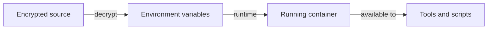

# Security Patterns

This page describes security patterns (especially around secrets handling) that are relevant to this repository.
It intentionally avoids real credentials.

Applies to: `main`

## Prerequisites

- None

## Secret management principles

- Never commit secrets
- Never bake secrets into container images
- Never print secrets in logs
- Prefer runtime injection via environment variables

## Secret injection flow (conceptual)

## Container security basics

- Prefer non-root operation for day-to-day workflows
- Expose only required ports
- Pin versions for installed tooling

## Related

- [Secrets Management](../../features/secrets-management.md)
- [Security Guidance](../security-guidance.md)

## Next steps

- If you are enabling AI tools: [AI Assistants](../../features/ai-assistants.md)
