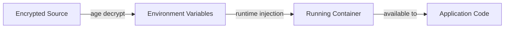

# Security Patterns

> Authentication patterns, secret handling practices, and threat considerations.
> AI agents: reference this before implementing security-sensitive features.
> WARNING: This document describes PATTERNS only. Never include actual secrets, API keys, or credentials.

## Secret Management

### Principles

- Secrets MUST never be committed to version control
- Secrets MUST never be baked into container images
- Secrets MUST never appear in logs or error messages
- Secrets SHOULD be injected at runtime via environment variables

### Secret Injection Flow



### Implementation

1. **Development**: Use `.env` files (gitignored) with `.env.example` as template
2. **CI/CD**: Use platform secret stores (GitHub Secrets, etc.)
3. **Container**: Pass via `docker run -e` or `docker compose` environment section
4. **Chezmoi**: Use age-encrypted templates for user-specific secrets

### What Qualifies as a Secret

- API keys and tokens (provider keys, OAuth tokens)
- Database connection strings with credentials
- Private keys (SSH, TLS, signing)
- Encryption keys and passphrases
- Internal service URLs with authentication
- Webhook secrets

## Container Security

### Non-Root Execution

All containers run as a non-root user (`developer`, UID 1000):

- Reduces blast radius if container is compromised
- Sudo available for administrative tasks
- File permissions set appropriately for the non-root user

### Image Security

- Base images pinned to specific version tags (not `:latest`)
- Minimal base image (Debian slim) to reduce attack surface
- Regular vulnerability scanning of base images
- No unnecessary packages installed

### Network Security

- Containers use Docker's default bridge network
- Only expose ports that are explicitly needed
- Internal services communicate over Docker network (not host)

## Input Validation

### Script Arguments

All shell scripts MUST validate input:

```bash
# Validate required arguments exist
if [[ -z "${1:-}" ]]; then
    echo "Error: argument required" >&2
    exit 2
fi

# Sanitize paths to prevent directory traversal
realpath --relative-to="${ALLOWED_DIR}" "${input_path}" >/dev/null 2>&1 || exit 1
```

### File Operations

- Validate file paths are within expected directories
- Check file permissions before reading/writing
- Use temporary files securely (`mktemp`)
- Clean up temporary files in trap handlers

## Dependency Security

### Scanning

- Scan dependencies for known vulnerabilities before adding
- Block on HIGH/CRITICAL severity findings
- Document exceptions with justification and remediation timeline

### Update Policy

- Keep dependencies within 1 major version of latest
- Review changelogs for security-relevant changes
- Prefer well-maintained packages with active security response

## Threat Considerations

### In-Scope Threats

| Threat | Mitigation |
|--------|-----------|
| Secret exposure in git | Pre-commit hooks (detect-secrets), .gitignore patterns |
| Container escape | Non-root user, minimal capabilities, no privileged mode |
| Supply chain attack | Pinned versions, vulnerability scanning |
| Credential in logs | Structured logging with auto-redaction patterns |

### Out-of-Scope

- Network-level attacks (containers are local-only development environments)
- Physical access threats
- Social engineering
