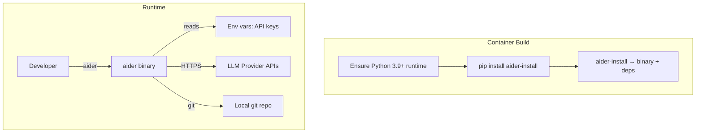
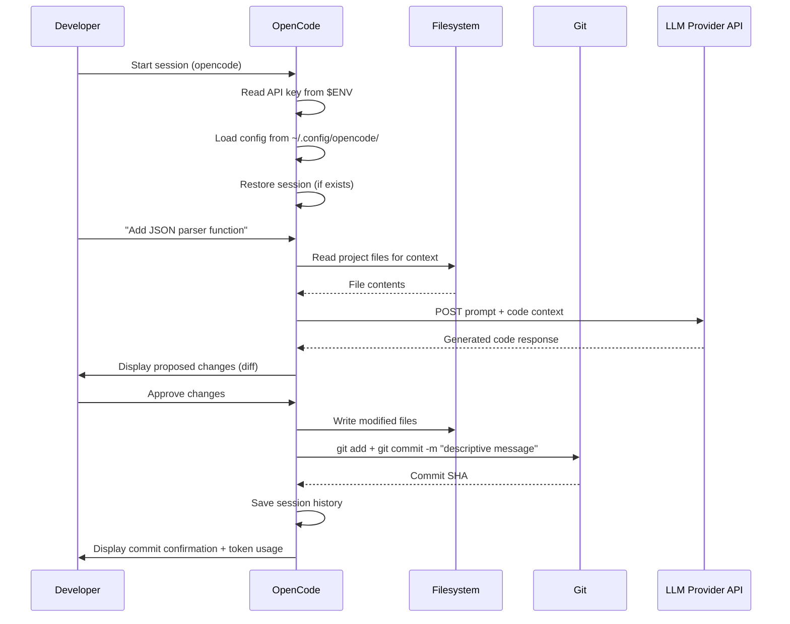
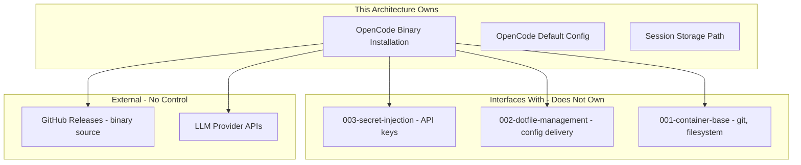

# 005-ard-terminal-ai-agent

> **Document Type:** Architecture Decision Record
> **Audience:** LLM agents, human reviewers
> **Status:** Proposed
> **Last Updated:** 2026-01-22 <!-- @auto -->
> **Owner:** <!-- @human-required -->
> **Deciders:** <!-- @human-required -->

---

## Review Tier Legend

| Marker | Tier | Speckit Behavior |
|--------|------|------------------|
| 🔴 `@human-required` | Human Generated | Prompt human to author; blocks until complete |
| 🟡 `@human-review` | LLM + Human Review | LLM drafts → prompt human to confirm/edit; blocks until confirmed |
| 🟢 `@llm-autonomous` | LLM Autonomous | LLM completes; no prompt; logged for audit |
| ⚪ `@auto` | Auto-generated | System fills (timestamps, links); no prompt |

---

## Linkage ⚪ `@auto`

| Document | ID | Relationship |
|----------|-----|--------------|
| Parent PRD | 005-prd-terminal-ai-agent.md | Requirements this architecture satisfies |
| Security Review | 005-sec-terminal-ai-agent.md | Security implications of this decision |
| Supersedes | — | N/A (greenfield) |
| Superseded By | — | |

---

## Summary

### Decision 🔴 `@human-required`
> Install OpenCode as a single Go binary in the container image, pinned to a specific release with SHA256 verification, configured to read LLM API keys exclusively from environment variables injected by 003-secret-injection.

### TL;DR for Agents 🟡 `@human-review`
> OpenCode is installed as a standalone Go binary during container build via a SHA256-verified GitHub release download — no curl|bash. API keys come from environment variables only (never disk). No default LLM provider is pre-configured; the user must specify one on first run. Aider is NOT installed but documented as an alternative the user can self-install.

---

## Context

### Problem Space 🔴 `@human-required`
The container dev environment needs a terminal-based AI coding agent that enables code generation, editing, and git integration without leaving the CLI. The architectural challenge is selecting and integrating a tool that: (1) adds minimal image size and zero runtime dependencies, (2) securely handles LLM API credentials without persisting them, (3) supports multiple LLM providers to avoid vendor lock-in, and (4) works headless in a container without additional user setup.

### Decision Scope 🟡 `@human-review`

**This ARD decides:**
- Which terminal AI agent to install in the container image
- How the binary is installed and verified (integrity)
- How API keys are provided to the agent
- Default configuration and agent modes available
- Session persistence approach (in-container, plaintext)

**This ARD does NOT decide:**
- Which LLM provider or model the user selects (user choice at runtime)
- Volume mount strategies for session persistence across rebuilds (see 004-volume-architecture)
- Whether to add Aider or other agents in the future (user can self-install)
- LLM API rate limiting or cost controls (provider-side concern)
- MCP server configurations (user-customized post-install)

### Current State 🟢 `@llm-autonomous`
N/A — greenfield implementation. The container currently has no AI coding agent installed. Developers must switch to a browser or IDE plugin for AI-assisted code generation.

### Driving Requirements 🟡 `@human-review`

| PRD Req ID | Requirement Summary | Architectural Implication |
|------------|---------------------|---------------------------|
| M-1 | Terminal-native interface (no browser/GUI) | Tool must provide TUI or CLI mode; no X11/display deps |
| M-2 | Code generation and editing in existing files | Tool needs filesystem read/write access within project dirs |
| M-3 | Git integration with auto-commit | Tool must invoke git commands; git must be pre-installed |
| M-4 | Multi-language support (Py, TS, Rust, Go) | Tool must not be language-specific; LSP integration preferred |
| M-5 | Codebase context awareness | Tool must read/search project files for context |
| M-6 | Works within container environment | Zero runtime deps; no additional install steps for user |
| M-7 | OSI-approved open source license | MIT or Apache 2.0 required |
| M-8 | API key via environment variables | Integrate with 003-secret-injection; no disk persistence |
| S-1 | Session persistence | Writable path for history; in-container for MVP |
| S-6 | Multiple LLM providers | 75+ providers via Models.dev; no vendor lock-in |

**PRD Constraints inherited:**
- Binary size: ~30MB (well within 3GB total image budget)
- Startup time: <3s to ready state
- Architecture: linux/amd64 and linux/arm64
- Storage path: `~/.local/share/opencode/` for session data

---

## Decision Drivers 🔴 `@human-required`

1. **Zero runtime dependencies:** Go binary eliminates need for Python or Node.js in container *(M-6)*
2. **License compliance:** Must be MIT or Apache 2.0 for unrestricted commercial use *(M-7)*
3. **API key security:** Keys from environment variables only; never written to disk *(M-8, R-2)*
4. **Image size budget:** ~30MB binary addition vs 3GB total container limit *(Q3)*
5. **Multi-provider flexibility:** Not locked to a single LLM vendor *(S-6)*
6. **Supply chain integrity:** Binary must be verified via SHA256 checksum *(SEC finding)*
7. **Maintainability:** Use latest stable release; active project with frequent updates

---

## Options Considered 🟡 `@human-review`

### Option 0: Status Quo / Do Nothing

**Description:** No AI agent is installed in the container. Users switch to browser-based tools or install their own.

| Driver | Rating | Notes |
|--------|--------|-------|
| Zero runtime deps | ✅ Good | Nothing to install |
| License compliance | ✅ Good | No third-party tool |
| API key security | ✅ Good | No credential handling |
| Image size | ✅ Good | No addition |
| Multi-provider | ❌ Poor | No AI capability at all |
| Supply chain | ✅ Good | No external binary |
| Maintainability | ❌ Poor | Users self-manage, inconsistent environments |

**Why not viable:** Fails to deliver the core feature. Developers must context-switch out of the terminal, defeating the purpose of a self-contained dev environment.

---

### Option 1: OpenCode Only (Single Go Binary)

**Description:** Install OpenCode via SHA256-verified GitHub release download. Single binary, no runtime dependencies. Configured to read API keys from environment variables.

```mermaid
graph TD
    subgraph Container Build
        DL[Download OpenCode release binary]
        VER[Verify SHA256 checksum]
        INST[Install to /usr/local/bin/opencode]
    end

    subgraph Runtime
        ENV[Env vars: API keys from 003-secret-injection]
        CFG[~/.config/opencode/config.yaml]
        SESS[~/.local/share/opencode/ session history]
    end

    subgraph User Workflow
        USR[Developer] -->|opencode| BIN[/usr/local/bin/opencode]
        BIN -->|reads| ENV
        BIN -->|reads| CFG
        BIN -->|writes| SESS
        BIN -->|HTTPS| LLM[LLM Provider APIs]
        BIN -->|git commands| GIT[Local git repo]
    end

    DL --> VER --> INST
```

| Driver | Rating | Notes |
|--------|--------|-------|
| Zero runtime deps | ✅ Good | Go binary, no Python/Node.js |
| License compliance | ✅ Good | MIT license |
| API key security | ✅ Good | Env vars only; privacy-focused design |
| Image size | ✅ Good | ~30MB binary |
| Multi-provider | ✅ Good | 75+ providers via Models.dev |
| Supply chain | ✅ Good | SHA256 verified release |
| Maintainability | ✅ Good | Active project, frequent releases |

**Pros:**
- Smallest footprint (~30MB, zero deps)
- MIT license — no commercial restrictions
- 75+ LLM providers including local models (Ollama)
- MCP + LSP integration for extensibility
- Built-in `plan` and `build` agent modes
- Privacy-focused (no code/context storage by the tool itself)
- 70k+ GitHub stars, 500+ contributors

**Cons:**
- Newer project than Aider (less battle-tested)
- Git integration is "Good" not "Excellent" (vs Aider)
- No built-in voice coding
- No `/undo` command (must use git revert manually)

---

### Option 2: Aider Only (Python-based)

**Description:** Install Aider via pip. Requires Python 3.9+ runtime in the container.



| Driver | Rating | Notes |
|--------|--------|-------|
| Zero runtime deps | ❌ Poor | Requires Python 3.9+ and pip ecosystem |
| License compliance | ✅ Good | Apache 2.0 |
| API key security | ✅ Good | Env vars supported |
| Image size | ⚠️ Medium | ~50MB + Python deps (already in image per 001-prd) |
| Multi-provider | ⚠️ Medium | ~10 providers (less than OpenCode) |
| Supply chain | ⚠️ Medium | pip dependency chain; more attack surface |
| Maintainability | ✅ Good | Mature, well-tested |

**Pros:**
- Most mature terminal AI agent
- Best git integration (conventional commits, atomic commits)
- Voice coding support
- Built-in `/undo` command
- Well-documented, large community

**Cons:**
- Requires Python runtime (~50MB + dependencies)
- Fewer LLM providers (~10 vs 75+)
- No MCP or LSP integration
- Larger supply chain attack surface (pip dependencies)
- Can be token-heavy

---

### Option 3: OpenCode + Aider Dual Install

**Description:** Install both tools, letting users choose per-workflow.

| Driver | Rating | Notes |
|--------|--------|-------|
| Zero runtime deps | ❌ Poor | Aider requires Python |
| License compliance | ✅ Good | Both OSI-approved |
| API key security | ⚠️ Medium | Two tools to audit for credential handling |
| Image size | ⚠️ Medium | ~80MB+ combined |
| Multi-provider | ✅ Good | Union of both provider sets |
| Supply chain | ❌ Poor | Double the attack surface |
| Maintainability | ❌ Poor | Two tools to update, test, document |

**Why not selected:** Per Q2 resolution — document Aider as an alternative only. Dual install adds complexity, image size, and maintenance burden without proportional benefit.

---

## Decision

### Selected Option 🔴 `@human-required`
> **Option 1: OpenCode Only (Single Go Binary)**

### Rationale 🔴 `@human-required`

OpenCode satisfies all decision drivers with the highest composite score. It uniquely offers zero runtime dependencies (Go binary), the broadest LLM provider support (75+ via Models.dev), and MIT licensing — all without requiring Python or Node.js in the container. The SHA256-pinned install addresses supply chain concerns raised in the security review.

Aider is the stronger choice for git-specific workflows (conventional commits, `/undo`), but the architectural trade-off of adding Python runtime dependencies to the container for this single tool is not justified. Users who need Aider can self-install it since Python is available in the base image (001-prd-container-base).

#### Simplest Implementation Comparison 🟡 `@human-review`

| Aspect | Simplest Possible | Selected Option | Justification for Complexity |
|--------|-------------------|-----------------|------------------------------|
| Install method | `curl \| bash` | SHA256-verified release download | Supply chain security (SEC finding) |
| Configuration | Hardcoded provider | User-configured via env vars + config file | Multi-provider requirement (S-6) |
| Session storage | None (stateless) | File-based in `~/.local/share/opencode/` | Session persistence requirement (S-1) |
| Agent modes | Single mode | `plan` + `build` modes | Read-only analysis vs write access (safety) |

**Complexity justified by:** Security requirements (SHA256 verification) and multi-provider flexibility (S-6) require configuration beyond the simplest curl|bash approach. Session persistence (S-1) requires writable storage. The added complexity is minimal — all configuration is env vars and a single YAML file.

### Architecture Diagram 🟡 `@human-review`

```mermaid
graph TD
    subgraph Container Image - Build Time
        DL[GitHub Release Download] --> SHA[SHA256 Verification]
        SHA --> BIN[/usr/local/bin/opencode]
    end

    subgraph Container Runtime
        subgraph Secret Injection - 003
            SECRETS[003-secret-injection] -->|decrypts| ENVVARS[Environment Variables]
        end

        subgraph OpenCode Agent
            BIN2[opencode binary]
            CFG[~/.config/opencode/config.yaml]
            SESS[~/.local/share/opencode/sessions/]
        end

        subgraph User Workspace
            CODE[Project source code]
            GIT[Git repository]
        end

        subgraph External - LLM APIs
            OPENAI[OpenAI API]
            ANTHROPIC[Anthropic API]
            OLLAMA[Ollama - local]
            OTHER[Other providers...]
        end
    end

    ENVVARS -->|API keys| BIN2
    BIN2 -->|reads config| CFG
    BIN2 -->|persists history| SESS
    BIN2 -->|reads/writes code| CODE
    BIN2 -->|commit/diff/log| GIT
    BIN2 -->|HTTPS - code context + prompt| OPENAI
    BIN2 -->|HTTPS - code context + prompt| ANTHROPIC
    BIN2 -->|HTTP - local| OLLAMA
```

---

## Technical Specification

### Component Overview 🟡 `@human-review`

| Component | Responsibility | Interface | Dependencies |
|-----------|---------------|-----------|--------------|
| OpenCode Binary | AI agent: code gen, editing, git ops | CLI/TUI (`opencode` command) | None (static Go binary) |
| Config File | User preferences, model selection | YAML at `~/.config/opencode/config.yaml` | Managed by Chezmoi (002) |
| Session Store | Conversation history persistence | Files at `~/.local/share/opencode/` | Writable filesystem |
| Secret Injection | API key delivery | Environment variables | 003-secret-injection |
| Git | Version control operations | CLI (`git` commands) | Pre-installed in base image (001) |
| LLM Provider APIs | Model inference | HTTPS endpoints | Outbound network access |

### Data Flow 🟢 `@llm-autonomous`



### Interface Definitions 🟡 `@human-review`

```bash
# Installation (Dockerfile)
ARG OPENCODE_VERSION=v0.x.x
ARG OPENCODE_SHA256=<sha256-hash-of-binary>

RUN curl -fsSL "https://github.com/opencode-ai/opencode/releases/download/${OPENCODE_VERSION}/opencode-linux-$(dpkg --print-architecture)" \
    -o /usr/local/bin/opencode \
    && echo "${OPENCODE_SHA256}  /usr/local/bin/opencode" | sha256sum -c - \
    && chmod +x /usr/local/bin/opencode

# Runtime environment variables (from 003-secret-injection)
OPENAI_API_KEY=sk-...          # OpenAI provider
ANTHROPIC_API_KEY=sk-ant-...   # Anthropic provider
OPENCODE_MODEL=gpt-4o          # Optional: model override
OPENCODE_PROVIDER=openai       # Optional: provider override

# User invocation
opencode                       # Interactive TUI mode
opencode "prompt text"         # One-shot mode
```

```yaml
# ~/.config/opencode/config.yaml (Chezmoi-managed defaults)
provider: ""          # Empty — user must configure
model: ""             # Empty — user must configure
session:
  persist: true
  path: ~/.local/share/opencode/sessions/
git:
  auto_commit: true
  message_style: conventional
```

### Key Algorithms/Patterns 🟡 `@human-review`

**Pattern:** Build-time binary verification
```
1. Download specific release binary from GitHub
2. Verify SHA256 checksum matches pinned value
3. Fail build if checksum mismatch (supply chain protection)
4. Install verified binary to PATH
```

**Pattern:** Runtime credential injection
```
1. 003-secret-injection decrypts age-encrypted secrets at container start
2. API keys exported as environment variables
3. OpenCode reads keys from env at startup
4. Keys never written to config files or session history
```

---

## Constraints & Boundaries

### Technical Constraints 🟡 `@human-review`

**Inherited from PRD:**
- Zero runtime dependencies beyond Go binary (M-6)
- Binary size ~30MB; total image <3GB (Q3)
- Startup <3s (Technical Constraints)
- Support linux/amd64 and linux/arm64 (Technical Constraints)
- API keys via environment variables only (M-8)

**Added by this Architecture:**
- **Install method:** SHA256-verified GitHub release download (not curl|bash)
- **Version pinning:** Specific release tag in Dockerfile ARG (updatable via Renovate/Dependabot)
- **Config format:** YAML at `~/.config/opencode/config.yaml`
- **Session storage:** Plaintext files at `~/.local/share/opencode/sessions/` (risk accepted — see SEC)
- **No default provider:** User must explicitly configure before first use

### Architectural Boundaries 🟡 `@human-review`



- **Owns:** OpenCode binary installation, default configuration, session storage path
- **Interfaces With:** 003-secret-injection (API keys), 002-dotfile-management (config file), 001-container-base (git, Python/Node.js runtimes for Aider self-install)
- **Must Not Touch:** LLM provider API implementations, user's project code (beyond agent operations), secret encryption/decryption logic

### Implementation Guardrails 🟡 `@human-review`

> **Critical for LLM Agents:**

- [ ] **DO NOT** use `curl | bash` for installation — use SHA256-verified release download *(SEC supply chain finding)*
- [ ] **DO NOT** hardcode API keys, model names, or provider defaults in the image *(M-8, Q1 resolution)*
- [ ] **DO NOT** install Aider or other agents in the image *(Q2 resolution: document only)*
- [ ] **DO NOT** persist API keys to any file (config, session, logs) *(R-2)*
- [ ] **DO NOT** grant the agent unrestricted shell access — approval gates required *(S-2)*
- [ ] **MUST** verify binary SHA256 checksum during build *(SEC-3)*
- [ ] **MUST** fail the build if checksum verification fails
- [ ] **MUST** support both linux/amd64 and linux/arm64 *(Technical Constraints)*
- [ ] **MUST** configure `auto_commit: true` with conventional commit style *(M-3)*
- [ ] **MUST** store session data at `~/.local/share/opencode/sessions/` *(S-1)*

---

## Consequences 🟡 `@human-review`

### Positive
- Minimal image size impact (~30MB for full AI agent capability)
- Zero runtime dependency conflicts (no Python/Node.js version issues)
- Broadest LLM provider support (75+) — users not locked to any vendor
- MIT license — no commercial restrictions or compliance concerns
- Supply chain integrity via SHA256 verification
- Privacy-focused design — no code stored by the tool itself

### Negative
- Git integration is "Good" not "Excellent" (Aider is stronger here)
- No built-in `/undo` — users must use `git revert` manually
- No voice coding out of the box
- Newer project — less battle-tested than Aider
- Session history is plaintext (risk accepted for MVP)
- Users who want Aider must self-install (friction, but documented)

### Risks & Mitigations

| Risk | Likelihood | Impact | Mitigation |
|------|------------|--------|------------|
| OpenCode project abandoned | Low | High | Aider documented as fallback; modular install allows swap |
| GitHub release URL changes | Low | Medium | Pin to release tag; monitor via Dependabot/Renovate |
| Binary incompatible with architecture | Low | Medium | Multi-arch ARG in Dockerfile; CI tests both architectures |
| Session files contain sensitive code | Medium | Medium | Accepted for MVP; document volume mount for advanced users; encrypt in future |
| LLM provider API changes | Medium | Low | OpenCode uses Models.dev abstraction layer |

---

## Implementation Guidance

### Suggested Implementation Order 🟢 `@llm-autonomous`
1. **Dockerfile addition:** Add OpenCode binary download + SHA256 verification to multi-stage build
2. **Chezmoi config:** Create default `config.yaml` template managed by 002-dotfile-management
3. **Secret injection integration:** Verify API key env vars are available at runtime via 003
4. **Smoke test:** CI job that starts OpenCode, verifies version output, confirms API connectivity with mock
5. **Documentation:** Update container README with usage instructions and Aider self-install guide

### Testing Strategy 🟢 `@llm-autonomous`

| Layer | Test Type | Coverage Target | Notes |
|-------|-----------|-----------------|-------|
| Build | Binary verification | SHA256 match | Fail build on mismatch |
| Build | Architecture | amd64 + arm64 | CI matrix build |
| Unit | Config loading | Default config parses | Validate YAML structure |
| Integration | Agent startup | Starts with mock API key | Verify <3s startup |
| Integration | Git operations | Auto-commit works | Test commit message format |
| Integration | Multi-language | Py/TS/Rust/Go projects | Syntax-valid output |
| E2E | Full workflow | Prompt → code → commit | Happy path + error cases |

### Reference Implementations 🟡 `@human-review`

- [OpenCode GitHub Releases](https://github.com/opencode-ai/opencode/releases) — binary download source
- [OpenCode Configuration Docs](https://opencode.ai/docs/configuration) — config file format
- Existing Dockerfile patterns in 001-container-base for multi-stage binary installation

### Anti-patterns to Avoid 🟡 `@human-review`
- **Don't:** Use `curl | bash` for installation
  - **Why:** Unverified remote code execution; supply chain attack vector
  - **Instead:** Download specific release binary, verify SHA256 checksum

- **Don't:** Bake API keys or provider defaults into the image
  - **Why:** Credentials in layers; opinionated defaults confuse users
  - **Instead:** Empty config; require user to set env vars via 003-secret-injection

- **Don't:** Install multiple AI agents to "provide choice"
  - **Why:** Image bloat, maintenance burden, confusing UX
  - **Instead:** Install OpenCode; document alternatives for self-install

- **Don't:** Auto-start the agent on container entry
  - **Why:** Unexpected behavior; may consume API credits without intent
  - **Instead:** User-initiated via `opencode` command

---

## Compliance & Cross-cutting Concerns

### Security Considerations 🟡 `@human-review`
Full details in 005-sec-terminal-ai-agent.md.
- **Authentication:** LLM API keys via environment variables (003-secret-injection)
- **Authorization:** Agent operates with container user permissions; shell commands require explicit approval
- **Data handling:** Code context sent to external LLM APIs over HTTPS; session history stored as plaintext locally

### Observability 🟢 `@llm-autonomous`
- **Logging:** OpenCode logs to stderr; capture via container log driver
- **Metrics:** Token usage displayed per-operation (S-5); no custom metrics emitted
- **Tracing:** Not applicable — single-process CLI tool

### Error Handling Strategy 🟢 `@llm-autonomous`
```
Error Category → Handling Approach
├── Missing API key → Fail fast with clear message listing required env var names
├── Invalid API key → Fail fast with provider-specific error + link to dashboard
├── Insufficient quota → Fail fast with error message + link to provider dashboard (Q5)
├── Network unreachable → Clear connectivity error (EC-6)
├── LLM provider timeout → Retry once, then fail with message
├── Git dirty state → Warn user; suggest stash or commit first (EC-2)
├── Binary files in context → Skip silently; process text files only (EC-3)
└── SHA256 mismatch (build) → Fail build immediately; do not install
```

---

## Migration Plan (if applicable) 🟡 `@human-review`

N/A — greenfield installation. No existing AI agent to migrate from.

### Rollback Plan 🔴 `@human-required`

**Rollback Triggers:**
- OpenCode binary fails to install on target architecture
- Critical security vulnerability discovered in OpenCode
- Binary size exceeds 100MB (unexpected growth)

**Rollback Decision Authority:** Container image maintainer

**Rollback Time Window:** Any time — binary is additive to image

**Rollback Procedure:**
1. Remove OpenCode-related lines from Dockerfile
2. Remove Chezmoi-managed config template
3. Rebuild container image
4. Document removal in changelog
5. If needed, add Aider as replacement (follow Option 2 architecture)

---

## Open Questions 🟡 `@human-review`

- [x] **Q1:** curl|bash vs SHA256-verified install → **Resolved: SHA256 pinned**
- [x] **Q2:** Explicit consent for code-to-LLM → **Resolved: No, API key config implies consent**
- [x] **Q3:** Session history encryption → **Resolved: Plaintext for MVP; risk noted in SEC**
- [ ] **Q4:** Which OpenCode release version to pin for initial implementation?
- [ ] **Q5:** Should Renovate/Dependabot be configured to auto-update the pinned version + checksum?

---

## Changelog ⚪ `@auto`

| Version | Date | Author | Changes |
|---------|------|--------|---------|
| 0.1 | 2026-01-22 | LLM | Initial proposal |

---

## Decision Record ⚪ `@auto`

| Date | Event | Details |
|------|-------|---------|
| 2026-01-22 | Proposed | Initial draft created from PRD analysis |

---

## Traceability Matrix 🟢 `@llm-autonomous`

| PRD Req ID | Decision Driver | Option 1 Rating | Component | How Satisfied |
|------------|-----------------|------------------|-----------|---------------|
| M-1 | — | ✅ | OpenCode Binary | TUI mode, no browser/GUI needed |
| M-2 | — | ✅ | OpenCode Binary | Built-in file read/write in `build` mode |
| M-3 | — | ✅ | OpenCode Binary + Git | Auto-commit with conventional messages |
| M-4 | — | ✅ | OpenCode Binary | LSP integration for multi-language |
| M-5 | — | ✅ | OpenCode Binary | File search/read for context |
| M-6 | Driver 1 (zero deps) | ✅ | OpenCode Binary | Static Go binary, no runtime |
| M-7 | Driver 2 (license) | ✅ | OpenCode Binary | MIT license |
| M-8 | Driver 3 (API key security) | ✅ | Secret Injection + Config | Env vars only, no disk persistence |
| S-1 | — | ✅ | Session Store | File-based persistence in container |
| S-2 | — | ✅ | OpenCode Binary | Shell exec with user approval |
| S-3 | — | ✅ | OpenCode Binary | Multi-file editing supported |
| S-5 | — | ✅ | OpenCode Binary | Token usage display |
| S-6 | Driver 5 (multi-provider) | ✅ | OpenCode Binary | 75+ providers via Models.dev |

---

## Review Checklist 🟢 `@llm-autonomous`

Before marking as Accepted:
- [x] All PRD Must Have requirements appear in Driving Requirements
- [x] Option 0 (Status Quo) is documented
- [x] Simplest Implementation comparison is completed
- [x] Decision drivers are prioritized and addressed
- [x] At least 2 options were seriously considered (3 options + status quo)
- [x] Constraints distinguish inherited vs. new
- [x] Component names are consistent across all diagrams and tables
- [x] Implementation guardrails reference specific PRD constraints
- [x] Rollback triggers and authority are defined
- [x] Security review is linked (005-sec-terminal-ai-agent.md)
- [ ] No open questions blocking implementation (Q4, Q5 remain — non-blocking for architecture decision)
