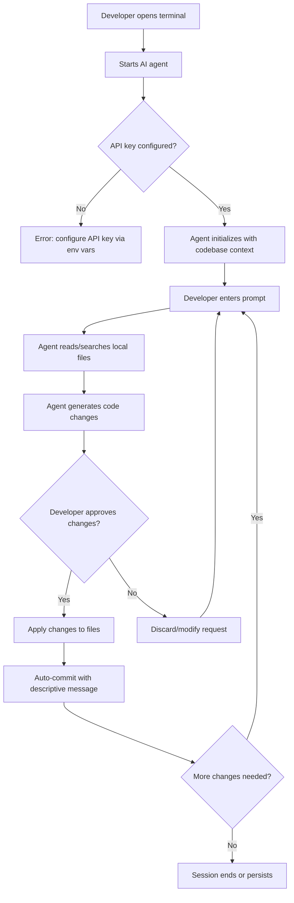
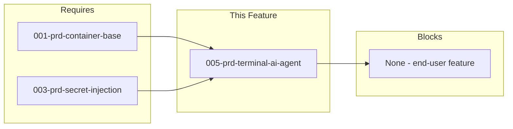

# 005-prd-terminal-ai-agent

> **Document Type:** Product Requirements Document
> **Audience:** LLM agents, human reviewers
> **Status:** Ready for Review
> **Last Updated:** 2026-01-22 <!-- @auto -->
> **Owner:** <!-- @human-required -->

---

## Review Tier Legend

| Marker | Tier | Speckit Behavior |
|--------|------|------------------|
| 🔴 `@human-required` | Human Generated | Prompt human to author; blocks until complete |
| 🟡 `@human-review` | LLM + Human Review | LLM drafts → prompt human to confirm/edit; blocks until confirmed |
| 🟢 `@llm-autonomous` | LLM Autonomous | LLM completes; no prompt; logged for audit |
| ⚪ `@auto` | Auto-generated | System fills (timestamps, links); no prompt |

---

## Context

### Background 🔴 `@human-required`
Developers need AI-assisted code generation directly in the terminal without switching contexts to a web browser or IDE plugin. A terminal-based AI agent enables hands-free coding workflows, integrates with existing CLI toolchains, and supports auto-commit for rapid iteration. The containerized dev environment should include a pre-configured, best-in-class terminal AI agent.

### Scope Boundaries 🟡 `@human-review`

**In Scope:**
- Terminal-native AI agent installation and configuration within the container
- API key management integration (via 003-secret-injection)
- Code generation, editing, and git integration workflows
- Multi-language support (Python, TypeScript, Rust, Go)
- LLM provider configuration
- Session persistence and conversation history

**Out of Scope:**
<!-- List "near-miss" items — features that might seem related but are explicitly excluded to prevent scope drift. -->
- GUI interface — terminal-only workflow by design
- IDE plugin integration — covered separately if needed; different UX paradigm
- Self-hosted LLM inference — users provide API keys to external providers; local inference is a separate infrastructure concern
- Code review automation — different workflow pattern (async vs interactive)
- Custom model fine-tuning — out of scope for a dev environment tool
- CI/CD pipeline integration — separate concern from local development

### Glossary 🟡 `@human-review`

| Term | Definition |
|------|------------|
| Terminal AI Agent | A CLI-based tool that uses LLM APIs to generate, edit, and manage code directly from the terminal |
| MCP | Model Context Protocol — a standard for connecting LLM agents to external tools and data sources |
| LSP | Language Server Protocol — a standard for code intelligence (autocomplete, diagnostics, etc.) |
| TUI | Terminal User Interface — a rich text-based UI rendered in the terminal |
| Auto-commit | Automatic creation of git commits after approved code changes |
| LLM Provider | A service offering Large Language Model API access (e.g., OpenAI, Anthropic, Ollama) |
| Models.dev | A registry/aggregator of LLM provider configurations used by OpenCode |
| Atomic commit | A single git commit that represents one logical change across potentially multiple files |

### Related Documents ⚪ `@auto`

| Document | Link | Relationship |
|----------|------|--------------|
| Container Base Image | 001-prd-container-base.md | Prerequisite — provides base container |
| Secret Injection | 003-prd-secret-injection.md | Prerequisite — API key management |
| Architecture Decision Record | 005-ard-terminal-ai-agent.md | Defines technical approach |

---

## Problem Statement 🔴 `@human-required`

Developers working in containerized environments frequently need AI-assisted code generation but are forced to switch context to web browsers or IDE plugins. This breaks terminal-centric workflows and adds friction to rapid iteration cycles. The cost of not solving this is reduced developer velocity, context-switching overhead, and inability to leverage AI tooling in headless/remote environments where browsers are unavailable.

### User Story 🔴 `@human-required`
> As a developer working in a containerized environment, I want an AI coding agent available directly in my terminal so that I can generate, edit, and commit code without leaving my CLI workflow.

---

## Assumptions & Risks 🟡 `@human-review`

### Assumptions
- [A-1] Users have valid API keys for at least one supported LLM provider before using this feature
- [A-2] The container has outbound internet access to reach LLM provider APIs
- [A-3] Git is already installed and configured in the container (from base image)
- [A-4] Users are comfortable with terminal-based interfaces
- [A-5] The container filesystem provides sufficient storage for session history and tool configuration
- [A-6] OpenCode's install script and binary remain available at the documented URLs

### Risks
| ID | Risk | Likelihood | Impact | Mitigation |
|----|------|------------|--------|------------|
| R-1 | OpenCode project becomes unmaintained | Low | High | Aider as fallback; modular installation allows tool swap |
| R-2 | API key exposure in container environment | Medium | High | Leverage 003-secret-injection; never persist keys to disk |
| R-3 | LLM provider API breaking changes | Medium | Medium | Pin tool versions; integration tests in CI |
| R-4 | Token costs exceed user expectations | Medium | Low | Cost tracking requirement (S-5); configurable token limits |
| R-5 | Go binary incompatible with container architecture | Low | Medium | Multi-arch build support; fallback to source compilation |
| R-6 | OpenCode install script URL changes or becomes unavailable | Low | Medium | Pin to specific release; cache binary in container build |

---

## Feature Overview

### Flow Diagram 🟡 `@human-review`



### Dependency Diagram 🟡 `@human-review`



---

## Requirements

### Must Have (M) — MVP, launch blockers 🔴 `@human-required`
- [ ] **M-1:** The agent shall provide a terminal-native interface requiring no browser or GUI
- [ ] **M-2:** The agent shall generate and edit code in existing project files
- [ ] **M-3:** The agent shall integrate with git and support auto-commit with descriptive commit messages
- [ ] **M-4:** The agent shall support code generation for Python, TypeScript, Rust, and Go
- [ ] **M-5:** The agent shall read and search local files to maintain codebase context awareness
- [ ] **M-6:** The agent shall run within the container environment without additional host-side setup
- [ ] **M-7:** The agent shall be licensed under an OSI-approved open source license permitting commercial use
- [ ] **M-8:** The agent shall accept LLM API keys via environment variables (integrated with 003-secret-injection)

### Should Have (S) — High value, not blocking 🔴 `@human-required`
- [ ] **S-1:** The agent should persist conversation history across sessions
- [ ] **S-2:** The agent should execute shell commands with explicit user approval
- [ ] **S-3:** The agent should support multi-file editing in a single operation
- [ ] **S-4:** The agent should provide undo/revert capability for applied changes
- [ ] **S-5:** The agent should display token usage and approximate cost after operations
- [ ] **S-6:** The agent should support multiple LLM providers (OpenAI, Anthropic, local models via Ollama)

### Could Have (C) — Nice to have, if time permits 🟡 `@human-review`
- [ ] **C-1:** Voice input support for hands-free operation
- [ ] **C-2:** Custom system prompts or persona configurations
- [ ] **C-3:** Integration with test runners (auto-run tests after changes)
- [ ] **C-4:** Pair programming mode with real-time suggestions
- [ ] **C-5:** Project-specific configuration files (.opencode.yaml or similar)
- [ ] **C-6:** MCP (Model Context Protocol) server support for external tool integration

### Won't Have (W) — Explicitly deferred 🟡 `@human-review`
- [ ] **W-1:** GUI interface — *Reason: terminal-only by design; GUI adds complexity and deps*
- [ ] **W-2:** IDE plugin integration — *Reason: different UX paradigm; separate feature if needed*
- [ ] **W-3:** Self-hosted LLM inference — *Reason: infrastructure concern separate from dev environment tooling; users provide API keys*
- [ ] **W-4:** Code review automation — *Reason: async workflow pattern differs from interactive agent; separate feature*

---

## Technical Constraints 🟡 `@human-review`

- **Runtime Dependencies:** The primary tool (OpenCode) shall have zero runtime dependencies beyond the Go binary itself — no Python or Node.js required in container
- **Binary Size:** Installation shall add no more than ~50MB to the container image
- **Startup Time:** Agent shall be ready to accept input within 3 seconds of invocation
- **Container Architecture:** Must support linux/amd64 and linux/arm64
- **Network:** Requires outbound HTTPS access to LLM provider APIs (configurable endpoints)
- **Storage:** Session persistence requires writable filesystem at a configurable path (default: `~/.local/share/opencode/`)
- **API Key Format:** Must accept standard environment variables (e.g., `OPENAI_API_KEY`, `ANTHROPIC_API_KEY`)

---

## Data Model (if applicable) 🟡 `@human-review`

Not applicable — this feature uses the selected tool's internal data model for session storage. Configuration is file-based (YAML/TOML).

---

## Interface Contract (if applicable) 🟡 `@human-review`

### CLI Interface

```bash
# Primary invocation
opencode                    # Start interactive TUI session
opencode "prompt text"      # One-shot mode with inline prompt

# Configuration (environment variables)
OPENAI_API_KEY=sk-...       # OpenAI provider
ANTHROPIC_API_KEY=sk-...    # Anthropic provider
OPENCODE_MODEL=gpt-4o       # Model selection
OPENCODE_PROVIDER=openai    # Provider selection
```

### Agent Modes (OpenCode-specific)
| Mode | Description | File Access |
|------|-------------|-------------|
| `plan` | Read-only analysis and planning | Read only |
| `build` | Full development with file modifications | Read/Write |

---

## Evaluation Criteria 🟡 `@human-review`

| Criterion | Weight | Metric | Target | Notes |
|-----------|--------|--------|--------|-------|
| Terminal-native UX | Critical | No browser/GUI required | 100% terminal | Core requirement |
| Auto-commit quality | Critical | Commit message descriptiveness | Conventional commits format | Clean, atomic commits |
| Codebase context | Critical | File read/search capability | Handles projects >1000 files | Must understand project structure |
| License compatibility | Critical | OSI-approved license | MIT or Apache 2.0 | For commercial use |
| Multi-language support | High | Languages supported | Python, TS, Rust, Go minimum | |
| Active maintenance | High | Commit frequency | Monthly releases minimum | |
| LLM provider flexibility | High | Providers supported | >=3 providers | Not locked to single vendor |
| Container compatibility | High | Headless operation | No special deps required | |
| Session persistence | Medium | History restoration | Resume after container restart | |
| Token efficiency | Medium | Tokens per task | Competitive with alternatives | Minimize API costs |
| Community adoption | Medium | GitHub stars, contributors | Active community | |

---

## Tool/Approach Candidates 🟡 `@human-review`

| Option | License | Pros | Cons | Spike Result |
|--------|---------|------|------|--------------|
| OpenCode | MIT | Go binary (no runtime deps), 75+ LLM providers via Models.dev, MCP support, LSP integration, TUI, 70k GitHub stars, privacy-focused, built-in plan/build agents | Newer project, less git-specific features than Aider | **Recommended** |
| Aider | Apache 2.0 | Mature, excellent git integration with conventional commits, multi-file editing, voice coding, active development | Python dependency, can be token-heavy | Strong alternative |
| Claude Code | Elastic 2.0 | Official Anthropic tool, best-in-class context handling, MCP ecosystem, plugin system | Anthropic-only, source-available (not OSI open source), commercial restrictions | Alternative |
| Codex CLI | Apache 2.0 | OpenAI official, GPT-5.2-Codex benchmarks, included with ChatGPT Plus/Pro, full-screen TUI | OpenAI-only, no multi-provider support | Viable |
| Mentat | MIT | Truly open source, RAG-based auto-context, multi-provider | Less active development, smaller community, fewer features | Not recommended |

### Spike Comparison Matrix

| Criterion | OpenCode | Aider | Claude Code | Codex CLI | Mentat |
|-----------|----------|-------|-------------|-----------|--------|
| Terminal-native | Yes | Yes | Yes | Yes | Yes |
| Auto-commit | Good | Excellent | Good | Good | Basic |
| Multi-LLM | 75+ providers | ~10 providers | Anthropic only | OpenAI only | ~5 providers |
| License | MIT | Apache 2.0 | Elastic 2.0 | Apache 2.0 | MIT |
| MCP Support | Yes | No | Yes | No | No |
| LSP Integration | Yes | No | No | No | No |
| Multi-file edit | Yes | Yes | Yes | Yes | Yes |
| Session persist | Yes | Yes | Yes | Yes | Limited |
| Active dev | Very High | High | High | High | Medium |
| Container-ready | Excellent | Good | Good | Good | Good |
| Runtime deps | None | Python | Node.js | Node.js | Python |

### Selected Approach 🔴 `@human-required`
> **Decision:** OpenCode (primary) with Aider as secondary option for git-heavy workflows
> **Rationale:**
> 1. **License**: MIT — most permissive OSI-approved license, no restrictions
> 2. **No Runtime Dependencies**: Go binary — no Python or Node.js required in container
> 3. **Maximum LLM Flexibility**: 75+ providers via Models.dev including local models (Ollama)
> 4. **MCP Support**: Model Context Protocol for external tool integration
> 5. **LSP Integration**: Language Server Protocol for code intelligence across languages
> 6. **Built-in Agents**: `plan` (read-only analysis) and `build` (full development) modes
> 7. **Privacy-Focused**: No code/context storage — suitable for sensitive environments
> 8. **Community**: 70k+ GitHub stars, 500+ contributors, 650k monthly users

### Installation Comparison

| Tool | Install Command | Runtime | Binary Size |
|------|-----------------|---------|-------------|
| OpenCode | `curl -fsSL https://opencode.ai/install \| bash` | None (Go binary) | ~30MB |
| Aider | `pip install aider-install && aider-install` | Python 3.9+ | ~50MB + deps |
| Claude Code | `curl -fsSL https://claude.ai/install.sh \| bash` | Node.js 18+ | ~100MB + deps |
| Codex CLI | `npm install -g @openai/codex` | Node.js | ~80MB + deps |
| Mentat | `pip install mentat` | Python 3.10+ | ~40MB + deps |

### When to Use Aider Instead
- If conventional commits format is critical (Aider has best git integration)
- If voice coding is needed
- If you prefer Python ecosystem tooling
- If you need the `/undo` command for easy rollback

---

## Acceptance Criteria 🟡 `@human-review`

| AC ID | Requirement | Given | When | Then |
|-------|-------------|-------|------|------|
| AC-1 | M-1 | The container environment is running | The user invokes `opencode` | A terminal-based UI initializes without requiring a browser or GUI |
| AC-2 | M-8 | API keys are configured via environment variables | The agent starts | It connects to the LLM provider without error |
| AC-3 | M-2 | A codebase exists in the working directory | The user requests "add a function to parse JSON from file" | The agent creates syntactically correct, working code in the appropriate file |
| AC-4 | M-3 | Code changes have been generated and approved | The user confirms the changes | A clean git commit is created with a descriptive message |
| AC-5 | M-5 | A multi-file project exists | The user asks about project structure | The agent can read and search files to answer accurately |
| AC-6 | M-6 | The container is freshly started | The user runs the agent | It works without additional manual setup beyond API key configuration |
| AC-7 | M-4 | A Python/TypeScript/Rust/Go project exists | The user requests code changes | The agent generates syntactically valid code in the target language |
| AC-8 | S-3 | A multi-file change is requested | The user approves the changes | All files are updated atomically in a single commit |
| AC-9 | S-1 | A previous session exists | The user exits and restarts the agent | Conversation context can be resumed |
| AC-10 | S-5 | A task is completed | The session ends or user requests | Token usage and approximate cost are displayed |
| AC-11 | M-7 | The tool is installed | A license audit is performed | The tool is MIT licensed (OSI-approved) |

### Edge Cases 🟢 `@llm-autonomous`
- [ ] **EC-1:** (M-8) When API key environment variable is missing or invalid, then the agent displays a clear error message indicating which key is needed and how to configure it
- [ ] **EC-2:** (M-3) When git is in a dirty state (uncommitted changes), then the agent handles the situation gracefully (stash, warn, or refuse)
- [ ] **EC-3:** (M-5) When the project contains binary files or very large files, then the agent skips them without crashing
- [ ] **EC-4:** (M-2) When the requested code change would introduce a syntax error, then the agent validates output before applying
- [ ] **EC-5:** (S-6) When a selected LLM provider is unreachable, then the agent provides a clear error and optionally falls back to an alternative provider
- [ ] **EC-6:** (M-6) When the container has no internet access, then the agent fails gracefully with a clear connectivity error
- [ ] **EC-7:** (S-4) When the user requests undo but no changes have been made, then the agent informs the user rather than erroring

---

## Dependencies 🟡 `@human-review`


- **Requires:** 001-prd-container-base (provides base container image), 003-prd-secret-injection (API key management)
- **Blocks:** None (end-user feature)
- **External:** LLM provider APIs (OpenAI, Anthropic, etc.), OpenCode release infrastructure (GitHub releases, opencode.ai)

---

## Security Considerations 🟡 `@human-review`

| Aspect | Assessment | Notes |
|--------|------------|-------|
| Internet Exposure | Yes | Outbound HTTPS to LLM provider APIs; no inbound |
| Sensitive Data | Yes | API keys (managed by 003-secret-injection); code context sent to LLM APIs |
| Authentication Required | Yes | LLM API keys via environment variables |
| Security Review Required | Yes | Link to 005-sec-terminal-ai-agent.md — API key handling, code exfiltration risk |

### Security Notes
- API keys must never be persisted to disk or committed to git
- Code context sent to LLM providers is subject to their data policies
- OpenCode's privacy-focused design (no code storage) mitigates data retention risk
- Shell command execution (S-2) requires explicit user approval to prevent arbitrary code execution

---

## Implementation Guidance 🟢 `@llm-autonomous`

### Suggested Approach
1. Add OpenCode binary installation to the Dockerfile (multi-stage build, final stage copy)
2. Configure default settings via Chezmoi-managed dotfiles
3. Integrate API key injection from 003-secret-injection into environment variables
4. Validate installation with a smoke test in CI

### Container Installation
```dockerfile
# OpenCode installation (recommended - single binary)
RUN curl -fsSL https://opencode.ai/install | bash

# Or via Go (if Go is available in build stage)
RUN go install github.com/opencode-ai/opencode@latest
```

### Anti-patterns to Avoid
- Do not bake API keys into the container image
- Do not install both Python and Node.js runtimes just for AI agent tooling (use Go binary)
- Do not auto-run the agent on container start — it should be user-initiated
- Do not grant the agent unrestricted shell access without approval gates

### Reference Examples
- [OpenCode Documentation](https://opencode.ai/docs/)
- [OpenCode GitHub](https://github.com/opencode-ai/opencode)
- [Aider Documentation](https://aider.chat/docs/)

---

## Spike Tasks 🟡 `@human-review`

- [x] **Spike-1:** Install and configure OpenCode in container, test TUI and MCP features
- [x] **Spike-2:** Install and configure Aider in container, test code generation and auto-commit
- [x] **Spike-3:** Install and configure Claude Code in container, test auth flow and features
- [x] **Spike-4:** Install and configure Codex CLI in container, test basic operations
- [x] **Spike-5:** Install and configure Mentat in container, test codebase awareness
- [x] **Spike-6:** Compare token usage across tools for equivalent tasks
- [x] **Spike-7:** Evaluate git commit quality (message format, atomicity)
- [x] **Spike-8:** Test multi-file refactoring workflow in each tool
- [x] **Spike-9:** Measure startup time and responsiveness
- [x] **Spike-10:** Document container-specific installation steps for each tool
- [ ] **Spike-11:** Test with Python, TypeScript, and Rust codebases (deferred to implementation)

### Spike Sources
- [OpenCode Website](https://opencode.ai/) - MIT
- [OpenCode GitHub](https://github.com/opencode-ai/opencode) - MIT
- [OpenCode Documentation](https://opencode.ai/docs/)
- [Aider GitHub](https://github.com/Aider-AI/aider) - Apache 2.0
- [Aider Documentation](https://aider.chat/docs/)
- [Claude Code GitHub](https://github.com/anthropics/claude-code) - Elastic 2.0
- [Codex CLI GitHub](https://github.com/openai/codex) - Apache 2.0
- [Mentat AI](https://mentat.ai/)

---

## Success Metrics 🔴 `@human-required`

| Metric | Baseline | Target | Measurement Method |
|--------|----------|--------|-------------------|
| Agent initialization success rate | N/A | 100% (with valid API key) | Integration test |
| Code generation correctness | N/A | Syntactically valid output | Lint/compile check |
| Commit message quality | N/A | Follows conventional commits | Manual review |
| Multi-language support | N/A | 4 languages (Py, TS, Rust, Go) | Test suite per language |
| Container startup overhead | N/A | <3s additional startup time | Benchmark script |

### Technical Verification 🟢 `@llm-autonomous`
| Metric | Target | Verification Method |
|--------|--------|---------------------|
| Test coverage for Must Have ACs | >90% | CI pipeline |
| No Critical/High security findings | 0 | Security review |
| Binary present and executable | Pass | Container smoke test |
| API connectivity test | Pass | Health check with mock |

---

## Definition of Ready 🔴 `@human-required`

### Readiness Checklist
- [x] Problem statement reviewed and validated by stakeholder
- [x] All Must Have requirements have acceptance criteria
- [x] Technical constraints are explicit and agreed
- [x] Dependencies identified and owners confirmed
- [x] Security review completed (or N/A documented with justification) — see 005-sec-terminal-ai-agent.md
- [ ] No open questions blocking implementation

### Sign-off
| Role | Name | Date | Decision |
|------|------|------|----------|
| Product Owner | | | [Ready / Not Ready] |

---

## Changelog ⚪ `@auto`

| Version | Date | Author | Changes |
|---------|------|--------|---------|
| 0.1 | 2026-01-20 | | Initial draft (original format) |
| 0.2 | 2026-01-22 | LLM | Reformatted to PRD template v3; added requirement IDs, AC traceability, glossary, diagrams, assumptions/risks, security considerations, edge cases |
| 0.3 | 2026-01-22 | LLM | Resolved open questions Q1-Q5; linked security review (005-sec-terminal-ai-agent.md); linked ARD (005-ard-terminal-ai-agent.md) |

---

## Decision Log 🟡 `@human-review`

| Date | Decision | Rationale | Alternatives Considered |
|------|----------|-----------|------------------------|
| 2026-01-20 | Selected OpenCode as primary tool | MIT license, Go binary (no runtime deps), 75+ LLM providers, MCP+LSP support, strong community | Aider, Claude Code, Codex CLI, Mentat |
| 2026-01-20 | Aider as secondary option | Best git integration, conventional commits, voice coding | Could have excluded alternatives entirely |

---

## Open Questions 🟡 `@human-review`

- [ ] **Q1:** Should the container pre-configure a default LLM provider, or require the user to specify one on first run?
      **Resolved (2025-01-22):** Require user to specify on first run. Avoids shipping default API keys and forces intentional configuration. See Decision Log.
- [ ] **Q2:** Should Aider also be installed alongside OpenCode, or only documented as an alternative?
      **Resolved (2025-01-22):** Document only. Reduces image size and avoids opinionated defaults
- [ ] **Q3:** What is the maximum acceptable container image size increase from adding the AI agent tooling?
      **Resolved (2025-01-22):** 3 GB total image size; OpenCode binary is ~30MB so well within limits
- [ ] **Q4:** Should session history persist across container rebuilds (volume-mounted), or is in-container persistence sufficient?
      **Resolved (2025-01-22):** In-container persistence sufficient for MVP; document volume mount option for advanced users
- [ ] **Q5:** How should the agent behave when the user's API key has insufficient credits/quota?
      **Resolved (2025-01-22):** Fail fast with clear error message and link to provider dashboard. No retry loop.
---

## Review Checklist 🟢 `@llm-autonomous`

Before marking as Approved:
- [x] All requirements have unique IDs (M-1, S-2, etc.)
- [x] All Must Have requirements have linked acceptance criteria
- [x] Glossary terms are used consistently throughout
- [x] Diagrams use terminology from Glossary
- [x] Security considerations documented
- [ ] Definition of Ready checklist is complete (open questions remain)
- [ ] No open questions blocking implementation (5 open questions remain)

---

---

## PRD Review

### Critical Issues
1. **Security review not completed** — Definition of Ready requires security review (005-sec-terminal-ai-agent.md) which does not yet exist. This should be created before implementation begins.
2. **Open questions remain** — 5 open questions (Q1-Q5) may affect implementation decisions. Q1 and Q2 directly impact the Dockerfile and configuration approach.

### Suggested Improvements

**High Priority:**
- Resolve Q1 (default provider) and Q2 (install Aider alongside?) before ARD creation — these affect the architecture
  - Done
- Add specific version pinning strategy for OpenCode binary (e.g., pin to release tag vs. latest)
  - Latest. It is updated frequently with improvements and bug fixes.
- Define behavior for Spike-11 test results — what happens if a language is poorly supported?

**Medium Priority:**
- Add success/failure metrics for the "auto-commit quality" criterion (e.g., commit passes `commitlint`)
  - Yes commitlint can be used to verify commit message quality.
- Consider adding a requirement for offline/degraded mode (what if LLM API is down?)
  - This is partially covered in EC-5.
- Clarify whether C-6 (MCP support) is truly "could have" or effectively "should have" given it's a key differentiator of OpenCode
  - leave as is.
**Low Priority:**
- Add a state diagram showing agent session lifecycle (init → active → suspended → resumed)
  - Good idea for future iteration.
- Document the fallback path if OpenCode install script fails during container build
  - Add a note to the Implementation Guidance section.

### Questions for the Author
1. Is the 70k GitHub stars figure for OpenCode current and verified? This seems high for a relatively new project — please confirm.
2. Is there a version of OpenCode that has been tested in the spike, and should we pin to that version?
3. For Q4 (session persistence across rebuilds) — does this tie into 004-volume-architecture? Should a volume mount be specified?
4. Should the PRD specify minimum LLM model requirements (e.g., "must work with GPT-4o and Claude Sonnet" vs. "any model the provider supports")?
5. The installation uses `curl | bash` — is this acceptable per the project's security posture, or should we verify checksums?

### Positive Observations
- Excellent spike research with comprehensive comparison across 5 tools and 11 criteria
- Clear rationale for tool selection with well-documented trade-offs
- Good separation of primary (OpenCode) vs. secondary (Aider) recommendations with guidance on when to use each
- Requirements are practical and grounded in actual spike findings
- Dependencies are well-identified and trace back to existing PRDs
- The original document had strong content that mapped well to the structured template

### Verdict
- [ ] Ready for ARD creation
- [x] Needs revision (see Critical Issues) — specifically: resolve Q1/Q2 and complete security review before proceeding to ARD
