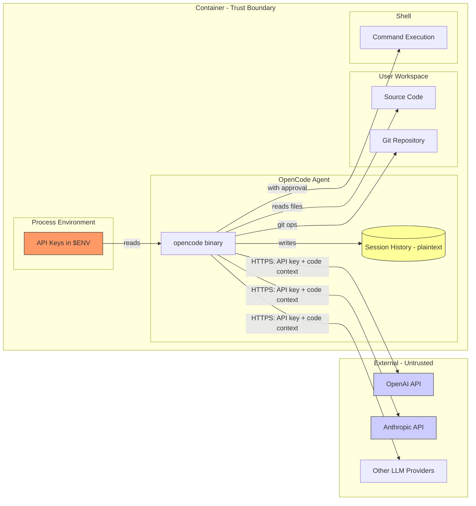
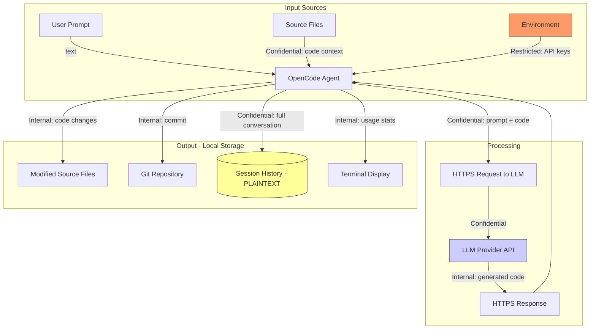
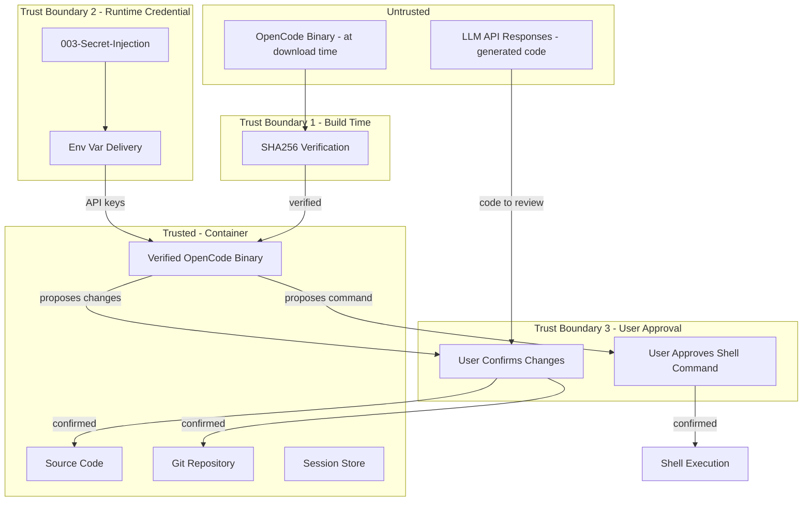

# 005-sec-terminal-ai-agent

> **Document Type:** Security Review (Lightweight)
> **Audience:** LLM agents, human reviewers
> **Status:** Draft
> **Last Updated:** 2026-01-22 <!-- @auto -->
> **Reviewer:** <!-- @human-required -->
> **Risk Level:** Medium <!-- @human-required -->

---

## Review Tier Legend

| Marker | Tier | Speckit Behavior |
|--------|------|------------------|
| 🔴 `@human-required` | Human Generated | Prompt human to author; blocks until complete |
| 🟡 `@human-review` | LLM + Human Review | LLM drafts → prompt human to confirm/edit; blocks until confirmed |
| 🟢 `@llm-autonomous` | LLM Autonomous | LLM completes; no prompt; logged for audit |
| ⚪ `@auto` | Auto-generated | System fills (timestamps, links); no prompt |

---

## Severity Definitions

| Level | Label | Definition |
|-------|-------|------------|
| 🔴 | **Critical** | Immediate exploitation risk; data breach or system compromise likely |
| 🟠 | **High** | Significant risk; exploitation possible with moderate effort |
| 🟡 | **Medium** | Notable risk; exploitation requires specific conditions |
| 🟢 | **Low** | Minor risk; limited impact or unlikely exploitation |

---

## Linkage ⚪ `@auto`

| Document | ID | Relationship |
|----------|-----|--------------|
| Parent PRD | 005-prd-terminal-ai-agent.md | Feature being reviewed |
| Architecture Decision Record | 005-ard-terminal-ai-agent.md | Technical implementation |

---

## Purpose

This is a **lightweight security review** intended to catch obvious security concerns early in the product lifecycle. It is NOT a comprehensive threat model. Full threat modeling should occur during implementation when infrastructure-as-code and concrete implementations exist.

**This review answers three questions:**
1. What does this feature expose to attackers?
2. What data does it touch, and how sensitive is that data?
3. What's the impact if something goes wrong?

**Scope of this review:**
- ✅ Attack surface identification
- ✅ Data classification
- ✅ High-level CIA assessment
- ❌ Detailed threat enumeration (deferred to implementation)
- ❌ Penetration testing (deferred to implementation)
- ❌ Compliance audit (separate process)

---

## Feature Security Summary

### One-line Summary 🔴 `@human-required`
> This feature installs a third-party Go binary that sends local source code context to external LLM APIs using user-provided API keys, creating credential exposure and data exfiltration attack surfaces.

### Risk Assessment 🔴 `@human-required`
> **Risk Level:** Medium
> **Justification:** API keys are sensitive credentials and source code leaves the trust boundary to external LLM providers, but all actions are user-initiated, no inbound network exposure exists, and the tool's privacy-focused design minimizes persistent data risks.

---

## Attack Surface Analysis

### Exposure Points 🟡 `@human-review`

| Exposure Type | Details | Authentication | Authorization | Notes |
|---------------|---------|----------------|---------------|-------|
| Outbound HTTPS | LLM provider API calls (OpenAI, Anthropic, etc.) | Yes - API key in header | Provider-side | Source code sent as context |
| Environment Variables | API keys stored in process environment | — | Container user | Readable via /proc/self/environ |
| Local Filesystem (write) | Session history at `~/.local/share/opencode/sessions/` | — | File permissions | Plaintext conversation + code snippets |
| Local Filesystem (read) | Project source code read for context | — | File permissions | Entire project tree accessible |
| Shell Command Execution | Agent can execute arbitrary commands (with approval) | — | User approval gate | S-2: explicit user consent required |
| Git Operations | Auto-commit, diff, log | — | Git config | Writes to repo history |

### Attack Surface Diagram 🟢 `@llm-autonomous`



### Exposure Checklist 🟢 `@llm-autonomous`

- [x] **Internet-facing endpoints require authentication** — outbound only; API keys authenticate to providers
- [x] **No sensitive data in URL parameters** — API keys sent in headers, not query strings
- [N/A] **File uploads validated** — no file uploads to external services
- [N/A] **Rate limiting configured** — no inbound endpoints
- [N/A] **CORS policy is restrictive** — no web endpoints
- [x] **No debug/admin endpoints exposed** — CLI tool, no network listeners
- [N/A] **Webhooks validate signatures** — no webhooks

---

## Data Flow Analysis

### Data Inventory 🟡 `@human-review`

| Data Element | PRD Entity | Classification | Source | Destination | Retention | Encrypted Rest | Encrypted Transit | Residency |
|--------------|------------|----------------|--------|-------------|-----------|----------------|-------------------|-----------|
| LLM API Keys | M-8 env vars | Restricted | 003-secret-injection | Process memory | Session lifetime | No (env var) | Yes (HTTPS) | Container |
| Source code context | M-5 file reads | Confidential | Local filesystem | LLM Provider APIs | Provider-dependent | No | Yes (HTTPS) | External (provider) |
| Generated code | M-2 output | Internal | LLM Provider APIs | Local filesystem | Permanent (written to files) | No | Yes (HTTPS) | Container |
| Conversation history | S-1 sessions | Confidential | User input + responses | Local filesystem | Container lifetime | No (plaintext) | N/A (local) | Container |
| Git commit data | M-3 commits | Internal | Agent operations | Local git repo | Permanent | No | N/A (local) | Container |
| Token usage stats | S-5 display | Internal | LLM Provider APIs | Terminal output | Session only | N/A | Yes (HTTPS) | Container |
| Shell command output | S-2 execution | Confidential | Command execution | Terminal + session | Session | No | N/A (local) | Container |

### Data Classification Reference 🟢 `@llm-autonomous`

| Level | Label | Description | Examples | Handling Requirements |
|-------|-------|-------------|----------|----------------------|
| 1 | **Public** | No impact if disclosed | Marketing content, public docs | No special handling |
| 2 | **Internal** | Minor impact if disclosed | Generated code, token stats, git metadata | Access controls, no public exposure |
| 3 | **Confidential** | Significant impact if disclosed | Source code, conversation history, shell output | Encryption, audit logging, access controls |
| 4 | **Restricted** | Severe impact if disclosed | API keys, credentials | Encryption, strict access, no persistence |

### Data Flow Diagram 🟢 `@llm-autonomous`



### Data Handling Checklist 🟢 `@llm-autonomous`

- [x] **No Restricted data stored unless absolutely required** — API keys in memory only, never persisted
- [ ] **Confidential data encrypted at rest** — ⚠️ Session history is plaintext (accepted risk for MVP)
- [x] **All data encrypted in transit (TLS 1.2+)** — HTTPS to all LLM providers
- [N/A] **PII has defined retention policy** — no PII collected
- [ ] **Logs do not contain Confidential/Restricted data** — ⚠️ Session logs may contain code snippets
- [x] **Secrets are not hardcoded** — env vars from 003-secret-injection
- [x] **Data minimization applied** — only reads files relevant to prompt context
- [N/A] **Data residency requirements documented** — no regulatory data

---

## Third-Party & Supply Chain 🟡 `@human-review`

### New External Services

| Service | Purpose | Data Shared | Communication | Approved? |
|---------|---------|-------------|---------------|-----------|
| OpenAI API | LLM inference | Code context + prompts | HTTPS/TLS 1.2+ | Pending (user configures) |
| Anthropic API | LLM inference | Code context + prompts | HTTPS/TLS 1.2+ | Pending (user configures) |
| Other LLM providers | LLM inference (75+ options) | Code context + prompts | HTTPS/TLS 1.2+ | User responsibility |
| GitHub Releases | Binary download (build-time only) | None | HTTPS/TLS 1.2+ | ✅ Approved |

### New Libraries/Dependencies

| Library | Version | License | Purpose | Security Check |
|---------|---------|---------|---------|----------------|
| OpenCode | Pinned release | MIT | Terminal AI agent | ⚠️ Review — SHA256 verified binary; source not audited |

### Supply Chain Checklist

- [x] **All new services use encrypted communication** — HTTPS for all API calls
- [ ] **Service agreements/ToS reviewed** — ⚠️ LLM provider ToS varies; user responsibility
- [x] **Dependencies have acceptable licenses** — MIT
- [x] **Dependencies are actively maintained** — 70k+ stars, frequent releases
- [x] **No known critical vulnerabilities** — checked at time of review
- [x] **Binary integrity verified** — SHA256 checksum validation at build time

### Supply Chain Risk: curl|bash Mitigation

The original PRD proposed `curl -fsSL https://opencode.ai/install | bash`. This pattern is **rejected** in favor of:

```dockerfile
# Pinned version + SHA256 verification
ARG OPENCODE_VERSION=v0.x.x
ARG OPENCODE_SHA256=<checksum>
RUN curl -fsSL "https://github.com/opencode-ai/opencode/releases/download/${OPENCODE_VERSION}/opencode-linux-$(dpkg --print-architecture)" \
    -o /usr/local/bin/opencode \
    && echo "${OPENCODE_SHA256}  /usr/local/bin/opencode" | sha256sum -c - \
    && chmod +x /usr/local/bin/opencode
```

**Residual risk:** GitHub account compromise could replace a release binary. Mitigated by: checksum pinned in version control, requiring explicit PR to update.

---

## CIA Impact Assessment

### Confidentiality 🟡 `@human-review`

> **What could be disclosed?**

| Asset at Risk | Classification | Exposure Scenario | Impact | Likelihood |
|---------------|----------------|-------------------|--------|------------|
| LLM API keys | Restricted | Env var logged, /proc exposure, error message leak | High | Low |
| Source code | Confidential | Sent to LLM provider; provider data breach; session files accessed | Medium | Medium |
| Conversation history | Confidential | Session files read by unauthorized process in container | Medium | Low |
| Shell command output | Confidential | Captured in session history; sensitive data in command output | Medium | Low |

**Confidentiality Risk Level:** Medium

### Integrity 🟡 `@human-review`

> **What could be modified or corrupted?**

| Asset at Risk | Modification Scenario | Impact | Likelihood |
|---------------|----------------------|--------|------------|
| Source code files | Malicious LLM response writes harmful code; compromised binary modifies files | High | Low |
| Git history | Agent creates commits with malicious content or misleading messages | Medium | Low |
| OpenCode binary | Supply chain attack replaces binary with malicious version | High | Low (SHA256 mitigates) |
| Config file | Tampered config redirects API calls to attacker-controlled endpoint | High | Low |

**Integrity Risk Level:** Medium

### Availability 🟡 `@human-review`

> **What could be disrupted?**

| Service/Function | Disruption Scenario | Impact | Likelihood |
|------------------|---------------------|--------|------------|
| AI agent functionality | LLM provider API outage | Low | Medium |
| AI agent functionality | API key quota exhausted | Low | Medium |
| Container build | GitHub releases unavailable | Medium | Low |
| Developer workflow | Agent enters infinite loop consuming tokens | Low | Low |

**Availability Risk Level:** Low

### CIA Summary 🟢 `@llm-autonomous`

| Dimension | Risk Level | Primary Concern | Mitigation Priority |
|-----------|------------|-----------------|---------------------|
| **Confidentiality** | Medium | Source code sent to external APIs | Medium — user-initiated, provider-dependent |
| **Integrity** | Medium | Supply chain binary compromise | High — mitigated by SHA256 verification |
| **Availability** | Low | LLM provider outage | Low — graceful failure, not critical path |

**Overall CIA Risk:** Medium — *Source code confidentiality is the primary concern; integrity risks are mitigated by SHA256 verification; availability impact is low since the agent is not on the critical path.*

---

## Trust Boundaries 🟡 `@human-review`



**Key trust boundaries:**
1. **Build-time binary verification** — untrusted download becomes trusted binary via SHA256 check
2. **Runtime credential injection** — secrets decrypted and delivered via 003-secret-injection
3. **User approval gate** — LLM-generated code and shell commands require explicit user confirmation before execution

### Trust Boundary Checklist 🟢 `@llm-autonomous`

- [x] **All input from untrusted sources is validated** — LLM responses reviewed by user before application
- [x] **External API responses are validated** — user approves all code changes before write
- [x] **Authorization checked at data access, not just entry point** — file writes require approval; shell commands require approval
- [N/A] **Service-to-service calls are authenticated** — single-process CLI tool

---

## Known Risks & Mitigations 🟡 `@human-review`

| ID | Risk Description | Severity | Mitigation | Status | Owner |
|----|------------------|----------|------------|--------|-------|
| R1 | API keys exposed via /proc/self/environ or error logs | 🟠 High | 003-secret-injection handles delivery; agent must not log env vars; container isolation limits /proc access | Mitigated | — |
| R2 | Source code sent to LLM providers subject to their data policies | 🟡 Medium | User configures provider intentionally; OpenCode privacy-focused (no code storage); user can use local models (Ollama) | Accepted | — |
| R3 | Compromised binary via supply chain attack | 🟡 Medium | SHA256 checksum verification at build time; pinned version in VCS | Mitigated | — |
| R4 | Session history contains sensitive code in plaintext | 🟡 Medium | Container-local storage only; file permissions restrict access; future iteration to add encryption | Accepted (MVP) | — |
| R5 | Shell command execution could be exploited via prompt injection | 🟡 Medium | User approval gate required for all shell commands (S-2); user reviews command before execution | Mitigated | — |
| R6 | Malicious LLM response injects harmful code | 🟡 Medium | User reviews all proposed changes before application; git auto-commit provides rollback point | Mitigated | — |
| R7 | Config file tampering redirects API calls to attacker endpoint | 🟢 Low | Config managed by Chezmoi (002); container filesystem permissions; no runtime config reload from untrusted sources | Mitigated | — |

### Risk Acceptance 🔴 `@human-required`

| Risk ID | Accepted By | Date | Justification | Review Date |
|---------|-------------|------|---------------|-------------|
| R2 | <!-- @human-required --> | | User-initiated action; provider selection is explicit; alternative is no AI tooling | 2026-07-22 |
| R4 | <!-- @human-required --> | | MVP trade-off; container-local only; encryption planned for future iteration | 2026-04-22 |

---

## Security Requirements 🟡 `@human-review`

### Authentication & Authorization

| Req ID | Requirement | PRD AC | Verification Method |
|--------|-------------|--------|---------------------|
| SEC-1 | API keys shall only be read from environment variables, never from files or user input | AC-2 | Code review + integration test |
| SEC-2 | Shell command execution requires explicit user approval before execution | — (S-2) | Integration test |

### Data Protection

| Req ID | Requirement | PRD AC | Verification Method |
|--------|-------------|--------|---------------------|
| SEC-3 | Binary integrity verified via SHA256 checksum during container build | AC-6 | Build pipeline test |
| SEC-4 | API keys shall not appear in logs, error messages, session history, or git commits | AC-2 | Grep scan of session files + log review |
| SEC-5 | All LLM API communication shall use HTTPS (TLS 1.2+) | — | Network trace verification |
| SEC-6 | Session history files shall have 0600 permissions (owner read/write only) | AC-9 | File permission check |

### Input Validation

| Req ID | Requirement | PRD AC | Verification Method |
|--------|-------------|--------|---------------------|
| SEC-7 | LLM-generated code changes must be displayed for user review before filesystem write | AC-3, AC-4 | Functional test |
| SEC-8 | Shell commands proposed by the agent must be displayed for user approval before execution | — (S-2) | Functional test |

### Operational Security

| Req ID | Requirement | PRD AC | Verification Method |
|--------|-------------|--------|---------------------|
| SEC-9 | Container build shall fail if SHA256 checksum verification fails | AC-6 | Build pipeline test (corrupt checksum) |
| SEC-10 | Agent shall not auto-start on container entry; must be user-initiated | AC-6 | Entrypoint review |
| SEC-11 | No default LLM provider or API key shall be configured in the image | AC-2 | Image inspection |

---

## Compliance Considerations 🟡 `@human-review`

| Regulation | Applicable? | Relevant Requirements | N/A Justification |
|------------|-------------|----------------------|-------------------|
| GDPR | N/A | — | No PII collected or processed; source code is not personal data; user configures own API keys |
| CCPA | N/A | — | No consumer personal information collected |
| SOC 2 | N/A | — | Development tool, not production service; no customer data |
| HIPAA | N/A | — | No health information processed |
| PCI-DSS | N/A | — | No payment data processed |
| Export Control | ⚠️ Review | Code may be sent to foreign LLM providers | User responsibility to verify provider jurisdiction for sensitive projects |

---

## Review Findings

### Issues Identified 🟡 `@human-review`

| ID | Finding | Severity | Category | Recommendation | Status |
|----|---------|----------|----------|----------------|--------|
| F1 | Session history stored as plaintext may contain sensitive code snippets | 🟡 Medium | Data Protection | Encrypt session files at rest in future iteration; restrict file permissions to 0600 for MVP | Accepted (MVP) |
| F2 | Original PRD proposed curl\|bash install pattern | 🟡 Medium | Supply Chain | Replaced with SHA256-verified release download in ARD | Resolved |
| F3 | Source code sent to external LLM APIs without explicit consent mechanism | 🟡 Medium | Confidentiality | Accepted: API key configuration implies consent; document data flow in user-facing docs | Accepted |
| F4 | /proc/self/environ exposes API keys to same-user processes in container | 🟢 Low | Credential Exposure | Container runs single user; restrict /proc access if multi-tenant in future | Accepted |
| F5 | LLM prompt injection could generate malicious code | 🟢 Low | Integrity | User reviews all changes before application; git provides rollback | Mitigated |

### Positive Observations 🟢 `@llm-autonomous`

- OpenCode's privacy-focused design (no code/context storage by the tool itself) reduces data retention risk
- User approval gate for both code changes and shell commands provides defense-in-depth
- SHA256 binary verification is a strong supply chain control for a single-binary tool
- Environment variable approach for API keys avoids disk persistence of credentials
- Auto-commit creates git history that enables forensic analysis and rollback if needed
- No inbound network exposure — tool only makes outbound HTTPS calls

---

## Open Questions 🟡 `@human-review`

- [ ] **Q1:** Should session history encryption be prioritized for a near-term follow-up, or is it acceptable to defer indefinitely?
- [ ] **Q2:** For enterprise/sensitive environments, should there be a configuration option to disable sending code context to external APIs (local-only mode with Ollama)?
- [ ] **Q3:** Should the agent be restricted from reading certain file patterns (e.g., `.env`, `credentials.*`, `*.pem`) to prevent accidental credential inclusion in LLM context?

---

## Changelog ⚪ `@auto`

| Version | Date | Author | Changes |
|---------|------|--------|---------|
| 0.1 | 2026-01-22 | LLM | Initial security review |

---

## Review Sign-off 🔴 `@human-required`

| Role | Name | Date | Decision |
|------|------|------|----------|
| Security Reviewer | | | [Approved / Approved with conditions / Rejected] |
| Feature Owner | | | [Acknowledged] |

### Conditions for Approval (if applicable) 🔴 `@human-required`

- [ ] Session history file permissions set to 0600
- [ ] Verify OpenCode does not log API keys in any verbosity mode
- [ ] Document data flow (code → LLM provider) in user-facing README

---

## Security Requirements Traceability 🟢 `@llm-autonomous`

| SEC Req ID | PRD Req ID | PRD AC ID | Test Type | Test Location |
|------------|------------|-----------|-----------|---------------|
| SEC-1 | M-8 | AC-2 | Integration | tests/api_key_source_test |
| SEC-2 | S-2 | — | Integration | tests/shell_approval_test |
| SEC-3 | M-6 | AC-6 | Build | Dockerfile checksum step |
| SEC-4 | M-8 | AC-2 | Integration | tests/credential_leak_test |
| SEC-5 | — | — | Integration | tests/tls_verification_test |
| SEC-6 | S-1 | AC-9 | Unit | tests/file_permissions_test |
| SEC-7 | M-2 | AC-3, AC-4 | Functional | tests/code_review_gate_test |
| SEC-8 | S-2 | — | Functional | tests/shell_gate_test |
| SEC-9 | M-6 | AC-6 | Build | tests/build_integrity_test |
| SEC-10 | M-6 | AC-6 | Integration | tests/entrypoint_test |
| SEC-11 | M-8 | AC-2 | Build | tests/image_inspection_test |

---

## Review Checklist 🟢 `@llm-autonomous`

Before marking as Approved:
- [x] Attack surface documented with auth/authz status for each exposure
- [x] Exposure Points table has no contradictory rows
- [x] All PRD Data Model entities appear in Data Inventory (N/A — no formal data model)
- [x] All data elements are classified using the 4-tier model
- [x] Third-party dependencies and services are listed
- [x] CIA impact is assessed with Low/Medium/High ratings
- [x] Trust boundaries are identified
- [x] Security requirements have verification methods specified
- [x] Security requirements trace to PRD ACs where applicable
- [x] No Critical/High findings remain Open (R1 mitigated; no Critical findings)
- [x] Compliance N/A items have justification
- [ ] Risk acceptance has named approver and review date (awaiting human sign-off)
