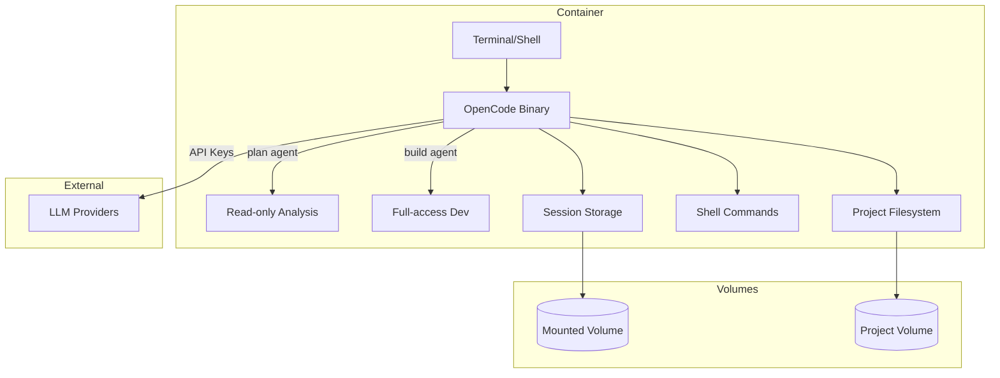
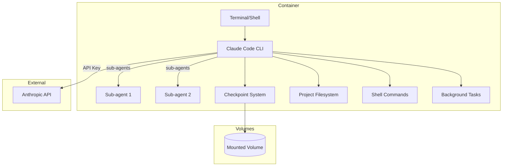
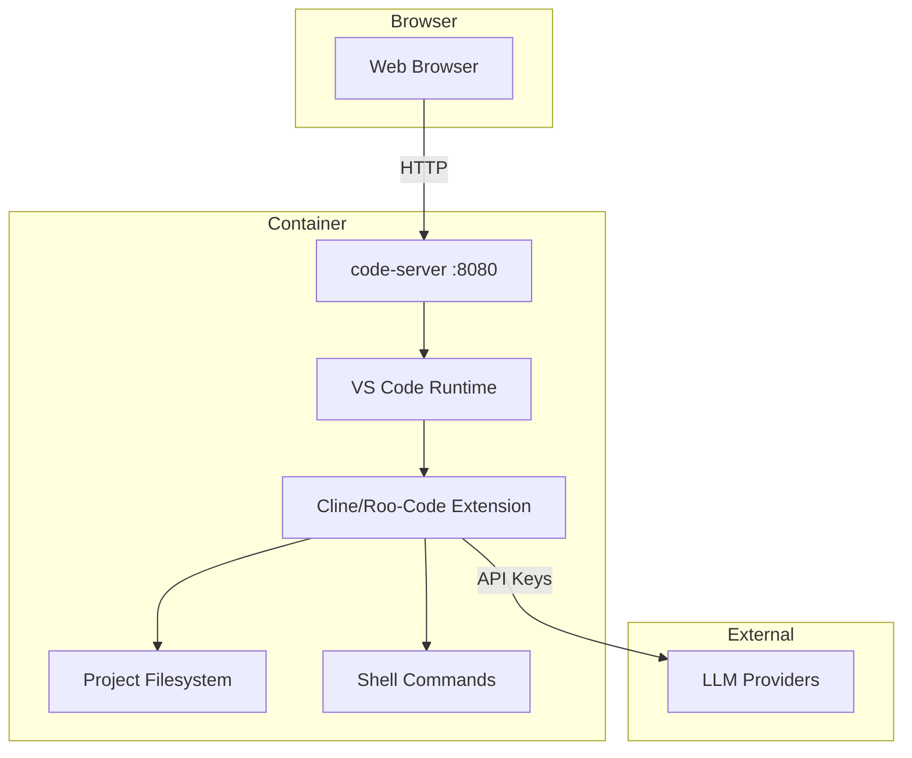
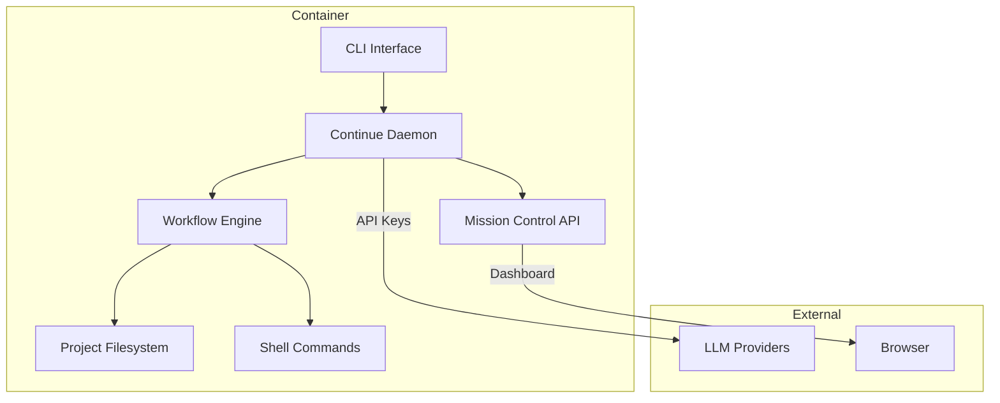
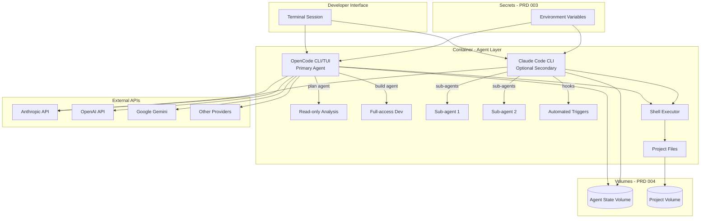
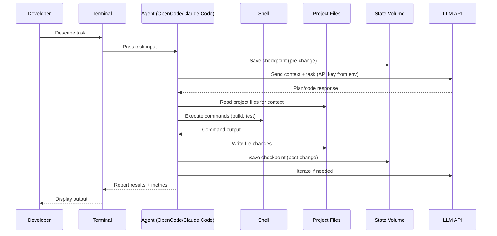
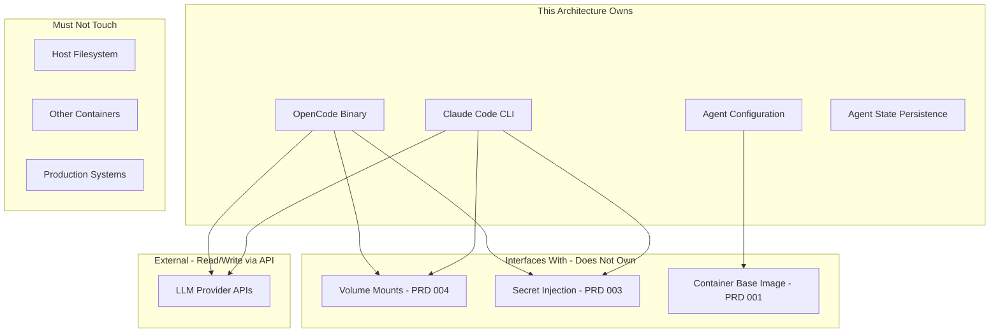

# 006-ard-agentic-assistant

> **Document Type:** Architecture Decision Record
> **Audience:** LLM agents, human reviewers
> **Status:** Proposed
> **Last Updated:** 2026-01-22 <!-- @auto -->
> **Owner:** Brian Luby <!-- @human-required -->
> **Deciders:** Brian Luby <!-- @human-required -->

---

## Review Tier Legend

| Marker | Tier | Speckit Behavior |
|--------|------|------------------|
| 🔴 `@human-required` | Human Generated | Prompt human to author; blocks until complete |
| 🟡 `@human-review` | LLM + Human Review | LLM drafts → prompt human to confirm/edit; blocks until confirmed |
| 🟢 `@llm-autonomous` | LLM Autonomous | LLM completes; no prompt; logged for audit |
| ⚪ `@auto` | Auto-generated | System fills (timestamps, links); no prompt |

---

## Document Completion Order

> ⚠️ **For LLM Agents:** Complete sections in this order. Do not fill downstream sections until upstream human-required inputs exist.

1. **Summary (Decision)** → requires human input first
2. **Context (Problem Space)** → requires human input
3. **Decision Drivers** → requires human input (prioritized)
4. **Driving Requirements** → extract from PRD, human confirms
5. **Options Considered** → LLM drafts after drivers exist, human reviews
6. **Decision (Selected + Rationale)** → requires human decision
7. **Implementation Guardrails** → LLM drafts, human reviews
8. **Everything else** → can proceed after decision is made

---

## Linkage ⚪ `@auto`

| Document | ID | Relationship |
|----------|-----|--------------|
| Parent PRD | 006-prd-agentic-assistant.md | Requirements this architecture satisfies |
| Security Review | 006-sec-agentic-assistant.md | Security implications of this decision |
| Supersedes | — | N/A (greenfield) |
| Superseded By | — | |

---

## Summary

### Decision 🔴 `@human-required`
> Install OpenCode (MIT, CLI/TUI-native Go binary) as the primary agentic assistant, with Claude Code as an optional secondary for Anthropic subscribers, both deployed as CLI binaries within the container image.

### TL;DR for Agents 🟡 `@human-review`
> The agentic assistant layer uses CLI-native binaries installed directly in the container Dockerfile. OpenCode is the primary tool (MIT license, multi-provider, single Go binary). Claude Code is available as an opt-in secondary for users with Anthropic subscriptions who need its superior checkpoint/sub-agent features. No code-server or web UI layer is required for the base agent functionality. Agent state persists to mounted volumes; API keys are injected via environment variables (PRD 003 pattern). Agents must NEVER be granted host filesystem access or network access beyond LLM provider APIs.

---

## Context

### Problem Space 🔴 `@human-required`
The container dev environment needs an autonomous AI coding agent that can handle complex multi-file tasks, run for extended periods without supervision, and safely explore solutions with checkpoint/rollback capability. This creates two coupled architectural decisions:

1. **Which tool(s)** — 5 candidates exist with different license models, provider support, and maturity levels
2. **How to integrate** — 3 deployment modes (CLI binary, code-server extension, headless daemon) each with different complexity/capability tradeoffs

These must be decided together because the tool choice constrains the deployment mode (e.g., Roo-Code requires code-server; OpenCode is CLI-only).

### Decision Scope 🟡 `@human-review`

**This ARD decides:**
- Which agentic assistant tool(s) to install in the container
- The deployment mode (CLI/TUI vs code-server vs headless)
- How the agent is installed (Dockerfile layer vs runtime install)
- How agent state is persisted (volume mount strategy)
- How API keys reach the agent (env var pattern)

**This ARD does NOT decide:**
- Which LLM models to use within the agent (user configuration)
- MCP server selection (separate extensibility concern)
- IDE integration beyond the agent itself (covered by other PRDs)
- Agent workflow patterns or prompt strategies (user concern)
- Git worktree support (deferred to 007-prd-git-worktree-compat)

### Current State 🟢 `@llm-autonomous`
N/A — greenfield implementation. No agentic assistant currently exists in the container environment. Developers must manually perform all coding tasks or use host-side AI tools that cannot access the container's filesystem directly.

### Driving Requirements 🟡 `@human-review`

| PRD Req ID | Requirement Summary | Architectural Implication |
|------------|---------------------|---------------------------|
| M-1 | Autonomous operation 30+ minutes | Agent must handle long-running execution without session timeouts |
| M-3 | Checkpoint/rollback system | Requires persistent storage for snapshots; git-based or proprietary |
| M-4 | Container-compatible, no GUI | Eliminates approaches requiring X11; must be CLI/TUI or web-based |
| M-6 | API keys via environment variables | Agent config must read from env; no interactive key prompts |
| M-9 | Execute shell commands | Agent needs shell access within container; security boundary is Docker |
| M-10 | Open source or permissive license | Primary tool must be MIT/Apache; proprietary only as secondary |
| S-1 | Sub-agent/parallel workflows | Architecture must support concurrent agent processes |
| S-3 | MCP integration | Agent must expose MCP client capability |
| S-4 | Multiple LLM providers | Cannot be locked to single provider |
| S-6 | Session persistence | Agent state must survive container restarts via volumes |

**PRD Constraints inherited:**
- Must run inside Debian Bookworm-slim container with Python 3.14+, Node.js 22.x
- Zero host-side installations; fully self-contained
- API keys injected via PRD 003 secret injection pattern
- State stored in PRD 004 volume mounts

---

## Decision Drivers 🔴 `@human-required`

1. **Container-native operation:** Must work as CLI/TUI in a terminal without web layers or GUI *(M-4)*
2. **Open source license:** Primary tool must be MIT/Apache for unrestricted commercial use *(M-10)*
3. **Multi-provider flexibility:** Not locked to a single LLM vendor *(S-4)*
4. **Autonomous reliability:** Checkpoint/rollback must protect against failed changes *(M-3)*
5. **Minimal integration complexity:** Fewest additional layers, services, or dependencies
6. **Extensibility:** MCP support and sub-agent capability for future growth *(S-1, S-3)*
7. **Community & maintenance:** Active development, responsive maintainers, growing adoption

---

## Options Considered 🟡 `@human-review`

### Option 0: Status Quo / Do Nothing

**Description:** No agentic assistant installed. Developers use host-side AI tools or perform all tasks manually within the container.

| Driver | Rating | Notes |
|--------|--------|-------|
| Container-native | ❌ Poor | No agent exists; host tools can't access container fs |
| Open source | N/A | No tool selected |
| Multi-provider | ❌ Poor | No capability |
| Autonomous reliability | ❌ Poor | No checkpoint system |
| Minimal complexity | ✅ Good | Nothing to install |
| Extensibility | ❌ Poor | No foundation to extend |

**Why not viable:** The PRD explicitly requires autonomous agentic capability (M-1 through M-10). Not implementing an agent fails all must-have requirements.

---

### Option 1: OpenCode (CLI/TUI-native, primary)

**Description:** Install OpenCode as a single Go binary in the container. It provides a TUI interface with built-in `plan` and `build` agents, supports 7+ LLM providers, and includes session persistence. MIT license.



| Driver | Rating | Notes |
|--------|--------|-------|
| Container-native | ✅ Good | Single Go binary; no deps; TUI works in any terminal |
| Open source | ✅ Good | MIT license |
| Multi-provider | ✅ Good | OpenAI, Anthropic, Gemini, Bedrock, Groq, Azure, OpenRouter |
| Autonomous reliability | ⚠️ Medium | Git-based checkpoints (less mature than Claude Code's native system) |
| Minimal complexity | ✅ Good | Single binary install via curl; ~105MB |
| Extensibility | ⚠️ Medium | Tool integration exists; MCP support less mature |
| Community | ✅ Good | 70k+ GitHub stars; active development |

**Pros:**
- Single binary, zero runtime dependencies beyond the container base
- Multi-provider from day one; can start with free models
- Vim-like keybindings natural for terminal users
- Built-in plan/build agent separation prevents accidental changes during analysis
- MIT license with no usage restrictions

**Cons:**
- Checkpoint system relies on git (less granular than Claude Code's native snapshots)
- MCP support less mature than Cline or Claude Code
- Sub-agent parallelism not as developed as Claude Code
- Newer project; fewer enterprise case studies

---

### Option 2: Claude Code (CLI-native, Anthropic-only)

**Description:** Install Claude Code CLI as Node.js package. It provides native checkpoints, sub-agents, hooks, and background task handling. Requires Anthropic Pro/Max/Teams subscription.



| Driver | Rating | Notes |
|--------|--------|-------|
| Container-native | ✅ Good | CLI-first; designed for terminal; runs via Node.js |
| Open source | ❌ Poor | Proprietary; requires paid subscription |
| Multi-provider | ❌ Poor | Anthropic Claude only |
| Autonomous reliability | ✅ Good | Native checkpoints; sub-agents; hooks; best-in-class |
| Minimal complexity | ✅ Good | npm install; requires Node.js (already in base image) |
| Extensibility | ✅ Good | MCP support; hooks system; sub-agent delegation |
| Community | ✅ Good | Anthropic-backed; active development; growing adoption |

**Pros:**
- Most mature autonomous features (checkpoints, sub-agents, hooks, background tasks)
- Auto-accept mode specifically designed for extended autonomous operation
- Native MCP integration
- Anthropic-optimized prompting and tool use
- Active development with frequent releases

**Cons:**
- Proprietary license; requires paid Anthropic subscription
- Single provider (Anthropic Claude only)
- Subscription cost adds to project overhead
- Vendor lock-in risk

---

### Option 3: code-server + Cline/Roo-Code extension

**Description:** Install code-server (containerized VS Code) and add Cline or Roo-Code as a VS Code extension. Accessed via web browser. Provides rich GUI for agent interaction.



| Driver | Rating | Notes |
|--------|--------|-------|
| Container-native | ⚠️ Medium | Runs in container but requires browser access; adds web server |
| Open source | ✅ Good | Apache 2.0 (both Cline and Roo-Code) |
| Multi-provider | ✅ Good | Both support multiple providers via OpenRouter |
| Autonomous reliability | ⚠️ Medium | Git-based checkpoints; Roo-Code better at multi-file coherence |
| Minimal complexity | ❌ Poor | Adds ~500MB (code-server); web server; port mapping; browser dependency |
| Extensibility | ✅ Good | Full VS Code extension ecosystem; MCP support (Cline) |
| Community | ✅ Good | Cline: 4M+ users; Roo-Code: strong enterprise adoption |

**Pros:**
- Rich visual interface for reviewing agent actions
- Full VS Code extension ecosystem available
- Cline has mature MCP support and human-in-the-loop UI
- Roo-Code excels at multi-file reliability

**Cons:**
- Adds significant complexity (code-server layer, port mapping, browser requirement)
- ~500MB additional container size
- Web server is an additional attack surface
- Not truly headless; requires browser for interaction
- Overkill if primary use is terminal-based autonomous operation

---

### Option 4: Continue (Headless daemon)

**Description:** Install Continue in headless/CLI mode as a background agent service. Controlled via CLI commands or Mission Control dashboard. Designed for CI/CD and async workflows.



| Driver | Rating | Notes |
|--------|--------|-------|
| Container-native | ✅ Good | Headless mode designed for containers and CI/CD |
| Open source | ✅ Good | Apache 2.0 |
| Multi-provider | ✅ Good | Multiple providers; air-gapped option with local LLMs |
| Autonomous reliability | ⚠️ Medium | Background agents exist; checkpoint maturity unclear |
| Minimal complexity | ⚠️ Medium | Daemon process; more moving parts than single binary |
| Extensibility | ✅ Good | Pre-built workflows (GitHub, Sentry, Snyk, Linear) |
| Community | ⚠️ Medium | Established project but agent mode is newer |

**Pros:**
- Purpose-built for headless/containerized operation
- Mission Control dashboard for monitoring multiple agents
- Pre-built integrations with developer tools (GitHub, Sentry, etc.)
- Air-gapped deployment option (local LLMs)
- CI/CD-first design philosophy

**Cons:**
- Agent mode is newer and less battle-tested than core IDE features
- Daemon architecture adds operational complexity
- Fewer community examples of autonomous coding use cases
- Checkpoint system less documented than competitors

---

## Decision

### Selected Option 🔴 `@human-required`
> **Option 1 (OpenCode) as primary + Option 2 (Claude Code) as optional secondary**

### Rationale 🔴 `@human-required`

OpenCode satisfies all must-have requirements while providing the simplest integration path: a single Go binary with zero runtime dependencies, MIT license, and multi-provider support from day one. Its built-in plan/build agent separation maps directly to the PRD's workflow (analysis before execution).

Claude Code is included as an optional layer for users with Anthropic subscriptions because it provides the most mature autonomous features (native checkpoints, sub-agents, hooks) that no other tool currently matches. This dual-tool approach avoids vendor lock-in (M-10, S-4) while not sacrificing best-in-class autonomous capability for willing subscribers.

The code-server option (Option 3) is deferred—it can be layered on later if VS Code extension UIs prove necessary, without changing the core architecture. Continue (Option 4) is the strongest alternative if CI/CD integration becomes critical, but its agent mode needs more maturity.

#### Simplest Implementation Comparison 🟡 `@human-review`

| Aspect | Simplest Possible | Selected Option | Justification for Complexity |
|--------|-------------------|-----------------|------------------------------|
| Components | Single agent binary | Two agent binaries (OpenCode + Claude Code) | M-10 requires OSS primary; best autonomous features are proprietary (M-3, S-1) |
| Dependencies | curl install only | curl + npm install | Claude Code requires Node.js (already in base image per PRD 001) |
| Configuration | Single config file | Two config files + env vars | Each tool has its own config format; env vars are the common interface |
| Persistence | Git-only checkpoints | Git checkpoints + Claude Code native checkpoints | Native checkpoints are more granular and reliable (M-3) |

**Complexity justified by:** The dual-tool approach costs ~155MB total disk and one extra config file, but provides both open-source freedom (primary use case) and best-in-class autonomous capability (power users) without architectural changes.

### Architecture Diagram 🟡 `@human-review`



---

## Technical Specification

### Component Overview 🟡 `@human-review`

| Component | Responsibility | Interface | Dependencies |
|-----------|---------------|-----------|--------------|
| OpenCode Binary | Primary agentic assistant; multi-provider LLM interaction | CLI/TUI (terminal) | Go binary; LLM API access |
| Claude Code CLI | Secondary agent with advanced autonomous features | CLI (terminal) | Node.js 22.x; Anthropic API key |
| Shell Executor | Runs commands on behalf of agents | POSIX shell | Container base tools |
| Agent State Volume | Persists sessions, checkpoints, config | Filesystem mount | Docker volume (PRD 004) |
| Project Volume | Source code workspace | Filesystem mount | Docker volume (PRD 004) |
| Env Var Injector | Delivers API keys to agent processes | Environment variables | PRD 003 secret injection |

### Data Flow 🟢 `@llm-autonomous`



### Interface Definitions 🟡 `@human-review`

```bash
# OpenCode invocation (primary)
# Config: ~/.config/opencode/config.json or OPENCODE_* env vars
opencode                    # Launch TUI
opencode --plan "task"      # Plan-only mode
opencode --build "task"     # Build mode (full access)

# Claude Code invocation (secondary, optional)
# Config: env vars (ANTHROPIC_API_KEY)
claude "task description"   # Interactive mode
claude --auto-accept "task" # Autonomous mode
claude --resume             # Resume previous session

# Environment variables (PRD 003 pattern)
ANTHROPIC_API_KEY=...       # Required for Claude Code
OPENAI_API_KEY=...          # Optional for OpenCode
GOOGLE_API_KEY=...          # Optional for OpenCode
OPENCODE_PROVIDER=anthropic # Default provider selection
```

### Key Algorithms/Patterns 🟡 `@human-review`

**Pattern: Checkpoint-before-change**
```
For each agent action:
1. Save current git state (stash or commit)
2. Record checkpoint metadata (timestamp, action description)
3. Execute the change
4. If change fails validation (build/test):
   a. Restore checkpoint
   b. Log failure reason
   c. Retry with modified approach or abort
5. If change succeeds:
   a. Commit atomically
   b. Mark checkpoint as "passed"
```

**Pattern: Agent selection priority**
```
On agent invocation:
1. Check if ANTHROPIC_API_KEY is set AND user has Claude Code preference
   → Use Claude Code
2. Otherwise
   → Use OpenCode with configured provider
3. If no API keys are configured
   → Use OpenCode with free-tier models
```

---

## Constraints & Boundaries

### Technical Constraints 🟡 `@human-review`

**Inherited from PRD:**
- Must run inside Debian Bookworm-slim, Python 3.14+, Node.js 22.x (PRD 001)
- API keys delivered via environment variables (PRD 003)
- State persisted to mounted volumes (PRD 004)
- No host-side dependencies; fully self-contained
- No X11/GUI; headless operation only

**Added by this Architecture:**
- **OpenCode install:** Single Go binary via curl; ~105MB; installed in Dockerfile
- **Claude Code install:** npm global package; requires Node.js 22.x (already available)
- **State directory:** `$HOME/.local/share/opencode/` and `$HOME/.claude/` mapped to volume
- **Config directory:** `$HOME/.config/opencode/` for OpenCode settings
- **Shell access:** Agent processes run as container user (not root)
- **Network:** Outbound HTTPS only to LLM provider API endpoints

### Architectural Boundaries 🟡 `@human-review`



- **Owns:** Agent binaries, agent configuration, state persistence strategy
- **Interfaces With:** Volume mounts (PRD 004), secret injection (PRD 003), base image (PRD 001)
- **Must Not Touch:** Host filesystem, other containers, production systems, container runtime config

### Implementation Guardrails 🟡 `@human-review`

> ⚠️ **Critical for LLM Agents:**

- [ ] **DO NOT** install agents that require X11, display servers, or GUI frameworks *(from PRD M-4)*
- [ ] **DO NOT** bake API keys into Docker images or commit them to any file *(from PRD 003, SEC)*
- [ ] **DO NOT** grant agents access outside the project workspace without explicit user configuration
- [ ] **DO NOT** run agent processes as root; use the container's non-root user
- [ ] **DO NOT** install code-server unless explicitly requested as an optional layer
- [ ] **MUST** install OpenCode as a Dockerfile layer (not runtime download) for reproducibility *(M-4)*
- [ ] **MUST** map agent state directories to persistent volumes *(S-6)*
- [ ] **MUST** read all API keys from environment variables, never from files in the image *(M-6)*
- [ ] **MUST** validate that agents start successfully in headless mode during container build/test

---

## Consequences 🟡 `@human-review`

### Positive
- CLI-native approach adds reasonable container size (~155MB total for both tools)
- Multi-provider support from day one prevents vendor lock-in
- MIT-licensed primary tool has no usage restrictions or subscription costs
- Optional Claude Code provides best-in-class features for power users without forcing everyone onto it
- Simple installation (binary + npm) means fast iteration on tool versions
- No web server layer reduces attack surface vs. code-server option

### Negative
- Two tools means two sets of configuration, two update streams, two potential failure modes
- OpenCode's checkpoint system is less mature than Claude Code's native checkpoints
- Users must learn which tool to use for which scenario (guidance needed in docs)
- Claude Code's proprietary license creates an asymmetry in the tool experience
- No visual diff/review UI (code-server would provide this; can be added later)

### Risks & Mitigations

| Risk | Likelihood | Impact | Mitigation |
|------|------------|--------|------------|
| OpenCode project stalls or pivots | Low | High | MIT license allows forking; Continue is viable alternative |
| Claude Code subscription costs escalate | Medium | Medium | OpenCode is fully functional standalone; Claude Code is optional |
| Two-tool complexity confuses users | Medium | Low | Clear documentation on when to use which; default to OpenCode |
| Go binary compatibility issues with container arch | Low | Medium | Multi-arch build support; test on both amd64 and arm64 |
| Agent state volume corruption | Low | High | Git-based checkpoints provide secondary recovery; regular backups |

---

## Implementation Guidance

### Suggested Implementation Order 🟢 `@llm-autonomous`
1. Add OpenCode binary installation to Dockerfile (curl-based install)
2. Add Claude Code npm installation to Dockerfile (conditional on build arg)
3. Create volume mount points for agent state directories
4. Configure environment variable passthrough for API keys
5. Create wrapper script (`agent` command) that selects tool based on config/env
6. Add health check that validates headless agent startup
7. Document configuration for each provider
8. Integration test: run a simple multi-file task with each agent

### Testing Strategy 🟢 `@llm-autonomous`

| Layer | Test Type | Coverage Target | Notes |
|-------|-----------|-----------------|-------|
| Unit | Agent wrapper script | 100% | Test tool selection logic, env var handling |
| Integration | Container startup | All agents | Verify headless start, no X11 deps |
| Integration | Checkpoint/restore | Happy path + failure | Git-based and native (Claude Code) |
| E2E | Multi-file refactor | 1 task per agent | Verify atomic commits, file coherence |
| E2E | Session persistence | Restart scenario | Kill container, restart, verify resume |

### Reference Implementations 🟡 `@human-review`

- [OpenCode Docker Example](https://opencode.ai/docs/installation/) *(external — verify current)*
- [Claude Code Container Usage](https://code.claude.com/docs/en/overview) *(external — verify current)*
- PRD 003 secret injection pattern *(internal — env var delivery)*
- PRD 004 volume mount strategy *(internal — state persistence)*

### Anti-patterns to Avoid 🟡 `@human-review`
- **Don't:** Install both agents unconditionally; bloats image for users who don't need Claude Code
  - **Why:** Wastes ~50MB (Claude Code) and adds Node.js dependency for users who only use OpenCode
  - **Instead:** Use Docker build arg (`--build-arg INSTALL_CLAUDE_CODE=true`) to make secondary optional

- **Don't:** Store agent config in the container image
  - **Why:** Config contains provider preferences that vary per user; rebuilds to change config
  - **Instead:** Mount config directory from volume; provide sensible defaults

- **Don't:** Use `sudo` or root for agent operations
  - **Why:** Breaks principle of least privilege; agent doesn't need root
  - **Instead:** Install tools as root during build; run as non-root user at runtime

---

## Compliance & Cross-cutting Concerns

### Security Considerations 🟡 `@human-review`
[Full details in 006-sec-agentic-assistant.md]
- **Authentication:** API keys via env vars; no agent-level auth (single-user container)
- **Authorization:** Agents run as container user; filesystem permissions limit access
- **Data handling:** API keys are Restricted data; source code is Confidential; agent must not leak either

### Observability 🟢 `@llm-autonomous`
- **Logging:** Agent output to stdout/stderr; session logs to state volume
- **Metrics:** Token usage per session (reported by both tools natively)
- **Tracing:** Shell command history logged for audit; checkpoint timestamps for recovery

### Error Handling Strategy 🟢 `@llm-autonomous`
```
Error Category → Handling Approach
├── API key missing/invalid → Fail fast with clear error message; do not start session
├── LLM rate limit → Exponential backoff; resume after cooldown
├── Checkpoint save failure → Halt all changes; alert user; do not continue without checkpoint
├── Shell command timeout → Kill process; log output; report to agent for retry decision
├── Network interruption → Pause; retry with backoff; preserve local state
└── Disk full → Halt; report; suggest cleanup of old sessions/checkpoints
```

---

## Migration Plan (if applicable) 🟡 `@human-review`

N/A — greenfield implementation. No existing agent to migrate from.

### Rollback Plan 🔴 `@human-required`

**Rollback Triggers:**
- Agent corrupts project files without viable checkpoint recovery
- Security vulnerability discovered in agent tool (CVE with active exploitation)
- Agent consistently fails to start after container rebuilds

**Rollback Decision Authority:** Brian Luby (project owner)

**Rollback Time Window:** Any time (agents are additive; removal doesn't break container base)

**Rollback Procedure:**
1. Remove agent installation lines from Dockerfile
2. Remove agent state volume mounts from docker-compose
3. Rebuild container image
4. Project files are unaffected (stored in separate project volume)
5. Agent session history is preserved in state volume (can be remounted later)

---

## Open Questions 🟡 `@human-review`

- [ ] **Q1:** Should the `agent` wrapper script default to OpenCode or require explicit tool selection?
  > **Working assumption:** Default to OpenCode; `agent --claude` for Claude Code.

- [ ] **Q2:** How should checkpoint storage be organized within the state volume?
  > **Working assumption:** `$STATE_VOLUME/opencode/sessions/` and `$STATE_VOLUME/claude/checkpoints/`

- [ ] **Q3:** Should both tools share a common MCP server configuration, or maintain separate configs?
  > **Working assumption:** Shared MCP config at `$CONFIG_VOLUME/mcp/` with tool-specific adapters.

---

## Changelog ⚪ `@auto`

| Version | Date | Author | Changes |
|---------|------|--------|---------|
| 0.1 | 2026-01-22 | Brian Luby | Initial proposal (pre-spike recommendation) |

---

## Decision Record ⚪ `@auto`

| Date | Event | Details |
|------|-------|---------|
| 2026-01-22 | Proposed | Initial draft; recommends OpenCode primary + Claude Code optional |
| — | Reviewed | Pending spike results |
| — | Accepted | Pending |

---

## Traceability Matrix 🟢 `@llm-autonomous`

| PRD Req ID | Decision Driver | Option Rating | Component | Notes |
|------------|-----------------|---------------|-----------|-------|
| M-1 | Autonomous reliability | OpenCode: ⚠️, Claude Code: ✅ | Both agents | Claude Code has more mature auto-accept |
| M-3 | Autonomous reliability | OpenCode: ⚠️, Claude Code: ✅ | Agent + State Volume | Git checkpoints vs native |
| M-4 | Container-native | OpenCode: ✅, Claude Code: ✅ | Both (CLI binaries) | No GUI deps |
| M-6 | Container-native | OpenCode: ✅, Claude Code: ✅ | Env Var Injector | Standard env var pattern |
| M-9 | — | OpenCode: ✅, Claude Code: ✅ | Shell Executor | Both have shell tool |
| M-10 | Open source license | OpenCode: ✅, Claude Code: ❌ | OpenCode Binary | MIT; Claude Code is optional |
| S-1 | Extensibility | OpenCode: ⚠️, Claude Code: ✅ | Claude Code CLI | Sub-agents are Claude Code's strength |
| S-3 | Extensibility | OpenCode: ⚠️, Claude Code: ✅ | Both agents | MCP more mature in Claude Code |
| S-4 | Multi-provider | OpenCode: ✅, Claude Code: ❌ | OpenCode Binary | 7+ providers |
| S-6 | Autonomous reliability | OpenCode: ✅, Claude Code: ✅ | Agent State Volume | Both persist sessions |

---

## Review Checklist 🟢 `@llm-autonomous`

Before marking as Accepted:
- [x] All PRD Must Have requirements appear in Driving Requirements
- [x] Option 0 (Status Quo) is documented
- [x] Simplest Implementation comparison is completed
- [x] Decision drivers are prioritized and addressed
- [x] At least 2 options were seriously considered (4 evaluated)
- [x] Constraints distinguish inherited vs. new
- [x] Component names are consistent across all diagrams and tables
- [x] Implementation guardrails reference specific PRD constraints
- [x] Rollback triggers and authority are defined
- [x] Security review is linked (006-sec-agentic-assistant.md)
- [ ] No open questions blocking implementation (3 open with working assumptions — non-blocking)
- [ ] Spike results validate option ratings (pending)
