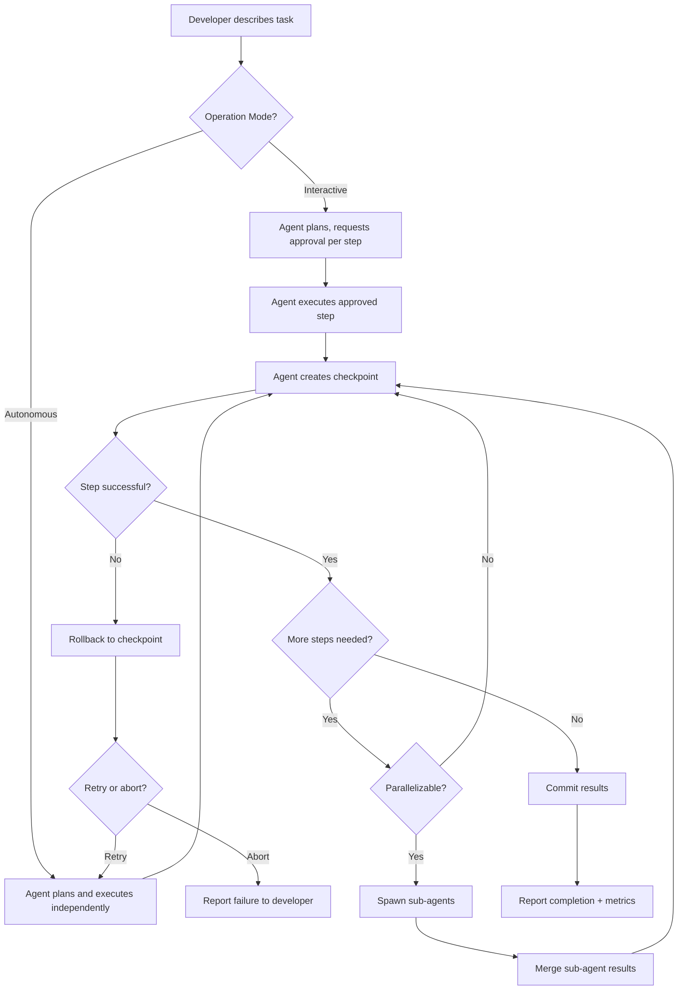
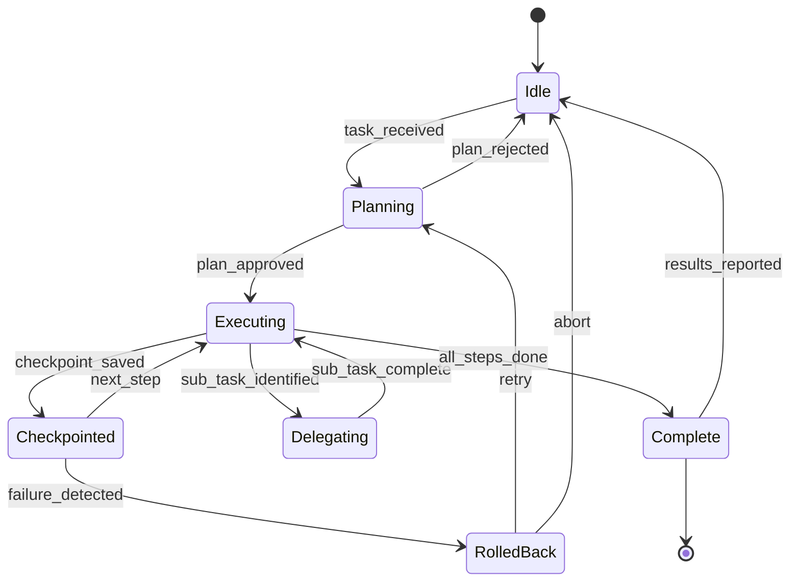
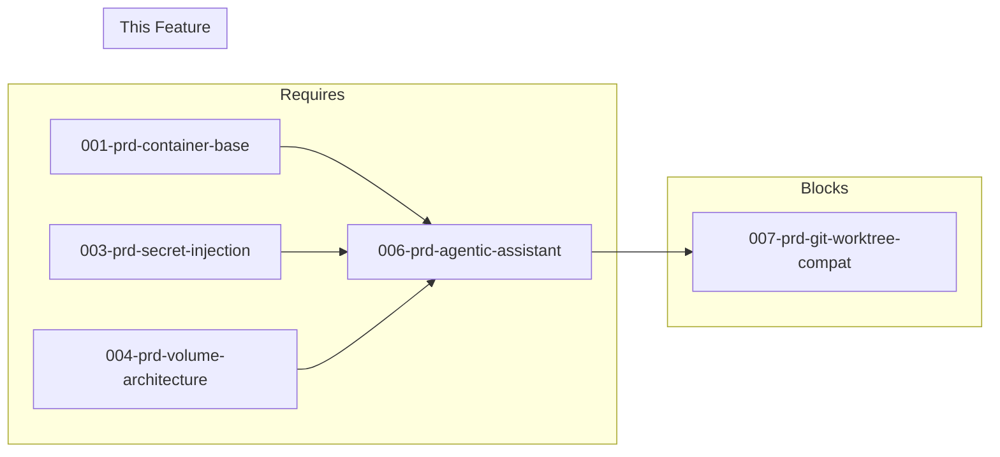

# 006-prd-agentic-assistant

> **Document Type:** Product Requirements Document
> **Audience:** LLM agents, human reviewers
> **Status:** Draft
> **Last Updated:** 2026-01-22 <!-- @auto -->
> **Owner:** Brian Luby <!-- @human-required -->

---

## Review Tier Legend

| Marker | Tier | Speckit Behavior |
|--------|------|------------------|
| 🔴 `@human-required` | Human Generated | Prompt human to author; blocks until complete |
| 🟡 `@human-review` | LLM + Human Review | LLM drafts → prompt human to confirm/edit; blocks until confirmed |
| 🟢 `@llm-autonomous` | LLM Autonomous | LLM completes; no prompt; logged for audit |
| ⚪ `@auto` | Auto-generated | System fills (timestamps, links); no prompt |

---

## Document Completion Order

> ⚠️ **For LLM Agents:** Complete sections in this order. Do not fill downstream sections until upstream human-required inputs exist.

1. **Context** (Background, Scope) → requires human input first
2. **Problem Statement & User Story** → requires human input
3. **Requirements** (Must/Should/Could/Won't) → requires human input
4. **Technical Constraints** → human review
5. **Diagrams, Data Model, Interface** → LLM can draft after above exist
6. **Acceptance Criteria** → derived from requirements
7. **Everything else** → can proceed

---

## Context

### Background 🔴 `@human-required`

Modern software development increasingly requires AI assistants that can work autonomously on complex, multi-file tasks over extended periods. While terminal-based agents (PRD 005) excel at interactive, session-based workflows, there is a distinct need for agentic assistants that can operate with minimal supervision—running for hours, coordinating sub-tasks, managing checkpoints, and recovering from failures. This PRD evaluates tools that can serve as the autonomous coding layer within the container development environment.

### Scope Boundaries 🟡 `@human-review`

**In Scope:**
- Evaluation of CLI/TUI-based AI coding agents that run inside Docker containers
- Web-based AI interfaces accessible via browser (code-server, VS Code Server)
- VS Code extensions running inside containerized code-server
- Autonomous operation capabilities (multi-file edits, checkpoints, sub-agents)
- API key configuration via environment variables
- Integration with existing container dev environment (PRDs 001-004)

**Out of Scope:**
- Native desktop applications — excluded because all tools must run in-container
- Host-side IDE installations — excluded to maintain container portability
- Self-hosted LLM inference — users provide API keys or use external services
- Real-time pair programming — different use case than autonomous agents (covered elsewhere)
- Voice input — covered in PRD 014

### Glossary 🟡 `@human-review`

| Term | Definition |
|------|------------|
| Agentic Assistant | An AI coding tool capable of autonomous, multi-step operation without constant human input |
| Checkpoint | A saved snapshot of code state that can be restored if subsequent changes fail |
| Sub-agent | A delegated AI process that handles a specialized sub-task in parallel with the main agent |
| MCP | Model Context Protocol — an open standard for extending AI tool capabilities via plug-in servers |
| Human-in-the-loop | Operation mode where the agent requests explicit approval before executing actions |
| Auto-approve | Operation mode where the agent executes actions without waiting for user confirmation |
| code-server | A containerized VS Code instance accessible via web browser |
| Headless mode | Agent operation without any graphical interface, suitable for CI/CD and background execution |

### Related Documents ⚪ `@auto`

| Document | Link | Relationship |
|----------|------|--------------|
| Container Base Image | 001-prd-container-base.md | Provides runtime environment |
| Secret Injection | 003-prd-secret-injection.md | API key management |
| Volume Architecture | 004-prd-volume-architecture.md | Persistence strategy |
| Terminal Agents | 005-prd-terminal-agents.md | Interactive agent layer (complementary) |
| Git Worktree Compat | 007-prd-git-worktree-compat.md | Downstream dependency |

---

## Problem Statement 🔴 `@human-required`

Developers working in containerized environments need AI assistants that can autonomously handle complex, multi-file coding tasks—running for extended periods, managing their own state, recovering from failures, and coordinating parallel work streams. Current interactive AI tools require constant human attention and cannot safely explore solutions without risk of losing work.

The cost of not solving this is significant: developers must either manually supervise every AI action (defeating the purpose of automation) or risk corrupted codebases when unsupervised tools make mistakes without checkpoint/rollback capability.

### User Story 🔴 `@human-required`
> As a developer using the container dev environment, I want an AI agent that can autonomously handle complex multi-file coding tasks so that I can focus on higher-level decisions while it handles implementation.

---

## Assumptions & Risks 🟡 `@human-review`

### Assumptions
- [A-1] Users have valid API keys for at least one supported LLM provider before using this feature
- [A-2] The container base image (PRD 001) provides sufficient runtime dependencies (Node.js, Python, Go)
- [A-3] Secret injection (PRD 003) is functional for API key delivery via environment variables
- [A-4] Volume architecture (PRD 004) preserves agent state and session data across container restarts
- [A-5] Network access to LLM provider APIs is available from within the container

### Risks
| ID | Risk | Likelihood | Impact | Mitigation |
|----|------|------------|--------|------------|
| R-1 | LLM provider API costs escalate during autonomous multi-hour sessions | High | Medium | Token/cost tracking requirement (S-7); configurable spending limits |
| R-2 | Checkpoint system fails to capture full state (e.g., running processes, env vars) | Medium | High | Validate checkpoint scope during spike; prefer git-based checkpoints |
| R-3 | Tool project abandoned or license changes | Low | High | Evaluate only actively maintained OSS projects; avoid single-vendor lock-in |
| R-4 | Container resource constraints (memory, CPU) limit agent performance | Medium | Medium | Profile resource usage during spike; document minimum container specs |
| R-5 | Sub-agent coordination leads to conflicting file edits | Medium | High | Require file-level locking or sequential merging strategy |

---

## Feature Overview

### Flow Diagram 🟡 `@human-review`

### State Diagram 🟡 `@human-review`

---

## Requirements

### Must Have (M) — MVP, launch blockers 🔴 `@human-required`
- [ ] **M-1:** The agent shall operate autonomously for extended periods (30+ minutes) without requiring constant human input
- [ ] **M-2:** The agent shall edit multiple files in a single operation with atomic commits
- [ ] **M-3:** The agent shall provide a checkpoint/rollback system that saves state before each change and allows instant restoration
- [ ] **M-4:** The agent shall run inside a Docker container without GUI dependencies (headless, no X11)
- [ ] **M-5:** The agent shall read, search, and understand project structure (codebase-aware context)
- [ ] **M-6:** The agent shall accept API key configuration via environment variables
- [ ] **M-7:** The agent shall support at minimum Anthropic Claude as an LLM provider
- [ ] **M-8:** The agent shall integrate with git for clean commit practices (atomic, descriptive commits)
- [ ] **M-9:** The agent shall execute shell commands and iterate on their results (build, test, lint)
- [ ] **M-10:** The agent shall be open source or have a permissive license suitable for commercial use

### Should Have (S) — High value, not blocking 🔴 `@human-required`
- [ ] **S-1:** The agent should support sub-agent or task delegation for parallel workflows
- [ ] **S-2:** The agent should handle background task execution (dev servers, watchers) without blocking primary work
- [ ] **S-3:** The agent should integrate with MCP (Model Context Protocol) for extensibility
- [ ] **S-4:** The agent should support multiple LLM providers (OpenAI, Google Gemini, local models)
- [ ] **S-5:** The agent should offer configurable human-in-the-loop approval modes (manual, auto-approve, hybrid)
- [ ] **S-6:** The agent should support session persistence and resumption across restarts
- [ ] **S-7:** The agent should track and report cost/token usage metrics
- [ ] **S-8:** The agent should offer IDE integration via VS Code remote or code-server

### Could Have (C) — Nice to have, if time permits 🟡 `@human-review`
- [ ] **C-1:** The agent could provide browser automation for testing and debugging
- [ ] **C-2:** The agent could integrate with CI/CD workflows (GitHub Actions)
- [ ] **C-3:** The agent could support scheduled or triggered execution
- [ ] **C-4:** The agent could provide a mission control dashboard for monitoring multiple agents
- [ ] **C-5:** The agent could support custom system prompts and agent personas
- [ ] **C-6:** The agent could integrate with issue trackers (GitHub Issues, Linear, Jira)
- [ ] **C-7:** The agent could generate documentation automatically

### Won't Have (W) — Explicitly deferred 🟡 `@human-review`
- [ ] **W-1:** Native desktop applications — *Reason: All tools must run in-container; no host dependencies*
- [ ] **W-2:** Tools requiring host-side IDE installation — *Reason: Breaks container portability*
- [ ] **W-3:** Self-hosted LLM inference — *Reason: Users provide API keys or use external services; inference infra is out of scope*
- [ ] **W-4:** Real-time pair programming — *Reason: Different use case; autonomous agents complement but don't replace interactive pairing*
- [ ] **W-5:** Voice input — *Reason: Covered in PRD 014*

---

## Technical Constraints 🟡 `@human-review`

- **Runtime Environment:** Must run inside the container base image (PRD 001: Debian Bookworm-slim, Python 3.14+, Node.js 22.x LTS)
- **Deployment Modes:** Acceptable: CLI/TUI in container terminal, web UI via browser, VS Code extension in code-server
- **No Host Dependencies:** Zero host-side installations required; fully self-contained in container
- **API Access:** LLM provider APIs accessed over network; keys injected via environment variables (PRD 003)
- **Storage:** Agent state and sessions stored within container volumes (PRD 004)
- **Resource Limits:** Must operate within reasonable container resource constraints (document minimum requirements during spike)
- **License:** MIT or Apache 2.0 preferred; proprietary acceptable only if it provides unique must-have capabilities unavailable elsewhere

---

## Evaluation Criteria 🟡 `@human-review`

| Criterion | Weight | Metric | Target | Notes |
|-----------|--------|--------|--------|-------|
| Autonomous operation | Critical | Duration without input | 30+ minutes | Can run for hours without user input |
| Container compatibility | Critical | Runs in Docker | Pass/Fail | CLI/TUI, web UI, or code-server |
| Checkpoint/rollback | Critical | Restore success rate | >95% | Safe to let agent explore |
| Multi-file coherence | Critical | Cross-file edit success | >90% | Changes are consistent and atomic |
| License compatibility | Critical | License type | MIT/Apache/Permissive | Commercial use allowed |
| Sub-agent/parallelism | High | Parallel task support | Yes/No | Delegate and parallelize |
| MCP support | High | MCP integration | Yes/No | Extensibility via protocol |
| Multi-provider LLMs | High | Provider count | ≥2 | Not locked to single provider |
| CLI/TUI availability | High | Headless operation | Pass/Fail | No VS Code required |
| Background tasks | Medium | Concurrent processes | Yes/No | Long-running processes don't block |
| Cost tracking | Medium | Token/cost visibility | Yes/No | API spend reporting |
| Active maintenance | Medium | Recent commits | <30 days | Responsive to issues |
| Community adoption | Medium | GitHub stars + users | Qualitative | Docs, examples, enterprise use |

---

## Tool/Approach Candidates 🟡 `@human-review`

| Option | License | Container Mode | Pros | Cons | Spike Result |
|--------|---------|----------------|------|------|--------------|
| Claude Code | Proprietary (subscription) | CLI/TUI | Native checkpoints, sub-agents, background tasks, Anthropic-optimized, CLI-native | Anthropic-only, requires subscription, proprietary | Pending |
| Cline | Apache 2.0 | code-server, CLI | Open source, multi-provider, MCP support, 4M+ users, human-in-the-loop | Primarily VS Code extension, CLI newer | Pending |
| Roo-Code | Apache 2.0 | code-server | Multi-agent roles, reliable multi-file edits, hybrid approval | VS Code-centric, smaller community | Pending |
| Continue | Apache 2.0 | CLI/TUI, Headless | Dedicated headless mode, background agents, Mission Control, CI/CD, air-gapped | Agent mode newer, less mature | Pending |
| OpenCode | MIT | CLI/TUI | 70k+ stars, CLI/TUI native, multi-provider, plan/build agents, free models | Newer project, checkpoint less mature | Pending |

### Detailed Tool Analysis

#### Claude Code
**Source:** [GitHub](https://github.com/anthropics/claude-code) | [Docs](https://code.claude.com/docs/en/overview)

- **Checkpoints:** Automatically saves code state before each change; instant rewind
- **Sub-agents:** Delegate specialized tasks in parallel
- **Hooks:** Trigger actions automatically (run tests after changes, lint before commits)
- **Background tasks:** Keep dev servers running without blocking progress
- **Auto-accept mode:** Toggle autonomous operation

Container compatibility: CLI-native, terminal-first. Requires Anthropic subscription.

#### Cline
**Source:** [GitHub](https://github.com/cline/cline) | [Website](https://cline.bot/)

- **Plan/Act modes:** Stepwise planning before execution
- **Human-in-the-loop:** Every action requires explicit approval (configurable)
- **MCP integration:** Extend capabilities via Model Context Protocol
- **Multi-provider:** OpenRouter, Anthropic, OpenAI, Google Gemini, local models
- **Cross-platform:** VS Code extension (primary), CLI tool, JetBrains plugin

Container compatibility: CLI available; VS Code extension requires code-server.

#### Roo-Code
**Source:** [GitHub](https://github.com/RooCodeInc/Roo-Code) | [Website](https://roocode.com/)

- **Multi-agent roles:** Specialized agents for different task types
- **Approval modes:** Manual, Autonomous, or Hybrid
- **Multi-file reliability:** Fewer half-finished edits on large refactors
- **Model flexibility:** OpenAI, Anthropic, local LLMs

Container compatibility: VS Code-centric; requires code-server.

#### Continue
**Source:** [GitHub](https://github.com/continuedev/continue) | [Website](https://www.continue.dev/)

- **Headless mode:** CLI for async cloud agents
- **TUI mode:** Terminal-based in-sync coding agent
- **Background agents:** Pre-built workflows for GitHub, Sentry, Snyk, Linear
- **Mission Control:** Central dashboard for managing agents
- **Air-gapped deployment:** Fully offline with local LLMs

Container compatibility: Excellent—headless/CLI modes designed for containers and CI/CD.

#### OpenCode
**Source:** [GitHub](https://github.com/opencode-ai/opencode) | [Website](https://opencode.ai/)

- **Built-in agents:** `build` (full access) and `plan` (read-only), switchable with Tab
- **Multi-provider:** OpenAI, Anthropic, Google Gemini, AWS Bedrock, Groq, Azure, OpenRouter
- **TUI interface:** Bubble Tea framework
- **Vim-like editor:** Familiar keybindings for terminal users
- **Session management:** Persist and resume conversations
- **Free models included:** Start without API keys

Container compatibility: Excellent—single Go binary, no GUI dependencies.

### Selected Approach 🔴 `@human-required`
> **Decision:** [Filled after spike]
> **Rationale:** [Why this option over others]

---

## Acceptance Criteria 🟡 `@human-review`

| AC ID | Requirement | Given | When | Then |
|-------|-------------|-------|------|------|
| AC-1 | M-4, M-6 | A container environment with API keys configured | I start the agent | It initializes without error and without GUI |
| AC-2 | M-2, M-5 | A complex multi-file task | I describe the changes | The agent plans and executes across all relevant files |
| AC-3 | M-1 | Autonomous mode enabled | The agent runs for 30+ minutes | It continues working without manual intervention |
| AC-4 | M-3 | A failed change attempt | I request rollback | The agent restores the previous checkpoint |
| AC-5 | S-2 | A long-running background task (dev server) | I continue working | The agent handles both concurrently |
| AC-6 | S-1 | A parallelizable sub-task | Using sub-agents | Multiple work streams execute simultaneously |
| AC-7 | S-3 | MCP tools configured | The agent needs external capabilities | It invokes MCP servers successfully |
| AC-8 | S-6 | Session interruption | I reconnect | I can resume the previous context |
| AC-9 | S-7 | Completed work | I review token usage | I can see cost/usage metrics |
| AC-10 | M-4 | The container image | I run the agent in Docker | No additional host dependencies are required |

### Edge Cases 🟢 `@llm-autonomous`
- [ ] **EC-1:** (M-3) When a checkpoint fails to save due to disk space, then the agent halts and reports the error before making further changes
- [ ] **EC-2:** (M-1) When the LLM API returns rate-limit errors during autonomous operation, then the agent implements exponential backoff and resumes
- [ ] **EC-3:** (M-2) When two sub-agents attempt to edit the same file simultaneously, then conflict resolution prevents data loss
- [ ] **EC-4:** (S-6) When a session file is corrupted, then the agent starts a new session and logs the corruption
- [ ] **EC-5:** (M-9) When a shell command hangs indefinitely, then the agent applies a configurable timeout and reports the failure
- [ ] **EC-6:** (M-6) When API keys are missing or invalid, then the agent exits with a clear error message before attempting any work

---

## Dependencies 🟡 `@human-review`

### Requires (must be complete before this PRD)
- 001-prd-container-base — Provides the runtime environment (Debian, Node.js, Python)
- 003-prd-secret-injection — API key delivery via environment variables
- 004-prd-volume-architecture — Persistence for agent state and sessions

### Blocks (waiting on this PRD)
- 007-prd-git-worktree-compat — Must validate worktree support with selected agent tool

### Informs (decisions here affect future PRDs) 🔴 `@human-required`
| Open Item | Dependent PRD | What We Need | Working Assumption |
|-----------|---------------|--------------|-------------------|
| Selected tool's git workflow | 007-prd-git-worktree-compat | Whether selected agent supports worktrees natively | Agent uses standard git; worktree compat layer added later |

### External
- LLM provider APIs (Anthropic, OpenAI, etc.) — Network availability and API stability
- MCP server ecosystem — Third-party MCP servers for extensibility

---

## Security Considerations 🟡 `@human-review`

| Aspect | Assessment | Notes |
|--------|------------|-------|
| Internet Exposure | Yes | Agent requires network access to LLM provider APIs |
| Sensitive Data | Yes | API keys (managed via PRD 003); agent has read/write access to source code |
| Authentication Required | Yes | API keys for LLM providers; no additional auth for agent itself |
| Security Review Required | Yes | Agent executes arbitrary shell commands; needs sandboxing assessment |

**Key concerns:**
- Agent has shell access and can execute arbitrary commands within the container
- API keys must never be logged, committed, or exposed in agent output
- Container isolation provides the primary security boundary
- File system access should be scoped to project directories where possible

---

## Implementation Guidance 🟢 `@llm-autonomous`

### Suggested Approach
1. Install the selected tool in the container base image (Dockerfile layer or entrypoint script)
2. Configure API keys via environment variable injection (PRD 003 pattern)
3. Mount project workspace via volume (PRD 004)
4. Provide a wrapper script or alias for common agent invocations
5. Configure checkpoint storage within the persistent volume

### Anti-patterns to Avoid
- Do not bake API keys into the container image
- Do not require X11 or display server for any operation mode
- Do not install multiple competing agents simultaneously (choose one primary)
- Do not allow agent to modify files outside the project workspace without explicit configuration

### Reference Examples
- [Claude Code Best Practices](https://www.anthropic.com/engineering/claude-code-best-practices)
- [Enabling Claude Code to Work Autonomously](https://www.anthropic.com/news/enabling-claude-code-to-work-more-autonomously)
- [OpenCode Documentation](https://opencode.ai/docs/)

---

## Spike Tasks 🟡 `@human-review`

### Environment Setup (Container-First Validation)
- [ ] **Spike-1:** Test Claude Code CLI installation in container; verify headless operation
- [ ] **Spike-2:** Test Cline CLI installation in container (without VS Code)
- [ ] **Spike-3:** Test Cline VS Code extension in code-server container
- [ ] **Spike-4:** Test Roo-Code with code-server in container
- [ ] **Spike-5:** Test Continue headless mode in container
- [ ] **Spike-6:** Test OpenCode CLI/TUI installation in container (Go binary)
- [ ] **Spike-7:** Document API key configuration for each tool via environment variables
- [ ] **Spike-8:** Verify each tool starts and operates without X11/display dependencies

### Autonomous Operation
- [ ] **Spike-9:** Run each tool on a 1-hour autonomous refactoring task
- [ ] **Spike-10:** Measure checkpoint/rollback reliability for each tool
- [ ] **Spike-11:** Test sub-agent/parallel task capability (where supported)
- [ ] **Spike-12:** Verify background task handling (dev servers, watchers)
- [ ] **Spike-13:** Test recovery from network interruption mid-task

### Multi-File Coherence
- [ ] **Spike-14:** Execute cross-file refactoring (rename, move, extract) with each tool
- [ ] **Spike-15:** Verify atomic commits (all related changes in one commit)
- [ ] **Spike-16:** Test with Python, TypeScript, and Rust codebases
- [ ] **Spike-17:** Measure success rate on complex multi-file changes

### Integration & Extensibility
- [ ] **Spike-18:** Test MCP server integration for each tool
- [ ] **Spike-19:** Evaluate CI/CD integration options (GitHub Actions)
- [ ] **Spike-20:** Test scheduled/triggered execution (Continue Mission Control)
- [ ] **Spike-21:** Document IDE integration options for containerized environment

### Comparison Metrics
- [ ] **Spike-22:** Compare token usage for equivalent tasks across tools
- [ ] **Spike-23:** Measure time-to-completion for standard benchmark tasks
- [ ] **Spike-24:** Document licensing requirements and costs
- [ ] **Spike-25:** Assess community activity (issues, PRs, releases)

---

## Success Metrics 🔴 `@human-required`

| Metric | Baseline | Target | Measurement Method |
|--------|----------|--------|-------------------|
| Task completion rate | N/A | >85% | Autonomous tasks completed without human intervention |
| Rollback reliability | N/A | >95% | Checkpoints that restore cleanly on demand |
| Multi-file coherence | N/A | >90% | Cross-file changes that compile and pass tests |

### Technical Verification 🟢 `@llm-autonomous`
| Metric | Target | Verification Method |
|--------|--------|---------------------|
| Container startup without errors | 100% | Automated container health check |
| API key injection works on first attempt | 100% | Integration test |
| No Critical/High security findings | 0 | Security review of agent execution scope |
| Agent operates without X11/GUI | 100% | Headless container test |

---

## Definition of Ready 🔴 `@human-required`

### Readiness Checklist
- [ ] Problem statement reviewed and validated by stakeholder
- [ ] All Must Have requirements have acceptance criteria
- [ ] Technical constraints are explicit and agreed
- [ ] Dependencies identified and owners confirmed
- [ ] Forward dependencies tracked (Informs table complete)
- [ ] Security review completed (or N/A documented with justification)
- [ ] Spike tasks completed and results documented
- [ ] No open questions blocking implementation

### Sign-off
| Role | Name | Date | Decision |
|------|------|------|----------|
| Product Owner | Brian Luby | YYYY-MM-DD | [Ready / Not Ready] |

---

## Changelog ⚪ `@auto`

| Version | Date | Author | Changes |
|---------|------|--------|---------|
| 0.1 | 2026-01-22 | Brian Luby | Initial draft (migrated from orig format to template v3) |

---

## Decision Log 🟡 `@human-review`

| Date | Decision | Rationale | Alternatives Considered |
|------|----------|-----------|------------------------|
| 2026-01-22 | Keep all 5 tool candidates for spike evaluation | No candidates eliminated without empirical testing | Narrowing to 2-3 based on docs alone |
| 2026-01-22 | Container-first as hard constraint | Core value prop of the dev environment; ensures portability | Allow hybrid host+container setups |

---

## Open Questions 🟡 `@human-review`

- [ ] **Q1:** Should we support running multiple agent tools simultaneously (e.g., Claude Code for Anthropic tasks, OpenCode for multi-provider), or commit to a single primary agent?
  > **Working assumption:** Single primary agent selected after spike; secondary can be installed optionally.

- [ ] **Q2:** What are the minimum container resource requirements (RAM, CPU) for acceptable agent performance?
  > **Working assumption:** 4GB RAM, 2 CPU cores minimum; validated during spike.

- [ ] **Q3:** Should the agent be allowed to install additional packages/tools at runtime, or must everything be pre-baked in the container image?
  > **Working assumption:** Agent can install packages within the container at runtime; base image provides common tooling.

- [ ] **Q4:** How should agent sessions be persisted across container rebuilds vs. restarts?
  > **Deferred to:** 004-prd-volume-architecture — Volume mount strategy determines persistence scope.
  > **Working assumption:** Sessions stored in a mounted volume; survive restarts but not rebuilds unless explicitly backed up.

---

## Review Checklist 🟢 `@llm-autonomous`

Before marking as Approved:
- [x] All requirements have unique IDs (M-1 through M-10, S-1 through S-8, C-1 through C-7, W-1 through W-5)
- [x] All Must Have requirements have linked acceptance criteria
- [x] Glossary terms are used consistently throughout
- [x] Diagrams use terminology from Glossary
- [x] Security considerations documented
- [ ] Definition of Ready checklist is complete
- [x] No open questions blocking implementation (all have working assumptions)
- [x] Forward dependencies tracked in Informs table

---

## References

- [Claude Code Best Practices](https://www.anthropic.com/engineering/claude-code-best-practices)
- [Enabling Claude Code to Work Autonomously](https://www.anthropic.com/news/enabling-claude-code-to-work-more-autonomously)
- [Roo Code vs Cline Comparison (2026)](https://www.qodo.ai/blog/roo-code-vs-cline/)
- [Best AI Coding Agents 2026](https://www.faros.ai/blog/best-ai-coding-agents-2026)
- [Agentic CLI Tools Compared](https://research.aimultiple.com/agentic-cli/)
- [OpenCode Documentation](https://opencode.ai/docs/)
- [OpenCode Agents](https://opencode.ai/docs/agents/)
- [Top 5 CLI Coding Agents 2026](https://dev.to/lightningdev123/top-5-cli-coding-agents-in-2026-3pia)
