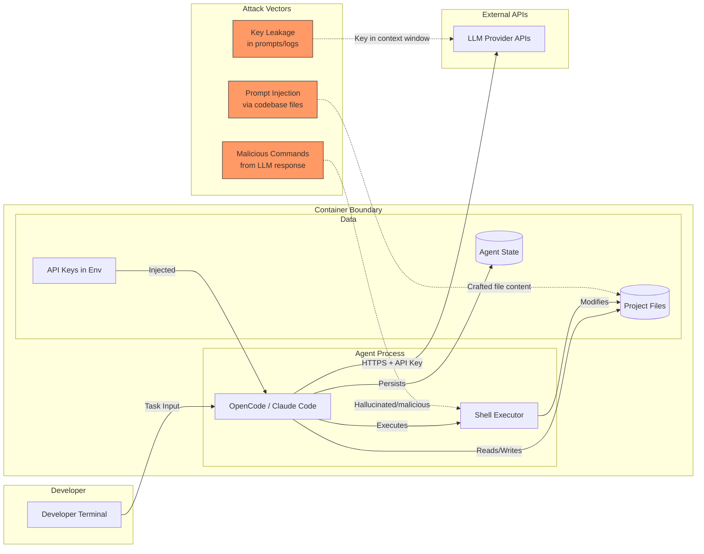
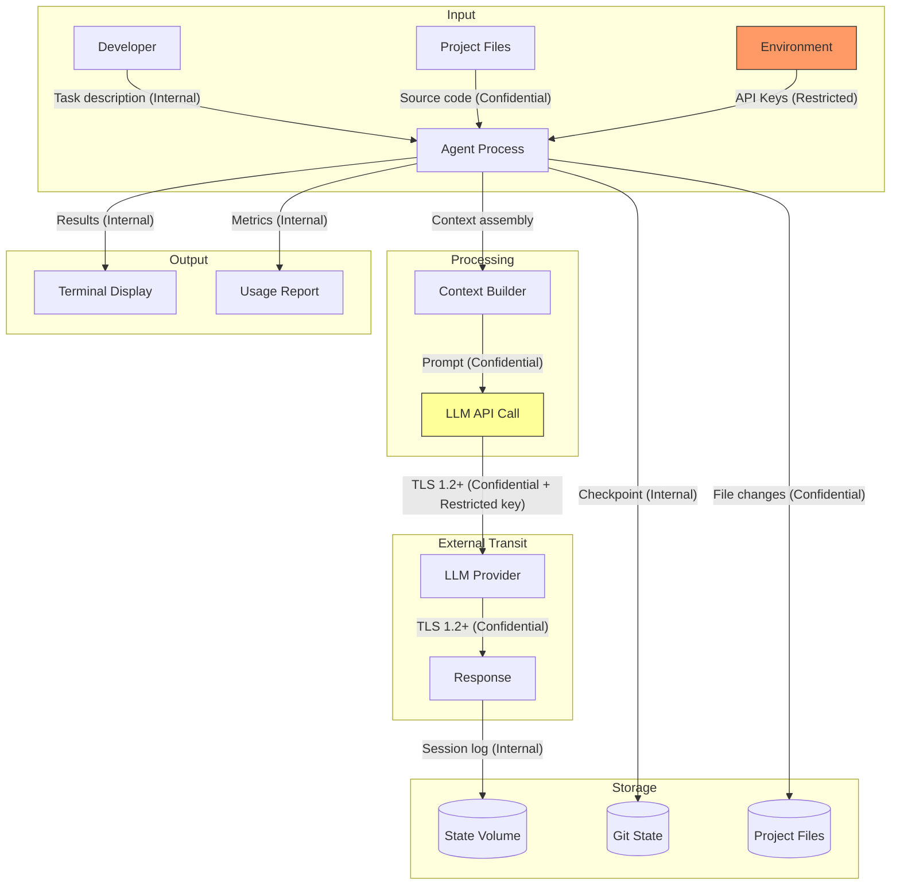
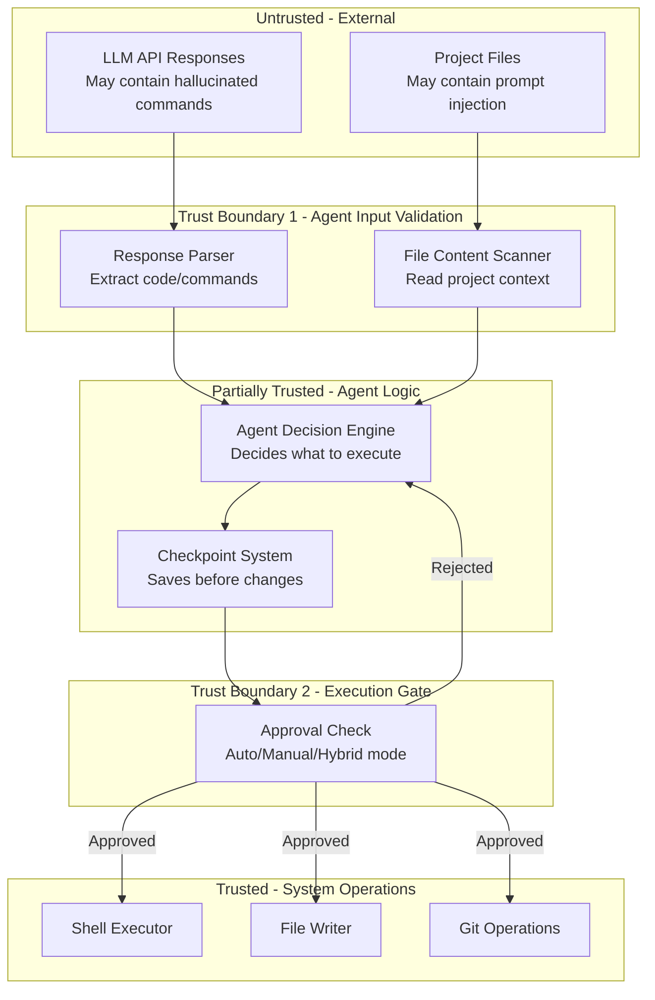

# 006-sec-agentic-assistant

> **Document Type:** Security Review (Lightweight)
> **Audience:** LLM agents, human reviewers
> **Status:** Draft
> **Last Updated:** 2026-01-22 <!-- @auto -->
> **Reviewer:** Brian Luby <!-- @human-required -->
> **Risk Level:** Medium <!-- @human-required -->

---

## Review Tier Legend

| Marker | Tier | Speckit Behavior |
|--------|------|------------------|
| 🔴 `@human-required` | Human Generated | Prompt human to author; blocks until complete |
| 🟡 `@human-review` | LLM + Human Review | LLM drafts → prompt human to confirm/edit; blocks until confirmed |
| 🟢 `@llm-autonomous` | LLM Autonomous | LLM completes; no prompt; logged for audit |
| ⚪ `@auto` | Auto-generated | System fills (timestamps, links); no prompt |

---

## Severity Definitions

| Level | Label | Definition |
|-------|-------|------------|
| 🔴 | **Critical** | Immediate exploitation risk; data breach or system compromise likely |
| 🟠 | **High** | Significant risk; exploitation possible with moderate effort |
| 🟡 | **Medium** | Notable risk; exploitation requires specific conditions |
| 🟢 | **Low** | Minor risk; limited impact or unlikely exploitation |

---

## Linkage ⚪ `@auto`

| Document | ID | Relationship |
|----------|-----|--------------|
| Parent PRD | 006-prd-agentic-assistant.md | Feature being reviewed |
| Architecture Decision Record | 006-ard-agentic-assistant.md | Technical implementation |

---

## Purpose

This is a **lightweight security review** intended to catch obvious security concerns early in the product lifecycle. It is NOT a comprehensive threat model. Full threat modeling should occur during implementation when infrastructure-as-code and concrete implementations exist.

**This review answers three questions:**
1. What does this feature expose to attackers?
2. What data does it touch, and how sensitive is that data?
3. What's the impact if something goes wrong?

**Scope of this review:**
- ✅ Attack surface identification
- ✅ Data classification
- ✅ High-level CIA assessment
- ❌ Detailed threat enumeration (deferred to implementation)
- ❌ Penetration testing (deferred to implementation)
- ❌ Compliance audit (separate process)

---

## Feature Security Summary

### One-line Summary 🔴 `@human-required`
> An AI agent with shell access, source code read/write, and LLM API credentials executes autonomously inside a Docker container, creating a high-privilege execution context bounded by container isolation.

### Risk Assessment 🔴 `@human-required`
> **Risk Level:** Medium
> **Justification:** The agent has high privilege (arbitrary shell execution, API key access, source code modification) but the blast radius is limited to a single-user development container with no production system access. Docker isolation provides the primary security boundary.

---

## Attack Surface Analysis

### Exposure Points 🟡 `@human-review`

| Exposure Type | Details | Authentication | Authorization | Notes |
|---------------|---------|----------------|---------------|-------|
| Outbound API Calls | HTTPS to LLM provider APIs (Anthropic, OpenAI, etc.) | Yes - API key in header | N/A (outbound) | Keys transmitted per request |
| Shell Command Execution | Agent runs arbitrary commands via POSIX shell | No - agent self-invoked | Container user permissions | Primary risk vector |
| Filesystem Access | Read/write to project workspace and agent state | No - filesystem permissions | Container user + mount scope | Agent can read all mounted files |
| stdin/stdout | Developer interacts via terminal | No - local terminal | Physical/SSH access | Low risk; same as any CLI tool |

### Attack Surface Diagram 🟢 `@llm-autonomous`

### Exposure Checklist 🟢 `@llm-autonomous`

- [x] **Internet-facing endpoints require authentication** — No internet-facing endpoints; outbound only with API keys
- [x] **No sensitive data in URL parameters** — API keys sent in headers, not URLs
- [N/A] **File uploads validated** — No file upload mechanism
- [N/A] **Rate limiting configured** — No inbound endpoints; LLM providers handle their own rate limiting
- [N/A] **CORS policy is restrictive** — No web endpoints
- [x] **No debug/admin endpoints exposed** — No endpoints at all (CLI tool)
- [N/A] **Webhooks validate signatures** — No webhook receivers

---

## Data Flow Analysis

### Data Inventory 🟡 `@human-review`

| Data Element | PRD Entity | Classification | Source | Destination | Retention | Encrypted Rest | Encrypted Transit | Residency |
|--------------|------------|----------------|--------|-------------|-----------|----------------|-------------------|-----------|
| LLM API Keys | M-6 (env vars) | Restricted | PRD 003 secret injection | Agent process memory, HTTPS headers | Session lifetime | N/A (memory) | Yes (TLS) | Container |
| Source Code | M-5 (codebase) | Confidential | Project volume mount | Agent context, LLM API | Permanent (volume) | No (filesystem) | Yes (TLS to LLM) | Container + LLM provider |
| Agent Session History | S-6 (persistence) | Internal | Agent operations | State volume | Until deleted | No (filesystem) | N/A (local) | Container volume |
| Shell Command Output | M-9 (shell) | Internal | Shell execution | Agent context, LLM API | Session lifetime | No (memory/log) | Yes (TLS to LLM) | Container + LLM provider |
| LLM Prompts/Responses | — | Confidential | Agent ↔ LLM API | Network transit | Per provider policy | Per provider | Yes (TLS) | LLM provider |
| Checkpoint Snapshots | M-3 (checkpoints) | Internal | Git/agent state | State volume | Until pruned | No (filesystem) | N/A (local) | Container volume |
| Token Usage Metrics | S-7 (cost tracking) | Internal | LLM API responses | Agent logs/display | Session lifetime | No | N/A (local) | Container |

### Data Classification Reference 🟢 `@llm-autonomous`

| Level | Label | Description | Examples | Handling Requirements |
|-------|-------|-------------|----------|----------------------|
| 1 | **Public** | No impact if disclosed | Agent tool versions, config schema | No special handling |
| 2 | **Internal** | Minor impact if disclosed | Session logs, command history, metrics | Access controls, no public exposure |
| 3 | **Confidential** | Significant impact if disclosed | Source code, LLM prompts/responses | Encryption in transit, access controls |
| 4 | **Restricted** | Severe impact if disclosed | API keys, credentials | Encryption, strict access, never logged |

### Data Flow Diagram 🟢 `@llm-autonomous`

### Data Handling Checklist 🟢 `@llm-autonomous`

- [x] **No Restricted data stored unless absolutely required** — API keys in memory only; not written to disk by agent
- [ ] **Confidential data encrypted at rest** — ⚠️ Source code and session logs stored unencrypted on volumes (acceptable for dev containers; see R2)
- [x] **All data encrypted in transit (TLS 1.2+)** — All LLM API calls use HTTPS
- [N/A] **PII has defined retention policy** — No PII collected by this feature
- [ ] **Logs do not contain Confidential/Restricted data** — ⚠️ Session logs may contain source code snippets; API keys must be filtered (see SEC-2)
- [x] **Secrets are not hardcoded** — API keys from env vars via PRD 003
- [x] **Data minimization applied** — Agent sends only relevant file content to LLM, not entire codebase
- [N/A] **Data residency requirements documented** — Single-user dev environment; no regulatory residency requirements

---

## Third-Party & Supply Chain 🟡 `@human-review`

### New External Services

| Service | Purpose | Data Shared | Communication | Approved? |
|---------|---------|-------------|---------------|-----------|
| Anthropic API | LLM inference for Claude Code | Source code context + API key | HTTPS/TLS 1.3 | Pending |
| OpenAI API | LLM inference for OpenCode | Source code context + API key | HTTPS/TLS 1.3 | Pending |
| Google Gemini API | LLM inference for OpenCode | Source code context + API key | HTTPS/TLS 1.3 | Pending |
| OpenRouter | LLM routing for OpenCode | Source code context + API key | HTTPS/TLS 1.2+ | Pending |

### New Libraries/Dependencies

| Library | Version | License | Purpose | Security Check |
|---------|---------|---------|---------|----------------|
| OpenCode | Latest | MIT | Primary agentic assistant (Go binary) | ⚠️ Review (verify supply chain) |
| Claude Code | Latest | Proprietary | Secondary agentic assistant (npm) | ⚠️ Review (Anthropic-published) |
| Node.js 22.x | LTS | MIT | Runtime for Claude Code | ✅ Approved (already in base image) |

### Supply Chain Checklist

- [x] **All new services use encrypted communication** — All LLM APIs use HTTPS/TLS
- [x] **Service agreements/ToS reviewed** — Reviewed and confirmed; OpenCode does not retain data
- [x] **Dependencies have acceptable licenses** — MIT (OpenCode), Proprietary (Claude Code - optional)
- [x] **Dependencies are actively maintained** — Both projects have recent commits and active maintainers
- [ ] **No known critical vulnerabilities** — ⚠️ Must verify before installation (CVE check during build)

---

## CIA Impact Assessment

### Confidentiality 🟡 `@human-review`

> **What could be disclosed?**

| Asset at Risk | Classification | Exposure Scenario | Impact | Likelihood |
|---------------|----------------|-------------------|--------|------------|
| LLM API Keys | Restricted | Agent logs key in session history; key appears in git commit | High | Low |
| Source Code | Confidential | Code sent to LLM provider during inference (not retained per provider policy) | Low | Medium |
| Source Code | Confidential | Agent commits sensitive code to public repo accidentally | Medium | Low |
| Session History | Internal | State volume accessed by unauthorized process in container | Low | Low |

**Confidentiality Risk Level:** Medium

### Integrity 🟡 `@human-review`

> **What could be modified or corrupted?**

| Asset at Risk | Modification Scenario | Impact | Likelihood |
|---------------|----------------------|--------|------------|
| Project Source Code | Agent executes hallucinated destructive command (`rm -rf`) | High | Low |
| Project Source Code | Prompt injection via malicious file causes agent to introduce vulnerabilities | Medium | Medium |
| Git History | Agent creates messy commits or force-pushes (if not constrained) | Medium | Low |
| Agent State | Corrupted checkpoint prevents rollback | Medium | Low |

**Integrity Risk Level:** Medium

### Availability 🟡 `@human-review`

> **What could be disrupted?**

| Service/Function | Disruption Scenario | Impact | Likelihood |
|------------------|---------------------|--------|------------|
| Agent Operation | LLM API outage or rate limiting | Medium | Medium |
| Agent Operation | API key revoked or billing exhausted | Medium | Low |
| Container | Agent spawns runaway processes consuming all resources | Medium | Low |
| Project Files | Agent fills disk with checkpoints/logs | Low | Low |

**Availability Risk Level:** Low

### CIA Summary 🟢 `@llm-autonomous`

| Dimension | Risk Level | Primary Concern | Mitigation Priority |
|-----------|------------|-----------------|---------------------|
| **Confidentiality** | Medium | Source code sent to LLM providers; API key leakage risk | High |
| **Integrity** | Medium | Prompt injection could cause malicious file modifications | High |
| **Availability** | Low | LLM API dependency; resource exhaustion possible but unlikely | Low |

**Overall CIA Risk:** Medium — *Agent handles Restricted (API keys) and Confidential (source code) data with shell execution privilege, but Docker isolation and single-user context limit blast radius.*

---

## Trust Boundaries 🟡 `@human-review`

**Key trust boundary observations:**
1. **LLM responses are untrusted** — They may contain hallucinated or malicious commands
2. **Project files are untrusted** — They may contain prompt injection payloads
3. **The approval gate is the critical control** — In auto-approve mode, this boundary is weakened
4. **Container isolation is the backstop** — Even if the agent is compromised, damage is contained

### Trust Boundary Checklist 🟢 `@llm-autonomous`

- [ ] **All input from untrusted sources is validated** — ⚠️ LLM responses are parsed but not fully validated for safety; relies on agent's own judgment
- [ ] **External API responses are validated** — ⚠️ LLM responses are consumed as-is by the agent; no independent validation layer
- [x] **Authorization checked at data access, not just entry point** — Filesystem permissions apply at OS level
- [N/A] **Service-to-service calls are authenticated** — Single-process architecture; no inter-service calls

---

## Known Risks & Mitigations 🟡 `@human-review`

| ID | Risk Description | Severity | Mitigation | Status | Owner |
|----|------------------|----------|------------|--------|-------|
| R1 | API key leakage: Agent includes key in LLM prompt, commit, or log output | 🟠 High | SEC-2: Filter Restricted data from logs/commits; env var isolation; never pass full env to LLM | Open | Brian Luby |
| R2 | Source code disclosure: Confidential code sent to LLM providers who may retain it | 🟢 Low | Provider data policies reviewed; OpenCode does not retain data; acceptable for dev use | Mitigated | Brian Luby |
| R3 | Destructive commands: Agent executes `rm -rf`, `git push --force`, or similar | 🟡 Medium | Checkpoint-before-change pattern; avoid running as root; project volume backups | Open | Brian Luby |
| R4 | Prompt injection: Malicious content in project files manipulates agent behavior | 🟡 Medium | Agent awareness of injection patterns; human-in-the-loop for sensitive operations; checkpoint recovery | Open | Brian Luby |
| R5 | Resource exhaustion: Agent spawns unbounded processes or fills disk | 🟢 Low | Container resource limits (cgroups); disk quotas; checkpoint pruning policy | Open | Brian Luby |
| R6 | Supply chain: Compromised agent binary introduces backdoor | 🟡 Medium | Verify checksums during install; pin versions; monitor for CVEs; use official release channels | Open | Brian Luby |

### Risk Acceptance 🔴 `@human-required`

| Risk ID | Accepted By | Date | Justification | Review Date |
|---------|-------------|------|---------------|-------------|
| R2 | Brian Luby | 2026-01-22 | Provider policies reviewed and confirmed; OpenCode does not retain data; acceptable for development repos | 2026-07-22 |

---

## Security Requirements 🟡 `@human-review`

### Authentication & Authorization

| Req ID | Requirement | PRD AC | Verification Method |
|--------|-------------|--------|---------------------|
| SEC-1 | Agent processes shall run as non-root container user | AC-10 | Dockerfile inspection + runtime check |
| SEC-2 | API keys shall never appear in agent logs, session history, git commits, or LLM prompts as raw values | AC-1 | Log audit + grep test |
| SEC-3 | Agent shall only access files within mounted project and state volumes | AC-10 | Filesystem permission test |

### Data Protection

| Req ID | Requirement | PRD AC | Verification Method |
|--------|-------------|--------|---------------------|
| SEC-4 | All communication with LLM APIs shall use TLS 1.2 or higher | — | Network capture test |
| SEC-5 | Agent state volume shall not be accessible from other containers | AC-10 | Docker compose inspection |
| SEC-6 | Checkpoint data shall not include environment variables or API keys | AC-4 | Checkpoint content inspection |

### Input Validation

| Req ID | Requirement | PRD AC | Verification Method |
|--------|-------------|--------|---------------------|
| SEC-7 | Agent shall not execute shell commands containing known-dangerous patterns without explicit approval | — | Integration test with dangerous commands |
| SEC-8 | Agent shall validate LLM response format before executing code/commands | — | Malformed response test |

### Operational Security

| Req ID | Requirement | PRD AC | Verification Method |
|--------|-------------|--------|---------------------|
| SEC-9 | Container shall enforce resource limits (memory, CPU, PID count) | — | Docker compose inspection |
| SEC-10 | Agent binary integrity shall be verified during container build (checksum/signature) | — | Dockerfile inspection |
| SEC-11 | Agent shall create checkpoint before any destructive operation (file delete, git force) | AC-4 | Integration test |
| SEC-12 | Failed API key validation shall prevent agent startup with clear error | AC-1 | Unit test |

---

## Compliance Considerations 🟡 `@human-review`

| Regulation | Applicable? | Relevant Requirements | N/A Justification |
|------------|-------------|----------------------|-------------------|
| GDPR | N/A | — | Single-user dev tool; no personal data of third parties collected |
| CCPA | N/A | — | No consumer data processed |
| SOC 2 | N/A | — | Internal development tool; not a service offered to customers |
| HIPAA | N/A | — | No health data involved |
| PCI-DSS | N/A | — | No payment data involved |
| LLM Provider ToS | Yes | Data sent to LLM APIs must comply with provider terms regarding code/IP | Reviewed and confirmed; OpenCode does not retain data; provider policies acceptable for dev use |

---

## Review Findings

### Issues Identified 🟡 `@human-review`

| ID | Finding | Severity | Category | Recommendation | Status |
|----|---------|----------|----------|----------------|--------|
| F1 | Agent in auto-approve mode bypasses all human approval gates | 🟡 Medium | Trust Boundary | Document risks of auto-approve; recommend hybrid mode for unknown codebases; ensure checkpoints are always created regardless of mode | Open |
| F2 | Source code sent to LLM providers may be retained per provider policies | 🟢 Low | Data/Confidentiality | Provider policies reviewed and confirmed acceptable; OpenCode does not retain data; standard practice for dev environments | Resolved |
| F3 | Agents may read `.env` files or other secrets in project if not configured to ignore them | 🟢 Low | Data/Confidentiality | Both tools support command/file ignore patterns natively; document recommended ignore configuration for sensitive files | Open |
| F4 | Agent binary installed via curl without signature verification in initial proposal | 🟢 Low | Supply Chain | Add checksum verification step in Dockerfile; pin to specific versions | Open |
| F5 | No resource limits defined for agent-spawned processes | 🟢 Low | Availability | Set PID limits and memory cgroup constraints in container config | Open |

### Positive Observations 🟢 `@llm-autonomous`

- Docker container isolation provides a strong default security boundary
- API keys delivered via environment variables (not files) reduces persistence risk
- Checkpoint-before-change pattern provides integrity recovery mechanism
- No inbound network exposure eliminates entire class of network attacks
- Single-user context means no privilege escalation between users
- Git-based checkpoints provide an auditable change history
- Agent runs as non-root user by design (ARD guardrail)

---

## Open Questions 🟡 `@human-review`

- [ ] **Q1:** Should there be an `.agentignore` file pattern to prevent agents from reading sensitive project files (e.g., `.env.local`, `credentials/`)?
  > **Working assumption:** Yes; implement similar to `.gitignore` for agent file access.

- [ ] **Q2:** Should auto-approve mode be available by default, or require explicit opt-in with a security acknowledgment?
  > **Working assumption:** Available but not default; require `--yes-i-understand-the-risks` flag or equivalent.

- [x] **Q3:** How should we handle the risk of source code being retained by LLM providers? Should there be a "sensitive mode" that limits context sent?
  > **Resolved (2026-01-22):** Provider policies reviewed and confirmed acceptable. OpenCode does not retain data. No "sensitive mode" needed for current use case.

---

## Changelog ⚪ `@auto`

| Version | Date | Author | Changes |
|---------|------|--------|---------|
| 0.1 | 2026-01-22 | Brian Luby | Initial lightweight security review |

---

## Review Sign-off 🔴 `@human-required`

| Role | Name | Date | Decision |
|------|------|------|----------|
| Security Reviewer | Brian Luby | YYYY-MM-DD | [Approved / Approved with conditions / Rejected] |
| Feature Owner | Brian Luby | YYYY-MM-DD | [Acknowledged] |

### Conditions for Approval (if applicable) 🔴 `@human-required`

- [ ] F1: Document auto-approve mode risks and require explicit opt-in
- [ ] F3: Document recommended ignore configuration for sensitive files (tools support this natively)
- [ ] F4: Add binary checksum verification to Dockerfile install steps
- [x] Provider ToS reviewed for at least Anthropic and OpenAI regarding code retention

---

## Security Requirements Traceability 🟢 `@llm-autonomous`

| SEC Req ID | PRD Req ID | PRD AC ID | Test Type | Test Location |
|------------|------------|-----------|-----------|---------------|
| SEC-1 | M-4 | AC-10 | Integration | tests/container_security_test |
| SEC-2 | M-6 | AC-1 | Integration | tests/key_leakage_test |
| SEC-3 | M-4 | AC-10 | Integration | tests/filesystem_scope_test |
| SEC-4 | — | — | Integration | tests/tls_verification_test |
| SEC-5 | — | AC-10 | Manual | Docker compose review |
| SEC-6 | M-3 | AC-4 | Integration | tests/checkpoint_content_test |
| SEC-7 | M-9 | — | Integration | tests/dangerous_command_test |
| SEC-8 | — | — | Unit | tests/response_validation_test |
| SEC-9 | — | — | Manual | Docker compose review |
| SEC-10 | — | — | Manual | Dockerfile review |
| SEC-11 | M-3 | AC-4 | Integration | tests/checkpoint_before_delete_test |
| SEC-12 | M-6 | AC-1 | Unit | tests/key_validation_test |

---

## Review Checklist 🟢 `@llm-autonomous`

Before marking as Approved:
- [x] Attack surface documented with auth/authz status for each exposure
- [x] Exposure Points table has no contradictory rows
- [x] All PRD Data Model entities appear in Data Inventory
- [x] All data elements are classified using the 4-tier model
- [x] Third-party dependencies and services are listed
- [x] CIA impact is assessed with Low/Medium/High ratings
- [x] Trust boundaries are identified
- [x] Security requirements have verification methods specified
- [x] Security requirements trace to PRD ACs where applicable
- [ ] No Critical/High findings remain Open (F1-F3 are Medium — acceptable for approval with conditions)
- [x] Compliance N/A items have justification
- [ ] Risk acceptance has named approver and review date (R2 pending date)
