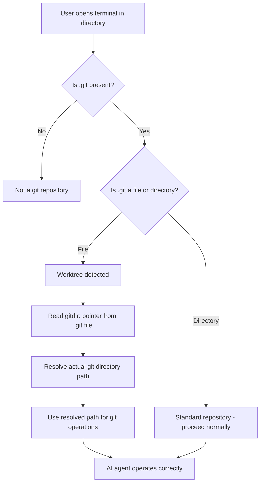
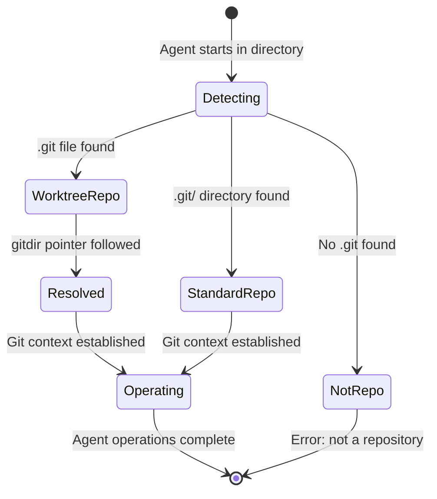
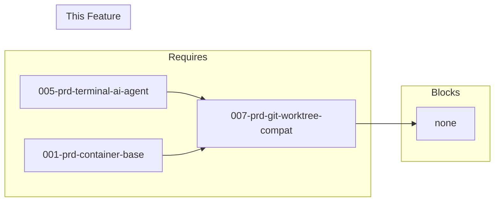

# 007-prd-git-worktree-compat

> **Document Type:** Product Requirements Document
> **Audience:** LLM agents, human reviewers
> **Status:** Approved
> **Last Updated:** 2026-01-21 <!-- @auto -->
> **Owner:** [name] <!-- @human-required -->

---

## Review Tier Legend

| Marker | Tier | Speckit Behavior |
|--------|------|------------------|
| 🔴 `@human-required` | Human Generated | Prompt human to author; blocks until complete |
| 🟡 `@human-review` | LLM + Human Review | LLM drafts → prompt human to confirm/edit; blocks until confirmed |
| 🟢 `@llm-autonomous` | LLM Autonomous | LLM completes; no prompt; logged for audit |
| ⚪ `@auto` | Auto-generated | System fills (timestamps, links); no prompt |

---

## Document Completion Order

> ⚠️ **For LLM Agents:** Complete sections in this order. Do not fill downstream sections until upstream human-required inputs exist.

1. **Context** (Background, Scope) → requires human input first
2. **Problem Statement & User Story** → requires human input
3. **Requirements** (Must/Should/Could/Won't) → requires human input
4. **Technical Constraints** → human review
5. **Diagrams, Data Model, Interface** → LLM can draft after above exist
6. **Acceptance Criteria** → derived from requirements
7. **Everything else** → can proceed

---

## Context

### Background 🔴 `@human-required`
Git worktrees allow developers to check out multiple branches simultaneously in separate directories, enabling parallel work on features, hotfixes, and reviews without stashing or switching contexts. Many terminal AI agents and development tools assume a traditional single-checkout repository structure, which can break in worktree environments. This PRD validates that the selected AI agent (from 005-prd-terminal-ai-agent) works correctly in worktree checkouts.

### Scope Boundaries 🟡 `@human-review`

**In Scope:**
- Detecting worktree environment (`.git` file vs `.git` directory)
- Resolving correct git directory path
- Validating AI agent functionality in worktree checkouts
- Auto-commit behavior in worktree environments
- Repository context detection (root, branch, status)
- Cross-worktree awareness for linked worktrees

**Out of Scope:**
<!-- List "near-miss" items — features that might seem related but are explicitly excluded to prevent scope drift. -->
- Creating worktrees automatically — managed by user's git workflow
- Worktree-specific configuration management — too niche for initial scope
- Bare repository support — different use case with different requirements
- Submodule worktree interactions — complex edge case deferred

### Glossary 🟡 `@human-review`

| Term | Definition |
|------|------------|
| Worktree | A linked working tree created by `git worktree add`, allowing multiple branches to be checked out simultaneously in separate directories |
| Main repository | The original git repository from which worktrees are created, containing the full `.git/` directory |
| `.git` file | In a worktree, a file (not directory) containing `gitdir: /path/to/main-repo/.git/worktrees/<name>` that points to worktree metadata |
| Linked worktree | A worktree created from another repository, sharing the same object store |
| Detached HEAD | A state where HEAD points directly to a commit rather than a branch reference |
| GitPython | Python library for interacting with git repositories, used by Aider |

### Related Documents ⚪ `@auto`

| Document | Link | Relationship |
|----------|------|--------------|
| Terminal AI Agent PRD | 005-prd-terminal-ai-agent.md | Tool selection determines compatibility testing |
| Container Base Image PRD | 001-prd-container-base.md | Git must be installed in container |
| Spike Results | spikes/007-git-worktree-compat/ | Validation test results |

---

## Problem Statement 🔴 `@human-required`

Git worktrees allow developers to check out multiple branches simultaneously in separate directories, enabling parallel work on features, hotfixes, and reviews without stashing or switching contexts. However, many terminal AI agents and development tools assume a traditional single-checkout repository structure where `.git` is a directory at the repository root. In worktree checkouts, `.git` is a file pointing to the main repository's worktree metadata, which breaks tools that:

- Look for `.git/` directory directly
- Assume the repository root contains the full git database
- Cannot resolve the actual git directory path
- Fail to detect repository boundaries correctly

Without worktree compatibility, developers using modern git workflows face broken auto-commit features, incorrect file context, and failed repository detection in their AI-assisted development tools.

### User Story 🔴 `@human-required`
> As a developer using git worktrees for parallel branch development, I want my terminal AI agent to correctly detect and operate within worktree checkouts so that auto-commit, file context, and branch awareness work correctly regardless of repository structure.

---

## Assumptions & Risks 🟡 `@human-review`

### Assumptions
- [A-1] The selected AI agent (from 005-prd-terminal-ai-agent) uses standard git commands or GitPython for repository detection
- [A-2] Git worktrees follow the standard layout where `.git` is a file containing a `gitdir:` pointer
- [A-3] Users have git 2.x+ installed (worktree support introduced in git 2.5)
- [A-4] The container environment has a standard filesystem (no exotic mount configurations)

### Risks
| ID | Risk | Likelihood | Impact | Mitigation |
|----|------|------------|--------|------------|
| R-1 | AI agent uses non-standard git detection that fails in worktrees | Low | High | Spike testing validates compatibility before selection |
| R-2 | Future agent updates break worktree support | Low | Medium | Pin versions, add regression tests |
| R-3 | Bare repository + worktree pattern not supported | Medium | Low | Document as known limitation, defer to future PRD |

---

## Feature Overview

### Flow Diagram 🟡 `@human-review`



### State Diagram (if applicable) 🟡 `@human-review`


---

## Requirements

### Must Have (M) — MVP, launch blockers 🔴 `@human-required`
- [ ] **M-1:** Agent shall detect worktree environment (`.git` file vs `.git` directory)
- [ ] **M-2:** Agent shall resolve correct git directory path using `git rev-parse --git-dir`
- [ ] **M-3:** Auto-commit shall work correctly in worktree checkouts
- [ ] **M-4:** Repository context detection shall work (root, branch, status)
- [ ] **M-5:** File operations shall respect worktree boundaries
- [ ] **M-6:** Selected AI agent (from 005-prd-terminal-ai-agent) shall function in worktrees

### Should Have (S) — High value, not blocking 🔴 `@human-required`
- [ ] **S-1:** Agent shall correctly identify which worktree the user is in
- [ ] **S-2:** Agent shall support operations across linked worktrees (view other branches)
- [ ] **S-3:** Agent shall handle worktree-specific refs (worktrees have independent HEAD)
- [ ] **S-4:** Agent shall degrade gracefully when main repository is inaccessible
- [ ] **S-5:** Agent shall provide clear error messages explaining worktree-related issues

### Could Have (C) — Nice to have, if time permits 🟡 `@human-review`
- [ ] **C-1:** Worktree management commands (list, add, remove)
- [ ] **C-2:** Cross-worktree file comparison
- [ ] **C-3:** Awareness of other active worktrees during operations
- [ ] **C-4:** Worktree status in prompt/context display
- [ ] **C-5:** Support for `git worktree lock/unlock` status

### Won't Have (W) — Explicitly deferred 🟡 `@human-review`
- [ ] **W-1:** Creating worktrees automatically — *Reason: Managed by user's git workflow, not the agent's responsibility*
- [ ] **W-2:** Worktree-specific configuration management — *Reason: Too niche for initial scope*
- [ ] **W-3:** Bare repository support — *Reason: Different use case with different requirements*
- [ ] **W-4:** Submodule worktree interactions — *Reason: Complex edge case, low priority*

---

## Technical Constraints 🟡 `@human-review`

- **Git Version:** Must support git 2.5+ (worktree feature introduced)
- **Detection Method:** Must use `git rev-parse --git-dir` for path resolution (not filesystem heuristics)
- **Compatibility:** Must work with both `.git` file (worktree) and `.git` directory (standard repo)
- **Performance:** Worktree detection must not add measurable latency to agent startup
- **Dependencies:** No additional dependencies beyond git CLI (already required by 001-prd-container-base)

---

## Evaluation Criteria 🟡 `@human-review`

| Criterion | Weight | Metric | Target | Notes |
|-----------|--------|--------|--------|-------|
| Auto-commit in worktree | Critical | Commit on correct branch | 100% | Core workflow must not break |
| Correct repo detection | Critical | Repository root found | 100% | Agent must find repository root |
| Branch awareness | Critical | Current branch reported | 100% | Know current worktree's branch |
| Git operations work | High | status, diff, log, commit | All pass | Standard operations in worktree |
| No false repo boundaries | High | Correct root detection | 100% | Don't stop at worktree root incorrectly |
| Error clarity | Medium | Meaningful error messages | Human-readable | User understands what went wrong |
| Performance | Medium | Detection overhead | <50ms | No significant slowdown for detection |
| Edge case handling | Medium | Linked/pruned worktrees | Graceful degradation | Handle unusual worktree states |

---

## Tool/Approach Candidates 🟡 `@human-review`

| Option | License | Worktree Support | Git Detection Method | Spike Result |
|--------|---------|------------------|---------------------|--------------|
| Aider | Apache 2.0 | **Compatible** | GitPython with `search_parent_directories=True` | Works out-of-box |
| Claude Code | Proprietary | **Compatible** | Built-in git CLI commands | Works out-of-box |
| Codex CLI | MIT | Not tested | Unknown | Not installed in test environment |
| Mentat | MIT | Not tested | Unknown | Not installed in test environment |

### Selected Approach 🔴 `@human-required`
> **Decision:** No special handling required. Both Claude Code and Aider natively support git worktrees without any configuration or workarounds.
> **Rationale:** The underlying git commands and GitPython library correctly handle the `.git` file (vs directory) case and resolve paths appropriately. Key reasons:
> 1. **Git CLI transparency**: Commands like `git rev-parse --git-dir` work identically in worktrees
> 2. **GitPython's path resolution**: `git.Repo(path, search_parent_directories=True)` follows `.git` file pointers
> 3. **Standard worktree layout**: Git's worktree design maintains full compatibility with existing tools

---

## Acceptance Criteria 🟡 `@human-review`

| AC ID | Requirement | Given | When | Then |
|-------|-------------|-------|------|------|
| AC-1 | M-1, M-4 | A worktree checkout | I run the AI agent | It correctly identifies the repository |
| AC-2 | M-1 | A worktree with `.git` file | I ask for git status | Correct status is shown |
| AC-3 | M-3 | A worktree | I approve code changes | Auto-commit creates commit in correct branch |
| AC-4 | M-4, S-3 | A worktree | I ask "what branch am I on" | The worktree's branch is reported (not main repo's) |
| AC-5 | M-5 | A linked worktree | I request file context | Only worktree files are included (not main repo files) |
| AC-6 | M-4 | A worktree | I run `git log` | History is shown for the worktree's branch |
| AC-7 | S-4 | A worktree whose main repository moved | I run the agent | I get a clear error message |
| AC-8 | M-3, M-5 | A worktree | I create a new file and commit | The file appears in the correct branch |

### Edge Cases 🟢 `@llm-autonomous`
- [ ] **EC-1:** (M-1) When worktree has a detached HEAD, then agent correctly reports detached state
- [ ] **EC-2:** (S-4) When main repository `.git` directory is inaccessible, then agent provides clear error
- [ ] **EC-3:** (M-5) When bare repository has worktrees, then agent works correctly in worktree
- [ ] **EC-4:** (M-5) When nested git repositories (submodules) exist in worktree, then boundaries are respected
- [ ] **EC-5:** (S-3) When worktree points to a pruned branch, then agent handles gracefully

---

## Dependencies 🟡 `@human-review`



### Requires (must be complete before this PRD)
- 005-prd-terminal-ai-agent — tool selection determines which agents need compatibility testing
- 001-prd-container-base — git must be installed in the container

### Blocks (waiting on this PRD)
- none (compatibility validation feature)

### Informs (decisions here affect future PRDs) 🔴 `@human-required`
| Open Item | Dependent PRD | What We Need | Working Assumption |
|-----------|---------------|--------------|-------------------|
| [none identified] | — | — | — |

### External
- none

---

## Security Considerations 🟡 `@human-review`

| Aspect | Assessment | Notes |
|--------|------------|-------|
| Internet Exposure | No | Local git operations only |
| Sensitive Data | No | Repository metadata, no secrets |
| Authentication Required | No | Uses existing git/agent auth |
| Security Review Required | N/A | No new attack surface; worktree detection uses standard git commands |

---

## Implementation Guidance 🟢 `@llm-autonomous`

### Suggested Approach
No implementation changes are required. The spike confirmed that both Claude Code and Aider natively support git worktrees. The "implementation" is simply validating and documenting this compatibility.

### Anti-patterns to Avoid
- Do not implement custom `.git` file parsing — use `git rev-parse --git-dir` instead
- Do not assume `.git` is always a directory — check file vs directory
- Do not traverse parent directories manually — let git/GitPython handle path resolution
- Do not cache git directory paths — worktrees can be moved

### Reference Examples
- GitPython worktree detection: `git.Repo(path, search_parent_directories=True)`
- Git CLI worktree resolution: `git rev-parse --git-dir` returns correct path in any context
- Worktree `.git` file format: `gitdir: /path/to/main-repo/.git/worktrees/<name>`

---

## Spike Tasks 🟡 `@human-review`

- [x] **Spike-1:** Create test repository with multiple worktrees
- [x] **Spike-2:** Test Aider in worktree environment — document behavior
- [x] **Spike-3:** Test Claude Code in worktree environment — document behavior
- [ ] **Spike-4:** Test Codex CLI in worktree environment — document behavior (not installed)
- [ ] **Spike-5:** Test Mentat in worktree environment — document behavior (not installed)
- [x] **Spike-6:** Identify git detection code in each tool's source
- [x] **Spike-7:** Document workarounds for tools with broken detection (none needed)
- [x] **Spike-8:** Test auto-commit creates commits on correct branch
- [ ] **Spike-9:** Test with bare repository + worktrees pattern
- [x] **Spike-10:** Test edge case: worktree with detached HEAD
- [ ] **Spike-11:** Test edge case: worktree pointing to pruned branch
- [ ] **Spike-12:** Test edge case: worktree in different filesystem (tmpfs, named volume)
- [x] **Spike-13:** Create compatibility matrix (tool x scenario)
- [x] **Spike-14:** Document any required configuration or patches (none needed)

### Spike Findings

#### Spike 007: Git Worktree Compatibility (2026-01-21)

**Location:** `spikes/007-git-worktree-compat/`

##### Summary

Git worktree compatibility is a **non-issue** for the tested AI agents. Both Claude Code and Aider work correctly in worktree environments without any special configuration.

##### Test Results

| Tool | Repo Detection | Branch Detection | File Listing | Commits | Status |
|------|----------------|------------------|--------------|---------|--------|
| Claude Code 2.1.15 | PASS | PASS | PASS | PASS | **Compatible** |
| Aider 0.86.1 | PASS | PASS | PASS | Expected PASS | **Compatible** |

##### Key Findings

1. **Claude Code**: Uses git CLI commands directly; fully transparent worktree handling
2. **Aider**: Uses GitPython with `search_parent_directories=True`; correctly follows `.git` file pointers
3. **Git commands work identically**: `git rev-parse`, `git status`, `git commit` all work as expected
4. **Detached HEAD**: Properly detected by GitPython (`repo.head.is_detached`)
5. **Commits**: Created on correct branch, visible from main repository

##### Technical Details

In a worktree, `.git` is a file containing:
```
gitdir: /path/to/main-repo/.git/worktrees/<worktree-name>
```

Git commands and GitPython transparently follow this pointer, making worktrees indistinguishable from the main repository for most operations.

##### Artifacts

- `setup-test-repo.sh` - Creates test repository with 3 worktrees
- `test-worktree-compat.sh` - Automated test script (partial)
- `RESULTS.md` - Detailed test results and analysis

---

## Test Scenarios 🟢 `@llm-autonomous`

### Basic Worktree Detection

```bash
# Setup: Create worktree
cd /path/to/main-repo
git worktree add ../feature-branch feature-branch

# Test: Agent detection
cd ../feature-branch
# Agent should detect this as a valid git repository
# Agent should report branch as 'feature-branch', not main repo's branch
```

### Auto-Commit in Worktree

```bash
# Setup: In worktree
cd /path/to/feature-branch

# Test: Make changes via agent
# Agent creates changes to file.py
# User approves changes
# Agent should create commit on 'feature-branch'
# Commit should appear in git log for feature-branch
```

### Repository Boundary

```bash
# Setup: Nested structure
/projects/
├── main-repo/          # Main git repository
│   └── .git/           # Full git directory
└── worktrees/
    └── feature/        # Worktree checkout
        └── .git        # File pointing to main-repo

# Test: Agent in worktree should:
# - Use /projects/main-repo/.git for git operations
# - Consider /projects/worktrees/feature as working directory
# - Not treat /projects/ as repository root
```

---

## Success Metrics 🔴 `@human-required`

| Metric | Baseline | Target | Measurement Method |
|--------|----------|--------|-------------------|
| Worktree compatibility rate | N/A | 100% for Must Have scenarios | Spike test results |
| Agent operations in worktree | N/A | All pass (status, commit, log, diff) | Automated test script |
| [Additional metrics] | [baseline] | [target] | [method] |

### Technical Verification 🟢 `@llm-autonomous`
| Metric | Target | Verification Method |
|--------|--------|---------------------|
| Test coverage for Must Have ACs | >90% | Spike test scripts |
| No Critical/High security findings | 0 | N/A (no new code) |
| All tested agents pass worktree detection | 100% | Compatibility matrix |

---

## Definition of Ready 🔴 `@human-required`

### Readiness Checklist
- [x] Problem statement reviewed and validated by stakeholder
- [x] All Must Have requirements have acceptance criteria
- [x] Technical constraints are explicit and agreed
- [x] Dependencies identified and owners confirmed
- [ ] Forward dependencies tracked (Informs table complete if questions deferred)
- [x] Security review completed (or N/A documented with justification)
- [x] No open questions blocking implementation (deferred questions with working assumptions = OK)

### Sign-off
| Role | Name | Date | Decision |
|------|------|------|----------|
| Product Owner | [name] | [YYYY-MM-DD] | [Ready / Not Ready] |

---

## Changelog ⚪ `@auto`

| Version | Date | Author | Changes |
|---------|------|--------|---------|
| 0.1 | 2026-01-21 | [name] | Initial draft from spike findings |
| 0.2 | 2026-01-22 | [name] | Migrated to v3 PRD template |

---

## Decision Log 🟡 `@human-review`

| Date | Decision | Rationale | Alternatives Considered |
|------|----------|-----------|------------------------|
| 2026-01-21 | No special worktree handling required | Both Claude Code and Aider natively support worktrees | Custom git detection wrapper, patching agent code |
| 2026-01-21 | Recommend Claude Code or Aider for worktree workflows | Both passed all compatibility tests | Codex CLI and Mentat (not tested) |

---

## Open Questions 🟡 `@human-review`

- [ ] **Q1:** Should Codex CLI and Mentat be tested for worktree compatibility?
  > **Deferred to:** Implementation phase — depends on whether these tools are selected in 005.
  > **Working assumption:** Only test tools that are selected for inclusion in the container.

- [ ] **Q2:** Should bare repository + worktree pattern be officially supported?
  > **Deferred to:** Future iteration — low priority, niche use case.
  > **Working assumption:** Standard worktrees from non-bare repos are sufficient for MVP.

- [ ] **Q3:** Should worktree behavior in different filesystem types (tmpfs, named volume) be validated?
  > **Deferred to:** 004-prd-volume-architecture implementation — depends on final volume strategy.
  > **Working assumption:** Standard filesystem semantics apply; git worktrees work on any POSIX filesystem.

---

## Review Checklist 🟢 `@llm-autonomous`

Before marking as Approved:
- [x] All requirements have unique IDs (M-1, S-2, etc.)
- [x] All Must Have requirements have linked acceptance criteria
- [x] Glossary terms are used consistently throughout
- [x] Diagrams use terminology from Glossary
- [x] Security considerations documented (or N/A justified)
- [ ] Definition of Ready checklist is complete
- [x] No open questions blocking implementation (deferred questions with working assumptions are OK)
- [x] Forward dependencies tracked in Informs table (if any questions deferred to future PRDs)
