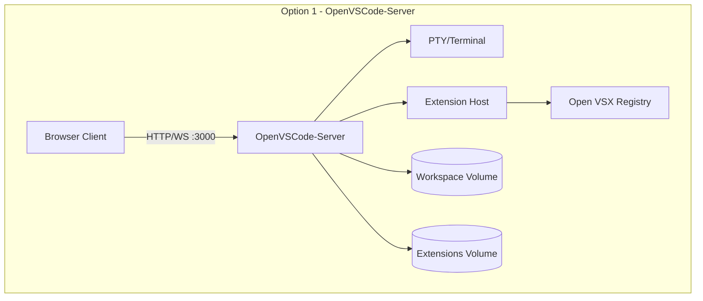
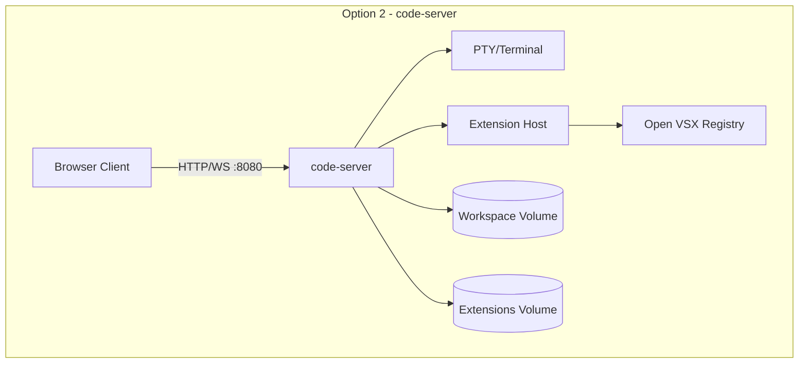
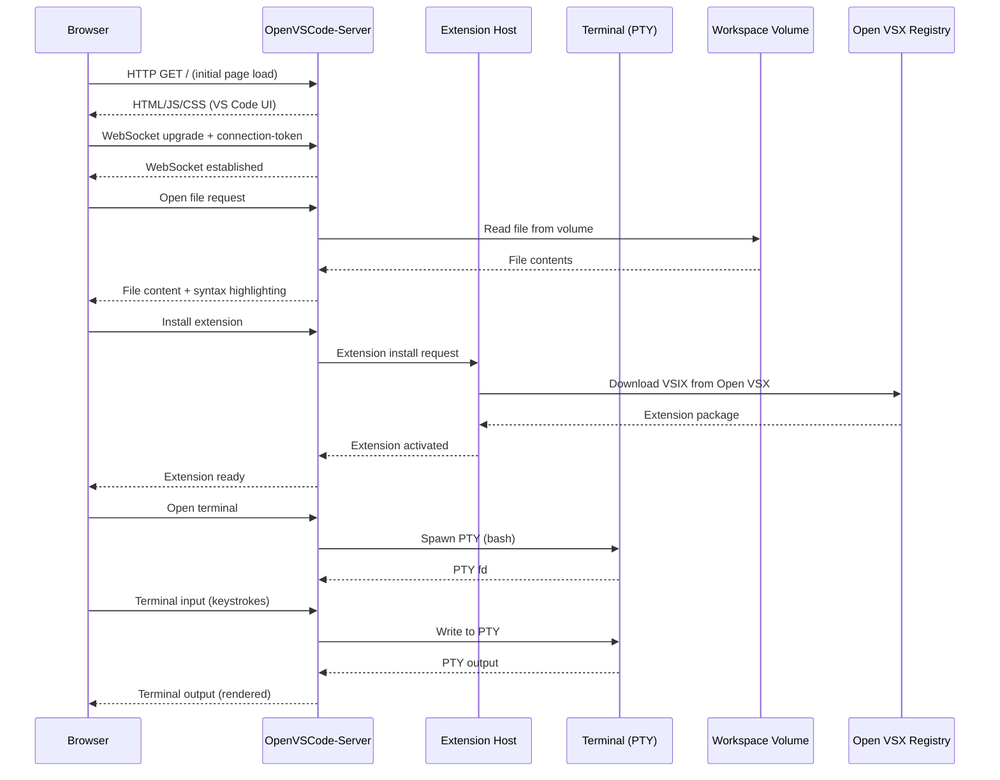
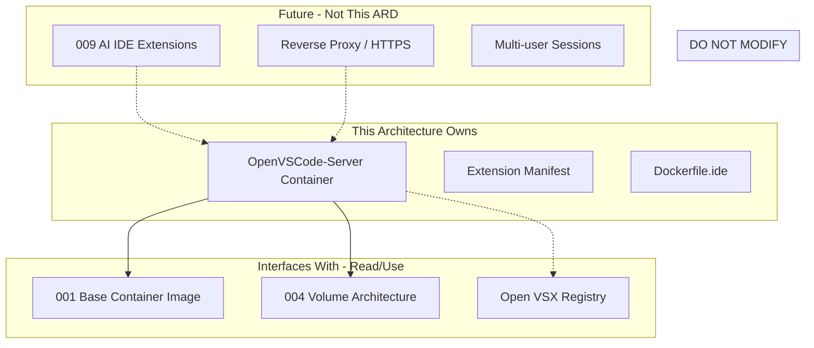

# 008-ard-containerized-ide

> **Document Type:** Architecture Decision Record
> **Audience:** LLM agents, human reviewers
> **Status:** Proposed
> **Last Updated:** 2026-01-23 <!-- @auto -->
> **Owner:** Brian <!-- @human-required -->
> **Deciders:** Brian <!-- @human-required -->

---

## Review Tier Legend

| Marker | Tier | Speckit Behavior |
|--------|------|------------------|
| 🔴 `@human-required` | Human Generated | Prompt human to author; blocks until complete |
| 🟡 `@human-review` | LLM + Human Review | LLM drafts → prompt human to confirm/edit; blocks until confirmed |
| 🟢 `@llm-autonomous` | LLM Autonomous | LLM completes; no prompt; logged for audit |
| ⚪ `@auto` | Auto-generated | System fills (timestamps, links); no prompt |

---

## Document Completion Order

> ⚠️ **For LLM Agents:** Complete sections in this order. Do not fill downstream sections until upstream human-required inputs exist.

1. **Summary (Decision)** → requires human input first
2. **Context (Problem Space)** → requires human input
3. **Decision Drivers** → requires human input (prioritized)
4. **Driving Requirements** → extract from PRD, human confirms
5. **Options Considered** → LLM drafts after drivers exist, human reviews
6. **Decision (Selected + Rationale)** → requires human decision
7. **Implementation Guardrails** → LLM drafts, human reviews
8. **Everything else** → can proceed after decision is made

---

## Linkage ⚪ `@auto`

| Document | ID | Relationship |
|----------|-----|--------------|
| Parent PRD | 008-prd-containerized-ide.md | Requirements this architecture satisfies |
| Security Review | 008-sec-containerized-ide.md | Security implications of this decision |
| Supersedes | — | N/A (greenfield) |
| Superseded By | — | — |

---

## Summary

### Decision 🔴 `@human-required`
> Use OpenVSCode-Server (gitpod/openvscode-server) as the containerized IDE, running as a Dockerfile layer atop the base container image, accessible via browser on a single HTTP port with token-based authentication.

### TL;DR for Agents 🟡 `@human-review`
> The IDE layer uses OpenVSCode-Server running inside Docker, exposed on port 3000 via HTTP/WebSocket. Extensions install from Open VSX (not Microsoft Marketplace). Authentication uses a connection token passed via environment variable. HTTPS is handled externally by a reverse proxy — do NOT embed TLS in the container. Do NOT run the server as root.

---

## Context

### Problem Space 🔴 `@human-required`

The containerized development environment (001-prd-container-base) needs a full-featured IDE accessible from any device without local IDE installation. The architecture must select a VS Code-compatible server that runs entirely within Docker, supports multi-arch builds (arm64/amd64), uses an open-source license, and integrates with the existing volume architecture (004-prd-volume-architecture) for workspace persistence.

### Decision Scope 🟡 `@human-review`

**This ARD decides:**
- Which VS Code server implementation to use (OpenVSCode-Server vs code-server vs others)
- How the IDE integrates with the container image (layer strategy)
- How extensions are managed (installation, persistence, registry source)
- How authentication is configured (token mechanism)
- How the IDE exposes its interface (port, protocol)

**This ARD does NOT decide:**
- HTTPS/TLS termination strategy (deferred — handled by external reverse proxy)
- Multi-user session isolation (deferred to future team collaboration PRD)
- AI extension integration (deferred to 009-prd-ai-ide-extensions)
- IDE credential/secret management for extensions (deferred to 009-prd-ai-ide-extensions)

### Current State 🟢 `@llm-autonomous`

N/A — greenfield implementation. The base container image (001-prd-container-base) exists with Debian Bookworm-slim, Python 3.14+, and Node.js 22.x, but has no IDE layer.

### Driving Requirements 🟡 `@human-review`

| PRD Req ID | Requirement Summary | Architectural Implication |
|------------|---------------------|---------------------------|
| M-1 | IDE runs entirely within Docker container | Server binary must be embeddable in Dockerfile layer |
| M-2 | Browser-accessible, no host IDE installation | Must serve full UI over HTTP/WebSocket |
| M-3 | Full code editing with syntax highlighting, IntelliSense | Requires VS Code engine (not a lightweight editor) |
| M-4 | Integrated terminal access | Server must proxy PTY sessions to container shell |
| M-6 | Extension installation for language tooling | Must support Open VSX registry and VSIX sideloading |
| M-8 | arm64 and amd64 support | Multi-arch container manifest required |
| M-9 | Open source or permissive license (MIT/Apache) | Eliminates proprietary options |
| S-3 | Authentication and access control | Token-based auth mechanism required |
| S-5 | Persistent workspace configuration via volumes | Volume mount points for workspace and extensions |

**PRD Constraints inherited:**
- Container Runtime: Docker, compatible with 001 base image
- Architecture: Multi-arch manifest (linux/amd64, linux/arm64)
- Licensing: MIT or Apache 2.0 only
- Resource Limits: Function within 512MB container memory
- Network: Single HTTP port, HTTPS via external reverse proxy
- Extensions: Open VSX registry only

---

## Decision Drivers 🔴 `@human-required`

1. **Resource Efficiency:** Minimize container image size and idle memory consumption *(traces to PRD Technical Constraints)*
2. **Upstream Alignment:** Stay close to VS Code upstream to reduce maintenance burden and extension compatibility issues *(traces to M-3, M-6)*
3. **Licensing:** Must be MIT/Apache with no proprietary dependencies *(traces to M-9)*
4. **Multi-arch Support:** Native arm64 and amd64 without emulation *(traces to M-8)*
5. **Operational Simplicity:** Minimize configuration surface; single port, file-based config, env var injection *(traces to M-1, S-3)*

---

## Options Considered 🟡 `@human-review`

### Option 0: Status Quo / Do Nothing

**Description:** No IDE is embedded in the container. Developers use their local IDE with SSH or Docker exec for terminal access.

| Driver | Rating | Notes |
|--------|--------|-------|
| Resource Efficiency | ✅ Good | No IDE overhead in container |
| Upstream Alignment | N/A | No VS Code server involved |
| Licensing | ✅ Good | No additional dependencies |
| Multi-arch Support | ✅ Good | No additional binary needed |
| Operational Simplicity | ❌ Poor | Requires host IDE installation, breaks "any device" requirement |

**Why not viable:** Directly violates M-1 (IDE must run in container) and M-2 (browser-accessible, no host installation). The core value proposition of the project is device-independent development.

---

### Option 1: OpenVSCode-Server (Gitpod)

**Description:** Gitpod's open-source VS Code server — a direct fork with minimal patches, staying close to upstream VS Code. Published as `gitpod/openvscode-server` on Docker Hub with multi-arch manifests.



| Driver | Rating | Notes |
|--------|--------|-------|
| Resource Efficiency | ✅ Good | 848MB image, 23MB idle RAM (spike verified) |
| Upstream Alignment | ✅ Good | Minimal patches over VS Code; Gitpod tracks upstream closely |
| Licensing | ✅ Good | MIT license |
| Multi-arch Support | ✅ Good | Official manifest: linux/amd64, linux/arm64 |
| Operational Simplicity | ✅ Good | Single binary, `--connection-token` flag, env var config |

**Pros:**
- Smallest image size (848MB vs 1.12GB for code-server)
- Lowest idle memory (23MB vs 37MB for code-server)
- Closest to upstream VS Code — fewer compatibility surprises
- Official multi-arch Docker images maintained by Gitpod
- 8-second startup time verified in spike

**Cons:**
- Smaller community than code-server
- Less documentation and fewer Stack Overflow answers
- Gitpod is sole maintainer (bus factor)

---

### Option 2: code-server (Coder)

**Description:** Coder's open-source project that runs VS Code on a remote server. More established community, diverges more from upstream to add features like password auth and proxy support.



| Driver | Rating | Notes |
|--------|--------|-------|
| Resource Efficiency | ⚠️ Medium | 1.12GB image, 37MB idle RAM |
| Upstream Alignment | ⚠️ Medium | Diverges from upstream for added features (password auth, proxy) |
| Licensing | ✅ Good | MIT license |
| Multi-arch Support | ✅ Good | Multi-arch images available |
| Operational Simplicity | ✅ Good | Well-documented configuration, password or token auth |

**Pros:**
- Larger community, more documentation
- Enterprise features (built-in password auth, proxy support)
- Coder Inc. backing with enterprise product
- More Stack Overflow/GitHub discussion references

**Cons:**
- Larger image (1.12GB) and higher memory (37MB idle)
- More divergence from upstream VS Code means potential extension compatibility issues
- Added features increase attack surface unnecessarily for single-user scenario

---

### Option 3: VS Code Tunnels (Microsoft)

**Description:** Microsoft's official remote development solution using vscode.dev as the client and a tunnel binary in the container.

| Driver | Rating | Notes |
|--------|--------|-------|
| Resource Efficiency | ✅ Good | Small tunnel binary |
| Upstream Alignment | ✅ Good | Official Microsoft VS Code |
| Licensing | ❌ Poor | Requires Microsoft account; proprietary tunnel service dependency |
| Multi-arch Support | ✅ Good | Official binaries for both architectures |
| Operational Simplicity | ❌ Poor | Requires internet, MS account, external service dependency |

**Why not viable:** Requires Microsoft account and depends on external vscode.dev service. Violates M-9 (open source/permissive license) and introduces external service dependency incompatible with offline/air-gapped use.

---

### Option 4: JetBrains Gateway

**Description:** JetBrains' remote development solution with a backend running in the container and Gateway client on the host.

| Driver | Rating | Notes |
|--------|--------|-------|
| Resource Efficiency | ❌ Poor | Large backend, high memory consumption |
| Upstream Alignment | N/A | Not VS Code-based |
| Licensing | ❌ Poor | Proprietary, requires paid license |
| Multi-arch Support | ⚠️ Medium | Limited arm64 support |
| Operational Simplicity | ❌ Poor | Requires host Gateway client installation |

**Why not viable:** Proprietary license violates M-9. Requires host client installation, violating M-2 (browser-accessible, no host installation).

---

## Decision

### Selected Option 🔴 `@human-required`
> **Option 1: OpenVSVC-Server (Gitpod)**

### Rationale 🔴 `@human-required`

OpenVSCode-Server wins on the two highest-priority drivers: resource efficiency (smallest footprint by 30%) and upstream alignment (minimal patches). Both MIT-licensed options (Option 1 and 2) satisfy the licensing and multi-arch requirements equally. The tie-breaker is the resource profile: 848MB vs 1.12GB image, 23MB vs 37MB idle RAM. The smaller community (con) is acceptable because the project is MIT licensed — if Gitpod abandons it, code-server is a documented fallback with minimal migration cost (same extension format, same Open VSX registry).

#### Simplest Implementation Comparison 🟡 `@human-review`

| Aspect | Simplest Possible | Selected Option | Justification for Complexity |
|--------|-------------------|-----------------|------------------------------|
| Components | Single `docker run gitpod/openvscode-server` | Dockerfile layer + extension manifest + volume mounts | Extensions need persistence across rebuilds (S-5); token auth needed (S-3) |
| Dependencies | Base image only | Base image + OpenVSCode-Server binary + Open VSX extensions | M-6 requires extension support; M-3 requires full VS Code engine |
| Patterns | Direct port forward | Token auth + env var injection + volume architecture | S-3 mandates authentication; S-5 mandates persistence |

**Complexity justified by:** PRD requirements S-3 (auth) and S-5 (persistence) mandate configuration beyond a bare `docker run`. The extension manifest pattern avoids baking extensions into the image (anti-pattern from PRD guidance).

### Architecture Diagram 🟡 `@human-review`

```mermaid
graph TD
    subgraph Host Machine
        Browser[Web Browser<br/>localhost:3000]
        Docker[Docker Engine]
        EnvFile[".env file<br/>(IDE_TOKEN)"]
    end

    subgraph Docker Network
        subgraph IDE Container
            OVSC[OpenVSCode-Server<br/>:3000]
            ExtHost[Extension Host]
            Terminal[Integrated Terminal<br/>PTY]
            Git[Git CLI]
        end
    end

    subgraph Volumes
        WS[(workspace<br/>/home/workspace)]
        EXT[(extensions<br/>/home/.openvscode-server/extensions)]
    end

    subgraph External
        OpenVSX[Open VSX Registry<br/>openvsx.org]
    end

    Browser -->|"HTTP/WebSocket + Token"| OVSC
    OVSC --> ExtHost
    OVSC --> Terminal
    OVSC --> Git
    OVSC --> WS
    ExtHost --> EXT
    ExtHost -.->|"Install extensions"| OpenVSX
    Docker --> IDE Container
    EnvFile -.->|"CONNECTION_TOKEN"| OVSC
```

---

## Technical Specification

### Component Overview 🟡 `@human-review`

| Component | Responsibility | Interface | Dependencies |
|-----------|---------------|-----------|--------------|
| OpenVSCode-Server | VS Code server process; serves IDE UI, manages extensions, terminals | HTTP/WebSocket on :3000 | Base container image (001) |
| Extension Host | Runs VS Code extensions in isolated process | Internal IPC (managed by OVSC) | Open VSX Registry, Extensions Volume |
| Integrated Terminal | PTY proxy for container shell access | WebSocket (via OVSC) | Container bash shell |
| Workspace Volume | Persistent storage for project files | Filesystem mount at /home/workspace | Docker volume (004) |
| Extensions Volume | Persistent storage for installed extensions | Filesystem mount at /home/.openvscode-server/extensions | Docker volume (004) |
| Connection Token | Authentication gate for WebSocket connections | Environment variable `CONNECTION_TOKEN` | .env file or Docker secrets |

### Data Flow 🟢 `@llm-autonomous`



### Interface Definitions 🟡 `@human-review`

```yaml
# Docker Compose service definition (primary interface)
services:
  ide:
    build:
      context: .
      dockerfile: Dockerfile.ide
    ports:
      - "3000:3000"
    environment:
      - CONNECTION_TOKEN=${IDE_TOKEN}
    volumes:
      - workspace:/home/workspace
      - extensions:/home/.openvscode-server/extensions
    user: "1000:1000"  # openvscode-server user, NOT root
    mem_limit: 512m

volumes:
  workspace:
    external: true  # Managed by 004-prd-volume-architecture
  extensions:
```

```dockerfile
# Dockerfile.ide — IDE layer on top of base image
FROM gitpod/openvscode-server:latest AS ide-base

# Install extensions from manifest
COPY extensions.json /tmp/extensions.json
RUN /home/.openvscode-server/bin/openvscode-server \
    --install-extension <ext-id> ...

# Entrypoint with token auth
ENTRYPOINT ["/home/.openvscode-server/bin/openvscode-server", \
    "--host", "0.0.0.0", \
    "--port", "3000", \
    "--without-connection-token"]
# Note: --connection-token is set via env var at runtime, not baked in
```

```json
// extensions.json — Extension manifest
{
  "recommendations": [
    "ms-python.python",
    "rust-lang.rust-analyzer",
    "esbenp.prettier-vscode"
  ]
}
```

### Key Algorithms/Patterns 🟡 `@human-review`

**Pattern:** Extension Manifest Installation

```
Entrypoint script on container start:
1. Read extensions.json manifest
2. For each extension ID:
   a. Check if already installed in extensions volume
   b. If missing, install from Open VSX registry
   c. If registry unavailable, skip with warning (non-fatal)
3. Start OpenVSCode-Server with configured token
```

**Pattern:** Token Authentication Flow

```
1. IDE_TOKEN environment variable set in .env or Docker secrets
2. OpenVSCode-Server starts with --connection-token=${CONNECTION_TOKEN}
3. Browser initial request returns login page
4. User provides token → server validates → WebSocket established
5. Token persists in browser session storage (cleared on tab close)
```

---

## Constraints & Boundaries

### Technical Constraints 🟡 `@human-review`

**Inherited from PRD:**
- Container Runtime: Docker, compatible with 001-prd-container-base
- Multi-arch manifest required: linux/amd64, linux/arm64
- MIT or Apache 2.0 license only
- Function within 512MB container memory limit
- Single HTTP port exposure; HTTPS via external reverse proxy
- Open VSX registry only (no Microsoft Marketplace)
- Token-based authentication (no Microsoft account dependency)

**Added by this Architecture:**
- **Base Image:** `gitpod/openvscode-server:latest` (pinned to specific tag in production)
- **User:** Run as UID 1000 (openvscode-server user), never root
- **Port:** 3000 (fixed — matches upstream default)
- **Volumes:** Two named volumes required (workspace, extensions)
- **Environment:** `CONNECTION_TOKEN` env var required at runtime

### Architectural Boundaries 🟡 `@human-review`



- **Owns:** OpenVSCode-Server container configuration, extension manifest, IDE Dockerfile layer
- **Interfaces With:** Base container image (001), volume architecture (004), Open VSX registry
- **Must Not Touch:** Base image internals, volume driver configuration, HTTPS termination

### Implementation Guardrails 🟡 `@human-review`

> ⚠️ **Critical for LLM Agents:**

- [ ] **DO NOT** embed HTTPS/TLS certificates in the container *(from PRD anti-pattern: use external reverse proxy)*
- [ ] **DO NOT** bake extensions into the Docker image *(from PRD anti-pattern: use volume + manifest for flexibility)*
- [ ] **DO NOT** hardcode authentication tokens in Dockerfile or source *(from PRD anti-pattern: use environment variables)*
- [ ] **DO NOT** run OpenVSCode-Server as root *(from PRD anti-pattern: preserve openvscode-server user)*
- [ ] **DO NOT** use Microsoft Marketplace or require Microsoft account *(from PRD M-9, Technical Constraints)*
- [ ] **MUST** expose only a single port (3000) *(from PRD Technical Constraints)*
- [ ] **MUST** support both arm64 and amd64 in multi-arch manifest *(satisfies PRD M-8)*
- [ ] **MUST** use `--connection-token` for authentication *(satisfies PRD S-3)*
- [ ] **MUST** mount workspace and extensions as Docker volumes *(satisfies PRD S-5)*

---

## Consequences 🟡 `@human-review`

### Positive
- Smallest resource footprint of any viable option (848MB image, 23MB idle RAM)
- Close upstream alignment reduces extension compatibility issues
- MIT license allows unrestricted modification and distribution
- Token auth is simple to automate (env var injection)
- Volume-based extension persistence enables fast rebuilds without re-downloading

### Negative
- Smaller community means fewer ready-made solutions to edge-case problems
- Gitpod as sole maintainer creates dependency risk (mitigated by MIT license + code-server fallback)
- Open VSX registry may lack some extensions available in Microsoft Marketplace
- No built-in HTTPS means external infrastructure needed for remote access

### Risks & Mitigations

| Risk | Likelihood | Impact | Mitigation |
|------|------------|--------|------------|
| Gitpod abandons OpenVSCode-Server | Low | High | code-server is documented fallback; both MIT, same extension format |
| Critical extension missing from Open VSX | Medium | Medium | VSIX sideloading supported; can build from source |
| WebSocket connections blocked by corporate proxy | Low | Medium | Document port requirements; support reverse proxy path |
| Container memory spike during heavy extension use | Low | Medium | 512MB limit set; monitor with `docker stats` |

---

## Implementation Guidance

### Suggested Implementation Order 🟢 `@llm-autonomous`

1. **Dockerfile.ide** — Create IDE layer using `gitpod/openvscode-server` base, configure user and port
2. **Extension manifest** — Define `extensions.json` with required extensions for target languages
3. **Entrypoint script** — Install missing extensions from manifest on startup, then launch server with token
4. **Docker Compose integration** — Add `ide` service with volume mounts and environment config
5. **Volume configuration** — Integrate with 004-prd-volume-architecture for workspace and extension persistence
6. **Authentication testing** — Verify token auth rejects unauthorized access
7. **Multi-arch build** — Verify arm64/amd64 via `docker buildx` with manifest

### Testing Strategy 🟢 `@llm-autonomous`

| Layer | Test Type | Coverage Target | Notes |
|-------|-----------|-----------------|-------|
| Unit | Entrypoint script | Logic paths | Test extension install, token validation |
| Integration | Container startup | M-1, M-2 | Verify HTTP 200 on :3000, WebSocket upgrade |
| Integration | Extension install | M-6 | Verify extensions load from Open VSX |
| Integration | Terminal access | M-4 | Verify PTY session in container |
| Integration | Auth rejection | S-3 | Verify 401 without valid token |
| E2E | Full workflow | AC-1 through AC-7 | Browser automation (Playwright) |
| Multi-arch | Build matrix | M-8 | CI builds for linux/amd64 + linux/arm64 |

### Reference Implementations 🟡 `@human-review`

- [Gitpod Docker examples](https://github.com/gitpod-io/openvscode-server/tree/main/scripts) *(external — Gitpod official)*
- Spike results: `spikes/008-containerized-ide/RESULTS.md` *(internal)*
- Existing pattern: `006-ard-agentic-assistant.md` for Dockerfile layer approach *(internal)*

### Anti-patterns to Avoid 🟡 `@human-review`

- **Don't:** Install extensions at image build time into the image layer
  - **Why:** Forces image rebuild for any extension change; increases image size
  - **Instead:** Use volume mount + manifest script at container start

- **Don't:** Use `--without-connection-token` in production
  - **Why:** Exposes IDE to any network-reachable client without authentication
  - **Instead:** Always set `CONNECTION_TOKEN` env var

- **Don't:** Pin to `latest` tag in production Dockerfiles
  - **Why:** Non-deterministic builds; breaking changes on upstream release
  - **Instead:** Pin to specific version tag (e.g., `gitpod/openvscode-server:1.85.0`)

- **Don't:** Expose multiple ports from the IDE container
  - **Why:** Increases attack surface; complicates firewall rules
  - **Instead:** All communication through single HTTP/WebSocket port 3000

---

## Compliance & Cross-cutting Concerns

### Security Considerations 🟡 `@human-review`

[Full details in 008-sec-containerized-ide.md]

- **Authentication:** Connection token required for WebSocket upgrade; no anonymous access
- **Authorization:** Single-user model; token holder has full access to workspace
- **Data handling:** Source code on workspace volume; credentials via env vars only (never in image layers)
- **Network:** Localhost-only by default; external access requires explicit reverse proxy configuration

### Observability 🟢 `@llm-autonomous`

- **Logging:** OpenVSCode-Server stdout/stderr to Docker logs; extension host logs to `~/.openvscode-server/data/logs/`
- **Metrics:** Container resource usage via `docker stats`; startup time measurable from container start to HTTP 200
- **Tracing:** Not applicable for single-user local IDE; relevant when behind reverse proxy for remote access

### Error Handling Strategy 🟢 `@llm-autonomous`

```
Error Category → Handling Approach
├── Extension install failure → Log warning, continue startup (non-fatal)
├── Open VSX unreachable → Skip extension install, use cached (volume)
├── Invalid connection token → Return HTTP 401, log attempt
├── Port 3000 already in use → Fail fast with clear error message
├── Workspace volume missing → Fail fast; require volume mount
└── Out of memory → Container OOM-killed; Docker restarts per policy
```

---

## Migration Plan (if applicable) 🟡 `@human-review`

N/A — Greenfield implementation. No existing IDE layer to migrate from.

### Rollback Plan 🔴 `@human-required`

**Rollback Triggers:**
- OpenVSCode-Server image becomes unavailable or deprecated
- Critical security vulnerability with no upstream fix within 7 days
- Extension compatibility regression affecting core workflows

**Rollback Decision Authority:** Brian (project owner)

**Rollback Time Window:** Indefinite — code-server is a drop-in replacement at any point

**Rollback Procedure:**
1. Replace `gitpod/openvscode-server` base image with `codercom/code-server` in Dockerfile
2. Update entrypoint to use code-server CLI flags (similar but different names)
3. Migrate extension volume path from `~/.openvscode-server/extensions` to `~/.local/share/code-server/extensions`
4. Update port from 3000 to 8080 (code-server default) or configure to use 3000
5. Update connection token flag from `--connection-token` to `--auth=password` + environment variable
6. Rebuild and verify AC-1 through AC-7 pass

---

## Open Questions 🟡 `@human-review`

- [ ] **Q1:** Should the extension manifest be version-pinned (e.g., `ms-python.python@2024.1.0`) or use latest?
- [ ] **Q2:** Should the IDE container share the base image (multi-stage FROM) or layer independently?
- [ ] **Q3:** What specific OpenVSCode-Server version tag should be pinned for initial release?

---

## Changelog ⚪ `@auto`

| Version | Date | Author | Changes |
|---------|------|--------|---------|
| 0.1 | 2026-01-23 | Claude | Initial proposal based on PRD and spike results |

---

## Decision Record ⚪ `@auto`

| Date | Event | Details |
|------|-------|---------|
| 2026-01-23 | Proposed | Initial draft created from 008-prd-containerized-ide.md |

---

## Traceability Matrix 🟢 `@llm-autonomous`

| PRD Req ID | Decision Driver | Option Rating | Component | Notes |
|------------|-----------------|---------------|-----------|-------|
| M-1 | Operational Simplicity | Option 1: ✅ | OpenVSCode-Server | Runs entirely in Docker |
| M-2 | Operational Simplicity | Option 1: ✅ | OpenVSCode-Server | HTTP/WS on :3000, no host installation |
| M-3 | Upstream Alignment | Option 1: ✅ | Extension Host | Full VS Code engine with IntelliSense |
| M-4 | Operational Simplicity | Option 1: ✅ | Integrated Terminal | PTY proxy to container bash |
| M-6 | Upstream Alignment | Option 1: ✅ | Extension Host | Open VSX registry + VSIX sideloading |
| M-8 | Multi-arch Support | Option 1: ✅ | OpenVSCode-Server | Official multi-arch manifest |
| M-9 | Licensing | Option 1: ✅ | OpenVSCode-Server | MIT license |
| S-3 | Operational Simplicity | Option 1: ✅ | Connection Token | --connection-token env var |
| S-5 | Operational Simplicity | Option 1: ✅ | Workspace Volume, Extensions Volume | Docker named volumes |
| S-6 | Upstream Alignment | Option 1: ✅ | Extension Host | DAP via debugpy extension |
| S-7 | Upstream Alignment | Option 1: ✅ | OpenVSCode-Server | VS Code built-in search |

---

## Review Checklist 🟢 `@llm-autonomous`

Before marking as Accepted:
- [x] All PRD Must Have requirements appear in Driving Requirements
- [x] Option 0 (Status Quo) is documented unless greenfield
- [x] Simplest Implementation comparison is completed
- [x] Decision drivers are prioritized and addressed
- [x] At least 2 options were seriously considered
- [x] Constraints distinguish inherited vs. new
- [x] Component names are consistent across all diagrams and tables
- [x] Implementation guardrails reference specific PRD constraints
- [x] Rollback triggers and authority are defined
- [x] Security review is linked or N/A documented
- [ ] No open questions blocking implementation
