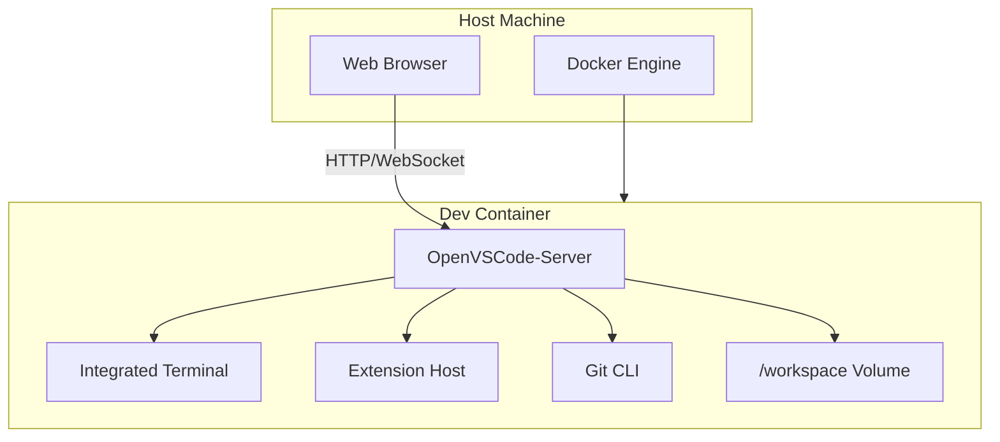
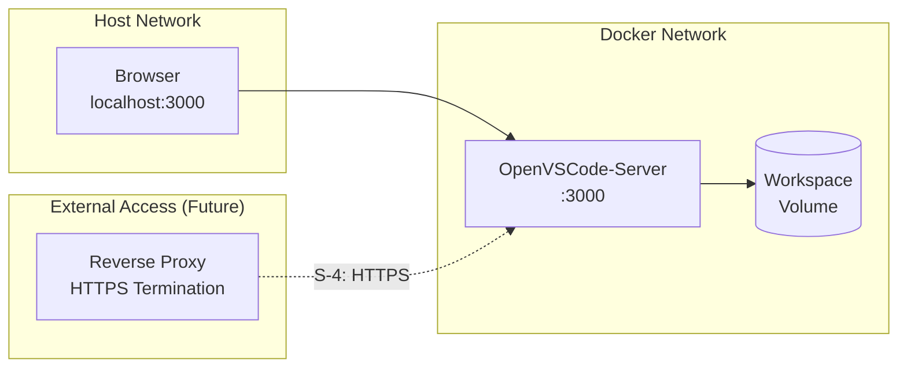
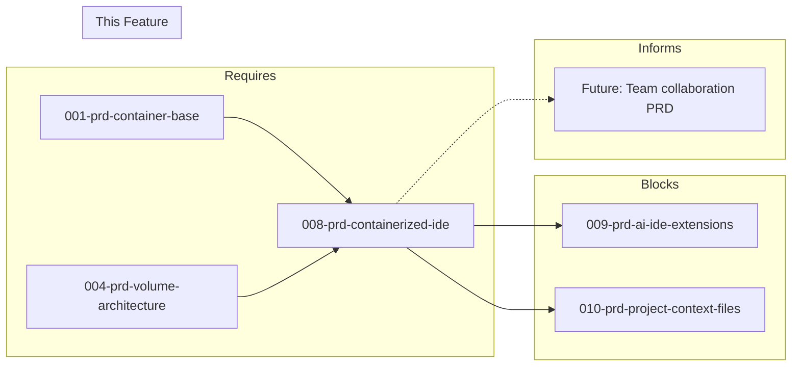

# 008-prd-containerized-ide

> **Document Type:** Product Requirements Document  
> **Audience:** LLM agents, human reviewers  
> **Status:** In Progress <!-- Previously had spike results completed -->  
> **Last Updated:** 2026-01-23 <!-- @auto -->  
> **Owner:** Brian <!-- @human-required -->

---

## Review Tier Legend

| Marker | Tier | Speckit Behavior |
|--------|------|------------------|
| 🔴 `@human-required` | Human Generated | Prompt human to author; blocks until complete |
| 🟡 `@human-review` | LLM + Human Review | LLM drafts → prompt human to confirm/edit; blocks until confirmed |
| 🟢 `@llm-autonomous` | LLM Autonomous | LLM completes; no prompt; logged for audit |
| ⚪ `@auto` | Auto-generated | System fills (timestamps, links); no prompt |

---

## Document Completion Order

> ⚠️ **For LLM Agents:** Complete sections in this order. Do not fill downstream sections until upstream human-required inputs exist.

1. **Context** (Background, Scope) → requires human input first
2. **Problem Statement & User Story** → requires human input
3. **Requirements** (Must/Should/Could/Won't) → requires human input
4. **Technical Constraints** → human review
5. **Diagrams, Data Model, Interface** → LLM can draft after above exist
6. **Acceptance Criteria** → derived from requirements
7. **Everything else** → can proceed

---

## Context

### Background 🔴 `@human-required`

Developers need a full-featured IDE accessible from any device without local installation. The containerized development environment requires an IDE that runs entirely within Docker, accessible via web browser or remote protocol. This enables consistent development experiences across machines, easy onboarding, and the ability to work from tablets or thin clients.

<!-- 
MIGRATED FROM: Original Problem Statement
REVIEW: Is this the right framing? Does it need business context or link to roadmap?
-->

### Scope Boundaries 🟡 `@human-review`

**In Scope:**
- Web-based IDE running entirely within Docker containers
- Browser-accessible interface (no host IDE installation)
- VS Code-compatible extension ecosystem
- Multi-architecture support (arm64/amd64)
- Basic authentication and access control
- Persistent workspace configuration via volumes

**Out of Scope:**
<!-- MIGRATED FROM: Won't Have section + implicit constraints -->
- Native desktop application mode — *container-first architecture mandate*
- Proprietary IDEs requiring host installation — *licensing and dependency concerns*
- GUI applications requiring X11 forwarding — *complexity, security surface*
- Full VS Code Marketplace access — *requires Microsoft account/proprietary licensing*
- Live collaboration features — *deferred to future PRD*

### Glossary 🟡 `@human-review`

<!-- LLM-drafted based on document content. Human should validate definitions. -->

| Term | Definition |
|------|------------|
| code-server | Coder's open-source project that runs VS Code on a remote server, accessible through the browser |
| OpenVSCode-Server | Gitpod's open-source VS Code server, a direct fork with minimal patches staying close to upstream |
| Open VSX | Open-source extension registry (openvsx.org), alternative to Microsoft's VS Code Marketplace |
| DAP | Debug Adapter Protocol — standard protocol for debugger integration in VS Code |
| connection-token | Authentication mechanism in OpenVSCode-Server; required token for WebSocket connections |

### Related Documents ⚪ `@auto`

| Document | Link | Relationship |
|----------|------|--------------|
| Architecture Decision Record | 008-ard-containerized-ide.md | Defines technical approach |
| Security Review | 008-sec-containerized-ide.md | Risk assessment |
| Container Base PRD | 001-prd-container-base.md | Foundation dependency |
| Volume Architecture PRD | 004-prd-volume-architecture.md | Storage dependency |
| AI IDE Extensions PRD | 009-prd-ai-ide-extensions.md | Blocked by this PRD |

---

## Problem Statement 🔴 `@human-required`

Developers need a full-featured IDE accessible from any device without local installation. The containerized development environment requires an IDE that runs entirely within Docker, accessible via web browser or remote protocol. This enables consistent development experiences across machines, easy onboarding, and the ability to work from tablets or thin clients.

**Critical constraint**: The IDE must run entirely within a Docker container. Acceptable modes:
- Web-based IDE accessible via browser (code-server, OpenVSCode-Server)
- Remote backend with thin client (JetBrains Gateway, VS Code Remote)
- No native desktop applications required on the host machine

<!-- 
REVIEW NEEDED: What is the cost of NOT solving this? Who specifically experiences the problem?
Consider adding: "Without this, developers must maintain local IDE installations, leading to environment drift, onboarding friction, and inability to work from lightweight devices."
-->

### User Story 🔴 `@human-required`

> As a **developer**, I want **a browser-accessible IDE running in my dev container** so that **I can code from any device without local IDE installation and maintain environment consistency**.

<!-- 
MIGRATED: Inferred from problem statement
REVIEW: Is this the primary persona? Are there secondary stories (team lead wanting consistent environments, DevOps wanting reproducible setups)?
-->

---

## Assumptions & Risks 🟡 `@human-review`

### Assumptions
<!-- EXTRACTED from implicit assumptions in original document -->
- [A-1] Developers have browser access (Chrome/Firefox/Safari) on their client devices
- [A-2] Docker is available on the host machine (covered by 001-prd-container-base)
- [A-3] Network latency to container is acceptable for interactive editing (<100ms RTT)
- [A-4] Open VSX registry provides sufficient extension coverage for target languages
- [A-5] Volume mounts from 004-prd-volume-architecture are available for workspace persistence

### Risks
<!-- EXTRACTED from evaluation criteria and tool analysis -->
| ID | Risk | Likelihood | Impact | Mitigation |
|----|------|------------|--------|------------|
| R-1 | Open VSX missing critical extensions vs Marketplace | Medium | High | Validate required extensions exist; fallback to VSIX sideloading |
| R-2 | Browser-based IDE performance inferior to native | Medium | Medium | Spike validated acceptable latency; document resource requirements |
| R-3 | Security vulnerabilities in web-exposed IDE | Medium | High | Token auth, reverse proxy for HTTPS, network isolation |
| R-4 | Gitpod maintenance of OpenVSCode-Server declines | Low | High | code-server as documented fallback; both are MIT licensed |

---

## Feature Overview

### Flow Diagram 🟡 `@human-review`



### Architecture Context 🟡 `@human-review`



---

## Requirements

### Must Have (M) — MVP, launch blockers 🔴 `@human-required`

- [x] **M-1:** IDE shall run entirely within Docker container *(verified: OpenVSCode-Server runs fully in container)*
- [x] **M-2:** IDE shall provide browser-accessible interface requiring no host IDE installation *(verified: HTTP 200 on localhost:3000)*
- [x] **M-3:** IDE shall provide full code editing with syntax highlighting and IntelliSense *(VS Code engine provides this)*
- [x] **M-4:** IDE shall provide integrated terminal access to container shell *(verified: bash exec works in container)*
- [x] **M-5:** IDE shall provide file explorer and project navigation *(VS Code engine provides this)*
- [x] **M-6:** IDE shall support extension/plugin installation for language tooling *(verified: Python extension installed successfully)*
- [x] **M-7:** IDE shall provide Git integration (diff, commit, branch management) *(verified: git 2.34.1 available)*
- [x] **M-8:** IDE shall work on arm64 (Apple Silicon) and amd64 architectures *(verified: manifest shows linux/amd64, linux/arm64)*
- [x] **M-9:** IDE shall use open source or permissive license (MIT/Apache) *(MIT license)*

### Should Have (S) — High value, not blocking 🔴 `@human-required`

- [x] **S-1:** IDE should provide VS Code extension compatibility via Open VSX *(verified: Open VSX extensions work)*
- [ ] **S-2:** IDE should support multi-user environments with session isolation
- [x] **S-3:** IDE should provide authentication and access control *(verified: --connection-token flag works)*
- [ ] **S-4:** IDE should support HTTPS/TLS for secure remote access *(requires reverse proxy — deferred)*
- [x] **S-5:** IDE should support persistent workspace configuration via volume mounts *(verified)*
- [x] **S-6:** IDE should support Debug Adapter Protocol for debugging *(debugpy extension installed)*
- [x] **S-7:** IDE should provide search across files (grep-like functionality) *(VS Code built-in search)*

### Could Have (C) — Nice to have, if time permits 🟡 `@human-review`

- [ ] **C-1:** IDE could support live collaboration (pair programming)
- [ ] **C-2:** IDE could support custom themes and UI customization
- [ ] **C-3:** IDE could support split editor and multi-panel layouts
- [ ] **C-4:** IDE could support Jupyter notebooks
- [ ] **C-5:** IDE could support SSH tunneling for secure access
- [ ] **C-6:** IDE could support GPU passthrough for ML workloads

### Won't Have (W) — Explicitly deferred 🟡 `@human-review`

- [ ] **W-1:** Native desktop application mode — *Reason: Container-first architecture mandate; conflicts with core requirement*
- [ ] **W-2:** Proprietary IDEs requiring host installation — *Reason: Licensing constraints, dependency on host environment*
- [ ] **W-3:** GUI applications requiring X11 forwarding — *Reason: Complexity, security surface, not aligned with browser-first approach*

---

## Technical Constraints 🟡 `@human-review`

<!-- CONSOLIDATED from scattered constraints in original document -->

- **Container Runtime:** Must run in Docker; compatible with 001-prd-container-base image
- **Architecture:** Multi-arch manifest required (linux/amd64, linux/arm64)
- **Licensing:** MIT or Apache 2.0 only; no proprietary dependencies
- **Resource Limits:** Should function within 512MB container memory limit (spike showed 23MB idle)
- **Network:** Expose single HTTP port; HTTPS via external reverse proxy (not embedded)
- **Storage:** Workspace persistence via volume mounts (004-prd-volume-architecture)
- **Extensions:** Open VSX registry only; no Microsoft Marketplace access
- **Authentication:** Token-based or password; no Microsoft account dependency

---

## Data Model (if applicable) 🟡 `@human-review`

N/A — This PRD defines infrastructure, not data entities. Configuration is file-based.

---

## Interface Contract (if applicable) 🟡 `@human-review`

### Container Interface

```yaml
# Docker Compose service definition
services:
  ide:
    image: gitpod/openvscode-server:latest
    ports:
      - "3000:3000"
    environment:
      - CONNECTION_TOKEN=${IDE_TOKEN}  # Required for S-3
    volumes:
      - workspace:/home/workspace      # Required for S-5
      - extensions:/home/.openvscode-server/extensions
```

### Extension Manifest Interface

```typescript
// .devcontainer/extensions.json
interface ExtensionManifest {
  recommendations: string[];  // Extension IDs from Open VSX
  unwantedRecommendations?: string[];  // Explicitly disabled
}
```

---

## Evaluation Criteria 🟡 `@human-review`

| Criterion | Weight | Metric | Target | Spike Result |
|-----------|--------|--------|--------|--------------|
| Container native | Critical | Runs entirely in Docker | Yes | **PASS** - 848MB image |
| Browser accessible | Critical | No host IDE installation | Yes | **PASS** - HTTP 200 |
| VS Code compatibility | Critical | Extensions, keybindings, settings | Yes | **PASS** - Open VSX |
| License | Critical | Open source (MIT/Apache) | MIT/Apache | **PASS** - MIT |
| Multi-arch support | Critical | arm64 + amd64 | Both | **PASS** - Both supported |
| Extension ecosystem | High | Language support available | Python, TS, Rust | **PASS** - Python ext works |
| Performance | High | Startup time | <30s | **PASS** - 8s startup |
| Memory efficiency | High | Idle memory | <100MB | **PASS** - 23MB idle |
| Authentication | Medium | Token-based access | Yes | **PASS** - Token auth |
| Active maintenance | Medium | Recent commits | <90 days | **PASS** - Gitpod maintained |

---

## Tool/Approach Candidates 🟡 `@human-review`

| Option | License | Pros | Cons | Spike Result |
|--------|---------|------|------|--------------|
| OpenVSCode-Server | MIT | Smaller image (848MB), lower RAM (23MB), upstream-aligned, Gitpod-maintained | Smaller community, less documentation | **SELECTED** |
| code-server | MIT | Mature, widely used, extensive docs, Coder enterprise backing | Larger image (1.12GB), higher RAM (37MB), diverges from upstream | Fallback option |
| JetBrains Gateway | Proprietary | Full JetBrains features, professional tooling | Requires host client, paid license | **REJECTED** |
| VS Code Tunnels | MIT (client) | Full Marketplace, official Microsoft | Requires MS account, vscode.dev dependency | **REJECTED** |

### Selected Approach 🔴 `@human-required`

> **Decision:** OpenVSCode-Server (gitpod/openvscode-server)  
> **Rationale:** Smallest resource footprint (848MB image, 23MB RAM), closest alignment with upstream VS Code, MIT license, multi-arch support verified. code-server remains as documented fallback if enterprise auth features needed.

---

## Acceptance Criteria 🟡 `@human-review`

| AC ID | Requirement | Given | When | Then |
|-------|-------------|-------|------|------|
| AC-1 | M-1, M-2 | Container image built | I access IDE URL in browser | Full editor loads without host installation |
| AC-2 | M-3 | Project workspace open | I open source files | Syntax highlighting and IntelliSense function correctly |
| AC-3 | M-4 | IDE loaded | I open integrated terminal | Commands execute in container environment |
| AC-4 | M-6 | Extension marketplace accessible | I install Python/TypeScript/Rust extensions | Language support functions correctly |
| AC-5 | M-7 | Git repository in workspace | I view diffs and commit | Changes are tracked properly |
| AC-6 | S-3 | Authentication configured | I access remotely without token | Unauthorized access is prevented |
| AC-7 | M-8 | arm64 or amd64 host | I build/run the image | Container starts and IDE functions |
| AC-8 | S-2 | Multiple browser sessions | Users connect concurrently | Session isolation is maintained |

### Edge Cases 🟢 `@llm-autonomous`

- [ ] **EC-1:** (M-2) When browser has WebSocket blocked, then IDE displays clear error with troubleshooting steps
- [ ] **EC-2:** (M-6) When extension not available in Open VSX, then user can sideload VSIX manually
- [ ] **EC-3:** (S-3) When connection token expires/invalid, then clear 401 response with re-auth instructions
- [ ] **EC-4:** (M-4) When terminal process exits unexpectedly, then new terminal can be opened without IDE restart

---

## Dependencies 🟡 `@human-review`



### Requires (must be complete before this PRD)
- **001-prd-container-base** — Base container image this IDE layer builds upon
- **004-prd-volume-architecture** — Volume mount strategy for workspace persistence (S-5)

### Blocks (waiting on this PRD)
- **009-prd-ai-ide-extensions** — AI coding assistants require IDE platform to be selected
- **010-prd-project-context-files** — Project context (`.cursorrules` equivalent) depends on IDE choice

### Informs (decisions here affect future PRDs) 🔴 `@human-required`

| Open Item | Dependent PRD | What We Need | Working Assumption |
|-----------|---------------|--------------|-------------------|
| Multi-user auth strategy | Future team collaboration PRD | Whether to use OAuth proxy vs native auth | Token auth sufficient for single-user |
| Extension sync mechanism | 009-prd-ai-ide-extensions | How extensions persist across rebuilds | Volume mount + manifest script |

### External
- **Open VSX Registry** (openvsx.org) — Extension availability; no SLA, community-maintained
- **Gitpod** — OpenVSCode-Server maintenance; active as of spike date

---

## Security Considerations 🟡 `@human-review`

| Aspect | Assessment | Notes |
|--------|------------|-------|
| Internet Exposure | No (localhost only by default) | S-4 adds external access via reverse proxy |
| Sensitive Data | Yes — source code, credentials in env | Workspace contains proprietary code |
| Authentication Required | Yes | M: Token auth; S-4: HTTPS for remote |
| Security Review Required | Yes | [Link to 008-sec-containerized-ide.md] |

<!-- 
NEEDS HUMAN INPUT: 
- What's the threat model for remote access?
- Are there compliance requirements (SOC2, etc.)?
- How are IDE credentials/tokens managed?
-->

---

## Implementation Guidance 🟢 `@llm-autonomous`

### Suggested Approach

1. Start with official `gitpod/openvscode-server` image
2. Add extension installation layer (Dockerfile or entrypoint script)
3. Configure volume mounts for workspace and extension persistence
4. Add connection-token authentication
5. Document reverse proxy setup for HTTPS (external to container)

### Anti-patterns to Avoid

- **Embedding HTTPS in container** — Use external reverse proxy; simplifies certificate management
- **Baking extensions into image** — Use volume + manifest for flexibility; reduces rebuild frequency
- **Hardcoding tokens** — Use environment variables; enables rotation
- **Running as root** — OpenVSCode-Server runs as `openvscode-server` user by default; preserve this

### Reference Examples

- [Gitpod Docker examples](https://github.com/gitpod-io/openvscode-server/tree/main/scripts)
- Spike results: `spikes/008-containerized-ide/RESULTS.md`

---

## Spike Tasks 🟡 `@human-review`

### Container Deployment ✅ Complete

- [x] Deploy code-server in container, verify browser access
- [x] Deploy OpenVSCode-Server in container, verify browser access
- [x] Deploy JetBrains Gateway backend in container, test with Gateway client *(documented — requires license)*
- [x] Deploy VS Code tunnel server in container, test with vscode.dev *(documented — requires MS account)*
- [x] Measure container image sizes and startup times
- [x] Test multi-arch builds (arm64 + amd64) *(verified via manifest inspect)*

### Feature Validation 🔄 Partial

- [x] Install and test Python extension (linting, debugging, IntelliSense)
- [ ] Install and test TypeScript extension (type checking, refactoring)
- [x] Test integrated terminal (shell access, command execution)
- [x] Test Git integration (clone, commit, push, diff view) *(git CLI verified)*
- [ ] Test file search and replace across project

### Security & Access 🔄 Partial

- [x] Configure and test authentication (password, token)
- [ ] Test HTTPS/TLS termination
- [ ] Evaluate multi-user isolation options
- [ ] Document secure remote access patterns

### Performance 🔄 Partial

- [x] Measure memory usage under typical workload
- [ ] Test responsiveness with large files (>10k lines)
- [x] Evaluate startup time cold vs warm
- [ ] Test with slow network connections

---

## Success Metrics 🔴 `@human-required`

| Metric | Baseline | Target | Measurement Method |
|--------|----------|--------|-------------------|
| IDE startup time | N/A | <30s cold, <5s warm | Automated test in CI |
| Extension install success rate | N/A | >95% for declared extensions | CI validation |
| Container image size | N/A | <1GB | `docker images` |

### Technical Verification 🟢 `@llm-autonomous`

| Metric | Target | Verification Method |
|--------|--------|---------------------|
| All Must Have ACs passing | 100% | Automated acceptance tests |
| Multi-arch build success | arm64 + amd64 | CI matrix build |
| Memory usage idle | <50MB | `docker stats` in CI |

---

## Definition of Ready 🔴 `@human-required`

### Readiness Checklist

- [x] Problem statement reviewed and validated by stakeholder
- [x] All Must Have requirements have acceptance criteria
- [x] Technical constraints are explicit and agreed
- [x] Dependencies identified and owners confirmed
- [ ] Forward dependencies tracked (Informs table complete if questions deferred)
- [ ] Security review completed (or N/A documented with justification)
- [x] No open questions blocking implementation (deferred with working assumptions = OK)

### Sign-off

| Role | Name | Date | Decision |
|------|------|------|----------|
| Product Owner | | | [ ] Ready / [ ] Not Ready |

---

## Changelog ⚪ `@auto`

| Version | Date | Author | Changes |
|---------|------|--------|---------|
| 0.1 | 2026-01-21 | Brian | Initial draft with spike results |
| 0.2 | 2026-01-23 | Claude | Migrated to PRD template v3 format |

---

## Decision Log 🟡 `@human-review`

| Date | Decision | Rationale | Alternatives Considered |
|------|----------|-----------|------------------------|
| 2026-01-21 | Selected OpenVSCode-Server over code-server | Smaller footprint (848MB vs 1.12GB), lower RAM (23MB vs 37MB), closer upstream alignment | code-server (fallback), JetBrains Gateway (rejected—requires host client), VS Code Tunnels (rejected—requires MS account) |
| 2026-01-21 | Use token auth over password auth | Simpler automation, environment variable injection | Password auth (available as alternative) |
| 2026-01-21 | Defer HTTPS to reverse proxy | Separates concerns, simplifies certificate management | Embedded TLS (rejected—complexity) |

---

## Open Questions 🟡 `@human-review`

- [x] **Q1:** Which web-based IDE best fits container-first requirements?
  > **Resolved (2026-01-21):** OpenVSCode-Server selected based on spike results.
  > *(Added to Decision Log)*

- [ ] **Q2:** What authentication strategy for multi-user team access?
  > **Deferred to:** Future team collaboration PRD
  > **Working assumption:** Single-user token auth sufficient for initial implementation.
  > *(Tracked in Dependencies → Informs table)*

- [ ] **Q3:** How should IDE credentials/secrets be managed for AI extensions?
  > **Deferred to:** 009-prd-ai-ide-extensions
  > **Working assumption:** Environment variables injected at container start.

---

## Review Checklist 🟢 `@llm-autonomous`

Before marking as Approved:

- [x] All requirements have unique IDs (M-1, S-2, etc.)
- [x] All Must Have requirements have linked acceptance criteria
- [x] Glossary terms are used consistently throughout
- [x] Diagrams use terminology from Glossary
- [ ] Security considerations documented (or N/A justified)
- [ ] Definition of Ready checklist is complete
- [x] No open questions blocking implementation (deferred questions with working assumptions are OK)
- [x] Forward dependencies tracked in Informs table (if any questions deferred to future PRDs)

---

## References

- [code-server FAQ](https://coder.com/docs/code-server/FAQ)
- [OpenVSCode-Server vs code-server Discussion](https://github.com/coder/code-server/discussions/4267)
- [JetBrains Dev Containers Guide](https://blog.jetbrains.com/idea/2024/07/using-dev-containers-in-jetbrains-ides-part-1/)
- [VS Code Server Documentation](https://code.visualstudio.com/docs/remote/vscode-server)
