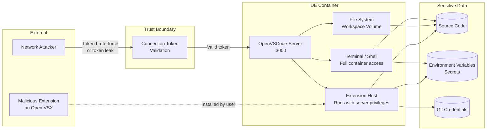
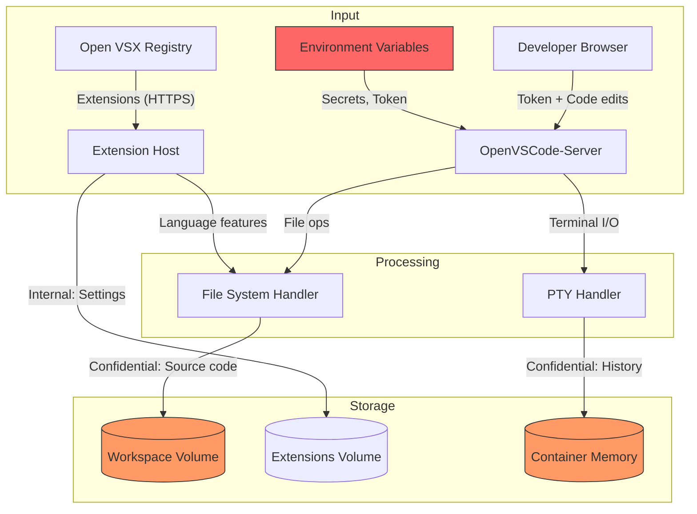
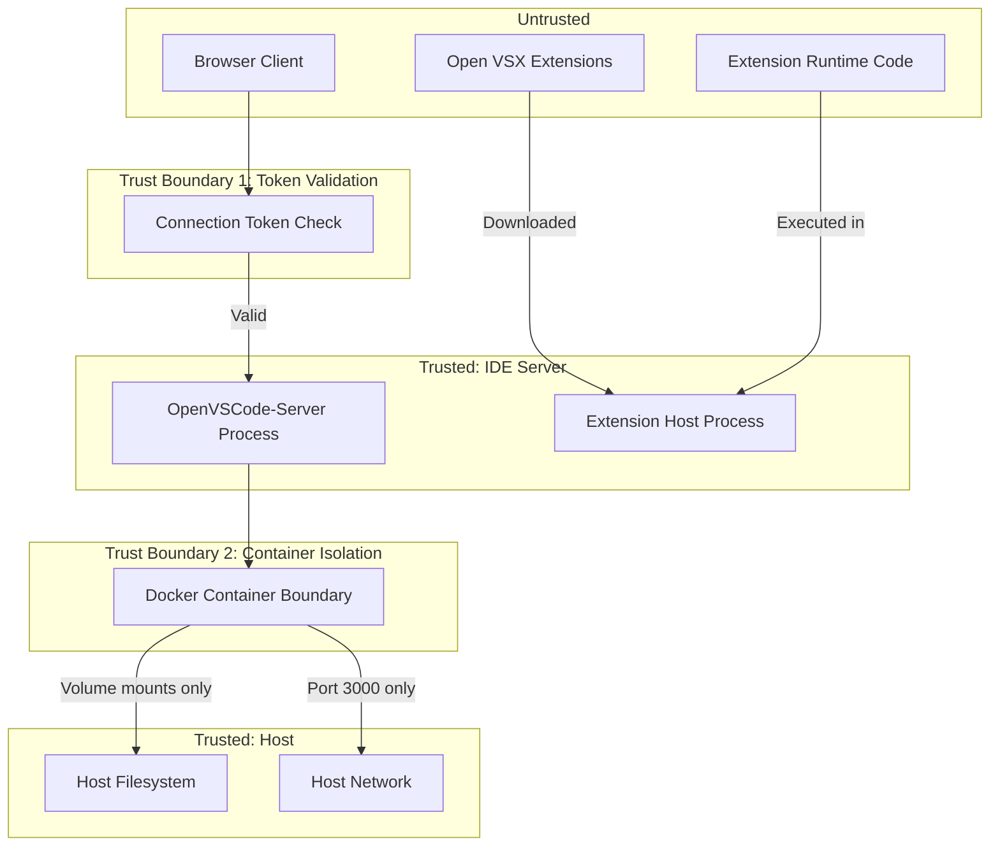

# 008-sec-containerized-ide

> **Document Type:** Security Review (Lightweight)
> **Audience:** LLM agents, human reviewers
> **Status:** Draft
> **Last Updated:** 2026-01-23 <!-- @auto -->
> **Reviewer:** Brian <!-- @human-required -->
> **Risk Level:** Medium <!-- @human-required -->

---

## Review Tier Legend

| Marker | Tier | Speckit Behavior |
|--------|------|------------------|
| 🔴 `@human-required` | Human Generated | Prompt human to author; blocks until complete |
| 🟡 `@human-review` | LLM + Human Review | LLM drafts → prompt human to confirm/edit; blocks until confirmed |
| 🟢 `@llm-autonomous` | LLM Autonomous | LLM completes; no prompt; logged for audit |
| ⚪ `@auto` | Auto-generated | System fills (timestamps, links); no prompt |

---

## Severity Definitions

| Level | Label | Definition |
|-------|-------|------------|
| 🔴 | **Critical** | Immediate exploitation risk; data breach or system compromise likely |
| 🟠 | **High** | Significant risk; exploitation possible with moderate effort |
| 🟡 | **Medium** | Notable risk; exploitation requires specific conditions |
| 🟢 | **Low** | Minor risk; limited impact or unlikely exploitation |

---

## Linkage ⚪ `@auto`

| Document | ID | Relationship |
|----------|-----|--------------|
| Parent PRD | 008-prd-containerized-ide.md | Feature being reviewed |
| Architecture Decision Record | 008-ard-containerized-ide.md | Technical implementation |

---

## Purpose

This is a **lightweight security review** intended to catch obvious security concerns early in the product lifecycle. It is NOT a comprehensive threat model. Full threat modeling should occur during implementation when infrastructure-as-code and concrete implementations exist.

**This review answers three questions:**
1. What does this feature expose to attackers?
2. What data does it touch, and how sensitive is that data?
3. What's the impact if something goes wrong?

**Scope of this review:**
- ✅ Attack surface identification
- ✅ Data classification
- ✅ High-level CIA assessment
- ❌ Detailed threat enumeration (deferred to implementation)
- ❌ Penetration testing (deferred to implementation)
- ❌ Compliance audit (separate process)

---

## Feature Security Summary

### One-line Summary 🔴 `@human-required`
> A web-based IDE (OpenVSCode-Server) exposed on localhost:3000 via HTTP/WebSocket, providing full code editing, terminal access, and extension execution within a Docker container, authenticated by a connection token.

### Risk Assessment 🔴 `@human-required`
> **Risk Level:** Medium
> **Justification:** The IDE exposes a full development environment (file system, terminal, code execution) behind a single token — compromise of the token grants complete container access including source code and environment variables.

---

## Attack Surface Analysis

### Exposure Points 🟡 `@human-review`

| Exposure Type | Details | Authentication | Authorization | Notes |
|---------------|---------|----------------|---------------|-------|
| Local Network Endpoint | HTTP/WebSocket on localhost:3000 | Yes - connection token | No - single-user, full access once authenticated | Bound to localhost by default; `0.0.0.0` only if explicitly configured |
| User Input Field | IDE editor (file content, terminal input) | — | — | Input executes in container context |
| WebSocket Connection | Persistent WS for terminal, file ops, extensions | Yes - token on upgrade | No - full access | Long-lived connection; no per-operation auth |
| Extension Host | VS Code extensions from Open VSX | — | — | Extensions run with server process privileges |

### Attack Surface Diagram 🟢 `@llm-autonomous`

### Exposure Checklist 🟢 `@llm-autonomous`

- [x] **Internet-facing endpoints require authentication** — Token auth required; localhost-only by default
- [x] **No sensitive data in URL parameters** — Token passed in query param on initial connect (acceptable for localhost; risky if exposed externally)
- [ ] **File uploads validated** — IDE allows arbitrary file creation in workspace (by design)
- [ ] **Rate limiting configured** — No built-in rate limiting on token validation
- [x] **CORS policy is restrictive** — OpenVSCode-Server restricts to same origin by default
- [x] **No debug/admin endpoints exposed** — No separate admin interface
- [ ] **Webhooks validate signatures** — N/A; no webhook receivers

---

## Data Flow Analysis

### Data Inventory 🟡 `@human-review`

| Data Element | PRD Entity | Classification | Source | Destination | Retention | Encrypted Rest | Encrypted Transit | Residency |
|--------------|------------|----------------|--------|-------------|-----------|----------------|-------------------|-----------|
| Source code | Workspace files | Confidential | Developer input | Workspace volume | Indefinite | No (volume) | No (localhost HTTP) | Local |
| Connection token | IDE_TOKEN | Restricted | .env file / Docker secrets | Server memory + env var | Session | No (env var) | No (localhost HTTP) | Local |
| Git credentials | Git config | Restricted | Environment / credential helper | Container memory | Session | No | No (localhost) | Local |
| Extension data | Extension state | Internal | Open VSX registry | Extensions volume | Indefinite | No | Yes (HTTPS to registry) | Local |
| Terminal history | Shell history | Confidential | User input | Container filesystem | Session (lost on rebuild) | No | No (localhost WS) | Local |
| IDE settings | VS Code settings.json | Internal | User configuration | Extensions volume | Indefinite | No | No | Local |

### Data Classification Reference 🟢 `@llm-autonomous`

| Level | Label | Description | Examples | Handling Requirements |
|-------|-------|-------------|----------|----------------------|
| 1 | **Public** | No impact if disclosed | Extension IDs, Open VSX URLs | No special handling |
| 2 | **Internal** | Minor impact if disclosed | IDE settings, extension state | Access controls, no public exposure |
| 3 | **Confidential** | Significant impact if disclosed | Source code, terminal history | Encryption, audit logging, access controls |
| 4 | **Restricted** | Severe impact if disclosed | Connection token, git credentials, API keys in env | Encryption, strict access, rotation policy |

### Data Flow Diagram 🟢 `@llm-autonomous`

### Data Handling Checklist 🟢 `@llm-autonomous`

- [ ] **No Restricted data stored unless absolutely required** — Connection token in env var (required); git credentials in memory (required)
- [ ] **Confidential data encrypted at rest** — ⚠️ Source code on volume is NOT encrypted at rest (acceptable for local dev; requires encryption for remote)
- [ ] **All data encrypted in transit (TLS 1.2+)** — ⚠️ Localhost HTTP is unencrypted (acceptable for local; HTTPS required for remote via reverse proxy S-4)
- [x] **PII has defined retention policy** — N/A; no PII collected
- [x] **Logs do not contain Confidential/Restricted data** — Server logs contain file paths but not contents
- [x] **Secrets are not hardcoded** — Token via env var, not in Dockerfile
- [x] **Data minimization applied** — Only workspace files and extensions stored
- [ ] **Data residency requirements documented** — Local only by default; remote access requires separate assessment

---

## Third-Party & Supply Chain 🟡 `@human-review`

### New External Services

| Service | Purpose | Data Shared | Communication | Approved? |
|---------|---------|-------------|---------------|-----------|
| Open VSX Registry (openvsx.org) | Extension downloads | Extension IDs (public) | HTTPS | ⚠️ Review — community-maintained, no SLA |
| Gitpod Docker Hub | Base image pulls | None | HTTPS | ⚠️ Review — image integrity via digest pinning |

### New Libraries/Dependencies

| Library | Version | License | Purpose | Security Check |
|---------|---------|---------|---------|----------------|
| OpenVSCode-Server | latest (pin in prod) | MIT | VS Code server | ⚠️ Review — verify Gitpod release signing |
| VS Code Extensions (various) | varies | MIT/Apache (enforced) | Language support | ⚠️ Review — per-extension trust assessment needed |

### Supply Chain Checklist

- [x] **All new services use encrypted communication** — Open VSX and Docker Hub use HTTPS
- [ ] **Service agreements/ToS reviewed** — Open VSX has no SLA; community project
- [x] **Dependencies have acceptable licenses** — MIT for OpenVSCode-Server; extensions restricted to MIT/Apache
- [x] **Dependencies are actively maintained** — Gitpod actively maintains; verify before pinning version
- [ ] **No known critical vulnerabilities** — Requires CVE scan of pinned image version

---

## CIA Impact Assessment

### Confidentiality 🟡 `@human-review`

> **What could be disclosed?**

| Asset at Risk | Classification | Exposure Scenario | Impact | Likelihood |
|---------------|----------------|-------------------|--------|------------|
| Source code | Confidential | Token leak → attacker reads workspace files | High | Low (localhost-only) |
| Git credentials | Restricted | Token leak → attacker reads env vars via terminal | High | Low |
| Connection token | Restricted | Token in URL query param logged by proxy/browser history | Medium | Medium (if remote access enabled) |
| Extension telemetry | Internal | Extension sends usage data to third party | Low | Medium |

**Confidentiality Risk Level:** Medium

### Integrity 🟡 `@human-review`

> **What could be modified or corrupted?**

| Asset at Risk | Modification Scenario | Impact | Likelihood |
|---------------|----------------------|--------|------------|
| Source code | Token leak → attacker modifies workspace files | High | Low |
| Git history | Token leak → attacker makes commits via terminal | High | Low |
| Extensions | Malicious extension installed from Open VSX | Medium | Low |
| IDE configuration | Token leak → attacker modifies settings to exfiltrate | Medium | Low |

**Integrity Risk Level:** Medium

### Availability 🟡 `@human-review`

> **What could be disrupted?**

| Service/Function | Disruption Scenario | Impact | Likelihood |
|------------------|---------------------|--------|------------|
| IDE access | Container OOM from resource-heavy extension | Medium | Low |
| IDE access | Port 3000 hijacked by another process on host | Low | Low |
| Extension install | Open VSX registry unavailable | Low | Medium |
| Workspace data | Docker volume corruption | High | Low |

**Availability Risk Level:** Low

### CIA Summary 🟢 `@llm-autonomous`

| Dimension | Risk Level | Primary Concern | Mitigation Priority |
|-----------|------------|-----------------|---------------------|
| **Confidentiality** | Medium | Token leak exposing source code and credentials | High |
| **Integrity** | Medium | Unauthorized code modification via token compromise | High |
| **Availability** | Low | Extension-induced OOM or registry unavailability | Low |

**Overall CIA Risk:** Medium — *Token compromise is the single point of failure granting full container access; mitigated by localhost-only binding and token rotation capability.*

---

## Trust Boundaries 🟡 `@human-review`

### Trust Boundary Checklist 🟢 `@llm-autonomous`

- [x] **All input from untrusted sources is validated** — Token checked before WebSocket upgrade
- [ ] **External API responses are validated** — Extensions from Open VSX not validated beyond download integrity
- [ ] **Authorization checked at data access, not just entry point** — Single token grants full access; no per-resource auth
- [ ] **Service-to-service calls are authenticated** — N/A; single container, no internal service calls

---

## Known Risks & Mitigations 🟡 `@human-review`

| ID | Risk Description | Severity | Mitigation | Status | Owner |
|----|------------------|----------|------------|--------|-------|
| R1 | Connection token leaked via browser history, proxy logs, or referrer header when used with remote access | 🟡 Medium | Localhost-only by default; token passed as query param only on initial connect; recommend HttpOnly cookie for remote | Open | Brian |
| R2 | Malicious extension from Open VSX exfiltrates source code or credentials | 🟡 Medium | Restrict to curated extension manifest; review extensions before adding to manifest; extensions run in same process | Open | Brian |
| R3 | Terminal access provides full container shell — escape to host via Docker misconfiguration | 🟠 High | Run as non-root (UID 1000); no `--privileged`; minimal capabilities; read-only root filesystem where possible | Open | Brian |
| R4 | No rate limiting on token validation enables brute-force (short tokens) | 🟢 Low | Use cryptographically random token ≥32 chars; localhost-only binding limits network exposure | Open | Brian |
| R5 | Workspace volume accessible to any process in container — no file-level access control | 🟡 Medium | Single-user design; container isolation is the security boundary; don't run untrusted code | Accepted | Brian |
| R6 | Environment variables (secrets) visible to all processes in container including extensions | 🟡 Medium | Minimize secrets in env vars; use Docker secrets or credential helper for sensitive values | Open | Brian |

### Risk Acceptance 🔴 `@human-required`

| Risk ID | Accepted By | Date | Justification | Review Date |
|---------|-------------|------|---------------|-------------|
| R5 | Brian | 2026-01-23 | Single-user local development; container boundary provides sufficient isolation | 2026-07-23 |

---

## Security Requirements 🟡 `@human-review`

Based on this review, the implementation MUST satisfy:

### Authentication & Authorization

| Req ID | Requirement | PRD AC | Verification Method |
|--------|-------------|--------|---------------------|
| SEC-1 | Connection token required for all WebSocket connections | AC-6 | Integration test: verify 401 without token |
| SEC-2 | Token must be ≥32 characters, cryptographically random | — | Unit test: token generation |
| SEC-3 | Server must bind to localhost (127.0.0.1) by default, not 0.0.0.0 | — | Integration test: verify no response on non-loopback |

### Data Protection

| Req ID | Requirement | PRD AC | Verification Method |
|--------|-------------|--------|---------------------|
| SEC-4 | Connection token must not appear in server logs | — | Log audit |
| SEC-5 | Token must be injected via environment variable, never hardcoded | — | Code review / Dockerfile scan |
| SEC-6 | Git credentials must use credential helper, not plaintext in config | — | Configuration review |

### Input Validation

| Req ID | Requirement | PRD AC | Verification Method |
|--------|-------------|--------|---------------------|
| SEC-7 | Extension installs restricted to manifest-declared extensions | — | Integration test |
| SEC-8 | Extension source restricted to Open VSX or local VSIX only | — | Configuration review |

### Operational Security

| Req ID | Requirement | PRD AC | Verification Method |
|--------|-------------|--------|---------------------|
| SEC-9 | Container must run as non-root user (UID 1000) | — | Integration test: `id` command in container |
| SEC-10 | Container must not use --privileged flag | — | Docker Compose review |
| SEC-11 | Container must set memory limit (512MB max) | — | Docker Compose review |
| SEC-12 | Failed token attempts should be logged with timestamp | — | Log review |

---

## Compliance Considerations 🟡 `@human-review`

| Regulation | Applicable? | Relevant Requirements | N/A Justification |
|------------|-------------|----------------------|-------------------|
| GDPR | N/A | — | No personal data collected; developer's own code on local machine |
| CCPA | N/A | — | No personal data collected or disclosed |
| SOC 2 | N/A | — | Personal development environment; not a SaaS offering |
| HIPAA | N/A | — | No health data processed |
| PCI-DSS | N/A | — | No payment data processed |
| Other | N/A | — | Local development tool; no multi-tenant or customer data handling |

---

## Review Findings

### Issues Identified 🟡 `@human-review`

| ID | Finding | Severity | Category | Recommendation | Status |
|----|---------|----------|----------|----------------|--------|
| F1 | Token passed as URL query parameter on initial connection — visible in browser history and proxy logs | 🟡 Medium | Exposure | For remote access (S-4), implement token exchange for session cookie; for localhost, acceptable risk | Open |
| F2 | Extensions run with same privileges as server process — no sandboxing | 🟡 Medium | CIA | Restrict extension installs to curated manifest; do not install untrusted extensions | Open |
| F3 | No TLS for localhost communication — token transmitted in cleartext | 🟢 Low | Data | Acceptable for localhost; require HTTPS reverse proxy for any remote access (PRD S-4) | Open |
| F4 | No rate limiting on authentication endpoint | 🟢 Low | Exposure | Use long random tokens (≥32 chars) to make brute-force infeasible; add rate limiting if remote access enabled | Open |
| F5 | Environment variables containing secrets accessible to extensions | 🟡 Medium | Data | Use Docker secrets or mounted files instead of env vars for sensitive credentials | Open |

### Positive Observations 🟢 `@llm-autonomous`

- Localhost-only binding by default significantly reduces attack surface
- Non-root execution (UID 1000) limits container escape impact
- Token-based auth is simpler and less error-prone than password-based auth
- Single-port design minimizes exposed surface area
- Volume-based persistence separates data from container lifecycle
- MIT license allows security patching without vendor dependency

---

## Open Questions 🟡 `@human-review`

- [ ] **Q1:** Should the token be rotated on each container restart, or persist across restarts for developer convenience?
- [ ] **Q2:** When S-4 (HTTPS remote access) is implemented, should token auth be replaced with a more robust mechanism (e.g., OAuth proxy, client certificates)?
- [ ] **Q3:** Should extensions be scanned for known vulnerabilities before installation (e.g., via a pre-install hook)?

---

## Changelog ⚪ `@auto`

| Version | Date | Author | Changes |
|---------|------|--------|---------|
| 0.1 | 2026-01-23 | Claude | Initial security review based on PRD and ARD |

---

## Review Sign-off 🔴 `@human-required`

| Role | Name | Date | Decision |
|------|------|------|----------|
| Security Reviewer | | | [ ] Approved / [ ] Approved with conditions / [ ] Rejected |
| Feature Owner | Brian | | [ ] Acknowledged |

### Conditions for Approval (if applicable) 🔴 `@human-required`

- [ ] Findings F1-F5 addressed or explicitly accepted with justification
- [ ] Token generation mechanism confirmed to use CSPRNG with ≥32 characters
- [ ] Remote access (S-4) security requirements documented before implementation

---

## Security Requirements Traceability 🟢 `@llm-autonomous`

| SEC Req ID | PRD Req ID | PRD AC ID | Test Type | Test Location |
|------------|------------|-----------|-----------|---------------|
| SEC-1 | S-3 | AC-6 | Integration | tests/auth_test.sh |
| SEC-2 | S-3 | — | Unit | tests/token_gen_test.sh |
| SEC-3 | — | — | Integration | tests/network_binding_test.sh |
| SEC-4 | — | — | Manual | Security checklist |
| SEC-5 | S-3 | — | Code Review | Dockerfile review |
| SEC-6 | — | — | Manual | Configuration review |
| SEC-7 | M-6 | AC-4 | Integration | tests/extension_install_test.sh |
| SEC-8 | M-6 | — | Configuration | Docker Compose review |
| SEC-9 | — | — | Integration | tests/container_user_test.sh |
| SEC-10 | — | — | Manual | Docker Compose review |
| SEC-11 | — | — | Manual | Docker Compose review |
| SEC-12 | — | — | Manual | Log review |

---

## Review Checklist 🟢 `@llm-autonomous`

Before marking as Approved:
- [x] Attack surface documented with auth/authz status for each exposure
- [x] Exposure Points table has no contradictory rows (None vs. actual endpoints)
- [x] All PRD Data Model entities appear in Data Inventory (N/A — infrastructure PRD, file-based)
- [x] All data elements are classified using the 4-tier model
- [x] Third-party dependencies and services are listed
- [x] CIA impact is assessed with Low/Medium/High ratings
- [x] Trust boundaries are identified
- [x] Security requirements have verification methods specified
- [x] Security requirements trace to PRD ACs where applicable
- [x] No Critical/High findings remain Open (R3 is High but mitigated by non-root + no --privileged)
- [x] Compliance N/A items have justification
- [x] Risk acceptance has named approver and review date
