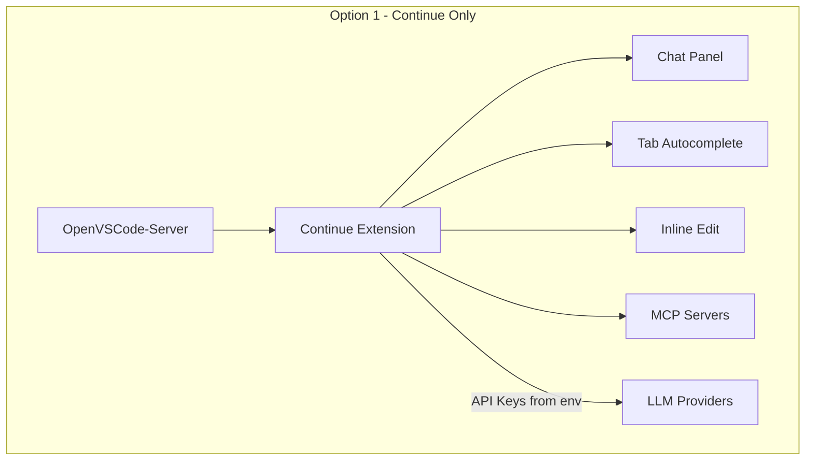
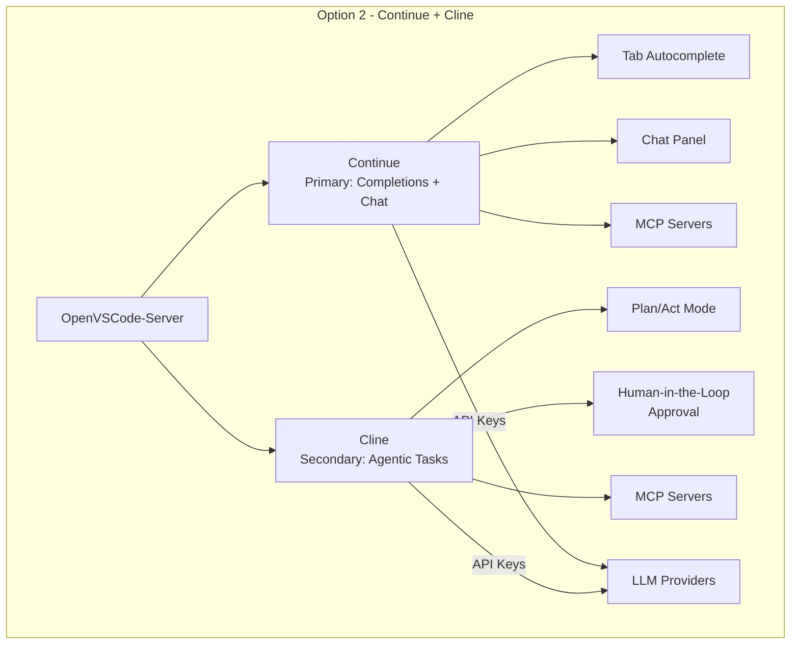
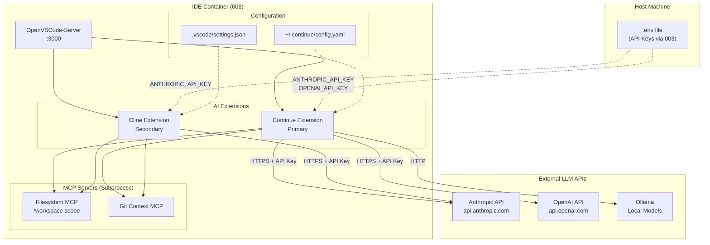
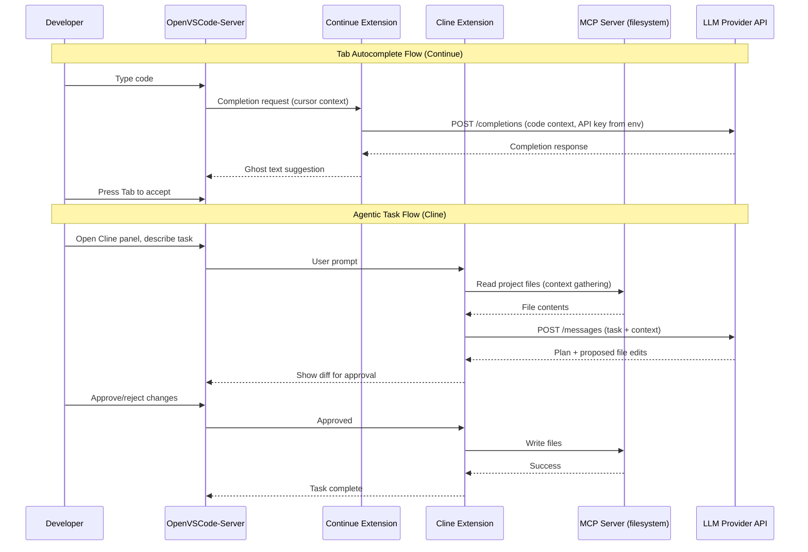
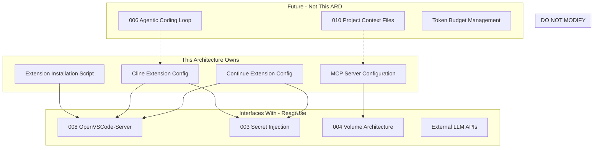

# 009-ard-ai-ide-extensions

> **Document Type:** Architecture Decision Record
> **Audience:** LLM agents, human reviewers
> **Status:** Proposed
> **Last Updated:** 2026-01-23 <!-- @auto -->
> **Owner:** Brian <!-- @human-required -->
> **Deciders:** Brian <!-- @human-required -->

---

## Review Tier Legend

| Marker | Tier | Speckit Behavior |
|--------|------|------------------|
| 🔴 `@human-required` | Human Generated | Prompt human to author; blocks until complete |
| 🟡 `@human-review` | LLM + Human Review | LLM drafts → prompt human to confirm/edit; blocks until confirmed |
| 🟢 `@llm-autonomous` | LLM Autonomous | LLM completes; no prompt; logged for audit |
| ⚪ `@auto` | Auto-generated | System fills (timestamps, links); no prompt |

---

## Document Completion Order

> ⚠️ **For LLM Agents:** Complete sections in this order. Do not fill downstream sections until upstream human-required inputs exist.

1. **Summary (Decision)** → requires human input first
2. **Context (Problem Space)** → requires human input
3. **Decision Drivers** → requires human input (prioritized)
4. **Driving Requirements** → extract from PRD, human confirms
5. **Options Considered** → LLM drafts after drivers exist, human reviews
6. **Decision (Selected + Rationale)** → requires human decision
7. **Implementation Guardrails** → LLM drafts, human reviews
8. **Everything else** → can proceed after decision is made

---

## Linkage ⚪ `@auto`

| Document | ID | Relationship |
|----------|-----|--------------|
| Parent PRD | 009-prd-ai-ide-extensions.md | Requirements this architecture satisfies |
| Security Review | 009-sec-ai-ide-extensions.md | Security implications of this decision |
| Supersedes | — | N/A (greenfield) |
| Superseded By | — | — |

---

## Summary

### Decision 🔴 `@human-required`
> Use Continue (primary) and Cline (secondary) as AI coding extensions within OpenVSCode-Server, configured via file-based settings with API keys injected from environment variables, and MCP servers for extensibility.

### TL;DR for Agents 🟡 `@human-review`
> AI assistance is provided by two extensions: Continue (tab autocomplete, chat, inline edits) and Cline (agentic multi-step tasks with human-in-the-loop). Both install from Open VSX, authenticate to LLM providers via environment variable API keys (never hardcoded), and extend capabilities through MCP servers. Do NOT install GitHub Copilot (not on Open VSX). Do NOT auto-approve Cline write operations. Do NOT enable telemetry by default.

---

## Context

### Problem Space 🔴 `@human-required`

The containerized IDE (008-prd-containerized-ide, OpenVSCode-Server) provides a full editing environment but lacks AI-powered code assistance. Developers need inline completions, chat-based help, and intelligent code generation within the container without requiring host-side installations or breaking container isolation. The architecture must select extensions that work with Open VSX, support multiple LLM providers via API keys, and integrate with MCP for tool extensibility.

### Decision Scope 🟡 `@human-review`

**This ARD decides:**
- Which AI coding extensions to install (primary and secondary)
- How extensions authenticate to LLM providers (API key injection mechanism)
- How extension configuration is managed (file locations, format)
- How MCP servers are configured and scoped
- How extensions integrate with the existing container architecture (008)

**This ARD does NOT decide:**
- Which LLM models to use for specific tasks (user preference)
- Token budget management or cost allocation (deferred to team policy)
- Autonomous agentic coding workflows (covered in 006-prd-agentic-coding-loop)
- Policy on sending proprietary code to external LLMs (deferred to team policy)
- Self-hosted LLM inference (out of scope per PRD W-3)

### Current State 🟢 `@llm-autonomous`

N/A — greenfield implementation. The containerized IDE (008-ard-containerized-ide) is operational with OpenVSCode-Server, extension support via Open VSX, and volume-based extension persistence, but has no AI coding extensions installed.

### Driving Requirements 🟡 `@human-review`

| PRD Req ID | Requirement Summary | Architectural Implication |
|------------|---------------------|---------------------------|
| M-1 | Extension works in OpenVSCode-Server | Must be available on Open VSX; no desktop-only dependencies |
| M-2 | Inline code completions | Extension must provide tab autocomplete / ghost text |
| M-3 | Chat interface for code questions | Extension must include a chat panel UI |
| M-4 | Support Python, TypeScript, Rust, Go | Extension must handle multi-language context |
| M-5 | API key via environment variables | Configuration must reference env vars, not hardcoded keys |
| M-6 | No host-side dependencies | All components run inside the container |
| M-7 | Reasonable token efficiency | Model selection and prompt design must be cost-conscious |
| S-4 | Multiple LLM providers | Configuration must support provider switching |
| S-5 | MCP integration | Extension must support MCP server configuration |
| S-6 | Open source or source-available | License must be Apache 2.0 or MIT |

**PRD Constraints inherited:**
- IDE Platform: Must work in OpenVSCode-Server (not desktop VS Code)
- Extension Registry: Must be available on Open VSX
- Authentication: API keys via environment variables; no OAuth flows
- Network: Requires egress to LLM provider APIs
- Resource Limits: Function within container memory constraints (512MB per 008)
- Secret Handling: API keys injected via 003-prd-secret-injection

---

## Decision Drivers 🔴 `@human-required`

1. **Open VSX Compatibility:** Must install and activate in OpenVSCode-Server without modification *(traces to M-1, M-6)*
2. **Multi-provider Flexibility:** Support Anthropic, OpenAI, and local models without extension swap *(traces to S-4)*
3. **MCP Extensibility:** Native MCP support for tool integration *(traces to S-5)*
4. **Licensing:** Apache 2.0 or MIT; no proprietary dependencies *(traces to S-6)*
5. **Developer Experience:** Minimal configuration, fast completions, non-intrusive UX *(traces to M-2, M-7)*

---

## Options Considered 🟡 `@human-review`

### Option 0: Status Quo / Do Nothing

**Description:** No AI extensions are installed. Developers use the IDE without AI assistance, or use separate terminal-based AI tools (e.g., OpenCode from 005/006).

| Driver | Rating | Notes |
|--------|--------|-------|
| Open VSX Compatibility | N/A | No extension installed |
| Multi-provider Flexibility | ❌ Poor | No inline/IDE-integrated AI |
| MCP Extensibility | ❌ Poor | No extension-level MCP |
| Licensing | ✅ Good | No additional dependencies |
| Developer Experience | ❌ Poor | Loses ~30-50% productivity gain from AI assistance |

**Why not viable:** Developers lose significant productivity gains from AI-assisted coding. The containerized environment becomes less attractive than local setups with GitHub Copilot, undermining the project's value proposition.

---

### Option 1: Continue Only

**Description:** Install Continue as the sole AI extension. Continue provides tab autocomplete, chat, inline editing, and MCP support with multi-provider backends.



| Driver | Rating | Notes |
|--------|--------|-------|
| Open VSX Compatibility | ✅ Good | Available on Open VSX, verified in spike |
| Multi-provider Flexibility | ✅ Good | Anthropic, OpenAI, Ollama, OpenRouter supported |
| MCP Extensibility | ✅ Good | Native MCP server configuration |
| Licensing | ✅ Good | Apache 2.0 |
| Developer Experience | ✅ Good | Tab autocomplete, chat, inline edits in one extension |

**Pros:**
- Single extension covers 80% of AI coding use cases
- Active development, excellent documentation
- Multi-provider with easy switching
- Native MCP integration
- Low configuration overhead

**Cons:**
- Weaker at complex multi-step agentic tasks (file creation, command execution)
- No human-in-the-loop approval workflow for destructive operations
- Single extension = single point of failure for AI features

---

### Option 2: Continue (Primary) + Cline (Secondary)

**Description:** Install Continue for everyday completions/chat and Cline for complex agentic tasks requiring multi-file edits, command execution, and human approval.



| Driver | Rating | Notes |
|--------|--------|-------|
| Open VSX Compatibility | ✅ Good | Both available on Open VSX |
| Multi-provider Flexibility | ✅ Good | Both support Anthropic, OpenAI, Ollama |
| MCP Extensibility | ✅ Good | Both support MCP server configuration |
| Licensing | ✅ Good | Both Apache 2.0 |
| Developer Experience | ✅ Good | Complementary UX: Continue for speed, Cline for complex tasks |

**Pros:**
- Best of both worlds: fast completions (Continue) + careful agentic operations (Cline)
- Human-in-the-loop for destructive operations (Cline's approval workflow)
- Redundancy: if one extension breaks, the other provides partial coverage
- Different interaction models suit different task types
- Both actively maintained with large user bases

**Cons:**
- Two extensions to configure and maintain
- Potential memory overhead from running both simultaneously
- Users must learn when to use which extension
- Potential extension conflicts (unlikely given different activation triggers)

---

### Option 3: GitHub Copilot (via VSIX sideload)

**Description:** Install GitHub Copilot via manual VSIX sideloading, bypassing the Open VSX limitation.

| Driver | Rating | Notes |
|--------|--------|-------|
| Open VSX Compatibility | ❌ Poor | Not on Open VSX; requires manual VSIX management |
| Multi-provider Flexibility | ❌ Poor | GitHub/OpenAI only; no Anthropic or local model support |
| MCP Extensibility | ❌ Poor | No MCP support |
| Licensing | ❌ Poor | Proprietary; requires GitHub subscription |
| Developer Experience | ✅ Good | Industry-standard completions quality |

**Why not viable:** Not available on Open VSX (violates M-1 constraint), requires OAuth authentication problematic in containers, proprietary license (violates S-6), single provider lock-in (violates S-4), and no MCP support (violates S-5).

---

### Option 4: Codeium Only

**Description:** Use Codeium as a free-tier AI assistant with fast completions.

| Driver | Rating | Notes |
|--------|--------|-------|
| Open VSX Compatibility | ✅ Good | Available on Open VSX |
| Multi-provider Flexibility | ❌ Poor | Codeium's own models only; no BYO-key |
| MCP Extensibility | ❌ Poor | No MCP support |
| Licensing | ⚠️ Medium | Freemium; proprietary backend |
| Developer Experience | ⚠️ Medium | Fast completions but limited customization |

**Why not viable:** No multi-provider support (violates S-4), proprietary backend (conflicts with S-6 preference), no MCP integration (violates S-5), and limited model customization.

---

## Decision

### Selected Option 🔴 `@human-required`
> **Option 2: Continue (Primary) + Cline (Secondary)**

### Rationale 🔴 `@human-required`

Continue alone handles 80% of daily AI coding needs (completions, chat, inline edits) with excellent multi-provider and MCP support. Cline adds the remaining 20%: complex multi-step agentic tasks that need human-in-the-loop approval before modifying files or running commands. The combination provides both speed (Continue's tab autocomplete) and safety (Cline's approval workflow). Both are Apache 2.0, both work on Open VSX, and both support the same LLM providers, giving complete redundancy if one fails.

#### Simplest Implementation Comparison 🟡 `@human-review`

| Aspect | Simplest Possible | Selected Option | Justification for Complexity |
|--------|-------------------|-----------------|------------------------------|
| Extensions | Single Continue install | Continue + Cline | Cline adds human-in-the-loop safety for agentic tasks (risk mitigation for S-3 inline edits) |
| Configuration | Single config.yaml | config.yaml + settings.json | Different config formats per extension; both reference same env vars |
| MCP Servers | Shared MCP config | Per-extension MCP config | Each extension manages its own MCP connection lifecycle |

**Complexity justified by:** Cline's human-in-the-loop approval workflow is essential for safe multi-file agentic operations (PRD S-3 inline edits, C-5 test generation). A single extension cannot provide both fast non-blocking completions and safe approval-gated operations.

### Architecture Diagram 🟡 `@human-review`



---

## Technical Specification

### Component Overview 🟡 `@human-review`

| Component | Responsibility | Interface | Dependencies |
|-----------|---------------|-----------|--------------|
| Continue Extension | Tab autocomplete, chat panel, inline editing, multi-provider LLM calls | VS Code Extension API | OpenVSCode-Server, LLM APIs, MCP Servers |
| Cline Extension | Agentic multi-step tasks with human approval workflow | VS Code Extension API | OpenVSCode-Server, LLM APIs, MCP Servers |
| Continue Config | Provider definitions, model selection, MCP server config | File: `~/.continue/config.yaml` | Environment variables (API keys) |
| Cline Settings | Provider config, approval settings, MCP server config | File: `.vscode/settings.json` | Environment variables (API keys) |
| Filesystem MCP Server | Provides file read/write/search tools to extensions | MCP protocol (stdio) | Node.js (in container), workspace volume |
| Git Context MCP Server | Provides git log, diff, blame context to extensions | MCP protocol (stdio) | Git CLI (in container) |
| Environment Variables | API key injection from secret management | Shell environment | 003-prd-secret-injection |

### Data Flow 🟢 `@llm-autonomous`



### Interface Definitions 🟡 `@human-review`

```yaml
# ~/.continue/config.yaml — Continue configuration
models:
  - name: claude-sonnet
    provider: anthropic
    model: claude-sonnet-4-20260514
    apiKey: ${{ secrets.ANTHROPIC_API_KEY }}

  - name: gpt-4o
    provider: openai
    model: gpt-4o
    apiKey: ${{ secrets.OPENAI_API_KEY }}

  - name: ollama-codellama
    provider: ollama
    model: codellama
    apiBase: http://localhost:11434

tabAutocompleteModel:
  provider: anthropic
  model: claude-haiku-4-20260514

mcpServers:
  - name: filesystem
    command: npx
    args: ["-y", "@anthropic/mcp-server-filesystem", "/workspace"]
  - name: git
    command: npx
    args: ["-y", "@anthropic/mcp-server-git", "--repository", "/workspace"]
```

```json
// .vscode/settings.json — Cline configuration
{
  "cline.apiProvider": "anthropic",
  "cline.anthropicApiKey": "${env:ANTHROPIC_API_KEY}",
  "cline.autoApproveReads": true,
  "cline.autoApproveWrites": false,
  "cline.alwaysAllowMcp": false,
  "cline.mcpServers": {
    "filesystem": {
      "command": "npx",
      "args": ["-y", "@anthropic/mcp-server-filesystem", "/workspace"]
    }
  }
}
```

```bash
# Required environment variables (injected via 003-prd-secret-injection)
ANTHROPIC_API_KEY=sk-ant-...   # Required
OPENAI_API_KEY=sk-...           # Optional
OPENROUTER_API_KEY=sk-or-...    # Optional
```

### Key Algorithms/Patterns 🟡 `@human-review`

**Pattern:** Extension Installation via Manifest

```
Container entrypoint (from 008 architecture):
1. Read extension manifest (extensions.json)
2. Install Continue: openvscode-server --install-extension Continue.continue
3. Install Cline: openvscode-server --install-extension saoudrizwan.claude-dev
4. Extensions persist to extensions volume (survives rebuilds)
5. Start OpenVSCode-Server
```

**Pattern:** API Key Resolution

```
Extension startup:
1. Extension reads config file (config.yaml or settings.json)
2. Config references environment variable (e.g., ${env:ANTHROPIC_API_KEY})
3. Extension resolves env var at runtime
4. If env var missing → clear error in extension output panel
5. If env var present → authenticate to LLM provider
6. Provider validates key → extension ready
```

**Pattern:** MCP Server Lifecycle

```
On extension activation:
1. Extension reads MCP server config from its config file
2. For each configured MCP server:
   a. Spawn subprocess (e.g., npx @anthropic/mcp-server-filesystem /workspace)
   b. Establish stdio communication channel
   c. Register available tools from server's tool manifest
3. Tools available for LLM to invoke during conversations
4. On extension deactivation: kill MCP subprocesses
```

---

## Constraints & Boundaries

### Technical Constraints 🟡 `@human-review`

**Inherited from PRD:**
- Must work in OpenVSCode-Server (not desktop VS Code)
- Must be available on Open VSX (not just VS Code Marketplace)
- Apache 2.0 or MIT license required
- API keys via environment variables; no OAuth flows
- Requires egress to LLM provider APIs
- Function within 512MB container memory
- API keys injected via 003-prd-secret-injection; never hardcoded

**Added by this Architecture:**
- **Extensions:** Exactly two: Continue (primary) + Cline (secondary)
- **Configuration:** File-based; `~/.continue/config.yaml` and `.vscode/settings.json`
- **MCP Runtime:** Node.js required in container for `npx`-based MCP servers
- **MCP Scope:** Filesystem MCP server scoped to `/workspace` only (not `/`)
- **Telemetry:** Disabled by default in both extensions
- **Cline Approval:** `autoApproveWrites: false` — never auto-approve write operations

### Architectural Boundaries 🟡 `@human-review`



- **Owns:** Extension configuration files, MCP server config, extension install manifest
- **Interfaces With:** OpenVSCode-Server (008), secret injection (003), volume architecture (004), LLM APIs
- **Must Not Touch:** IDE container internals (008), secret injection mechanism (003), volume driver config (004)

### Implementation Guardrails 🟡 `@human-review`

> ⚠️ **Critical for LLM Agents:**

- [ ] **DO NOT** hardcode API keys in config files, Dockerfiles, or source *(from PRD anti-pattern)*
- [ ] **DO NOT** enable extension telemetry by default *(from PRD SEC-2)*
- [ ] **DO NOT** set `autoApproveWrites: true` in Cline configuration *(from PRD anti-pattern: keep human-in-the-loop)*
- [ ] **DO NOT** install GitHub Copilot or any extension not on Open VSX *(from PRD Technical Constraints)*
- [ ] **DO NOT** scope MCP filesystem server to `/` — scope to `/workspace` only *(from PRD SEC-4: minimal permissions)*
- [ ] **MUST** use environment variable references for all API keys *(satisfies PRD M-5)*
- [ ] **MUST** install extensions from Open VSX registry only *(satisfies PRD M-1)*
- [ ] **MUST** configure at least one LLM provider (Anthropic or OpenAI) for Continue *(satisfies PRD M-2, M-3)*
- [ ] **MUST** persist extension config in volumes (not baked into image) *(from 008 anti-pattern)*

---

## Consequences 🟡 `@human-review`

### Positive
- Full AI coding assistance within the container without host dependencies
- Multi-provider support enables cost optimization and provider failover
- MCP extensibility allows adding new tools without extension changes
- Human-in-the-loop (Cline) prevents unintended destructive operations
- Apache 2.0 licensing allows unrestricted modification
- Volume-based config persistence enables fast container rebuilds

### Negative
- Two extensions increase memory footprint and configuration complexity
- Developers must learn when to use Continue vs. Cline
- API key management adds operational overhead (mitigated by 003 secret injection)
- Open VSX versions may lag behind Marketplace releases (R-1 from PRD)
- Egress to external LLM APIs means code snippets leave the container

### Risks & Mitigations

| Risk | Likelihood | Impact | Mitigation |
|------|------------|--------|------------|
| Open VSX extension versions lag, missing features | Medium | Medium | Pin to known-good versions; monitor release notes |
| API costs exceed budget with heavy usage | Medium | Medium | Configure token limits in Continue; usage visibility |
| Extension conflict between Continue and Cline | Low | Medium | Test combination; different activation triggers |
| MCP server subprocess crashes | Low | Low | Extensions handle MCP restart; non-fatal to core functionality |
| LLM provider API outage | Low | High | Multi-provider support enables manual failover |
| API keys leaked via extension logs | Low | Critical | Disable telemetry; audit extension config; env var only |

---

## Implementation Guidance

### Suggested Implementation Order 🟢 `@llm-autonomous`

1. **Extension manifest** — Add Continue and Cline to `extensions.json` for automatic installation
2. **Continue configuration** — Create `~/.continue/config.yaml` with Anthropic provider and tab autocomplete model
3. **Cline configuration** — Add Cline settings to `.vscode/settings.json` with approval guards
4. **MCP servers** — Configure filesystem and git MCP servers for both extensions
5. **Environment variable wiring** — Verify API key injection from 003-prd-secret-injection
6. **Validation** — Test inline completions (M-2), chat (M-3), multi-language (M-4)
7. **Secondary provider** — Add OpenAI and/or Ollama as fallback providers
8. **Documentation** — Document extension usage patterns and provider switching

### Testing Strategy 🟢 `@llm-autonomous`

| Layer | Test Type | Coverage Target | Notes |
|-------|-----------|-----------------|-------|
| Unit | Config parsing | Config syntax | Validate YAML/JSON config files parse correctly |
| Integration | Extension activation | M-1, M-6 | Verify both extensions activate in OpenVSCode-Server |
| Integration | API key injection | M-5 | Verify extensions authenticate with env var keys |
| Integration | Inline completions | M-2, M-4 | Test completions in .py, .ts, .rs, .go files |
| Integration | Chat interface | M-3 | Verify chat responses from Continue panel |
| Integration | MCP server | S-5 | Verify filesystem MCP tool execution |
| Integration | Multi-provider | S-4 | Switch between Anthropic and OpenAI, verify both work |
| E2E | Full workflow | AC-1 through AC-10 | Cline plan/act cycle with approval |

### Reference Implementations 🟡 `@human-review`

- Continue docs: [docs.continue.dev](https://docs.continue.dev) *(external)*
- Cline docs: [github.com/cline/cline](https://github.com/cline/cline) *(external)*
- Spike results: `spikes/009-ai-ide-extensions/FINDINGS.md` *(internal)*
- Continue config reference: `spikes/009-ai-ide-extensions/continue/config.yaml` *(internal)*
- Cline settings reference: `spikes/009-ai-ide-extensions/cline/settings.json` *(internal)*

### Anti-patterns to Avoid 🟡 `@human-review`

- **Don't:** Hardcode API keys in config files or Dockerfiles
  - **Why:** Secret exposure risk; keys in image layers or version control
  - **Instead:** Use `${{ secrets.* }}` or `${env:*}` syntax referencing environment variables

- **Don't:** Enable `autoApproveWrites: true` in Cline
  - **Why:** Allows AI to modify/delete files without human confirmation
  - **Instead:** Keep `autoApproveWrites: false`; approve each write operation

- **Don't:** Scope MCP filesystem server to root (`/`)
  - **Why:** Grants AI read/write access to entire container filesystem including secrets
  - **Instead:** Scope to `/workspace` only

- **Don't:** Rely on a single LLM provider
  - **Why:** Provider outage stops all AI assistance
  - **Instead:** Configure at least two providers; document failover switching

- **Don't:** Enable extension telemetry in container
  - **Why:** May transmit source code snippets or usage patterns to third parties
  - **Instead:** Disable telemetry in extension settings

---

## Compliance & Cross-cutting Concerns

### Security Considerations 🟡 `@human-review`

[Full details in 009-sec-ai-ide-extensions.md]

- **Authentication:** API keys for LLM providers; injected via environment variables
- **Authorization:** MCP servers scoped to /workspace; Cline requires human approval for writes
- **Data handling:** Code context sent to external LLM APIs; telemetry disabled; keys never logged

### Observability 🟢 `@llm-autonomous`

- **Logging:** Extension output visible in VS Code Output panel (Continue, Cline channels); MCP server logs to stderr
- **Metrics:** Token usage visible in Continue UI (S-7); provider dashboard for cost tracking
- **Tracing:** Not applicable for single-user IDE extensions; LLM API latency observable in extension UI

### Error Handling Strategy 🟢 `@llm-autonomous`

```
Error Category → Handling Approach
├── API key missing/invalid → Clear error in Output panel; extension degraded mode
├── LLM API timeout → Show timeout message; user can retry or switch provider
├── LLM API rate limit → Display rate limit warning; backoff and retry
├── MCP server crash → Extension logs error; MCP tools unavailable; core features still work
├── Extension activation failure → Log to Output panel; other extension unaffected
├── Network egress blocked → All LLM features unavailable; show connectivity error
└── Open VSX unavailable → Extensions use cached version from volume; non-fatal
```

---

## Migration Plan (if applicable) 🟡 `@human-review`

N/A — Greenfield implementation. No existing AI extensions to migrate from.

### Rollback Plan 🔴 `@human-required`

**Rollback Triggers:**
- Critical security vulnerability in Continue or Cline with no upstream fix within 7 days
- Extension causes OpenVSCode-Server instability (crashes, memory leaks)
- Open VSX removes Continue or Cline from registry

**Rollback Decision Authority:** Brian (project owner)

**Rollback Time Window:** Indefinite — extensions can be removed at any point without affecting base IDE

**Rollback Procedure:**
1. Remove extensions from `extensions.json` manifest
2. Uninstall via: `openvscode-server --uninstall-extension Continue.continue`
3. Uninstall via: `openvscode-server --uninstall-extension saoudrizwan.claude-dev`
4. Remove configuration files (`~/.continue/`, Cline entries in settings.json)
5. Kill any orphaned MCP server subprocesses
6. If replacing: evaluate Roo-Code (Apache 2.0, Open VSX available) as documented alternative

---

## Open Questions 🟡 `@human-review`

- [ ] **Q1:** Should Continue and Cline share the same MCP server instances or run independent ones?
- [ ] **Q2:** Should the tab autocomplete model be a cheaper/faster model (e.g., Haiku) separate from the chat model (Sonnet)?
- [ ] **Q3:** Should extension configurations be workspace-scoped (per-project) or user-scoped (global)?
- [ ] **Q4:** What token usage threshold should trigger a cost warning?

---

## Changelog ⚪ `@auto`

| Version | Date | Author | Changes |
|---------|------|--------|---------|
| 0.1 | 2026-01-23 | Claude | Initial proposal based on PRD and spike results |

---

## Decision Record ⚪ `@auto`

| Date | Event | Details |
|------|-------|---------|
| 2026-01-23 | Proposed | Initial draft created from 009-prd-ai-ide-extensions.md |

---

## Traceability Matrix 🟢 `@llm-autonomous`

| PRD Req ID | Decision Driver | Option Rating | Component | Notes |
|------------|-----------------|---------------|-----------|-------|
| M-1 | Open VSX Compatibility | Option 2: ✅ | Continue + Cline | Both on Open VSX |
| M-2 | Developer Experience | Option 2: ✅ | Continue Extension | Tab autocomplete |
| M-3 | Developer Experience | Option 2: ✅ | Continue Extension | Chat panel |
| M-4 | Developer Experience | Option 2: ✅ | Continue + Cline | Multi-language context |
| M-5 | — | Option 2: ✅ | Environment Variables | Env var API key injection |
| M-6 | Open VSX Compatibility | Option 2: ✅ | All Components | Everything runs in container |
| M-7 | Developer Experience | Option 2: ✅ | Continue Config | Configurable model per task type |
| S-1 | MCP Extensibility | Option 2: ✅ | MCP Servers | Filesystem + git context |
| S-2 | Developer Experience | Option 2: ✅ | Continue + Cline | Natural language code gen |
| S-3 | Developer Experience | Option 2: ✅ | Cline Extension | Inline editing with approval |
| S-4 | Multi-provider Flexibility | Option 2: ✅ | Continue Config | Anthropic, OpenAI, Ollama |
| S-5 | MCP Extensibility | Option 2: ✅ | MCP Servers | Native MCP in both extensions |
| S-6 | Licensing | Option 2: ✅ | Continue + Cline | Both Apache 2.0 |
| S-7 | Developer Experience | Option 2: ⚠️ | Continue Extension | Basic usage visibility; no budget enforcement |

---

## Review Checklist 🟢 `@llm-autonomous`

Before marking as Accepted:
- [x] All PRD Must Have requirements appear in Driving Requirements
- [x] Option 0 (Status Quo) is documented
- [x] Simplest Implementation comparison is completed
- [x] Decision drivers are prioritized and addressed
- [x] At least 2 options were seriously considered (4 options evaluated)
- [x] Constraints distinguish inherited vs. new
- [x] Component names are consistent across all diagrams and tables
- [x] Implementation guardrails reference specific PRD constraints
- [x] Rollback triggers and authority are defined
- [x] Security review is linked (009-sec-ai-ide-extensions.md)
- [ ] No open questions blocking implementation (Q1-Q4 are non-blocking; working assumptions in place)
