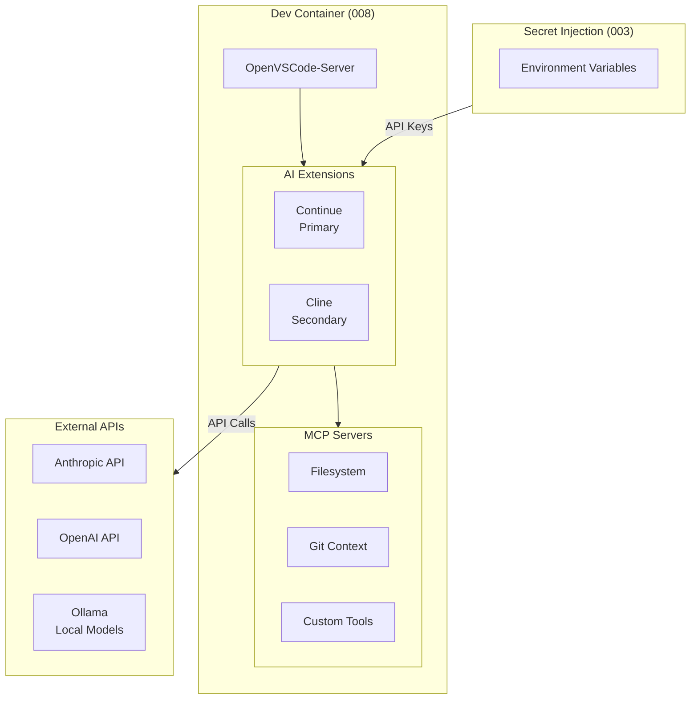
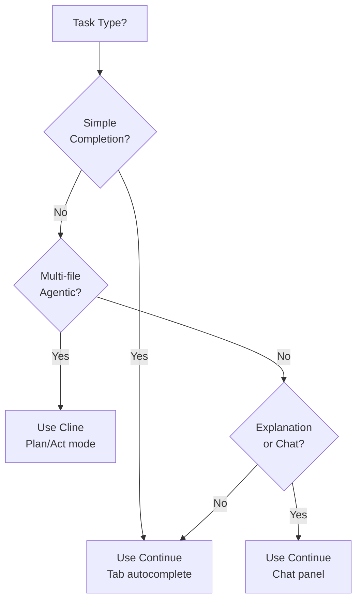
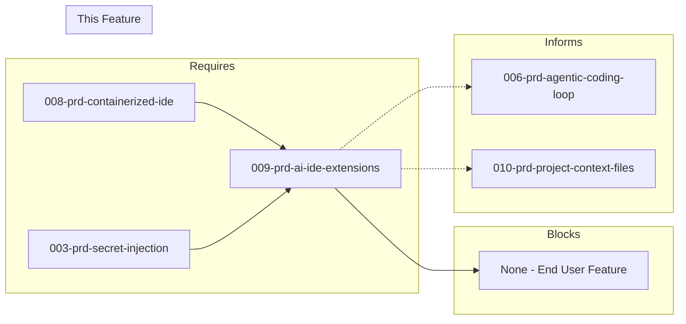

# 009-prd-ai-ide-extensions

> **Document Type:** Product Requirements Document  
> **Audience:** LLM agents, human reviewers  
> **Status:** In Progress  
> **Last Updated:** 2026-01-23 <!-- @auto -->  
> **Owner:** Brian <!-- @human-required -->

---

## Review Tier Legend

| Marker | Tier | Speckit Behavior |
|--------|------|------------------|
| 🔴 `@human-required` | Human Generated | Prompt human to author; blocks until complete |
| 🟡 `@human-review` | LLM + Human Review | LLM drafts → prompt human to confirm/edit; blocks until confirmed |
| 🟢 `@llm-autonomous` | LLM Autonomous | LLM completes; no prompt; logged for audit |
| ⚪ `@auto` | Auto-generated | System fills (timestamps, links); no prompt |

---

## Document Completion Order

> ⚠️ **For LLM Agents:** Complete sections in this order. Do not fill downstream sections until upstream human-required inputs exist.

1. **Context** (Background, Scope) → requires human input first
2. **Problem Statement & User Story** → requires human input
3. **Requirements** (Must/Should/Could/Won't) → requires human input
4. **Technical Constraints** → human review
5. **Diagrams, Data Model, Interface** → LLM can draft after above exist
6. **Acceptance Criteria** → derived from requirements
7. **Everything else** → can proceed

---

## Context

### Background 🔴 `@human-required`

Developers using containerized IDEs need AI-powered assistance for code completions, inline suggestions, chat-based help, and intelligent refactoring. These AI capabilities must work within the containerized IDE environment (OpenVSCode-Server, per 008-prd-containerized-ide) without requiring additional host-side installations or breaking container isolation.

This is a key enabler for the "vibe coding" workflow where developers collaborate with AI assistants throughout the development process.

<!-- 
MIGRATED FROM: Original Problem Statement
REVIEW: Add business context? Link to broader AI-assisted development vision?
-->

### Scope Boundaries 🟡 `@human-review`

**In Scope:**
- AI code completion extensions for containerized VS Code (OpenVSCode-Server)
- Inline autocomplete suggestions
- Chat-based code assistance
- Multi-LLM provider support via API keys
- MCP (Model Context Protocol) integration for extensibility
- Extension configuration and secret management

**Out of Scope:**
<!-- MIGRATED FROM: Won't Have section + critical constraint -->
- Extensions requiring desktop-only VS Code — *container-first mandate from 008*
- Proprietary extensions not available on Open VSX — *licensing, installation constraints*
- Self-hosted LLM inference — *users provide API keys; self-hosting in 006-prd-agentic-coding-loop*
- Autonomous agentic coding workflows — *covered in 006-prd-agentic-coding-loop*
- GitHub Copilot — *not on Open VSX, requires OAuth workarounds*

### Glossary 🟡 `@human-review`

<!-- LLM-drafted based on document content. Human should validate definitions. -->

| Term | Definition |
|------|------------|
| Continue | Apache 2.0 licensed AI code assistant with multi-provider support; selected primary extension |
| Cline | Apache 2.0 licensed agentic coding assistant with human-in-the-loop approval; selected secondary extension |
| MCP | Model Context Protocol — standard for extending AI assistant capabilities with external tools and context |
| Open VSX | Open-source VS Code extension registry (openvsx.org); required for code-server/OpenVSCode-Server compatibility |
| Inline completions | AI-generated code suggestions appearing as ghost text while typing |
| Tab autocomplete | Accepting inline completions by pressing Tab key |
| Human-in-the-loop | Design pattern requiring user approval before AI takes actions (file edits, commands) |

### Related Documents ⚪ `@auto`

| Document | Link | Relationship |
|----------|------|--------------|
| Architecture Decision Record | 009-ard-ai-ide-extensions.md | Defines technical approach |
| Security Review | 009-sec-ai-ide-extensions.md | Risk assessment (API key handling) |
| Containerized IDE PRD | 008-prd-containerized-ide.md | Foundation dependency |
| Secret Injection PRD | 003-prd-secret-injection.md | API key injection dependency |
| Agentic Coding Loop PRD | 006-prd-agentic-coding-loop.md | Related (autonomous workflows) |

---

## Problem Statement 🔴 `@human-required`

Developers using containerized IDEs need AI-powered assistance for code completions, inline suggestions, chat-based help, and intelligent refactoring. These AI capabilities must work within the containerized IDE environment (OpenVSCode-Server) without requiring additional host-side installations or breaking container isolation.

**Critical constraint**: All AI extensions must run within the containerized IDE. Extensions requiring native host components or desktop-only features are excluded.

**Cost of not solving**: Developers lose productivity gains from AI assistance (~30-50% reported efficiency improvement). The containerized environment becomes less attractive than local development with GitHub Copilot.

<!-- 
REVIEW: Quantify the productivity impact? Add specific pain points?
-->

### User Story 🔴 `@human-required`

> As a **developer working in a containerized IDE**, I want **AI-powered code completions and chat assistance** so that **I can write code faster while maintaining the benefits of container isolation**.

<!-- 
MIGRATED: Inferred from problem statement
REVIEW: Secondary stories? (Team lead wanting consistent AI tooling, security-conscious dev wanting local model option)
-->

---

## Assumptions & Risks 🟡 `@human-review`

### Assumptions

- [A-1] OpenVSCode-Server is operational (008-prd-containerized-ide complete)
- [A-2] Developers have API keys for at least one LLM provider (OpenAI, Anthropic, or local)
- [A-3] Secret injection mechanism available for API keys (003-prd-secret-injection)
- [A-4] Open VSX registry extensions are functionally equivalent to Marketplace versions
- [A-5] Network egress from container to LLM APIs is permitted
- [A-6] Token costs are acceptable for development workflows ($20-100/month typical)

### Risks

| ID | Risk | Likelihood | Impact | Mitigation |
|----|------|------------|--------|------------|
| R-1 | Open VSX version lags Marketplace, missing features | Medium | Medium | Pin to known-good versions; monitor release notes |
| R-2 | API costs exceed budget with heavy usage | Medium | Medium | Configure token limits; usage visibility (S-7); consider local models |
| R-3 | Extension conflicts with other VS Code extensions | Low | Medium | Test extension combinations in spike; document known conflicts |
| R-4 | LLM provider API outages disrupt development | Low | High | Multi-provider support (S-4) enables failover |
| R-5 | API keys leaked via extension telemetry or logs | Low | Critical | Audit extension source; disable telemetry; secrets hygiene |

---

## Feature Overview

### Architecture Diagram 🟡 `@human-review`



### Extension Selection Flow 🟡 `@human-review`



---

## Requirements

### Must Have (M) — MVP, launch blockers 🔴 `@human-required`

- [ ] **M-1:** Extension shall work in containerized VS Code (OpenVSCode-Server)
- [ ] **M-2:** Extension shall provide inline code completions (autocomplete as you type)
- [ ] **M-3:** Extension shall provide chat interface for code questions and explanations
- [ ] **M-4:** Extension shall support Python, TypeScript, Rust, and Go languages
- [ ] **M-5:** Extension shall accept API key configuration via environment variables
- [ ] **M-6:** Extension shall have no host-side dependencies
- [ ] **M-7:** Extension shall have reasonable token efficiency (not excessively expensive)

### Should Have (S) — High value, not blocking 🔴 `@human-required`

- [ ] **S-1:** Extension should provide context-aware completions (understands project structure)
- [ ] **S-2:** Extension should support code generation from natural language descriptions
- [ ] **S-3:** Extension should provide inline code editing/refactoring suggestions
- [ ] **S-4:** Extension should support multiple LLM providers (not locked to single vendor)
- [ ] **S-5:** Extension should integrate with MCP (Model Context Protocol)
- [ ] **S-6:** Extension should be open source or source-available
- [ ] **S-7:** Extension should provide cost/usage visibility

### Could Have (C) — Nice to have, if time permits 🟡 `@human-review`

- [ ] **C-1:** Extension could support codebase indexing for improved context
- [ ] **C-2:** Extension could support custom system prompts or personas
- [ ] **C-3:** Extension could support team/enterprise features (shared context, policies)
- [ ] **C-4:** Extension could generate inline documentation
- [ ] **C-5:** Extension could generate tests from code
- [ ] **C-6:** Extension could assist with code review

### Won't Have (W) — Explicitly deferred 🟡 `@human-review`

- [ ] **W-1:** Extensions requiring desktop-only VS Code — *Reason: Conflicts with container-first mandate*
- [ ] **W-2:** Proprietary extensions not on Open VSX — *Reason: Cannot install in OpenVSCode-Server*
- [ ] **W-3:** Self-hosted LLM inference — *Reason: Out of scope; users provide API keys*
- [ ] **W-4:** Autonomous agentic coding — *Reason: Covered in 006-prd-agentic-coding-loop*

---

## Technical Constraints 🟡 `@human-review`

- **IDE Platform:** Must work in OpenVSCode-Server (not desktop VS Code)
- **Extension Registry:** Must be available on Open VSX (not just VS Code Marketplace)
- **Licensing:** Apache 2.0, MIT, or compatible open-source license preferred
- **Authentication:** API keys via environment variables; no OAuth flows requiring browser redirects
- **Network:** Requires egress to LLM provider APIs (api.anthropic.com, api.openai.com, etc.)
- **Resource Limits:** Should function within container memory constraints (see 008)
- **Secret Handling:** API keys injected via 003-prd-secret-injection; never hardcoded

---

## Data Model (if applicable) 🟡 `@human-review`

N/A — Extension configuration is file-based (JSON/YAML).

---

## Interface Contract (if applicable) 🟡 `@human-review`

### Continue Configuration Interface

```yaml
# ~/.continue/config.yaml (or workspace-local .continue/config.yaml)
models:
  - name: claude-sonnet
    provider: anthropic
    model: claude-sonnet-4-20260514
    apiKey: ${{ secrets.ANTHROPIC_API_KEY }}  # Injected from env

  - name: gpt-4o
    provider: openai  
    model: gpt-4o
    apiKey: ${{ secrets.OPENAI_API_KEY }}

tabAutocompleteModel:
  provider: anthropic
  model: claude-sonnet-4-20260514

mcpServers:
  - name: filesystem
    command: npx
    args: ["-y", "@anthropic/mcp-server-filesystem", "/workspace"]
```

### Cline Settings Interface

```json
// .vscode/settings.json
{
  "cline.apiProvider": "anthropic",
  "cline.anthropicApiKey": "${env:ANTHROPIC_API_KEY}",
  "cline.autoApproveReads": true,
  "cline.autoApproveWrites": false,
  "cline.mcpServers": {
    "filesystem": {
      "command": "npx",
      "args": ["-y", "@anthropic/mcp-server-filesystem", "/workspace"]
    }
  }
}
```

### Environment Variables Required

```bash
# Injected via 003-prd-secret-injection
ANTHROPIC_API_KEY=sk-ant-...
OPENAI_API_KEY=sk-...
# Optional
OPENROUTER_API_KEY=sk-or-...
```

---

## Evaluation Criteria 🟡 `@human-review`

| Criterion | Weight | Metric | Target | Notes |
|-----------|--------|--------|--------|-------|
| OpenVSCode-Server compatibility | Critical | Activates without error | Yes | Must Have |
| Inline completions | Critical | Functional autocomplete | Yes | M-2 |
| Chat interface | Critical | Interactive assistance | Yes | M-3 |
| Multi-provider support | High | Providers supported | ≥3 | OpenAI, Anthropic, Ollama |
| Open VSX availability | High | Listed on Open VSX | Yes | Container install requirement |
| MCP support | High | MCP servers configurable | Yes | S-5 |
| License | High | Open source | Apache/MIT | S-6 |
| Token efficiency | Medium | Cost per task | Reasonable | M-7, subjective |
| Active maintenance | Medium | Recent commits | <90 days | Ongoing support |
| Privacy options | Medium | Local model support | Optional | Ollama fallback |

---

## Tool/Approach Candidates 🟡 `@human-review`

| Option | License | Pros | Cons | Open VSX | Recommendation |
|--------|---------|------|------|----------|----------------|
| Continue | Apache 2.0 | Multi-provider, MCP, excellent docs, active dev, tab autocomplete | Newer than Copilot | ✅ Available | **PRIMARY** |
| Cline | Apache 2.0 | Agentic, human-in-the-loop, MCP, 4M+ users | More verbose, agentic focus | ✅ Available | **SECONDARY** |
| Roo-Code | Apache 2.0 | Reliable multi-file, role-based agents | Less completion focus | ✅ Available | Alternative |
| GitHub Copilot | Proprietary | Industry standard, excellent completions | Not on Open VSX, OAuth issues | ❌ Workaround | **NOT RECOMMENDED** |
| Codeium | Freemium | Free tier, fast | Proprietary, limited customization | ✅ Available | Budget option |

### Selected Approach 🔴 `@human-required`

> **Decision:** Continue (primary) + Cline (secondary for agentic tasks)  
> **Rationale:** 
> - Continue: Full Open VSX support, multi-provider (Anthropic/OpenAI/Ollama), comprehensive MCP integration, excellent documentation, active development. Handles 80% of use cases (completions, chat, inline edits).
> - Cline: Best-in-class for complex multi-step tasks requiring file creation, command execution, and human approval workflows. Complements Continue for agentic work.
> - GitHub Copilot rejected: Not on Open VSX, OAuth authentication problematic in containers.

---

## Acceptance Criteria 🟡 `@human-review`

| AC ID | Requirement | Given | When | Then |
|-------|-------------|-------|------|------|
| AC-1 | M-1 | OpenVSCode-Server running | I install Continue extension | It activates without errors |
| AC-2 | M-2 | Typing Python/TypeScript code | Completions are suggested | Suggestions are contextually relevant |
| AC-3 | M-3 | Continue chat panel open | I ask a code question | I receive a helpful, accurate response |
| AC-4 | M-4 | Editing .py, .ts, .rs, .go files | I request completions | Language-specific suggestions appear |
| AC-5 | M-5 | API keys in environment variables | Extension loads | It authenticates automatically without prompts |
| AC-6 | M-6 | Container running without host IDE | I use AI features | All functionality works |
| AC-7 | M-7 | Completing typical coding tasks | I monitor token usage | Costs are within expected range |
| AC-8 | S-4 | Multiple providers configured | I switch providers | Both work correctly |
| AC-9 | S-5 | MCP server configured | I invoke MCP tool | Tool executes and returns results |
| AC-10 | S-7 | Using extension | I check usage metrics | Token count and cost visible |

### Edge Cases 🟢 `@llm-autonomous`

- [ ] **EC-1:** (M-5) When API key is missing or invalid, then clear error message with troubleshooting steps
- [ ] **EC-2:** (M-2) When LLM API times out, then graceful degradation without IDE freeze
- [ ] **EC-3:** (S-4) When primary provider fails, then user can easily switch to secondary
- [ ] **EC-4:** (M-1) When extension conflicts with another, then diagnostic info logged
- [ ] **EC-5:** (M-7) When approaching token limit, then warning before hitting cap

---

## Dependencies 🟡 `@human-review`



### Requires (must be complete before this PRD)

- **008-prd-containerized-ide** — IDE platform (OpenVSCode-Server) must be operational
- **003-prd-secret-injection** — API key injection mechanism required for M-5

### Blocks (waiting on this PRD)

- None — this is an end-user feature

### Informs (decisions here affect future PRDs) 🔴 `@human-required`

| Open Item | Dependent PRD | What We Need | Working Assumption |
|-----------|---------------|--------------|-------------------|
| MCP server patterns | 006-prd-agentic-coding-loop | Which MCP servers are proven stable | filesystem + git MCP servers |
| Extension conflict list | 010-prd-project-context-files | Known incompatibilities | None identified yet |
| Model preferences | 006-prd-agentic-coding-loop | Which models work best for agentic tasks | Claude Sonnet for speed/cost balance |

### External

- **Open VSX Registry** (openvsx.org) — Extension availability
- **Anthropic API** (api.anthropic.com) — LLM provider
- **OpenAI API** (api.openai.com) — LLM provider  
- **Continue project** (github.com/continuedev/continue) — Primary extension maintenance

---

## Security Considerations 🟡 `@human-review`

| Aspect | Assessment | Notes |
|--------|------------|-------|
| Internet Exposure | Yes — egress to LLM APIs | Required for functionality |
| Sensitive Data | Yes — API keys, source code sent to LLMs | See R-5 |
| Authentication Required | Yes — API keys | Injected via env vars |
| Security Review Required | Yes | API key handling, code transmission |

### Security-Specific Requirements

- **SEC-1:** API keys must never be logged or included in telemetry
- **SEC-2:** Extension telemetry should be disabled by default
- **SEC-3:** Source code sent to LLMs should be reviewed (privacy implications)
- **SEC-4:** MCP servers should run with minimal permissions

<!-- 
NEEDS HUMAN INPUT:
- What's the policy on sending proprietary code to external LLMs?
- Are there compliance requirements (data residency, etc.)?
- Should local-only model option be required for sensitive projects?
-->

---

## Implementation Guidance 🟢 `@llm-autonomous`

### Suggested Approach

1. **Install Continue** via OpenVSCode-Server extension CLI
2. **Configure providers** in `~/.continue/config.yaml` with env var secrets
3. **Test basic completions** (M-2) and chat (M-3)
4. **Add MCP servers** for filesystem and git context (S-5)
5. **Install Cline** as secondary for agentic tasks
6. **Document usage patterns** for team adoption

### Extension Installation Script

```bash
#!/bin/bash
# Install AI extensions in OpenVSCode-Server

# Primary: Continue
openvscode-server --install-extension Continue.continue --force

# Secondary: Cline
openvscode-server --install-extension saoudrizwan.claude-dev --force

# Verify installation
openvscode-server --list-extensions | grep -E "(Continue|claude-dev)"
```

### Anti-patterns to Avoid

- **Hardcoding API keys** — Always use environment variables with `${{ secrets.* }}` syntax
- **Enabling all telemetry** — Disable by default; privacy-first
- **Auto-approving all Cline actions** — Keep human-in-the-loop for writes
- **Single provider dependency** — Configure multiple providers for resilience
- **Ignoring token costs** — Monitor usage; set alerts for unexpected spikes

### Reference Examples

- Continue config: `spikes/009-ai-ide-extensions/continue/config.yaml`
- Cline settings: `spikes/009-ai-ide-extensions/cline/settings.json`
- Full spike results: `spikes/009-ai-ide-extensions/FINDINGS.md`

---

## Spike Tasks 🟡 `@human-review`

### Installation & Compatibility

- [ ] Install Continue in OpenVSCode-Server, verify activation
- [ ] Install Cline in OpenVSCode-Server, verify activation
- [ ] Install Roo-Code in OpenVSCode-Server, verify activation
- [ ] Test GitHub Copilot installation options (VSIX, document limitations)
- [ ] Test Codeium availability and installation
- [ ] Document installation steps for each extension

### Feature Validation

- [ ] Test inline completions in Python, TypeScript, Rust, Go
- [ ] Test chat interface for code explanation
- [ ] Test code generation from natural language
- [ ] Test multi-file context awareness
- [ ] Test MCP integration (filesystem, git servers)

### Provider Configuration

- [ ] Configure and test with Anthropic API
- [ ] Configure and test with OpenAI API
- [ ] Configure and test with local models (Ollama)
- [ ] Test API key configuration via environment variables
- [ ] Measure token usage for equivalent tasks

### Performance & UX

- [ ] Measure completion latency by provider
- [ ] Evaluate completion quality across languages
- [ ] Test with large codebases (context handling)
- [ ] Document OpenVSCode-Server specific issues or workarounds

---

## Success Metrics 🔴 `@human-required`

| Metric | Baseline | Target | Measurement Method |
|--------|----------|--------|-------------------|
| Extension activation success | N/A | 100% | CI test suite |
| Completion acceptance rate | N/A | >40% | Extension telemetry (if enabled) |
| Developer satisfaction | N/A | >4/5 | Survey |
| Monthly API cost per developer | N/A | <$50 | Provider dashboards |

### Technical Verification 🟢 `@llm-autonomous`

| Metric | Target | Verification Method |
|--------|--------|---------------------|
| All Must Have ACs passing | 100% | Automated acceptance tests |
| Multi-language completion test | 4 languages | CI matrix test |
| Provider failover time | <5s | Integration test |

---

## Definition of Ready 🔴 `@human-required`

### Readiness Checklist

- [x] Problem statement reviewed and validated by stakeholder
- [x] All Must Have requirements have acceptance criteria
- [x] Technical constraints are explicit and agreed
- [ ] Dependencies identified and owners confirmed
- [ ] Forward dependencies tracked (Informs table complete if questions deferred)
- [ ] Security review completed (or N/A documented with justification)
- [ ] No open questions blocking implementation (deferred with working assumptions = OK)

### Sign-off

| Role | Name | Date | Decision |
|------|------|------|----------|
| Product Owner | | | [ ] Ready / [ ] Not Ready |

---

## Changelog ⚪ `@auto`

| Version | Date | Author | Changes |
|---------|------|--------|---------|
| 0.1 | 2026-01-XX | Brian | Initial draft |
| 0.2 | 2026-01-23 | Claude | Migrated to PRD template v3 format |

---

## Decision Log 🟡 `@human-review`

| Date | Decision | Rationale | Alternatives Considered |
|------|----------|-----------|------------------------|
| 2026-01-XX | Selected Continue as primary extension | Open VSX available, multi-provider, MCP support, active development | Cline (secondary), Roo-Code (alternative), Copilot (rejected—not on Open VSX) |
| 2026-01-XX | Added Cline as secondary for agentic tasks | Best human-in-the-loop UX for complex multi-step operations | Roo-Code (less mature), Continue-only (lacks agentic features) |
| 2026-01-XX | Rejected GitHub Copilot | Not available on Open VSX, OAuth authentication problematic in containers | Manual VSIX install (fragile), Copilot CLI (different use case) |

---

## Open Questions 🟡 `@human-review`

- [x] **Q1:** Which AI coding extension best fits containerized IDE requirements?
  > **Resolved:** Continue (primary) + Cline (secondary). See Decision Log.

- [ ] **Q2:** What's the policy on sending proprietary source code to external LLMs?
  > **Deferred to:** Security review / team policy decision
  > **Working assumption:** Developers choose appropriate provider; local models available for sensitive work.

- [ ] **Q3:** Should local-only model option be mandatory for certain project types?
  > **Deferred to:** Team policy / compliance review
  > **Working assumption:** Optional; Ollama support exists but not required.

- [ ] **Q4:** How should token budgets be managed across team members?
  > **Deferred to:** Future team/enterprise PRD (C-3)
  > **Working assumption:** Individual API keys; no shared budget management initially.

---

## Review Checklist 🟢 `@llm-autonomous`

Before marking as Approved:

- [x] All requirements have unique IDs (M-1, S-2, etc.)
- [x] All Must Have requirements have linked acceptance criteria
- [x] Glossary terms are used consistently throughout
- [x] Diagrams use terminology from Glossary
- [ ] Security considerations documented (or N/A justified)
- [ ] Definition of Ready checklist is complete
- [x] No open questions blocking implementation (deferred questions with working assumptions are OK)
- [x] Forward dependencies tracked in Informs table (if any questions deferred to future PRDs)

---

## References

- [Continue Documentation](https://docs.continue.dev)
- [Continue GitHub](https://github.com/continuedev/continue)
- [Cline on Open VSX](https://open-vsx.org/extension/saoudrizwan/claude-dev)
- [Cline GitHub](https://github.com/cline/cline)
- [Roo Code vs Cline Comparison](https://www.qodo.ai/blog/roo-code-vs-cline/)
- [Model Context Protocol](https://modelcontextprotocol.io)
- [GitHub Copilot CLI Updates (2026)](https://github.blog/changelog/2026-01-14-github-copilot-cli-enhanced-agents-context-management-and-new-ways-to-install/)
