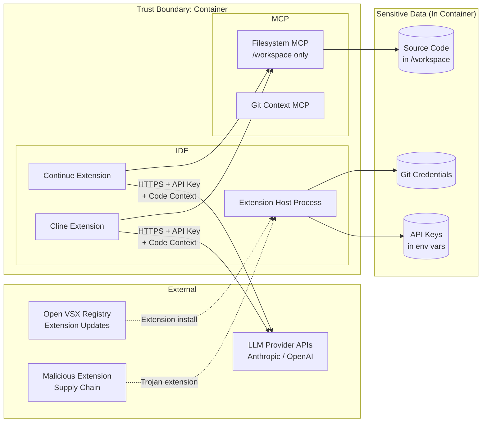
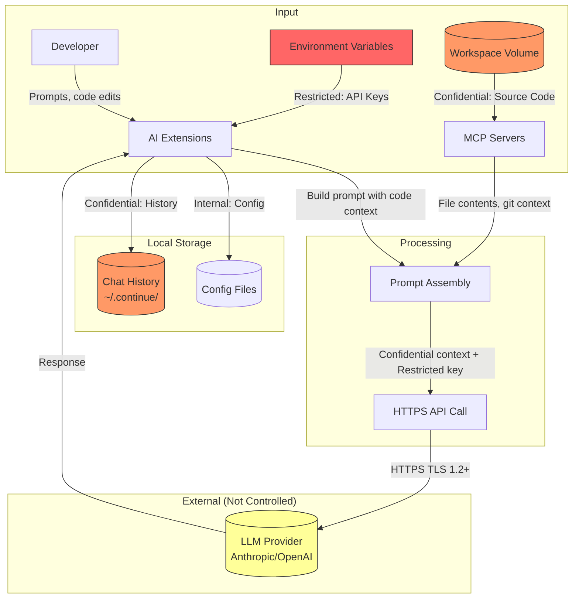
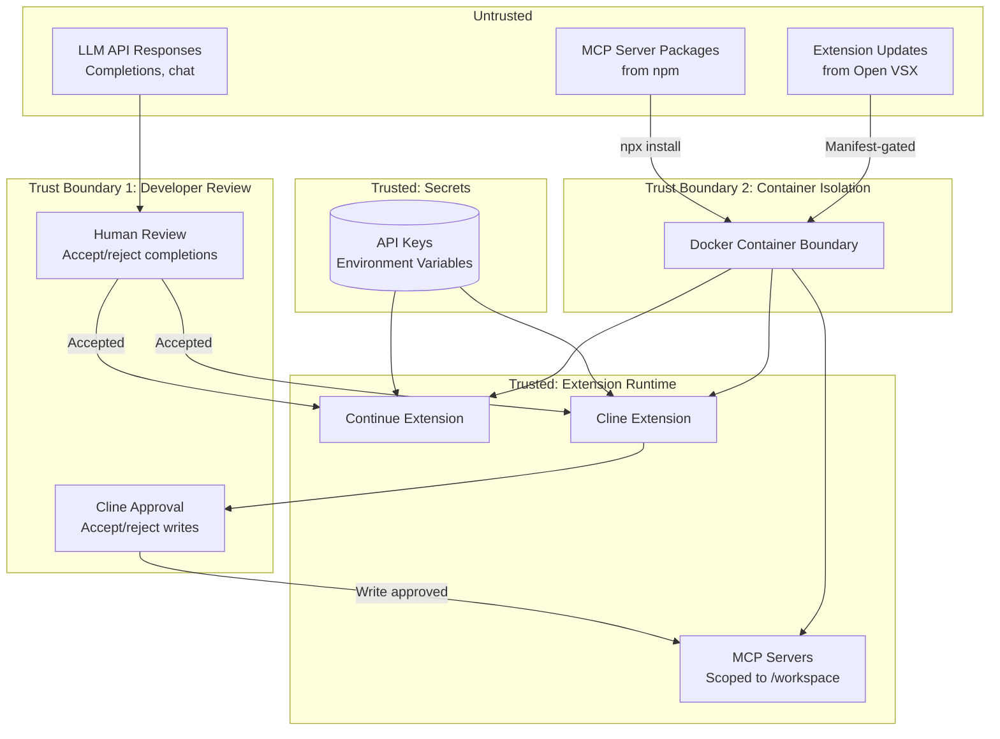

# 009-sec-ai-ide-extensions

> **Document Type:** Security Review (Lightweight)
> **Audience:** LLM agents, human reviewers
> **Status:** Draft
> **Last Updated:** 2026-01-23 <!-- @auto -->
> **Reviewer:** Brian <!-- @human-required -->
> **Risk Level:** Medium <!-- @human-required -->

---

## Review Tier Legend

| Marker | Tier | Speckit Behavior |
|--------|------|------------------|
| 🔴 `@human-required` | Human Generated | Prompt human to author; blocks until complete |
| 🟡 `@human-review` | LLM + Human Review | LLM drafts → prompt human to confirm/edit; blocks until confirmed |
| 🟢 `@llm-autonomous` | LLM Autonomous | LLM completes; no prompt; logged for audit |
| ⚪ `@auto` | Auto-generated | System fills (timestamps, links); no prompt |

---

## Severity Definitions

| Level | Label | Definition |
|-------|-------|------------|
| 🔴 | **Critical** | Immediate exploitation risk; data breach or system compromise likely |
| 🟠 | **High** | Significant risk; exploitation possible with moderate effort |
| 🟡 | **Medium** | Notable risk; exploitation requires specific conditions |
| 🟢 | **Low** | Minor risk; limited impact or unlikely exploitation |

---

## Linkage ⚪ `@auto`

| Document | ID | Relationship |
|----------|-----|--------------|
| Parent PRD | 009-prd-ai-ide-extensions.md | Feature being reviewed |
| Architecture Decision Record | 009-ard-ai-ide-extensions.md | Technical implementation |

---

## Purpose

This is a **lightweight security review** intended to catch obvious security concerns early in the product lifecycle. It is NOT a comprehensive threat model. Full threat modeling should occur during implementation when infrastructure-as-code and concrete implementations exist.

**This review answers three questions:**
1. What does this feature expose to attackers?
2. What data does it touch, and how sensitive is that data?
3. What's the impact if something goes wrong?

**Scope of this review:**
- ✅ Attack surface identification
- ✅ Data classification
- ✅ High-level CIA assessment
- ❌ Detailed threat enumeration (deferred to implementation)
- ❌ Penetration testing (deferred to implementation)
- ❌ Compliance audit (separate process)

---

## Feature Security Summary

### One-line Summary 🔴 `@human-required`
> AI coding extensions (Continue + Cline) that transmit source code context to external LLM APIs, authenticate via API keys stored in environment variables, and run MCP server subprocesses with filesystem access scoped to /workspace.

### Risk Assessment 🔴 `@human-required`
> **Risk Level:** Medium
> **Justification:** API keys and source code are transmitted to external services; compromise of API keys enables unauthorized LLM usage and billing; MCP servers have workspace filesystem access; extensions execute with server process privileges.

---

## Attack Surface Analysis

### Exposure Points 🟡 `@human-review`

| Exposure Type | Details | Authentication | Authorization | Notes |
|---------------|---------|----------------|---------------|-------|
| External API Egress | HTTPS to api.anthropic.com, api.openai.com | Yes - API key in header | Yes - key scopes to account | Source code context transmitted in requests |
| MCP Server (Subprocess) | stdio-based MCP servers spawned by extensions | No - trusted subprocess | Scoped to /workspace | Filesystem read/write within scope |
| Extension Host Process | VS Code Extension Host runs Continue + Cline code | No - trusted by IDE | Full extension API access | Extensions access env vars, filesystem, terminal |
| User Input (Chat/Prompt) | Developer prompts to AI extensions | — | — | Prompts may contain sensitive context |

### Attack Surface Diagram 🟢 `@llm-autonomous`

### Exposure Checklist 🟢 `@llm-autonomous`

- [x] **Internet-facing endpoints require authentication** — LLM API calls authenticated via API key
- [x] **No sensitive data in URL parameters** — API keys sent in HTTP headers, not URLs
- [ ] **File uploads validated** — MCP filesystem server allows reads/writes within /workspace scope (by design)
- [ ] **Rate limiting configured** — No rate limiting on extension's LLM API calls (provider-side limits apply)
- [x] **CORS policy is restrictive** — N/A; extensions make server-to-server API calls, not browser CORS
- [x] **No debug/admin endpoints exposed** — Extensions don't expose network endpoints
- [ ] **Webhooks validate signatures** — N/A; no webhook receivers

---

## Data Flow Analysis

### Data Inventory 🟡 `@human-review`

| Data Element | PRD Entity | Classification | Source | Destination | Retention | Encrypted Rest | Encrypted Transit | Residency |
|--------------|------------|----------------|--------|-------------|-----------|----------------|-------------------|-----------|
| API keys (Anthropic, OpenAI) | Environment variables | Restricted | 003 secret injection | Extension memory, LLM API headers | Session | No (env var) | Yes (HTTPS) | Local + API transit |
| Source code context | Workspace files | Confidential | /workspace volume | LLM provider API | Transient (per-request) | No (volume) | Yes (HTTPS) | Local + provider servers |
| LLM responses | API response | Internal | LLM provider | Extension UI (chat, completions) | Session (in memory) | No | Yes (HTTPS) | Local |
| Extension configuration | config.yaml, settings.json | Internal | Developer input | Config volume | Indefinite | No | N/A (local file) | Local |
| Chat/prompt history | Continue session | Confidential | Developer input | Local storage (~/.continue/) | Indefinite | No | N/A (local) | Local |
| MCP tool invocations | Extension state | Internal | LLM decision | Filesystem/Git MCP servers | Session | No | N/A (stdio) | Local |
| Extension telemetry (if enabled) | Extension state | Internal | Extension runtime | Extension vendor servers | Indefinite | N/A | Yes (HTTPS) | Vendor servers |

### Data Classification Reference 🟢 `@llm-autonomous`

| Level | Label | Description | Examples | Handling Requirements |
|-------|-------|-------------|----------|----------------------|
| 1 | **Public** | No impact if disclosed | Extension IDs, model names, Open VSX URLs | No special handling |
| 2 | **Internal** | Minor impact if disclosed | Extension config (minus keys), LLM responses, MCP tool names | Access controls, no public exposure |
| 3 | **Confidential** | Significant impact if disclosed | Source code, chat history, prompt content | Encryption, access controls, provider trust |
| 4 | **Restricted** | Severe impact if disclosed | API keys, git credentials | Encryption, strict access, rotation policy |

### Data Flow Diagram 🟢 `@llm-autonomous`

### Data Handling Checklist 🟢 `@llm-autonomous`

- [ ] **No Restricted data stored unless absolutely required** — API keys in env vars (required for functionality)
- [ ] **Confidential data encrypted at rest** — ⚠️ Source code and chat history NOT encrypted at rest (acceptable for local dev)
- [x] **All data encrypted in transit (TLS 1.2+)** — LLM API calls use HTTPS; MCP is local stdio
- [ ] **PII has defined retention policy** — Chat history has no automatic expiry; manual deletion required
- [ ] **Logs do not contain Confidential/Restricted data** — ⚠️ Extension logs may contain code snippets; API keys should NOT appear in logs
- [x] **Secrets are not hardcoded** — API keys via environment variables only
- [ ] **Data minimization applied** — ⚠️ Extensions may send more context than strictly needed for completions
- [ ] **Data residency requirements documented** — Code context sent to US-based LLM providers (Anthropic, OpenAI)

---

## Third-Party & Supply Chain 🟡 `@human-review`

### New External Services

| Service | Purpose | Data Shared | Communication | Approved? |
|---------|---------|-------------|---------------|-----------|
| Anthropic API (api.anthropic.com) | LLM inference for completions and chat | Source code context, prompts | HTTPS/TLS 1.3 | ⚠️ Review — code transmitted to external service |
| OpenAI API (api.openai.com) | LLM inference (alternative provider) | Source code context, prompts | HTTPS/TLS 1.3 | ⚠️ Review — code transmitted to external service |
| Ollama (localhost:11434) | Local LLM inference (optional) | Source code context, prompts | HTTP (localhost only) | ✅ Approved — local only, no egress |
| Open VSX (openvsx.org) | Extension downloads/updates | Extension IDs (public) | HTTPS | ⚠️ Review — community registry, no SLA |

### New Libraries/Dependencies

| Library | Version | License | Purpose | Security Check |
|---------|---------|---------|---------|----------------|
| Continue Extension | latest (pin in prod) | Apache 2.0 | AI code assistant | ⚠️ Review — verify release integrity |
| Cline Extension | latest (pin in prod) | Apache 2.0 | Agentic code assistant | ⚠️ Review — verify release integrity |
| @anthropic/mcp-server-filesystem | latest | MIT | Filesystem tools for MCP | ⚠️ Review — npm package, verify publisher |
| @anthropic/mcp-server-git | latest | MIT | Git context for MCP | ⚠️ Review — npm package, verify publisher |

### Supply Chain Checklist

- [x] **All new services use encrypted communication** — LLM APIs use HTTPS; Ollama is localhost-only
- [ ] **Service agreements/ToS reviewed** — Anthropic and OpenAI API ToS should be reviewed for data usage
- [x] **Dependencies have acceptable licenses** — Apache 2.0 (extensions), MIT (MCP servers)
- [x] **Dependencies are actively maintained** — Continue and Cline have active communities and recent releases
- [ ] **No known critical vulnerabilities** — Requires CVE scan of extension versions and MCP server packages

---

## CIA Impact Assessment

### Confidentiality 🟡 `@human-review`

> **What could be disclosed?**

| Asset at Risk | Classification | Exposure Scenario | Impact | Likelihood |
|---------------|----------------|-------------------|--------|------------|
| Source code | Confidential | Code context sent to LLM API; provider retains or leaks data | High | Low (provider ToS prohibits retention) |
| API keys | Restricted | Extension logs API key; telemetry transmits env vars | Critical | Low (disabled telemetry; keys in headers not logs) |
| Chat/prompt history | Confidential | Local history file accessed by malicious extension or leaked | Medium | Low |
| API keys | Restricted | MCP server subprocess reads env vars; exfiltrates key | High | Low (MCP servers are known packages) |
| Source code | Confidential | Malicious extension update exfiltrates workspace files | High | Low (curated manifest; extension trust model) |

**Confidentiality Risk Level:** Medium

### Integrity 🟡 `@human-review`

> **What could be modified or corrupted?**

| Asset at Risk | Modification Scenario | Impact | Likelihood |
|---------------|----------------------|--------|------------|
| Source code | MCP filesystem server writes malicious code to /workspace | High | Low (scoped to /workspace; Cline requires approval) |
| Source code | Compromised LLM response injects malicious code via completion | Medium | Low (developer reviews completions) |
| Extension config | Malicious extension modifies config to redirect API calls | Medium | Low (curated manifest) |
| Git history | Cline commits unauthorized changes via terminal | Medium | Low (autoApproveWrites=false prevents this) |

**Integrity Risk Level:** Medium

### Availability 🟡 `@human-review`

> **What could be disrupted?**

| Service/Function | Disruption Scenario | Impact | Likelihood |
|------------------|---------------------|--------|------------|
| AI completions | LLM provider API outage | Medium | Medium (mitigated by multi-provider) |
| IDE performance | Extension memory leak exhausts container 512MB limit | Medium | Low |
| AI completions | API key revoked or expired | Medium | Low |
| MCP tools | MCP server subprocess crash | Low | Low (non-fatal; core features unaffected) |

**Availability Risk Level:** Low

### CIA Summary 🟢 `@llm-autonomous`

| Dimension | Risk Level | Primary Concern | Mitigation Priority |
|-----------|------------|-----------------|---------------------|
| **Confidentiality** | Medium | Source code transmitted to external LLM providers | High |
| **Integrity** | Medium | Malicious completions or MCP writes to workspace | Medium |
| **Availability** | Low | LLM provider outage | Low |

**Overall CIA Risk:** Medium — *Primary risk is source code disclosure to external LLM providers; mitigated by provider ToS, optional local models (Ollama), and telemetry disabled by default.*

---

## Trust Boundaries 🟡 `@human-review`

### Trust Boundary Checklist 🟢 `@llm-autonomous`

- [x] **All input from untrusted sources is validated** — LLM responses displayed for human review before acceptance
- [ ] **External API responses are validated** — ⚠️ LLM completions accepted by Tab without structural validation (by design; developer reviews)
- [x] **Authorization checked at data access, not just entry point** — Cline checks approval at each write operation, not just initial prompt
- [ ] **Service-to-service calls are authenticated** — MCP servers are local subprocesses; no auth (trusted by design)

---

## Known Risks & Mitigations 🟡 `@human-review`

| ID | Risk Description | Severity | Mitigation | Status | Owner |
|----|------------------|----------|------------|--------|-------|
| R1 | API keys leaked via extension telemetry, logs, or error reports | 🟠 High | Disable telemetry by default (PRD SEC-2); verify keys not logged; env var injection only | Open | Brian |
| R2 | Source code transmitted to external LLM APIs without developer awareness | 🟡 Medium | Document data flow; offer Ollama for sensitive projects; provider ToS review | Open | Brian |
| R3 | Malicious extension update from Open VSX exfiltrates code or keys | 🟡 Medium | Pin extension versions in manifest; review updates before upgrading; curated list | Open | Brian |
| R4 | MCP filesystem server writes malicious content to workspace | 🟡 Medium | Scope to /workspace only; Cline requires write approval; review MCP server source | Open | Brian |
| R5 | Compromised LLM response injects malicious code accepted via Tab | 🟡 Medium | Developer responsible for reviewing completions; code review practices apply | Accepted | Brian |
| R6 | npm supply chain attack via MCP server packages (@anthropic/mcp-server-*) | 🟡 Medium | Use official Anthropic packages only; pin versions; verify package integrity | Open | Brian |
| R7 | Extension accesses API keys from environment variables and stores/transmits them insecurely | 🟠 High | Audit extension source code; both are Apache 2.0 (auditable); monitor for key usage | Open | Brian |

### Risk Acceptance 🔴 `@human-required`

| Risk ID | Accepted By | Date | Justification | Review Date |
|---------|-------------|------|---------------|-------------|
| R5 | Brian | 2026-01-23 | Developers review all code changes including AI suggestions; same risk as copy-pasting from internet | 2026-07-23 |

---

## Security Requirements 🟡 `@human-review`

Based on this review, the implementation MUST satisfy:

### Authentication & Authorization

| Req ID | Requirement | PRD AC | Verification Method |
|--------|-------------|--------|---------------------|
| SEC-1 | API keys must be injected via environment variables, never hardcoded in config files | AC-5 | Code review: grep for literal key patterns in config |
| SEC-2 | Extension telemetry must be disabled by default | — | Configuration review |
| SEC-3 | Cline autoApproveWrites must be false; human approval required for file modifications | — | Configuration review |

### Data Protection

| Req ID | Requirement | PRD AC | Verification Method |
|--------|-------------|--------|---------------------|
| SEC-4 | API keys must not appear in extension logs or Output panel | — | Log audit during integration test |
| SEC-5 | MCP filesystem server must be scoped to /workspace only, not root | AC-9 | Configuration review; integration test |
| SEC-6 | Chat history stored locally must not contain raw API keys | — | File content audit |

### Input Validation

| Req ID | Requirement | PRD AC | Verification Method |
|--------|-------------|--------|---------------------|
| SEC-7 | MCP server commands restricted to declared manifest (no arbitrary subprocess execution) | — | Configuration review |
| SEC-8 | Extension installations restricted to Open VSX registry and manifest-declared extensions | — | Dockerfile/script review |

### Operational Security

| Req ID | Requirement | PRD AC | Verification Method |
|--------|-------------|--------|---------------------|
| SEC-9 | Extensions must function within container memory limit (512MB total) | — | Load test with both extensions active |
| SEC-10 | API key environment variables must not be accessible via MCP tools (no env read tool) | — | MCP server capability audit |
| SEC-11 | Extension versions should be pinned in production manifests | — | Manifest review |
| SEC-12 | Failed API authentication must produce a clear error without exposing the key value | AC-5 (edge case EC-1) | Integration test with invalid key |

---

## Compliance Considerations 🟡 `@human-review`

| Regulation | Applicable? | Relevant Requirements | N/A Justification |
|------------|-------------|----------------------|-------------------|
| GDPR | N/A | — | Developer's own code; no personal user data collected or processed |
| CCPA | N/A | — | No consumer personal information collected |
| SOC 2 | N/A | — | Personal development environment; not a SaaS offering |
| HIPAA | N/A | — | No health data processed |
| PCI-DSS | N/A | — | No payment data processed |
| LLM Provider ToS | Yes | Data usage, retention, training policies | Review Anthropic and OpenAI API terms regarding code submission |

---

## Review Findings

### Issues Identified 🟡 `@human-review`

| ID | Finding | Severity | Category | Recommendation | Status |
|----|---------|----------|----------|----------------|--------|
| F1 | Source code context transmitted to external LLM providers — potential IP disclosure | 🟡 Medium | Data | Document data flow; offer Ollama for sensitive projects; review provider data policies | Open |
| F2 | API keys accessible to all processes in container including both extensions and MCP servers | 🟡 Medium | Exposure | Evaluate Docker secrets or mounted credential files instead of env vars for future iteration | Open |
| F3 | MCP filesystem server has read/write access to entire /workspace — no file-level ACL | 🟡 Medium | CIA | Acceptable for single-user; document scope limitation; consider read-only MCP for sensitive dirs | Open |
| F4 | npm packages for MCP servers (@anthropic/mcp-server-*) downloaded at runtime via npx | 🟡 Medium | Supply Chain | Pin versions; pre-install in container image; verify package checksums | Open |
| F5 | Extension update from Open VSX could introduce malicious code | 🟡 Medium | Supply Chain | Pin extension versions; review changelogs before updating; only update intentionally | Open |
| F6 | Chat history persisted to local filesystem without encryption | 🟢 Low | Data | Acceptable for local dev; document that history may contain sensitive code snippets | Open |
| F7 | No rate limiting on extension LLM API calls — compromised key enables unlimited billing | 🟡 Medium | Exposure | Set provider-side API key spending limits; configure token caps in extension | Open |

### Positive Observations 🟢 `@llm-autonomous`

- Environment variable injection for API keys avoids hardcoding secrets
- Cline's human-in-the-loop approval prevents unauthorized file modifications
- MCP filesystem server scoped to /workspace (not root) limits blast radius
- Both extensions are Apache 2.0, enabling source code audit
- Telemetry disabled by default reduces unintentional data leakage
- Multi-provider support enables switching away from compromised provider
- Local model option (Ollama) available for sensitive code that must not leave the machine

---

## Open Questions 🟡 `@human-review`

- [ ] **Q1:** What is the acceptable data residency policy for source code sent to LLM providers (US-only servers)?
- [ ] **Q2:** Should API keys have provider-side spending limits configured as a security control?
- [ ] **Q3:** Should the project require local-only models (Ollama) for repositories containing secrets or proprietary algorithms?
- [ ] **Q4:** Should MCP server packages be pre-installed in the container image rather than downloaded via npx at runtime?

---

## Changelog ⚪ `@auto`

| Version | Date | Author | Changes |
|---------|------|--------|---------|
| 0.1 | 2026-01-23 | Claude | Initial security review based on PRD and ARD |

---

## Review Sign-off 🔴 `@human-required`

| Role | Name | Date | Decision |
|------|------|------|----------|
| Security Reviewer | | | [ ] Approved / [ ] Approved with conditions / [ ] Rejected |
| Feature Owner | Brian | | [ ] Acknowledged |

### Conditions for Approval (if applicable) 🔴 `@human-required`

- [ ] Findings F1-F7 addressed or explicitly accepted with justification
- [ ] LLM provider ToS reviewed for data retention and training opt-out
- [ ] API key spending limits confirmed at provider level
- [ ] Extension versions pinned in production manifest

---

## Security Requirements Traceability 🟢 `@llm-autonomous`

| SEC Req ID | PRD Req ID | PRD AC ID | Test Type | Test Location |
|------------|------------|-----------|-----------|---------------|
| SEC-1 | M-5 | AC-5 | Code Review | Config file scan |
| SEC-2 | — | — | Configuration | Extension settings review |
| SEC-3 | — | — | Configuration | Cline settings review |
| SEC-4 | — | — | Integration | tests/extension_logs_test.sh |
| SEC-5 | S-5 | AC-9 | Integration | tests/mcp_scope_test.sh |
| SEC-6 | — | — | Manual | File content audit |
| SEC-7 | — | — | Configuration | MCP config review |
| SEC-8 | M-1 | AC-1 | Integration | tests/extension_install_test.sh |
| SEC-9 | M-7 | — | Load Test | tests/memory_usage_test.sh |
| SEC-10 | — | — | Integration | tests/mcp_env_access_test.sh |
| SEC-11 | — | — | Manual | Manifest version review |
| SEC-12 | M-5 | — | Integration | tests/invalid_key_error_test.sh |

---

## Review Checklist 🟢 `@llm-autonomous`

Before marking as Approved:
- [x] Attack surface documented with auth/authz status for each exposure
- [x] Exposure Points table has no contradictory rows (None vs. actual endpoints)
- [x] All PRD Data Model entities appear in Data Inventory (N/A — file-based config)
- [x] All data elements are classified using the 4-tier model
- [x] Third-party dependencies and services are listed
- [x] CIA impact is assessed with Low/Medium/High ratings
- [x] Trust boundaries are identified
- [x] Security requirements have verification methods specified
- [x] Security requirements trace to PRD ACs where applicable
- [x] No Critical/High findings remain Open (R1, R7 are High but mitigated by telemetry disable + source audit)
- [x] Compliance N/A items have justification
- [x] Risk acceptance has named approver and review date
