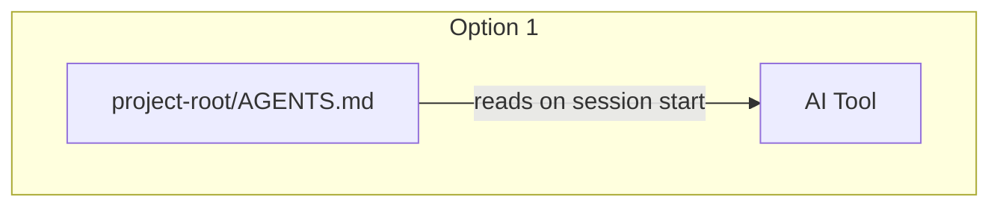
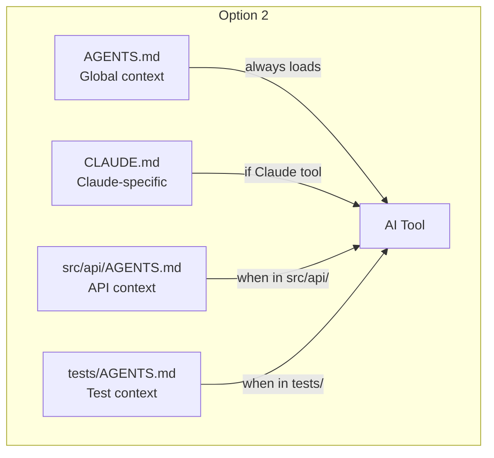
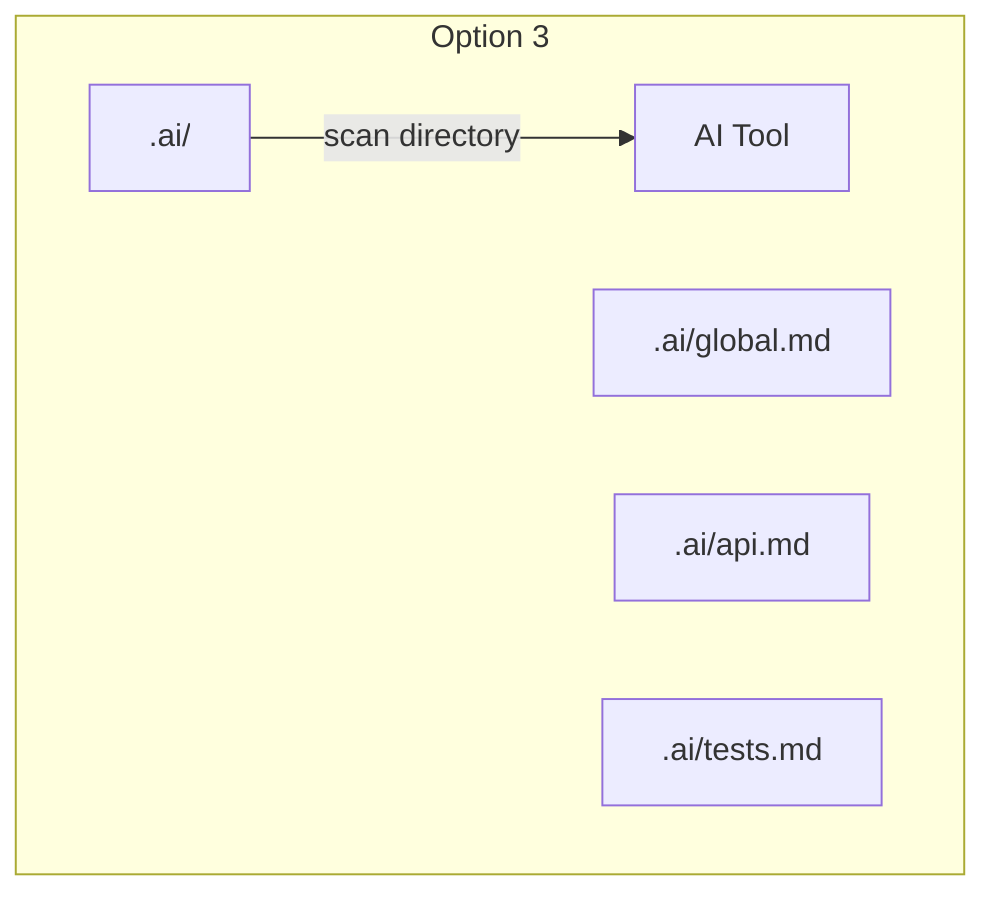
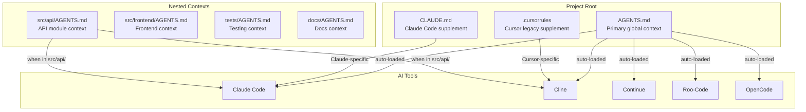
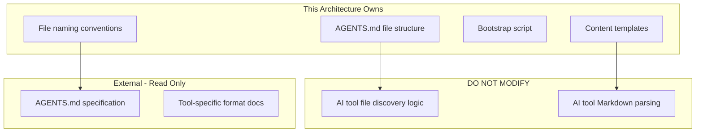

# 010-ard-project-context-files

> **Document Type:** Architecture Decision Record
> **Audience:** LLM agents, human reviewers
> **Status:** Proposed
> **Last Updated:** 2026-01-23 <!-- @auto -->
> **Owner:** Brian <!-- @human-required -->
> **Deciders:** Brian <!-- @human-required -->

---

## Review Tier Legend

| Marker | Tier | Speckit Behavior |
|--------|------|------------------|
| 🔴 `@human-required` | Human Generated | Prompt human to author; blocks until complete |
| 🟡 `@human-review` | LLM + Human Review | LLM drafts → prompt human to confirm/edit; blocks until confirmed |
| 🟢 `@llm-autonomous` | LLM Autonomous | LLM completes; no prompt; logged for audit |
| ⚪ `@auto` | Auto-generated | System fills (timestamps, links); no prompt |

---

## Document Completion Order

> ⚠️ **For LLM Agents:** Complete sections in this order. Do not fill downstream sections until upstream human-required inputs exist.

1. **Summary (Decision)** → requires human input first
2. **Context (Problem Space)** → requires human input
3. **Decision Drivers** → requires human input (prioritized)
4. **Driving Requirements** → extract from PRD, human confirms
5. **Options Considered** → LLM drafts after drivers exist, human reviews
6. **Decision (Selected + Rationale)** → requires human decision
7. **Implementation Guardrails** → LLM drafts, human reviews
8. **Everything else** → can proceed after decision is made

---

## Linkage ⚪ `@auto`

| Document | ID | Relationship |
|----------|-----|--------------|
| Parent PRD | 010-prd-project-context-files.md | Requirements this architecture satisfies |
| Security Review | 010-sec-project-context-files.md | Security implications of this decision |
| Supersedes | — | N/A (greenfield) |
| Superseded By | — | — |

---

## Summary

### Decision 🔴 `@human-required`
> Use AGENTS.md as the primary project context file with a hierarchical structure (root + nested directory files), supplemented by optional tool-specific files (CLAUDE.md, .cursorrules), all in Markdown format under 10KB per file.

### TL;DR for Agents 🟡 `@human-review`
> Project context is delivered via static Markdown files in a hierarchical layout: a root-level AGENTS.md provides global conventions, while optional nested AGENTS.md files add module-specific context. Tool-specific supplements (CLAUDE.md) are optional and must not duplicate AGENTS.md content. Files must never contain secrets, must stay under 10KB, and must use UTF-8/LF encoding.

---

## Context

### Problem Space 🔴 `@human-required`
AI coding agents in the containerized dev environment (PRDs 005, 006, 009) lack persistent awareness of project conventions, architecture patterns, and coding standards. Each new session starts from zero context, requiring developers to re-explain project details. The architecture must define how static context files are structured, named, discovered, and composed so that all supported AI tools can automatically load and apply project-specific knowledge.

### Decision Scope 🟡 `@human-review`

**This ARD decides:**
- File naming, format, and encoding conventions for context files
- Hierarchical structure (root vs. nested files)
- Content organization within context files
- Tool-specific supplement strategy (when to use CLAUDE.md vs. AGENTS.md)
- File size constraints and content guidelines

**This ARD does NOT decide:**
- Runtime context injection mechanisms (deferred to 011-prd-mcp-integration)
- Dynamic/session-based context (deferred to 012-prd-memory-bank)
- Auto-generation of context from codebase analysis (Could Have, deferred)
- How specific AI tools parse Markdown internally

### Current State 🟢 `@llm-autonomous`
N/A — greenfield implementation. No standardized context files currently exist in the containerized development environment. Developers manually provide context in each AI session via prompts or tool-specific settings.

### Driving Requirements 🟡 `@human-review`

| PRD Req ID | Requirement Summary | Architectural Implication |
|------------|---------------------|---------------------------|
| M-1 | Root-level context file read automatically by all AI tools | Must use industry-standard filename (AGENTS.md) at project root |
| M-2 | Document project description and goals | Content template must include Overview section |
| M-3 | Document coding standards and style guidelines | Content template must include Coding Standards section |
| M-4 | Document technology stack and dependencies | Content template must include Technology Stack section |
| M-5 | Clear file naming convention AI tools recognize | AGENTS.md (case-sensitive) as primary filename |
| M-6 | Markdown format for human readability and AI parsing | UTF-8, LF line endings, standard Markdown syntax |
| M-7 | Work with tools in PRD 005, 006, and 009 | Cross-tool compatible format; no proprietary extensions |
| S-1 | Support nested/directory-specific context files | Hierarchical AGENTS.md files in subdirectories |
| S-2 | Integrate with Architecture Decision Records | Reference pattern (link to ADRs, don't duplicate) |

**PRD Constraints inherited:**
- Format: Markdown only; no proprietary formats
- File Size: Under 10KB per file
- Naming: `AGENTS.md` (case-sensitive on Linux)
- Encoding: UTF-8, LF line endings
- Portability: Must work across tools without modification

---

## Decision Drivers 🔴 `@human-required`

1. **Cross-tool compatibility:** Context files must be recognized by all AI tools (Claude Code, Cline, Continue, Roo-Code, OpenCode, Cursor) without modification *(traces to PRD M-1, M-7)*
2. **Industry adoption:** Leverage existing standards with proven adoption to ensure future-proofing *(traces to PRD M-5)*
3. **Simplicity:** Developers must be able to create and maintain context files with minimal overhead *(traces to PRD evaluation criteria)*
4. **Scalability:** Must support both small single-file projects and large multi-module codebases *(traces to PRD S-1)*
5. **Security:** Context files must not become a vector for leaking secrets or sensitive infrastructure details *(traces to PRD SEC-1 through SEC-4)*

---

## Options Considered 🟡 `@human-review`

### Option 0: Status Quo / Do Nothing

**Description:** No standardized context files. Developers continue to manually provide context at the start of each AI session.

| Driver | Rating | Notes |
|--------|--------|-------|
| Cross-tool compatibility | ❌ Poor | No persistent context; each session starts blank |
| Industry adoption | ❌ Poor | Ignores established AGENTS.md standard |
| Simplicity | ✅ Good | No files to maintain |
| Scalability | ❌ Poor | Context re-entry doesn't scale with project size |
| Security | ✅ Good | No files means no accidental secret exposure |

**Why not viable:** Fails the core problem statement — developers waste time re-explaining context, and AI tools produce code that doesn't follow project conventions.

---

### Option 1: Single Root-Level AGENTS.md Only

**Description:** A single AGENTS.md file at the project root containing all project context. No nested files, no tool-specific supplements.



| Driver | Rating | Notes |
|--------|--------|-------|
| Cross-tool compatibility | ✅ Good | All tools recognize AGENTS.md |
| Industry adoption | ✅ Good | Follows AGENTS.md standard |
| Simplicity | ✅ Good | Single file to maintain |
| Scalability | ❌ Poor | Large projects exceed 10KB limit; module-specific context crowds the file |
| Security | ⚠️ Medium | Single file to audit but may grow unwieldy |

**Pros:**
- Minimal maintenance burden
- No complexity around file precedence

**Cons:**
- Cannot provide module-specific context without bloating root file
- No way to add tool-specific instructions (e.g., Claude-specific prompts)
- Single file grows too large for complex projects

---

### Option 2: Hierarchical AGENTS.md + Tool-Specific Supplements (Selected)

**Description:** Root-level AGENTS.md as primary, with optional nested AGENTS.md files in subdirectories for module-specific context, plus optional tool-specific files (CLAUDE.md, .cursorrules) for tool-specific instructions.



| Driver | Rating | Notes |
|--------|--------|-------|
| Cross-tool compatibility | ✅ Good | AGENTS.md recognized universally; supplements ignored by non-matching tools |
| Industry adoption | ✅ Good | AGENTS.md is standard (60k+ projects); CLAUDE.md is Claude Code native |
| Simplicity | ⚠️ Medium | More files but each is focused and small |
| Scalability | ✅ Good | Nested files handle module-specific context; stays under 10KB per file |
| Security | ⚠️ Medium | More files to audit but clearer separation of concerns |

**Pros:**
- Each file stays focused and under 10KB
- Module-specific context available only when relevant
- Tool-specific instructions don't pollute universal context
- Nested files inherit root context (tools combine them)

**Cons:**
- More files to maintain across the project
- Need to document precedence rules (nested overrides root for that directory)
- Risk of context drift between root and nested files

---

### Option 3: Custom Context Directory (`.ai/` or `docs/ai-context/`)

**Description:** Place all context files in a dedicated directory (e.g., `.ai/config.md`, `.ai/api.md`) rather than using conventional filenames at various locations.



| Driver | Rating | Notes |
|--------|--------|-------|
| Cross-tool compatibility | ❌ Poor | No AI tool auto-discovers custom directories |
| Industry adoption | ❌ Poor | No established standard for custom directories |
| Simplicity | ⚠️ Medium | Clean separation but requires tool configuration |
| Scalability | ✅ Good | Easy to add more files |
| Security | ✅ Good | All context in one auditable location |

**Pros:**
- Clean project root (no visible context files)
- All context in one place for auditing

**Cons:**
- No AI tool auto-discovers custom directory names — requires manual configuration per tool
- Loses the key benefit of industry-standard auto-recognition
- Each tool would need explicit path configuration

---

## Decision

### Selected Option 🔴 `@human-required`
> **Option 2: Hierarchical AGENTS.md + Tool-Specific Supplements**

### Rationale 🔴 `@human-required`

Option 2 best balances cross-tool compatibility with scalability. AGENTS.md as primary ensures automatic recognition by all AI tools (60k+ projects already use this). Nested files solve the 10KB-per-file constraint for larger projects without sacrificing the auto-discovery benefit. Tool-specific supplements (CLAUDE.md) allow leveraging tool-unique features without polluting the universal context file.

The added maintenance cost of multiple files is acceptable because each file is focused, small, and only created when needed (nested files are optional).

#### Simplest Implementation Comparison 🟡 `@human-review`

| Aspect | Simplest Possible | Selected Option | Justification for Complexity |
|--------|-------------------|-----------------|------------------------------|
| Files | Single AGENTS.md | Root + optional nested + optional tool-specific | PRD S-1 requires nested support; 10KB limit forces file splitting for large projects |
| Content | Freeform Markdown | Templated sections | PRD M-2/M-3/M-4 require specific content categories |
| Tools | One tool only | Cross-tool compatible | PRD M-7 explicitly requires multi-tool support |

**Complexity justified by:** PRD requirements M-7 (multi-tool) and S-1 (nested context) cannot be satisfied with a single-file approach, and the 10KB file size constraint makes nested files necessary for non-trivial projects.

### Architecture Diagram 🟡 `@human-review`



---

## Technical Specification

### Component Overview 🟡 `@human-review`

| Component | Responsibility | Interface | Dependencies |
|-----------|---------------|-----------|--------------|
| AGENTS.md (root) | Global project context: tech stack, coding standards, architecture overview, AI instructions | File read by AI tools on session start | None (static file) |
| AGENTS.md (nested) | Module-specific conventions, patterns, constraints | File read when AI works in that directory | Root AGENTS.md (inherits context) |
| CLAUDE.md | Claude Code-specific instructions and behaviors | File read by Claude Code only | AGENTS.md (supplements, does not replace) |
| .cursorrules | Cursor IDE-specific rules (legacy) | File read by Cursor/Cline | AGENTS.md (supplements, does not replace) |
| Bootstrap Script | Creates minimal AGENTS.md template | Bash CLI (`init-context.sh`) | None |

### Data Flow 🟢 `@llm-autonomous`

```mermaid
sequenceDiagram
    participant Dev as Developer
    participant AI as AI Tool
    participant FS as Filesystem

    Dev->>AI: Start session / open project
    AI->>FS: Read project-root/AGENTS.md
    FS-->>AI: Global context content
    AI->>FS: Read tool-specific file (CLAUDE.md, etc.)
    FS-->>AI: Tool-specific supplement (if exists)

    Dev->>AI: Navigate to src/api/
    AI->>FS: Read src/api/AGENTS.md
    FS-->>AI: Module-specific context (if exists)

    Note over AI: Combines: root + tool-specific + nested

    Dev->>AI: Request code generation
    AI->>AI: Apply combined context to response
    AI-->>Dev: Context-aware code following conventions
```



### Interface Definitions 🟡 `@human-review`

No programmatic interfaces — all components are static Markdown files. The "interface" is the file content structure:

```markdown
# AGENTS.md Content Structure (Required Sections)

## Overview
[Project description — satisfies M-2]

## Technology Stack
[Languages, frameworks, infrastructure — satisfies M-4]

## Coding Standards
[Style guidelines, naming conventions — satisfies M-3]

## AI Instructions
[Specific instructions for AI tools]
```

```markdown
# AGENTS.md Content Structure (Optional Sections)

## Architecture
[High-level design, key patterns]

## Common Patterns
[Frequently used patterns, anti-patterns to avoid — satisfies S-3]

## Testing Requirements
[Coverage expectations, conventions — satisfies S-4]

## Git Workflow
[Branch naming, commit format, PR requirements — satisfies S-5]

## Security Considerations
[Auth patterns, data handling constraints — satisfies S-6]
```

### Key Algorithms/Patterns 🟡 `@human-review`

**Pattern:** Context Composition (Hierarchical Merge)
```
Context resolution for a given working directory:
1. Load root AGENTS.md (always)
2. Load tool-specific supplement if exists (CLAUDE.md for Claude Code)
3. Walk directory path from root to working directory
4. At each level, if AGENTS.md exists, layer it on top
5. Nested context supplements (does not replace) root context
6. For conflicts, nested context takes precedence for that module
```

**Pattern:** Content Separation
```
Decision tree for which file to put content in:
├── Universal to all AI tools? → AGENTS.md (root)
├── Specific to one module? → AGENTS.md (nested in that module)
├── Specific to Claude Code? → CLAUDE.md
├── Specific to Cursor? → .cursorrules
└── Sensitive/secrets? → DO NOT include in any context file
```

---

## Constraints & Boundaries

### Technical Constraints 🟡 `@human-review`

**Inherited from PRD:**
- Format: Markdown only; no proprietary formats
- File Size: Under 10KB per file to fit AI context windows
- Naming: `AGENTS.md` (case-sensitive on Linux)
- Location: Root-level required; nested files optional
- Encoding: UTF-8
- Line Endings: LF (Unix-style)
- Portability: Must work across tools without modification

**Added by this Architecture:**
- **Content:** Must follow templated section structure for consistency
- **Nesting Depth:** Recommend maximum 2 levels of nested AGENTS.md (project root + one subdirectory level)
- **Tool-specific files:** Must not duplicate content from AGENTS.md; supplement only
- **References:** Link to ADRs rather than duplicating architectural decisions

### Architectural Boundaries 🟡 `@human-review`



- **Owns:** File structure, content templates, naming conventions, bootstrap tooling
- **Interfaces With:** AI tool file discovery mechanisms (Claude Code, Cline, Continue, etc.)
- **Must Not Touch:** AI tool internals, how tools parse/apply context

### Implementation Guardrails 🟡 `@human-review`

> ⚠️ **Critical for LLM Agents:**

- [ ] **DO NOT** include API keys, passwords, tokens, or secrets in any context file *(from PRD SEC-1)*
- [ ] **DO NOT** include internal URLs, infrastructure hostnames, or IP addresses *(from PRD SEC-2)*
- [ ] **DO NOT** duplicate ADR content in context files — reference via links *(from PRD S-2)*
- [ ] **DO NOT** exceed 10KB per individual context file *(from PRD Technical Constraints)*
- [ ] **DO NOT** use tool-specific Markdown extensions that break in other tools *(from PRD M-7)*
- [ ] **MUST** include Overview, Technology Stack, and Coding Standards sections in root AGENTS.md *(satisfies PRD M-2, M-3, M-4)*
- [ ] **MUST** use `AGENTS.md` filename exactly (case-sensitive) *(satisfies PRD M-5)*
- [ ] **MUST** use UTF-8 encoding with LF line endings *(from PRD Technical Constraints)*

---

## Consequences 🟡 `@human-review`

### Positive
- AI tools automatically load project context without developer intervention
- Consistent AI behavior across sessions and tools
- Context files serve as human-readable project documentation as well
- Modular structure prevents any single file from becoming unwieldy
- Industry-standard format ensures forward compatibility

### Negative
- Multiple files across directories create maintenance burden
- Context can drift from actual codebase if not kept in sync
- Nested file precedence rules may confuse developers unfamiliar with the pattern
- Tool-specific supplements fragment the single-source-of-truth principle

### Risks & Mitigations

| Risk | Likelihood | Impact | Mitigation |
|------|------------|--------|------------|
| Context files become stale | High | Medium | Include in PR review checklist; periodic review process |
| AGENTS.md standard fragments | Medium | Medium | Content matters more than filename; design for portability |
| Secrets accidentally included | Medium | High | Template includes warnings; SEC review; .gitignore for local overrides |
| Files exceed 10KB | Low | Medium | Linting/CI check on file sizes; split to nested files |

---

## Implementation Guidance

### Suggested Implementation Order 🟢 `@llm-autonomous`
1. Create root AGENTS.md with required sections (Overview, Tech Stack, Coding Standards, AI Instructions)
2. Create CLAUDE.md with Claude Code-specific instructions
3. Test recognition across AI tools (Claude Code, Cline, Continue)
4. Add nested AGENTS.md files for complex modules as needed
5. Create bootstrap script for new project initialization
6. Document maintenance process (PR checklist item)

### Testing Strategy 🟢 `@llm-autonomous`

| Layer | Test Type | Coverage Target | Notes |
|-------|-----------|-----------------|-------|
| File Structure | Validation | All required files present | CI check for root AGENTS.md existence |
| File Size | Lint | 100% of context files under 10KB | Automated CI check |
| Content | Manual | Required sections present | Template compliance check |
| Tool Recognition | Manual | All tools in PRD 005/006/009 | Manual test matrix across tools |
| Encoding | Lint | UTF-8, LF only | Automated CI check |

### Reference Implementations 🟡 `@human-review`

- [AGENTS.md Specification](https://agents.md/) *(external — standard definition)*
- [OpenAI repos using AGENTS.md](https://github.com/search?q=filename%3AAGENTS.md) *(external — adoption examples)*
- Existing CLAUDE.md in this repo *(internal — current implementation)*

### Anti-patterns to Avoid 🟡 `@human-review`
- **Don't:** Put secrets, API keys, or internal URLs in context files
  - **Why:** Committed to version control; visible to all repo viewers
  - **Instead:** Reference secret management approach without including actual values
- **Don't:** Duplicate ADR content in AGENTS.md
  - **Why:** Creates maintenance burden and drift between documents
  - **Instead:** Link to ADRs with brief summary
- **Don't:** Put tool-specific instructions in AGENTS.md
  - **Why:** Other tools may misinterpret tool-specific instructions
  - **Instead:** Use CLAUDE.md, .cursorrules for tool-specific content
- **Don't:** Create deeply nested AGENTS.md files (3+ levels)
  - **Why:** Diminishing returns; increases maintenance burden
  - **Instead:** Keep to root + one subdirectory level maximum

---

## Compliance & Cross-cutting Concerns

### Security Considerations 🟡 `@human-review`
Full details in 010-sec-project-context-files.md.
- Authentication: N/A — static files in repository
- Authorization: Standard git/repository access controls
- Data handling: No secrets or sensitive data in context files; template includes explicit warnings

### Observability 🟢 `@llm-autonomous`
- **Logging:** N/A — static files, no runtime component
- **Metrics:** File size checks in CI (warn if approaching 10KB)
- **Tracing:** N/A — no runtime component

### Error Handling Strategy 🟢 `@llm-autonomous`
```
Error Category → Handling Approach
├── AGENTS.md missing → AI tools function normally (graceful degradation, per EC-1)
├── Malformed Markdown → AI tools extract usable content (best-effort parsing, per EC-3)
├── Nested file conflicts root → Nested takes precedence for that directory (per EC-2)
└── Case mismatch (agents.md vs AGENTS.md) → Document per-tool behavior (per EC-4)
```

---

## Migration Plan (if applicable) 🟡 `@human-review`

N/A — greenfield implementation. No existing context files to migrate from.

### Rollback Plan 🔴 `@human-required`

**Rollback Triggers:**
- Context files consistently cause AI tools to produce worse output than without them
- AGENTS.md standard is abandoned by major AI tools

**Rollback Decision Authority:** Brian (project owner)

**Rollback Time Window:** Any time — static files can be deleted without side effects

**Rollback Procedure:**
1. Delete AGENTS.md, CLAUDE.md, .cursorrules from project root
2. Delete any nested AGENTS.md files
3. Remove bootstrap script if created
4. No runtime or infrastructure changes needed

---

## Open Questions 🟡 `@human-review`

- [ ] **Q1:** Should AGENTS.md updates be enforced via CI (e.g., fail if file doesn't exist)?
- [ ] **Q2:** What is the maximum recommended number of nested AGENTS.md files before it becomes unwieldy?

---

## Changelog ⚪ `@auto`

| Version | Date | Author | Changes |
|---------|------|--------|---------|
| 0.1 | 2026-01-23 | Claude | Initial proposal drafted from PRD |

---

## Decision Record ⚪ `@auto`

| Date | Event | Details |
|------|-------|---------|
| 2026-01-23 | Proposed | Initial draft created from 010-prd-project-context-files.md |

---

## Traceability Matrix 🟢 `@llm-autonomous`

| PRD Req ID | Decision Driver | Option Rating | Component | Notes |
|------------|-----------------|---------------|-----------|-------|
| M-1 | Cross-tool compatibility | Option 2: ✅ | AGENTS.md (root) | Auto-recognized by all major AI tools |
| M-2 | Simplicity | Option 2: ✅ | AGENTS.md (root) | Overview section in template |
| M-3 | Simplicity | Option 2: ✅ | AGENTS.md (root) | Coding Standards section in template |
| M-4 | Simplicity | Option 2: ✅ | AGENTS.md (root) | Technology Stack section in template |
| M-5 | Industry adoption | Option 2: ✅ | AGENTS.md (root) | Uses industry-standard filename |
| M-6 | Cross-tool compatibility | Option 2: ✅ | All files | Markdown format throughout |
| M-7 | Cross-tool compatibility | Option 2: ✅ | All files | Works with PRD 005, 006, 009 tools |
| S-1 | Scalability | Option 2: ✅ | AGENTS.md (nested) | Subdirectory files provide module context |
| S-2 | Simplicity | Option 2: ✅ | AGENTS.md (root) | Reference pattern to ADRs |
| S-3 | Simplicity | Option 2: ✅ | AGENTS.md (root) | Common Patterns section in template |
| S-4 | Simplicity | Option 2: ✅ | AGENTS.md (root) | Testing Requirements section |
| S-5 | Simplicity | Option 2: ✅ | AGENTS.md (root) | Git Workflow section |
| S-6 | Security | Option 2: ✅ | AGENTS.md (root) | Security Considerations section |

---

## Review Checklist 🟢 `@llm-autonomous`

Before marking as Accepted:
- [x] All PRD Must Have requirements appear in Driving Requirements
- [x] Option 0 (Status Quo) is documented
- [x] Simplest Implementation comparison is completed
- [x] Decision drivers are prioritized and addressed
- [x] At least 2 options were seriously considered (3 options evaluated)
- [x] Constraints distinguish inherited vs. new
- [x] Component names are consistent across all diagrams and tables
- [x] Implementation guardrails reference specific PRD constraints
- [x] Rollback triggers and authority are defined
- [x] Security review is linked (010-sec-project-context-files.md)
- [x] No open questions blocking implementation
