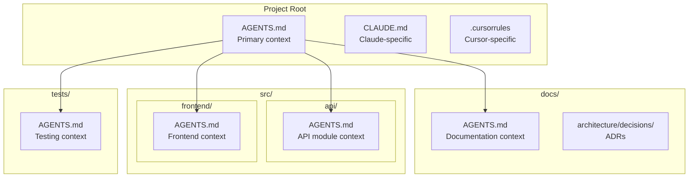
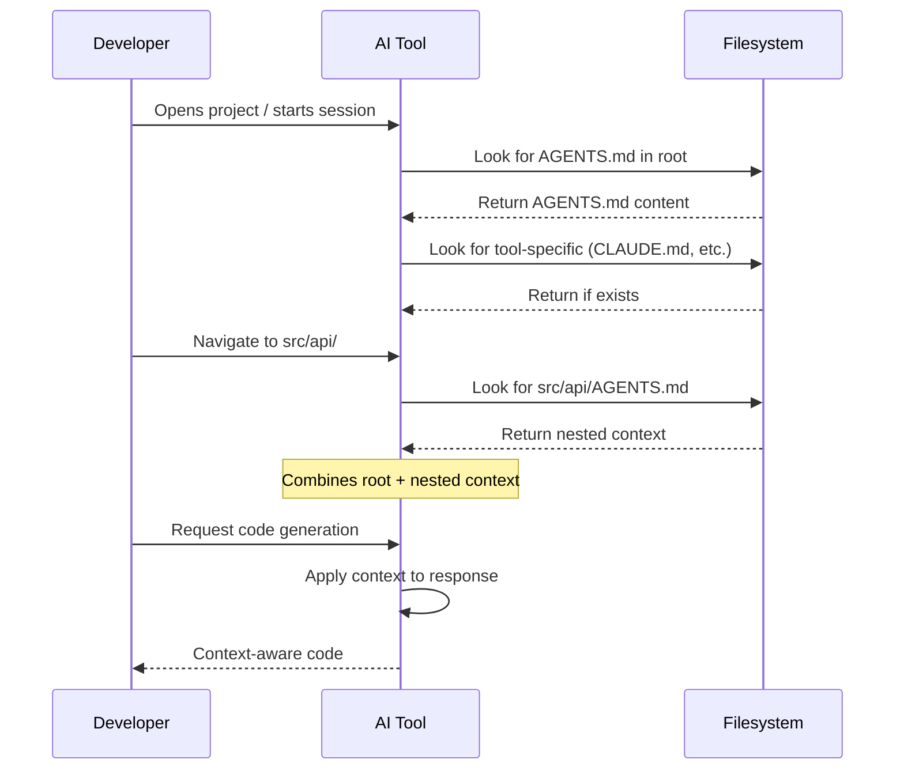
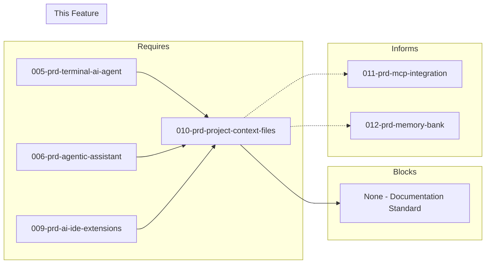

# 010-prd-project-context-files

> **Document Type:** Product Requirements Document  
> **Audience:** LLM agents, human reviewers  
> **Status:** Draft  
> **Last Updated:** 2025-01-23 <!-- @auto -->  
> **Owner:** Brian <!-- @human-required -->

---

## Review Tier Legend

| Marker | Tier | Speckit Behavior |
|--------|------|------------------|
| 🔴 `@human-required` | Human Generated | Prompt human to author; blocks until complete |
| 🟡 `@human-review` | LLM + Human Review | LLM drafts → prompt human to confirm/edit; blocks until confirmed |
| 🟢 `@llm-autonomous` | LLM Autonomous | LLM completes; no prompt; logged for audit |
| ⚪ `@auto` | Auto-generated | System fills (timestamps, links); no prompt |

---

## Document Completion Order

> ⚠️ **For LLM Agents:** Complete sections in this order. Do not fill downstream sections until upstream human-required inputs exist.

1. **Context** (Background, Scope) → requires human input first
2. **Problem Statement & User Story** → requires human input
3. **Requirements** (Must/Should/Could/Won't) → requires human input
4. **Technical Constraints** → human review
5. **Diagrams, Data Model, Interface** → LLM can draft after above exist
6. **Acceptance Criteria** → derived from requirements
7. **Everything else** → can proceed

---

## Context

### Background 🔴 `@human-required`

AI coding agents perform better when they understand project conventions, architecture decisions, coding standards, and domain context. Currently, developers must repeatedly explain the same project details in every AI session. A standardized system of context files provides persistent, structured information that AI agents can read automatically, improving response quality and reducing repetitive prompting.

This PRD defines the project context file strategy that works across all AI tools (Claude Code, Cline, Roo-Code, Continue, etc.) used in the containerized development environment.

<!-- 
MIGRATED FROM: Original Problem Statement
REVIEW: Add quantification? (e.g., "reduces context-setting from 5 minutes to 0 per session")
-->

### Scope Boundaries 🟡 `@human-review`

**In Scope:**
- Static project context files (AGENTS.md, CLAUDE.md, etc.)
- File naming conventions recognized by AI tools
- Content structure and templates
- Nested/directory-specific context files
- Integration with existing AI tools from 005, 006, 009

**Out of Scope:**
<!-- MIGRATED FROM: Won't Have section -->
- Runtime context injection — *covered in 011-prd-mcp-integration*
- Dynamic context based on current task — *covered in 012-prd-memory-bank*
- Proprietary formats locked to single tool — *cross-tool compatibility is a must*
- Auto-generation from codebase analysis — *Could Have, deferred*

### Glossary 🟡 `@human-review`

| Term | Definition |
|------|------------|
| AGENTS.md | Emerging industry standard context file (60k+ projects); read automatically by most AI coding tools |
| CLAUDE.md | Claude Code-specific context file; supplements AGENTS.md with Claude-specific instructions |
| .cursorrules | Cursor IDE-specific context file; legacy format, deprecated in favor of .mdc |
| ADR | Architecture Decision Record — documents architectural choices and rationale |
| Context file | Static file containing project information that AI agents read to understand codebase |
| Nested context | Directory-specific AGENTS.md files that provide module-level instructions |
| Memory Bank | Dynamic context system (PRD 012) that complements static context files |

### Related Documents ⚪ `@auto`

| Document | Link | Relationship |
|----------|------|--------------|
| Architecture Decision Record | 010-ard-project-context-files.md | Defines technical approach |
| Security Review | 010-sec-project-context-files.md | Risk assessment |
| Terminal AI Agent PRD | 005-prd-terminal-ai-agent.md | Consumer of context files |
| Agentic Assistant PRD | 006-prd-agentic-assistant.md | Consumer of context files |
| AI IDE Extensions PRD | 009-prd-ai-ide-extensions.md | Consumer of context files |
| MCP Integration PRD | 011-prd-mcp-integration.md | Related (runtime context) |
| Memory Bank PRD | 012-prd-memory-bank.md | Related (dynamic context) |

---

## Problem Statement 🔴 `@human-required`

AI coding agents perform better when they understand project conventions, architecture decisions, coding standards, and domain context. Currently, developers must repeatedly explain the same project details in every AI session. A standardized system of context files provides persistent, structured information that AI agents can read automatically, improving response quality and reducing repetitive prompting.

**Goal**: Define and implement a project context file strategy that works across all AI tools (Claude Code, Cline, Roo-Code, Continue, OpenCode, Cursor, etc.) used in the containerized development environment.

**Cost of not solving**: Developers waste time re-explaining project context in every AI session. AI-generated code doesn't follow project conventions, requiring manual cleanup. Inconsistent AI behavior across different tools and sessions.

### User Story 🔴 `@human-required`

> As a **developer using AI coding assistants**, I want **standardized project context files that all AI tools read automatically** so that **AI understands my project's conventions, patterns, and constraints without me explaining them every session**.

<!-- 
REVIEW: Secondary stories?
- As a team lead, I want consistent context files so all team members get consistent AI behavior
- As a new team member, I want to read AGENTS.md to quickly understand project conventions
-->

---

## Assumptions & Risks 🟡 `@human-review`

### Assumptions

- [A-1] AI coding tools will continue to adopt AGENTS.md as standard (currently 60k+ projects)
- [A-2] Markdown format remains parseable by all major AI tools
- [A-3] Developers will maintain context files as project evolves
- [A-4] AI tools read context files from predictable locations (project root, subdirectories)
- [A-5] Static context is sufficient for most project information (dynamic needs covered by MCP/Memory Bank)

### Risks

| ID | Risk | Likelihood | Impact | Mitigation |
|----|------|------------|--------|------------|
| R-1 | AGENTS.md standard fragments or competing standards emerge | Medium | Medium | Design for portability; content matters more than filename |
| R-2 | Context files become stale as project evolves | High | Medium | Include in PR checklist; periodic review process |
| R-3 | AI tools interpret context differently | Medium | Low | Test across tools; document tool-specific behaviors |
| R-4 | Context files become too large for AI context windows | Low | High | Keep concise; use nested files for module-specific detail |
| R-5 | Sensitive information accidentally included in context files | Medium | High | Security review; template excludes secrets |

---

## Feature Overview

### Context File Hierarchy 🟡 `@human-review`



### AI Tool Context Loading 🟡 `@human-review`



---

## Requirements

### Must Have (M) — MVP, launch blockers 🔴 `@human-required`

- [ ] **M-1:** System shall include root-level context file that all AI tools read automatically
- [ ] **M-2:** Context file shall document project description and goals
- [ ] **M-3:** Context file shall document coding standards and style guidelines
- [ ] **M-4:** Context file shall document technology stack and dependencies overview
- [ ] **M-5:** Context file shall use clear file naming convention that AI tools recognize (AGENTS.md)
- [ ] **M-6:** Context file shall use Markdown format for human readability and AI parsing
- [ ] **M-7:** Context files shall work with tools in PRD 005 (terminal agents), PRD 006 (agentic assistants), and PRD 009 (IDE extensions)

### Should Have (S) — High value, not blocking 🔴 `@human-required`

- [ ] **S-1:** System should support nested/directory-specific context files for module-level instructions
- [ ] **S-2:** Context files should integrate with Architecture Decision Records (ADRs)
- [ ] **S-3:** Context file shall document common patterns and anti-patterns
- [ ] **S-4:** Context file shall document testing conventions and requirements
- [ ] **S-5:** Context file shall document git workflow and commit message standards
- [ ] **S-6:** Context file shall document security considerations and constraints

### Could Have (C) — Nice to have, if time permits 🟡 `@human-review`

- [ ] **C-1:** System could include template generator for new projects
- [ ] **C-2:** System could include validation/linting for context files
- [ ] **C-3:** System could support version-specific context (different instructions for different branches)
- [ ] **C-4:** Context file could include tool-specific sections (Continue-specific, Claude-specific hints)
- [ ] **C-5:** System could integrate with Memory Bank pattern (PRD 012)
- [ ] **C-6:** System could auto-generate context from codebase analysis

### Won't Have (W) — Explicitly deferred 🟡 `@human-review`

- [ ] **W-1:** Runtime context injection — *Reason: Covered in 011-prd-mcp-integration*
- [ ] **W-2:** Dynamic context based on current task — *Reason: Covered in 012-prd-memory-bank*
- [ ] **W-3:** Proprietary formats locked to single tool — *Reason: Cross-tool compatibility is mandatory*

---

## Technical Constraints 🟡 `@human-review`

- **Format:** Markdown only; no proprietary formats
- **File Size:** Keep under 10KB per file to fit in AI context windows
- **Naming:** Primary file must be `AGENTS.md` (case-sensitive on Linux)
- **Location:** Root-level required; nested files optional
- **Encoding:** UTF-8
- **Line Endings:** LF (Unix-style)
- **Portability:** Must work across tools without modification

---

## Data Model (if applicable) 🟡 `@human-review`

### Recommended File Structure

```
project-root/
├── AGENTS.md                    # Primary context file (all tools read this)
├── CLAUDE.md                    # Claude Code specific (optional)
├── .cursorrules                 # Cursor specific (optional, legacy)
├── docs/
│   ├── architecture/
│   │   └── decisions/           # ADRs
│   └── AGENTS.md                # Docs-specific context (optional)
├── src/
│   ├── api/
│   │   └── AGENTS.md            # API module context (optional)
│   └── frontend/
│       └── AGENTS.md            # Frontend module context (optional)
└── tests/
    └── AGENTS.md                # Testing context (optional)
```

---

## Interface Contract (if applicable) 🟡 `@human-review`

### AGENTS.md Content Template

```markdown
# Project Context

## Overview
[Brief project description, goals, target users]

## Technology Stack
- Language: [e.g., Python 3.12, TypeScript 5.x]
- Framework: [e.g., FastAPI, Next.js]
- Database: [e.g., PostgreSQL, Redis]
- Infrastructure: [e.g., Docker, Kubernetes]

## Coding Standards
- [Style guide references]
- [Naming conventions]
- [File organization patterns]

## Architecture
- [High-level architecture description]
- [Key design patterns used]
- [Important boundaries and constraints]

## Common Patterns
- [Frequently used patterns with examples]
- [Anti-patterns to avoid]

## Testing Requirements
- [Test coverage expectations]
- [Testing frameworks and conventions]

## Git Workflow
- [Branch naming conventions]
- [Commit message format]
- [PR requirements]

## Security Considerations
- [Authentication/authorization patterns]
- [Data handling requirements]
- [Known constraints]

## AI Agent Instructions
- [Specific instructions for AI tools]
- [Preferences for code generation]
- [Things to always/never do]
```

### Minimal AGENTS.md Template

```markdown
# Project Context

## Overview
[One paragraph describing the project]

## Technology Stack
- Language: [primary language]
- Framework: [primary framework]

## Key Conventions
- [Most important convention 1]
- [Most important convention 2]
- [Most important convention 3]

## AI Instructions
- [Critical instruction for AI tools]
```

---

## Evaluation Criteria 🟡 `@human-review`

| Criterion | Weight | Metric | Target | Notes |
|-----------|--------|--------|--------|-------|
| Cross-tool compatibility | Critical | Tools recognizing file | All major tools | M-1, M-7 |
| Human readable | Critical | Developer comprehension | Easy to read/edit | M-6 |
| AI parseable | Critical | AI extracts information | Structured content works | M-6 |
| Industry adoption | High | Projects using standard | AGENTS.md (60k+) | M-5 |
| Simplicity | High | Time to create | <30 minutes | Quick start template |
| Flexibility | Medium | Project type coverage | All project types | Templates for each |
| Extensibility | Medium | Can add sections | Yes | Markdown allows it |

---

## Tool/Approach Candidates 🟡 `@human-review`

| Format | Adoption | Pros | Cons | Recommendation |
|--------|----------|------|------|----------------|
| AGENTS.md | High (60k+ projects) | Industry standard, most tools support, simple | Still evolving | **PRIMARY** |
| CLAUDE.md | Medium | Claude Code native, detailed | Claude-specific | Tool-specific supplement |
| .cursorrules | Medium | Cursor-native, documented | Cursor-only, deprecated | Legacy fallback |
| .github/copilot-instructions.md | Low | Copilot native | Copilot-only | Tool-specific if needed |
| Custom (PROJECT_CONTEXT.md) | N/A | Full control | No auto-recognition | **NOT RECOMMENDED** |

### Selected Approach 🔴 `@human-required`

> **Decision:** AGENTS.md as primary standard, with optional tool-specific supplements  
> **Rationale:** AGENTS.md has strongest industry adoption (60k+ projects including OpenAI repos), broadest tool support, and simple Markdown format. Tool-specific files (CLAUDE.md, .cursorrules) used only when additional tool-specific instructions are needed.

---

## Acceptance Criteria 🟡 `@human-review`

| AC ID | Requirement | Given | When | Then |
|-------|-------------|-------|------|------|
| AC-1 | M-1 | New project with AGENTS.md | I start Claude Code session | It reads and references the context |
| AC-2 | M-1, M-7 | AGENTS.md exists | I use Cline/Continue/Roo-Code | They incorporate the context |
| AC-3 | S-1 | Nested AGENTS.md in src/api/ | AI works in that directory | It reads both root and nested files |
| AC-4 | M-2, M-3, M-4 | Using the template | Developer creates context files | Completion takes under 30 minutes |
| AC-5 | M-3 | Context files document patterns | AI generates code | Code follows documented patterns |
| AC-6 | M-6 | AGENTS.md in project | Human reads it | Project context is clear and useful |
| AC-7 | M-1 | Updates to AGENTS.md | AI starts new session | Behavior reflects changes immediately |

### Edge Cases 🟢 `@llm-autonomous`

- [ ] **EC-1:** (M-1) When AGENTS.md is missing, then AI tools function without error (graceful degradation)
- [ ] **EC-2:** (S-1) When nested AGENTS.md conflicts with root, then nested takes precedence for that directory
- [ ] **EC-3:** (M-6) When AGENTS.md contains malformed Markdown, then AI still extracts usable content
- [ ] **EC-4:** (M-5) When filename case differs (agents.md vs AGENTS.md), then behavior is documented per tool

---

## Dependencies 🟡 `@human-review`



### Requires (must be complete before this PRD)

- **005-prd-terminal-ai-agent** — Terminal AI tools that will consume context files
- **006-prd-agentic-assistant** — Agentic tools that will consume context files
- **009-prd-ai-ide-extensions** — IDE extensions that will consume context files

<!-- 
REVIEW: Is this a hard dependency, or can context files be created before tools are configured?
The content is valuable even without automation. Consider making this a soft dependency.
-->

### Blocks (waiting on this PRD)

- None — this is a documentation standard

### Informs (decisions here affect future PRDs) 🔴 `@human-required`

| Open Item | Dependent PRD | What We Need | Working Assumption |
|-----------|---------------|--------------|-------------------|
| Static vs dynamic boundary | 011-prd-mcp-integration | What belongs in AGENTS.md vs MCP | AGENTS.md for stable context; MCP for runtime |
| Memory Bank integration | 012-prd-memory-bank | How dynamic context references static | Memory Bank reads AGENTS.md as baseline |

### External

- **AGENTS.md Specification** (agents.md) — Standard definition
- **AI Tool Vendors** — Ongoing support for AGENTS.md format

---

## Security Considerations 🟡 `@human-review`

| Aspect | Assessment | Notes |
|--------|------------|-------|
| Internet Exposure | No | Static files in repo |
| Sensitive Data | Risk — R-5 | Context files should NOT contain secrets |
| Authentication Required | N/A | Files are part of codebase |
| Security Review Required | Low | Template review; no runtime component |

### Security-Specific Requirements

- **SEC-1:** Context files must NOT contain API keys, passwords, or secrets
- **SEC-2:** Context files must NOT contain internal URLs or infrastructure details
- **SEC-3:** Template should include warning about sensitive data
- **SEC-4:** Consider .gitignore for any local-only context overrides

---

## Implementation Guidance 🟢 `@llm-autonomous`

### Suggested Approach

1. **Create minimal AGENTS.md** in container-dev-env project root
2. **Expand with full template** sections as needed
3. **Test with each AI tool** (Claude Code, Cline, Continue, Roo-Code)
4. **Add nested AGENTS.md** for complex modules only when needed
5. **Create tool-specific files** (CLAUDE.md) only if needed
6. **Include in project template** for new projects

### Bootstrap Script

```bash
#!/bin/bash
# Create minimal AGENTS.md for a project

cat > AGENTS.md << 'EOF'
# Project Context

## Overview
[Describe your project in one paragraph]

## Technology Stack
- Language: 
- Framework: 
- Database: 

## Key Conventions
- 
- 
- 

## AI Instructions
- Follow existing code patterns
- Write tests for new functionality
- Use descriptive variable names
EOF

echo "Created AGENTS.md - edit to add project-specific context"
```

### Anti-patterns to Avoid

- **Overloading context file** — Keep under 10KB; use nested files for detail
- **Including secrets** — Never put API keys, passwords, or internal URLs
- **Tool-specific instructions in AGENTS.md** — Use CLAUDE.md, .cursorrules for tool-specific content
- **Stale context** — Include in PR review checklist; update when architecture changes
- **Duplicating ADRs** — Reference ADRs, don't copy content

### Reference Examples

- [AGENTS.md Specification](https://agents.md/)
- [OpenAI repos using AGENTS.md](https://github.com/search?q=filename%3AAGENTS.md)
- Spike results: `spikes/010-project-context-files/`

---

## Spike Tasks 🟡 `@human-review`

### Template Creation

- [ ] Create full AGENTS.md template with all recommended sections
- [ ] Create minimal AGENTS.md template for quick start
- [ ] Create CLAUDE.md template for Claude Code specific instructions
- [ ] Create example nested AGENTS.md for modules
- [ ] Document when to use each section

### Validation & Tooling

- [ ] Create markdown linter rules for AGENTS.md structure
- [ ] Create VS Code snippet for quick section creation
- [ ] Document how each AI tool reads context files
- [ ] Test context file recognition across all tools (Claude Code, Cline, Continue, Roo-Code, OpenCode)

### Integration

- [ ] Add AGENTS.md to container-dev-env project as example
- [ ] Document relationship with ADRs
- [ ] Document relationship with Memory Bank (PRD 012)
- [ ] Create onboarding guide for new projects

---

## Success Metrics 🔴 `@human-required`

| Metric | Baseline | Target | Measurement Method |
|--------|----------|--------|-------------------|
| Context setup time | ~5 min/session | 0 min/session | Developer survey |
| AI code convention adherence | Baseline TBD | >80% follows conventions | Code review sampling |
| Context file adoption | 0 projects | 100% of new projects | Repo audit |

### Technical Verification 🟢 `@llm-autonomous`

| Metric | Target | Verification Method |
|--------|--------|---------------------|
| Tool recognition rate | 100% of supported tools | Manual test matrix |
| Template creation time | <30 minutes | Timed walkthrough |
| File size | <10KB per file | Automated check |

---

## Definition of Ready 🔴 `@human-required`

### Readiness Checklist

- [x] Problem statement reviewed and validated by stakeholder
- [x] All Must Have requirements have acceptance criteria
- [x] Technical constraints are explicit and agreed
- [ ] Dependencies identified and owners confirmed
- [ ] Forward dependencies tracked (Informs table complete if questions deferred)
- [ ] Security review completed (or N/A documented with justification)
- [x] No open questions blocking implementation (deferred with working assumptions = OK)

### Sign-off

| Role | Name | Date | Decision |
|------|------|------|----------|
| Product Owner | | | [ ] Ready / [ ] Not Ready |

---

## Changelog ⚪ `@auto`

| Version | Date | Author | Changes |
|---------|------|--------|---------|
| 0.1 | 2025-01-XX | Brian | Initial draft |
| 0.2 | 2025-01-23 | Claude | Migrated to PRD template v3 format |

---

## Decision Log 🟡 `@human-review`

| Date | Decision | Rationale | Alternatives Considered |
|------|----------|-----------|------------------------|
| 2025-01-XX | Selected AGENTS.md as primary format | 60k+ project adoption, cross-tool support, simple Markdown | Custom format (no recognition), tool-specific only (fragmented) |
| 2025-01-XX | Support nested AGENTS.md | Allows module-specific context without bloating root file | Single file only (doesn't scale), separate naming (confusing) |
| 2025-01-XX | Keep tool-specific files optional | AGENTS.md covers most needs; supplements only when necessary | Require all formats (maintenance burden), single format only (loses features) |

---

## Open Questions 🟡 `@human-review`

- [x] **Q1:** Which context file format has best cross-tool support?
  > **Resolved:** AGENTS.md with 60k+ project adoption. See Decision Log.

- [ ] **Q2:** How should AGENTS.md integrate with Memory Bank (PRD 012)?
  > **Deferred to:** 012-prd-memory-bank
  > **Working assumption:** Memory Bank reads AGENTS.md as baseline static context; dynamic context layered on top.

- [ ] **Q3:** Should there be a validation/linting tool for AGENTS.md?
  > **Deferred to:** C-2 (Could Have)
  > **Working assumption:** Markdown linting sufficient initially; custom validation if adoption grows.

---

## Review Checklist 🟢 `@llm-autonomous`

Before marking as Approved:

- [x] All requirements have unique IDs (M-1, S-2, etc.)
- [x] All Must Have requirements have linked acceptance criteria
- [x] Glossary terms are used consistently throughout
- [x] Diagrams use terminology from Glossary
- [x] Security considerations documented (or N/A justified)
- [ ] Definition of Ready checklist is complete
- [x] No open questions blocking implementation (deferred questions with working assumptions are OK)
- [x] Forward dependencies tracked in Informs table (if any questions deferred to future PRDs)

---

## References

- [AGENTS.md Specification](https://agents.md/)
- [AGENTS.md GitHub](https://github.com/agentsmd/agents.md)
- [Keep AGENTS.md in Sync](https://kau.sh/blog/agents-md/)
- [Improve AI Output with AGENTS.md](https://www.builder.io/blog/agents-md)
- [Mastering Project Context Files](https://eclipsesource.com/blogs/2025/11/20/mastering-project-context-files-for-ai-coding-agents/)
- [Cursor Rules Documentation](https://cursor.com/docs/context/rules)
