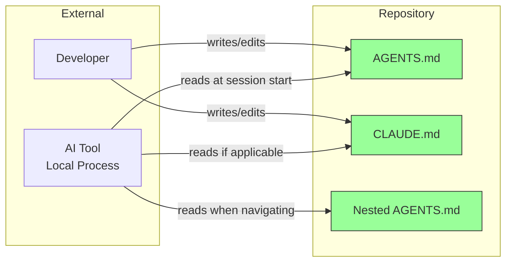
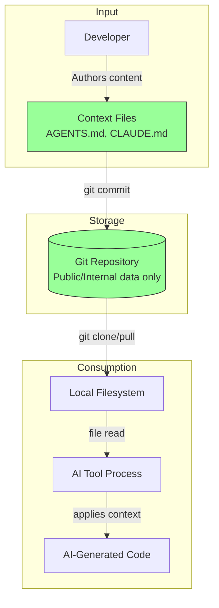
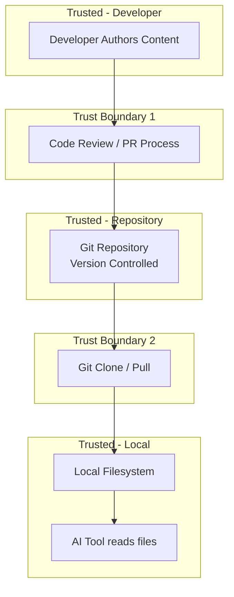

# 010-sec-project-context-files

> **Document Type:** Security Review (Lightweight)
> **Audience:** LLM agents, human reviewers
> **Status:** Draft
> **Last Updated:** 2026-01-23 <!-- @auto -->
> **Reviewer:** Brian <!-- @human-required -->
> **Risk Level:** Low <!-- @human-required -->

---

## Review Tier Legend

| Marker | Tier | Speckit Behavior |
|--------|------|------------------|
| 🔴 `@human-required` | Human Generated | Prompt human to author; blocks until complete |
| 🟡 `@human-review` | LLM + Human Review | LLM drafts → prompt human to confirm/edit; blocks until confirmed |
| 🟢 `@llm-autonomous` | LLM Autonomous | LLM completes; no prompt; logged for audit |
| ⚪ `@auto` | Auto-generated | System fills (timestamps, links); no prompt |

---

## Severity Definitions

| Level | Label | Definition |
|-------|-------|------------|
| 🔴 | **Critical** | Immediate exploitation risk; data breach or system compromise likely |
| 🟠 | **High** | Significant risk; exploitation possible with moderate effort |
| 🟡 | **Medium** | Notable risk; exploitation requires specific conditions |
| 🟢 | **Low** | Minor risk; limited impact or unlikely exploitation |

---

## Linkage ⚪ `@auto`

| Document | ID | Relationship |
|----------|-----|--------------|
| Parent PRD | 010-prd-project-context-files.md | Feature being reviewed |
| Architecture Decision Record | 010-ard-project-context-files.md | Technical implementation |

---

## Purpose

This is a **lightweight security review** intended to catch obvious security concerns early in the product lifecycle. It is NOT a comprehensive threat model. Full threat modeling should occur during implementation when infrastructure-as-code and concrete implementations exist.

**This review answers three questions:**
1. What does this feature expose to attackers?
2. What data does it touch, and how sensitive is that data?
3. What's the impact if something goes wrong?

**Scope of this review:**
- ✅ Attack surface identification
- ✅ Data classification
- ✅ High-level CIA assessment
- ❌ Detailed threat enumeration (deferred to implementation)
- ❌ Penetration testing (deferred to implementation)
- ❌ Compliance audit (separate process)

---

## Feature Security Summary

### One-line Summary 🔴 `@human-required`
> Static Markdown files committed to version control that provide project context to AI coding tools — no runtime component, no network exposure, no authentication surface.

### Risk Assessment 🔴 `@human-required`
> **Risk Level:** Low
> **Justification:** Feature consists entirely of static text files in version control with no runtime execution, no network endpoints, and no data processing. Primary risk is accidental inclusion of secrets in committed files.

---

## Attack Surface Analysis

### Exposure Points 🟡 `@human-review`

| Exposure Type | Details | Authentication | Authorization | Notes |
|---------------|---------|----------------|---------------|-------|
| **None** | **Feature has no external exposure** | — | — | Static files in git repository; no network endpoints, no runtime processing |

### Attack Surface Diagram 🟢 `@llm-autonomous`

### Exposure Checklist 🟢 `@llm-autonomous`

Quick validation of common exposure risks:

- [x] **Internet-facing endpoints require authentication** — N/A, no endpoints
- [x] **No sensitive data in URL parameters** — N/A, no URLs/endpoints
- [x] **File uploads validated** — N/A, no file uploads
- [x] **Rate limiting configured** — N/A, no endpoints
- [x] **CORS policy is restrictive** — N/A, no web service
- [x] **No debug/admin endpoints exposed** — N/A, no endpoints
- [x] **Webhooks validate signatures** — N/A, no webhooks

---

## Data Flow Analysis

### Data Inventory 🟡 `@human-review`

| Data Element | PRD Entity | Classification | Source | Destination | Retention | Encrypted Rest | Encrypted Transit | Residency |
|--------------|------------|----------------|--------|-------------|-----------|----------------|-------------------|-----------|
| Project description | AGENTS.md content | Public | Developer authored | Git repository | Indefinite (version controlled) | No (plain text) | Yes (git over SSH/HTTPS) | Any |
| Coding standards | AGENTS.md content | Public | Developer authored | Git repository | Indefinite (version controlled) | No (plain text) | Yes (git over SSH/HTTPS) | Any |
| Technology stack info | AGENTS.md content | Internal | Developer authored | Git repository | Indefinite (version controlled) | No (plain text) | Yes (git over SSH/HTTPS) | Any |
| AI tool instructions | CLAUDE.md content | Internal | Developer authored | Git repository | Indefinite (version controlled) | No (plain text) | Yes (git over SSH/HTTPS) | Any |
| Architecture references | AGENTS.md links | Public | Developer authored | Git repository | Indefinite (version controlled) | No (plain text) | Yes (git over SSH/HTTPS) | Any |

### Data Classification Reference 🟢 `@llm-autonomous`

| Level | Label | Description | Examples | Handling Requirements |
|-------|-------|-------------|----------|----------------------|
| 1 | **Public** | No impact if disclosed | Marketing content, public docs | No special handling |
| 2 | **Internal** | Minor impact if disclosed | Internal configs, non-sensitive logs | Access controls, no public exposure |
| 3 | **Confidential** | Significant impact if disclosed | PII, user data, credentials | Encryption, audit logging, access controls |
| 4 | **Restricted** | Severe impact if disclosed | Payment data, health records, secrets | Encryption, strict access, compliance requirements |

### Data Flow Diagram 🟢 `@llm-autonomous`

### Data Handling Checklist 🟢 `@llm-autonomous`

- [x] **No Restricted data stored unless absolutely required** — No restricted data in context files
- [x] **Confidential data encrypted at rest** — N/A, no confidential data should be present
- [x] **All data encrypted in transit (TLS 1.2+)** — Git transport handles this
- [x] **PII has defined retention policy** — N/A, no PII in context files
- [x] **Logs do not contain Confidential/Restricted data** — N/A, no logging
- [x] **Secrets are not hardcoded** — Template explicitly warns against including secrets
- [x] **Data minimization applied** — Template guides minimal necessary context
- [x] **Data residency requirements documented** — N/A, no regulated data

---

## Third-Party & Supply Chain 🟡 `@human-review`

### New External Services

| Service | Purpose | Data Shared | Communication | Approved? |
|---------|---------|-------------|---------------|-----------|
| None | Feature introduces no new external services | — | — | — |

### New Libraries/Dependencies

| Library | Version | License | Purpose | Security Check |
|---------|---------|---------|---------|----------------|
| None | — | — | Feature introduces no new dependencies | — |

### Supply Chain Checklist

- [x] **All new services use encrypted communication** — N/A, no new services
- [x] **Service agreements/ToS reviewed** — N/A, no new services
- [x] **Dependencies have acceptable licenses** — N/A, no new dependencies
- [x] **Dependencies are actively maintained** — N/A, no new dependencies
- [x] **No known critical vulnerabilities** — N/A, no new dependencies

---

## CIA Impact Assessment

If this feature is compromised, what's the impact?

### Confidentiality 🟡 `@human-review`

> **What could be disclosed?**

| Asset at Risk | Classification | Exposure Scenario | Impact | Likelihood |
|---------------|----------------|-------------------|--------|------------|
| Project conventions | Internal | Repository becomes public unexpectedly | Low | Low |
| Technology stack details | Internal | Repository access compromised | Low | Low |
| Accidentally included secrets | Restricted | Developer puts API key in AGENTS.md | High | Medium |

**Confidentiality Risk Level:** Low (assuming secrets are not included per template guidelines)

### Integrity 🟡 `@human-review`

> **What could be modified or corrupted?**

| Asset at Risk | Modification Scenario | Impact | Likelihood |
|---------------|----------------------|--------|------------|
| Context file content | Malicious PR injects bad instructions | Medium | Low |
| AI tool behavior | Tampered AGENTS.md causes AI to produce insecure code | Medium | Low |

**Integrity Risk Level:** Low (standard code review process mitigates)

### Availability 🟡 `@human-review`

> **What could be disrupted?**

| Service/Function | Disruption Scenario | Impact | Likelihood |
|------------------|---------------------|--------|------------|
| AI context loading | AGENTS.md deleted or corrupted | Low | Low |
| Developer workflow | Context files become stale/misleading | Low | Medium |

**Availability Risk Level:** Low (AI tools function without context files per EC-1)

### CIA Summary 🟢 `@llm-autonomous`

| Dimension | Risk Level | Primary Concern | Mitigation Priority |
|-----------|------------|-----------------|---------------------|
| **Confidentiality** | Low | Accidental secret inclusion | Medium |
| **Integrity** | Low | Malicious context injection via PR | Low |
| **Availability** | Low | Stale/deleted context files | Low |

**Overall CIA Risk:** Low — Static text files with no runtime component; primary concern is accidental secret inclusion which is addressed by template warnings and code review.

---

## Trust Boundaries 🟡 `@human-review`

Where does trust change in this feature?

### Trust Boundary Checklist 🟢 `@llm-autonomous`

- [x] **All input from untrusted sources is validated** — Content goes through code review (PR process)
- [x] **External API responses are validated** — N/A, no external APIs
- [x] **Authorization checked at data access, not just entry point** — N/A, standard git access controls
- [x] **Service-to-service calls are authenticated** — N/A, no service communication

---

## Known Risks & Mitigations 🟡 `@human-review`

| ID | Risk Description | Severity | Mitigation | Status | Owner |
|----|------------------|----------|------------|--------|-------|
| R1 | Secrets accidentally committed in context files | 🟡 Medium | Template includes explicit warning; pre-commit hooks can scan for secrets; code review process | Open | Brian |
| R2 | Internal infrastructure URLs exposed in context files | 🟢 Low | Template warns against including internal URLs; code review | Open | Brian |
| R3 | Malicious context injection via compromised PR | 🟢 Low | Standard code review process; context files are human-readable and auditable | Mitigated | Brian |
| R4 | AI tool interprets context as executable instructions | 🟢 Low | Context files are informational only; AI tools treat as guidance not commands | Mitigated | — |

### Risk Acceptance 🔴 `@human-required`

| Risk ID | Accepted By | Date | Justification | Review Date |
|---------|-------------|------|---------------|-------------|
| R1 | Brian | 2026-01-23 | Low likelihood with template warnings and code review; no runtime execution path | 2026-07-23 |

---

## Security Requirements 🟡 `@human-review`

Based on this review, the implementation MUST satisfy:

### Authentication & Authorization

| Req ID | Requirement | PRD AC | Verification Method |
|--------|-------------|--------|---------------------|
| — | N/A — no auth surface | — | — |

### Data Protection

| Req ID | Requirement | PRD AC | Verification Method |
|--------|-------------|--------|---------------------|
| SEC-1 | Context files must NOT contain API keys, passwords, or secrets | — | Code review; optional pre-commit hook |
| SEC-2 | Context files must NOT contain internal URLs or infrastructure details | — | Code review |
| SEC-3 | Template must include explicit warning about sensitive data | AC-4 | Template review |

### Input Validation

| Req ID | Requirement | PRD AC | Verification Method |
|--------|-------------|--------|---------------------|
| — | N/A — no user input processing | — | — |

### Operational Security

| Req ID | Requirement | PRD AC | Verification Method |
|--------|-------------|--------|---------------------|
| SEC-4 | Local-only context overrides (if any) must be in .gitignore | — | Repository config review |

---

## Compliance Considerations 🟡 `@human-review`

Does this feature have regulatory implications?

| Regulation | Applicable? | Relevant Requirements | N/A Justification |
|------------|-------------|----------------------|-------------------|
| GDPR | N/A | — | No personal data collected or processed |
| CCPA | N/A | — | No personal data collected or processed |
| SOC 2 | N/A | — | No runtime system; static documentation files |
| HIPAA | N/A | — | No health information involved |
| PCI-DSS | N/A | — | No payment data involved |
| Other | N/A | — | Feature is static text files with no data processing |

---

## Review Findings

### Issues Identified 🟡 `@human-review`

| ID | Finding | Severity | Category | Recommendation | Status |
|----|---------|----------|----------|----------------|--------|
| F1 | No automated mechanism prevents secrets from being committed in context files | 🟢 Low | Data | Consider adding a pre-commit hook (e.g., detect-secrets, gitleaks) to scan AGENTS.md and CLAUDE.md for potential secrets | Open |
| F2 | Context files could include architecture details useful for targeted attacks if repo is public | 🟢 Low | Exposure | Template should guide users to keep architecture details high-level; avoid specific version numbers of infrastructure components | Open |

### Positive Observations 🟢 `@llm-autonomous`

- No runtime component eliminates entire classes of vulnerabilities (injection, DoS, authentication bypass)
- Markdown format is inert — cannot execute code or make network requests
- Version control provides full audit trail of all changes to context files
- Template explicitly warns against including secrets (PRD SEC-1, SEC-2, SEC-3)
- Graceful degradation design means missing/corrupted files don't break anything
- Standard code review process provides human oversight of all context file changes

---

## Open Questions 🟡 `@human-review`

- [ ] **Q1:** Should a pre-commit hook be mandatory or recommended for secret scanning in context files?
- [ ] **Q2:** For public repositories, should there be guidance on what level of architecture detail is appropriate in AGENTS.md?

---

## Changelog ⚪ `@auto`

| Version | Date | Author | Changes |
|---------|------|--------|---------|
| 0.1 | 2026-01-23 | Claude | Initial review drafted from PRD |

---

## Review Sign-off 🔴 `@human-required`

| Role | Name | Date | Decision |
|------|------|------|----------|
| Security Reviewer | | | [ ] Approved / [ ] Approved with conditions / [ ] Rejected |
| Feature Owner | Brian | | [ ] Acknowledged |

### Conditions for Approval (if applicable) 🔴 `@human-required`

- [ ] Template includes explicit warning about not including secrets
- [ ] Pre-commit hook recommendation is documented (even if not enforced)

---

## Security Requirements Traceability 🟢 `@llm-autonomous`

| SEC Req ID | PRD Req ID | PRD AC ID | Test Type | Test Location |
|------------|------------|-----------|-----------|---------------|
| SEC-1 | — | — | Code Review | PR review checklist |
| SEC-2 | — | — | Code Review | PR review checklist |
| SEC-3 | M-6 | AC-4 | Manual | Template inspection |
| SEC-4 | — | — | Config Review | .gitignore inspection |

---

## Review Checklist 🟢 `@llm-autonomous`

Before marking as Approved:
- [x] Attack surface documented with auth/authz status for each exposure
- [x] Exposure Points table has no contradictory rows (only "None" row, no endpoints exist)
- [x] All PRD Data Model entities appear in Data Inventory
- [x] All data elements are classified using the 4-tier model
- [x] Third-party dependencies and services are listed (none)
- [x] CIA impact is assessed with Low/Medium/High ratings
- [x] Trust boundaries are identified
- [x] Security requirements have verification methods specified
- [x] Security requirements trace to PRD ACs where applicable
- [x] No Critical/High findings remain Open
- [x] Compliance N/A items have justification
- [ ] Risk acceptance has named approver and review date
