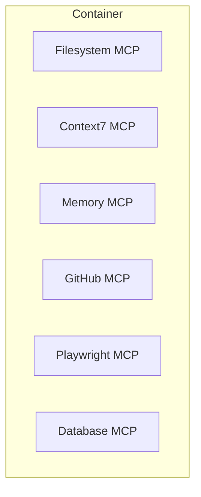
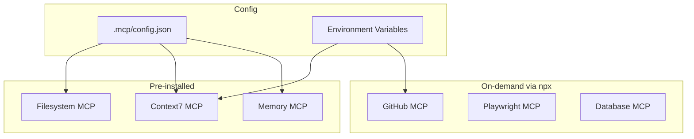
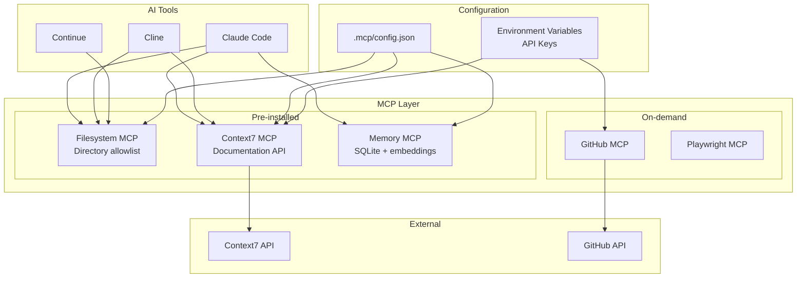
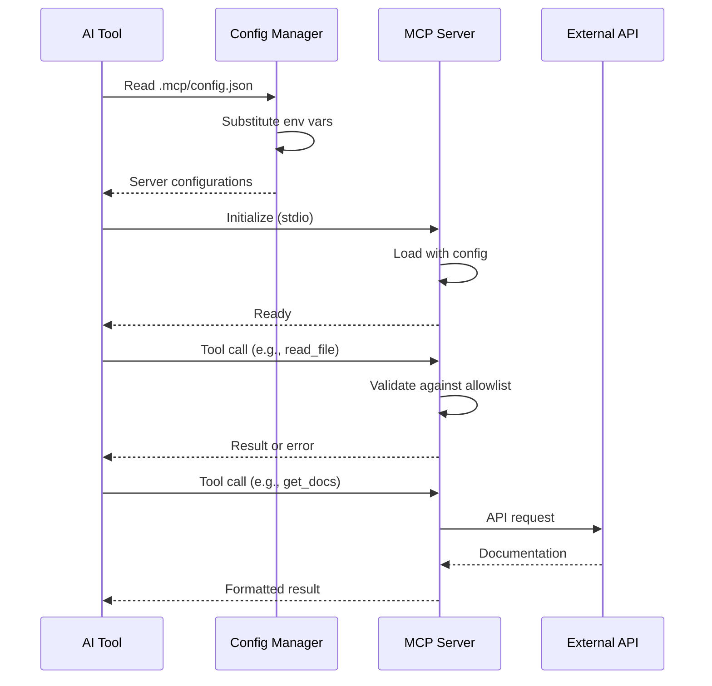
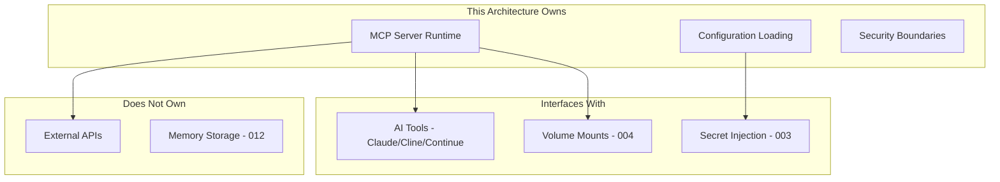

# 011-ard-mcp-integration

> **Document Type:** Architecture Decision Record  
> **Audience:** LLM agents, human reviewers  
> **Status:** Accepted  
> **Last Updated:** 2026-01-23 <!-- @auto -->  
> **Owner:** Brian <!-- @human-required -->  
> **Deciders:** Brian <!-- @human-required -->

---

## Review Tier Legend

| Marker | Tier | Speckit Behavior |
|--------|------|------------------|
| 🔴 `@human-required` | Human Generated | Prompt human to author; blocks until complete |
| 🟡 `@human-review` | LLM + Human Review | LLM drafts → prompt human to confirm/edit; blocks until confirmed |
| 🟢 `@llm-autonomous` | LLM Autonomous | LLM completes; no prompt; logged for audit |
| ⚪ `@auto` | Auto-generated | System fills (timestamps, links); no prompt |

---

## Linkage ⚪ `@auto`

| Document | ID | Relationship |
|----------|-----|--------------|
| Parent PRD | 011-prd-mcp-integration.md | Requirements this architecture satisfies |
| Security Review | 011-sec-mcp-integration.md | Security implications of this decision |
| Supersedes | — | N/A (greenfield) |
| Superseded By | — | — |

---

## Summary

### Decision 🔴 `@human-required`
> Use stdio-based MCP servers running within the container, with core servers pre-installed and optional servers available via npx on-demand.

### TL;DR for Agents 🟡 `@human-review`
> MCP servers extend AI agent capabilities via the Model Context Protocol. Core servers (Filesystem, Context7, Memory) are pre-installed in the Dockerfile. Optional servers (GitHub, Playwright) run via npx to minimize image size. All configuration uses JSON with environment variable substitution for credentials. Filesystem MCP MUST use directory allowlisting—never allow full filesystem access.

---

## Context

### Problem Space 🔴 `@human-required`
AI coding agents need access to external tools, data sources, and documentation to be effective. The Model Context Protocol (MCP) provides a standardized interface, but we must decide which servers to include, how to deploy them in containers, and how to manage credentials securely.

### Decision Scope 🟡 `@human-review`

**This ARD decides:**
- Which MCP servers to pre-install vs. make available on-demand
- How MCP servers are deployed and configured within containers
- Credential management approach for MCP servers
- Security boundaries for filesystem access

**This ARD does NOT decide:**
- Specific MCP server configurations for individual projects (project-level config)
- Custom MCP server development patterns (deferred to future ARD)
- Memory persistence strategy (decided in 012-ard-persistent-memory)

### Current State 🟢 `@llm-autonomous`
N/A - greenfield implementation. No MCP infrastructure currently exists in the containerized development environment.

### Driving Requirements 🟡 `@human-review`

| PRD Req ID | Requirement Summary | Architectural Implication |
|------------|---------------------|---------------------------|
| M-1 | MCP server runtime within container | Servers must use stdio transport (container-compatible) |
| M-2 | Configuration via env vars or config files | JSON config with ${VAR} substitution |
| M-3 | Filesystem MCP with directory allowlisting | Security boundary enforcement required |
| M-4 | Context7 MCP for documentation | External API access required |
| M-5 | Works with Claude Code, Cline, Continue | Standard MCP protocol compliance |
| M-6 | Secure credential handling | Environment variables only, never in config |
| S-1 | Pre-configured common servers | Balance image size vs. convenience |

**PRD Constraints inherited:**
- From PRD Technical Constraints: stdio transport only, npm/npx available
- Non-functional: Servers must not significantly impact container startup time

---

## Decision Drivers 🔴 `@human-required`

1. **Security:** Filesystem access must be sandboxed; credentials must not leak *(traces to M-3, M-6)*
2. **Container Size:** Minimize Docker image bloat from npm packages *(operational concern)*
3. **Startup Time:** Core functionality available immediately without npm downloads *(UX)*
4. **Flexibility:** Support for additional MCP servers without image rebuild *(traces to S-1)*
5. **Compatibility:** Work with all major AI tools (Claude Code, Cline, Continue) *(traces to M-5)*

---

## Options Considered 🟡 `@human-review`

### Option 0: No MCP Support

**Description:** Don't include MCP infrastructure; AI agents work with built-in capabilities only.

| Driver | Rating | Notes |
|--------|--------|-------|
| Security | ✅ Good | No additional attack surface |
| Container Size | ✅ Good | No additional packages |
| Flexibility | ❌ Poor | Agents cannot access external tools/docs |
| Compatibility | ❌ Poor | Missing key AI agent features |

**Why not viable:** AI agents without MCP have severely limited capabilities—cannot access documentation, cannot interact with external services, cannot maintain memory across sessions.

---

### Option 1: All Servers Pre-installed

**Description:** Install all MCP servers globally in Dockerfile.



| Driver | Rating | Notes |
|--------|--------|-------|
| Security | ⚠️ Medium | More packages = larger attack surface |
| Container Size | ❌ Poor | ~500MB+ additional packages |
| Startup Time | ✅ Good | All servers ready immediately |
| Flexibility | ⚠️ Medium | Adding new servers requires rebuild |

**Pros:**
- All servers immediately available
- No network dependency at runtime

**Cons:**
- Large image size
- Unused servers waste space
- Security surface increased

---

### Option 2: Core Pre-installed + Optional via npx (Selected)

**Description:** Pre-install essential servers; others available on-demand via npx.



| Driver | Rating | Notes |
|--------|--------|-------|
| Security | ✅ Good | Minimal pre-installed surface |
| Container Size | ✅ Good | ~100MB for core servers |
| Startup Time | ✅ Good | Core servers ready; optional on first use |
| Flexibility | ✅ Good | Any MCP server via npx |
| Compatibility | ✅ Good | Standard MCP protocol |

**Pros:**
- Balanced image size
- Core functionality always available
- Easy to add new servers
- Security-conscious default

**Cons:**
- First-use delay for optional servers
- Requires network for npx servers

---

### Option 3: All via npx (No Pre-install)

**Description:** No pre-installed servers; all run via npx on-demand.

| Driver | Rating | Notes |
|--------|--------|-------|
| Security | ✅ Good | Minimal base image |
| Container Size | ✅ Good | No MCP packages in image |
| Startup Time | ❌ Poor | Every server needs npm download |
| Flexibility | ✅ Good | Any server available |

**Pros:**
- Smallest possible image
- Maximum flexibility

**Cons:**
- Poor first-run experience
- Network dependency for all MCP
- Repeated downloads if cache cleared

---

## Decision

### Selected Option 🔴 `@human-required`
> **Option 2: Core Pre-installed + Optional via npx**

### Rationale 🔴 `@human-required`

This option provides the best balance of security, performance, and flexibility:

1. **Core servers (Filesystem, Context7, Memory) are used in nearly every session** — pre-installing avoids repeated downloads and ensures immediate availability
2. **Optional servers (GitHub, Playwright, Database) are situational** — npx keeps image lean while maintaining availability
3. **Security is maintained** through directory allowlisting and credential isolation
4. **Compatibility** achieved through standard MCP stdio protocol

#### Simplest Implementation Comparison 🟡 `@human-review`

| Aspect | Simplest Possible | Selected Option | Justification for Complexity |
|--------|-------------------|-----------------|------------------------------|
| Servers | Single server (Filesystem) | 3 pre-installed + npx | Context7 essential for docs (M-4); Memory needed for 012 |
| Config | Hardcoded paths | JSON + env var substitution | Credential security (M-6) requires env vars |
| Security | Full filesystem access | Directory allowlisting | Security requirement (M-3) |

**Complexity justified by:** PRD requires multiple MCP capabilities (filesystem, documentation, memory) with secure credential handling. The selected approach adds minimal complexity while meeting all Must Have requirements.

### Architecture Diagram 🟡 `@human-review`



---

## Technical Specification

### Component Overview 🟡 `@human-review`

| Component | Responsibility | Interface | Dependencies |
|-----------|---------------|-----------|--------------|
| Filesystem MCP | File read/write/list/search | stdio (MCP) | None |
| Context7 MCP | Library documentation lookup | stdio (MCP) | Context7 API, CONTEXT7_API_KEY |
| Memory MCP | Persistent context storage | stdio (MCP) | SQLite, volume mount |
| GitHub MCP | GitHub API operations | stdio (MCP) | GitHub API, GITHUB_TOKEN |
| Playwright MCP | Browser automation | stdio (MCP) | Chromium (headless) |
| Config Manager | Load and validate config | File read | .mcp/config.json |

### Data Flow 🟢 `@llm-autonomous`



### Interface Definitions 🟡 `@human-review`

```json
// .mcp/config.json schema
{
  "servers": {
    "<server-name>": {
      "command": "string",           // e.g., "npx" or global command
      "args": ["string"],            // Command arguments
      "env": {                       // Environment variables
        "<VAR>": "${ENV_VAR}"        // Substitution syntax
      },
      "enabled": "boolean"           // Enable/disable toggle
    }
  }
}
```

### Key Algorithms/Patterns 🟡 `@human-review`

**Pattern:** Environment Variable Substitution
```
1. Load config.json
2. For each env value matching ${VAR_NAME}:
   a. Look up VAR_NAME in process environment
   b. Replace ${VAR_NAME} with actual value
   c. If not found, log warning (don't fail)
3. Pass resolved config to MCP server
```

**Pattern:** Directory Allowlist Enforcement
```
1. Receive file operation request with path
2. Resolve path to absolute (handle .., symlinks)
3. Check if resolved path starts with any allowed directory
4. If not allowed, return permission denied error
5. If allowed, proceed with operation
```

---

## Constraints & Boundaries

### Technical Constraints 🟡 `@human-review`

**Inherited from PRD:**
- MCP servers must use stdio transport (container-compatible)
- Configuration via environment variables for credentials
- Must work with Claude Code, Cline, Continue

**Added by this Architecture:**
- **Pre-installed servers:** Filesystem, Context7, Memory only
- **Package versions:** Pin to specific versions in Dockerfile
- **Config location:** .mcp/config.json in workspace root
- **Allowlist default:** /workspace only for Filesystem MCP

### Architectural Boundaries 🟡 `@human-review`



- **Owns:** MCP server lifecycle, configuration parsing, security enforcement
- **Interfaces With:** AI tools (consumers), Secret Injection (003), Volumes (004)
- **Must Not Touch:** External API implementations, Memory persistence strategy (012)

### Implementation Guardrails 🟡 `@human-review`

> ⚠️ **Critical for LLM Agents:**

- [ ] **DO NOT** allow Filesystem MCP access outside /workspace without explicit config *(M-3)*
- [ ] **DO NOT** hardcode API keys in config.json *(M-6)*
- [ ] **DO NOT** install optional MCP servers in Dockerfile *(image size)*
- [ ] **MUST** use ${VAR} syntax for all credentials in config *(M-6)*
- [ ] **MUST** validate directory allowlist on every file operation *(M-3)*
- [ ] **MUST** log MCP server startup/failure for debugging

---

## Consequences 🟡 `@human-review`

### Positive
- AI agents gain access to documentation, files, and external services
- Minimal image size impact (~100MB for core servers)
- Secure credential handling via environment variables
- Flexible addition of new MCP servers without rebuild

### Negative
- First-use delay for optional npx servers (~5-10s)
- Network dependency for Context7 and npx servers
- Configuration complexity (JSON + env vars)

### Risks & Mitigations

| Risk | Likelihood | Impact | Mitigation |
|------|------------|--------|------------|
| Filesystem escape via path traversal | Low | Critical | Strict allowlist validation, resolve symlinks |
| API key exposure in logs | Medium | High | Never log config values; mask in error messages |
| Context7 API outage | Low | Medium | Graceful degradation; cache responses if possible |
| npx download failure | Low | Low | Retry with backoff; clear instructions in error |

---

## Implementation Guidance

### Suggested Implementation Order 🟢 `@llm-autonomous`
1. Add MCP server packages to Dockerfile (Filesystem, Context7, Memory)
2. Create .mcp/config.json template with env var placeholders
3. Implement config loading with env var substitution
4. Add directory allowlist enforcement to Filesystem MCP config
5. Test with Claude Code, Cline, Continue
6. Add health check script for MCP availability
7. Document npx usage for optional servers

### Testing Strategy 🟢 `@llm-autonomous`

| Layer | Test Type | Coverage Target | Notes |
|-------|-----------|-----------------|-------|
| Unit | Config parsing | 100% | Test env var substitution, malformed JSON |
| Unit | Allowlist validation | 100% | Path traversal attempts, symlinks |
| Integration | MCP + AI tool | Happy path | Claude Code reads file via MCP |
| Security | Penetration | Filesystem escape | Attempt ../../../etc/passwd |

### Reference Implementations 🟡 `@human-review`

- [Official MCP Servers Repository](https://github.com/modelcontextprotocol/servers) *(external - approved)*
- Spike results: `spikes/011-mcp-integration/` *(internal)*

### Anti-patterns to Avoid 🟡 `@human-review`
- **Don't:** Store API keys in .mcp/config.json directly
  - **Why:** Config files may be committed to git
  - **Instead:** Use ${ENV_VAR} substitution

- **Don't:** Allow Filesystem MCP access to /
  - **Why:** Container escape risk
  - **Instead:** Explicit allowlist of /workspace

- **Don't:** Pre-install all possible MCP servers
  - **Why:** Image bloat, larger attack surface
  - **Instead:** Core pre-installed, optional via npx

---

## Compliance & Cross-cutting Concerns

### Security Considerations 🟡 `@human-review`
- Authentication: API keys via environment variables (003-prd-secret-injection)
- Authorization: Directory allowlisting for filesystem access
- Data handling: No PII in MCP configs; external API calls over HTTPS

### Observability 🟢 `@llm-autonomous`
- **Logging:** MCP server start/stop, errors, tool calls (sanitize credentials)
- **Metrics:** Server availability, tool call latency, error rates
- **Tracing:** Request ID through AI tool → MCP → external API

### Error Handling Strategy 🟢 `@llm-autonomous`
```
Error Category → Handling Approach
├── Config parse error → Fail fast with clear message
├── Missing env var → Warn but continue (server may fail later)
├── Allowlist violation → Return permission denied, log attempt
├── External API failure → Return error to AI tool, suggest retry
└── npx download failure → Retry with backoff, suggest manual install
```

---

## Migration Plan (if applicable) 🟡 `@human-review`

N/A - Greenfield implementation. No migration required.

### Rollback Plan 🔴 `@human-required`

**Rollback Triggers:**
- MCP servers cause container crash on startup
- Security vulnerability discovered in MCP server
- AI tools incompatible with MCP configuration

**Rollback Decision Authority:** Brian (Owner)

**Rollback Time Window:** Any time (no persistent state affected)

**Rollback Procedure:**
1. Remove MCP server packages from Dockerfile
2. Remove .mcp/ directory from container
3. Rebuild container image
4. AI tools continue working without MCP features

---

## Open Questions 🟡 `@human-review`

- [x] **Q1:** Which MCP servers are essential vs. optional? → Resolved: Filesystem, Context7, Memory essential
- [ ] **Q2:** Should MCP servers run in isolated sub-containers? → Deferred to future security review

---

## Changelog ⚪ `@auto`

| Version | Date | Author | Changes |
|---------|------|--------|---------|
| 0.1 | 2026-01-21 | Brian | Initial proposal based on spike |
| 1.0 | 2026-01-23 | Brian | Accepted after review |

---

## Decision Record ⚪ `@auto`

| Date | Event | Details |
|------|-------|---------|
| 2026-01-21 | Proposed | Initial draft from spike results |
| 2026-01-23 | Accepted | Approved by Brian |

---

## Traceability Matrix 🟢 `@llm-autonomous`

| PRD Req ID | Decision Driver | Option Rating | Component | Notes |
|------------|-----------------|---------------|-----------|-------|
| M-1 | Compatibility | Option 2: ✅ | All MCP servers | stdio transport |
| M-2 | Flexibility | Option 2: ✅ | Config Manager | JSON + env vars |
| M-3 | Security | Option 2: ✅ | Filesystem MCP | Directory allowlist |
| M-4 | Compatibility | Option 2: ✅ | Context7 MCP | Pre-installed |
| M-5 | Compatibility | Option 2: ✅ | All | Standard MCP protocol |
| M-6 | Security | Option 2: ✅ | Config Manager | Env var substitution |
| S-1 | Container Size | Option 2: ✅ | Pre-installed set | Balanced approach |

---

## Review Checklist 🟢 `@llm-autonomous`

Before marking as Accepted:
- [x] All PRD Must Have requirements appear in Driving Requirements
- [x] Option 0 (Status Quo) is documented
- [x] Simplest Implementation comparison is completed
- [x] Decision drivers are prioritized and addressed
- [x] At least 2 options were seriously considered
- [x] Constraints distinguish inherited vs. new
- [x] Component names are consistent across all diagrams and tables
- [x] Implementation guardrails reference specific PRD constraints
- [x] Rollback triggers and authority are defined
- [x] Security review is linked
- [x] No open questions blocking implementation
