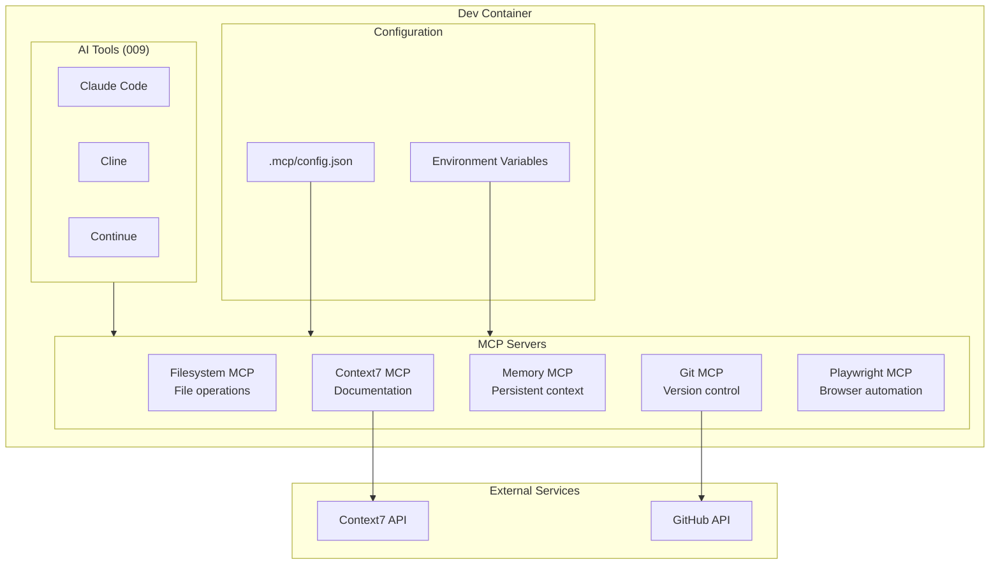
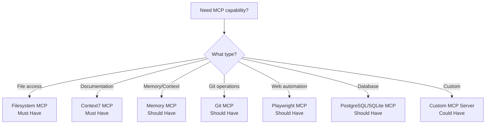
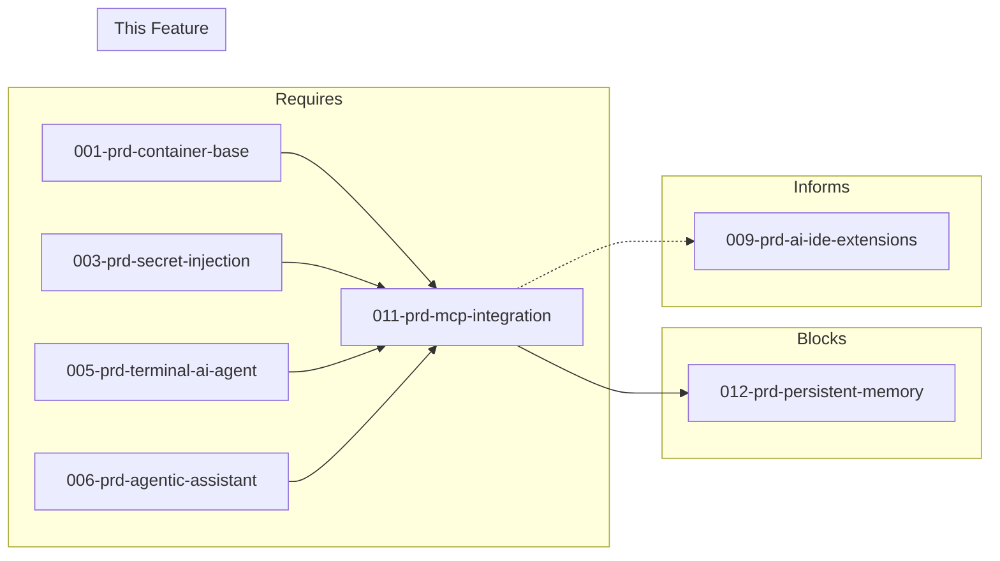

# 011-prd-mcp-integration

> **Document Type:** Product Requirements Document  
> **Audience:** LLM agents, human reviewers  
> **Status:** In Progress  
> **Last Updated:** 2026-01-23 <!-- @auto -->  
> **Owner:** Brian <!-- @human-required -->

---

## Review Tier Legend

| Marker | Tier | Speckit Behavior |
|--------|------|------------------|
| 🔴 `@human-required` | Human Generated | Prompt human to author; blocks until complete |
| 🟡 `@human-review` | LLM + Human Review | LLM drafts → prompt human to confirm/edit; blocks until confirmed |
| 🟢 `@llm-autonomous` | LLM Autonomous | LLM completes; no prompt; logged for audit |
| ⚪ `@auto` | Auto-generated | System fills (timestamps, links); no prompt |

---

## Document Completion Order

> ⚠️ **For LLM Agents:** Complete sections in this order. Do not fill downstream sections until upstream human-required inputs exist.

1. **Context** (Background, Scope) → requires human input first
2. **Problem Statement & User Story** → requires human input
3. **Requirements** (Must/Should/Could/Won't) → requires human input
4. **Technical Constraints** → human review
5. **Diagrams, Data Model, Interface** → LLM can draft after above exist
6. **Acceptance Criteria** → derived from requirements
7. **Everything else** → can proceed

---

## Context

### Background 🔴 `@human-required`

AI coding agents need access to external tools, data sources, and services to be effective. The Model Context Protocol (MCP) provides a standardized way to connect AI models to these resources. The containerized development environment should support MCP servers that extend agent capabilities—providing access to documentation, databases, APIs, file systems, and specialized tools.

This is a foundational infrastructure PRD that enables the AI-assisted development capabilities in PRDs 009 (AI IDE Extensions), 012 (Persistent Memory), and beyond.

### Scope Boundaries 🟡 `@human-review`

**In Scope:**
- MCP server runtime within Docker containers
- Configuration via environment variables and config files
- Core MCP servers (filesystem, Context7 documentation, memory)
- Integration with Claude Code, Cline, Continue, and other MCP-compatible tools
- Secure credential handling for external services
- Documentation for adding custom MCP servers

**Out of Scope:**
- MCP servers requiring GUI — *conflicts with container-first approach*
- MCP servers with hard dependencies on specific cloud providers — *vendor lock-in*
- Self-hosted LLM inference via MCP — *users provide API keys; separate concern*
- Custom MCP server development framework — *Could Have, deferred*

### Glossary 🟡 `@human-review`

| Term | Definition |
|------|------------|
| MCP | Model Context Protocol — standard for connecting AI models to external tools and data sources |
| MCP Server | A service implementing MCP that provides specific capabilities (filesystem access, documentation lookup, etc.) |
| stdio transport | Communication method where MCP servers use standard input/output streams; container-compatible |
| Context7 | MCP server providing up-to-date library documentation; prevents AI using outdated training data |
| Filesystem MCP | Official MCP server for file operations with configurable directory allowlisting |
| Knowledge Graph MCP | MCP server for storing entities and relationships; used for complex memory needs |
| npx | npm package runner; used to run MCP servers without global installation |

### Related Documents ⚪ `@auto`

| Document | Link | Relationship |
|----------|------|--------------|
| Architecture Decision Record | 011-ard-mcp-integration.md | Defines technical approach |
| Security Review | 011-sec-mcp-integration.md | Risk assessment |
| Container Base PRD | 001-prd-container-base.md | Foundation dependency |
| Secret Injection PRD | 003-prd-secret-injection.md | Credential handling |
| Terminal AI Agent PRD | 005-prd-terminal-ai-agent.md | MCP consumer |
| Agentic Assistant PRD | 006-prd-agentic-assistant.md | MCP consumer |
| Persistent Memory PRD | 012-prd-persistent-memory.md | Uses MCP for memory |

---

## Problem Statement 🔴 `@human-required`

AI coding agents need access to external tools, data sources, and services to be effective. The Model Context Protocol (MCP) provides a standardized way to connect AI models to these resources. The containerized development environment should support MCP servers that extend agent capabilities—providing access to documentation, databases, APIs, file systems, and specialized tools.

**Critical constraint**: MCP servers must run within the container environment or be accessible from within containers. Configuration should work with environment variables and not require host-side setup.

**Cost of not solving**: AI agents operate with limited context, unable to access current documentation, project files, or external services. Developers must manually copy-paste context, reducing AI effectiveness.

### User Story 🔴 `@human-required`

> As a **developer using AI coding assistants**, I want **MCP servers that extend AI capabilities with access to documentation, files, and external services** so that **AI agents can work more autonomously with accurate, current information**.

---

## Assumptions & Risks 🟡 `@human-review`

### Assumptions

- [A-1] MCP protocol remains stable and backward-compatible
- [A-2] Major AI tools (Claude Code, Cline, Continue) continue supporting MCP
- [A-3] MCP servers using stdio transport work in containerized environments
- [A-4] npm/npx available in container for MCP server execution
- [A-5] Network egress permitted for MCP servers requiring external API access

### Risks

| ID | Risk | Likelihood | Impact | Mitigation |
|----|------|------------|--------|------------|
| R-1 | MCP server vulnerabilities expose container | Medium | High | Directory allowlisting, sandboxed execution, security review |
| R-2 | MCP servers with API keys leak credentials | Medium | Critical | Environment variables only, never in config files; audit logging |
| R-3 | MCP server failures degrade AI agent experience | Medium | Medium | Health checks, graceful degradation, fallback behavior |
| R-4 | Context7 or other external MCP services become unavailable | Low | Medium | Cache responses where possible; document offline alternatives |
| R-5 | MCP protocol changes break existing integrations | Low | High | Pin versions; monitor MCP specification updates |

---

## Feature Overview

### MCP Architecture 🟡 `@human-review`



### MCP Server Selection Flow 🟡 `@human-review`



---

## Requirements

### Must Have (M) — MVP, launch blockers 🔴 `@human-required`

- [ ] **M-1:** System shall provide MCP server runtime within container
- [ ] **M-2:** System shall support configuration via environment variables or config files
- [ ] **M-3:** System shall include Filesystem MCP server with directory allowlisting
- [ ] **M-4:** System shall include Context7 MCP server for documentation access
- [ ] **M-5:** System shall work with Claude Code, Cline, Continue, and other MCP-compatible tools
- [ ] **M-6:** System shall provide secure handling of credentials for external services
- [ ] **M-7:** System shall include documentation for adding custom MCP servers

### Should Have (S) — High value, not blocking 🔴 `@human-required`

- [ ] **S-1:** System should include pre-configured common MCP servers (Git, Memory)
- [ ] **S-2:** System should support MCP server for project-specific tools (test runners, linters)
- [ ] **S-3:** System should include browser/web access MCP server (Playwright)
- [ ] **S-4:** System should include database access MCP servers (PostgreSQL, SQLite)
- [ ] **S-5:** System should support easy enable/disable of individual servers
- [ ] **S-6:** System should provide health checks for MCP server availability

### Could Have (C) — Nice to have, if time permits 🟡 `@human-review`

- [ ] **C-1:** System could include custom MCP server development framework
- [ ] **C-2:** System could integrate with MCP server marketplace/registry
- [ ] **C-3:** System could support containerized MCP servers (isolated from main container)
- [ ] **C-4:** System could provide MCP server monitoring and logging
- [ ] **C-5:** System could implement rate limiting for expensive operations
- [ ] **C-6:** System could include caching layer for repeated queries

### Won't Have (W) — Explicitly deferred 🟡 `@human-review`

- [ ] **W-1:** MCP servers requiring GUI — *Reason: Container-first, no display*
- [ ] **W-2:** MCP servers with hard cloud provider dependencies — *Reason: Vendor lock-in*
- [ ] **W-3:** Self-hosted LLM inference via MCP — *Reason: Users provide API keys*

---

## Technical Constraints 🟡 `@human-review`

- **Runtime:** MCP servers must use stdio transport (container-compatible)
- **Installation:** Via `npm install -g` or `npx` for on-demand execution
- **Configuration:** JSON config file + environment variable substitution
- **Security:** Directory allowlisting required for filesystem access
- **Credentials:** Environment variables only; never hardcoded in config
- **Dependencies:** Minimize container image bloat; prefer npx for optional servers
- **Network:** Egress required for external MCP services (Context7, GitHub)

---

## Data Model (if applicable) 🟡 `@human-review`

### Configuration Directory Structure

```
/workspace/
├── .mcp/
│   ├── config.json           # MCP server configuration
│   └── servers/              # Custom MCP server scripts
├── mcp-servers/
│   ├── filesystem/           # Containerized filesystem server
│   ├── context7/             # Context7 client
│   └── custom/               # Project-specific servers
```

---

## Interface Contract (if applicable) 🟡 `@human-review`

### MCP Configuration Schema

```json
{
  "servers": {
    "filesystem": {
      "command": "npx",
      "args": ["-y", "@modelcontextprotocol/server-filesystem", "--allowed-dirs", "/workspace"],
      "enabled": true
    },
    "context7": {
      "command": "npx",
      "args": ["-y", "@upstash/context7-mcp"],
      "env": {
        "CONTEXT7_API_KEY": "${CONTEXT7_API_KEY}"
      },
      "enabled": true
    },
    "memory": {
      "command": "npx",
      "args": ["-y", "@modelcontextprotocol/server-memory"],
      "enabled": true
    },
    "github": {
      "command": "npx",
      "args": ["-y", "@modelcontextprotocol/server-github"],
      "env": {
        "GITHUB_TOKEN": "${GITHUB_TOKEN}"
      },
      "enabled": false
    }
  }
}
```

### Environment Variables Required

```bash
# Required for Context7
CONTEXT7_API_KEY=...

# Optional - enable additional servers
GITHUB_TOKEN=ghp_...
```

---

## Evaluation Criteria 🟡 `@human-review`

| Criterion | Weight | Metric | Target | Spike Result |
|-----------|--------|--------|--------|--------------|
| Container compatibility | Critical | Runs in Docker | Yes | **PASS** |
| Tool compatibility | Critical | Works with Claude/Cline/Continue | Yes | **PASS** |
| Security | Critical | Credential handling, sandboxing | Safe | Pending full review |
| Documentation quality | High | Clear setup instructions | Comprehensive | **PASS** |
| Maintenance status | High | Recent updates | <90 days | **PASS** |
| Usefulness | High | Value for workflows | High | **PASS** |
| Performance | Medium | Latency | <100ms typical | **PASS** |
| License | Medium | Open source | MIT/Apache | **PASS** |

---

## Tool/Approach Candidates 🟡 `@human-review`

| Server | Category | Priority | Spike Result | Notes |
|--------|----------|----------|--------------|-------|
| Filesystem | Core | **Must** | **PASS** - v2026.1.14 | Essential file operations |
| Context7 | Documentation | **Must** | **PASS** - v2.1.0 | Up-to-date library docs |
| Memory | Persistence | **Should** | **PASS** - via npx | Persistent context (012) |
| Git | Version Control | **Should** | Not tested | Git operations, history |
| Playwright | Browser | **Should** | **PASS** - via npx | Web automation, testing |
| GitHub | Platform | **Should** | **PASS** - deprecated pkg | Issues, PRs, repo mgmt |
| PostgreSQL/SQLite | Database | **Should** | Not tested | Query execution |
| Knowledge Graph | Memory | **Could** | **PASS** - via npx | Entity relationships |

### Selected Approach 🔴 `@human-required`

> **Decision:** Pre-install core MCP servers, use npx for optional servers  
> **Rationale:**
> - **Pre-install** (Dockerfile): Filesystem, Context7, Memory — essential, always needed
> - **npx on-demand**: GitHub, Playwright, Database — optional, avoid image bloat
> - **Configuration**: JSON config with environment variable substitution
> - **Security**: Directory allowlisting for filesystem; credentials via env vars only

---

## Acceptance Criteria 🟡 `@human-review`

| AC ID | Requirement | Given | When | Then |
|-------|-------------|-------|------|------|
| AC-1 | M-1, M-5 | Container running | I start Claude Code | Configured MCP servers are available |
| AC-2 | M-4 | Context7 MCP configured | I ask about a library | Current documentation is retrieved |
| AC-3 | M-3 | Filesystem MCP configured | Agent reads files | Operations scoped to allowed directories |
| AC-4 | M-3 | Security constraints | Agent requests file outside allowed dirs | Request is denied |
| AC-5 | M-6 | Credentials in environment | MCP servers start | They authenticate correctly |
| AC-6 | M-7 | Custom MCP server | I add it to config | It becomes available to agents |
| AC-7 | S-6 | MCP server failure | Agent tries to use it | Graceful error handling occurs |
| AC-8 | S-1 | GitHub token configured | I query issues | Results are returned |

### Edge Cases 🟢 `@llm-autonomous`

- [ ] **EC-1:** (M-3) When filesystem MCP receives path traversal attempt (../), then request is blocked
- [ ] **EC-2:** (M-6) When API key is missing, then clear error message with setup instructions
- [ ] **EC-3:** (M-4) When Context7 API is unavailable, then graceful degradation with cached/offline message
- [ ] **EC-4:** (S-5) When server is disabled in config, then AI tools don't attempt to use it

---

## Dependencies 🟡 `@human-review`



### Requires (must be complete before this PRD)

- **001-prd-container-base** — Container runtime for MCP servers
- **003-prd-secret-injection** — Credential injection for MCP server authentication
- **005-prd-terminal-ai-agent** — Terminal AI tools that consume MCP services
- **006-prd-agentic-assistant** — Agentic tools that consume MCP services

### Blocks (waiting on this PRD)

- **012-prd-persistent-memory** — Uses MCP Memory Service for tactical context

### Informs (decisions here affect future PRDs) 🔴 `@human-required`

| Open Item | Dependent PRD | What We Need | Working Assumption |
|-----------|---------------|--------------|-------------------|
| MCP server stability | 012-prd-persistent-memory | Which MCP servers are production-ready | Filesystem, Context7, Memory are stable |
| Custom MCP patterns | Future custom tooling | How to build project-specific MCP servers | Use official SDK; document in M-7 |

### External

- **Model Context Protocol Specification** — Protocol definition
- **Context7 Service** (context7.com) — Documentation API
- **npm Registry** — MCP server packages

---

## Security Considerations 🟡 `@human-review`

| Aspect | Assessment | Notes |
|--------|------------|-------|
| Internet Exposure | Yes — egress to external APIs | Context7, GitHub APIs |
| Sensitive Data | Yes — API keys, file access | R-1, R-2 critical |
| Authentication Required | Yes — per-server credentials | Environment variables |
| Security Review Required | Yes | Filesystem access, credential handling |

### Security-Specific Requirements

- **SEC-1:** Filesystem MCP must enforce directory allowlisting (M-3)
- **SEC-2:** Credentials must only be passed via environment variables, never in config files
- **SEC-3:** MCP servers should run with minimal container permissions
- **SEC-4:** Audit logging for sensitive MCP operations (file writes, external API calls)
- **SEC-5:** Path traversal attempts must be blocked and logged

---

## Implementation Guidance 🟢 `@llm-autonomous`

### Suggested Approach

1. **Add MCP server packages to Dockerfile** (Filesystem, Context7, Memory)
2. **Create .mcp/config.json template** with environment variable substitution
3. **Document credential setup** for each MCP server
4. **Test with Claude Code, Cline, Continue** to verify compatibility
5. **Add health check script** for MCP server availability
6. **Document custom MCP server addition workflow**

### Dockerfile Addition

```dockerfile
# Install core MCP servers globally
RUN npm install -g \
    @modelcontextprotocol/server-filesystem \
    @upstash/context7-mcp \
    @modelcontextprotocol/server-memory
```

### Anti-patterns to Avoid

- **Hardcoding credentials** — Always use environment variables
- **Allowing full filesystem access** — Use directory allowlisting
- **Installing all MCP servers** — Use npx for optional servers to minimize image size
- **Ignoring MCP server errors** — Implement health checks and graceful degradation
- **Running MCP servers as root** — Use container user with minimal permissions

### Reference Examples

- Spike results: `spikes/011-mcp-integration/RESULTS.md`
- [Official MCP Servers Repository](https://github.com/modelcontextprotocol/servers)

---

## Spike Tasks 🟡 `@human-review`

### Core Setup ✅ Partial

- [x] Install MCP runtime in container
- [x] Configure filesystem MCP server with security boundaries
- [x] Configure Context7 MCP server
- [ ] Test MCP with Claude Code
- [ ] Test MCP with Cline
- [ ] Test MCP with Continue

### Extended Servers

- [ ] Set up Playwright MCP server with headless browser
- [ ] Configure GitHub MCP server with token auth
- [ ] Test database MCP server (SQLite for simplicity)
- [x] Evaluate Knowledge Graph memory server

### Security & Operations

- [ ] Document credential management for MCP servers
- [x] Implement allowed directory restrictions
- [ ] Test error handling and graceful degradation
- [ ] Measure performance impact of MCP servers
- [ ] Create health check scripts for MCP servers

### Documentation

- [ ] Write setup guide for each MCP server
- [ ] Document custom MCP server creation
- [ ] Create troubleshooting guide
- [ ] Document security best practices

---

## Success Metrics 🔴 `@human-required`

| Metric | Baseline | Target | Measurement Method |
|--------|----------|--------|-------------------|
| MCP server availability | N/A | >99% uptime | Health check monitoring |
| Context retrieval latency | N/A | <100ms p95 | Instrumentation |
| Tool compatibility | N/A | 100% (Claude/Cline/Continue) | Manual testing |

### Technical Verification 🟢 `@llm-autonomous`

| Metric | Target | Verification Method |
|--------|--------|---------------------|
| All Must Have ACs passing | 100% | Automated acceptance tests |
| Security constraints enforced | 100% | Penetration testing |
| Directory allowlist effective | No escapes | Security test suite |

---

## Definition of Ready 🔴 `@human-required`

### Readiness Checklist

- [x] Problem statement reviewed and validated by stakeholder
- [x] All Must Have requirements have acceptance criteria
- [x] Technical constraints are explicit and agreed
- [ ] Dependencies identified and owners confirmed
- [ ] Forward dependencies tracked (Informs table complete if questions deferred)
- [ ] Security review completed (or N/A documented with justification)
- [x] No open questions blocking implementation (deferred with working assumptions are OK)

### Sign-off

| Role | Name | Date | Decision |
|------|------|------|----------|
| Product Owner | | | [ ] Ready / [ ] Not Ready |

---

## Changelog ⚪ `@auto`

| Version | Date | Author | Changes |
|---------|------|--------|---------|
| 0.1 | 2026-01-21 | Brian | Initial draft with spike results |
| 0.2 | 2026-01-23 | Claude | Migrated to PRD template v3 format |

---

## Decision Log 🟡 `@human-review`

| Date | Decision | Rationale | Alternatives Considered |
|------|----------|-----------|------------------------|
| 2026-01-21 | Pre-install core MCP servers, npx for optional | Balance image size vs. convenience; core servers always needed | All pre-installed (bloat), all npx (slow startup) |
| 2026-01-21 | Use stdio transport for all MCP servers | Container-compatible, no network ports needed | HTTP transport (requires port management) |
| 2026-01-21 | Directory allowlisting for filesystem MCP | Security requirement; prevent container escape | Full access (insecure), no filesystem MCP (limits functionality) |

---

## Open Questions 🟡 `@human-review`

- [x] **Q1:** Which MCP servers are essential vs. optional?
  > **Resolved (2026-01-21):** Filesystem + Context7 are Must Have; others are Should/Could Have.

- [ ] **Q2:** How should MCP server health be monitored?
  > **Deferred to:** Implementation phase
  > **Working assumption:** Simple availability check script; expand based on needs.

- [ ] **Q3:** Should MCP servers run in isolated sub-containers?
  > **Deferred to:** C-3 (Could Have)
  > **Working assumption:** Same container is sufficient; isolation if security concerns arise.

---

## Review Checklist 🟢 `@llm-autonomous`

Before marking as Approved:

- [x] All requirements have unique IDs (M-1, S-2, etc.)
- [x] All Must Have requirements have linked acceptance criteria
- [x] Glossary terms are used consistently throughout
- [x] Diagrams use terminology from Glossary
- [ ] Security considerations documented (or N/A justified)
- [ ] Definition of Ready checklist is complete
- [x] No open questions blocking implementation (deferred questions with working assumptions are OK)
- [x] Forward dependencies tracked in Informs table (if any questions deferred to future PRDs)

---

## References

- [Model Context Protocol Specification](https://modelcontextprotocol.io/specification/2026-11-25)
- [Official MCP Servers Repository](https://github.com/modelcontextprotocol/servers)
- [Anthropic MCP Introduction](https://www.anthropic.com/news/model-context-protocol)
- [Top 10 MCP Servers 2026](https://cybersecuritynews.com/best-model-context-protocol-mcp-servers/)
- [MCP Developer Guide](https://publicapis.io/blog/mcp-model-context-protocol-guide)
- [MCP Security Analysis](https://en.wikipedia.org/wiki/Model_Context_Protocol)
