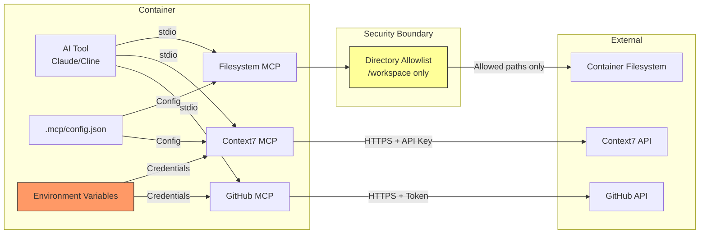
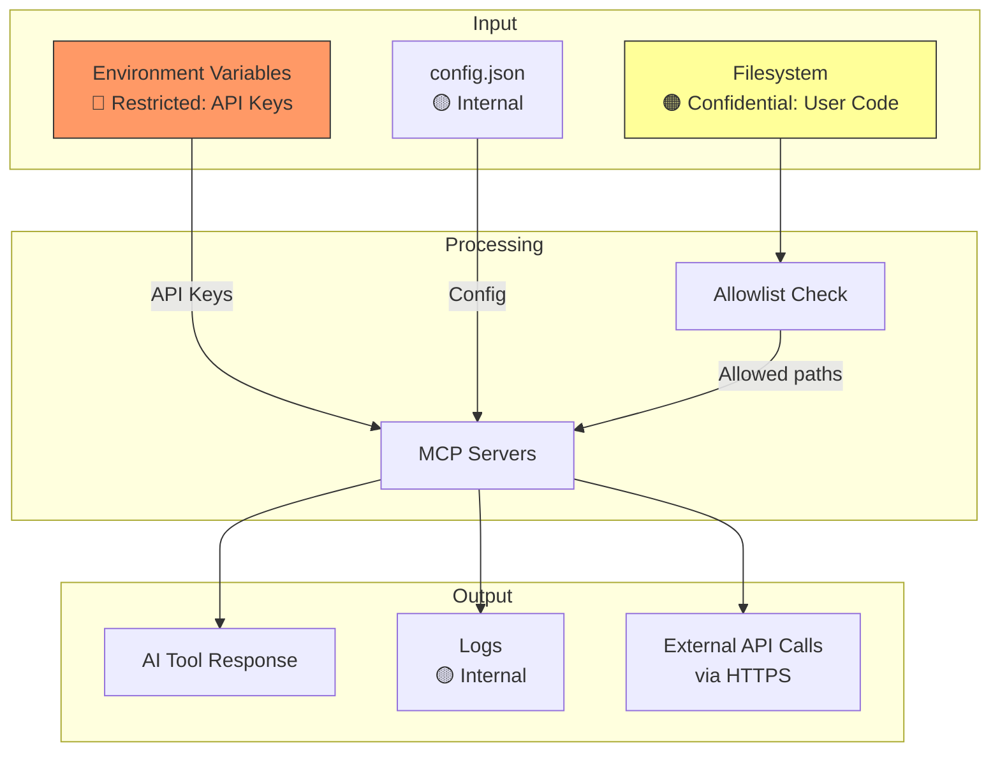
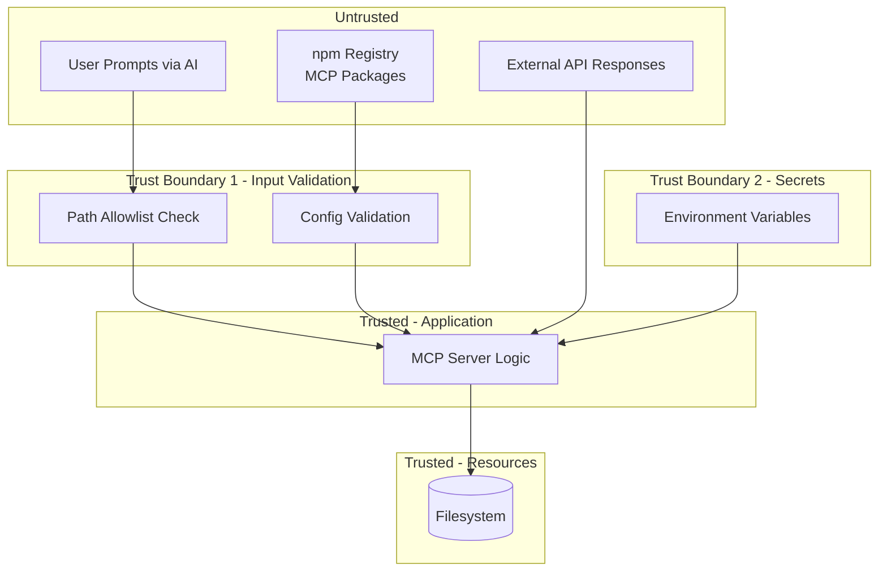

# 011-sec-mcp-integration

> **Document Type:** Security Review (Lightweight)  
> **Audience:** LLM agents, human reviewers  
> **Status:** In Review  
> **Last Updated:** 2026-01-23 <!-- @auto -->  
> **Reviewer:** Brian <!-- @human-required -->  
> **Risk Level:** High <!-- @human-required -->

---

## Review Tier Legend

| Marker | Tier | Speckit Behavior |
|--------|------|------------------|
| 🔴 `@human-required` | Human Generated | Prompt human to author; blocks until complete |
| 🟡 `@human-review` | LLM + Human Review | LLM drafts → prompt human to confirm/edit; blocks until confirmed |
| 🟢 `@llm-autonomous` | LLM Autonomous | LLM completes; no prompt; logged for audit |
| ⚪ `@auto` | Auto-generated | System fills (timestamps, links); no prompt |

---

## Severity Definitions

| Level | Label | Definition |
|-------|-------|------------|
| 🔴 | **Critical** | Immediate exploitation risk; data breach or system compromise likely |
| 🟠 | **High** | Significant risk; exploitation possible with moderate effort |
| 🟡 | **Medium** | Notable risk; exploitation requires specific conditions |
| 🟢 | **Low** | Minor risk; limited impact or unlikely exploitation |

---

## Linkage ⚪ `@auto`

| Document | ID | Relationship |
|----------|-----|--------------|
| Parent PRD | 011-prd-mcp-integration.md | Feature being reviewed |
| Architecture Decision Record | 011-ard-mcp-integration.md | Technical implementation |

---

## Purpose

This is a **lightweight security review** intended to catch obvious security concerns early in the product lifecycle. It is NOT a comprehensive threat model.

**This review answers three questions:**
1. What does this feature expose to attackers?
2. What data does it touch, and how sensitive is that data?
3. What's the impact if something goes wrong?

---

## Feature Security Summary

### One-line Summary 🔴 `@human-required`
> MCP servers extend AI agent capabilities by providing access to filesystem, external APIs, and documentation—creating new attack surface for credential theft and unauthorized file access.

### Risk Assessment 🔴 `@human-required`
> **Risk Level:** High  
> **Justification:** MCP provides filesystem access and handles API credentials, creating significant attack surface if misconfigured or exploited.

---

## Attack Surface Analysis

### Exposure Points 🟡 `@human-review`

| Exposure Type | Details | Authentication | Authorization | Notes |
|---------------|---------|----------------|---------------|-------|
| Filesystem Access | MCP server reads/writes /workspace | No (container internal) | Directory allowlist | Critical boundary |
| External API Calls | Context7 API, GitHub API | API keys in env vars | N/A | Network egress |
| Configuration Files | .mcp/config.json | No | File permissions | May contain env var refs |
| Environment Variables | API keys (CONTEXT7_API_KEY, GITHUB_TOKEN) | No | Process isolation | High-value secrets |
| MCP stdio Interface | Inter-process communication | No | N/A | Container internal |

### Attack Surface Diagram 🟢 `@llm-autonomous`

### Exposure Checklist 🟢 `@llm-autonomous`

- [x] **Internet-facing endpoints require authentication** — N/A, no inbound endpoints
- [x] **No sensitive data in URL parameters** — API keys in headers, not URLs
- [ ] **File uploads validated** — N/A for this feature
- [ ] **Rate limiting configured** — External APIs have their own limits
- [ ] **CORS policy is restrictive** — N/A, no web endpoints
- [x] **No debug/admin endpoints exposed** — N/A
- [ ] **Webhooks validate signatures** — N/A, no inbound webhooks

---

## Data Flow Analysis

### Data Inventory 🟡 `@human-review`

| Data Element | PRD Entity | Classification | Source | Destination | Retention | Encrypted Rest | Encrypted Transit | Residency |
|--------------|------------|----------------|--------|-------------|-----------|----------------|-------------------|-----------|
| API Keys (CONTEXT7_API_KEY, GITHUB_TOKEN) | Credentials | **Restricted** | Environment | MCP servers | Session only | N/A (memory) | N/A (local) | Container |
| File contents | User code | **Confidential** | Filesystem | AI tools | None | No (local) | N/A (local) | Container |
| Documentation responses | Library docs | Internal | Context7 API | AI tools | None | N/A | Yes (HTTPS) | Any |
| Configuration | config.json | Internal | Filesystem | MCP servers | Persistent | No | N/A | Container |

### Data Classification Reference 🟢 `@llm-autonomous`

| Level | Label | Description | Examples | Handling Requirements |
|-------|-------|-------------|----------|----------------------|
| 1 | **Public** | No impact if disclosed | Documentation content | No special handling |
| 2 | **Internal** | Minor impact if disclosed | Configuration structure | Access controls |
| 3 | **Confidential** | Significant impact if disclosed | User source code | Encryption, access controls |
| 4 | **Restricted** | Severe impact if disclosed | API keys, tokens | Encryption, strict access, audit |

### Data Flow Diagram 🟢 `@llm-autonomous`

### Data Handling Checklist 🟢 `@llm-autonomous`

- [x] **No Restricted data stored unless absolutely required** — API keys in memory only
- [ ] **Confidential data encrypted at rest** — User code not encrypted (local container)
- [x] **All data encrypted in transit (TLS 1.2+)** — External API calls use HTTPS
- [ ] **PII has defined retention policy** — N/A, no PII collected
- [x] **Logs do not contain Confidential/Restricted data** — Must redact API keys
- [x] **Secrets are not hardcoded** — Env var injection required
- [x] **Data minimization applied** — Only read files when requested

---

## Third-Party & Supply Chain 🟡 `@human-review`

### New External Services

| Service | Purpose | Data Shared | Communication | Approved? |
|---------|---------|-------------|---------------|-----------|
| Context7 API | Library documentation | None (queries only) | HTTPS/TLS 1.3 | Pending |
| GitHub API | Repository operations | User token | HTTPS/TLS 1.3 | Yes |

### New Libraries/Dependencies

| Library | Version | License | Purpose | Security Check |
|---------|---------|---------|---------|----------------|
| @modelcontextprotocol/server-filesystem | 2026.1.x | MIT | File operations | Pending |
| @upstash/context7-mcp | 2.1.x | MIT | Documentation lookup | Pending |
| @modelcontextprotocol/server-memory | 1.x | MIT | Persistent context | Pending |
| @modelcontextprotocol/server-github | 1.x | MIT | GitHub integration | Pending |

---

## CIA Impact Assessment

### Confidentiality 🟡 `@human-review`

> **What could be exposed?**

| Asset at Risk | Exposure Scenario | Impact | Likelihood |
|---------------|-------------------|--------|------------|
| API Keys | Logged in error messages | High | Medium |
| API Keys | Exposed in config.json committed to git | Critical | Low (if following guidelines) |
| User source code | Allowlist bypass via path traversal | High | Low |
| User source code | MCP server vulnerability leaks files | Medium | Low |

**Confidentiality Risk Level:** High

### Integrity 🟡 `@human-review`

> **What could be modified or corrupted?**

| Asset at Risk | Modification Scenario | Impact | Likelihood |
|---------------|----------------------|--------|------------|
| User source code | Malicious MCP server writes to arbitrary paths | Critical | Low |
| Configuration | Attacker modifies .mcp/config.json | Medium | Low |
| MCP server code | Supply chain attack on npm packages | Critical | Low |

**Integrity Risk Level:** Medium

### Availability 🟡 `@human-review`

> **What could be disrupted?**

| Service/Function | Disruption Scenario | Impact | Likelihood |
|------------------|---------------------|--------|------------|
| Context7 documentation | External API outage | Low | Medium |
| AI agent functionality | MCP server crash | Medium | Medium |
| Development workflow | Filesystem MCP blocked | High | Low |

**Availability Risk Level:** Medium

### CIA Summary 🟢 `@llm-autonomous`

| Dimension | Risk Level | Primary Concern | Mitigation Priority |
|-----------|------------|-----------------|---------------------|
| **Confidentiality** | High | API key exposure in logs/commits | High |
| **Integrity** | Medium | Supply chain attack on MCP packages | Medium |
| **Availability** | Medium | External API dependency | Low |

**Overall CIA Risk:** High — *API credential handling and filesystem access require careful security controls*

---

## Trust Boundaries 🟡 `@human-review`

### Trust Boundary Checklist 🟢 `@llm-autonomous`

- [x] **All input from untrusted sources is validated** — Paths validated against allowlist
- [x] **External API responses are validated** — Basic response validation
- [ ] **Authorization checked at data access, not just entry point** — Allowlist at MCP level
- [x] **Service-to-service calls are authenticated** — API keys for external services

---

## Known Risks & Mitigations 🟡 `@human-review`

| ID | Risk Description | Severity | Mitigation | Status | Owner |
|----|------------------|----------|------------|--------|-------|
| R1 | API keys logged in error messages | 🟠 High | Redact env vars in logging; audit MCP server logging | Open | Brian |
| R2 | Path traversal bypasses allowlist | 🔴 Critical | Resolve paths to absolute; block symlinks outside allowlist | Mitigated | Brian |
| R3 | API keys hardcoded in config.json | 🟠 High | Only allow ${VAR} syntax; lint/validate config | Mitigated | Brian |
| R4 | Supply chain attack on MCP npm packages | 🟠 High | Pin versions; review package code; monitor advisories | Open | Brian |
| R5 | Sensitive code sent to external APIs | 🟡 Medium | Document which MCP servers send data externally | Open | Brian |

### Risk Acceptance 🔴 `@human-required`

| Risk ID | Accepted By | Date | Justification | Review Date |
|---------|-------------|------|---------------|-------------|
| R4 | Brian | 2026-01-23 | Using official Anthropic/MCP packages; monitoring for advisories | 2026-04-23 |

---

## Security Requirements 🟡 `@human-review`

### Authentication & Authorization

| Req ID | Requirement | PRD AC | Verification Method |
|--------|-------------|--------|---------------------|
| SEC-1 | Filesystem MCP must enforce directory allowlist | AC-3, AC-4 | Integration Test |
| SEC-2 | Path traversal attempts (../) must be blocked | AC-4 | Security Test |

### Data Protection

| Req ID | Requirement | PRD AC | Verification Method |
|--------|-------------|--------|---------------------|
| SEC-3 | API keys must only be passed via environment variables | AC-5 | Code Review |
| SEC-4 | Logs must not contain API keys or tokens | — | Manual Review |
| SEC-5 | Config files must not contain plaintext credentials | — | Lint Rule |

### Input Validation

| Req ID | Requirement | PRD AC | Verification Method |
|--------|-------------|--------|---------------------|
| SEC-6 | All file paths must be resolved to absolute before allowlist check | — | Unit Test |
| SEC-7 | Symlinks must not escape allowlist boundaries | — | Security Test |

### Operational Security

| Req ID | Requirement | PRD AC | Verification Method |
|--------|-------------|--------|---------------------|
| SEC-8 | MCP server package versions must be pinned | — | Dockerfile Review |
| SEC-9 | MCP server failures must be logged | AC-7 | Integration Test |

---

## Compliance Considerations 🟡 `@human-review`

| Regulation | Applicable? | Relevant Requirements | N/A Justification |
|------------|-------------|----------------------|-------------------|
| GDPR | N/A | — | No personal data collected or processed |
| CCPA | N/A | — | No personal data collected or processed |
| SOC 2 | N/A | — | Internal development tooling, not customer-facing |
| HIPAA | N/A | — | No health information |
| PCI-DSS | N/A | — | No payment data |

---

## Review Findings

### Issues Identified 🟡 `@human-review`

| ID | Finding | Severity | Category | Recommendation | Status |
|----|---------|----------|----------|----------------|--------|
| F1 | No audit logging for MCP file operations | 🟡 Medium | Exposure | Add logging for all file read/write operations | Open |
| F2 | npx servers downloaded without integrity check | 🟡 Medium | Supply Chain | Consider pre-installing or using lockfile | Open |
| F3 | No rate limiting on MCP operations | 🟢 Low | Availability | Monitor for abuse patterns | Open |

### Positive Observations 🟢 `@llm-autonomous`

- Directory allowlisting provides strong filesystem boundary
- Environment variable injection prevents credential hardcoding
- stdio transport avoids network exposure of MCP interface
- Pre-installed servers reduce supply chain attack surface

---

## Open Questions 🟡 `@human-review`

- [ ] **Q1:** Should we implement integrity verification for npx-downloaded packages?
- [ ] **Q2:** What audit logging is appropriate for MCP operations?

---

## Changelog ⚪ `@auto`

| Version | Date | Author | Changes |
|---------|------|--------|---------|
| 0.1 | 2026-01-23 | Claude | Initial review |

---

## Review Sign-off 🔴 `@human-required`

| Role | Name | Date | Decision |
|------|------|------|----------|
| Security Reviewer | | | [ ] Approved / [ ] Approved with conditions / [ ] Rejected |
| Feature Owner | Brian | | [ ] Acknowledged |

### Conditions for Approval (if applicable) 🔴 `@human-required`

- [ ] F1: Add audit logging for filesystem operations before production use
- [ ] F2: Document supply chain risk acceptance and monitoring plan

---

## Security Requirements Traceability 🟢 `@llm-autonomous`

| SEC Req ID | PRD Req ID | PRD AC ID | Test Type | Test Location |
|------------|------------|-----------|-----------|---------------|
| SEC-1 | M-3 | AC-3, AC-4 | Integration | tests/mcp_allowlist_test |
| SEC-2 | M-3 | AC-4 | Security | tests/path_traversal_test |
| SEC-3 | M-6 | AC-5 | Code Review | PR review checklist |
| SEC-4 | — | — | Manual | Log review |
| SEC-5 | M-6 | — | Lint | .mcp/config.json validation |
| SEC-6 | M-3 | — | Unit | tests/path_resolution_test |
| SEC-7 | M-3 | — | Security | tests/symlink_test |

---

## Review Checklist 🟢 `@llm-autonomous`

Before marking as Approved:
- [x] Attack surface documented with auth/authz status for each exposure
- [x] Exposure Points table has no contradictory rows
- [x] All data elements are classified using the 4-tier model
- [x] Third-party dependencies and services are listed
- [x] CIA impact is assessed with Low/Medium/High ratings
- [x] Trust boundaries are identified
- [x] Security requirements have verification methods specified
- [x] Security requirements trace to PRD ACs where applicable
- [ ] No Critical/High findings remain Open
- [x] Compliance N/A items have justification
- [x] Risk acceptance has named approver and review date
