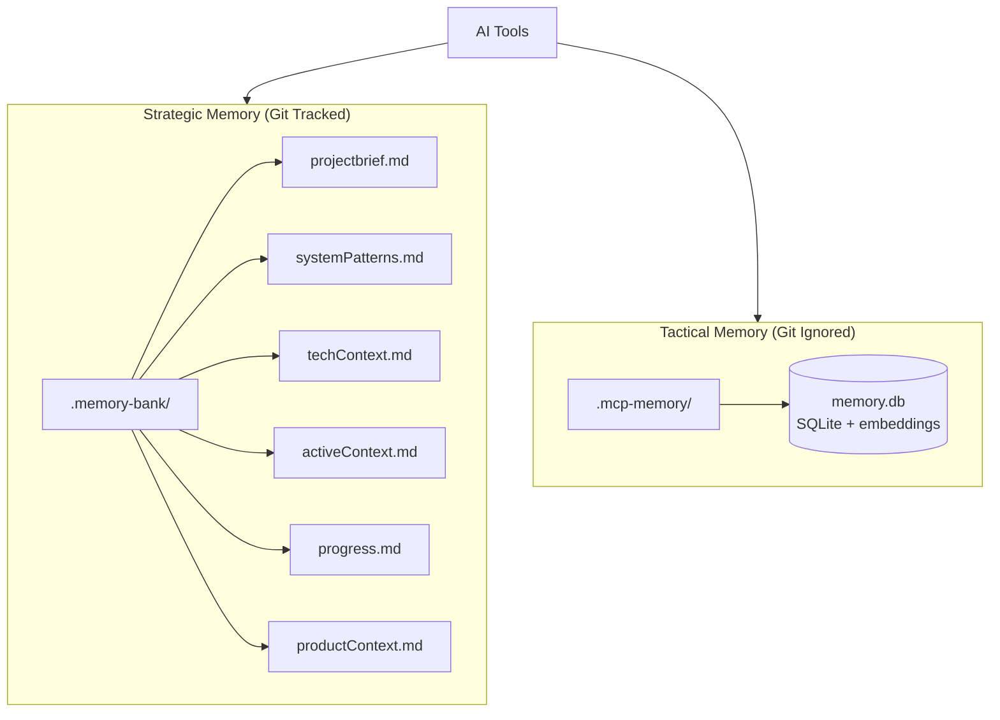
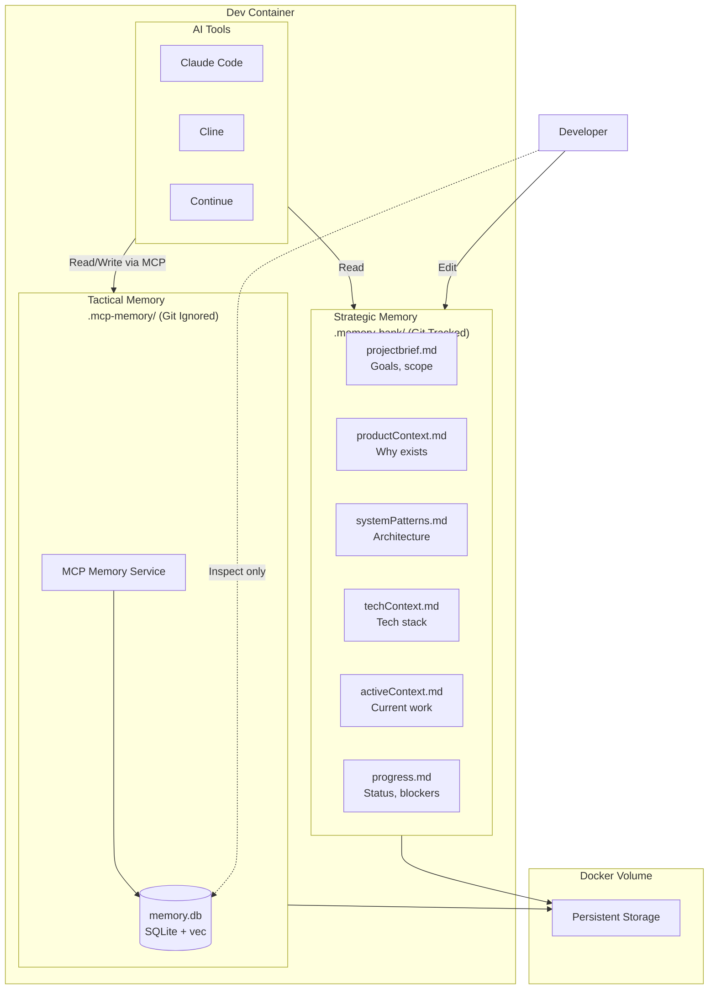
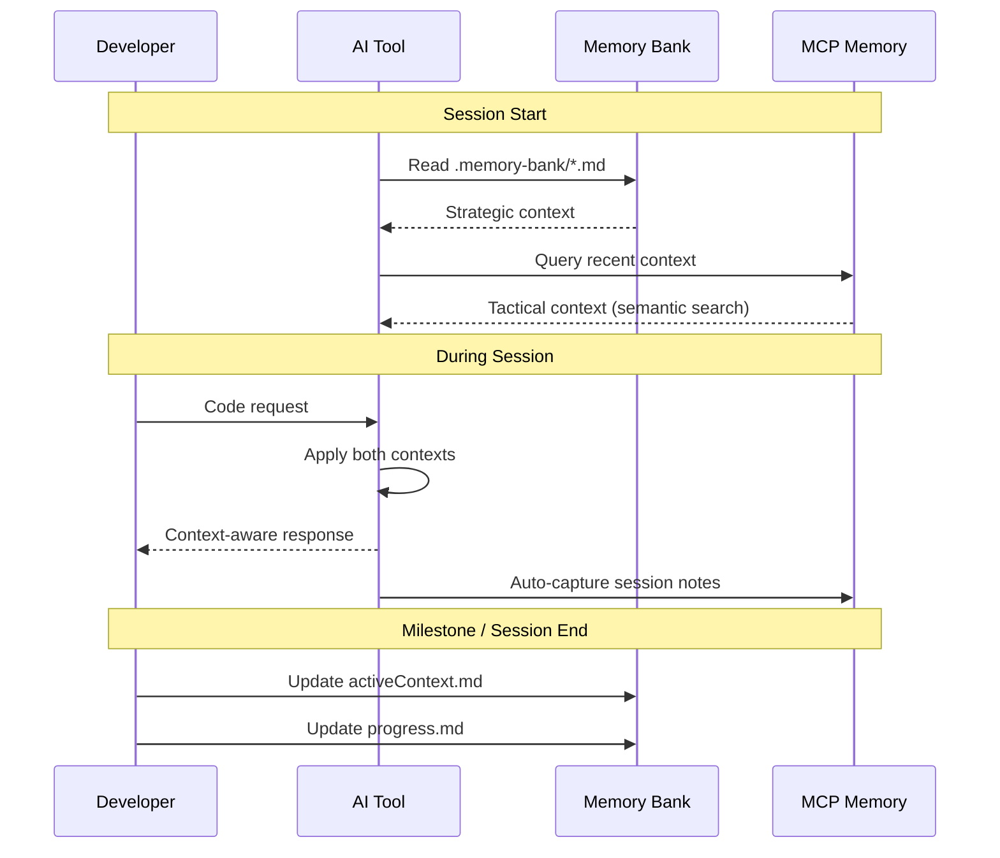
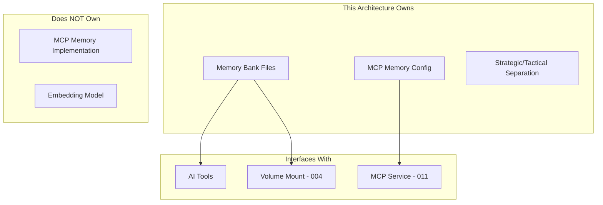

# 012-ard-persistent-memory

> **Document Type:** Architecture Decision Record  
> **Audience:** LLM agents, human reviewers  
> **Status:** Accepted  
> **Last Updated:** 2026-01-23 <!-- @auto -->  
> **Owner:** Brian <!-- @human-required -->  
> **Deciders:** Brian <!-- @human-required -->

---

## Review Tier Legend

| Marker | Tier | Speckit Behavior |
|--------|------|------------------|
| 🔴 `@human-required` | Human Generated | Prompt human to author; blocks until complete |
| 🟡 `@human-review` | LLM + Human Review | LLM drafts → prompt human to confirm/edit; blocks until confirmed |
| 🟢 `@llm-autonomous` | LLM Autonomous | LLM completes; no prompt; logged for audit |
| ⚪ `@auto` | Auto-generated | System fills (timestamps, links); no prompt |

---

## Linkage ⚪ `@auto`

| Document | ID | Relationship |
|----------|-----|--------------|
| Parent PRD | 012-prd-persistent-memory.md | Requirements this architecture satisfies |
| Security Review | 012-sec-persistent-memory.md | Security implications of this decision |
| Supersedes | — | N/A (greenfield) |
| Superseded By | — | — |

---

## Summary

### Decision 🔴 `@human-required`
> Use a hybrid memory approach: Memory Bank (markdown files) for strategic context + MCP Memory Service for tactical context with semantic search.

### TL;DR for Agents 🟡 `@human-review`
> Two complementary memory systems: (1) Memory Bank - 6 markdown files in `.memory-bank/` for human-maintained strategic context (architecture, decisions, patterns) - git-tracked. (2) MCP Memory Service - SQLite with embeddings in `.mcp-memory/` for automatic tactical context capture - git-ignored. Always check Memory Bank files for project patterns before generating code. Never store secrets in either memory system.

---

## Context

### Problem Space 🔴 `@human-required`
AI coding agents lose context between sessions, requiring developers to re-explain project details repeatedly. We need a persistent memory system that (1) survives container restarts, (2) is human-readable for inspection, (3) supports multiple AI tools, and (4) provides both manual strategic context and automatic session capture.

### Decision Scope 🟡 `@human-review`

**This ARD decides:**
- Memory storage format (markdown vs. database vs. hybrid)
- Memory organization (strategic vs. tactical separation)
- Storage locations and git tracking strategy
- Integration pattern with AI tools

**This ARD does NOT decide:**
- MCP Memory Service implementation details (use existing package)
- Specific Memory Bank file templates (documentation concern)
- Memory pruning/summarization algorithms (deferred to implementation)

### Current State 🟢 `@llm-autonomous`
N/A - greenfield implementation. No persistent memory system currently exists. AI agents rely solely on context window for each session.

### Driving Requirements 🟡 `@human-review`

| PRD Req ID | Requirement Summary | Architectural Implication |
|------------|---------------------|---------------------------|
| M-1 | Persistent storage across container restarts | Volume-backed storage required |
| M-2 | Project-scoped memory | Per-project directory structure |
| M-3 | Works with Claude Code, Cline, Continue | Universal format (markdown) + MCP |
| M-4 | Human-readable storage format | Markdown files for strategic context |
| M-5 | Automatic context injection | MCP integration for AI tools |
| M-6 | Runs within container | Docker volume mounts |
| S-1 | Semantic search retrieval | MCP Memory Service with embeddings |
| S-2 | Memory categories | Structured Memory Bank files |

**PRD Constraints inherited:**
- Storage must persist on Docker volumes
- Memory Bank files should be <1MB total (git-friendly)
- Tactical memory should be git-ignored (sensitive session data)

---

## Decision Drivers 🔴 `@human-required`

1. **Human Readability:** Strategic context must be inspectable and editable by humans *(traces to M-4)*
2. **Cross-tool Compatibility:** Must work with any AI tool, not just MCP-enabled *(traces to M-3)*
3. **Version Control:** Strategic decisions should be tracked with code *(project management need)*
4. **Automatic Capture:** Session context should be captured without manual effort *(traces to S-3)*
5. **Search Quality:** Relevant context should be retrievable by meaning *(traces to S-1)*

---

## Options Considered 🟡 `@human-review`

### Option 0: No Persistent Memory

**Description:** AI agents rely on context window only; developers re-explain context each session.

| Driver | Rating | Notes |
|--------|--------|-------|
| Human Readability | N/A | No memory to read |
| Cross-tool Compatibility | ✅ Good | No integration needed |
| Version Control | N/A | Nothing to version |
| Automatic Capture | ❌ Poor | No capture at all |
| Search Quality | ❌ Poor | No search possible |

**Why not viable:** PRD explicitly requires persistent memory. 5-10 minutes wasted per session re-explaining context.

---

### Option 1: Memory Bank Only (Markdown Files)

**Description:** All memory in structured markdown files, manually maintained.

```mermaid
graph TD
    subgraph Memory Bank
        PB[projectbrief.md]
        SP[systemPatterns.md]
        TC[techContext.md]
        AC[activeContext.md]
        PR[progress.md]
    end
    
    AI[AI Tools] --> Memory Bank
```

| Driver | Rating | Notes |
|--------|--------|-------|
| Human Readability | ✅ Good | All markdown, easy to inspect |
| Cross-tool Compatibility | ✅ Good | Any tool can read files |
| Version Control | ✅ Good | All files git-tracked |
| Automatic Capture | ❌ Poor | Manual updates required |
| Search Quality | ⚠️ Medium | Keyword only, no semantic |

**Pros:**
- Simple, no dependencies
- Fully human-controlled
- Git-friendly

**Cons:**
- Requires discipline to maintain
- No automatic session capture
- No semantic search

---

### Option 2: MCP Memory Service Only

**Description:** All memory in MCP Memory Service with SQLite + embeddings.

| Driver | Rating | Notes |
|--------|--------|-------|
| Human Readability | ❌ Poor | SQLite database, not easily inspected |
| Cross-tool Compatibility | ⚠️ Medium | Requires MCP support |
| Version Control | ❌ Poor | Database not git-friendly |
| Automatic Capture | ✅ Good | Captures session context |
| Search Quality | ✅ Good | 5ms semantic search |

**Pros:**
- Automatic context capture
- Fast semantic retrieval
- No manual maintenance

**Cons:**
- Not human-readable
- Requires MCP support
- Can't version control decisions

---

### Option 3: Hybrid - Memory Bank + MCP Memory (Selected)

**Description:** Strategic context in markdown (Memory Bank), tactical context in MCP Memory Service.



| Driver | Rating | Notes |
|--------|--------|-------|
| Human Readability | ✅ Good | Strategic in markdown |
| Cross-tool Compatibility | ✅ Good | Markdown universal; MCP for enhanced |
| Version Control | ✅ Good | Strategic git-tracked |
| Automatic Capture | ✅ Good | MCP captures tactical |
| Search Quality | ✅ Good | Semantic search via MCP |

**Pros:**
- Best of both worlds
- Strategic decisions versioned
- Tactical context automatic
- Works with or without MCP

**Cons:**
- Two systems to understand
- Potential overlap confusion
- More complex setup

---

## Decision

### Selected Option 🔴 `@human-required`
> **Option 3: Hybrid - Memory Bank + MCP Memory**

### Rationale 🔴 `@human-required`

The hybrid approach satisfies all decision drivers:

1. **Strategic context** (architecture decisions, patterns, project goals) is stable and should be human-reviewed—markdown is ideal
2. **Tactical context** (recent sessions, code patterns) changes frequently—automatic capture via MCP is ideal
3. **Version control** for strategic decisions ensures team alignment and history
4. **Fallback** to markdown-only works when MCP is unavailable

Clear separation prevents confusion: Memory Bank for "what we decided," MCP Memory for "what we did recently."

#### Simplest Implementation Comparison 🟡 `@human-review`

| Aspect | Simplest Possible | Selected Option | Justification for Complexity |
|--------|-------------------|-----------------|------------------------------|
| Storage | Single text file | 6 markdown + SQLite | Categories needed for navigation (S-2) |
| Search | grep | Semantic embeddings | Relevant retrieval requirement (S-1) |
| Maintenance | All manual | Manual strategic + auto tactical | Automatic capture requirement (S-3) |

**Complexity justified by:** PRD requires both human oversight (M-4) and automatic capture (S-3). Single system can't satisfy both—hybrid approach is minimal complexity that meets all requirements.

### Architecture Diagram 🟡 `@human-review`



---

## Technical Specification

### Component Overview 🟡 `@human-review`

| Component | Responsibility | Interface | Dependencies |
|-----------|---------------|-----------|--------------|
| Memory Bank Files | Store strategic project context | File read | None |
| MCP Memory Service | Store/retrieve tactical context | MCP stdio | SQLite, embeddings |
| Volume Mount | Persist both memory types | Docker volume | 004-prd-volume-architecture |

### Data Flow 🟢 `@llm-autonomous`



### Interface Definitions 🟡 `@human-review`

```
# Memory Bank File Structure
.memory-bank/
├── projectbrief.md      # Project goals, scope, users
├── productContext.md    # Why project exists, problems solved
├── systemPatterns.md    # Architecture decisions, patterns
├── techContext.md       # Technologies, APIs, constraints
├── activeContext.md     # Current work, recent changes
└── progress.md          # Completed work, blockers, decisions

# MCP Memory Storage
.mcp-memory/
├── memory.db           # SQLite with vector embeddings
└── config.json         # MCP Memory Service config
```

### Key Algorithms/Patterns 🟡 `@human-review`

**Pattern:** Context Loading Priority
```
1. Load all Memory Bank files (always)
2. Query MCP Memory for relevant tactical context (if available)
3. Combine: Strategic context takes precedence for conflicts
4. Inject combined context into AI session
```

**Pattern:** Memory Update Flow
```
Strategic (Manual):
1. Developer edits .memory-bank/*.md
2. Commit to git with code changes
3. Available to all team members

Tactical (Automatic):
1. MCP Memory Service observes session
2. Captures code patterns, recent queries
3. Stores with embeddings for semantic search
4. Pruned based on retention policy
```

---

## Constraints & Boundaries

### Technical Constraints 🟡 `@human-review`

**Inherited from PRD:**
- Storage on Docker volumes (M-1, M-6)
- Human-readable format for strategic memory (M-4)
- Works with multiple AI tools (M-3)

**Added by this Architecture:**
- **Memory Bank:** Markdown only, <1MB total, git-tracked
- **MCP Memory:** SQLite database, git-ignored, 30-day default retention
- **Separation:** Never duplicate strategic content in tactical storage

### Architectural Boundaries 🟡 `@human-review`



### Implementation Guardrails 🟡 `@human-review`

> ⚠️ **Critical for LLM Agents:**

- [ ] **DO NOT** store secrets, API keys, or credentials in Memory Bank files *(security)*
- [ ] **DO NOT** commit .mcp-memory/ to git *(contains session data)*
- [ ] **DO NOT** duplicate strategic decisions in tactical memory *(separation)*
- [ ] **MUST** read Memory Bank files at session start *(M-4)*
- [ ] **MUST** update activeContext.md when switching tasks *(workflow)*
- [ ] **MUST** keep Memory Bank files under 1MB total *(git-friendly)*

---

## Consequences 🟡 `@human-review`

### Positive
- Strategic decisions are versioned and reviewable
- Tactical context is automatic, no manual effort
- Works with any AI tool (markdown universal)
- Semantic search finds relevant context quickly
- Clear separation prevents confusion

### Negative
- Two systems to understand and maintain
- Memory Bank requires developer discipline
- MCP Memory requires 011 infrastructure
- Potential for stale Memory Bank files

### Risks & Mitigations

| Risk | Likelihood | Impact | Mitigation |
|------|------------|--------|------------|
| Memory Bank becomes stale | High | Medium | Include in PR checklist; periodic review |
| Secrets accidentally added to Memory Bank | Medium | High | .gitignore patterns; pre-commit hook |
| MCP Memory grows unbounded | Medium | Low | Retention policy; periodic pruning |
| Confusion about what goes where | Medium | Low | Clear documentation; templates |

---

## Implementation Guidance

### Suggested Implementation Order 🟢 `@llm-autonomous`
1. Create .memory-bank/ directory structure with templates
2. Add .mcp-memory/ to .gitignore
3. Configure MCP Memory Service (011 dependency)
4. Test Memory Bank reading with Claude Code
5. Test MCP Memory capture and retrieval
6. Document workflow for developers

### Testing Strategy 🟢 `@llm-autonomous`

| Layer | Test Type | Coverage Target | Notes |
|-------|-----------|-----------------|-------|
| Unit | Template validation | 100% | Memory Bank file structure |
| Integration | AI + Memory Bank | Key paths | Context correctly loaded |
| Integration | AI + MCP Memory | Key paths | Semantic search works |
| E2E | Full session | Happy path | Both memories used together |

### Reference Implementations 🟡 `@human-review`

- [Memory Bank System](https://tweag.github.io/agentic-coding-handbook/WORKFLOW_MEMORY_BANK/) *(external, approved)*
- [Cline Memory Bank](https://cline.bot/blog/memory-bank-how-to-make-cline-an-ai-agent-that-never-forgets) *(external, approved)*
- [MCP Memory Service](https://github.com/doobidoo/mcp-memory-service) *(external, approved)*

### Anti-patterns to Avoid 🟡 `@human-review`
- **Don't:** Put secrets in Memory Bank
  - **Why:** Files are git-tracked and shared
  - **Instead:** Use environment variables

- **Don't:** Let Memory Bank files grow large
  - **Why:** Fills AI context window; slows git
  - **Instead:** Keep concise; summarize old content

---

## Compliance & Cross-cutting Concerns

### Security Considerations 🟡 `@human-review`
- **Data handling:** No secrets in Memory Bank; MCP Memory may contain code snippets
- See 012-sec-persistent-memory.md for full review

### Observability 🟢 `@llm-autonomous`
- **Logging:** Memory Bank file reads; MCP Memory queries
- **Metrics:** Memory Bank size; MCP Memory entry count
- **Tracing:** Context loading time

### Error Handling Strategy 🟢 `@llm-autonomous`
```
Error Category → Handling Approach
├── Memory Bank file missing → Create from template
├── Memory Bank file malformed → Read what's parseable, warn
├── MCP Memory unavailable → Continue with Memory Bank only
└── MCP Memory query fails → Log, return empty, continue
```

---

## Migration Plan (if applicable) 🟡 `@human-review`

N/A - Greenfield implementation.

### Rollback Plan 🔴 `@human-required`

**Rollback Triggers:**
- Memory system causes AI tool failures
- Performance degradation from loading memory
- Security issue discovered

**Rollback Decision Authority:** Brian (Owner)

**Rollback Time Window:** Anytime

**Rollback Procedure:**
1. Remove .memory-bank/ from workspace template
2. Disable MCP Memory Service in config
3. AI tools continue without persistent memory
4. Strategic context preserved in git history

---

## Open Questions 🟡 `@human-review`

- [x] **Q1:** Should Memory Bank be one file or multiple?
  > Resolved: 6 files for navigation clarity (per Memory Bank pattern)

- [ ] **Q2:** What's the ideal retention period for MCP Memory?
  > Deferred: Start with 30 days; adjust based on usage

---

## Changelog ⚪ `@auto`

| Version | Date | Author | Changes |
|---------|------|--------|---------|
| 0.1 | 2026-01-21 | Brian | Initial proposal based on spike |
| 1.0 | 2026-01-23 | Brian | Accepted after review |

---

## Traceability Matrix 🟢 `@llm-autonomous`

| PRD Req ID | Decision Driver | Option Rating | Component | Notes |
|------------|-----------------|---------------|-----------|-------|
| M-1 | N/A | Option 3: ✅ | Volume Mount | Docker volumes |
| M-2 | N/A | Option 3: ✅ | Directory structure | Per-project paths |
| M-3 | Cross-tool | Option 3: ✅ | Memory Bank | Markdown universal |
| M-4 | Human Readability | Option 3: ✅ | Memory Bank | Inspectable files |
| M-5 | N/A | Option 3: ✅ | MCP Memory | MCP integration |
| S-1 | Search Quality | Option 3: ✅ | MCP Memory | Semantic search |
| S-2 | Human Readability | Option 3: ✅ | Memory Bank | 6 categorized files |

---

## Review Checklist 🟢 `@llm-autonomous`

Before marking as Accepted:
- [x] All PRD Must Have requirements appear in Driving Requirements
- [x] Option 0 (Status Quo) is documented
- [x] Simplest Implementation comparison is completed
- [x] Decision drivers are prioritized and addressed
- [x] At least 2 options were seriously considered
- [x] Constraints distinguish inherited vs. new
- [x] Component names are consistent across all diagrams and tables
- [x] Implementation guardrails reference specific PRD constraints
- [x] Rollback triggers and authority are defined
- [x] Security review is linked
- [x] No open questions blocking implementation
