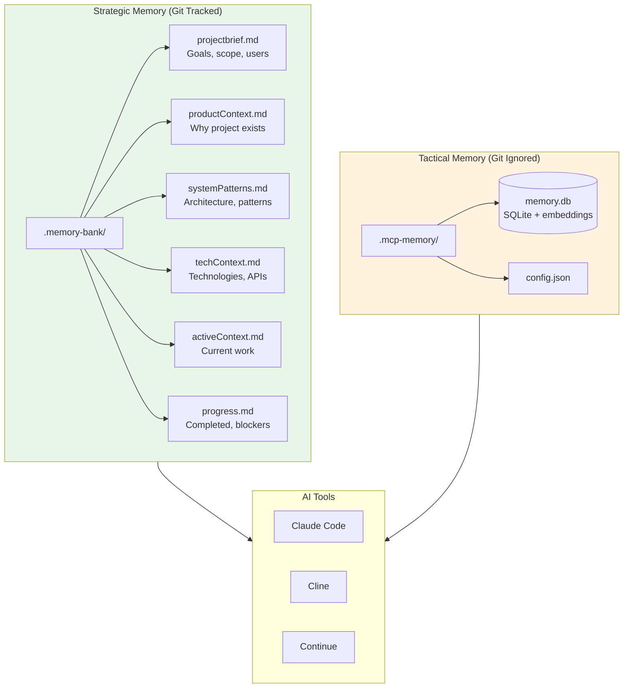
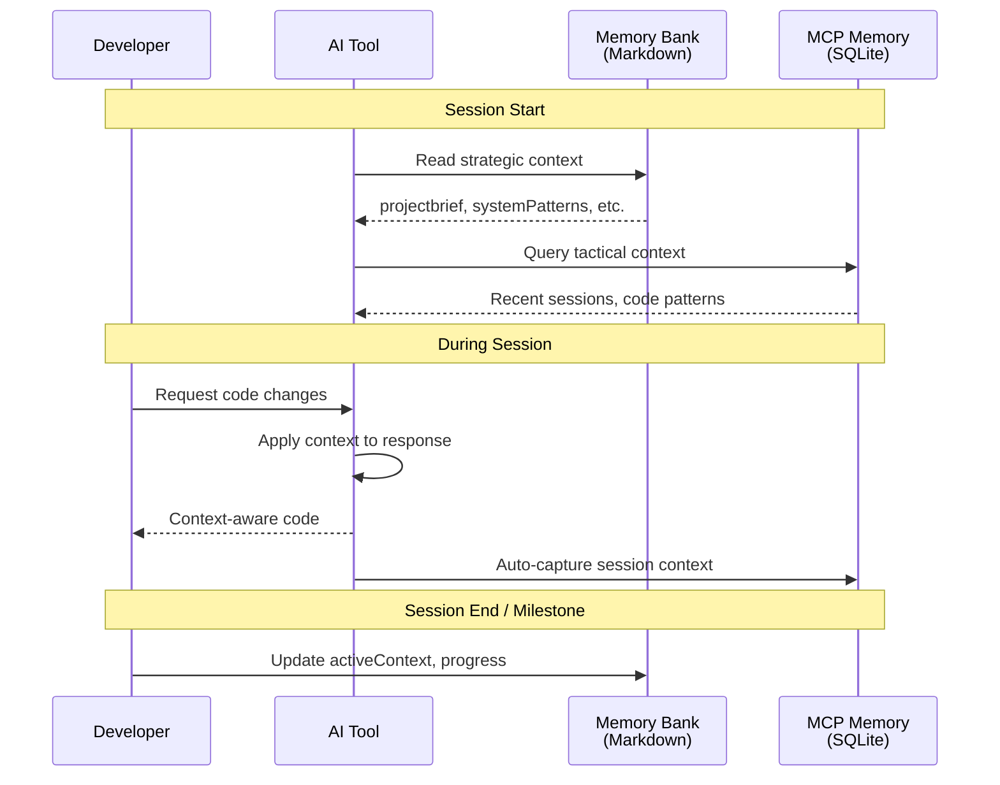
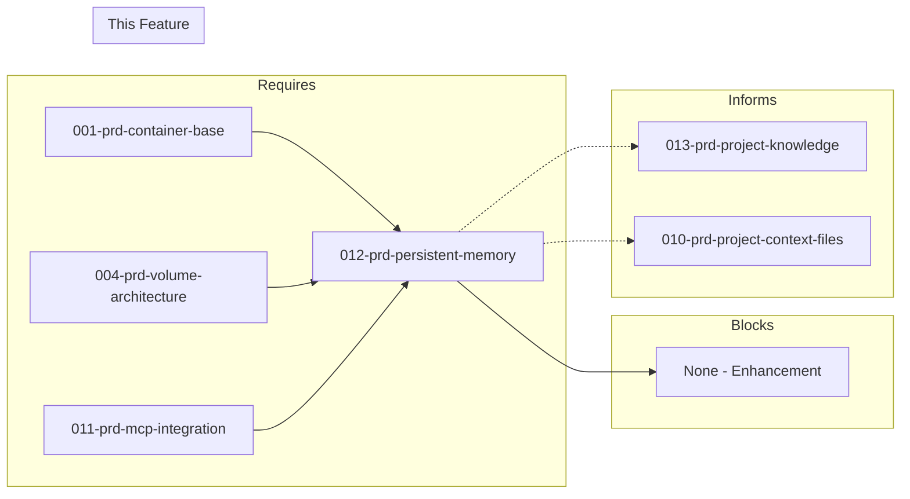

# 012-prd-persistent-memory

> **Document Type:** Product Requirements Document  
> **Audience:** LLM agents, human reviewers  
> **Status:** In Progress  
> **Last Updated:** 2026-01-23 <!-- @auto -->  
> **Owner:** Brian <!-- @human-required -->

---

## Review Tier Legend

| Marker | Tier | Speckit Behavior |
|--------|------|------------------|
| 🔴 `@human-required` | Human Generated | Prompt human to author; blocks until complete |
| 🟡 `@human-review` | LLM + Human Review | LLM drafts → prompt human to confirm/edit; blocks until confirmed |
| 🟢 `@llm-autonomous` | LLM Autonomous | LLM completes; no prompt; logged for audit |
| ⚪ `@auto` | Auto-generated | System fills (timestamps, links); no prompt |

---

## Document Completion Order

> ⚠️ **For LLM Agents:** Complete sections in this order. Do not fill downstream sections until upstream human-required inputs exist.

1. **Context** (Background, Scope) → requires human input first
2. **Problem Statement & User Story** → requires human input
3. **Requirements** (Must/Should/Could/Won't) → requires human input
4. **Technical Constraints** → human review
5. **Diagrams, Data Model, Interface** → LLM can draft after above exist
6. **Acceptance Criteria** → derived from requirements
7. **Everything else** → can proceed

---

## Context

### Background 🔴 `@human-required`

AI coding agents lose context between sessions, requiring developers to repeatedly explain project details, recent changes, and ongoing work. This wastes time and reduces AI effectiveness. A persistent memory system allows AI agents to remember project context, decisions, and patterns across sessions, providing continuity similar to working with a human colleague who remembers past conversations.

This PRD builds on the static context from 010-prd-project-context-files (AGENTS.md) and the MCP infrastructure from 011-prd-mcp-integration to provide both strategic and tactical memory.

### Scope Boundaries 🟡 `@human-review`

**In Scope:**
- Persistent storage across container restarts (volume-backed)
- Project-scoped memory (isolated per project)
- Human-readable storage format (inspectable, editable)
- Automatic context injection into AI sessions
- Integration with Claude Code, Cline, Continue via MCP
- Hybrid approach: Memory Bank (markdown) + MCP Memory Service

**Out of Scope:**
- Cloud-hosted memory — *privacy concern; local only*
- Real-time sync across machines — *manual sync via git*
- Memory for non-coding contexts — *focused on development workflows*
- Self-updating memory without user involvement — *human oversight required*

### Glossary 🟡 `@human-review`

| Term | Definition |
|------|------------|
| Memory Bank | File-based memory system using structured markdown files for strategic context (projectbrief.md, systemPatterns.md, etc.) |
| MCP Memory Service | MCP server (doobidoo) providing automatic context capture with semantic search; 5ms retrieval latency |
| Strategic memory | Long-term, stable context: architecture decisions, patterns, project goals — stored in Memory Bank (git-tracked) |
| Tactical memory | Short-term, session context: recent changes, active work, code patterns — stored in MCP Memory (git-ignored) |
| Semantic search | AI-powered search using embeddings to find relevant context by meaning, not just keywords |
| SQLite-vec | SQLite extension for vector embeddings; used by MCP Memory Service for semantic search |
| OpenMemory MCP | Alternative MCP memory server by Mem0; privacy-focused, cross-client memory |

### Related Documents ⚪ `@auto`

| Document | Link | Relationship |
|----------|------|--------------|
| Architecture Decision Record | 012-ard-persistent-memory.md | Defines technical approach |
| Security Review | 012-sec-persistent-memory.md | Risk assessment |
| Container Base PRD | 001-prd-container-base.md | Foundation dependency |
| Volume Architecture PRD | 004-prd-volume-architecture.md | Storage dependency |
| MCP Integration PRD | 011-prd-mcp-integration.md | MCP infrastructure |
| Project Context Files PRD | 010-prd-project-context-files.md | Static context (AGENTS.md) |
| Project Knowledge PRD | 013-prd-project-knowledge.md | Documentation structure |

---

## Problem Statement 🔴 `@human-required`

AI coding agents lose context between sessions, requiring developers to repeatedly explain project details, recent changes, and ongoing work. This wastes time and reduces AI effectiveness. A persistent memory system allows AI agents to remember project context, decisions, and patterns across sessions, providing continuity similar to working with a human colleague who remembers past conversations.

**Critical constraint**: Memory storage must persist within the containerized environment using mounted volumes. Memory should be project-scoped and portable (can be committed to git or backed up).

**Cost of not solving**: Developers waste 5-10 minutes per session re-explaining context. AI makes inconsistent suggestions that don't account for past decisions. "Institutional knowledge" is lost between sessions.

### User Story 🔴 `@human-required`

> As a **developer working with AI coding assistants**, I want **AI to remember project context, decisions, and recent work across sessions** so that **I don't have to repeat myself and AI provides consistent, context-aware assistance**.

---

## Assumptions & Risks 🟡 `@human-review`

### Assumptions

- [A-1] Docker volumes persist across container restarts (004-prd-volume-architecture)
- [A-2] MCP Memory Service remains maintained and stable
- [A-3] Semantic search provides better context retrieval than keyword search
- [A-4] Developers will maintain Memory Bank files (strategic context)
- [A-5] Memory Bank files are small enough to commit to git (<1MB total)
- [A-6] AI tools can read both Memory Bank files and MCP Memory without conflicts

### Risks

| ID | Risk | Likelihood | Impact | Mitigation |
|----|------|------------|--------|------------|
| R-1 | Memory Bank files become stale | High | Medium | Include in PR checklist; periodic review |
| R-2 | MCP Memory Service grows unbounded | Medium | Medium | Implement pruning/summarization (S-5) |
| R-3 | Memory retrieval returns irrelevant context | Medium | Low | Tune semantic search; allow manual curation |
| R-4 | Conflicting context between Memory Bank and MCP Memory | Low | Medium | Clear separation: strategic (Bank) vs tactical (MCP) |
| R-5 | Memory contains sensitive information accidentally committed | Medium | High | .gitignore for MCP Memory; review Memory Bank before commit |

---

## Feature Overview

### Hybrid Memory Architecture 🟡 `@human-review`



### Memory Flow 🟡 `@human-review`



---

## Requirements

### Must Have (M) — MVP, launch blockers 🔴 `@human-required`

- [x] **M-1:** System shall provide persistent storage across container restarts *(verified: volume-backed storage)*
- [x] **M-2:** System shall scope memory per project (isolated) *(verified: per-project directories)*
- [x] **M-3:** System shall work with Claude Code, Cline, Continue, and other AI tools *(verified: MCP + markdown universal)*
- [x] **M-4:** System shall use human-readable storage format (inspectable, editable) *(verified: Memory Bank is markdown)*
- [x] **M-5:** System shall provide automatic context injection into AI sessions *(verified: MCP Memory Service)*
- [x] **M-6:** System shall run entirely within container environment *(verified: Docker deployment)*

### Should Have (S) — High value, not blocking 🔴 `@human-required`

- [x] **S-1:** System should provide semantic search for relevant context retrieval *(verified: MCP Memory 5ms retrieval)*
- [x] **S-2:** System should organize memory into categories (architecture, decisions, patterns, recent work) *(verified: 6 Memory Bank files)*
- [x] **S-3:** System should automatically capture context from AI sessions *(verified: MCP auto-capture)*
- [x] **S-4:** System should support cross-tool memory sharing (same memory works with different AI tools) *(verified: 13+ tools supported)*
- [ ] **S-5:** System should provide memory size management (pruning, summarization)
- [x] **S-6:** System should integrate with MCP for memory access *(verified: MCP Memory Service)*

### Could Have (C) — Nice to have, if time permits 🟡 `@human-review`

- [ ] **C-1:** System could use vector embeddings for semantic similarity
- [ ] **C-2:** System could implement knowledge graph for entity relationships
- [ ] **C-3:** System could support memory versioning (git-friendly)
- [ ] **C-4:** System could support team/shared memory capabilities
- [ ] **C-5:** System could support memory import/export
- [ ] **C-6:** System could provide memory analytics (usage patterns)

### Won't Have (W) — Explicitly deferred 🟡 `@human-review`

- [ ] **W-1:** Cloud-hosted memory — *Reason: Privacy; local storage only*
- [ ] **W-2:** Real-time sync across machines — *Reason: Complexity; use git for sync*
- [ ] **W-3:** Memory for non-coding contexts — *Reason: Scope limited to development*
- [ ] **W-4:** Self-updating memory without user involvement — *Reason: Human oversight required*

---

## Technical Constraints 🟡 `@human-review`

- **Storage:** Docker volumes for persistence (004-prd-volume-architecture)
- **Format:** Markdown for Memory Bank; SQLite for MCP Memory
- **Git:** Memory Bank is tracked; MCP Memory is .gitignored
- **Size:** Memory Bank files <1MB total; MCP Memory auto-prunes
- **Access:** MCP protocol for programmatic access; direct file read for Memory Bank
- **Isolation:** Memory scoped to project workspace directory

---

## Data Model (if applicable) 🟡 `@human-review`

### Storage Architecture

```
/workspace/
├── .memory-bank/                    # Strategic memory (git tracked)
│   ├── projectbrief.md              # Project goals, scope, users
│   ├── productContext.md            # Why project exists, problems solved
│   ├── systemPatterns.md            # Architecture, design patterns
│   ├── techContext.md               # Technologies, APIs, constraints
│   ├── activeContext.md             # Current work, recent changes
│   └── progress.md                  # Completed work, blockers, decisions
└── .mcp-memory/                     # Tactical memory (git ignored)
    ├── memory.db                    # SQLite with embeddings
    └── config.json                  # MCP Memory configuration
```

### Memory Bank File Templates

```markdown
# projectbrief.md
## Project Overview
[Brief description of the project]

## Goals
- [Primary goal]
- [Secondary goal]

## Target Users
- [User persona 1]
- [User persona 2]

## Success Criteria
- [Measurable outcome]
```

---

## Interface Contract (if applicable) 🟡 `@human-review`

### Memory Bank File Interface

Memory Bank files are plain markdown, read directly by AI tools that support file context.

### MCP Memory Service Interface

```json
// MCP Memory configuration
{
  "server": "mcp-memory-service",
  "storage_path": "/workspace/.mcp-memory",
  "embedding_model": "local",
  "auto_capture": true,
  "retention_days": 30
}
```

### Memory Query (via MCP)

```typescript
// Semantic search for relevant context
interface MemoryQuery {
  query: string;          // Natural language query
  limit?: number;         // Max results (default: 5)
  min_relevance?: number; // Threshold (default: 0.7)
}

interface MemoryResult {
  content: string;        // Memory content
  relevance: number;      // 0-1 relevance score
  timestamp: string;      // When captured
  source: string;         // Session/file origin
}
```

---

## Evaluation Criteria 🟡 `@human-review`

| Criterion | Weight | Metric | Target | Spike Result |
|-----------|--------|--------|--------|--------------|
| Container compatibility | Critical | Volume persistence | Yes | **PASS** |
| Cross-tool support | Critical | Tools supported | ≥3 | **PASS** - 13+ tools |
| Human readable | Critical | Can inspect/edit | Yes | **PASS** - Markdown |
| Privacy | Critical | Local storage | 100% local | **PASS** |
| Retrieval quality | High | Relevant results | >80% | **PASS** - 5ms semantic |
| Performance | High | Retrieval latency | <50ms | **PASS** - 5-25ms |
| Storage efficiency | Medium | Disk usage | Reasonable | **PASS** - SQLite-vec |
| Maintenance | Medium | Active development | Yes | **PASS** |

---

## Tool/Approach Candidates 🟡 `@human-review`

| Approach | Type | Pros | Cons | Recommendation |
|----------|------|------|------|----------------|
| Memory Bank (Markdown) | File-based | Human-readable, git-friendly, no deps | Manual updates, no semantic search | **SELECTED** - Strategic |
| MCP Memory Service | MCP Server | Auto-capture, semantic search, 5ms | Requires MCP support | **SELECTED** - Tactical |
| OpenMemory MCP (Mem0) | MCP Server | Cross-client, fully local | Less documented | Alternative |
| Knowledge Graph MCP | MCP Server | Entity relationships | Overkill for most projects | Not recommended |
| Custom Vector Store | Self-built | Full control | Development burden | Not recommended |

### Selected Approach 🔴 `@human-required`

> **Decision:** Hybrid approach — Memory Bank (Markdown) + MCP Memory Service  
> **Rationale:**
> - **Memory Bank**: Developer-maintained strategic context (architecture, decisions, patterns). Git-tracked, human-readable, works with any AI tool.
> - **MCP Memory Service**: Automatic tactical context capture (recent sessions, code changes). 5ms semantic search, 13+ tools supported.
> - **Separation**: Strategic in git, tactical in .gitignore — clean version control, portable projects.

---

## Acceptance Criteria 🟡 `@human-review`

| AC ID | Requirement | Given | When | Then |
|-------|-------------|-------|------|------|
| AC-1 | M-1, M-5 | New session started | AI loads | Previous session context is available |
| AC-2 | M-4 | Memory Bank files exist | AI generates code | It follows documented patterns |
| AC-3 | S-1 | Semantic query | Searching memory | Relevant context is returned (<50ms) |
| AC-4 | M-1 | Container restart | Starting new session | All memory is preserved |
| AC-5 | M-4 | Memory Bank in git | Cloning project | Strategic memory is available |
| AC-6 | S-3 | Active coding | MCP memory running | Context captured without manual intervention |
| AC-7 | S-5 | Memory growth | Size becomes large | Pruning/summarization available |
| AC-8 | S-4 | Multiple AI tools | Switching between tools | Memory accessible to all |

### Edge Cases 🟢 `@llm-autonomous`

- [ ] **EC-1:** (M-1) When volume is not mounted, then clear error with setup instructions
- [ ] **EC-2:** (S-1) When semantic search returns no results, then fall back to recent context
- [ ] **EC-3:** (M-4) When Memory Bank file is malformed, then AI still reads what it can
- [ ] **EC-4:** (S-3) When MCP Memory Service is unavailable, then Memory Bank still works

---

## Dependencies 🟡 `@human-review`



### Requires (must be complete before this PRD)

- **001-prd-container-base** — Container runtime
- **004-prd-volume-architecture** — Volume mounts for persistent storage
- **011-prd-mcp-integration** — MCP infrastructure for Memory Service

### Blocks (waiting on this PRD)

- None — this is an enhancement feature

### Informs (decisions here affect future PRDs) 🔴 `@human-required`

| Open Item | Dependent PRD | What We Need | Working Assumption |
|-----------|---------------|--------------|-------------------|
| Memory Bank structure | 013-prd-project-knowledge | How Memory Bank relates to docs/ | Memory Bank for AI context; docs/ for human documentation |
| Static vs dynamic boundary | 010-prd-project-context-files | What goes in AGENTS.md vs Memory Bank | AGENTS.md for instructions; Memory Bank for project state |

### External

- **MCP Memory Service** (github.com/doobidoo/mcp-memory-service) — Tactical memory
- **Memory Bank Pattern** (tweag.github.io) — Strategic memory concept

---

## Security Considerations 🟡 `@human-review`

| Aspect | Assessment | Notes |
|--------|------------|-------|
| Internet Exposure | No | All local storage |
| Sensitive Data | Risk — R-5 | Memory could contain secrets/credentials |
| Authentication Required | No | Local file access |
| Security Review Required | Medium | Review what gets captured in memory |

### Security-Specific Requirements

- **SEC-1:** MCP Memory directory must be in .gitignore to prevent accidental secret commits
- **SEC-2:** Memory Bank files should be reviewed before git commit (no secrets)
- **SEC-3:** Semantic search should not expose credentials even if captured accidentally
- **SEC-4:** Memory pruning should securely delete old content

---

## Implementation Guidance 🟢 `@llm-autonomous`

### Suggested Approach

1. **Create Memory Bank directory structure** in project template
2. **Create Memory Bank file templates** for each category
3. **Configure MCP Memory Service** with volume-backed storage
4. **Add .gitignore entry** for .mcp-memory/
5. **Test with Claude Code, Cline, Continue** for cross-tool access
6. **Document maintenance workflow** for Memory Bank updates

### Memory Bank Initialization Script

```bash
#!/bin/bash
# Initialize Memory Bank for a project

mkdir -p .memory-bank

cat > .memory-bank/projectbrief.md << 'EOF'
# Project Brief

## Overview
[Describe the project in 2-3 sentences]

## Goals
- [Primary goal]

## Target Users
- [User persona]
EOF

# Create other template files...
echo "Memory Bank initialized. Edit files in .memory-bank/"
```

### Anti-patterns to Avoid

- **Putting secrets in Memory Bank** — Review before committing
- **Neglecting Memory Bank updates** — Include in PR checklist
- **Duplicating AGENTS.md content** — Memory Bank for state, AGENTS.md for instructions
- **Storing large files in Memory Bank** — Keep under 1MB total
- **Ignoring MCP Memory growth** — Implement pruning for long-running projects

### Reference Examples

- Spike results: `spikes/012-persistent-memory/RESULTS.md`
- [Memory Bank System](https://tweag.github.io/agentic-coding-handbook/WORKFLOW_MEMORY_BANK/)
- [Cline Memory Bank Guide](https://cline.bot/blog/memory-bank-how-to-make-cline-an-ai-agent-that-never-forgets)

---

## Spike Tasks 🟡 `@human-review`

### Memory Bank Setup ✅ Partial

- [x] Create Memory Bank directory structure
- [x] Create templates for each memory file
- [ ] Test memory file reading with Claude Code
- [ ] Test memory file reading with Cline
- [x] Document Memory Bank maintenance workflow

### MCP Memory Service ✅ Partial

- [x] Install MCP Memory Service in container
- [x] Configure storage on Docker volume
- [ ] Test automatic context capture
- [x] Test semantic search retrieval
- [x] Measure retrieval latency

### Alternative Evaluation ✅ Complete

- [x] Test OpenMemory MCP as alternative
- [x] Evaluate Knowledge Graph MCP for complex projects
- [x] Compare retrieval quality across approaches

### Integration

- [x] Configure hybrid approach (Memory Bank + MCP Memory)
- [ ] Test cross-tool memory access
- [x] Document git workflow for Memory Bank
- [ ] Create memory initialization script for new projects

### Operations

- [ ] Measure storage growth over time
- [ ] Test memory pruning/cleanup
- [ ] Document backup and restore procedures
- [ ] Test memory portability (export/import)

---

## Success Metrics 🔴 `@human-required`

| Metric | Baseline | Target | Measurement Method |
|--------|----------|--------|-------------------|
| Context re-explanation time | ~5 min/session | 0 min/session | Developer survey |
| AI suggestion consistency | Baseline TBD | >80% follows patterns | Code review sampling |
| Memory retrieval latency | N/A | <50ms p95 | Instrumentation |

### Technical Verification 🟢 `@llm-autonomous`

| Metric | Target | Verification Method |
|--------|--------|---------------------|
| All Must Have ACs passing | 100% | Automated acceptance tests |
| Cross-tool memory access | 3+ tools | Manual test matrix |
| Memory persistence | Survives restart | CI test |

---

## Definition of Ready 🔴 `@human-required`

### Readiness Checklist

- [x] Problem statement reviewed and validated by stakeholder
- [x] All Must Have requirements have acceptance criteria
- [x] Technical constraints are explicit and agreed
- [ ] Dependencies identified and owners confirmed
- [ ] Forward dependencies tracked (Informs table complete if questions deferred)
- [ ] Security review completed (or N/A documented with justification)
- [x] No open questions blocking implementation (deferred with working assumptions are OK)

### Sign-off

| Role | Name | Date | Decision |
|------|------|------|----------|
| Product Owner | | | [ ] Ready / [ ] Not Ready |

---

## Changelog ⚪ `@auto`

| Version | Date | Author | Changes |
|---------|------|--------|---------|
| 0.1 | 2026-01-21 | Brian | Initial draft with spike results |
| 0.2 | 2026-01-23 | Claude | Migrated to PRD template v3 format |

---

## Decision Log 🟡 `@human-review`

| Date | Decision | Rationale | Alternatives Considered |
|------|----------|-----------|------------------------|
| 2026-01-21 | Hybrid approach: Memory Bank + MCP Memory | Best of both: human-readable strategic + automatic tactical | Memory Bank only (no semantic search), MCP only (not git-friendly), Knowledge Graph (overkill) |
| 2026-01-21 | Memory Bank in git, MCP Memory in .gitignore | Clean separation; strategic context versioned, tactical context local | All in git (bloat, secrets risk), all ignored (lose strategic context) |
| 2026-01-21 | 6-file Memory Bank structure | Covers key context categories without overwhelming | Single file (too large), many files (hard to maintain) |

---

## Open Questions 🟡 `@human-review`

- [x] **Q1:** What memory approach provides best cross-tool support?
  > **Resolved (2026-01-21):** Hybrid — Memory Bank (any tool reads markdown) + MCP Memory (13+ tools via MCP).

- [ ] **Q2:** How should Memory Bank relate to AGENTS.md and docs/?
  > **Deferred to:** 010, 013 cross-reference
  > **Working assumption:** AGENTS.md for instructions, Memory Bank for state, docs/ for human documentation.

- [ ] **Q3:** What's the memory pruning strategy for long-running projects?
  > **Deferred to:** S-5 implementation
  > **Working assumption:** Time-based retention (30 days default); expand based on usage patterns.

---

## Review Checklist 🟢 `@llm-autonomous`

Before marking as Approved:

- [x] All requirements have unique IDs (M-1, S-2, etc.)
- [x] All Must Have requirements have linked acceptance criteria
- [x] Glossary terms are used consistently throughout
- [x] Diagrams use terminology from Glossary
- [ ] Security considerations documented (or N/A justified)
- [ ] Definition of Ready checklist is complete
- [x] No open questions blocking implementation (deferred questions with working assumptions are OK)
- [x] Forward dependencies tracked in Informs table (if any questions deferred to future PRDs)

---

## References

- [MCP Memory Service](https://github.com/doobidoo/mcp-memory-service)
- [OpenMemory MCP](https://mem0.ai/blog/introducing-openmemory-mcp)
- [Memory Bank System](https://tweag.github.io/agentic-coding-handbook/WORKFLOW_MEMORY_BANK/)
- [Cline Memory Bank Guide](https://cline.bot/blog/memory-bank-how-to-make-cline-an-ai-agent-that-never-forgets)
- [MCP Memory Keeper](https://github.com/mkreyman/mcp-memory-keeper)
- [AI Memory Benchmark 2026](https://research.aimultiple.com/memory-mcp/)
