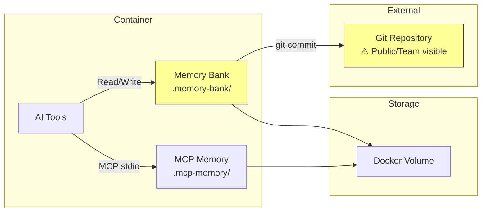
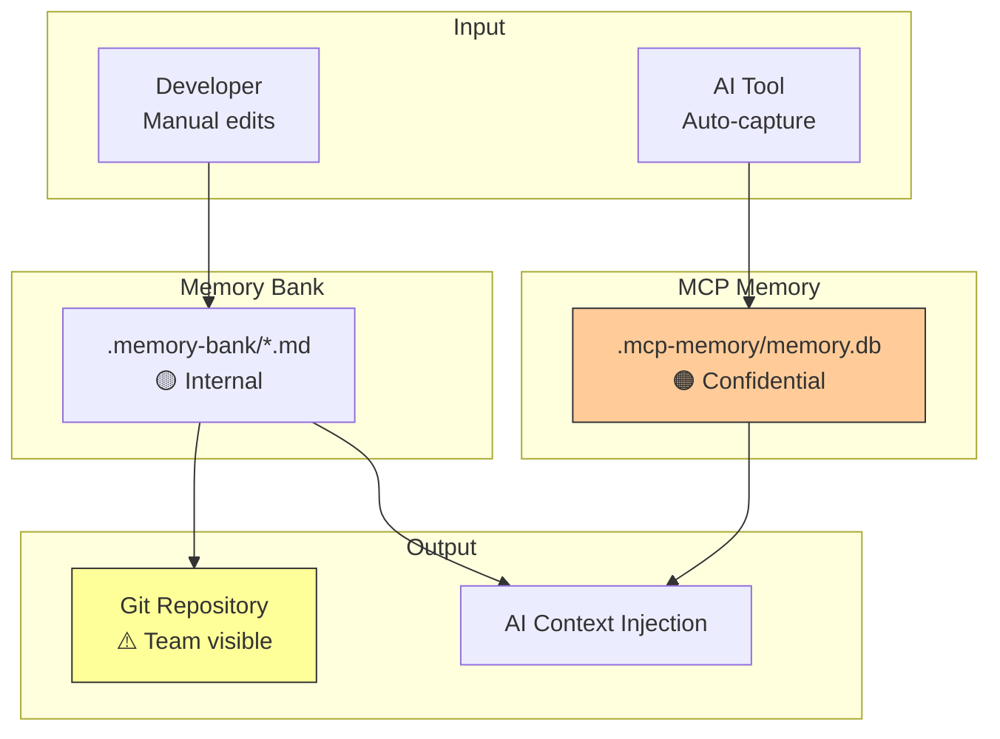
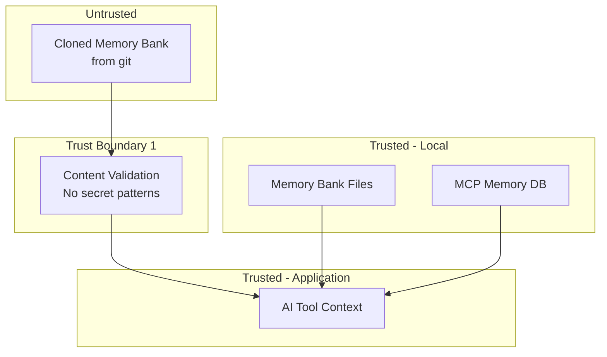

# 012-sec-persistent-memory

> **Document Type:** Security Review (Lightweight)  
> **Audience:** LLM agents, human reviewers  
> **Status:** In Review  
> **Last Updated:** 2026-01-23 <!-- @auto -->  
> **Reviewer:** Brian <!-- @human-required -->  
> **Risk Level:** Medium <!-- @human-required -->

---

## Review Tier Legend

| Marker | Tier | Speckit Behavior |
|--------|------|------------------|
| 🔴 `@human-required` | Human Generated | Prompt human to author; blocks until complete |
| 🟡 `@human-review` | LLM + Human Review | LLM drafts → prompt human to confirm/edit; blocks until confirmed |
| 🟢 `@llm-autonomous` | LLM Autonomous | LLM completes; no prompt; logged for audit |
| ⚪ `@auto` | Auto-generated | System fills (timestamps, links); no prompt |

---

## Linkage ⚪ `@auto`

| Document | ID | Relationship |
|----------|-----|--------------|
| Parent PRD | 012-prd-persistent-memory.md | Feature being reviewed |
| Architecture Decision Record | 012-ard-persistent-memory.md | Technical implementation |

---

## Purpose

This is a **lightweight security review** for the persistent memory system. Primary concerns: accidental secret exposure in git-tracked Memory Bank files, and sensitive code patterns in tactical memory.

---

## Feature Security Summary

### One-line Summary 🔴 `@human-required`
> Persistent memory stores project context across sessions—Memory Bank (git-tracked markdown) risks secret exposure; MCP Memory (git-ignored SQLite) may contain sensitive code patterns.

### Risk Assessment 🔴 `@human-required`
> **Risk Level:** Medium  
> **Justification:** Primary risk is accidental secret exposure in Memory Bank files committed to git; mitigated by documentation and pre-commit hooks.

---

## Attack Surface Analysis

### Exposure Points 🟡 `@human-review`

| Exposure Type | Details | Authentication | Authorization | Notes |
|---------------|---------|----------------|---------------|-------|
| Git Repository | .memory-bank/ committed to git | Git auth | Repo permissions | Secrets could leak |
| Local Filesystem | .mcp-memory/ on disk | No | File permissions | Contains session data |
| MCP Interface | Memory read/write via MCP | No | Container isolation | Internal only |
| **None** | — | — | — | *Delete this row* |

### Attack Surface Diagram 🟢 `@llm-autonomous`

### Exposure Checklist 🟢 `@llm-autonomous`

- [ ] **Internet-facing endpoints require authentication** — N/A, no endpoints
- [x] **No sensitive data in URL parameters** — N/A
- [ ] **File uploads validated** — N/A
- [ ] **Rate limiting configured** — N/A
- [ ] **CORS policy is restrictive** — N/A
- [ ] **No debug/admin endpoints exposed** — N/A
- [ ] **Webhooks validate signatures** — N/A

---

## Data Flow Analysis

### Data Inventory 🟡 `@human-review`

| Data Element | PRD Entity | Classification | Source | Destination | Retention | Encrypted Rest | Encrypted Transit | Residency |
|--------------|------------|----------------|--------|-------------|-----------|----------------|-------------------|-----------|
| Project goals/scope | projectbrief.md | Internal | Developer | Git repo | Permanent | No | HTTPS (git) | Any |
| Architecture decisions | systemPatterns.md | Internal | Developer | Git repo | Permanent | No | HTTPS (git) | Any |
| Current work notes | activeContext.md | Internal | Developer | Git repo | Permanent | No | HTTPS (git) | Any |
| Session code patterns | memory.db | **Confidential** | AI sessions | Local disk | 30 days | No | N/A | Container |
| Recent queries | memory.db | Internal | AI sessions | Local disk | 30 days | No | N/A | Container |

### Data Flow Diagram 🟢 `@llm-autonomous`

### Data Handling Checklist 🟢 `@llm-autonomous`

- [x] **No Restricted data stored unless absolutely required** — No secrets in memory
- [ ] **Confidential data encrypted at rest** — MCP Memory not encrypted (local)
- [ ] **All data encrypted in transit** — N/A, local storage
- [ ] **PII has defined retention policy** — No PII expected
- [x] **Logs do not contain Confidential/Restricted data** — Memory content not logged
- [x] **Secrets are not hardcoded** — Explicitly prohibited in Memory Bank
- [x] **Data minimization applied** — Session pruning after 30 days

---

## Third-Party & Supply Chain 🟡 `@human-review`

### New External Services

| Service | Purpose | Data Shared | Communication | Approved? |
|---------|---------|-------------|---------------|-----------|
| None | — | — | — | — |

### New Libraries/Dependencies

| Library | Version | License | Purpose | Security Check |
|---------|---------|---------|---------|----------------|
| mcp-memory-service | 1.x | MIT | Tactical memory storage | Pending |
| sqlite-vec | 0.x | MIT | Vector embeddings | Pending |

---

## CIA Impact Assessment

### Confidentiality 🟡 `@human-review`

| Asset at Risk | Exposure Scenario | Impact | Likelihood |
|---------------|-------------------|--------|------------|
| Secrets in Memory Bank | Developer accidentally includes API key, commits to git | High | Medium |
| Code patterns in MCP Memory | Attacker gains container access, reads memory.db | Medium | Low |
| Internal architecture | Memory Bank files in public repo | Low | Low |

**Confidentiality Risk Level:** Medium

### Integrity 🟡 `@human-review`

| Asset at Risk | Modification Scenario | Impact | Likelihood |
|---------------|----------------------|--------|------------|
| Memory Bank files | Attacker modifies to inject malicious patterns | Medium | Low |
| MCP Memory database | Corruption causes bad context injection | Low | Low |

**Integrity Risk Level:** Low

### Availability 🟡 `@human-review`

| Service/Function | Disruption Scenario | Impact | Likelihood |
|------------------|---------------------|--------|------------|
| Memory Bank | Files deleted | Low | Low |
| MCP Memory | Database corrupted | Low | Low |

**Availability Risk Level:** Low

### CIA Summary 🟢 `@llm-autonomous`

| Dimension | Risk Level | Primary Concern | Mitigation Priority |
|-----------|------------|-----------------|---------------------|
| **Confidentiality** | Medium | Secrets in git-tracked Memory Bank | High |
| **Integrity** | Low | Malicious pattern injection | Low |
| **Availability** | Low | Memory file deletion | Low |

**Overall CIA Risk:** Medium — *Primary concern is accidental secret exposure in Memory Bank*

---

## Trust Boundaries 🟡 `@human-review`

### Trust Boundary Checklist 🟢 `@llm-autonomous`

- [ ] **All input from untrusted sources is validated** — Cloned Memory Bank could contain malicious content
- [ ] **External API responses are validated** — N/A
- [ ] **Authorization checked at data access** — N/A, local files
- [ ] **Service-to-service calls are authenticated** — N/A

---

## Known Risks & Mitigations 🟡 `@human-review`

| ID | Risk Description | Severity | Mitigation | Status | Owner |
|----|------------------|----------|------------|--------|-------|
| R1 | Secrets accidentally committed in Memory Bank | 🟠 High | Pre-commit hook to scan for secrets; documentation | Open | Brian |
| R2 | Sensitive code patterns in MCP Memory | 🟡 Medium | Git-ignored; local-only storage; retention policy | Mitigated | Brian |
| R3 | Memory Bank files contain internal URLs | 🟡 Medium | Review before making repo public | Open | Brian |
| R4 | Malicious patterns in cloned Memory Bank | 🟡 Medium | Review cloned files; trust only known sources | Open | Brian |

### Risk Acceptance 🔴 `@human-required`

| Risk ID | Accepted By | Date | Justification | Review Date |
|---------|-------------|------|---------------|-------------|
| R2 | Brian | 2026-01-23 | MCP Memory is local-only, git-ignored, auto-pruned | 2026-04-23 |

---

## Security Requirements 🟡 `@human-review`

### Data Protection

| Req ID | Requirement | PRD AC | Verification Method |
|--------|-------------|--------|---------------------|
| SEC-1 | Memory Bank files must not contain secrets (API keys, passwords, tokens) | — | Pre-commit hook |
| SEC-2 | .mcp-memory/ must be in .gitignore | — | Template verification |
| SEC-3 | Memory Bank should not contain internal URLs or IPs | — | Manual review |
| SEC-4 | MCP Memory must have retention policy (default 30 days) | — | Config verification |

### Operational Security

| Req ID | Requirement | PRD AC | Verification Method |
|--------|-------------|--------|---------------------|
| SEC-5 | Pre-commit hook should scan Memory Bank for secret patterns | — | Hook installation |
| SEC-6 | Memory Bank templates should include security warnings | — | Template review |

---

## Compliance Considerations 🟡 `@human-review`

| Regulation | Applicable? | Relevant Requirements | N/A Justification |
|------------|-------------|----------------------|-------------------|
| GDPR | N/A | — | No personal data in memory system |
| CCPA | N/A | — | No personal data in memory system |
| SOC 2 | N/A | — | Internal development tooling |
| HIPAA | N/A | — | No health information |
| PCI-DSS | N/A | — | No payment data |

---

## Review Findings

### Issues Identified 🟡 `@human-review`

| ID | Finding | Severity | Category | Recommendation | Status |
|----|---------|----------|----------|----------------|--------|
| F1 | No automated secret scanning for Memory Bank | 🟠 High | Data | Implement pre-commit hook with gitleaks or similar | Open |
| F2 | Memory Bank templates don't warn about secrets | 🟡 Medium | Data | Add warning comments to templates | Open |
| F3 | MCP Memory not encrypted at rest | 🟢 Low | Data | Accept risk for local-only storage; encrypt if sharing | Open |

### Positive Observations 🟢 `@llm-autonomous`

- Clear separation between git-tracked and git-ignored memory
- MCP Memory has retention policy to limit data accumulation
- Architecture explicitly prohibits secrets in Memory Bank
- Local-only storage for tactical memory limits exposure

---

## Open Questions 🟡 `@human-review`

- [ ] **Q1:** Should we implement secret scanning as a hard requirement?
- [ ] **Q2:** Should MCP Memory be encrypted for sensitive projects?

---

## Changelog ⚪ `@auto`

| Version | Date | Author | Changes |
|---------|------|--------|---------|
| 0.1 | 2026-01-23 | Claude | Initial review |

---

## Review Sign-off 🔴 `@human-required`

| Role | Name | Date | Decision |
|------|------|------|----------|
| Security Reviewer | | | [ ] Approved / [ ] Approved with conditions / [ ] Rejected |
| Feature Owner | Brian | | [ ] Acknowledged |

### Conditions for Approval (if applicable) 🔴 `@human-required`

- [ ] F1: Implement pre-commit hook for secret scanning before team use
- [ ] F2: Add security warning comments to Memory Bank templates

---

## Security Requirements Traceability 🟢 `@llm-autonomous`

| SEC Req ID | PRD Req ID | PRD AC ID | Test Type | Test Location |
|------------|------------|-----------|-----------|---------------|
| SEC-1 | — | — | Pre-commit hook | .pre-commit-config.yaml |
| SEC-2 | M-4 | — | Template | .gitignore |
| SEC-3 | — | — | Manual | PR review |
| SEC-4 | S-5 | — | Config | .mcp-memory/config.json |

---

## Review Checklist 🟢 `@llm-autonomous`

Before marking as Approved:
- [x] Attack surface documented with auth/authz status for each exposure
- [x] Exposure Points table has no contradictory rows
- [x] All data elements are classified using the 4-tier model
- [x] Third-party dependencies and services are listed
- [x] CIA impact is assessed with Low/Medium/High ratings
- [x] Trust boundaries are identified
- [x] Security requirements have verification methods specified
- [ ] No Critical/High findings remain Open
- [x] Compliance N/A items have justification
- [x] Risk acceptance has named approver and review date
