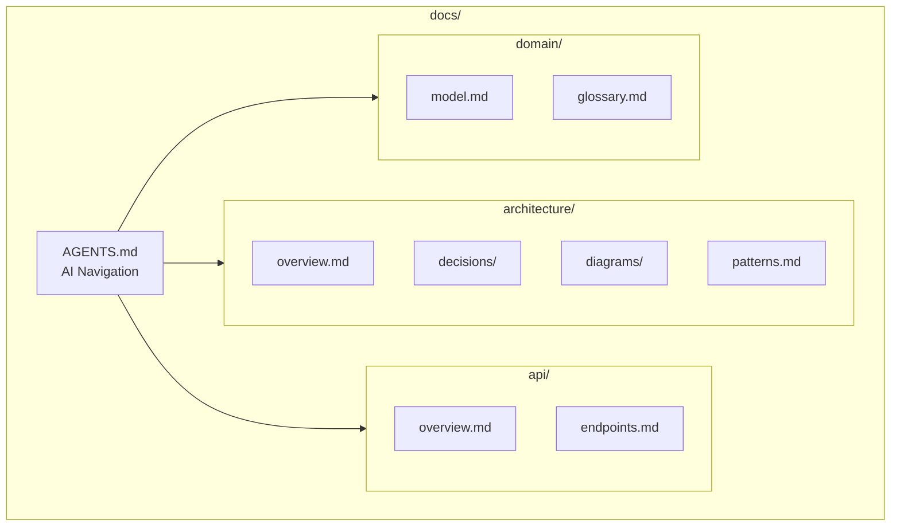
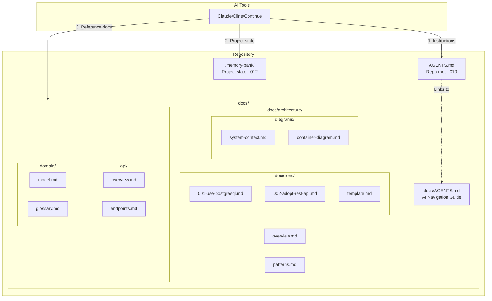

# 013-ard-project-knowledge

> **Document Type:** Architecture Decision Record  
> **Audience:** LLM agents, human reviewers  
> **Status:** Accepted  
> **Last Updated:** 2026-01-23 <!-- @auto -->  
> **Owner:** Brian <!-- @human-required -->  
> **Deciders:** Brian <!-- @human-required -->

---

## Review Tier Legend

| Marker | Tier | Speckit Behavior |
|--------|------|------------------|
| 🔴 `@human-required` | Human Generated | Prompt human to author; blocks until complete |
| 🟡 `@human-review` | LLM + Human Review | LLM drafts → prompt human to confirm/edit; blocks until confirmed |
| 🟢 `@llm-autonomous` | LLM Autonomous | LLM completes; no prompt; logged for audit |
| ⚪ `@auto` | Auto-generated | System fills (timestamps, links); no prompt |

---

## Linkage ⚪ `@auto`

| Document | ID | Relationship |
|----------|-----|--------------|
| Parent PRD | 013-prd-project-knowledge.md | Requirements this architecture satisfies |
| Security Review | 013-sec-project-knowledge.md | Security implications of this decision |
| Supersedes | — | N/A (greenfield) |
| Superseded By | — | — |

---

## Summary

### Decision 🔴 `@human-required`
> Use structured markdown documentation with Architecture Decision Records (ADRs) and Mermaid diagrams, organized in a `docs/` directory with AI-specific navigation via `docs/AGENTS.md`.

### TL;DR for Agents 🟡 `@human-review`
> Project knowledge lives in `docs/` with architecture, ADRs, domain model, and API documentation. Before implementing significant features, check `docs/architecture/decisions/` for existing ADRs. Use Mermaid for diagrams (AI-parseable). Start navigation at `docs/AGENTS.md`. This is distinct from Memory Bank (012)—docs/ is reference documentation, Memory Bank is project state.

---

## Context

### Problem Space 🔴 `@human-required`
AI coding agents need to understand project architecture to make consistent decisions. Without structured documentation, agents may reinvent rejected approaches or create code that doesn't fit the overall design. We need documentation that explains "why" decisions were made, not just "what" exists.

### Decision Scope 🟡 `@human-review`

**This ARD decides:**
- Documentation directory structure (`docs/`)
- ADR format and location
- Diagram format (Mermaid)
- AI navigation pattern (`docs/AGENTS.md`)

**This ARD does NOT decide:**
- Memory Bank structure (012)
- AGENTS.md content in repo root (010)
- Documentation tooling (Docusaurus, MkDocs, etc.)

### Current State 🟢 `@llm-autonomous`
N/A - greenfield implementation. Projects may have ad-hoc documentation but no standardized structure for AI consumption.

### Driving Requirements 🟡 `@human-review`

| PRD Req ID | Requirement Summary | Architectural Implication |
|------------|---------------------|---------------------------|
| M-1 | Architecture documentation readable by AI | Markdown format, clear structure |
| M-2 | ADRs explaining past choices | Standard ADR template and location |
| M-3 | API and interface documentation | Dedicated `docs/api/` section |
| M-4 | Domain model documentation | Dedicated `docs/domain/` section |
| M-5 | Markdown format for portability | No proprietary formats |
| M-6 | Clear organization for AI navigation | `docs/AGENTS.md` navigation guide |
| S-1 | Text-based diagrams | Mermaid for AI parseability |

**PRD Constraints inherited:**
- Documentation must be markdown (M-5)
- Must be navigable by AI tools (M-6)

---

## Decision Drivers 🔴 `@human-required`

1. **AI Parseability:** Documentation must be readable and understandable by AI *(traces to M-1)*
2. **Human Maintainability:** Developers must be able to easily update docs
3. **Version Control:** Documentation should be diffable and reviewable in PRs
4. **Decision Capture:** Past decisions must be discoverable to prevent re-litigation *(traces to M-2)*
5. **Portability:** No vendor lock-in to documentation platforms *(traces to M-5)*

---

## Options Considered 🟡 `@human-review`

### Option 0: No Standardized Documentation

**Description:** Ad-hoc documentation in README, comments, and scattered files.

| Driver | Rating | Notes |
|--------|--------|-------|
| AI Parseability | ❌ Poor | No consistent structure to navigate |
| Human Maintainability | ⚠️ Medium | Easy to write, hard to find |
| Version Control | ⚠️ Medium | Files exist but no structure |
| Decision Capture | ❌ Poor | Decisions lost in PRs/Slack |
| Portability | ✅ Good | Plain text |

**Why not viable:** AI agents can't reliably find architectural context; developers re-debate settled decisions.

---

### Option 1: Wiki/Notion Style

**Description:** Documentation in Notion, Confluence, or similar platform.

| Driver | Rating | Notes |
|--------|--------|-------|
| AI Parseability | ❌ Poor | Requires API access, not in repo |
| Human Maintainability | ✅ Good | Rich editing experience |
| Version Control | ❌ Poor | Separate from code, diverges |
| Decision Capture | ⚠️ Medium | Can store ADRs but not versioned with code |
| Portability | ❌ Poor | Vendor lock-in |

**Why not selected:** Not accessible to AI agents without API integration; not versioned with code.

---

### Option 2: Structured Markdown in `docs/` (Selected)

**Description:** Organized markdown documentation in repository with ADRs, diagrams, and AI navigation.



| Driver | Rating | Notes |
|--------|--------|-------|
| AI Parseability | ✅ Good | Markdown with clear structure |
| Human Maintainability | ✅ Good | Familiar format, IDE support |
| Version Control | ✅ Good | Reviewed in PRs with code |
| Decision Capture | ✅ Good | ADRs in dedicated directory |
| Portability | ✅ Good | Plain markdown, no vendor |

**Pros:**
- Versioned with code
- AI can navigate via file structure
- Standard ADR format
- Mermaid diagrams AI-parseable

**Cons:**
- Requires discipline to maintain
- No rich editing UI
- Manual cross-linking

---

## Decision

### Selected Option 🔴 `@human-required`
> **Option 2: Structured Markdown in `docs/`**

### Rationale 🔴 `@human-required`

Structured markdown in `docs/` provides the best balance of AI parseability, version control integration, and portability. Key benefits:

1. **Versioned with code:** Documentation changes reviewed in same PR as code changes
2. **AI-friendly:** Clear directory structure with `docs/AGENTS.md` as entry point
3. **ADRs capture decisions:** Prevents re-litigation of settled architectural questions
4. **Mermaid diagrams:** Text-based, AI can parse relationships
5. **No dependencies:** Works with any IDE, any hosting, any AI tool

#### Simplest Implementation Comparison 🟡 `@human-review`

| Aspect | Simplest Possible | Selected Option | Justification for Complexity |
|--------|-------------------|-----------------|------------------------------|
| Structure | Single README | Organized `docs/` | Navigation requirement (M-6) |
| Decisions | Comments in code | ADR directory | Decision capture requirement (M-2) |
| Diagrams | ASCII art | Mermaid | Parseability and rendering (S-1) |

**Complexity justified by:** PRD requires both navigation (M-6) and decision capture (M-2). Flat structure doesn't scale; organized `docs/` meets both requirements with minimal overhead.

### Architecture Diagram 🟡 `@human-review`



---

## Technical Specification

### Component Overview 🟡 `@human-review`

| Component | Responsibility | Interface | Dependencies |
|-----------|---------------|-----------|--------------|
| docs/AGENTS.md | AI navigation entry point | Markdown | None |
| docs/architecture/ | System architecture documentation | Markdown + Mermaid | None |
| docs/architecture/decisions/ | Architecture Decision Records | Markdown (ADR format) | None |
| docs/api/ | API documentation | Markdown | None |
| docs/domain/ | Domain model and glossary | Markdown | None |

### Directory Structure 🟡 `@human-review`

```
docs/
├── AGENTS.md                    # AI navigation guide
├── architecture/
│   ├── overview.md              # High-level system architecture
│   ├── patterns.md              # Design patterns in use
│   ├── decisions/               # Architecture Decision Records
│   │   ├── 001-[slug].md
│   │   ├── 002-[slug].md
│   │   └── template.md          # ADR template
│   └── diagrams/                # Mermaid diagrams
│       ├── system-context.md
│       └── container-diagram.md
├── api/
│   ├── overview.md              # API design principles
│   └── endpoints.md             # Endpoint documentation
├── domain/
│   ├── model.md                 # Domain model
│   ├── glossary.md              # Domain terminology
│   └── workflows.md             # Business processes
├── operations/
│   ├── deployment.md
│   └── runbooks/
└── security/
    ├── threat-model.md
    └── auth.md
```

### Interface Definitions 🟡 `@human-review`

**ADR Template:**
```markdown
# ADR-NNN: [Title]

## Status
[Proposed | Accepted | Deprecated | Superseded by ADR-XXX]

## Context
[What motivates this decision?]

## Decision
[What change are we making?]

## Consequences
[What becomes easier or harder?]

## Alternatives Considered
[What other options were evaluated?]
```

**docs/AGENTS.md Template:**
```markdown
# Documentation Guide for AI Agents

## Quick Reference
- **Architecture decisions**: `architecture/decisions/`
- **System overview**: `architecture/overview.md`
- **API details**: `api/endpoints.md`
- **Domain concepts**: `domain/glossary.md`

## When to Consult
- Before adding features: Check relevant ADRs
- When unsure about patterns: Check `architecture/patterns.md`
- For API changes: Review `api/overview.md`
```

---

## Constraints & Boundaries

### Technical Constraints 🟡 `@human-review`

**Inherited from PRD:**
- Markdown format only (M-5)
- Must be navigable by AI (M-6)

**Added by this Architecture:**
- **Diagrams:** Mermaid only (AI-parseable, renders in GitHub)
- **ADRs:** Follow standard ADR template
- **File size:** Individual docs under 500 lines
- **Links:** Relative paths for portability

### Architectural Boundaries 🟡 `@human-review`

- **Owns:** `docs/` directory structure and content standards
- **Interfaces With:** AGENTS.md (010), Memory Bank (012)
- **Does NOT Own:** Documentation tooling, hosting, rendering

### Implementation Guardrails 🟡 `@human-review`

> ⚠️ **Critical for LLM Agents:**

- [ ] **DO NOT** put secrets, credentials, or internal URLs in docs/ *(security)*
- [ ] **DO NOT** create ADRs without Status field *(template compliance)*
- [ ] **DO NOT** use non-Mermaid diagram formats *(S-1 parseability)*
- [ ] **MUST** check ADRs before proposing architectural changes *(M-2)*
- [ ] **MUST** update docs/AGENTS.md when adding new documentation sections
- [ ] **MUST** use relative links between documents *(portability)*

---

## Consequences 🟡 `@human-review`

### Positive
- AI agents can navigate to relevant documentation
- Architectural decisions are captured and discoverable
- Documentation versioned with code
- No vendor lock-in

### Negative
- Requires discipline to keep docs updated
- No rich editing experience
- Manual effort to create ADRs

### Risks & Mitigations

| Risk | Likelihood | Impact | Mitigation |
|------|------------|--------|------------|
| Documentation becomes stale | High | Medium | Include in PR checklist; ADR for every decision |
| AI misinterprets docs | Medium | Low | Structured templates; test with AI tools |
| Docs grow too large | Medium | Low | Keep files under 500 lines; split as needed |

---

## Implementation Guidance

### Suggested Implementation Order 🟢 `@llm-autonomous`
1. Create `docs/` directory structure
2. Create `docs/AGENTS.md` navigation template
3. Create ADR template in `docs/architecture/decisions/`
4. Write initial `docs/architecture/overview.md`
5. Create `docs/domain/glossary.md` with key terms
6. Backfill ADRs for existing major decisions

### Testing Strategy 🟢 `@llm-autonomous`

| Layer | Test Type | Coverage Target | Notes |
|-------|-----------|-----------------|-------|
| Lint | Markdown | All files | markdownlint |
| Lint | Mermaid | All diagrams | mermaid-cli validation |
| Manual | AI navigation | Key paths | Test with Claude Code |
| Manual | ADR discovery | All ADRs | AI finds relevant decisions |

### Reference Implementations 🟡 `@human-review`

- [ADR GitHub](https://adr.github.io/) *(external, approved)*
- [C4 Model](https://c4model.com/) *(external, approved)*
- [Mermaid Documentation](https://mermaid.js.org/) *(external, approved)*

### Anti-patterns to Avoid 🟡 `@human-review`
- **Don't:** Create ADRs after implementation
  - **Why:** Loses context; doesn't inform the decision
  - **Instead:** Create ADR during decision-making

- **Don't:** Duplicate code comments in docs
  - **Why:** Maintenance burden; diverges
  - **Instead:** Docs for architecture; comments for code

---

## Compliance & Cross-cutting Concerns

### Security Considerations 🟡 `@human-review`
- No secrets in documentation
- Security documentation should not reveal vulnerabilities
- See 013-sec-project-knowledge.md

### Observability 🟢 `@llm-autonomous`
- **Metrics:** Documentation freshness (last commit date)
- **Alerts:** None (documentation is passive)

### Error Handling Strategy 🟢 `@llm-autonomous`
N/A - Documentation is passive content; no runtime errors.

---

## Migration Plan (if applicable) 🟡 `@human-review`

N/A - Greenfield implementation.

### Rollback Plan 🔴 `@human-required`

**Rollback Triggers:**
- Documentation structure causes AI confusion
- Maintenance burden too high

**Rollback Decision Authority:** Brian (Owner)

**Rollback Procedure:**
1. Flatten docs/ structure to README + inline docs
2. Keep existing content, remove structure
3. AI tools fall back to code-only context

---

## Open Questions 🟡 `@human-review`

- [x] **Q1:** Should docs/ include user documentation?
  > Resolved: No, separate concern. docs/ is for AI/developer reference.

- [ ] **Q2:** Should we auto-generate some documentation from code?
  > Deferred to C-1 (Could Have)

---

## Changelog ⚪ `@auto`

| Version | Date | Author | Changes |
|---------|------|--------|---------|
| 0.1 | 2026-01-23 | Brian | Initial proposal |
| 1.0 | 2026-01-23 | Brian | Accepted |

---

## Traceability Matrix 🟢 `@llm-autonomous`

| PRD Req ID | Decision Driver | Option Rating | Component | Notes |
|------------|-----------------|---------------|-----------|-------|
| M-1 | AI Parseability | Option 2: ✅ | docs/ structure | Clear navigation |
| M-2 | Decision Capture | Option 2: ✅ | ADR directory | Standard format |
| M-3 | AI Parseability | Option 2: ✅ | docs/api/ | Dedicated section |
| M-4 | AI Parseability | Option 2: ✅ | docs/domain/ | Dedicated section |
| M-5 | Portability | Option 2: ✅ | All | Markdown only |
| M-6 | AI Parseability | Option 2: ✅ | docs/AGENTS.md | Navigation guide |
| S-1 | AI Parseability | Option 2: ✅ | Mermaid diagrams | Text-based |

---

## Review Checklist 🟢 `@llm-autonomous`

Before marking as Accepted:
- [x] All PRD Must Have requirements appear in Driving Requirements
- [x] Option 0 (Status Quo) is documented
- [x] Simplest Implementation comparison is completed
- [x] Decision drivers are prioritized and addressed
- [x] At least 2 options were seriously considered
- [x] Constraints distinguish inherited vs. new
- [x] Component names are consistent across all diagrams and tables
- [x] Implementation guardrails reference specific PRD constraints
- [x] Rollback triggers and authority are defined
- [x] Security review is linked
- [x] No open questions blocking implementation
