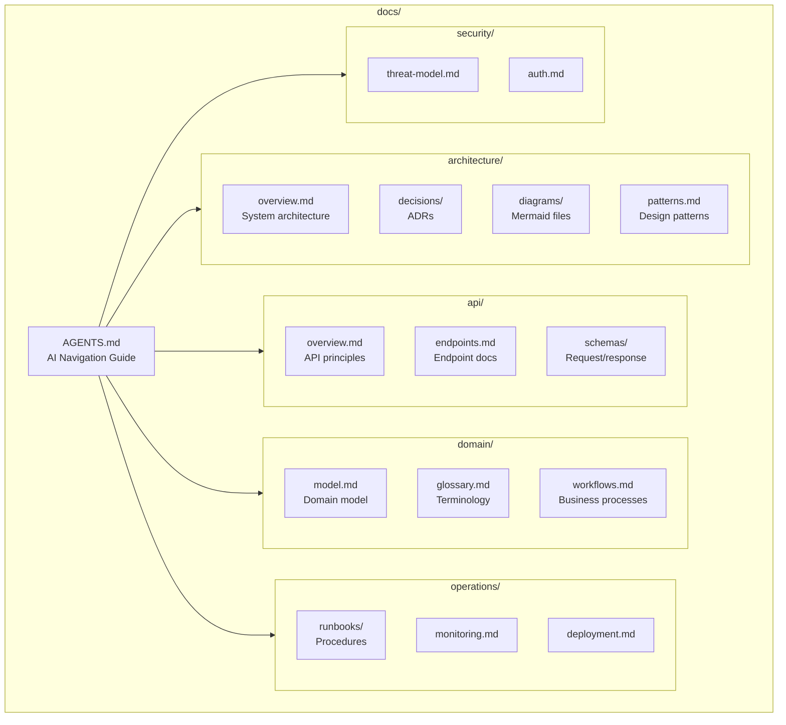
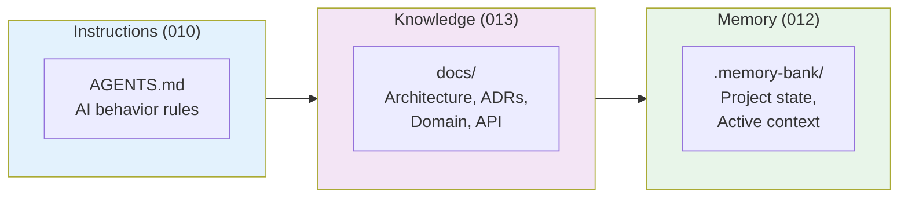
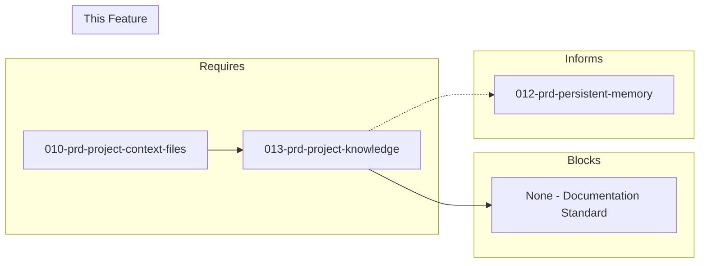

# 013-prd-project-knowledge

> **Document Type:** Product Requirements Document  
> **Audience:** LLM agents, human reviewers  
> **Status:** In Progress  
> **Last Updated:** 2026-01-23 <!-- @auto -->  
> **Owner:** Brian <!-- @human-required -->

---

## Review Tier Legend

| Marker | Tier | Speckit Behavior |
|--------|------|------------------|
| 🔴 `@human-required` | Human Generated | Prompt human to author; blocks until complete |
| 🟡 `@human-review` | LLM + Human Review | LLM drafts → prompt human to confirm/edit; blocks until confirmed |
| 🟢 `@llm-autonomous` | LLM Autonomous | LLM completes; no prompt; logged for audit |
| ⚪ `@auto` | Auto-generated | System fills (timestamps, links); no prompt |

---

## Document Completion Order

> ⚠️ **For LLM Agents:** Complete sections in this order. Do not fill downstream sections until upstream human-required inputs exist.

1. **Context** (Background, Scope) → requires human input first
2. **Problem Statement & User Story** → requires human input
3. **Requirements** (Must/Should/Could/Won't) → requires human input
4. **Technical Constraints** → human review
5. **Diagrams, Data Model, Interface** → LLM can draft after above exist
6. **Acceptance Criteria** → derived from requirements
7. **Everything else** → can proceed

---

## Context

### Background 🔴 `@human-required`

AI coding agents need structured documentation to understand project architecture, make consistent decisions, and follow established patterns. While AGENTS.md (PRD 010) provides instructions and Memory Bank (PRD 012) provides session context, projects also need comprehensive technical documentation specifically structured for AI consumption—architecture diagrams, decision records, API specifications, and domain models.

This PRD defines the human-maintained technical documentation that helps AI understand the "why" behind code, enabling better autonomous decision-making.

### Scope Boundaries 🟡 `@human-review`

**In Scope:**
- Architecture documentation readable by AI agents
- Architecture Decision Records (ADRs)
- API and interface documentation
- Domain model and business logic documentation
- Mermaid diagrams for visual architecture
- docs/AGENTS.md navigation guide for AI tools

**Out of Scope:**
- User-facing documentation — *separate concern (user guides, tutorials)*
- Marketing or sales documentation — *not for AI consumption*
- Auto-updating documentation without review — *human oversight required*
- Proprietary documentation formats — *markdown for portability*

### Glossary 🟡 `@human-review`

| Term | Definition |
|------|------------|
| ADR | Architecture Decision Record — document capturing a significant architectural decision, its context, and consequences |
| Mermaid | Text-based diagramming language; AI-parseable, renders in markdown |
| C4 Model | Architecture documentation approach: Context, Container, Component, Code diagrams |
| Domain model | Documentation of business entities, relationships, and rules |
| docs/AGENTS.md | Navigation guide specifically for AI tools to find relevant documentation |
| Runbook | Operational procedure documentation for common tasks |

### Related Documents ⚪ `@auto`

| Document | Link | Relationship |
|----------|------|--------------|
| Architecture Decision Record | 013-ard-project-knowledge.md | Defines technical approach |
| Project Context Files PRD | 010-prd-project-context-files.md | AGENTS.md foundation |
| Persistent Memory PRD | 012-prd-persistent-memory.md | Session context complement |

---

## Problem Statement 🔴 `@human-required`

AI coding agents need structured documentation to understand project architecture, make consistent decisions, and follow established patterns. While AGENTS.md (PRD 010) provides instructions and Memory Bank (PRD 012) provides session context, projects also need comprehensive technical documentation specifically structured for AI consumption—architecture diagrams, decision records, API specifications, and domain models.

**Goal**: Define a standardized project knowledge structure that helps AI agents understand the "why" behind code, not just the "what", enabling better autonomous decision-making.

**Cost of not solving**: AI makes decisions without understanding architectural context, leading to inconsistent patterns, reinventing rejected approaches, and code that doesn't fit the overall design.

### User Story 🔴 `@human-required`

> As a **developer working with AI coding assistants**, I want **structured project documentation that AI can navigate and understand** so that **AI makes architecturally consistent decisions and doesn't repeat past mistakes**.

---

## Assumptions & Risks 🟡 `@human-review`

### Assumptions

- [A-1] AI tools can parse and understand markdown documentation
- [A-2] Mermaid diagrams provide sufficient visual information when parsed as text
- [A-3] Developers will create and maintain ADRs for significant decisions
- [A-4] Documentation structure is consistent enough for AI navigation
- [A-5] docs/AGENTS.md provides effective AI-specific navigation

### Risks

| ID | Risk | Likelihood | Impact | Mitigation |
|----|------|------------|--------|------------|
| R-1 | Documentation becomes stale | High | High | Include in PR checklist; ADR for every significant decision |
| R-2 | AI misinterprets documentation | Medium | Medium | Structured templates; explicit language; test with AI tools |
| R-3 | Documentation overhead slows development | Medium | Medium | Start minimal; expand based on value; templates reduce friction |
| R-4 | Inconsistent documentation structure | Medium | Low | Enforce templates; linting rules |
| R-5 | Too much documentation overwhelms AI context | Low | Medium | Keep docs focused; use docs/AGENTS.md for navigation |

---

## Feature Overview

### Documentation Structure 🟡 `@human-review`



### Documentation Layers 🟡 `@human-review`



---

## Requirements

### Must Have (M) — MVP, launch blockers 🔴 `@human-required`

- [ ] **M-1:** System shall include architecture documentation readable by AI agents
- [ ] **M-2:** System shall include Architecture Decision Records (ADRs) explaining past choices
- [ ] **M-3:** System shall include API and interface documentation
- [ ] **M-4:** System shall include domain model and business logic documentation
- [ ] **M-5:** System shall use Markdown format for portability and AI parsing
- [ ] **M-6:** System shall have clear organization that AI tools can navigate

### Should Have (S) — High value, not blocking 🔴 `@human-required`

- [ ] **S-1:** Diagrams should use text-based formats (Mermaid, PlantUML)
- [ ] **S-2:** System should include runbook documentation for common operations
- [ ] **S-3:** System should include dependency and integration documentation
- [ ] **S-4:** System should include security and compliance documentation
- [ ] **S-5:** System should include changelog and migration history
- [ ] **S-6:** Documents should link to related documents

### Could Have (C) — Nice to have, if time permits 🟡 `@human-review`

- [ ] **C-1:** System could auto-generate documentation from code analysis
- [ ] **C-2:** System could include documentation validation/freshness checks
- [ ] **C-3:** System could integrate with IDE documentation viewers
- [ ] **C-4:** System could include search index for documentation
- [ ] **C-5:** System could support version-specific documentation branches
- [ ] **C-6:** System could include documentation templates for common patterns

### Won't Have (W) — Explicitly deferred 🟡 `@human-review`

- [ ] **W-1:** User-facing documentation — *Reason: Separate concern*
- [ ] **W-2:** Marketing or sales documentation — *Reason: Not for AI consumption*
- [ ] **W-3:** Auto-updating documentation without review — *Reason: Human oversight required*
- [ ] **W-4:** Proprietary documentation formats — *Reason: Markdown for portability*

---

## Technical Constraints 🟡 `@human-review`

- **Format:** Markdown only; renders in GitHub, IDEs, and AI tools
- **Diagrams:** Mermaid preferred (text-based, AI-parseable)
- **ADR Format:** Follow standard ADR template (Status, Context, Decision, Consequences)
- **Navigation:** docs/AGENTS.md provides AI-specific entry point
- **Size:** Individual docs under 500 lines; split if larger
- **Links:** Use relative links for portability

---

## Data Model (if applicable) 🟡 `@human-review`

### Recommended Directory Layout

```
docs/
├── AGENTS.md                    # AI navigation guide
├── architecture/
│   ├── overview.md              # High-level system architecture
│   ├── decisions/               # Architecture Decision Records
│   │   ├── 001-use-postgresql.md
│   │   ├── 002-adopt-cqrs.md
│   │   └── template.md
│   ├── diagrams/                # Mermaid/PlantUML diagrams
│   │   ├── system-context.md
│   │   ├── container-diagram.md
│   │   └── component-diagram.md
│   └── patterns.md              # Patterns used in the codebase
├── api/
│   ├── overview.md              # API design principles
│   ├── endpoints.md             # Endpoint documentation
│   └── schemas/                 # Request/response schemas
├── domain/
│   ├── model.md                 # Domain model explanation
│   ├── glossary.md              # Domain terminology
│   └── workflows.md             # Business process flows
├── operations/
│   ├── runbooks/                # Operational procedures
│   ├── monitoring.md            # Observability setup
│   └── deployment.md            # Deployment procedures
└── security/
    ├── threat-model.md          # Security considerations
    └── auth.md                  # Authentication/authorization
```

---

## Interface Contract (if applicable) 🟡 `@human-review`

### ADR Template

```markdown
# ADR-NNN: [Title]

## Status
[Proposed | Accepted | Deprecated | Superseded by ADR-XXX]

## Context
[What is the issue that we're seeing that is motivating this decision?]

## Decision
[What is the change that we're proposing and/or doing?]

## Consequences
[What becomes easier or harder as a result of this decision?]

## Alternatives Considered
[What other options were evaluated?]

## References
[Links to relevant resources, discussions, or related ADRs]
```

### docs/AGENTS.md Template

```markdown
# Documentation Guide for AI Agents

## Quick Reference
- **Architecture decisions**: See `architecture/decisions/` for ADRs
- **System overview**: Start with `architecture/overview.md`
- **API details**: Check `api/endpoints.md`
- **Domain concepts**: Refer to `domain/glossary.md`

## When to Consult Documentation
- Before adding new features: Read relevant ADRs
- When unsure about patterns: Check `architecture/patterns.md`
- For API changes: Review `api/overview.md` principles
- For domain logic: Consult `domain/model.md`

## Documentation Conventions
- ADRs follow [template](architecture/decisions/template.md)
- Diagrams use Mermaid format
- All docs are markdown with frontmatter metadata
```

---

## Evaluation Criteria 🟡 `@human-review`

| Criterion | Weight | Metric | Target | Notes |
|-----------|--------|--------|--------|-------|
| AI parseability | Critical | AI can read/understand | Yes | M-5, M-6 |
| Human maintainability | Critical | Easy to update | <15 min per doc | Templates help |
| Portability | Critical | Works with any AI tool | Yes | Markdown standard |
| Completeness | High | Covers arch/decisions/domain | Yes | M-1 through M-4 |
| Freshness | High | Easy to keep current | PR checklist | R-1 mitigation |
| Navigation | Medium | AI finds relevant docs | docs/AGENTS.md | M-6 |
| Visualization | Medium | Diagrams for complex concepts | Mermaid | S-1 |

---

## Tool/Approach Candidates 🟡 `@human-review`

| Approach | Pros | Cons | Recommendation |
|----------|------|------|----------------|
| Structured Markdown + ADRs | Human-readable, git-friendly, AI-parseable, standard | Requires discipline | **SELECTED** |
| Notion/Confluence | Rich features, collaboration | Not git-friendly, proprietary | Not recommended |
| Generated docs (Swagger, etc.) | Auto-updated | Limited context, no "why" | Complement, not replace |
| Wiki | Easy editing | Version control issues | Not recommended |

### Selected Approach 🔴 `@human-required`

> **Decision:** Structured markdown documentation with ADRs and Mermaid diagrams  
> **Rationale:**
> - Markdown: Universal, AI-parseable, git-friendly
> - ADRs: Capture the "why" behind decisions
> - Mermaid: Text-based diagrams AI can parse
> - docs/AGENTS.md: AI-specific navigation

---

## Acceptance Criteria 🟡 `@human-review`

| AC ID | Requirement | Given | When | Then |
|-------|-------------|-------|------|------|
| AC-1 | M-1 | Architecture questions | AI reads docs | It understands system structure |
| AC-2 | M-2 | New feature request | AI checks ADRs | It follows established patterns |
| AC-3 | M-4 | Domain terminology | AI reads glossary | It uses correct terms |
| AC-4 | S-1 | Mermaid diagrams | AI parses them | It understands relationships |
| AC-5 | M-6 | docs/AGENTS.md exists | AI navigates docs | It finds relevant information |
| AC-6 | M-5 | Documentation updates | Developers edit | Process is straightforward (<15 min) |
| AC-7 | M-2 | New decision made | ADR created | It follows template |

### Edge Cases 🟢 `@llm-autonomous`

- [ ] **EC-1:** (M-6) When docs/AGENTS.md is missing, then AI can still read individual doc files
- [ ] **EC-2:** (M-2) When no ADR exists for a topic, then AI states it found no prior decision
- [ ] **EC-3:** (S-1) When Mermaid diagram has syntax errors, then AI extracts what information it can
- [ ] **EC-4:** (M-5) When documentation is very long, then AI focuses on relevant sections

---

## Dependencies 🟡 `@human-review`



### Requires (must be complete before this PRD)

- **010-prd-project-context-files** — AGENTS.md foundation; this extends with docs/AGENTS.md

### Blocks (waiting on this PRD)

- None — this is a documentation standard

### Informs (decisions here affect future PRDs) 🔴 `@human-required`

| Open Item | Dependent PRD | What We Need | Working Assumption |
|-----------|---------------|--------------|-------------------|
| docs/ vs Memory Bank boundary | 012-prd-persistent-memory | What goes where | docs/ for architecture; Memory Bank for state |

### External

- **ADR GitHub Community** (adr.github.io) — ADR standards
- **Mermaid** (mermaid.js.org) — Diagram syntax

---

## Security Considerations 🟡 `@human-review`

| Aspect | Assessment | Notes |
|--------|------------|-------|
| Internet Exposure | No | Static files in repo |
| Sensitive Data | Low risk | Architecture docs, no secrets |
| Authentication Required | N/A | Files part of codebase |
| Security Review Required | Low | Review security/ docs content |

### Security-Specific Requirements

- **SEC-1:** security/ docs should not contain actual credentials or secrets
- **SEC-2:** threat-model.md should be reviewed for sensitive disclosure
- **SEC-3:** API docs should not include production API keys

---

## Implementation Guidance 🟢 `@llm-autonomous`

### Suggested Approach

1. **Create docs/ directory structure** from template
2. **Create docs/AGENTS.md** navigation guide
3. **Write initial ADRs** for existing major decisions
4. **Create architecture overview** with Mermaid diagrams
5. **Add domain glossary** with key terms
6. **Set up ADR creation script** for consistency

### ADR Creation Script

```bash
#!/bin/bash
# Create new ADR
# Usage: ./scripts/new-adr.sh "Use PostgreSQL for persistence"

TITLE="$1"
if [ -z "$TITLE" ]; then
    echo "Usage: $0 'ADR Title'"
    exit 1
fi

# Find next ADR number
NEXT=$(ls docs/architecture/decisions/*.md 2>/dev/null | grep -oP '\d+' | sort -n | tail -1)
NEXT=$((${NEXT:-0} + 1))
NUM=$(printf "%03d" $NEXT)

# Create slug from title
SLUG=$(echo "$TITLE" | tr '[:upper:]' '[:lower:]' | tr ' ' '-' | tr -cd '[:alnum:]-')

FILE="docs/architecture/decisions/${NUM}-${SLUG}.md"

cat > "$FILE" << EOF
# ADR-${NUM}: ${TITLE}

## Status
Proposed

## Context
[What is the issue motivating this decision?]

## Decision
[What is the change we're proposing?]

## Consequences
[What becomes easier or harder?]

## Alternatives Considered
[What other options were evaluated?]

## References
- [Related resource]
EOF

echo "Created: $FILE"
```

### Anti-patterns to Avoid

- **Documenting implementation details** — Focus on architecture, not code
- **Writing ADRs after the fact** — Create ADRs during decision-making
- **Duplicating code comments** — Docs for context, comments for code
- **Over-documenting** — Start minimal, expand based on AI questions
- **Inconsistent ADR format** — Use template strictly

### Reference Examples

- Spike results: `spikes/013-project-knowledge/FINDINGS.md`
- [Architecture Decision Records](https://adr.github.io/)
- [C4 Model](https://c4model.com/)

---

## Spike Tasks 🟡 `@human-review`

### Template Creation ✅ Complete

- [x] Create ADR template with examples
- [x] Create architecture overview template
- [x] Create domain model documentation template
- [x] Create API documentation template
- [x] Create docs/AGENTS.md navigation template

### Tooling ✅ Complete

- [x] Set up Mermaid rendering in code-server
- [x] Create VS Code snippets for documentation
- [x] Create ADR creation script/command
- [x] Set up documentation linting (markdownlint)

### Migration ✅ Partial

- [x] Document existing architecture decisions as ADRs
- [x] Create system diagrams for container-dev-env
- [x] Write domain glossary for project
- [ ] Set up docs/ structure in repository

### Integration

- [ ] Configure AI tools to read docs/ directory
- [ ] Test ADR consultation during AI sessions
- [x] Document workflow for keeping docs current
- [x] Create onboarding guide for documentation system

---

## Success Metrics 🔴 `@human-required`

| Metric | Baseline | Target | Measurement Method |
|--------|----------|--------|-------------------|
| AI decision consistency | Baseline TBD | >90% follows ADRs | Code review sampling |
| ADR coverage | 0 | 100% of major decisions | ADR audit |
| Documentation freshness | N/A | <30 days since update | Git history |

### Technical Verification 🟢 `@llm-autonomous`

| Metric | Target | Verification Method |
|--------|--------|---------------------|
| All Must Have ACs passing | 100% | Manual test with AI tools |
| ADR template compliance | 100% | Linting |
| Mermaid diagram validity | 100% | Render test |

---

## Definition of Ready 🔴 `@human-required`

### Readiness Checklist

- [x] Problem statement reviewed and validated by stakeholder
- [x] All Must Have requirements have acceptance criteria
- [x] Technical constraints are explicit and agreed
- [ ] Dependencies identified and owners confirmed
- [ ] Forward dependencies tracked (Informs table complete if questions deferred)
- [x] Security review completed (or N/A documented with justification)
- [x] No open questions blocking implementation (deferred with working assumptions are OK)

### Sign-off

| Role | Name | Date | Decision |
|------|------|------|----------|
| Product Owner | | | [ ] Ready / [ ] Not Ready |

---

## Changelog ⚪ `@auto`

| Version | Date | Author | Changes |
|---------|------|--------|---------|
| 0.1 | 2026-01-XX | Brian | Initial draft with spike results |
| 0.2 | 2026-01-23 | Claude | Migrated to PRD template v3 format |

---

## Decision Log 🟡 `@human-review`

| Date | Decision | Rationale | Alternatives Considered |
|------|----------|-----------|------------------------|
| 2026-01-XX | Structured markdown + ADRs | Human-readable, git-friendly, AI-parseable | Notion (not git-friendly), Wiki (version issues) |
| 2026-01-XX | Mermaid for diagrams | Text-based, AI can parse, renders in GitHub | PlantUML (less common), images (not AI-parseable) |
| 2026-01-XX | docs/AGENTS.md for AI navigation | Dedicated entry point for AI tools | Rely on root AGENTS.md only (less detailed) |

---

## Open Questions 🟡 `@human-review`

- [x] **Q1:** What documentation format is most AI-friendly?
  > **Resolved:** Markdown with structured templates. ADRs for decisions, Mermaid for diagrams.

- [ ] **Q2:** How should docs/ relate to Memory Bank and AGENTS.md?
  > **Deferred to:** Cross-PRD alignment (010, 012, 013)
  > **Working assumption:** AGENTS.md for instructions, docs/ for architecture/knowledge, Memory Bank for state.

---

## Review Checklist 🟢 `@llm-autonomous`

Before marking as Approved:

- [x] All requirements have unique IDs (M-1, S-2, etc.)
- [x] All Must Have requirements have linked acceptance criteria
- [x] Glossary terms are used consistently throughout
- [x] Diagrams use terminology from Glossary
- [x] Security considerations documented (or N/A justified)
- [ ] Definition of Ready checklist is complete
- [x] No open questions blocking implementation (deferred questions with working assumptions are OK)
- [x] Forward dependencies tracked in Informs table (if any questions deferred to future PRDs)

---

## References

- [Architecture Decision Records](https://adr.github.io/)
- [Mermaid Diagram Syntax](https://mermaid.js.org/intro/)
- [C4 Model for Architecture](https://c4model.com/)
- [Memory Bank System](https://tweag.github.io/agentic-coding-handbook/WORKFLOW_MEMORY_BANK/)
- [Documenting Architecture Decisions](https://cognitect.com/blog/2011/11/15/documenting-architecture-decisions)
