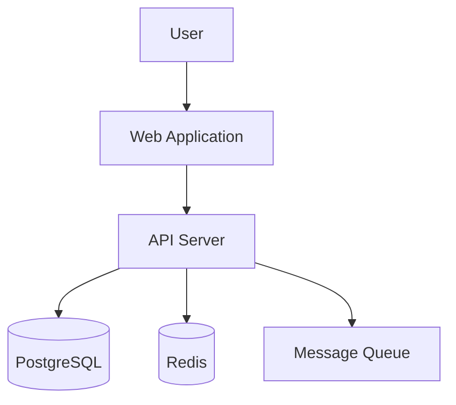

# 013-prd-project-knowledge

## Problem Statement

AI coding agents need structured documentation to understand project architecture, make
consistent decisions, and follow established patterns. While AGENTS.md (PRD 010) provides
instructions and Memory Bank (PRD 012) provides session context, projects also need
comprehensive technical documentation specifically structured for AI consumption—architecture
diagrams, decision records, API specifications, and domain models.

**Goal**: Define a standardized project knowledge structure that helps AI agents understand
the "why" behind code, not just the "what", enabling better autonomous decision-making.

## Requirements

### Must Have (M)

- [ ] Architecture documentation readable by AI agents
- [ ] Decision records explaining past choices (ADRs)
- [ ] API and interface documentation
- [ ] Domain model and business logic documentation
- [ ] Markdown format for portability and AI parsing
- [ ] Clear organization that AI tools can navigate

### Should Have (S)

- [ ] Diagrams in text-based formats (Mermaid, PlantUML)
- [ ] Runbook documentation for common operations
- [ ] Dependency and integration documentation
- [ ] Security and compliance documentation
- [ ] Changelog and migration history
- [ ] Links between related documents

### Could Have (C)

- [ ] Auto-generation from code analysis
- [ ] Documentation validation/freshness checks
- [ ] Integration with IDE documentation viewers
- [ ] Search index for documentation
- [ ] Version-specific documentation branches
- [ ] Documentation templates for common patterns

### Won't Have (W)

- [ ] User-facing documentation (separate concern)
- [ ] Marketing or sales documentation
- [ ] Auto-updating documentation without review
- [ ] Proprietary documentation formats

## Documentation Structure

### Recommended Directory Layout

```
docs/
├── architecture/
│   ├── overview.md              # High-level system architecture
│   ├── decisions/               # Architecture Decision Records
│   │   ├── 001-use-postgresql.md
│   │   ├── 002-adopt-cqrs.md
│   │   └── template.md
│   ├── diagrams/                # Mermaid/PlantUML diagrams
│   │   ├── system-context.md
│   │   ├── container-diagram.md
│   │   └── component-diagram.md
│   └── patterns.md              # Patterns used in the codebase
├── api/
│   ├── overview.md              # API design principles
│   ├── endpoints.md             # Endpoint documentation
│   └── schemas/                 # Request/response schemas
├── domain/
│   ├── model.md                 # Domain model explanation
│   ├── glossary.md              # Domain terminology
│   └── workflows.md             # Business process flows
├── operations/
│   ├── runbooks/                # Operational procedures
│   ├── monitoring.md            # Observability setup
│   └── deployment.md            # Deployment procedures
├── security/
│   ├── threat-model.md          # Security considerations
│   └── auth.md                  # Authentication/authorization
└── AGENTS.md                    # AI-specific navigation guide
```

### docs/AGENTS.md (AI Navigation)

```markdown
# Documentation Guide for AI Agents

## Quick Reference

- **Architecture decisions**: See `architecture/decisions/` for ADRs
- **System overview**: Start with `architecture/overview.md`
- **API details**: Check `api/endpoints.md`
- **Domain concepts**: Refer to `domain/glossary.md`

## When to Consult Documentation

- Before adding new features: Read relevant ADRs
- When unsure about patterns: Check `architecture/patterns.md`
- For API changes: Review `api/overview.md` principles
- For domain logic: Consult `domain/model.md`

## Documentation Conventions

- ADRs follow [template](architecture/decisions/template.md)
- Diagrams use Mermaid format
- All docs are markdown with frontmatter metadata
```

## Architecture Decision Records (ADRs)

### ADR Template

```markdown
# ADR-NNN: [Title]

## Status
[Proposed | Accepted | Deprecated | Superseded by ADR-XXX]

## Context
[What is the issue that we're seeing that is motivating this decision?]

## Decision
[What is the change that we're proposing and/or doing?]

## Consequences
[What becomes easier or harder as a result of this decision?]

## Alternatives Considered
[What other options were evaluated?]

## References
[Links to relevant resources, discussions, or related ADRs]
```

### ADR Benefits for AI

- Explains **why** decisions were made, not just what
- Provides context for future changes
- Helps AI avoid re-proposing rejected alternatives
- Creates institutional memory

## Diagram Standards

### Mermaid for AI-Readable Diagrams

Mermaid diagrams are text-based and AI-parseable:

```markdown
## System Context Diagram


```

### Diagram Types to Include

1. **System Context**: External actors and systems
2. **Container Diagram**: Major deployable units
3. **Component Diagram**: Internal structure of containers
4. **Sequence Diagrams**: Key workflows
5. **Entity Relationship**: Data models

## Evaluation Criteria

| Criterion | Weight | Notes |
|-----------|--------|-------|
| AI parseability | Must | AI can read and understand docs |
| Human maintainability | Must | Developers can easily update |
| Portability | Must | Works with any AI tool |
| Completeness | High | Covers architecture, decisions, domain |
| Freshness | High | Easy to keep up-to-date |
| Navigation | Medium | AI can find relevant docs |
| Visualization | Medium | Diagrams for complex concepts |

## Selected Approach

Adopt a **structured markdown documentation system** with:

1. **ADRs**: For all significant technical decisions
2. **Mermaid diagrams**: For architecture visualization
3. **Domain glossary**: For consistent terminology
4. **docs/AGENTS.md**: Navigation guide for AI tools

## Acceptance Criteria

- [ ] Given architecture questions, when AI reads docs, then it understands system structure
- [ ] Given a new feature, when AI checks ADRs, then it follows established patterns
- [ ] Given domain terminology, when AI reads glossary, then it uses correct terms
- [ ] Given Mermaid diagrams, when AI parses them, then it understands relationships
- [ ] Given docs/AGENTS.md, when AI navigates docs, then it finds relevant information
- [ ] Given documentation updates, when developers edit, then process is straightforward
- [ ] Given new decisions, when ADR is created, then it follows template

## Dependencies

- Requires: 010-prd-project-context-files (AGENTS.md foundation)
- Blocks: none (documentation standard)

## Spike Tasks

### Template Creation

- [x] Create ADR template with examples
- [x] Create architecture overview template
- [x] Create domain model documentation template
- [x] Create API documentation template
- [x] Create docs/AGENTS.md navigation template

### Tooling

- [x] Set up Mermaid rendering in code-server (supported natively)
- [x] Create VS Code snippets for documentation
- [x] Create ADR creation script/command
- [x] Set up documentation linting (markdownlint)

### Migration

- [x] Document existing architecture decisions as ADRs (sample ADRs created)
- [x] Create system diagrams for container-dev-env
- [x] Write domain glossary for project
- [ ] Set up docs/ structure in repository (templates ready for copying)

### Integration

- [ ] Configure AI tools to read docs/ directory
- [ ] Test ADR consultation during AI sessions
- [x] Document workflow for keeping docs current (in FINDINGS.md)
- [x] Create onboarding guide for documentation system (in FINDINGS.md)

## Spike Results

**Location**: `spikes/013-project-knowledge/`

**Key Deliverables**:

| Category | Files |
|----------|-------|
| **Templates** | `templates/architecture/`, `templates/domain/`, `templates/api/`, `templates/AGENTS-template.md` |
| **Tooling** | `scripts/new-adr.sh`, `vscode-snippets/docs.code-snippets`, `templates/.markdownlint.jsonc` |
| **Sample Docs** | `sample-docs/architecture/decisions/`, `sample-docs/diagrams/`, `sample-docs/domain/glossary.md` |
| **Findings** | `FINDINGS.md` - implementation guide and recommendations |

**Next Steps**:
1. Copy templates to `docs/` directory
2. Create initial ADRs for existing decisions
3. Configure AI extensions to include docs/ in context

See `spikes/013-project-knowledge/FINDINGS.md` for full implementation guide

## References

- [Architecture Decision Records](https://adr.github.io/)
- [Mermaid Diagram Syntax](https://mermaid.js.org/intro/)
- [C4 Model for Architecture](https://c4model.com/)
- [Memory Bank System](https://tweag.github.io/agentic-coding-handbook/WORKFLOW_MEMORY_BANK/)
- [Documenting Architecture Decisions](https://cognitect.com/blog/2011/11/15/documenting-architecture-decisions)
