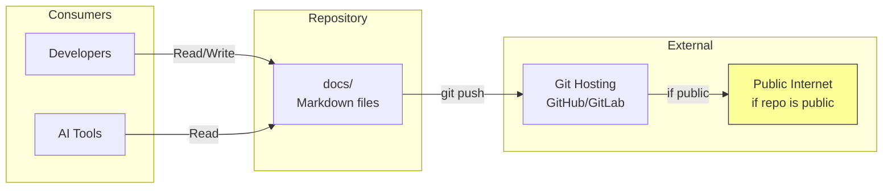
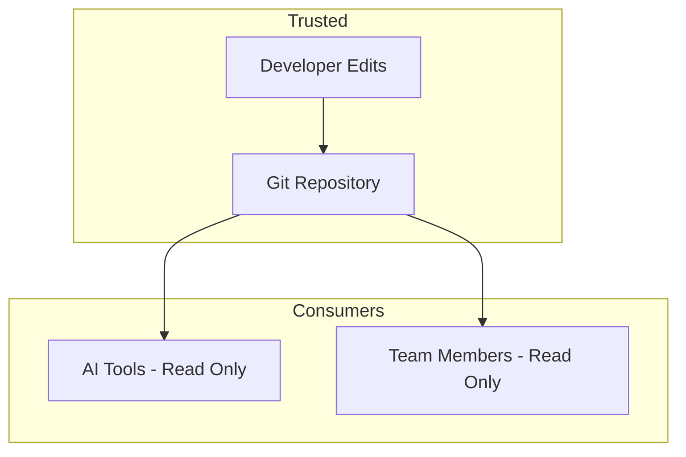

# 013-sec-project-knowledge

> **Document Type:** Security Review (Lightweight)  
> **Audience:** LLM agents, human reviewers  
> **Status:** Approved  
> **Last Updated:** 2026-01-23 <!-- @auto -->  
> **Reviewer:** Brian <!-- @human-required -->  
> **Risk Level:** Low <!-- @human-required -->

---

## Review Tier Legend

| Marker | Tier | Speckit Behavior |
|--------|------|------------------|
| 🔴 `@human-required` | Human Generated | Prompt human to author; blocks until complete |
| 🟡 `@human-review` | LLM + Human Review | LLM drafts → prompt human to confirm/edit; blocks until confirmed |
| 🟢 `@llm-autonomous` | LLM Autonomous | LLM completes; no prompt; logged for audit |
| ⚪ `@auto` | Auto-generated | System fills (timestamps, links); no prompt |

---

## Linkage ⚪ `@auto`

| Document | ID | Relationship |
|----------|-----|--------------|
| Parent PRD | 013-prd-project-knowledge.md | Feature being reviewed |
| Architecture Decision Record | 013-ard-project-knowledge.md | Technical implementation |

---

## Purpose

This is a **lightweight security review** for the project knowledge documentation system. Primary concern: preventing accidental disclosure of internal architecture details, credentials, or security vulnerabilities in documentation.

---

## Feature Security Summary

### One-line Summary 🔴 `@human-required`
> Documentation in `docs/` is static markdown files—low attack surface but risk of inadvertent disclosure if internal details or credentials are included.

### Risk Assessment 🔴 `@human-required`
> **Risk Level:** Low  
> **Justification:** Static files with no runtime exposure; main risk is informational disclosure through careless documentation.

---

## Attack Surface Analysis

### Exposure Points 🟡 `@human-review`

| Exposure Type | Details | Authentication | Authorization | Notes |
|---------------|---------|----------------|---------------|-------|
| Git Repository | docs/ committed to git | Git auth | Repo permissions | May be public |
| **None** (runtime) | No runtime exposure | — | — | Static files only |

### Attack Surface Diagram 🟢 `@llm-autonomous`

### Exposure Checklist 🟢 `@llm-autonomous`

- [ ] **Internet-facing endpoints require authentication** — N/A, static files
- [ ] **No sensitive data in URL parameters** — N/A
- [ ] **File uploads validated** — N/A
- [ ] **Rate limiting configured** — N/A
- [ ] **CORS policy is restrictive** — N/A
- [ ] **No debug/admin endpoints exposed** — N/A
- [ ] **Webhooks validate signatures** — N/A

---

## Data Flow Analysis

### Data Inventory 🟡 `@human-review`

| Data Element | PRD Entity | Classification | Source | Destination | Retention | Encrypted Rest | Encrypted Transit | Residency |
|--------------|------------|----------------|--------|-------------|-----------|----------------|-------------------|-----------|
| Architecture overview | overview.md | Internal | Developer | Git repo | Permanent | No | HTTPS (git) | Any |
| ADRs | decisions/*.md | Internal | Developer | Git repo | Permanent | No | HTTPS (git) | Any |
| API documentation | api/*.md | Internal | Developer | Git repo | Permanent | No | HTTPS (git) | Any |
| Domain glossary | domain/glossary.md | Internal | Developer | Git repo | Permanent | No | HTTPS (git) | Any |

### Data Handling Checklist 🟢 `@llm-autonomous`

- [x] **No Restricted data stored** — Documentation only
- [ ] **Confidential data encrypted at rest** — N/A, no confidential data
- [ ] **All data encrypted in transit** — Git over HTTPS
- [ ] **PII has defined retention policy** — No PII
- [ ] **Logs do not contain Confidential/Restricted data** — N/A
- [x] **Secrets are not hardcoded** — Must be enforced by review
- [x] **Data minimization applied** — Document architecture, not implementation secrets

---

## Third-Party & Supply Chain 🟡 `@human-review`

### New External Services

| Service | Purpose | Data Shared | Communication | Approved? |
|---------|---------|-------------|---------------|-----------|
| None | — | — | — | — |

### New Libraries/Dependencies

| Library | Version | License | Purpose | Security Check |
|---------|---------|---------|---------|----------------|
| None | — | — | — | — |

---

## CIA Impact Assessment

### Confidentiality 🟡 `@human-review`

| Asset at Risk | Exposure Scenario | Impact | Likelihood |
|---------------|-------------------|--------|------------|
| Internal architecture | Detailed docs in public repo | Low | Low |
| Security threat model | security/threat-model.md too detailed | Medium | Low |
| Internal URLs/IPs | Accidentally included in docs | Low | Low |

**Confidentiality Risk Level:** Low

### Integrity 🟡 `@human-review`

| Asset at Risk | Modification Scenario | Impact | Likelihood |
|---------------|----------------------|--------|------------|
| Documentation | Attacker modifies docs via compromised git | Low | Very Low |

**Integrity Risk Level:** Low

### Availability 🟡 `@human-review`

| Service/Function | Disruption Scenario | Impact | Likelihood |
|------------------|---------------------|--------|------------|
| Documentation | Files deleted | Very Low | Very Low |

**Availability Risk Level:** Low

### CIA Summary 🟢 `@llm-autonomous`

| Dimension | Risk Level | Primary Concern | Mitigation Priority |
|-----------|------------|-----------------|---------------------|
| **Confidentiality** | Low | Internal details in public docs | Low |
| **Integrity** | Low | Doc tampering | Very Low |
| **Availability** | Low | File deletion | Very Low |

**Overall CIA Risk:** Low — *Static documentation with minimal security implications*

---

## Trust Boundaries 🟡 `@human-review`

No significant trust boundaries for static documentation.

---

## Known Risks & Mitigations 🟡 `@human-review`

| ID | Risk Description | Severity | Mitigation | Status | Owner |
|----|------------------|----------|------------|--------|-------|
| R1 | Credentials accidentally included in docs | 🟡 Medium | PR review; secret scanning | Mitigated | Brian |
| R2 | Security threat model too detailed for public | 🟢 Low | Review before making repo public | Open | Brian |
| R3 | Internal URLs/IPs in documentation | 🟢 Low | PR review checklist | Open | Brian |

### Risk Acceptance 🔴 `@human-required`

No risks require formal acceptance for this low-risk feature.

---

## Security Requirements 🟡 `@human-review`

### Data Protection

| Req ID | Requirement | PRD AC | Verification Method |
|--------|-------------|--------|---------------------|
| SEC-1 | Documentation must not contain credentials or secrets | — | PR Review |
| SEC-2 | security/threat-model.md should not reveal exploitable details | — | Security Review |
| SEC-3 | Internal URLs/IPs should not appear in documentation | — | PR Review |

---

## Compliance Considerations 🟡 `@human-review`

| Regulation | Applicable? | Relevant Requirements | N/A Justification |
|------------|-------------|----------------------|-------------------|
| GDPR | N/A | — | No personal data |
| CCPA | N/A | — | No personal data |
| SOC 2 | N/A | — | Documentation only |
| HIPAA | N/A | — | No health information |
| PCI-DSS | N/A | — | No payment data |

---

## Review Findings

### Issues Identified 🟡 `@human-review`

| ID | Finding | Severity | Category | Recommendation | Status |
|----|---------|----------|----------|----------------|--------|
| F1 | No automated check for secrets in docs | 🟢 Low | Data | Add docs/ to secret scanning scope | Open |

### Positive Observations 🟢 `@llm-autonomous`

- Static files with no runtime attack surface
- Documentation structure separates sensitive (security/) from general
- Version control provides audit trail

---

## Open Questions 🟡 `@human-review`

None for this low-risk feature.

---

## Changelog ⚪ `@auto`

| Version | Date | Author | Changes |
|---------|------|--------|---------|
| 0.1 | 2026-01-23 | Claude | Initial review |

---

## Review Sign-off 🔴 `@human-required`

| Role | Name | Date | Decision |
|------|------|------|----------|
| Security Reviewer | Brian | 2026-01-23 | [x] Approved |
| Feature Owner | Brian | 2026-01-23 | [x] Acknowledged |

### Conditions for Approval (if applicable) 🔴 `@human-required`

None — approved without conditions.

---

## Review Checklist 🟢 `@llm-autonomous`

Before marking as Approved:
- [x] Attack surface documented
- [x] All data elements are classified
- [x] Third-party dependencies listed (none)
- [x] CIA impact assessed
- [x] Trust boundaries identified
- [x] Security requirements have verification methods
- [x] No Critical/High findings remain Open
- [x] Compliance N/A items have justification
