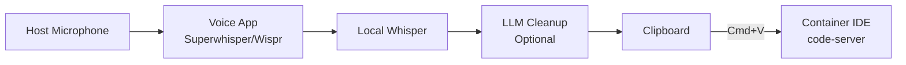
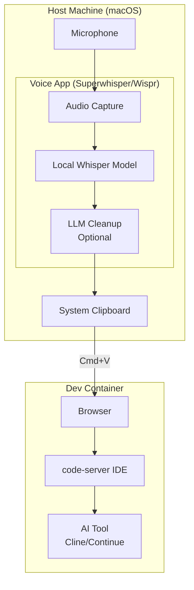
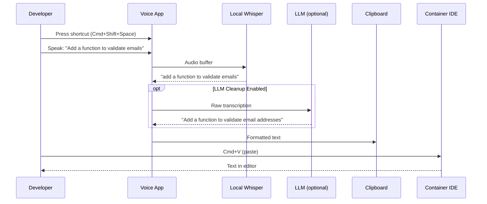

# 014-ard-voice-input

> **Document Type:** Architecture Decision Record  
> **Audience:** LLM agents, human reviewers  
> **Status:** Proposed  
> **Last Updated:** 2026-01-23 <!-- @auto -->  
> **Owner:** Brian <!-- @human-required -->  
> **Deciders:** Brian <!-- @human-required -->

---

## Review Tier Legend

| Marker | Tier | Speckit Behavior |
|--------|------|------------------|
| 🔴 `@human-required` | Human Generated | Prompt human to author; blocks until complete |
| 🟡 `@human-review` | LLM + Human Review | LLM drafts → prompt human to confirm/edit; blocks until confirmed |
| 🟢 `@llm-autonomous` | LLM Autonomous | LLM completes; no prompt; logged for audit |
| ⚪ `@auto` | Auto-generated | System fills (timestamps, links); no prompt |

---

## Linkage ⚪ `@auto`

| Document | ID | Relationship |
|----------|-----|--------------|
| Parent PRD | 014-prd-voice-input.md | Requirements this architecture satisfies |
| Security Review | 014-sec-voice-input.md | Security implications of this decision |
| Supersedes | — | N/A (greenfield) |
| Superseded By | — | — |

---

## Summary

### Decision 🔴 `@human-required`
> [Pending spike] Use host-side voice dictation (Superwhisper or Wispr Flow) with local Whisper processing, outputting text to clipboard for paste into containerized IDE.

### TL;DR for Agents 🟡 `@human-review`
> Voice input runs on the host machine (macOS), not in the container. Dictated text is pasted into the container IDE via clipboard. No container-side voice infrastructure needed. This is a developer workflow enhancement, not a container feature—configuration is per-developer, not per-project.

---

## Context

### Problem Space 🔴 `@human-required`
Typing detailed prompts for AI coding agents is time-consuming and interrupts flow. Voice input can speed up communication of complex instructions. The challenge is integrating voice input with a containerized IDE—voice must run on the host (for microphone access and latency) while output goes to the container.

### Decision Scope 🟡 `@human-review`

**This ARD decides:**
- Voice processing location (host vs. container)
- Integration pattern (clipboard vs. direct insertion)
- Tool selection criteria

**This ARD does NOT decide:**
- Specific voice tool (pending spike)
- Voice command system (Talon/Cursorless) — deferred to Could Have
- Container-side voice processing — explicitly out of scope

### Current State 🟢 `@llm-autonomous`
N/A - greenfield implementation. Developers currently type all prompts manually.

### Driving Requirements 🟡 `@human-review`

| PRD Req ID | Requirement Summary | Architectural Implication |
|------------|---------------------|---------------------------|
| M-1 | High accuracy transcription | Whisper-based models required |
| M-2 | Works with AI coding agents | Text output to IDE |
| M-3 | Low latency | Local processing, not cloud round-trip |
| M-5 | macOS support | macOS-native tools preferred |
| M-6 | Privacy-respecting | Local processing preferred |
| S-4 | Keyboard shortcut activation | Push-to-talk pattern |
| S-6 | LLM post-processing | Optional cleanup of transcription |

**PRD Constraints inherited:**
- Must support macOS (primary platform)
- Local processing required for privacy
- Must work with containerized IDE (text output, not audio)

---

## Decision Drivers 🔴 `@human-required`

1. **Privacy:** Voice data should not leave the machine unless explicitly enabled *(traces to M-6)*
2. **Latency:** Transcription must feel real-time (<2s from speech end) *(traces to M-3)*
3. **Accuracy:** Technical terms must be transcribed correctly *(traces to M-1)*
4. **Integration:** Output must reach containerized IDE *(traces to M-2)*
5. **Simplicity:** Minimal setup and configuration

---

## Options Considered 🟡 `@human-review`

### Option 0: No Voice Input

**Description:** Developers continue typing all prompts.

| Driver | Rating | Notes |
|--------|--------|-------|
| Privacy | ✅ Good | No audio captured |
| Latency | N/A | — |
| Accuracy | N/A | — |
| Integration | N/A | — |
| Simplicity | ✅ Good | Nothing to configure |

**Why not viable:** PRD explicitly requires voice input for productivity improvement.

---

### Option 1: Container-side Voice Processing

**Description:** Run Whisper inside the container, stream audio from host.


| Driver | Rating | Notes |
|--------|--------|-------|
| Privacy | ✅ Good | Stays in container |
| Latency | ❌ Poor | Audio streaming latency + GPU dependency |
| Accuracy | ⚠️ Medium | Depends on Whisper model size |
| Integration | ✅ Good | Direct to IDE |
| Simplicity | ❌ Poor | Complex audio routing |

**Why not selected:** Audio streaming from host to container adds latency and complexity. Container may lack GPU for fast Whisper inference.

---

### Option 2: Host-side Voice App with Clipboard (Recommended)

**Description:** Voice app runs on macOS host, transcribes locally, outputs to clipboard for paste into container IDE.



| Driver | Rating | Notes |
|--------|--------|-------|
| Privacy | ✅ Good | Local processing on host |
| Latency | ✅ Good | Native macOS, optimized Whisper |
| Accuracy | ✅ Good | Full Whisper models + LLM cleanup |
| Integration | ⚠️ Medium | Requires paste (not auto-insert) |
| Simplicity | ✅ Good | Commercial apps, minimal setup |

**Pros:**
- Optimized for macOS (Apple Silicon)
- No container changes needed
- Commercial tools handle complexity
- Works with any IDE (container or local)

**Cons:**
- Extra paste step
- Host-side configuration (not portable)

---

### Option 3: Browser Speech API

**Description:** Use Web Speech API in browser-based IDE (code-server).

| Driver | Rating | Notes |
|--------|--------|-------|
| Privacy | ❌ Poor | Chrome uses cloud services |
| Latency | ⚠️ Medium | Depends on network |
| Accuracy | ⚠️ Medium | Varies by browser |
| Integration | ✅ Good | Direct in browser |
| Simplicity | ⚠️ Medium | Browser support varies |

**Why not selected:** Cloud-based processing violates privacy requirement (M-6). Chrome's speech recognition sends audio to Google.

---

## Decision

### Selected Option 🔴 `@human-required`
> **Option 2: Host-side Voice App with Clipboard** (Pending tool selection from spike)

### Rationale 🔴 `@human-required`

Host-side voice processing provides the best combination of privacy, latency, and accuracy:

1. **Privacy:** All processing local on developer's machine
2. **Latency:** Optimized Whisper implementations (Apple Silicon) deliver <2s
3. **Accuracy:** Full Whisper models + optional LLM cleanup
4. **Integration:** Clipboard is universal—works with any IDE
5. **Simplicity:** Commercial apps (Superwhisper, Wispr) handle complexity

The extra paste step is a minor UX cost for significant benefits in privacy and reliability.

#### Simplest Implementation Comparison 🟡 `@human-review`

| Aspect | Simplest Possible | Selected Option | Justification for Complexity |
|--------|-------------------|-----------------|------------------------------|
| Processing | macOS built-in dictation | Whisper-based app | Accuracy for technical terms (M-1) |
| Output | Direct typing | Clipboard + paste | Works with containerized IDE (M-2) |
| Cleanup | None | Optional LLM | Code-aware formatting (S-1) |

**Complexity justified by:** macOS built-in dictation lacks accuracy for technical terms. Commercial Whisper apps (Superwhisper, Wispr) solve this with minimal developer effort.

### Architecture Diagram 🟡 `@human-review`



---

## Technical Specification

### Component Overview 🟡 `@human-review`

| Component | Responsibility | Interface | Dependencies |
|-----------|---------------|-----------|--------------|
| Voice App | Audio capture + Whisper transcription | macOS app | Microphone access |
| LLM Cleanup | Format and correct transcription | API call (optional) | API key (if enabled) |
| Clipboard | Transfer text to IDE | System clipboard | None |
| Container IDE | Receive pasted text | Browser | None |

### Data Flow 🟢 `@llm-autonomous`



### Interface Definitions 🟡 `@human-review`

**Voice App Configuration (Superwhisper example):**
```yaml
# User preferences
model: Pro              # Nano, Fast, Pro, Ultra
offline_mode: true      # Local processing only
llm_cleanup: true       # Post-process with LLM
llm_provider: anthropic # or openai, local
shortcut: cmd+shift+space
auto_paste: false       # Manual paste preferred
```

**No container-side configuration required.**

---

## Constraints & Boundaries

### Technical Constraints 🟡 `@human-review`

**Inherited from PRD:**
- macOS required (M-5)
- Local processing for privacy (M-6)
- Low latency (<2s) (M-3)

**Added by this Architecture:**
- **Voice app:** Host-side only (not in container)
- **Output:** Clipboard (universal integration)
- **Model:** Whisper-based (accuracy requirement)

### Architectural Boundaries 🟡 `@human-review`

- **Owns:** Voice workflow recommendation
- **Interfaces With:** Container IDE (via clipboard)
- **Does NOT Own:** Specific voice app (developer choice); container IDE implementation

### Implementation Guardrails 🟡 `@human-review`

> ⚠️ **Critical for LLM Agents:**

- [ ] **DO NOT** attempt to configure voice input inside container
- [ ] **DO NOT** stream audio from host to container
- [ ] **This is a host-side developer tool, not a container feature**
- [ ] **MUST** respect developer's choice of voice app
- [ ] **MUST** work with any text input field (clipboard is universal)

---

## Consequences 🟡 `@human-review`

### Positive
- Privacy-preserving (local processing)
- Low latency (native macOS optimization)
- Works with any containerized IDE
- No container changes required
- Commercial apps handle complexity

### Negative
- Extra paste step (not auto-insert)
- Host-side configuration (not portable across machines)
- macOS only (Linux/Windows not supported initially)
- Cost for commercial voice apps ($30-$250)

### Risks & Mitigations

| Risk | Likelihood | Impact | Mitigation |
|------|------------|--------|------------|
| Poor technical term accuracy | Medium | Medium | LLM cleanup; custom vocabulary |
| Voice app discontinued | Low | Medium | Multiple options (Superwhisper, Wispr, MacWhisper) |
| Clipboard workflow awkward | Medium | Low | Consider auto-paste if supported |

---

## Implementation Guidance

### Suggested Implementation Order 🟢 `@llm-autonomous`
1. Complete spike: Test Superwhisper, Wispr Flow, MacWhisper
2. Select recommended tool based on accuracy + workflow
3. Document setup and configuration
4. Create custom vocabulary for project terms
5. Document best practices for voice → AI prompt workflow

### Testing Strategy 🟢 `@llm-autonomous`

| Layer | Test Type | Coverage Target | Notes |
|-------|-----------|-----------------|-------|
| Accuracy | Manual | Technical terms | Library names, coding terms |
| Latency | Manual | End-to-end | Speech → text in IDE |
| Integration | Manual | Clipboard → IDE | Multiple browsers |

### Reference Implementations 🟡 `@human-review`

- [Superwhisper](https://superwhisper.com/) *(external, evaluate)*
- [Wispr Flow](https://wisprflow.ai/) *(external, evaluate)*
- [MacWhisper](https://goodsnooze.gumroad.com/l/macwhisper) *(external, evaluate)*
- [Whisper.cpp](https://github.com/ggerganov/whisper.cpp) *(external, open source)*

### Anti-patterns to Avoid 🟡 `@human-review`
- **Don't:** Try to run voice input in container
  - **Why:** Requires audio routing, GPU, adds latency
  - **Instead:** Host-side voice app + clipboard

- **Don't:** Use cloud speech recognition
  - **Why:** Privacy violation (M-6)
  - **Instead:** Local Whisper processing

---

## Compliance & Cross-cutting Concerns

### Security Considerations 🟡 `@human-review`
- Audio processed locally (privacy)
- No audio recordings stored (unless explicitly enabled)
- LLM cleanup may send transcription to API (opt-in)
- See 014-sec-voice-input.md

### Observability 🟢 `@llm-autonomous`
- **Logging:** None required (host-side app)
- **Metrics:** None required
- **Tracing:** None required

### Error Handling Strategy 🟢 `@llm-autonomous`
N/A - Voice app handles errors; no container-side error handling needed.

---

## Migration Plan (if applicable) 🟡 `@human-review`

N/A - Greenfield implementation. Developer workflow, not infrastructure.

### Rollback Plan 🔴 `@human-required`

**Rollback Triggers:**
- Voice input workflow proves impractical
- Privacy concerns with selected tool

**Rollback Decision Authority:** Developer (individual choice)

**Rollback Procedure:**
1. Uninstall voice app
2. Return to typing prompts
3. No container changes needed

---

## Open Questions 🟡 `@human-review`

- [ ] **Q1:** Which voice tool provides best accuracy for technical terms?
  > Pending spike evaluation of Superwhisper, Wispr Flow, MacWhisper

- [ ] **Q2:** Is LLM cleanup worth the latency?
  > Pending spike evaluation

- [ ] **Q3:** Should we invest in Talon/Cursorless for full voice coding?
  > Deferred to C-3 (Could Have)

---

## Changelog ⚪ `@auto`

| Version | Date | Author | Changes |
|---------|------|--------|---------|
| 0.1 | 2026-01-23 | Brian | Initial proposal |

---

## Traceability Matrix 🟢 `@llm-autonomous`

| PRD Req ID | Decision Driver | Option Rating | Component | Notes |
|------------|-----------------|---------------|-----------|-------|
| M-1 | Accuracy | Option 2: ✅ | Voice App + Whisper | Whisper models |
| M-2 | Integration | Option 2: ⚠️ | Clipboard | Requires paste |
| M-3 | Latency | Option 2: ✅ | Local processing | <2s typical |
| M-5 | N/A | Option 2: ✅ | macOS apps | Native support |
| M-6 | Privacy | Option 2: ✅ | Local Whisper | No cloud |
| S-4 | Simplicity | Option 2: ✅ | Shortcut activation | App feature |
| S-6 | Accuracy | Option 2: ✅ | LLM cleanup | Optional |

---

## Review Checklist 🟢 `@llm-autonomous`

Before marking as Accepted:
- [x] All PRD Must Have requirements appear in Driving Requirements
- [x] Option 0 (Status Quo) is documented
- [x] Simplest Implementation comparison is completed
- [x] Decision drivers are prioritized and addressed
- [x] At least 2 options were seriously considered
- [x] Constraints distinguish inherited vs. new
- [x] Component names are consistent across all diagrams and tables
- [x] Implementation guardrails reference specific PRD constraints
- [x] Rollback triggers and authority are defined
- [x] Security review is linked
- [ ] No open questions blocking implementation — **Pending spike**
