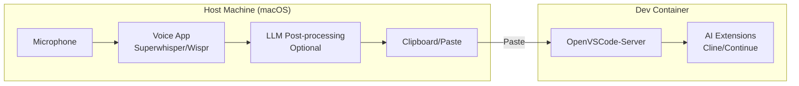
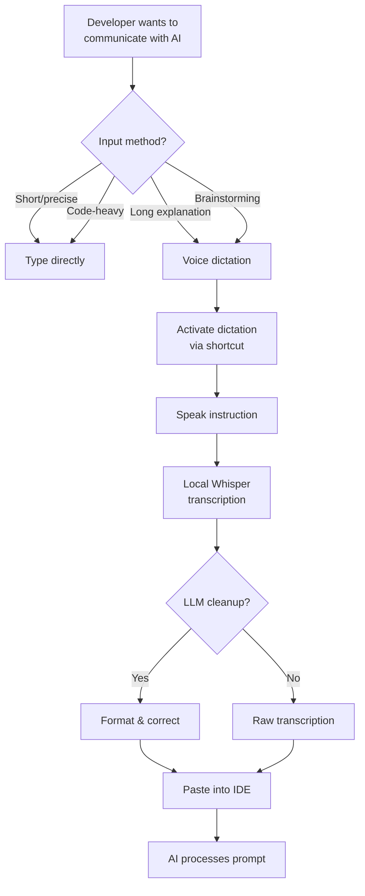
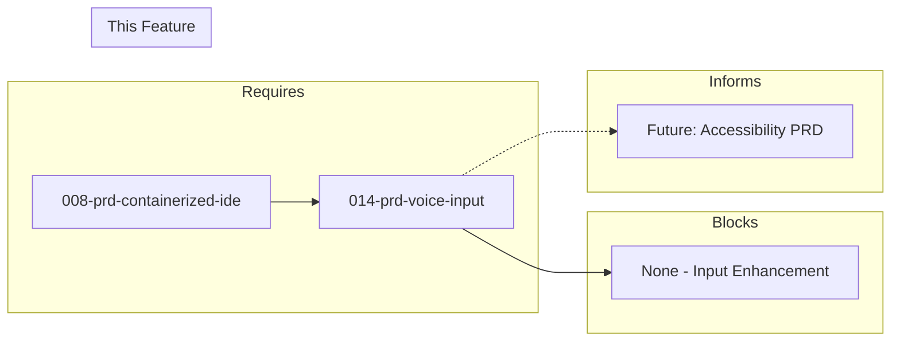

# 014-prd-voice-input

> **Document Type:** Product Requirements Document  
> **Audience:** LLM agents, human reviewers  
> **Status:** Draft  
> **Last Updated:** 2026-01-23 <!-- @auto -->  
> **Owner:** Brian <!-- @human-required -->

---

## Review Tier Legend

| Marker | Tier | Speckit Behavior |
|--------|------|------------------|
| 🔴 `@human-required` | Human Generated | Prompt human to author; blocks until complete |
| 🟡 `@human-review` | LLM + Human Review | LLM drafts → prompt human to confirm/edit; blocks until confirmed |
| 🟢 `@llm-autonomous` | LLM Autonomous | LLM completes; no prompt; logged for audit |
| ⚪ `@auto` | Auto-generated | System fills (timestamps, links); no prompt |

---

## Document Completion Order

> ⚠️ **For LLM Agents:** Complete sections in this order. Do not fill downstream sections until upstream human-required inputs exist.

1. **Context** (Background, Scope) → requires human input first
2. **Problem Statement & User Story** → requires human input
3. **Requirements** (Must/Should/Could/Won't) → requires human input
4. **Technical Constraints** → human review
5. **Diagrams, Data Model, Interface** → LLM can draft after above exist
6. **Acceptance Criteria** → derived from requirements
7. **Everything else** → can proceed

---

## Context

### Background 🔴 `@human-required`

Typing detailed prompts for AI coding agents is time-consuming and interrupts flow. Voice input enables developers to dictate code instructions, describe features, and interact with AI agents hands-free. This is particularly valuable for complex explanations, brainstorming, and accessibility.

This PRD explores voice-to-text tools that integrate with the AI-assisted development workflow, complementing the containerized IDE (008) and AI extensions (009).

### Scope Boundaries 🟡 `@human-review`

**In Scope:**
- Voice-to-text transcription for AI coding prompts
- macOS support (primary development platform)
- Local/privacy-preserving processing
- Technical vocabulary support (code terms, libraries, frameworks)
- Integration with containerized IDE workflow

**Out of Scope:**
- Cloud-only solutions — *privacy concern*
- Always-on microphone — *privacy and resource concern*
- Voice-only interfaces — *supplement to keyboard, not replacement*
- Real-time transcription streaming to container — *latency issues*
- Full voice coding (Talon/Cursorless) — *Could Have, high learning curve*

### Glossary 🟡 `@human-review`

| Term | Definition |
|------|------------|
| Superwhisper | Commercial macOS dictation app with LLM post-processing; $249 lifetime |
| Wispr Flow | Commercial developer-focused voice dictation with IDE integrations |
| Whisper | OpenAI's speech recognition model; available locally via whisper.cpp |
| Talon | Programmable voice control system for hands-free coding; steep learning curve |
| Cursorless | Voice-based code navigation system that integrates with Talon |
| LLM post-processing | Using AI to clean up and format transcription output |
| whisper.cpp | C++ implementation of Whisper optimized for Apple Silicon |

### Related Documents ⚪ `@auto`

| Document | Link | Relationship |
|----------|------|--------------|
| Architecture Decision Record | 014-ard-voice-input.md | Defines technical approach |
| Containerized IDE PRD | 008-prd-containerized-ide.md | IDE receiving dictated text |
| AI IDE Extensions PRD | 009-prd-ai-ide-extensions.md | AI tools receiving voice prompts |

---

## Problem Statement 🔴 `@human-required`

Typing detailed prompts for AI coding agents is time-consuming and interrupts flow. Voice input enables developers to dictate code instructions, describe features, and interact with AI agents hands-free. This is particularly valuable for complex explanations, brainstorming, and accessibility. The solution must work with the containerized development environment.

**Critical constraint**: Voice input must either run locally on the host (for latency and privacy) or work via web interface accessible from the container IDE. Processing must be fast enough for real-time dictation without disrupting coding flow.

**Cost of not solving**: Developers type long prompts, breaking flow. Complex explanations are shortened, reducing AI effectiveness. Accessibility limited for developers with typing difficulties.

### User Story 🔴 `@human-required`

> As a **developer using AI coding assistants**, I want **to dictate instructions and descriptions by voice** so that **I can communicate complex ideas quickly without interrupting my coding flow**.

---

## Assumptions & Risks 🟡 `@human-review`

### Assumptions

- [A-1] macOS is the primary development platform
- [A-2] Developers have access to quality microphones (built-in MacBook mic sufficient)
- [A-3] Local Whisper models provide sufficient accuracy for technical content
- [A-4] Voice input supplements but doesn't replace keyboard input
- [A-5] Text is pasted/inserted into container IDE (no direct streaming needed)

### Risks

| ID | Risk | Likelihood | Impact | Mitigation |
|----|------|------------|--------|------------|
| R-1 | Poor transcription of technical terms | Medium | High | LLM post-processing, custom vocabulary |
| R-2 | Latency disrupts flow | Medium | Medium | Local processing, optimized models |
| R-3 | Privacy concerns with cloud processing | Medium | High | Local-only requirement (M-6) |
| R-4 | Tool becomes unmaintained | Low | Medium | Multiple candidate tools; whisper.cpp as fallback |
| R-5 | Noise interference in open offices | Medium | Low | Noise cancellation; dedicated mic |

---

## Feature Overview

### Voice Input Architecture 🟡 `@human-review`



### Usage Patterns 🟡 `@human-review`



---

## Requirements

### Must Have (M) — MVP, launch blockers 🔴 `@human-required`

- [ ] **M-1:** System shall provide voice-to-text transcription with high accuracy
- [ ] **M-2:** System shall work with AI coding agents (input to Claude Code, Cline, Continue)
- [ ] **M-3:** System shall provide low latency (near real-time transcription)
- [ ] **M-4:** System shall support technical vocabulary (code terms, libraries, frameworks)
- [ ] **M-5:** System shall support macOS (primary development platform)
- [ ] **M-6:** System shall be privacy-respecting (local processing preferred)

### Should Have (S) — High value, not blocking 🔴 `@human-required`

- [ ] **S-1:** System should provide code-aware formatting (variable names, syntax)
- [ ] **S-2:** System should support multiple languages/accents
- [ ] **S-3:** System should support custom vocabulary training
- [ ] **S-4:** System should activate via keyboard shortcut
- [ ] **S-5:** System should integrate with IDE (direct insertion)
- [ ] **S-6:** System should provide LLM post-processing for cleanup and formatting

### Could Have (C) — Nice to have, if time permits 🟡 `@human-review`

- [ ] **C-1:** System could support Linux for containerized use
- [ ] **C-2:** System could support voice commands (not just dictation)
- [ ] **C-3:** System could integrate with Cursorless-style voice navigation
- [ ] **C-4:** System could support Whisper model fine-tuning
- [ ] **C-5:** System could provide noise cancellation
- [ ] **C-6:** System could support speaker identification

### Won't Have (W) — Explicitly deferred 🟡 `@human-review`

- [ ] **W-1:** Cloud-only solutions — *Reason: Privacy concern*
- [ ] **W-2:** Always-on microphone — *Reason: Privacy and resource concern*
- [ ] **W-3:** Voice-only interfaces — *Reason: Supplement, not replacement*
- [ ] **W-4:** Real-time streaming to container — *Reason: Latency issues*

---

## Technical Constraints 🟡 `@human-review`

- **Platform:** macOS required (Apple Silicon optimized preferred)
- **Processing:** Local/on-device for privacy; cloud optional for LLM cleanup
- **Latency:** <2 seconds from speech end to text available
- **Integration:** Output via clipboard/paste to container IDE
- **Privacy:** No always-on recording; push-to-talk or keyword activation
- **Model:** Whisper-based for accuracy; LLM for post-processing

---

## Data Model (if applicable) 🟡 `@human-review`

N/A — Voice input is transient; no persistent data model required.

---

## Interface Contract (if applicable) 🟡 `@human-review`

### Integration Flow

```
1. Developer activates dictation (keyboard shortcut)
2. Voice app captures audio locally
3. Whisper model transcribes to text
4. (Optional) LLM cleans up and formats
5. Text placed on clipboard or direct insert
6. Developer pastes into IDE / AI chat
```

### Configuration (Superwhisper example)

```yaml
# Superwhisper preferences
model: Pro  # Nano, Fast, Pro, Ultra
offline_mode: true
llm_cleanup: true
llm_provider: anthropic  # or openai, local
shortcut: "cmd+shift+space"
auto_paste: false  # Manual paste preferred
```

---

## Evaluation Criteria 🟡 `@human-review`

| Criterion | Weight | Metric | Target | Notes |
|-----------|--------|--------|--------|-------|
| Transcription accuracy | Critical | Word error rate | <5% for tech content | M-1 |
| Latency | Critical | Time to text | <2s | M-3 |
| Local processing | Critical | Privacy | 100% local option | M-6 |
| macOS support | Critical | Platform | macOS native | M-5 |
| Code awareness | High | Tech term accuracy | >90% | M-4, S-1 |
| Ease of use | High | Activation simplicity | 1 shortcut | S-4 |
| LLM post-processing | Medium | Cleanup quality | Improved readability | S-6 |
| Price | Medium | Cost | <$300 one-time | Budget constraint |

---

## Tool/Approach Candidates 🟡 `@human-review`

| Tool | License | Price | Pros | Cons | Recommendation |
|------|---------|-------|------|------|----------------|
| Superwhisper | Commercial | $249 lifetime | LLM post-processing, offline, code-friendly | macOS only, some UI glitches | **Evaluate** |
| Wispr Flow | Commercial | Subscription | IDE integrations, developer-focused | Subscription, newer | **Evaluate** |
| MacWhisper | Commercial | $30-70 | Native macOS, clean UI | No LLM post-processing | **Evaluate** |
| Voibe | Commercial | $29 | Developer mode, Apple Silicon optimized | Smaller community | **Evaluate** |
| Talon | Free/Patreon | Free | Programmable, Cursorless, hands-free | Steep learning curve | C-3 consideration |
| whisper.cpp | MIT | Free | Open source, fast, full control | No GUI, requires integration | Fallback option |

### Selected Approach 🔴 `@human-required`

> **Decision:** [Pending spike evaluation]  
> **Rationale:** [To be filled after testing Superwhisper, Wispr Flow, MacWhisper, Voibe]

---

## Acceptance Criteria 🟡 `@human-review`

| AC ID | Requirement | Given | When | Then |
|-------|-------------|-------|------|------|
| AC-1 | M-1 | Voice dictation active | I speak code instructions | Accurate text is generated |
| AC-2 | M-4 | Technical terms spoken | I say library names (NumPy, FastAPI) | They're transcribed correctly |
| AC-3 | M-2 | Dictated text ready | I paste to AI agent | Agent receives clear instructions |
| AC-4 | M-6 | Offline mode enabled | I dictate without internet | Transcription still works |
| AC-5 | S-1 | Code context mode | I mention variable names | They're formatted correctly (camelCase, snake_case) |
| AC-6 | S-4 | Keyboard shortcut configured | I trigger dictation | It starts within 1 second |
| AC-7 | S-6 | LLM post-processing enabled | Transcription completes | Output is cleaned and formatted |

### Edge Cases 🟢 `@llm-autonomous`

- [ ] **EC-1:** (M-1) When background noise is high, then accuracy degrades gracefully with warning
- [ ] **EC-2:** (M-4) When technical term is not recognized, then user can add to custom vocabulary
- [ ] **EC-3:** (M-3) When processing takes >3s, then visual indicator shows progress
- [ ] **EC-4:** (S-6) When LLM API is unavailable, then raw transcription is provided

---

## Dependencies 🟡 `@human-review`



### Requires (must be complete before this PRD)

- **008-prd-containerized-ide** — IDE to receive dictated text

### Blocks (waiting on this PRD)

- None — this is an input enhancement

### Informs (decisions here affect future PRDs) 🔴 `@human-required`

| Open Item | Dependent PRD | What We Need | Working Assumption |
|-----------|---------------|--------------|-------------------|
| Voice tool selection | Future accessibility | Which tool works best | Commercial tool with LLM post-processing |

### External

- **Superwhisper** (superwhisper.com) — Commercial voice tool
- **Wispr Flow** (wisprflow.ai) — Commercial voice tool
- **OpenAI Whisper** — Speech recognition model

---

## Security Considerations 🟡 `@human-review`

| Aspect | Assessment | Notes |
|--------|------------|-------|
| Internet Exposure | Optional | Local mode available; cloud for LLM cleanup |
| Sensitive Data | Medium risk | Voice recordings, dictated content |
| Authentication Required | N/A | Host-side app |
| Security Review Required | Low | Review data handling of selected tool |

### Security-Specific Requirements

- **SEC-1:** Local processing must be available (M-6)
- **SEC-2:** No voice recordings should be stored permanently
- **SEC-3:** LLM cleanup should not send sensitive code to cloud without consent
- **SEC-4:** Push-to-talk only; no always-on microphone

---

## Implementation Guidance 🟢 `@llm-autonomous`

### Suggested Approach

1. **Evaluate candidate tools** against criteria (spike)
2. **Select primary tool** based on spike results
3. **Configure for development workflow** (shortcut, LLM cleanup)
4. **Test with AI coding prompts** (accuracy, latency)
5. **Document best practices** for voice-to-AI workflow
6. **Create custom vocabulary** for project-specific terms

### Workflow Integration

```
Voice Dictation Workflow:
1. Think about what to tell AI
2. Press keyboard shortcut (e.g., Cmd+Shift+Space)
3. Speak naturally: "Add a function that validates email addresses using regex, 
   following the pattern we established in utils.py"
4. Wait for transcription + LLM cleanup (~1-2s)
5. Review text in IDE
6. Press Enter to send to AI

Best for:
- Complex feature descriptions
- Explaining context and constraints  
- Brainstorming sessions
- Accessibility needs
```

### Anti-patterns to Avoid

- **Dictating code syntax** — Better typed; voice for natural language
- **Relying solely on voice** — Keep keyboard as primary for precision
- **Ignoring transcription errors** — Review before sending to AI
- **Using cloud processing for sensitive code** — Enable local mode
- **Dictating passwords or secrets** — Never; type sensitive data

### Reference Examples

- [Superwhisper](https://superwhisper.com/)
- [Voice Coding Review](https://samwize.com/2026/11/10/review-of-whispr-flow-superwhisper-macwhisper-for-vibe-coding/)

---

## Spike Tasks 🟡 `@human-review`

### Tool Evaluation

- [ ] Test Superwhisper for coding workflow dictation
- [ ] Test Wispr Flow IDE integration
- [ ] Test MacWhisper for basic transcription
- [ ] Test Voibe developer mode features
- [ ] Evaluate Talon learning curve and Cursorless

### Accuracy Testing

- [ ] Test transcription of code terminology
- [ ] Test with library and framework names
- [ ] Test with variable naming conventions (camelCase, snake_case)
- [ ] Compare accuracy across tools

### Integration Testing

- [ ] Test dictation → code-server workflow
- [ ] Test dictation → Claude Code prompt workflow
- [ ] Test LLM post-processing effectiveness
- [ ] Measure end-to-end latency

### Workflow Design

- [ ] Document recommended voice dictation workflow
- [ ] Create custom vocabulary list for project
- [ ] Design voice command shortcuts (if using Talon)
- [ ] Create training materials for team

---

## Success Metrics 🔴 `@human-required`

| Metric | Baseline | Target | Measurement Method |
|--------|----------|--------|-------------------|
| Transcription accuracy | N/A | >95% for tech content | Manual review sampling |
| Time savings | N/A | >30% for complex prompts | Developer survey |
| Adoption rate | 0% | >50% of AI prompts | Usage tracking |

### Technical Verification 🟢 `@llm-autonomous`

| Metric | Target | Verification Method |
|--------|--------|---------------------|
| Latency | <2s | Timed testing |
| Technical term accuracy | >90% | Test vocabulary list |
| Offline functionality | 100% | Airplane mode test |

---

## Definition of Ready 🔴 `@human-required`

### Readiness Checklist

- [x] Problem statement reviewed and validated by stakeholder
- [x] All Must Have requirements have acceptance criteria
- [x] Technical constraints are explicit and agreed
- [ ] Dependencies identified and owners confirmed
- [ ] Forward dependencies tracked (Informs table complete if questions deferred)
- [x] Security review completed (or N/A documented with justification)
- [ ] Spike completed with tool selection
- [x] No open questions blocking implementation (deferred with working assumptions are OK)

### Sign-off

| Role | Name | Date | Decision |
|------|------|------|----------|
| Product Owner | | | [ ] Ready / [ ] Not Ready |

---

## Changelog ⚪ `@auto`

| Version | Date | Author | Changes |
|---------|------|--------|---------|
| 0.1 | 2026-01-XX | Brian | Initial draft |
| 0.2 | 2026-01-23 | Claude | Migrated to PRD template v3 format |

---

## Decision Log 🟡 `@human-review`

| Date | Decision | Rationale | Alternatives Considered |
|------|----------|-----------|------------------------|
| 2026-01-XX | Require local processing option | Privacy for code/prompts | Cloud-only (privacy risk) |
| 2026-01-XX | Focus on macOS first | Primary dev platform | Cross-platform (complexity) |
| 2026-01-XX | Voice supplements keyboard | Keyboard more precise for code | Voice-only (less practical) |

---

## Open Questions 🟡 `@human-review`

- [ ] **Q1:** Which voice tool best balances accuracy, privacy, and workflow?
  > **Status:** Pending spike evaluation
  > **Working assumption:** Commercial tool with LLM post-processing (Superwhisper likely).

- [ ] **Q2:** Is Talon/Cursorless worth the learning investment?
  > **Deferred to:** C-3 evaluation after basic voice input works
  > **Working assumption:** Start simple; consider Talon for accessibility needs.

- [ ] **Q3:** Should LLM post-processing use local models or API?
  > **Deferred to:** Tool selection
  > **Working assumption:** API for quality; local option for sensitive content.

---

## Review Checklist 🟢 `@llm-autonomous`

Before marking as Approved:

- [x] All requirements have unique IDs (M-1, S-2, etc.)
- [x] All Must Have requirements have linked acceptance criteria
- [x] Glossary terms are used consistently throughout
- [x] Diagrams use terminology from Glossary
- [x] Security considerations documented (or N/A justified)
- [ ] Definition of Ready checklist is complete
- [x] No open questions blocking implementation (deferred questions with working assumptions are OK)
- [x] Forward dependencies tracked in Informs table (if any questions deferred to future PRDs)

---

## References

- [Superwhisper](https://superwhisper.com/)
- [Wispr Flow](https://wisprflow.ai/)
- [Talon Voice](https://talonvoice.com/)
- [Whisper.cpp](https://github.com/ggerganov/whisper.cpp)
- [Cursorless](https://www.cursorless.org/)
- [Voice Coding Review](https://samwize.com/2026/11/10/review-of-whispr-flow-superwhisper-macwhisper-for-vibe-coding/)
- [Hands-Free Coding with Talon](https://www.joshwcomeau.com/blog/hands-free-coding/)
- [Superwhisper Alternatives](https://www.getvoibe.com/blog/superwhisper-alternatives/)
