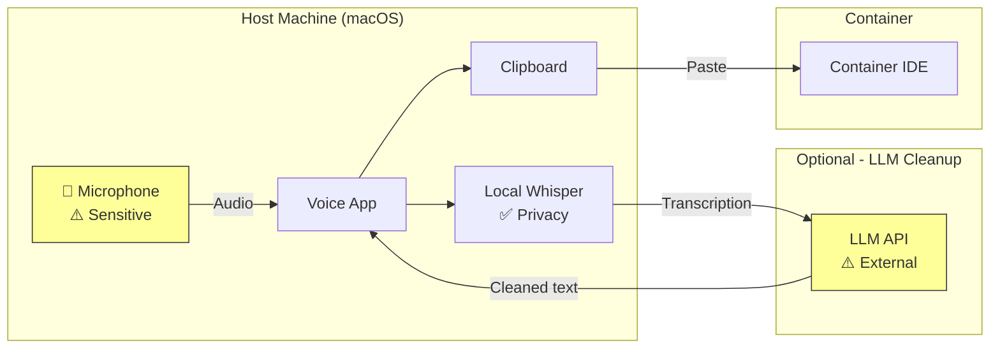
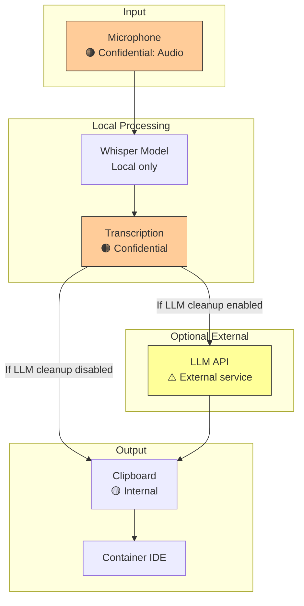
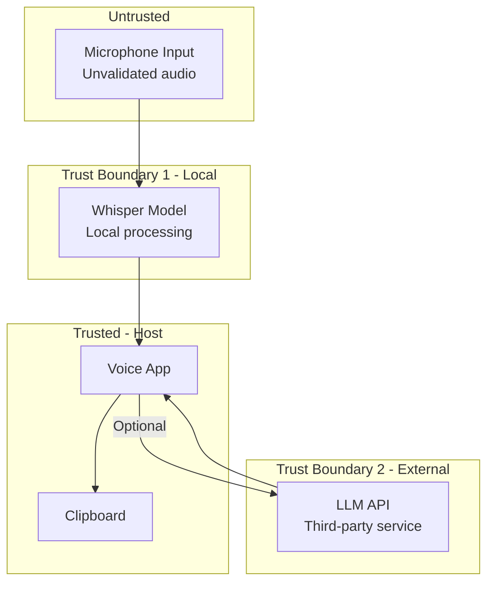

# 014-sec-voice-input

> **Document Type:** Security Review (Lightweight)  
> **Audience:** LLM agents, human reviewers  
> **Status:** In Review  
> **Last Updated:** 2026-01-23 <!-- @auto -->  
> **Reviewer:** Brian <!-- @human-required -->  
> **Risk Level:** Medium <!-- @human-required -->

---

## Review Tier Legend

| Marker | Tier | Speckit Behavior |
|--------|------|------------------|
| 🔴 `@human-required` | Human Generated | Prompt human to author; blocks until complete |
| 🟡 `@human-review` | LLM + Human Review | LLM drafts → prompt human to confirm/edit; blocks until confirmed |
| 🟢 `@llm-autonomous` | LLM Autonomous | LLM completes; no prompt; logged for audit |
| ⚪ `@auto` | Auto-generated | System fills (timestamps, links); no prompt |

---

## Linkage ⚪ `@auto`

| Document | ID | Relationship |
|----------|-----|--------------|
| Parent PRD | 014-prd-voice-input.md | Feature being reviewed |
| Architecture Decision Record | 014-ard-voice-input.md | Technical implementation |

---

## Purpose

This is a **lightweight security review** for voice input functionality. Primary concerns: audio privacy, potential LLM cleanup sending transcriptions externally, and voice app security posture.

---

## Feature Security Summary

### One-line Summary 🔴 `@human-required`
> Voice input captures developer speech on host machine—local Whisper processing preserves privacy, but optional LLM cleanup may send transcriptions to external APIs.

### Risk Assessment 🔴 `@human-required`
> **Risk Level:** Medium  
> **Justification:** Audio capture is inherently sensitive; risk mitigated by local processing, but LLM cleanup feature requires awareness of data flow.

---

## Attack Surface Analysis

### Exposure Points 🟡 `@human-review`

| Exposure Type | Details | Authentication | Authorization | Notes |
|---------------|---------|----------------|---------------|-------|
| Microphone Access | Host-side voice app | OS permission | macOS Microphone permission | Push-to-talk only |
| LLM API (optional) | Transcription sent for cleanup | API key | API provider auth | Opt-in feature |
| Clipboard | Transcribed text | No | OS process isolation | Local only |
| **None** (container) | No container exposure | — | — | Host-side only |

### Attack Surface Diagram 🟢 `@llm-autonomous`

### Exposure Checklist 🟢 `@llm-autonomous`

- [ ] **Internet-facing endpoints require authentication** — N/A, no endpoints
- [x] **No sensitive data in URL parameters** — LLM API uses POST body
- [ ] **File uploads validated** — N/A
- [ ] **Rate limiting configured** — LLM API has limits
- [ ] **CORS policy is restrictive** — N/A
- [ ] **No debug/admin endpoints exposed** — N/A
- [ ] **Webhooks validate signatures** — N/A

---

## Data Flow Analysis

### Data Inventory 🟡 `@human-review`

| Data Element | PRD Entity | Classification | Source | Destination | Retention | Encrypted Rest | Encrypted Transit | Residency |
|--------------|------------|----------------|--------|-------------|-----------|----------------|-------------------|-----------|
| Audio recording | Voice input | **Confidential** | Microphone | Local memory | Session only | No | N/A (local) | Host |
| Raw transcription | Whisper output | **Confidential** | Whisper | Local memory | Session only | No | N/A (local) | Host |
| Cleaned transcription | LLM output | Internal | LLM API | Clipboard | Session only | No | Yes (HTTPS) | Host |

### Data Flow Diagram 🟢 `@llm-autonomous`

### Data Handling Checklist 🟢 `@llm-autonomous`

- [x] **No Restricted data stored** — Audio/transcription in memory only
- [ ] **Confidential data encrypted at rest** — Not stored
- [x] **All data encrypted in transit** — HTTPS for LLM API
- [ ] **PII has defined retention policy** — Session-only retention
- [x] **Logs do not contain Confidential/Restricted data** — Voice apps don't log transcriptions
- [x] **Secrets are not hardcoded** — API keys in app settings
- [ ] **Data minimization applied** — Only transcribes when activated

---

## Third-Party & Supply Chain 🟡 `@human-review`

### New External Services

| Service | Purpose | Data Shared | Communication | Approved? |
|---------|---------|-------------|---------------|-----------|
| OpenAI API (optional) | LLM cleanup | Transcription text | HTTPS | Pending |
| Anthropic API (optional) | LLM cleanup | Transcription text | HTTPS | Yes |
| Deepgram (optional) | Alternative transcription | Audio (if cloud mode) | HTTPS | Pending |

### New Libraries/Dependencies

| Library | Version | License | Purpose | Security Check |
|---------|---------|---------|---------|----------------|
| Superwhisper | N/A | Commercial | Voice transcription | Pending |
| Wispr Flow | N/A | Commercial | Voice transcription | Pending |
| MacWhisper | N/A | Commercial | Voice transcription | Pending |

*Note: These are commercial macOS apps, not libraries. Security posture depends on vendor.*

---

## CIA Impact Assessment

### Confidentiality 🟡 `@human-review`

| Asset at Risk | Exposure Scenario | Impact | Likelihood |
|---------------|-------------------|--------|------------|
| Spoken content | Always-on mic captures unintended audio | High | Low (push-to-talk) |
| Transcription | LLM cleanup sends to external API | Medium | Medium (opt-in) |
| Code context | Dictated code sent to LLM | Medium | Medium (if cleanup enabled) |

**Confidentiality Risk Level:** Medium

### Integrity 🟡 `@human-review`

| Asset at Risk | Modification Scenario | Impact | Likelihood |
|---------------|----------------------|--------|------------|
| Transcription | LLM changes meaning of dictation | Low | Low |
| Clipboard | Malware intercepts clipboard | Medium | Very Low |

**Integrity Risk Level:** Low

### Availability 🟡 `@human-review`

| Service/Function | Disruption Scenario | Impact | Likelihood |
|------------------|---------------------|--------|------------|
| Voice transcription | App crash | Low | Low |
| LLM cleanup | API outage | Very Low | Medium |

**Availability Risk Level:** Low

### CIA Summary 🟢 `@llm-autonomous`

| Dimension | Risk Level | Primary Concern | Mitigation Priority |
|-----------|------------|-----------------|---------------------|
| **Confidentiality** | Medium | Audio/transcription to external LLM | Medium |
| **Integrity** | Low | LLM modifying meaning | Low |
| **Availability** | Low | App/API availability | Low |

**Overall CIA Risk:** Medium — *Primary concern is optional LLM cleanup sending transcriptions externally*

---

## Trust Boundaries 🟡 `@human-review`

### Trust Boundary Checklist 🟢 `@llm-autonomous`

- [x] **All input from untrusted sources is validated** — Whisper handles audio validation
- [x] **External API responses are validated** — Basic response validation
- [ ] **Authorization checked at data access** — N/A, local app
- [ ] **Service-to-service calls are authenticated** — API key for LLM

---

## Known Risks & Mitigations 🟡 `@human-review`

| ID | Risk Description | Severity | Mitigation | Status | Owner |
|----|------------------|----------|------------|--------|-------|
| R1 | Unintended audio capture | 🟠 High | Push-to-talk only; no always-on | Mitigated | Developer |
| R2 | Transcription sent to LLM without awareness | 🟡 Medium | Clear opt-in; document which mode sends data | Open | Brian |
| R3 | Voice app stores/transmits audio | 🟡 Medium | Verify app privacy policy; prefer local-only apps | Open | Brian |
| R4 | Sensitive code dictated, sent to LLM | 🟡 Medium | Document risk; allow disabling LLM cleanup | Open | Brian |

### Risk Acceptance 🔴 `@human-required`

| Risk ID | Accepted By | Date | Justification | Review Date |
|---------|-------------|------|---------------|-------------|
| R2 | | | | |

---

## Security Requirements 🟡 `@human-review`

### Data Protection

| Req ID | Requirement | PRD AC | Verification Method |
|--------|-------------|--------|---------------------|
| SEC-1 | Audio must not be stored permanently | AC-4 | App settings review |
| SEC-2 | LLM cleanup must be opt-in | — | App settings |
| SEC-3 | Offline mode must be available | AC-4 | Feature verification |
| SEC-4 | Push-to-talk required (no always-on) | — | App settings |

### Operational Security

| Req ID | Requirement | PRD AC | Verification Method |
|--------|-------------|--------|---------------------|
| SEC-5 | Voice app must have clear privacy policy | — | Vendor review |
| SEC-6 | LLM API key must not be shared in documentation | — | Doc review |

---

## Compliance Considerations 🟡 `@human-review`

| Regulation | Applicable? | Relevant Requirements | N/A Justification |
|------------|-------------|----------------------|-------------------|
| GDPR | Potentially | Audio is personal data if identifiable | Local processing mitigates; LLM cleanup may trigger |
| CCPA | Potentially | Audio is personal data | Same as GDPR |
| SOC 2 | N/A | — | Developer tooling, not customer data |
| HIPAA | N/A | — | No health information |
| PCI-DSS | N/A | — | No payment data |

---

## Review Findings

### Issues Identified 🟡 `@human-review`

| ID | Finding | Severity | Category | Recommendation | Status |
|----|---------|----------|----------|----------------|--------|
| F1 | LLM cleanup data flow not clearly documented | 🟡 Medium | Data | Document which modes send data externally | Open |
| F2 | No verification of voice app privacy practices | 🟡 Medium | Supply Chain | Review privacy policy before recommending | Open |

### Positive Observations 🟢 `@llm-autonomous`

- Local Whisper processing preserves privacy by default
- Push-to-talk prevents unintended capture
- No container-side attack surface
- Offline mode available

---

## Open Questions 🟡 `@human-review`

- [ ] **Q1:** Which voice apps have verified privacy-preserving practices?
- [ ] **Q2:** Should LLM cleanup be disabled by default for security-sensitive projects?

---

## Changelog ⚪ `@auto`

| Version | Date | Author | Changes |
|---------|------|--------|---------|
| 0.1 | 2026-01-23 | Claude | Initial review |

---

## Review Sign-off 🔴 `@human-required`

| Role | Name | Date | Decision |
|------|------|------|----------|
| Security Reviewer | | | [ ] Approved / [ ] Approved with conditions / [ ] Rejected |
| Feature Owner | Brian | | [ ] Acknowledged |

### Conditions for Approval (if applicable) 🔴 `@human-required`

- [ ] F1: Document LLM cleanup data flow clearly before recommending
- [ ] F2: Review privacy policy of recommended voice app

---

## Security Requirements Traceability 🟢 `@llm-autonomous`

| SEC Req ID | PRD Req ID | PRD AC ID | Test Type | Test Location |
|------------|------------|-----------|-----------|---------------|
| SEC-1 | M-6 | AC-4 | Manual | App settings |
| SEC-2 | — | — | Manual | App settings |
| SEC-3 | M-6 | AC-4 | Manual | App feature |
| SEC-4 | — | — | Manual | App settings |

---

## Review Checklist 🟢 `@llm-autonomous`

Before marking as Approved:
- [x] Attack surface documented
- [x] All data elements are classified
- [x] Third-party dependencies and services are listed
- [x] CIA impact is assessed
- [x] Trust boundaries are identified
- [x] Security requirements have verification methods
- [ ] No Critical/High findings remain Open
- [x] Compliance considerations documented
