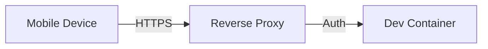
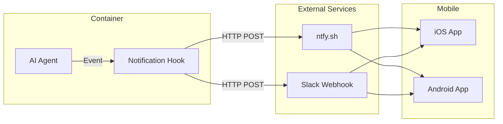
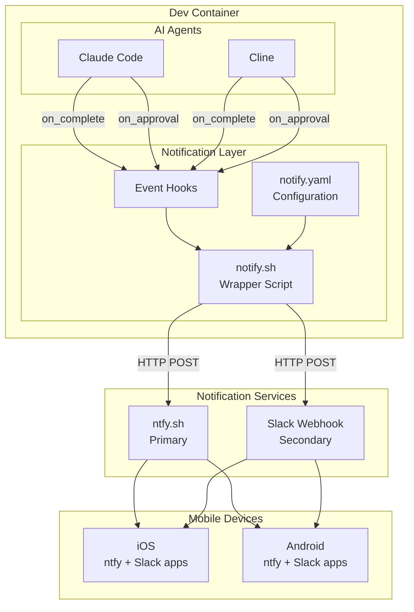
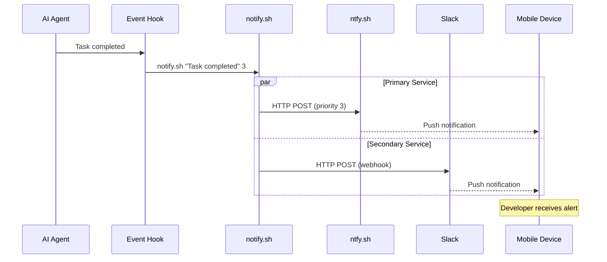
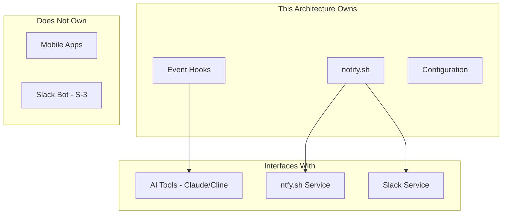

# 015-ard-mobile-access

> **Document Type:** Architecture Decision Record  
> **Audience:** LLM agents, human reviewers  
> **Status:** Accepted  
> **Last Updated:** 2026-01-23 <!-- @auto -->  
> **Owner:** Brian <!-- @human-required -->  
> **Deciders:** Brian <!-- @human-required -->

---

## Review Tier Legend

| Marker | Tier | Speckit Behavior |
|--------|------|------------------|
| 🔴 `@human-required` | Human Generated | Prompt human to author; blocks until complete |
| 🟡 `@human-review` | LLM + Human Review | LLM drafts → prompt human to confirm/edit; blocks until confirmed |
| 🟢 `@llm-autonomous` | LLM Autonomous | LLM completes; no prompt; logged for audit |
| ⚪ `@auto` | Auto-generated | System fills (timestamps, links); no prompt |

---

## Linkage ⚪ `@auto`

| Document | ID | Relationship |
|----------|-----|--------------|
| Parent PRD | 015-prd-mobile-access.md | Requirements this architecture satisfies |
| Security Review | 015-sec-mobile-access.md | Security implications of this decision |
| Supersedes | — | N/A (greenfield) |
| Superseded By | — | — |

---

## Summary

### Decision 🔴 `@human-required`
> Use outbound-only HTTP webhooks to push notifications to ntfy.sh (primary) and Slack (secondary), with no inbound container exposure.

### TL;DR for Agents 🟡 `@human-review`
> Mobile access is notification-based only—no direct container access. AI agent events trigger outbound HTTP POSTs to ntfy.sh or Slack webhooks. The container MUST NOT expose any inbound ports. Notifications contain status summaries only—never include source code or secrets. Use the notify.sh wrapper script for consistent multi-service delivery.

---

## Context

### Problem Space 🔴 `@human-required`
Developers want to monitor AI agent progress and receive alerts from mobile devices. The challenge is enabling this without exposing the development container to the internet, which would create security risks.

### Decision Scope 🟡 `@human-review`

**This ARD decides:**
- Notification delivery mechanism (push vs. poll)
- Which notification services to support
- Security architecture (outbound-only)
- Notification content guidelines

**This ARD does NOT decide:**
- Specific notification triggers per AI tool (implementation detail)
- Slack bot configuration for remote triggering (S-3 feature)
- Mobile app development (W-4 explicitly excluded)

### Current State 🟢 `@llm-autonomous`
N/A - greenfield implementation. No mobile notification infrastructure currently exists.

### Driving Requirements 🟡 `@human-review`

| PRD Req ID | Requirement Summary | Architectural Implication |
|------------|---------------------|---------------------------|
| M-1 | Notifications on task completion | Need event hooks in AI agents |
| M-2 | Notifications on approval needed | Priority levels for urgent alerts |
| M-3 | Basic status monitoring | Status must be queryable/reportable |
| M-4 | Secure access (no container exposure) | Outbound-only architecture required |
| M-5 | iOS and Android support | Must use cross-platform notification service |
| S-4 | Slack/Discord integration | Webhook-based delivery |

**PRD Constraints inherited:**
- From PRD Technical Constraints: Outbound-only, no container exposure
- Non-functional: Notification delivery within 30 seconds

---

## Decision Drivers 🔴 `@human-required`

1. **Security:** Container must not be exposed to inbound connections *(traces to M-4)*
2. **Reliability:** Notifications must arrive promptly (>99% delivery) *(traces to M-1, M-2)*
3. **Simplicity:** Easy setup, minimal configuration *(operational)*
4. **Cross-platform:** Must work on iOS and Android *(traces to M-5)*
5. **Cost:** Minimize or eliminate ongoing costs *(operational)*

---

## Options Considered 🟡 `@human-review`

### Option 0: No Mobile Access

**Description:** Developers must be at workstation to monitor AI agents.

| Driver | Rating | Notes |
|--------|--------|-------|
| Security | ✅ Good | No additional attack surface |
| Reliability | N/A | No notifications |
| Simplicity | ✅ Good | Nothing to configure |
| Cross-platform | ❌ Poor | No mobile support |

**Why not viable:** Defeats the purpose of mobile monitoring. Long-running AI tasks require developer presence at workstation, reducing productivity.

---

### Option 1: Direct Container Exposure (Reverse Proxy)

**Description:** Expose container via reverse proxy with authentication for mobile access.



| Driver | Rating | Notes |
|--------|--------|-------|
| Security | ❌ Poor | Container exposed to internet |
| Reliability | ✅ Good | Direct access |
| Simplicity | ❌ Poor | Complex auth, SSL, proxy setup |
| Cross-platform | ✅ Good | Web-based works everywhere |
| Cost | ⚠️ Medium | Proxy infrastructure needed |

**Pros:**
- Full access to container
- Real-time bidirectional communication

**Cons:**
- Significant security risk
- Complex infrastructure
- Requires always-on proxy

---

### Option 2: Outbound Push Notifications (Selected)

**Description:** Container pushes notifications outbound to external services; no inbound exposure.



| Driver | Rating | Notes |
|--------|--------|-------|
| Security | ✅ Good | Outbound-only, no exposure |
| Reliability | ✅ Good | >99% delivery via established services |
| Simplicity | ✅ Good | Simple HTTP POSTs |
| Cross-platform | ✅ Good | ntfy.sh has iOS/Android apps |
| Cost | ✅ Good | ntfy.sh free; Slack free tier |

**Pros:**
- Zero inbound attack surface
- Simple implementation (curl/HTTP)
- Reliable third-party delivery
- Free or low-cost services

**Cons:**
- One-way communication (notifications only)
- Dependent on external services
- No real-time status polling

---

### Option 3: Polling-Based Status Page

**Description:** Deploy status page that mobile devices poll periodically.

| Driver | Rating | Notes |
|--------|--------|-------|
| Security | ⚠️ Medium | Read-only exposure still risky |
| Reliability | ⚠️ Medium | Polling delays, battery drain |
| Simplicity | ⚠️ Medium | Need to deploy status service |
| Cross-platform | ✅ Good | Web-based |
| Cost | ⚠️ Medium | Hosting required |

**Pros:**
- Can show more detailed status
- No dependency on notification services

**Cons:**
- Still requires some exposure
- Polling is inefficient
- Mobile battery drain

---

## Decision

### Selected Option 🔴 `@human-required`
> **Option 2: Outbound Push Notifications**

### Rationale 🔴 `@human-required`

This option provides the best security posture while meeting all functional requirements:

1. **Security:** Zero inbound attack surface—container only makes outbound HTTP calls
2. **Reliability:** ntfy.sh and Slack are battle-tested notification platforms with >99% delivery
3. **Simplicity:** Implementation is just HTTP POST calls—no complex infrastructure
4. **Cost:** ntfy.sh is free and self-hostable; Slack free tier sufficient for individual use

The trade-off of one-way communication is acceptable because the primary use case is monitoring, not interaction. Remote task triggering (S-3) can be addressed separately via Slack bot if needed.

#### Simplest Implementation Comparison 🟡 `@human-review`

| Aspect | Simplest Possible | Selected Option | Justification for Complexity |
|--------|-------------------|-----------------|------------------------------|
| Services | Single service (ntfy.sh) | Primary + secondary | Redundancy for reliability (M-1) |
| Script | Direct curl calls | Wrapper script | Consistent interface, multi-service |
| Priority | Single priority | 5 levels | Urgent alerts need distinction (M-2) |

**Complexity justified by:** Notification reliability is critical for approval-needed scenarios. The wrapper script adds minimal complexity while enabling service redundancy and consistent priority handling.

### Architecture Diagram 🟡 `@human-review`



---

## Technical Specification

### Component Overview 🟡 `@human-review`

| Component | Responsibility | Interface | Dependencies |
|-----------|---------------|-----------|--------------|
| Event Hooks | Capture AI agent events | Shell hooks | AI tool config |
| notify.sh | Send notifications to services | CLI script | curl, jq |
| notify.yaml | Configuration for services | YAML file | — |
| ntfy.sh Service | Push notification delivery | HTTP API | External |
| Slack Webhook | Team notification delivery | HTTP API | External |

### Data Flow 🟢 `@llm-autonomous`



### Interface Definitions 🟡 `@human-review`

```bash
# notify.sh interface
# Usage: notify.sh <message> [priority] [title]
# Priority: 1=min, 2=low, 3=default, 4=high, 5=urgent

notify.sh "Task completed: feature-xyz" 3 "Claude Code"
notify.sh "APPROVAL NEEDED: Delete files?" 5 "Cline"
```

```yaml
# notify.yaml schema
services:
  ntfy:
    enabled: boolean
    server: string      # https://ntfy.sh or self-hosted
    topic: string       # Subscription topic
    
  slack:
    enabled: boolean
    webhook_url: string # From environment variable
    channel: string     # Optional channel override

defaults:
  priority_mapping:
    completed: 2-3      # Normal priority
    failed: 4           # High priority  
    approval_needed: 5  # Urgent
  quiet_hours:
    start: "HH:MM"
    end: "HH:MM"
    allow_priority: 5   # Only urgent during quiet hours
```

### Key Algorithms/Patterns 🟡 `@human-review`

**Pattern:** Priority-Based Delivery
```
1. Receive notification request (message, priority)
2. Check quiet hours:
   a. If in quiet hours AND priority < allow_priority, queue for later
   b. Otherwise, proceed
3. For each enabled service:
   a. Map priority to service-specific format
   b. Send HTTP POST with appropriate headers
   c. Log result (success/failure)
4. If primary fails, ensure secondary attempted
```

**Pattern:** Notification Content Sanitization
```
1. Receive raw message from AI agent
2. Truncate to max length (200 chars for ntfy)
3. Strip any file paths containing /home/ or /workspace/
4. Remove any strings matching API key patterns
5. Send sanitized message
```

---

## Constraints & Boundaries

### Technical Constraints 🟡 `@human-review`

**Inherited from PRD:**
- Outbound HTTP only—no inbound container exposure
- Must work on iOS and Android
- Notification delivery within 30 seconds

**Added by this Architecture:**
- **Message length:** Max 200 characters (ntfy limit)
- **Content:** Status summaries only—no code, no secrets
- **Services:** ntfy.sh primary, Slack secondary
- **Dependencies:** curl required, jq optional

### Architectural Boundaries 🟡 `@human-review`



- **Owns:** Notification triggering, message formatting, service delivery
- **Interfaces With:** AI tools (event source), notification services (delivery)
- **Must Not Touch:** Mobile app behavior, Slack bot implementation

### Implementation Guardrails 🟡 `@human-review`

> ⚠️ **Critical for LLM Agents:**

- [ ] **DO NOT** expose any container ports for mobile access *(M-4)*
- [ ] **DO NOT** include source code in notifications *(SEC-2)*
- [ ] **DO NOT** include API keys or secrets in notifications *(SEC-2)*
- [ ] **DO NOT** include file paths in notifications *(SEC-5)*
- [ ] **MUST** use HTTPS for all notification service calls
- [ ] **MUST** respect quiet hours configuration
- [ ] **MUST** use environment variables for webhook URLs *(SEC-3)*

---

## Consequences 🟡 `@human-review`

### Positive
- Zero inbound attack surface—excellent security posture
- Simple implementation with standard tools (curl)
- Reliable delivery via established services
- Free or very low cost
- Works on both iOS and Android

### Negative
- One-way communication only (monitoring, not control)
- Dependent on external notification services
- Limited message content (security constraint)
- No detailed status view on mobile

### Risks & Mitigations

| Risk | Likelihood | Impact | Mitigation |
|------|------------|--------|------------|
| ntfy.sh service outage | Low | Medium | Secondary service (Slack) |
| Notification contains sensitive data | Medium | High | Content sanitization in script |
| Webhook URL leaked | Low | Medium | Environment variables, not config files |
| Notification fatigue | Medium | Low | Priority levels, quiet hours |

---

## Implementation Guidance

### Suggested Implementation Order 🟢 `@llm-autonomous`
1. Create notify.sh wrapper script with ntfy.sh support
2. Add Slack webhook support to script
3. Create notify.yaml configuration template
4. Add event hooks to Claude Code configuration
5. Add event hooks to Cline configuration
6. Test end-to-end notification flow
7. Document quiet hours and priority configuration

### Testing Strategy 🟢 `@llm-autonomous`

| Layer | Test Type | Coverage Target | Notes |
|-------|-----------|-----------------|-------|
| Unit | Script functions | Key paths | Mock HTTP calls |
| Integration | End-to-end | Happy path | Real ntfy.sh test topic |
| Security | Content sanitization | All patterns | Verify no leaks |
| Manual | Mobile delivery | Both platforms | iOS + Android devices |

### Reference Implementations 🟡 `@human-review`

- [ntfy.sh Documentation](https://docs.ntfy.sh/) *(external - approved)*
- [Slack Webhooks Guide](https://api.slack.com/messaging/webhooks) *(external - approved)*
- Spike results: `spikes/015-mobile-access/` *(internal)*

### Anti-patterns to Avoid 🟡 `@human-review`
- **Don't:** Include code snippets in notifications
  - **Why:** Security risk, also truncated poorly
  - **Instead:** "Task completed" or "Error in function X"

- **Don't:** Send notification for every minor event
  - **Why:** Notification fatigue leads to ignoring alerts
  - **Instead:** Only significant events (complete, fail, approval)

- **Don't:** Store webhook URLs in config files
  - **Why:** May be committed to git
  - **Instead:** Use ${SLACK_WEBHOOK_URL} substitution

---

## Compliance & Cross-cutting Concerns

### Security Considerations 🟡 `@human-review`
- Authentication: N/A (outbound push only)
- Authorization: N/A (no access control needed)
- Data handling: No sensitive data in notifications

### Observability 🟢 `@llm-autonomous`
- **Logging:** Notification send attempts, success/failure, service used
- **Metrics:** Delivery success rate, latency per service
- **Tracing:** Notification ID for debugging delivery issues

### Error Handling Strategy 🟢 `@llm-autonomous`
```
Error Category → Handling Approach
├── Network unreachable → Retry 3x with backoff, log failure
├── Service returns error → Log, try secondary service
├── Invalid config → Fail fast on startup with clear message
└── Rate limited → Back off, respect Retry-After header
```

---

## Migration Plan (if applicable) 🟡 `@human-review`

N/A - Greenfield implementation.

### Rollback Plan 🔴 `@human-required`

**Rollback Triggers:**
- Notification service causes container instability
- Sensitive data leaked via notifications
- Excessive costs from notification services

**Rollback Decision Authority:** Brian (Owner)

**Rollback Time Window:** Any time (no persistent state)

**Rollback Procedure:**
1. Remove event hooks from AI tool configurations
2. Delete notify.sh and notify.yaml
3. Container continues working without notifications

---

## Open Questions 🟡 `@human-review`

- [x] **Q1:** Which notification service is most reliable? → Resolved: ntfy.sh primary, Slack secondary
- [ ] **Q2:** How should remote task triggering (S-3) work? → Deferred to future implementation

---

## Changelog ⚪ `@auto`

| Version | Date | Author | Changes |
|---------|------|--------|---------|
| 0.1 | 2026-01-21 | Brian | Initial proposal from spike |
| 1.0 | 2026-01-23 | Brian | Accepted after review |

---

## Decision Record ⚪ `@auto`

| Date | Event | Details |
|------|-------|---------|
| 2026-01-21 | Proposed | Initial draft from spike results |
| 2026-01-23 | Accepted | Approved by Brian |

---

## Traceability Matrix 🟢 `@llm-autonomous`

| PRD Req ID | Decision Driver | Option Rating | Component | Notes |
|------------|-----------------|---------------|-----------|-------|
| M-1 | Reliability | Option 2: ✅ | Event Hooks + notify.sh | >99% delivery |
| M-2 | Reliability | Option 2: ✅ | Priority levels | Urgent = 5 |
| M-3 | Simplicity | Option 2: ✅ | notify.sh | Status in message |
| M-4 | Security | Option 2: ✅ | Outbound-only | No exposure |
| M-5 | Cross-platform | Option 2: ✅ | ntfy.sh | iOS + Android apps |
| S-4 | Simplicity | Option 2: ✅ | Slack webhook | HTTP POST |

---

## Review Checklist 🟢 `@llm-autonomous`

Before marking as Accepted:
- [x] All PRD Must Have requirements appear in Driving Requirements
- [x] Option 0 (Status Quo) is documented
- [x] Simplest Implementation comparison is completed
- [x] Decision drivers are prioritized and addressed
- [x] At least 2 options were seriously considered
- [x] Constraints distinguish inherited vs. new
- [x] Component names are consistent across all diagrams and tables
- [x] Implementation guardrails reference specific PRD constraints
- [x] Rollback triggers and authority are defined
- [x] Security review is linked
- [x] No open questions blocking implementation
