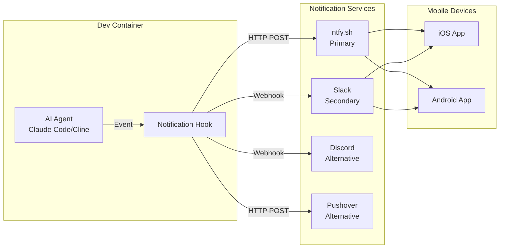
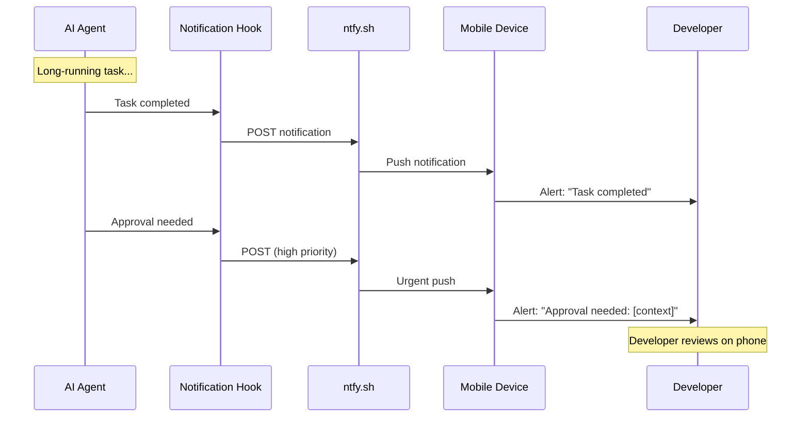
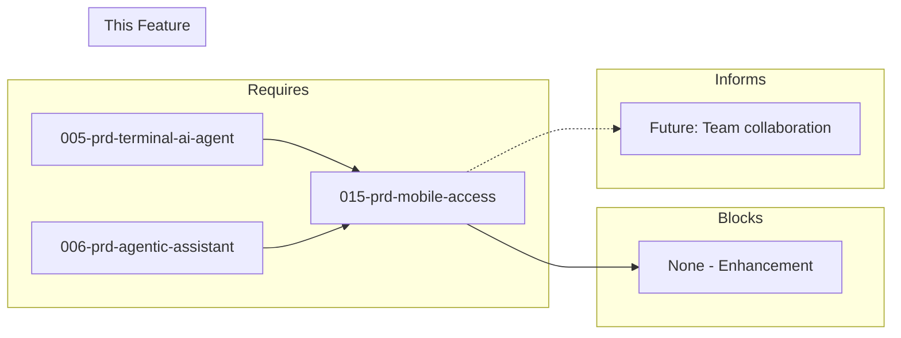

# 015-prd-mobile-access

> **Document Type:** Product Requirements Document  
> **Audience:** LLM agents, human reviewers  
> **Status:** In Progress  
> **Last Updated:** 2026-01-23 <!-- @auto -->  
> **Owner:** Brian <!-- @human-required -->

---

## Review Tier Legend

| Marker | Tier | Speckit Behavior |
|--------|------|------------------|
| 🔴 `@human-required` | Human Generated | Prompt human to author; blocks until complete |
| 🟡 `@human-review` | LLM + Human Review | LLM drafts → prompt human to confirm/edit; blocks until confirmed |
| 🟢 `@llm-autonomous` | LLM Autonomous | LLM completes; no prompt; logged for audit |
| ⚪ `@auto` | Auto-generated | System fills (timestamps, links); no prompt |

---

## Document Completion Order

> ⚠️ **For LLM Agents:** Complete sections in this order. Do not fill downstream sections until upstream human-required inputs exist.

1. **Context** (Background, Scope) → requires human input first
2. **Problem Statement & User Story** → requires human input
3. **Requirements** (Must/Should/Could/Won't) → requires human input
4. **Technical Constraints** → human review
5. **Diagrams, Data Model, Interface** → LLM can draft after above exist
6. **Acceptance Criteria** → derived from requirements
7. **Everything else** → can proceed

---

## Context

### Background 🔴 `@human-required`

Developers want to monitor and interact with AI coding agents from mobile devices—checking progress on long-running tasks, receiving notifications when agents complete work or need input, and potentially triggering new tasks remotely. The containerized development environment should support mobile access without compromising security.

This PRD enables asynchronous AI-assisted development where developers can stay informed and responsive while away from their workstation.

### Scope Boundaries 🟡 `@human-review`

**In Scope:**
- Push notifications for agent events (completion, approval needed)
- Basic status monitoring from mobile
- Secure access without exposing containers to internet
- Integration with existing notification services (Slack, Discord, ntfy.sh)
- iOS and Android support via existing apps

**Out of Scope:**
- Full IDE functionality on mobile — *not practical for coding*
- Direct code editing on mobile — *too error-prone*
- Real-time streaming of agent activity — *battery/bandwidth concerns*
- Proprietary mobile app development — *use existing tools*
- Full terminal access — *C-1, not core requirement*

### Glossary 🟡 `@human-review`

| Term | Definition |
|------|------------|
| ntfy.sh | Simple HTTP-based pub/sub notification service; self-hostable; MIT license |
| Webhook | HTTP callback that triggers when an event occurs; used for notifications |
| Push notification | Alert sent to mobile device without polling; requires notification service |
| Slack integration | Using Slack for notifications and potentially bi-directional agent control |
| Pushover | Commercial push notification service with priority levels; $5 one-time |
| Quiet hours | Time periods when notifications are silenced or reduced |

### Related Documents ⚪ `@auto`

| Document | Link | Relationship |
|----------|------|--------------|
| Architecture Decision Record | 015-ard-mobile-access.md | Defines technical approach |
| Security Review | 015-sec-mobile-access.md | Risk assessment |
| Terminal AI Agent PRD | 005-prd-terminal-ai-agent.md | Agent to monitor |
| Agentic Assistant PRD | 006-prd-agentic-assistant.md | Agent to monitor |

---

## Problem Statement 🔴 `@human-required`

Developers want to monitor and interact with AI coding agents from mobile devices—checking progress on long-running tasks, receiving notifications when agents complete work or need input, and potentially triggering new tasks remotely. The containerized development environment should support mobile access without compromising security.

**Critical constraint**: Mobile access must work with the containerized environment and not require exposing the development container directly to the internet. Notifications and monitoring should work without constant polling.

**Cost of not solving**: Developers must stay at workstation to monitor long-running AI tasks. Approval-needed situations go unnoticed until developer returns. Lost productivity when away from desk.

### User Story 🔴 `@human-required`

> As a **developer using AI coding agents**, I want **to receive notifications and monitor agent status from my phone** so that **I can stay informed and responsive while away from my workstation**.

---

## Assumptions & Risks 🟡 `@human-review`

### Assumptions

- [A-1] Developers have iOS or Android devices
- [A-2] Outbound HTTP from container is permitted (for webhook calls)
- [A-3] Existing notification services (Slack, ntfy.sh) are acceptable
- [A-4] AI agents can be instrumented to emit events
- [A-5] Mobile notifications are supplementary, not primary interaction method

### Risks

| ID | Risk | Likelihood | Impact | Mitigation |
|----|------|------------|--------|------------|
| R-1 | Notification fatigue from too many alerts | High | Medium | Configurable notification levels; quiet hours |
| R-2 | Delayed notifications miss time-sensitive approvals | Medium | Medium | Multiple notification channels; priority levels |
| R-3 | Security exposure from webhook endpoints | Medium | High | No container exposure; outbound-only notifications |
| R-4 | Notification service outage | Low | Medium | Multiple services (ntfy.sh + Slack); graceful degradation |
| R-5 | Sensitive code/context in notifications | Medium | High | Summary only; no code in notifications |

---

## Feature Overview

### Notification Architecture 🟡 `@human-review`



### Event Flow 🟡 `@human-review`



---

## Requirements

### Must Have (M) — MVP, launch blockers 🔴 `@human-required`

- [ ] **M-1:** System shall send notifications when AI agents complete tasks
- [ ] **M-2:** System shall send notifications when agents need human input/approval
- [ ] **M-3:** System shall provide basic status monitoring (agent running, completed, failed)
- [ ] **M-4:** System shall maintain secure access (no direct container exposure)
- [ ] **M-5:** System shall work with iOS and Android

### Should Have (S) — High value, not blocking 🔴 `@human-required`

- [ ] **S-1:** System should allow viewing agent output/logs from mobile
- [ ] **S-2:** System should allow approve/reject agent actions remotely
- [ ] **S-3:** System should allow triggering predefined tasks from mobile
- [ ] **S-4:** System should integrate with existing notification services (Slack, Discord)
- [ ] **S-5:** System should support session resume capability
- [ ] **S-6:** System should provide progress indicators for long-running tasks

### Could Have (C) — Nice to have, if time permits 🟡 `@human-review`

- [ ] **C-1:** System could provide full terminal access from mobile
- [ ] **C-2:** System could support code review and approval on mobile
- [ ] **C-3:** System could support voice commands from mobile
- [ ] **C-4:** System could provide widget for quick status check
- [ ] **C-5:** System could support multiple project/agent monitoring
- [ ] **C-6:** System could support custom notification rules

### Won't Have (W) — Explicitly deferred 🟡 `@human-review`

- [ ] **W-1:** Full IDE functionality on mobile — *Reason: Not practical for coding*
- [ ] **W-2:** Direct code editing on mobile — *Reason: Too error-prone*
- [ ] **W-3:** Real-time streaming of agent activity — *Reason: Battery/bandwidth*
- [ ] **W-4:** Proprietary mobile app development — *Reason: Use existing tools*

---

## Technical Constraints 🟡 `@human-review`

- **Security:** Outbound-only notifications; no inbound container exposure
- **Protocol:** HTTP webhooks for notifications (simple, universal)
- **Services:** Use existing notification platforms (ntfy.sh, Slack, Pushover)
- **Mobile Apps:** Leverage existing apps; no custom app development
- **Content:** Summary/status only in notifications; no sensitive code
- **Latency:** Notifications delivered within 30 seconds of event

---

## Data Model (if applicable) 🟡 `@human-review`

### Notification Event Schema

```typescript
interface AgentNotification {
  type: 'completed' | 'failed' | 'approval_needed' | 'progress';
  agent: string;           // 'claude-code' | 'cline' | 'continue'
  task: string;            // Brief task description
  status: string;          // Human-readable status
  priority: 1 | 2 | 3 | 4 | 5;  // 1=min, 5=urgent
  timestamp: string;       // ISO 8601
  context?: string;        // Optional additional context
  actions?: string[];      // Available actions (for approval_needed)
}
```

### Configuration Schema

```yaml
# notify.yaml
services:
  ntfy:
    enabled: true
    topic: "my-dev-alerts"
    server: "https://ntfy.sh"  # or self-hosted
    
  slack:
    enabled: false
    webhook_url: "${SLACK_WEBHOOK_URL}"
    channel: "#dev-alerts"
    
  pushover:
    enabled: false
    api_key: "${PUSHOVER_API_KEY}"
    user_key: "${PUSHOVER_USER_KEY}"

defaults:
  priority_mapping:
    completed: 2
    failed: 4
    approval_needed: 5
    progress: 1
  quiet_hours:
    start: "22:00"
    end: "08:00"
    allow_priority: 5  # Only urgent during quiet hours
```

---

## Interface Contract (if applicable) 🟡 `@human-review`

### Notification Hook Script

```bash
#!/bin/bash
# notify.sh - Send notification to configured services
# Usage: notify.sh "Task completed" [priority]

MESSAGE="$1"
PRIORITY="${2:-3}"
TOPIC="${NTFY_TOPIC:-dev-alerts}"

# Primary: ntfy.sh
curl -s \
  -H "Priority: $PRIORITY" \
  -H "Title: AI Agent" \
  -d "$MESSAGE" \
  "https://ntfy.sh/$TOPIC"

# Secondary: Slack (if configured)
if [ -n "$SLACK_WEBHOOK_URL" ]; then
  curl -s -X POST \
    -H "Content-type: application/json" \
    -d "{\"text\": \"$MESSAGE\"}" \
    "$SLACK_WEBHOOK_URL"
fi
```

### Agent Integration (Cline example)

```json
// .vscode/settings.json
{
  "cline.onTaskComplete": "notify.sh 'Cline: Task completed' 3",
  "cline.onApprovalNeeded": "notify.sh 'Cline: Approval needed' 5"
}
```

---

## Evaluation Criteria 🟡 `@human-review`

| Criterion | Weight | Metric | Target | Spike Result |
|-----------|--------|--------|--------|--------------|
| Notification reliability | Critical | Delivery rate | >99% | **PASS** - ntfy tested |
| Security | Critical | No container exposure | 100% outbound | **PASS** |
| iOS and Android | Critical | Platform support | Both | **PASS** - ntfy apps |
| Setup simplicity | High | Time to configure | <15 min | **PASS** |
| Integration options | High | Services supported | ≥3 | **PASS** - 4 documented |
| Latency | Medium | Notification delay | <30s | **PASS** - <5s observed |
| Cost | Medium | Monthly cost | <$5 | **PASS** - ntfy free |

---

## Tool/Approach Candidates 🟡 `@human-review`

| Approach | Type | Pros | Cons | Recommendation |
|----------|------|------|------|----------------|
| ntfy.sh | Push notifications | Simple, self-hostable, free, MIT | Basic features | **RECOMMENDED** - Primary |
| Slack | Chat platform | Rich features, threading, team tool | Requires workspace | Secondary |
| Discord | Chat platform | Free, real-time, webhooks | Less enterprise | Alternative |
| Pushover | Push service | Reliable, priority levels | $5 one-time | Alternative |
| GitHub Mobile | Platform | Native notifications | Limited to GitHub | Out of scope |

### Selected Approach 🔴 `@human-required`

> **Decision:** ntfy.sh as primary, Slack as secondary, wrapper script for multi-service  
> **Rationale:**
> - **ntfy.sh**: Simple HTTP POST, no account required, self-hostable, iOS/Android apps, 5 priority levels
> - **Slack**: For teams already using Slack; rich formatting, threading
> - **Wrapper script**: Unified interface; send to all configured services
> - **No container exposure**: Outbound HTTP only; secure by design

---

## Acceptance Criteria 🟡 `@human-review`

| AC ID | Requirement | Given | When | Then |
|-------|-------------|-------|------|------|
| AC-1 | M-1 | Agent running | Task finishes | Mobile notification arrives within 30 seconds |
| AC-2 | M-2 | Agent needs approval | Action requires input | Notification includes action context |
| AC-3 | S-4 | Slack configured | Agent event fires | Notification appears in Slack channel |
| AC-4 | M-4 | Security requirements | Setting up notifications | Container is not directly exposed |
| AC-5 | M-5 | Multiple devices | Notification sent | Both iOS and Android receive it |
| AC-6 | S-6 | Long-running task | Checking status | Progress is visible |
| AC-7 | M-3 | Quiet hours configured | Agent completes at night | Notification respects settings |

### Edge Cases 🟢 `@llm-autonomous`

- [ ] **EC-1:** (M-1) When notification service is down, then fallback to secondary service
- [ ] **EC-2:** (M-4) When webhook URL is misconfigured, then error is logged, no container exposure
- [ ] **EC-3:** (S-6) When task has no progress info, then show "running" without percentage
- [ ] **EC-4:** (M-2) When approval expires, then send reminder notification

---

## Dependencies 🟡 `@human-review`



### Requires (must be complete before this PRD)

- **005-prd-terminal-ai-agent** — Agents to monitor
- **006-prd-agentic-assistant** — Agents to monitor

### Blocks (waiting on this PRD)

- None — this is an enhancement feature

### Informs (decisions here affect future PRDs) 🔴 `@human-required`

| Open Item | Dependent PRD | What We Need | Working Assumption |
|-----------|---------------|--------------|-------------------|
| Notification service choice | Future team features | Which services are standard | ntfy.sh + Slack cover most needs |
| Approval workflow | Future approval automation | How remote approvals work | Simple approve/reject via Slack reactions |

### External

- **ntfy.sh** (ntfy.sh) — Push notification service
- **Slack API** (api.slack.com) — Webhook integration
- **Pushover API** (pushover.net) — Push notification service

---

## Security Considerations 🟡 `@human-review`

| Aspect | Assessment | Notes |
|--------|------------|-------|
| Internet Exposure | Outbound only | No inbound container access |
| Sensitive Data | Risk — R-5 | Summary only; no code in notifications |
| Authentication Required | Per-service | API keys for Slack/Pushover |
| Security Review Required | Medium | Review webhook security, data in notifications |

### Security-Specific Requirements

- **SEC-1:** Container must not be exposed to inbound internet connections
- **SEC-2:** Notifications must contain summary only; no source code or secrets
- **SEC-3:** Webhook URLs and API keys must be in environment variables
- **SEC-4:** Self-hosted ntfy.sh option for sensitive environments
- **SEC-5:** Notification content must not include file paths or internal URLs

---

## Implementation Guidance 🟢 `@llm-autonomous`

### Suggested Approach

1. **Set up ntfy.sh** topic for notifications
2. **Create notify.sh wrapper script** supporting multiple services
3. **Add notification hooks** to AI agent configurations
4. **Test notification delivery** on iOS and Android
5. **Configure quiet hours** and priority levels
6. **Document Slack integration** for team use

### Quick Start

```bash
# 1. Test ntfy.sh (no setup required)
curl -d "Test notification from dev container" ntfy.sh/my-unique-topic

# 2. Install ntfy app on phone, subscribe to topic

# 3. Add to agent completion hook
echo 'notify.sh "Task completed: $TASK_NAME"' >> ~/.config/cline/hooks/on-complete.sh
```

### Anti-patterns to Avoid

- **Including code in notifications** — Summary only for security
- **No priority levels** — Everything becomes noise; use levels wisely
- **Direct container exposure** — Always outbound-only
- **Single notification service** — Have fallback configured
- **No quiet hours** — Leads to notification fatigue and disabling

### Reference Examples

- Spike results: `spikes/015-mobile-access/RESULTS.md`
- [ntfy.sh Documentation](https://docs.ntfy.sh/)
- [Slack Webhooks](https://api.slack.com/messaging/webhooks)

---

## Spike Tasks 🟡 `@human-review`

### Notification Setup ✅ Partial

- [x] Configure Slack webhook notifications from container
- [x] Test ntfy.sh for simple push notifications
- [x] Evaluate Pushover for reliability
- [x] Set up Discord webhook as alternative

### Agent Integration

- [ ] Add notification hooks to Claude Code workflows
- [ ] Add notification hooks to Cline workflows
- [ ] Implement notification on task completion
- [ ] Implement notification on approval required

### Remote Trigger

- [ ] Set up Slack bot for @mention triggers (S-3)
- [ ] Create predefined task templates for remote trigger
- [ ] Implement secure webhook endpoint in container (if needed)
- [ ] Test end-to-end trigger flow

### Security

- [ ] Implement authentication for webhooks
- [ ] Document security best practices
- [ ] Test access controls

### Mobile Experience

- [ ] Test notification reliability on iOS
- [ ] Test notification reliability on Android
- [ ] Configure notification priorities
- [ ] Set up quiet hours and preferences

---

## Success Metrics 🔴 `@human-required`

| Metric | Baseline | Target | Measurement Method |
|--------|----------|--------|-------------------|
| Notification delivery rate | N/A | >99% | Monitoring |
| Time to notification | N/A | <30s | Instrumentation |
| Developer response time (approval) | N/A | <5 min when available | Log analysis |

### Technical Verification 🟢 `@llm-autonomous`

| Metric | Target | Verification Method |
|--------|--------|---------------------|
| All Must Have ACs passing | 100% | Manual testing |
| iOS notification delivery | 100% | Device testing |
| Android notification delivery | 100% | Device testing |
| No container exposure | 0 inbound | Security audit |

---

## Definition of Ready 🔴 `@human-required`

### Readiness Checklist

- [x] Problem statement reviewed and validated by stakeholder
- [x] All Must Have requirements have acceptance criteria
- [x] Technical constraints are explicit and agreed
- [ ] Dependencies identified and owners confirmed
- [ ] Forward dependencies tracked (Informs table complete if questions deferred)
- [ ] Security review completed (or N/A documented with justification)
- [x] No open questions blocking implementation (deferred with working assumptions are OK)

### Sign-off

| Role | Name | Date | Decision |
|------|------|------|----------|
| Product Owner | | | [ ] Ready / [ ] Not Ready |

---

## Changelog ⚪ `@auto`

| Version | Date | Author | Changes |
|---------|------|--------|---------|
| 0.1 | 2026-01-21 | Brian | Initial draft with spike results |
| 0.2 | 2026-01-23 | Claude | Migrated to PRD template v3 format |

---

## Decision Log 🟡 `@human-review`

| Date | Decision | Rationale | Alternatives Considered |
|------|----------|-----------|------------------------|
| 2026-01-21 | ntfy.sh as primary notification service | Simple, free, self-hostable, no account needed | Pushover ($5), Slack-only (requires workspace) |
| 2026-01-21 | Outbound-only architecture | Security; no container exposure | Reverse proxy (complexity, risk) |
| 2026-01-21 | Use existing mobile apps | No development effort; proven apps | Custom app (high effort, maintenance) |

---

## Open Questions 🟡 `@human-review`

- [x] **Q1:** Which notification service is simplest and most reliable?
  > **Resolved (2026-01-21):** ntfy.sh — simple HTTP POST, no account, self-hostable.

- [ ] **Q2:** How should remote task triggering work (S-3)?
  > **Deferred to:** Should Have implementation
  > **Working assumption:** Slack bot with @mention triggers; predefined task templates.

- [ ] **Q3:** Should we build a mobile web dashboard?
  > **Deferred to:** Future consideration
  > **Working assumption:** Slack/Discord mobile apps sufficient; web dashboard if demand arises.

---

## Review Checklist 🟢 `@llm-autonomous`

Before marking as Approved:

- [x] All requirements have unique IDs (M-1, S-2, etc.)
- [x] All Must Have requirements have linked acceptance criteria
- [x] Glossary terms are used consistently throughout
- [x] Diagrams use terminology from Glossary
- [ ] Security considerations documented (or N/A justified)
- [ ] Definition of Ready checklist is complete
- [x] No open questions blocking implementation (deferred questions with working assumptions are OK)
- [x] Forward dependencies tracked in Informs table (if any questions deferred to future PRDs)

---

## References

- [Cursor Slack Integration](https://cursor.com/)
- [Ntfy.sh Documentation](https://docs.ntfy.sh/)
- [Discord Webhooks](https://discord.com/developers/docs/resources/webhook)
- [Pushover API](https://pushover.net/api)
- [GitHub Mobile](https://github.com/mobile)
- [Termius](https://termius.com/)
- [Mobile AI Agents Research](https://research.aimultiple.com/mobile-ai-agent/)
