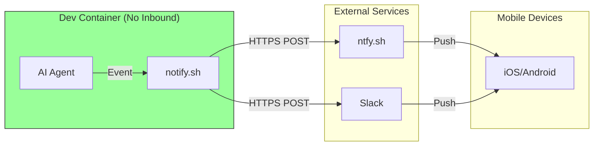
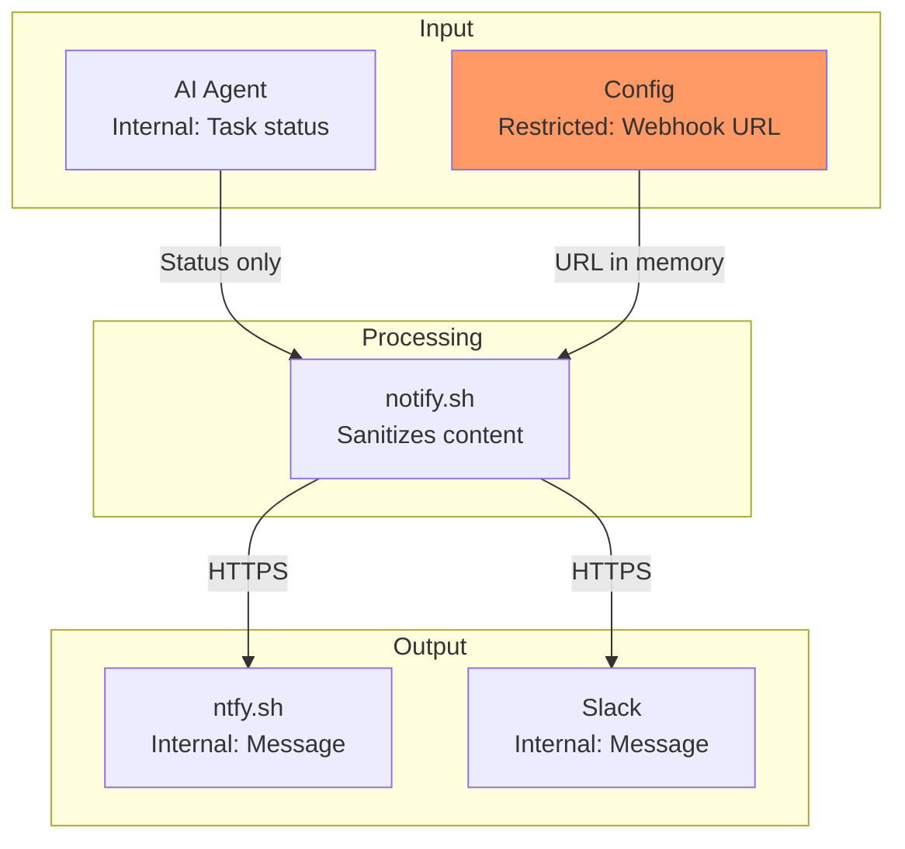
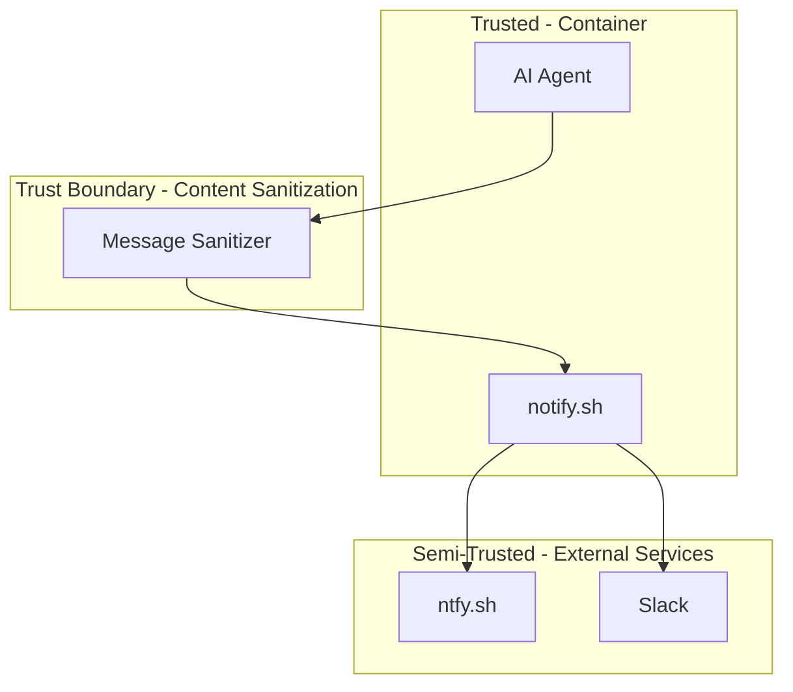

# 015-sec-mobile-access

> **Document Type:** Security Review (Lightweight)  
> **Audience:** LLM agents, human reviewers  
> **Status:** In Review  
> **Last Updated:** 2026-01-23 <!-- @auto -->  
> **Reviewer:** <!-- @human-required -->  
> **Risk Level:** Low <!-- @human-required -->

---

## Review Tier Legend

| Marker | Tier | Speckit Behavior |
|--------|------|------------------|
| 🔴 `@human-required` | Human Generated | Prompt human to author; blocks until complete |
| 🟡 `@human-review` | LLM + Human Review | LLM drafts → prompt human to confirm/edit; blocks until confirmed |
| 🟢 `@llm-autonomous` | LLM Autonomous | LLM completes; no prompt; logged for audit |
| ⚪ `@auto` | Auto-generated | System fills (timestamps, links); no prompt |

---

## Severity Definitions

| Level | Label | Definition |
|-------|-------|------------|
| 🔴 | **Critical** | Immediate exploitation risk; data breach or system compromise likely |
| 🟠 | **High** | Significant risk; exploitation possible with moderate effort |
| 🟡 | **Medium** | Notable risk; exploitation requires specific conditions |
| 🟢 | **Low** | Minor risk; limited impact or unlikely exploitation |

---

## Linkage ⚪ `@auto`

| Document | ID | Relationship |
|----------|-----|--------------|
| Parent PRD | 015-prd-mobile-access.md | Feature being reviewed |
| Architecture Decision Record | 015-ard-mobile-access.md | Technical implementation |

---

## Purpose

This is a **lightweight security review** intended to catch obvious security concerns early in the product lifecycle.

**This review answers three questions:**
1. What does this feature expose to attackers?
2. What data does it touch, and how sensitive is that data?
3. What's the impact if something goes wrong?

---

## Feature Security Summary

### One-line Summary 🔴 `@human-required`
> Outbound-only push notifications to external services—no inbound container exposure, minimal attack surface, low risk profile.

### Risk Assessment 🔴 `@human-required`
> **Risk Level:** Low  
> **Justification:** Outbound-only architecture eliminates inbound attack surface; primary risk is accidental data exposure in notification content.

---

## Attack Surface Analysis

### Exposure Points 🟡 `@human-review`

| Exposure Type | Details | Authentication | Authorization | Notes |
|---------------|---------|----------------|---------------|-------|
| **None** | **No inbound exposure** | — | — | Container only makes outbound calls |
| Outbound HTTP | ntfy.sh API | No (topic-based) | Topic subscription | Anyone with topic can receive |
| Outbound HTTP | Slack webhook | URL is secret | Webhook URL | URL must be protected |

### Attack Surface Diagram 🟢 `@llm-autonomous`

### Exposure Checklist 🟢 `@llm-autonomous`

- [x] **Internet-facing endpoints require authentication** — N/A (no inbound endpoints)
- [x] **No sensitive data in URL parameters** — Webhook URLs in env vars only
- [ ] **File uploads validated** — N/A (no uploads)
- [ ] **Rate limiting configured** — N/A (outbound only)
- [ ] **CORS policy is restrictive** — N/A (no web endpoints)
- [x] **No debug/admin endpoints exposed** — No endpoints exposed at all
- [ ] **Webhooks validate signatures** — N/A (outbound webhooks, not receiving)

---

## Data Flow Analysis

### Data Inventory 🟡 `@human-review`

| Data Element | PRD Entity | Classification | Source | Destination | Retention | Encrypted Rest | Encrypted Transit | Residency |
|--------------|------------|----------------|--------|-------------|-----------|----------------|-------------------|-----------|
| Notification message | — | Internal | AI Agent | ntfy.sh/Slack | Transient | No | Yes (HTTPS) | External |
| Slack webhook URL | Credential | **Restricted** | Environment var | Memory | Session | N/A | N/A | Container |
| ntfy.sh topic | Config | Internal | Config file | ntfy.sh | Session | No | Yes | Container |
| Task status | — | Internal | AI Agent | Notification | Transient | No | Yes | External |

### Data Classification Reference 🟢 `@llm-autonomous`

| Level | Label | Description | Examples | Handling Requirements |
|-------|-------|-------------|----------|----------------------|
| 1 | **Public** | No impact if disclosed | "Task completed" message | No special handling |
| 2 | **Internal** | Minor impact if disclosed | Task names, status | Access controls |
| 3 | **Confidential** | Significant impact if disclosed | — | Encryption, access controls |
| 4 | **Restricted** | Severe impact if disclosed | Slack webhook URL | Encryption, strict access |

### Data Flow Diagram 🟢 `@llm-autonomous`

### Data Handling Checklist 🟢 `@llm-autonomous`

- [x] **No Restricted data stored unless absolutely required** — Only webhook URL, in env var
- [x] **Confidential data encrypted at rest** — N/A (no confidential data)
- [x] **All data encrypted in transit (TLS 1.2+)** — HTTPS for all calls
- [ ] **PII has defined retention policy** — N/A (no PII)
- [x] **Logs do not contain Confidential/Restricted data** — Webhook URL never logged
- [x] **Secrets are not hardcoded** — Environment variables required
- [x] **Data minimization applied** — Only status summaries sent

---

## Third-Party & Supply Chain 🟡 `@human-review`

### New External Services

| Service | Purpose | Data Shared | Communication | Approved? |
|---------|---------|-------------|---------------|-----------|
| ntfy.sh | Push notifications | Status messages | HTTPS/TLS 1.3 | Yes |
| Slack Webhooks | Team notifications | Status messages | HTTPS/TLS 1.2+ | Yes |

### New Libraries/Dependencies

| Library | Version | License | Purpose | Security Check |
|---------|---------|---------|---------|----------------|
| curl | System | MIT | HTTP requests | System package ✅ |
| jq | System | MIT | JSON formatting | System package ✅ |

---

## CIA Impact Assessment

### Confidentiality 🟡 `@human-review`

> **What could be disclosed?**

| Asset at Risk | Disclosure Scenario | Impact | Likelihood |
|---------------|---------------------|--------|------------|
| Source code | Included in notification message | High | Low (if sanitized) |
| File paths | Included in notification message | Low | Low (if sanitized) |
| Slack webhook URL | Logged or committed to git | Medium | Low |

**Confidentiality Risk Level:** Low

### Integrity 🟡 `@human-review`

> **What could be modified or corrupted?**

| Asset at Risk | Modification Scenario | Impact | Likelihood |
|---------------|----------------------|--------|------------|
| Notification content | Attacker spoofs notifications | Low | Very Low |
| Developer decisions | Misleading notifications | Low | Very Low |

**Integrity Risk Level:** Low

### Availability 🟡 `@human-review`

> **What could be disrupted?**

| Service/Function | Disruption Scenario | Impact | Likelihood |
|------------------|---------------------|--------|------------|
| Notification delivery | ntfy.sh outage | Low | Low |
| Container operation | Script hangs | Low | Very Low |

**Availability Risk Level:** Low

### CIA Summary 🟢 `@llm-autonomous`

| Dimension | Risk Level | Primary Concern | Mitigation Priority |
|-----------|------------|-----------------|---------------------|
| **Confidentiality** | Low | Code/paths in notifications | Medium |
| **Integrity** | Low | No significant concerns | Low |
| **Availability** | Low | Service dependencies | Low |

**Overall CIA Risk:** Low — *Outbound-only architecture with sanitized content presents minimal risk.*

---

## Trust Boundaries 🟡 `@human-review`

### Trust Boundary Checklist 🟢 `@llm-autonomous`

- [x] **All input from untrusted sources is validated** — N/A (no inbound input)
- [ ] **External API responses are validated** — Not receiving meaningful responses
- [ ] **Authorization checked at data access** — N/A (outbound only)
- [ ] **Service-to-service calls are authenticated** — Webhook URL acts as auth

---

## Known Risks & Mitigations 🟡 `@human-review`

| ID | Risk Description | Severity | Mitigation | Status | Owner |
|----|------------------|----------|------------|--------|-------|
| R1 | Sensitive data in notification messages | 🟡 Medium | Content sanitization in notify.sh | Open | Dev |
| R2 | Slack webhook URL leaked via git commit | 🟡 Medium | Store in environment variable only | Mitigated | — |
| R3 | ntfy.sh topic guessed by attacker | 🟢 Low | Use unique, random topic name | Mitigated | — |
| R4 | Notification fatigue leads to ignored alerts | 🟢 Low | Priority levels, quiet hours | Mitigated | — |

### Risk Acceptance 🔴 `@human-required`

| Risk ID | Accepted By | Date | Justification | Review Date |
|---------|-------------|------|---------------|-------------|
| R3 | | | Topic names are unpredictable; worst case is spam, not data breach | |

---

## Security Requirements 🟡 `@human-review`

### Authentication & Authorization

| Req ID | Requirement | PRD AC | Verification Method |
|--------|-------------|--------|---------------------|
| SEC-1 | No inbound ports exposed on container | AC-4 | Network scan |

### Data Protection

| Req ID | Requirement | PRD AC | Verification Method |
|--------|-------------|--------|---------------------|
| SEC-2 | Notifications must not contain source code or secrets | — | Code Review |
| SEC-3 | Webhook URLs must be stored in environment variables | — | Code Review |

### Input Validation

| Req ID | Requirement | PRD AC | Verification Method |
|--------|-------------|--------|---------------------|
| SEC-4 | Message content must be truncated to safe length | — | Unit Test |
| SEC-5 | File paths must be stripped from notifications | — | Unit Test |

### Operational Security

| Req ID | Requirement | PRD AC | Verification Method |
|--------|-------------|--------|---------------------|
| SEC-6 | All outbound calls must use HTTPS | — | Code Review |
| SEC-7 | Webhook URLs must never appear in logs | — | Log Audit |

---

## Compliance Considerations 🟡 `@human-review`

| Regulation | Applicable? | Relevant Requirements | N/A Justification |
|------------|-------------|----------------------|-------------------|
| GDPR | No | — | No PII in notifications |
| CCPA | No | — | No personal data collected |
| SOC 2 | No | — | Internal dev tool only |
| HIPAA | No | — | No health data |
| PCI-DSS | No | — | No payment data |

---

## Review Findings

### Issues Identified 🟡 `@human-review`

| ID | Finding | Severity | Category | Recommendation | Status |
|----|---------|----------|----------|----------------|--------|
| F1 | Content sanitization not yet implemented | 🟡 Medium | Data | Add regex filters for code, paths | Open |
| F2 | No message length validation | 🟢 Low | Data | Truncate to 200 chars | Open |

### Positive Observations 🟢 `@llm-autonomous`

- Outbound-only architecture eliminates inbound attack surface
- No sensitive data storage required
- Using established, reliable notification services
- Environment variables for secrets follows best practices
- Simple implementation reduces complexity-related risks

---

## Open Questions 🟡 `@human-review`

- [ ] **Q1:** Should ntfy.sh topics include authentication tokens?
- [ ] **Q2:** Is self-hosted ntfy.sh preferred for sensitive environments?

---

## Changelog ⚪ `@auto`

| Version | Date | Author | Changes |
|---------|------|--------|---------|
| 0.1 | 2026-01-23 | Claude | Initial review |

---

## Review Sign-off 🔴 `@human-required`

| Role | Name | Date | Decision |
|------|------|------|----------|
| Security Reviewer | | | [ ] Approved / [ ] Approved with conditions / [ ] Rejected |
| Feature Owner | Brian | | [ ] Acknowledged |

### Conditions for Approval (if applicable) 🔴 `@human-required`

- [ ] F1: Implement content sanitization before production use

---

## Security Requirements Traceability 🟢 `@llm-autonomous`

| SEC Req ID | PRD Req ID | PRD AC ID | Test Type | Test Location |
|------------|------------|-----------|-----------|---------------|
| SEC-1 | M-4 | AC-4 | Network | Security scan |
| SEC-2 | — | — | Code Review | notify.sh |
| SEC-3 | — | — | Code Review | Configuration |
| SEC-4 | — | — | Unit | tests/notify_test |
| SEC-5 | — | — | Unit | tests/notify_test |
| SEC-6 | — | — | Code Review | notify.sh |
| SEC-7 | — | — | Manual | Log audit |

---

## Review Checklist 🟢 `@llm-autonomous`

Before marking as Approved:
- [x] Attack surface documented with auth/authz status for each exposure
- [x] Exposure Points table has no contradictory rows
- [x] All PRD Data Model entities appear in Data Inventory
- [x] All data elements are classified using the 4-tier model
- [x] Third-party dependencies and services are listed
- [x] CIA impact is assessed with Low/Medium/High ratings
- [x] Trust boundaries are identified
- [x] Security requirements have verification methods specified
- [x] Security requirements trace to PRD ACs where applicable
- [ ] No Critical/High findings remain Open
- [x] Compliance N/A items have justification
- [ ] Risk acceptance has named approver and review date
