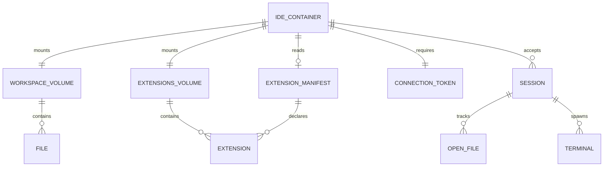

# Data Model: Containerized IDE

**Phase**: 1 (Design & Contracts)
**Date**: 2026-01-23
**Feature**: 008-containerized-ide

## Overview

This feature is infrastructure-focused — it configures a pre-built binary (OpenVSCode-Server) via Docker. The "data model" is file-based configuration and volume state, not a database schema.

---

## Entities

### IDE Container

| Attribute | Type | Description | Validation |
|-----------|------|-------------|------------|
| image | string | Docker image reference | Must be `gitpod/openvscode-server:<version>` |
| port | integer | Exposed HTTP/WebSocket port | Fixed: 3000 |
| user | integer | Container user UID | Fixed: 1000 (non-root) |
| memory_limit | string | Container memory constraint | Default: 512m |
| connection_token | string (env) | Authentication token | Min 32 chars, hex, from CSPRNG |

**State Transitions**:
```
Created → Starting (entrypoint runs) → Running (server listening) → Stopped
                                      ↗ Error (port conflict, missing volume)
```

**Relationships**:
- Has one Workspace Volume (mounted at `/home/workspace`)
- Has one Extensions Volume (mounted at `/home/.openvscode-server/extensions`)
- Reads one Extension Manifest (at startup)
- Accepts many Sessions (browser connections)

---

### Workspace Volume

| Attribute | Type | Description | Validation |
|-----------|------|-------------|------------|
| name | string | Docker volume name | Convention: `<project>_workspace` |
| mount_path | string | Container mount point | Fixed: `/home/workspace` |
| driver | string | Volume driver | Default: `local` |

**Lifecycle**: Persists independently of container. Created on first `docker compose up`, survives container rebuilds. Destroyed only by explicit `docker volume rm`.

**Contents**:
- Source code files
- Git repository (`.git/`)
- Project configuration files
- User-created files

---

### Extensions Volume

| Attribute | Type | Description | Validation |
|-----------|------|-------------|------------|
| name | string | Docker volume name | Convention: `<project>_extensions` |
| mount_path | string | Container mount point | Fixed: `/home/.openvscode-server/extensions` |
| driver | string | Volume driver | Default: `local` |

**Lifecycle**: Same as Workspace Volume — persists across restarts and rebuilds.

**Contents**:
- Installed extension directories (one per extension)
- Extension metadata and activation state
- User settings (`settings.json`, `keybindings.json`)

---

### Extension Manifest

| Attribute | Type | Description | Validation |
|-----------|------|-------------|------------|
| recommendations | string[] | Extension IDs from Open VSX | Format: `publisher.extension-name` |
| unwantedRecommendations | string[] (optional) | Extensions to exclude | Format: `publisher.extension-name` |

**Schema** (`extensions.json`):
```json
{
  "recommendations": [
    "ms-python.python",
    "rust-lang.rust-analyzer",
    "esbenp.prettier-vscode",
    "dbaeumer.vscode-eslint"
  ],
  "unwantedRecommendations": []
}
```

**Validation Rules**:
- `recommendations` array must not be empty
- Each ID must match pattern `^[a-zA-Z0-9-]+\.[a-zA-Z0-9-]+$`
- Duplicate IDs are ignored (idempotent install)

---

### Connection Token

| Attribute | Type | Description | Validation |
|-----------|------|-------------|------------|
| value | string | Hex-encoded random bytes | Min 32 chars (128 bits entropy) |
| source | string | How token is provided | Must be environment variable `CONNECTION_TOKEN` |

**Generation**: `head -c 16 /dev/urandom | xxd -p` (produces 32 hex chars)

**Lifecycle**: Generated once by developer (or `generate-token.sh`), stored in `.env` file (gitignored), injected at container start, persists until developer rotates.

**Security Constraints**:
- Never appears in Dockerfile or image layers
- Never logged by server process
- Not committed to version control (`.env` in `.gitignore`)

---

### Session

| Attribute | Type | Description | Validation |
|-----------|------|-------------|------------|
| connection_id | string | WebSocket connection identifier | Server-generated |
| authenticated | boolean | Token validated | Must be true for any operations |
| open_files | string[] | Currently open editor tabs | File paths relative to workspace |
| terminal_pids | integer[] | Active PTY processes | Container PIDs |

**Lifecycle**: Created on WebSocket upgrade with valid token. Destroyed on browser disconnect or container stop. Not persisted across restarts (ephemeral state).

---

## Entity Relationships



---

## Configuration Files

### `.env` (gitignored)

```bash
# Generated by: ./scripts/generate-token.sh
CONNECTION_TOKEN=a1b2c3d4e5f6a7b8c9d0e1f2a3b4c5d6

# Optional: override port (default 3000)
# IDE_PORT=3000
```

### `.env.example` (committed)

```bash
# Copy to .env and fill in values
# Generate token: ./scripts/generate-token.sh
CONNECTION_TOKEN=<generate-with-scripts/generate-token.sh>
```
