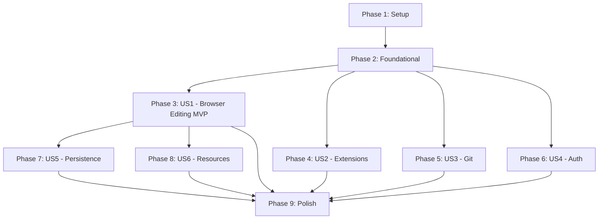

# Tasks: Containerized IDE

**Input**: Design documents from `/specs/008-containerized-ide/`
**Prerequisites**: plan.md (required), spec.md (required), research.md, data-model.md, contracts/

**Tests**: Integration tests are included as the spec explicitly defines test scenarios and the constitution mandates test-first development (Principle III).

**Organization**: Tasks are grouped by user story to enable independent implementation and testing of each story.

## Format: `[ID] [P?] [Story] Description`

- **[P]**: Can run in parallel (different files, no dependencies)
- **[Story]**: Which user story this task belongs to (e.g., US1, US2, US3)
- Include exact file paths in descriptions

---

## Phase 1: Setup (Shared Infrastructure)

**Purpose**: Project initialization and directory structure

- [x] T001 Create source directory structure: `src/docker/`, `src/scripts/`, `src/config/`
- [x] T002 [P] Create test directory structure: `tests/integration/`, `tests/contract/`
- [x] T003 [P] Create `.env.example` with `CONNECTION_TOKEN=<generate-with-scripts/generate-token.sh>` at repo root
- [x] T004 [P] Add `.env` to `.gitignore` if not already present
- [x] T005 [P] Create `src/config/extensions.json` with initial extension manifest (Python, Rust, Prettier, ESLint) per data-model.md schema

---

## Phase 2: Foundational (Blocking Prerequisites)

**Purpose**: Core container configuration that MUST be complete before ANY user story can be implemented

**CRITICAL**: No user story work can begin until this phase is complete

- [x] T006 Create `src/scripts/generate-token.sh` — generates 32-char hex token via `/dev/urandom`, outputs `CONNECTION_TOKEN=<value>` format
- [x] T007 Create `src/docker/Dockerfile.ide` — FROM `gitpod/openvscode-server:1.96.4`, preserve UID 1000, COPY entrypoint script, set ENTRYPOINT
- [x] T008 Create `src/scripts/ide-entrypoint.sh` — minimal entrypoint that validates CONNECTION_TOKEN length (≥32 chars), then `exec` launches server with `--host 0.0.0.0 --port 3000 --connection-token $CONNECTION_TOKEN` (extension install logic added in US2/T024)
- [x] T009 Create `src/docker/docker-compose.ide.yml` — IDE service per `contracts/docker-compose.yml` spec (127.0.0.1:3000, volumes, mem_limit, healthcheck, user 1000)
- [x] T010 [P] Validate `src/scripts/generate-token.sh` passes shellcheck
- [x] T011 [P] Validate `src/scripts/ide-entrypoint.sh` passes shellcheck

**Checkpoint**: Foundation ready — container builds, starts, and exposes port 3000. User story implementation can now begin.

---

## Phase 3: User Story 1 — Browser-Based Code Editing (Priority: P1) MVP

**Goal**: Developer opens browser to localhost:3000 and gets a full VS Code-compatible editor with syntax highlighting, file explorer, and terminal — no host IDE installation required.

**Independent Test**: Start container, navigate to URL, verify editor loads with syntax highlighting and terminal access.

### Tests for User Story 1

> **NOTE: Write these tests FIRST, ensure they FAIL before implementation**

- [x] T012 [P] [US1] Integration test: container starts and HTTP 200 on localhost:3000 within 30s in `tests/integration/test-ide-startup.sh`
- [x] T013 [P] [US1] Integration test: integrated terminal spawns bash shell — verify WebSocket terminal endpoint responds and `docker exec` shell works in `tests/integration/test-ide-terminal.sh`
- [x] T014 [P] [US1] Contract test: container exposes only port 3000, runs as UID 1000, binds to 127.0.0.1 in `tests/contract/test-ide-interface.sh`

### Implementation for User Story 1

- [x] T015 [US1] Build Docker image from `src/docker/Dockerfile.ide` and verify it starts successfully
- [x] T016 [US1] Verify `docker compose -f src/docker/docker-compose.ide.yml up -d` starts IDE and healthcheck passes
- [x] T017 [US1] Verify HTTP 200 response on `http://localhost:3000` with valid token (curl assertion)
- [x] T018 [US1] Verify integrated terminal: (a) `docker exec <container> bash -c 'echo hello'` returns output, (b) WebSocket upgrade to terminal endpoint succeeds with valid token via `curl --include --no-buffer -H "Upgrade: websocket"`
- [x] T019 [US1] Verify multi-arch: run `docker buildx build --platform linux/amd64,linux/arm64` on `src/docker/Dockerfile.ide`
- [x] T020 [US1] Verify idle memory < 50MB via `docker stats --no-stream` after 10s idle
- [x] T021 [US1] Verify image size < 1GB via `docker images --format '{{.Size}}'`

**Checkpoint**: User Story 1 complete — developer can open browser and edit code with terminal access.

---

## Phase 4: User Story 2 — Extension-Powered Language Support (Priority: P2)

**Goal**: Developer installs language extensions from Open VSX, gets IntelliSense and debugging. Extensions persist across container restarts via volume. Project manifest auto-installs declared extensions.

**Independent Test**: Install Python extension, verify IntelliSense activates, restart container, verify extension still present.

### Tests for User Story 2

- [x] T022 [P] [US2] Integration test: extensions from manifest install on startup in `tests/integration/test-ide-extensions.sh`
- [x] T023 [P] [US2] Integration test: extensions persist after container restart in `tests/integration/test-ide-extensions.sh` (second test case)

### Implementation for User Story 2

- [x] T024 [US2] Implement extension install logic in `src/scripts/ide-entrypoint.sh` — parse `extensions.json`, loop over IDs, install missing via `openvscode-server --install-extension`
- [x] T025 [US2] Handle Open VSX unavailability gracefully in `src/scripts/ide-entrypoint.sh` — log warning, continue startup
- [x] T026 [US2] Verify extensions volume mount preserves installed extensions across `docker compose down && docker compose up`
- [x] T027 [US2] Verify VSIX sideloading works: copy `.vsix` file into container, install via CLI
- [x] T028 [US2] Verify manifest installs are idempotent — restarting container doesn't re-download existing extensions

**Checkpoint**: User Story 2 complete — extensions install automatically and persist across restarts.

---

## Phase 5: User Story 3 — Git Integration and Version Control (Priority: P2)

**Goal**: Developer uses the IDE's built-in git UI to view diffs, stage, commit, and switch branches within the workspace.

**Independent Test**: Make file changes in workspace, verify IDE git panel shows diffs, create commit via UI.

### Tests for User Story 3

> **NOTE: Write these tests FIRST, ensure they FAIL before implementation**

- [x] T029 [P] [US3] Integration test: git CLI available and functional inside container in `tests/integration/test-ide-git.sh`
- [x] T030 [P] [US3] Integration test: git diff/stage/commit works in workspace volume in `tests/integration/test-ide-git.sh` (second case)

### Implementation for User Story 3

- [x] T031 [US3] Verify git CLI is available inside container: `docker exec <container> git --version`
- [x] T032 [US3] Verify workspace volume contains a git repository: init a repo in mounted volume, confirm `.git/` visible in IDE file explorer
- [x] T033 [US3] Verify git identity configured: set `user.name` and `user.email` via env vars or volume-mounted `.gitconfig`
- [x] T034 [US3] Document git credential helper configuration for workspace in `quickstart.md`

**Checkpoint**: User Story 3 complete — git operations work through IDE UI.

---

## Phase 6: User Story 4 — Token-Based Authentication (Priority: P2)

**Goal**: Connection token prevents unauthorized access. Invalid/missing tokens return 401. Failed attempts are logged.

**Independent Test**: Access IDE URL without token, verify 401 returned. Access with valid token, verify full access.

### Tests for User Story 4

- [x] T035 [P] [US4] Integration test: HTTP 401 returned when no token provided in `tests/integration/test-ide-auth.sh`
- [x] T036 [P] [US4] Integration test: HTTP 401 returned with invalid token in `tests/integration/test-ide-auth.sh` (second case)
- [x] T037 [P] [US4] Integration test: access granted with valid token in `tests/integration/test-ide-auth.sh` (third case)

### Implementation for User Story 4

- [x] T038 [US4] Verify `--connection-token` flag is passed correctly from `CONNECTION_TOKEN` env var in `src/scripts/ide-entrypoint.sh`
- [x] T039 [US4] Verify token is minimum 32 characters — add validation in `src/scripts/ide-entrypoint.sh` (exit with error if too short)
- [x] T040 [US4] Verify token does not appear in `docker logs` output after container start
- [x] T041 [US4] Verify token does not appear in any image layer via `docker history`
- [x] T042 [US4] Verify `generate-token.sh` produces 32 hex chars from CSPRNG
- [x] T043 [US4] Verify failed auth attempts are logged with timestamps to container stdout via `docker logs` (FR-020)

**Checkpoint**: User Story 4 complete — unauthorized access blocked, token never leaked.

---

## Phase 7: User Story 5 — Persistent Workspace Configuration (Priority: P3)

**Goal**: IDE settings (theme, font size, keybindings) persist across container restarts and rebuilds via volume mounts.

**Independent Test**: Change an IDE setting, restart container, verify setting preserved.

### Tests for User Story 5

- [x] T044 [US5] Integration test: workspace files persist after restart in `tests/integration/test-ide-volumes.sh`
- [x] T045 [P] [US5] Integration test: IDE settings persist after restart in `tests/integration/test-ide-volumes.sh` (second case)

### Implementation for User Story 5

- [x] T046 [US5] Verify workspace volume mount at `/home/workspace` survives `docker compose down && up` (files still present)
- [x] T047 [US5] Verify extensions volume stores settings.json — check path `/home/.openvscode-server/data/Machine/settings.json` persists
- [x] T048 [US5] Verify container rebuild (`docker compose build && up`) preserves volume data

**Checkpoint**: User Story 5 complete — developer environment persists across restarts and rebuilds.

---

## Phase 8: User Story 6 — Resource-Efficient Operation (Priority: P3)

**Goal**: IDE operates within 512MB memory limit, starts within 30s cold, and remains responsive under constraint.

**Independent Test**: Monitor `docker stats` during editing with language server; verify within bounds.

### Implementation for User Story 6

- [x] T049 [US6] Verify `mem_limit: 512m` and `memswap_limit: 512m` in `src/docker/docker-compose.ide.yml`
- [x] T050 [US6] Verify cold startup time < 30s: time from `docker compose up` to HTTP 200
- [x] T051 [US6] Verify warm startup time < 5s: time from `docker compose restart` to HTTP 200
- [x] T052 [US6] Verify container does not OOM-kill under typical load — install Python extension, open .py file, verify memory < 500MB (SC-003)
- [x] T053 [US6] Document resource requirements and tuning guidance in `quickstart.md`

**Checkpoint**: User Story 6 complete — IDE is resource-efficient and starts quickly.

---

## Phase 9: Polish & Cross-Cutting Concerns

**Purpose**: Improvements that affect multiple user stories

- [x] T054 [P] Add `make ide-up`, `make ide-down`, `make ide-token` convenience targets in `Makefile`
- [x] T055 [P] Run shellcheck on all scripts in `src/scripts/` — fix any warnings
- [x] T056 Validate quickstart.md end-to-end: follow all steps on a clean machine
- [x] T057 [P] Add multi-arch CI build verification in `.github/workflows/` (if CI exists)
- [x] T058 Create `tests/integration/test-ide-multiarch.sh` — verify `docker buildx build` succeeds for both platforms
- [x] T059 Security hardening review: verify no secrets in layers, no root processes, no world-writable files

---

## Dependencies & Execution Order

### Phase Dependencies

- **Setup (Phase 1)**: No dependencies — can start immediately
- **Foundational (Phase 2)**: Depends on Setup — BLOCKS all user stories
- **User Stories (Phases 3–8)**: All depend on Foundational phase completion
  - US1 (P1): Independent — MVP target
  - US2 (P2): Independent (uses extension manifest from Setup)
  - US3 (P2): Independent (uses git from base image)
  - US4 (P2): Independent (uses token from Foundational)
  - US5 (P3): Depends on US1 running (needs IDE to generate settings)
  - US6 (P3): Depends on US1 running (needs IDE to measure resources)
- **Polish (Phase 9)**: Depends on all desired user stories being complete

### User Story Dependencies



### Within Each User Story

- Tests MUST be written and FAIL before implementation
- Infrastructure before verification
- Core functionality before edge cases
- Story complete before moving to next priority

### Parallel Opportunities

- T002/T003/T004/T005: All setup tasks on different files
- T010/T011: Shellcheck validation independent
- T012/T013/T014: US1 tests on different files
- T022/T023: US2 tests can be written in parallel
- T029/T030: US3 tests can be written in parallel
- T035/T036/T037: US4 tests on same file but independent cases
- US2, US3, US4: Can be worked in parallel after Foundation + US1
- T054/T055/T057: Polish tasks on different files

---

## Parallel Example: User Story 1

```bash
# Launch all tests for US1 together (they target different test files):
Task: "Integration test: container starts and HTTP 200 in tests/integration/test-ide-startup.sh"
Task: "Integration test: terminal spawns bash in tests/integration/test-ide-terminal.sh"
Task: "Contract test: port/user/binding validation in tests/contract/test-ide-interface.sh"
```

## Parallel Example: User Story 4

```bash
# Launch all auth tests together (same file, independent cases):
Task: "Integration test: 401 without token in tests/integration/test-ide-auth.sh"
Task: "Integration test: 401 with invalid token in tests/integration/test-ide-auth.sh"
Task: "Integration test: access with valid token in tests/integration/test-ide-auth.sh"
```

---

## Implementation Strategy

### MVP First (User Story 1 Only)

1. Complete Phase 1: Setup (T001–T005)
2. Complete Phase 2: Foundational (T006–T011)
3. Complete Phase 3: User Story 1 (T012–T021)
4. **STOP and VALIDATE**: Container starts, browser shows IDE, terminal works
5. Demo: "Look, a full VS Code in a browser from one `docker compose up`"

### Incremental Delivery

1. Setup + Foundational → Container builds and runs
2. US1 → Browser editing works (MVP!)
3. US4 → Token auth secures access (security baseline)
4. US2 → Extensions install and persist (full IDE experience)
5. US3 → Git works through UI (developer workflow complete)
6. US5 + US6 → Polish: persistence and resource efficiency
7. Phase 9 → CI, docs, Makefile conveniences

### Parallel Team Strategy

With multiple developers after Foundational completes:

1. Developer A: User Story 1 (MVP — critical path)
2. Developer B: User Story 4 (auth — can test against Foundation container)
3. After US1: Developer A takes US2, Developer B takes US3
4. US5/US6 after US1 validates

---

## Notes

- [P] tasks = different files, no dependencies
- [Story] label maps task to specific user story for traceability
- Each user story is independently completable and testable (except US5/US6 which need running IDE from US1)
- Constitution Principle III: Write tests FIRST, verify they FAIL, then implement
- Commit after each task or logical group
- Stop at any checkpoint to validate story independently
- The Docker Compose contract (`contracts/docker-compose.yml`) is the source of truth for service configuration
