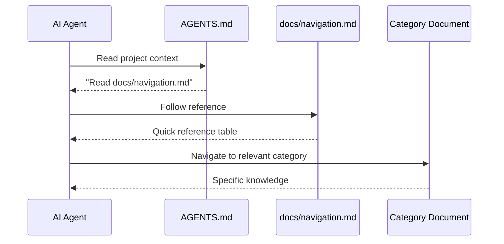

# AGENTS.md Integration Contract

> This defines the section to add to the project's AGENTS.md file
> for cross-tool AI agent discovery of the documentation system.

## Required Addition to AGENTS.md

Add the following section to the project's AGENTS.md (after existing project context):

```markdown
## Project Knowledge

Before implementing features that touch architectural boundaries, read
docs/navigation.md for a map of documented architecture decisions, domain
terminology, and design patterns. Check docs/decisions/ for relevant
Architecture Decision Records before proposing new architectural approaches.
```

## Cross-Tool Notes

- **Claude Code**: Also supports `@docs/navigation.md` import syntax in CLAUDE.md
- **Cline**: Reads AGENTS.md and follows explicit file path references
- **Continue**: Reads AGENTS.md; can also be configured via `.continue/config.yaml`

## Discovery Flow


