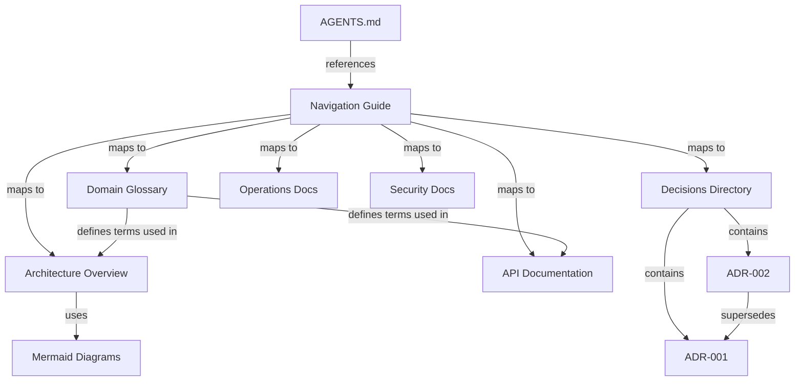

# Data Model: 014-project-knowledge

**Date**: 2026-01-23

## Entities

### Architecture Decision Record (ADR)

| Field | Type | Required | Description |
|-------|------|----------|-------------|
| number | Integer (3-digit, zero-padded) | Yes | Sequential identifier (001, 002, ...) |
| title | String (kebab-case) | Yes | Short noun-phrase title for filename |
| status | Enum | Yes | `proposed`, `accepted`, `deprecated`, `superseded` |
| date | Date (YYYY-MM-DD) | Yes | Date of last status change |
| deciders | String[] | Yes | People involved in the decision |
| context | Markdown text | Yes | Value-neutral description of forces at play |
| decision | Markdown text | Yes | Active voice statement ("We will...") |
| alternatives | Alternative[] | Yes | At least one rejected alternative |
| consequences_positive | String[] | Yes | What becomes easier or possible |
| consequences_negative | String[] | Yes | Trade-offs accepted |
| follow_up_actions | String[] | No | Immediate tasks created by this decision |
| superseded_by | ADR reference | No | Link to replacing ADR (when status=superseded) |

#### Alternative (nested)

| Field | Type | Required | Description |
|-------|------|----------|-------------|
| name | String | Yes | Alternative approach name |
| pros | String[] | Yes | Benefits of this approach |
| cons | String[] | Yes | Drawbacks of this approach |
| why_rejected | String | Yes | One sentence explanation |

#### Identity & Uniqueness
- File: `docs/decisions/NNN-kebab-case-title.md`
- Number is globally unique within the project, monotonically increasing
- Title must be unique (enforced by filename)

#### State Transitions
```
proposed → accepted
proposed → deprecated (withdrawn before acceptance)
accepted → deprecated (no longer applicable)
accepted → superseded (replaced by newer ADR)
```

#### Validation Rules
- Number must be exactly 3 digits, zero-padded
- Status must be one of the four valid values
- Date must be valid ISO 8601 date
- Context and Decision sections must be non-empty
- At least one alternative must be listed
- If status is `superseded`, `superseded_by` must reference a valid ADR

---

### Navigation Guide

| Field | Type | Required | Description |
|-------|------|----------|-------------|
| quick_reference | Table | Yes | Maps user needs to file paths |
| usage_instructions | Markdown | Yes | How AI agents should use this guide |
| document_conventions | Markdown | Yes | Formatting and size conventions |

#### Identity & Uniqueness
- Single file: `docs/navigation.md`
- Referenced from project AGENTS.md

#### Validation Rules
- Must be under 500 lines (FR-014)
- All referenced file paths must exist
- Quick reference table must cover all documentation categories

---

### Domain Glossary

| Field | Type | Required | Description |
|-------|------|----------|-------------|
| terms | GlossaryEntry[] | Yes | List of domain-specific terms |

#### GlossaryEntry (nested)

| Field | Type | Required | Description |
|-------|------|----------|-------------|
| term | String | Yes | Canonical term name |
| definition | String | Yes | Project-specific meaning |
| aliases | String[] | No | Alternative names (avoid in code) |
| code_mapping | String | No | How this maps to code (class, module, variable) |
| related_terms | String[] | No | Cross-references to other glossary entries |

#### Identity & Uniqueness
- Single file: `docs/domain/glossary.md`
- Terms are alphabetically ordered
- Each term appears exactly once

#### Validation Rules
- Terms must be unique (case-insensitive)
- Definitions must be non-empty
- Related terms must reference existing glossary entries

---

### Architecture Overview

| Field | Type | Required | Description |
|-------|------|----------|-------------|
| system_description | Markdown | Yes | High-level system purpose and boundaries |
| components | Component[] | Yes | Major system components |
| diagrams | MermaidDiagram[] | No | Visual representations |
| design_patterns | String[] | No | Patterns used and where |

#### Component (nested)

| Field | Type | Required | Description |
|-------|------|----------|-------------|
| name | String | Yes | Component name |
| purpose | String | Yes | What this component does |
| technology | String | No | Tech stack used |
| communicates_with | String[] | No | Other components it interacts with |

#### MermaidDiagram (nested)

| Field | Type | Required | Description |
|-------|------|----------|-------------|
| title | String | Yes | What the diagram shows |
| prose_description | String | Yes | Text description before diagram |
| type | Enum | Yes | `flowchart`, `sequence`, `state` |
| content | Mermaid syntax | Yes | The diagram code |

#### Identity & Uniqueness
- Primary file: `docs/architecture/overview.md`
- Optional additional file: `docs/architecture/diagrams.md`

#### Validation Rules
- Must be under 500 lines per file
- Mermaid diagrams must have fewer than 15 nodes each
- Each diagram must have a prose description preceding it

---

### Documentation Category

| Field | Type | Required | Description |
|-------|------|----------|-------------|
| name | String | Yes | Category identifier |
| directory | Path | Yes | Subdirectory under `docs/` |
| purpose | String | Yes | When to consult this category |
| files | String[] | Yes | Documents in this category |

#### Standard Categories

| Category | Directory | Purpose |
|----------|-----------|---------|
| Architecture | `docs/architecture/` | System structure, components, patterns |
| Decisions | `docs/decisions/` | ADRs for architectural choices |
| API | `docs/api/` | Interface design, endpoints, principles |
| Domain | `docs/domain/` | Business terms, ubiquitous language |
| Operations | `docs/operations/` | Deployment, runbooks, monitoring |
| Security | `docs/security/` | Auth patterns, threat model, policies |

## Relationships



## File Size Constraints

All documentation files must remain under 500 lines (FR-014 / SC-005). When a document approaches this limit:
1. Split into focused sub-documents
2. Update navigation guide to reference new files
3. Maintain cross-links between related sections
