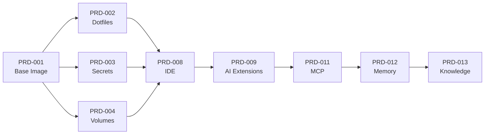
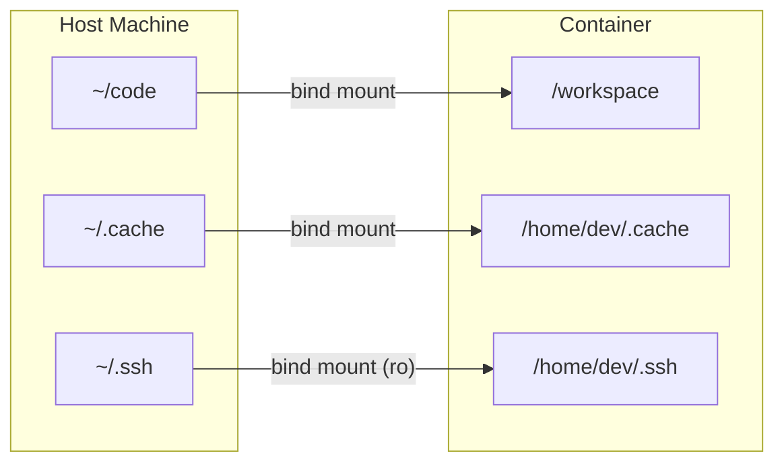

# Container Diagram

<!--
AI Agent Instructions:
- This diagram shows the major components inside the container
- Each component corresponds to a PRD in the project
- Components are layered: base → config → tools → IDE
-->

## Overview

The container is built in layers, each PRD adding functionality on top of the previous.

## Container Architecture

```mermaid
graph TB
    subgraph Container["Development Container"]
        subgraph Base["Base Layer (PRD-001)"]
            Debian["Debian Bookworm-slim"]
            DevTools["Dev Tools<br/>git, curl, make"]
            Runtimes["Runtimes<br/>Python, Node.js"]
        end

        subgraph Config["Configuration Layer"]
            Chezmoi["Dotfiles (PRD-002)<br/>Chezmoi"]
            Secrets["Secrets (PRD-003)<br/>age encryption"]
        end

        subgraph Storage["Storage Layer (PRD-004)"]
            Volumes["Volume Mounts<br/>code, cache, data"]
        end

        subgraph IDE["IDE Layer (PRD-008)"]
            CodeServer["code-server<br/>VS Code in browser"]
            Extensions["AI Extensions (PRD-009)<br/>Continue, Cline"]
        end

        subgraph AI["AI Layer"]
            MCP["MCP Servers (PRD-011)<br/>Tool integration"]
            Memory["Memory Bank (PRD-012)<br/>Session context"]
            Knowledge["Project Knowledge (PRD-013)<br/>Documentation"]
        end
    end

    Debian --> DevTools
    DevTools --> Runtimes
    Runtimes --> Chezmoi
    Chezmoi --> Secrets
    Secrets --> Volumes
    Volumes --> CodeServer
    CodeServer --> Extensions
    Extensions --> MCP
    MCP --> Memory
    Memory --> Knowledge
```

## Component Responsibilities

| Component | PRD | Responsibility |
|-----------|-----|----------------|
| **Base Image** | 001 | OS, system packages, runtimes |
| **Dotfiles** | 002 | Shell config, editor settings |
| **Secrets** | 003 | API keys, credentials |
| **Volumes** | 004 | Code, cache, persistent data |
| **IDE** | 008 | code-server, browser access |
| **AI Extensions** | 009 | Continue, Cline for AI assistance |
| **MCP** | 011 | Tool integration for AI |
| **Memory Bank** | 012 | Session context persistence |
| **Project Knowledge** | 013 | Documentation for AI |

## Layer Dependencies

## Volume Mount Structure

