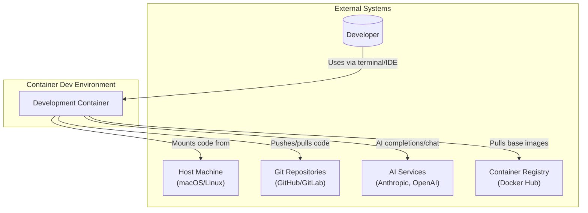
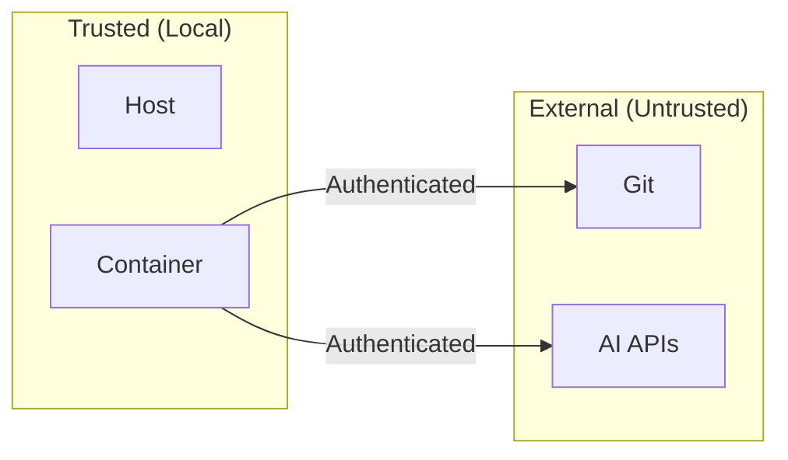

# System Context Diagram

<!--
AI Agent Instructions:
- This diagram shows container-dev-env and its external interactions
- The developer is the primary user
- External services are accessed via API keys (injected as secrets)
-->

## Overview

The Container Development Environment provides an isolated, reproducible development workspace with AI-powered assistance.

## Context Diagram

## External Dependencies

| System | Purpose | Integration |
|--------|---------|-------------|
| **Host Machine** | Code storage, Docker runtime | Volume mounts, Docker socket |
| **Git Repositories** | Version control, collaboration | SSH keys, HTTPS tokens |
| **AI Services** | Code completions, chat | API keys via secrets |
| **Container Registry** | Base images, caching | Pull on build |

## Data Flows

| Flow | Direction | Data | Security |
|------|-----------|------|----------|
| Code | Host → Container | Source files | Volume mount (rw) |
| Git operations | Container ↔ Git | Code, commits | SSH/HTTPS auth |
| AI requests | Container → AI | Code context, prompts | TLS, API keys |
| Container images | Registry → Container | Image layers | TLS |

## Trust Boundaries

