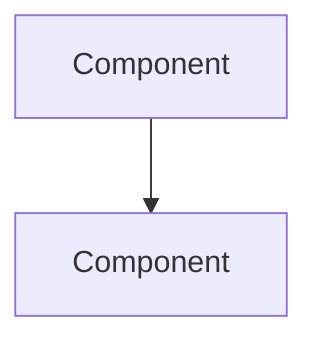

# Documentation Guide for AI Agents

<!--
This file helps AI coding agents navigate project documentation.
Place this file at docs/AGENTS.md in your repository.
-->

## Quick Navigation

| Need to... | Go to |
|------------|-------|
| Understand the system | [Architecture Overview](./architecture/overview.md) |
| Know why a decision was made | [ADRs](./architecture/decisions/) |
| See system diagrams | [Diagrams](./architecture/diagrams/) |
| Learn domain terminology | [Glossary](./domain/glossary.md) |
| Understand business logic | [Domain Model](./domain/model.md) |
| Check API contracts | [API Endpoints](./api/endpoints.md) |
| Find operational procedures | [Runbooks](./operations/runbooks/) |
| Review security requirements | [Security](./security/) |

## Documentation Structure

```
docs/
├── AGENTS.md               # This file - AI navigation guide
├── architecture/
│   ├── overview.md         # High-level system architecture
│   ├── patterns.md         # Code patterns used
│   ├── decisions/          # Architecture Decision Records
│   │   ├── 001-*.md
│   │   ├── 002-*.md
│   │   └── template.md
│   └── diagrams/           # System diagrams (Mermaid)
├── api/
│   ├── overview.md         # API design principles
│   ├── endpoints.md        # Endpoint documentation
│   └── schemas/            # Request/response schemas
├── domain/
│   ├── model.md            # Domain model explanation
│   ├── glossary.md         # Business terminology
│   └── workflows.md        # Business processes
├── operations/
│   ├── runbooks/           # Operational procedures
│   ├── monitoring.md       # Observability
│   └── deployment.md       # Deployment process
└── security/
    ├── threat-model.md     # Security considerations
    └── auth.md             # Authentication/authorization
```

## When to Consult Documentation

### Before Adding Features

1. Read relevant [ADRs](./architecture/decisions/) to understand past decisions
2. Check [patterns.md](./architecture/patterns.md) for established patterns
3. Review [domain model](./domain/model.md) for affected entities
4. Verify [glossary](./domain/glossary.md) for correct terminology

### Before Modifying Architecture

1. Read [architecture overview](./architecture/overview.md)
2. Check if an [ADR](./architecture/decisions/) exists for the area
3. If proposing changes, create a new ADR first

### Before API Changes

1. Review [API overview](./api/overview.md) for design principles
2. Check existing [endpoints](./api/endpoints.md) for consistency
3. Verify request/response formats match [schemas](./api/schemas/)

### Before Domain Logic Changes

1. Understand the [domain model](./domain/model.md)
2. Use correct terms from [glossary](./domain/glossary.md)
3. Check [workflows](./domain/workflows.md) for process impacts

## Documentation Conventions

### File Naming

- ADRs: `NNN-short-title.md` (e.g., `001-use-postgresql.md`)
- Diagrams: `kebab-case.md` (e.g., `system-context.md`)
- Use lowercase with hyphens

### Frontmatter

All docs may include YAML frontmatter:

```yaml
---
title: Document Title
last_updated: 2024-01-01
status: current | draft | deprecated
tags: [architecture, api, domain]
---
```

### Diagrams

All diagrams use Mermaid format for AI parseability:



### Cross-References

Use relative links between documents:

```markdown
See [related topic](./path/to/file.md)
```

## ADR Reference

### Finding Relevant ADRs

ADRs are numbered and titled by topic:

| Range | Category |
|-------|----------|
| 001-099 | Infrastructure & Database |
| 100-199 | Architecture & Patterns |
| 200-299 | API & Integration |
| 300-399 | Security & Auth |
| 400-499 | Domain & Business Logic |

### ADR Statuses

| Status | Meaning |
|--------|---------|
| Proposed | Under discussion |
| Accepted | Approved and in effect |
| Deprecated | No longer applies |
| Superseded | Replaced by newer ADR |

## Updating Documentation

When making code changes:

1. **Update affected docs** in the same PR
2. **Add ADR** for significant decisions
3. **Update diagrams** if architecture changes
4. **Update glossary** if new terms introduced

## Document Freshness

| Document | Update Frequency |
|----------|-----------------|
| Architecture Overview | On major changes |
| ADRs | Never modify accepted (add new) |
| API Endpoints | On every API change |
| Domain Model | On entity changes |
| Glossary | On new term introduction |
| Runbooks | On process changes |

## AI-Specific Notes

### Reading Mermaid Diagrams

Mermaid diagrams represent:
- `graph TB/LR`: Flow diagrams (TB=top-bottom, LR=left-right)
- `sequenceDiagram`: Interaction sequences
- `stateDiagram`: State machines
- `erDiagram`: Entity relationships
- `classDiagram`: Class structures

### Understanding ADR Context

When reading ADRs:
1. **Context** explains the problem
2. **Decision** states what was chosen
3. **Consequences** shows trade-offs
4. **Alternatives** shows what NOT to propose again

### Using the Glossary

Terms in the glossary are **canonical**. Use them exactly as defined in:
- Code (class names, variables)
- Documentation
- Commit messages
- PR descriptions

## Questions?

If documentation is unclear or missing:
1. Check related ADRs for historical context
2. Look at code comments in relevant modules
3. Flag the gap for documentation updates
