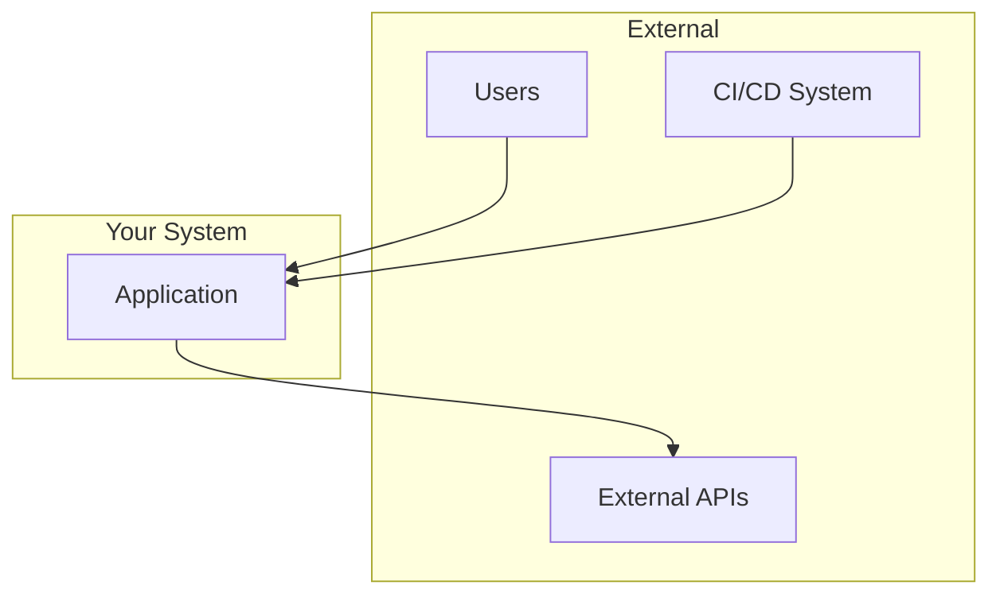
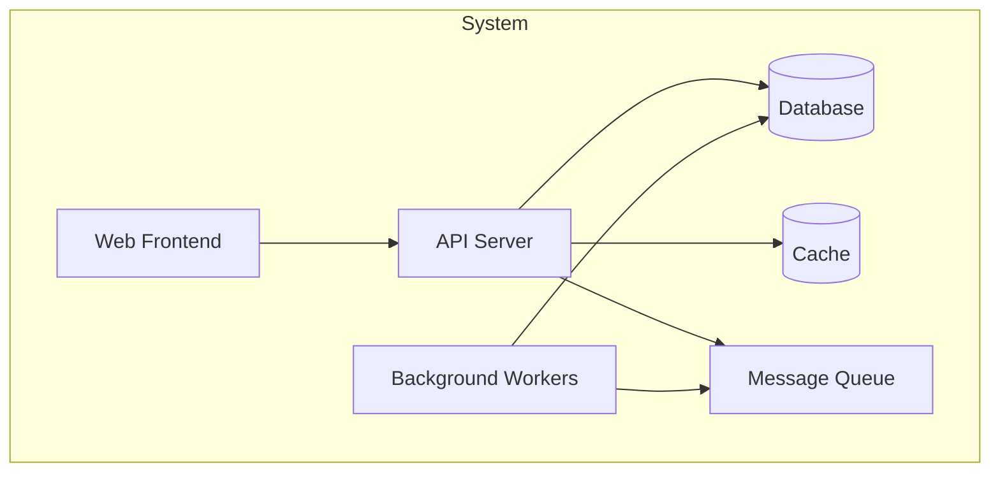
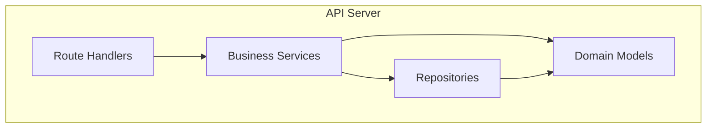
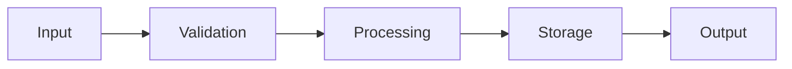
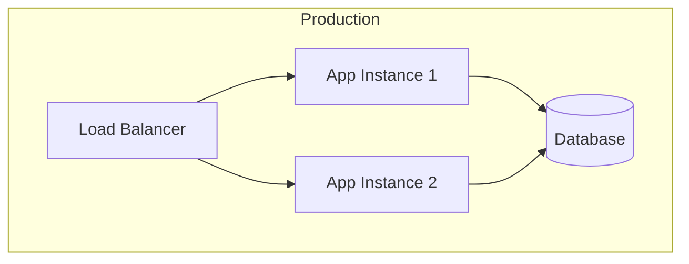

# Architecture Overview

<!--
AI Agent Instructions:
- This document provides the high-level system architecture
- Read this FIRST when understanding the system
- Refer to diagrams for visual understanding
- Check ADRs for decision rationale
-->

## System Summary

| Aspect | Description |
|--------|-------------|
| **Purpose** | [One-line description of what the system does] |
| **Type** | [Web app, CLI tool, Library, Service, Platform] |
| **Primary Users** | [Who uses this system] |
| **Tech Stack** | [Key technologies] |

## Architecture Style

<!--
Describe the overall architectural approach:
- Monolith, Microservices, Serverless, etc.
- Key patterns used (CQRS, Event Sourcing, etc.)
-->

[Describe the architecture style and why it was chosen]

## System Context

<!--
External systems and actors that interact with this system
-->



### External Dependencies

| System | Purpose | Protocol | Notes |
|--------|---------|----------|-------|
| [External System 1] | [Purpose] | [HTTP/gRPC/etc] | [Notes] |
| [External System 2] | [Purpose] | [Protocol] | [Notes] |

## Container Diagram

<!--
Major deployable units / containers in the system
-->



### Container Descriptions

| Container | Technology | Purpose | Scaling |
|-----------|------------|---------|---------|
| [Container 1] | [Tech] | [Purpose] | [Horizontal/Vertical/None] |
| [Container 2] | [Tech] | [Purpose] | [Scaling approach] |

## Component Structure

<!--
Internal structure of key containers
-->

### [Main Container Name]



## Data Architecture

### Data Stores

| Store | Type | Purpose | Retention |
|-------|------|---------|-----------|
| [Store 1] | [PostgreSQL/Redis/etc] | [Purpose] | [Retention policy] |

### Data Flow



## Key Patterns

<!--
Important patterns used throughout the codebase
-->

### [Pattern 1 Name]

**Where Used**: [Components/modules]

**Description**: [How the pattern is implemented]

**Example**:
```
[Code example or reference to file]
```

### [Pattern 2 Name]

**Where Used**: [Components/modules]

**Description**: [How the pattern is implemented]

## Security Architecture

<!--
High-level security considerations
See security/ docs for details
-->

- **Authentication**: [Method used]
- **Authorization**: [Approach]
- **Data Protection**: [Encryption, etc.]
- **Network Security**: [Firewalls, VPCs, etc.]

## Deployment Architecture

<!--
How the system is deployed
-->



### Environments

| Environment | Purpose | URL | Notes |
|-------------|---------|-----|-------|
| Development | Local dev | localhost | [Notes] |
| Staging | Pre-prod testing | [URL] | [Notes] |
| Production | Live system | [URL] | [Notes] |

## Cross-Cutting Concerns

### Logging

- **Format**: [Structured JSON, etc.]
- **Levels**: [DEBUG, INFO, WARN, ERROR]
- **Destination**: [stdout, file, service]

### Monitoring

- **Metrics**: [What is measured]
- **Alerting**: [Alert conditions]
- **Dashboards**: [Where to find them]

### Error Handling

- **Strategy**: [How errors are handled]
- **Recovery**: [Retry policies, circuit breakers]

## Related Documentation

- [ADRs](./decisions/) - Architecture decisions
- [API Documentation](../api/overview.md) - API details
- [Domain Model](../domain/model.md) - Business logic
- [Operations](../operations/) - Runbooks and procedures

## Revision History

| Date | Author | Changes |
|------|--------|---------|
| YYYY-MM-DD | @author | Initial version |
