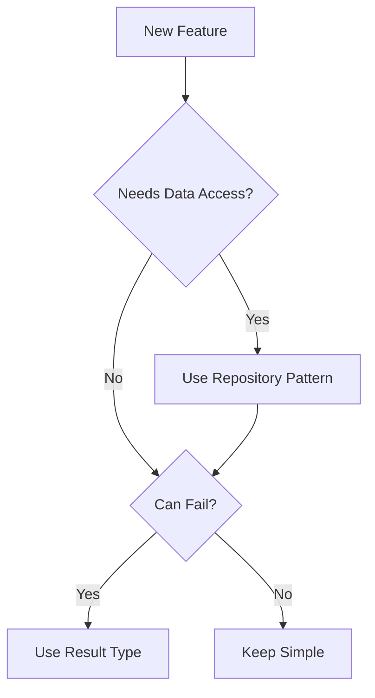

# Architecture Patterns

<!--
AI Agent Instructions:
- This document describes patterns used throughout the codebase
- When implementing new features, FOLLOW these established patterns
- When refactoring, maintain pattern consistency
- If proposing a new pattern, document it here first
-->

## Pattern Overview

| Pattern | Category | Usage | Complexity |
|---------|----------|-------|------------|
| [Pattern 1] | [Structural/Behavioral/Creational] | [Where used] | [Low/Medium/High] |
| [Pattern 2] | [Category] | [Where used] | [Complexity] |

## Structural Patterns

### [Pattern Name]

**Purpose**: [What problem does this pattern solve?]

**When to Use**:
- [Scenario 1]
- [Scenario 2]

**When NOT to Use**:
- [Anti-pattern scenario]

**Implementation**:

```[language]
// Example implementation
```

**Examples in Codebase**:
- `src/path/to/file.ts` - [Description]
- `src/other/file.rs` - [Description]

**Related Patterns**: [Other patterns that work with this one]

---

## Behavioral Patterns

### [Pattern Name]

**Purpose**: [What problem does this pattern solve?]

**When to Use**:
- [Scenario 1]

**Implementation**:

```[language]
// Example implementation
```

**Examples in Codebase**:
- `src/path/to/file.ts`

---

## Data Patterns

### Repository Pattern

**Purpose**: Abstract data access from business logic

**When to Use**:
- Database operations
- External API integrations
- Caching layers

**Implementation**:

```typescript
interface Repository<T> {
  findById(id: string): Promise<T | null>;
  findAll(): Promise<T[]>;
  save(entity: T): Promise<T>;
  delete(id: string): Promise<void>;
}

class UserRepository implements Repository<User> {
  // Implementation
}
```

**Examples in Codebase**:
- [Reference actual files]

---

## Error Handling Patterns

### Result Type Pattern

**Purpose**: Explicit error handling without exceptions

**When to Use**:
- Operations that can fail
- When caller needs error details
- API boundaries

**Implementation**:

```typescript
type Result<T, E> = { ok: true; value: T } | { ok: false; error: E };

function parseConfig(input: string): Result<Config, ParseError> {
  // Implementation
}
```

```rust
fn parse_config(input: &str) -> Result<Config, ParseError> {
    // Implementation
}
```

---

## Concurrency Patterns

### [Pattern Name]

**Purpose**: [What concurrency problem does this solve?]

**When to Use**:
- [Scenario]

**Implementation**:

```[language]
// Example
```

---

## API Patterns

### Request/Response Pattern

**Purpose**: Standardize API communication

**Request Structure**:
```json
{
  "data": {},
  "metadata": {
    "requestId": "uuid",
    "timestamp": "ISO8601"
  }
}
```

**Response Structure**:
```json
{
  "data": {},
  "meta": {
    "requestId": "uuid",
    "pagination": {}
  },
  "errors": []
}
```

---

## Configuration Patterns

### Environment-Based Configuration

**Purpose**: Configure application per environment

**Pattern**:
1. Default values in code
2. Override with environment variables
3. Override with config files
4. Override with command-line args

**Example**:
```[language]
// Example configuration loading
```

---

## Testing Patterns

### Arrange-Act-Assert (AAA)

**Purpose**: Consistent test structure

**Implementation**:
```[language]
test("description", () => {
  // Arrange
  const input = createTestData();

  // Act
  const result = functionUnderTest(input);

  // Assert
  expect(result).toBe(expectedValue);
});
```

### Test Fixtures

**Purpose**: Reusable test data

**Location**: `tests/fixtures/`

---

## Pattern Decision Guide



## Adding New Patterns

When introducing a new pattern:

1. Document it in this file first
2. Get team review/approval
3. Create an ADR if significant
4. Add examples to codebase
5. Update this documentation

## Anti-Patterns to Avoid

### [Anti-Pattern Name]

**Problem**: [What's wrong with this approach]

**Example of Bad Code**:
```[language]
// Don't do this
```

**Better Approach**: [Reference the correct pattern]

---

## References

- [ADR-XXX](./decisions/xxx-pattern-decision.md) - Related decision
- [External Resource](https://example.com) - Pattern documentation
