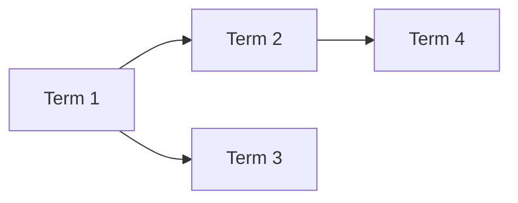

# Domain Glossary

<!--
AI Agent Instructions:
- USE THESE TERMS EXACTLY as defined when writing code and documentation
- Do not introduce synonyms or alternative terms
- If a concept needs a new term, add it to this glossary first
- Terms are organized alphabetically within categories
-->

## How to Use This Glossary

1. **In Code**: Use these exact terms for class names, variable names, and function names
2. **In Docs**: Use these terms consistently in all documentation
3. **In Communication**: Use these terms when discussing the system

## Quick Reference

| Term | Brief Definition | See Also |
|------|------------------|----------|
| [Term 1] | [One-line definition] | [Related terms] |
| [Term 2] | [One-line definition] | [Related terms] |

---

## Core Domain Terms

### [Term Name]

**Definition**: [Clear, precise definition]

**Context**: [When/where this term is used]

**Examples**:
- [Example usage 1]
- [Example usage 2]

**Not to be confused with**: [Similar but different terms]

**Code Reference**: `TermName` in `src/domain/`

---

### [Another Term]

**Definition**: [Clear, precise definition]

**Context**: [When/where this term is used]

**Examples**:
- [Example]

---

## Technical Terms

### [Technical Term]

**Definition**: [Definition]

**Usage**: [How it's used in this project]

---

## Abbreviations

| Abbreviation | Full Term | Definition |
|--------------|-----------|------------|
| [ABBR] | [Full Term] | [Brief definition] |

---

## Status/State Terms

| Status | Meaning | Transitions To |
|--------|---------|----------------|
| [Status 1] | [What it means] | [Possible next states] |
| [Status 2] | [What it means] | [Possible next states] |

---

## Role Terms

| Role | Definition | Permissions |
|------|------------|-------------|
| [Role 1] | [Who this is] | [What they can do] |
| [Role 2] | [Who this is] | [What they can do] |

---

## Deprecated Terms

<!--
Terms that were previously used but should no longer be used
-->

| Deprecated Term | Replacement | Reason |
|-----------------|-------------|--------|
| [Old Term] | [New Term] | [Why changed] |

---

## Term Relationships

---

## Adding New Terms

When you need a new term:

1. Check if an existing term already covers the concept
2. Propose the new term with a clear definition
3. Get team consensus
4. Add to this glossary
5. Update code to use the new term consistently

## References

- [Domain Model](./model.md) - How terms relate to entities
- [Workflows](./workflows.md) - Terms in context of processes
