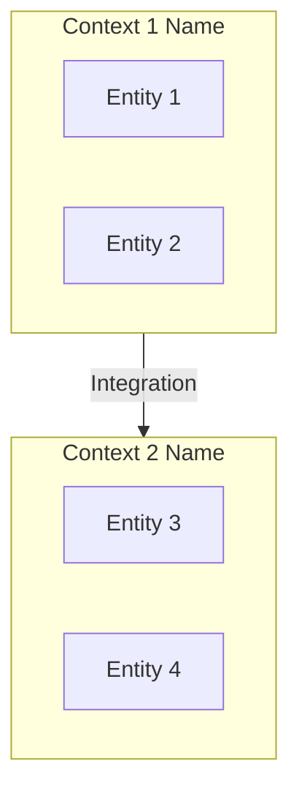
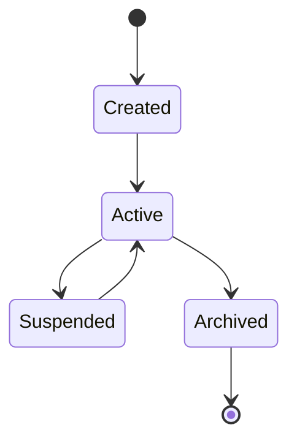
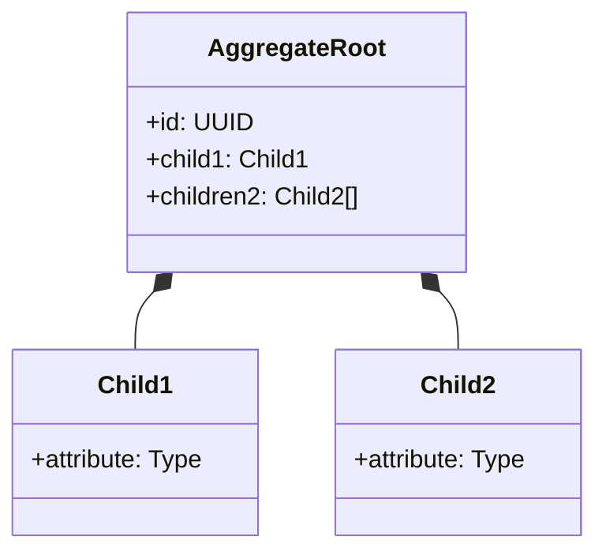
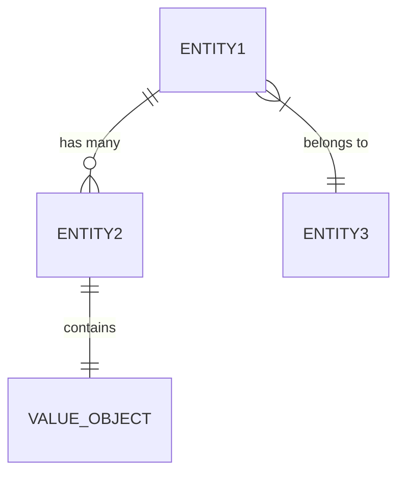

# Domain Model

<!--
AI Agent Instructions:
- This document describes the core business concepts
- Use these terms consistently in code and communication
- Understand relationships before modifying domain logic
- Check glossary.md for term definitions
-->

## Domain Overview

**Business Domain**: [High-level description of the business domain]

**Core Problem Solved**: [What business problem does this system solve?]

**Key Stakeholders**:
- [Stakeholder 1]: [Their interest/concern]
- [Stakeholder 2]: [Their interest/concern]

## Bounded Contexts

<!--
Major areas of the domain with their own models
-->



### [Context 1 Name]

**Purpose**: [What this context handles]

**Key Entities**: [Entity1, Entity2]

**Owned By**: [Team or module]

### [Context 2 Name]

**Purpose**: [What this context handles]

**Key Entities**: [Entity3, Entity4]

## Core Entities

### [Entity Name]

**Definition**: [What this entity represents in the business domain]

**Lifecycle**:


**Attributes**:

| Attribute | Type | Description | Constraints |
|-----------|------|-------------|-------------|
| id | UUID | Unique identifier | Required, immutable |
| name | String | Display name | Required, max 100 chars |
| status | Enum | Current state | Required |
| createdAt | DateTime | Creation timestamp | Required, immutable |

**Relationships**:

| Related Entity | Relationship | Cardinality | Description |
|----------------|--------------|-------------|-------------|
| [Other Entity] | has many | 1:N | [Description] |
| [Another Entity] | belongs to | N:1 | [Description] |

**Business Rules**:
1. [Rule 1]: [Description]
2. [Rule 2]: [Description]

**Code Location**: `src/domain/[entity].ts`

---

### [Entity 2 Name]

**Definition**: [What this entity represents]

**Attributes**:

| Attribute | Type | Description | Constraints |
|-----------|------|-------------|-------------|
| ... | ... | ... | ... |

---

## Value Objects

<!--
Immutable objects defined by their attributes, not identity
-->

### [Value Object Name]

**Definition**: [What this represents]

**Components**:

| Component | Type | Description |
|-----------|------|-------------|
| [Component 1] | [Type] | [Description] |

**Validation Rules**:
- [Rule 1]
- [Rule 2]

**Code Location**: `src/domain/values/[name].ts`

---

## Aggregates

<!--
Clusters of entities and value objects with consistency boundaries
-->

### [Aggregate Name]

**Root Entity**: [Root entity name]

**Members**:
- [Entity 1] (root)
- [Entity 2]
- [Value Object 1]

**Invariants**:
1. [Invariant 1]: [Must always be true]
2. [Invariant 2]: [Must always be true]

**Consistency Boundary**: [What must be consistent within this aggregate]



---

## Domain Events

<!--
Important things that happen in the domain
-->

### [Event Name]

**Trigger**: [What causes this event]

**Payload**:
```typescript
interface EventName {
  entityId: string;
  occurredAt: Date;
  // Additional fields
}
```

**Consumers**:
- [Consumer 1]: [What they do with this event]
- [Consumer 2]: [What they do]

---

## Domain Services

<!--
Operations that don't belong to a single entity
-->

### [Service Name]

**Purpose**: [What operation this service performs]

**Input**: [What it needs]

**Output**: [What it produces]

**Side Effects**: [External changes it makes]

**Code Location**: `src/domain/services/[name].ts`

---

## Entity Relationship Diagram



## Ubiquitous Language

<!--
Terms that must be used consistently across code, docs, and communication
-->

See [Glossary](./glossary.md) for complete term definitions.

Key terms for this domain:
- **[Term 1]**: [Brief definition]
- **[Term 2]**: [Brief definition]
- **[Term 3]**: [Brief definition]

## Domain Rules Summary

<!--
Critical business rules that must never be violated
-->

| Rule ID | Rule | Enforcement |
|---------|------|-------------|
| DR-001 | [Rule description] | [Where/how enforced] |
| DR-002 | [Rule description] | [Where/how enforced] |

## References

- [Glossary](./glossary.md) - Term definitions
- [Workflows](./workflows.md) - Business processes
- [Architecture Overview](../architecture/overview.md) - Technical implementation
