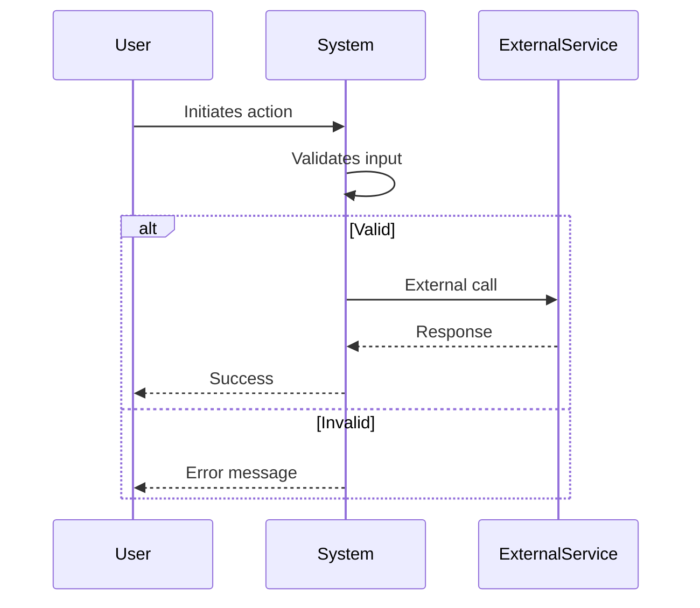
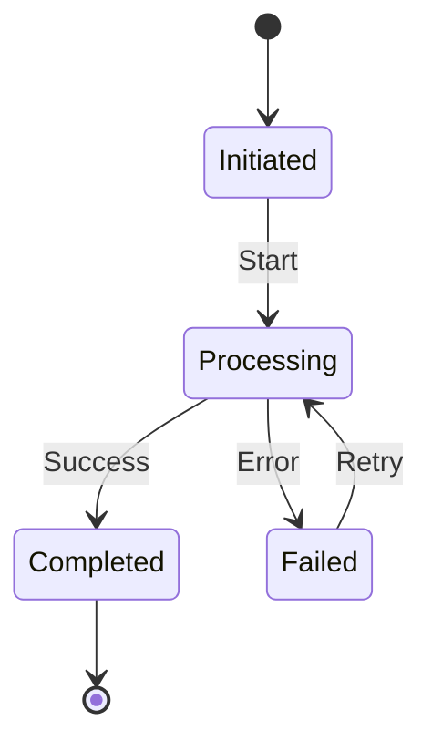
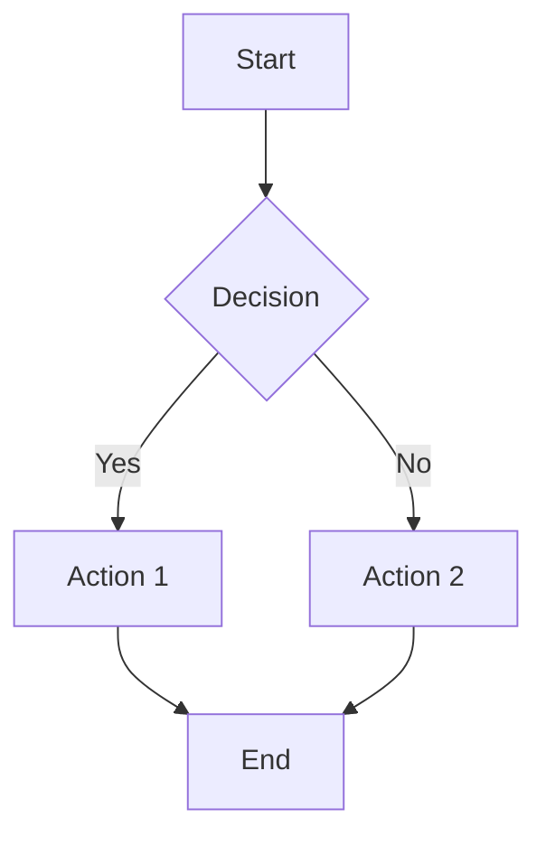
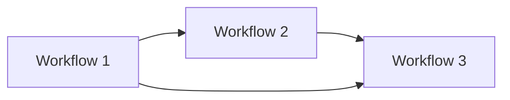
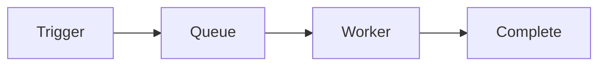

# Business Workflows

<!--
AI Agent Instructions:
- This document describes key business processes
- Understand workflows before modifying related code
- Diagrams show the expected flow; variations should be documented
- Check for error handling at each step
-->

## Workflow Overview

| Workflow | Trigger | Outcome | Frequency |
|----------|---------|---------|-----------|
| [Workflow 1] | [What starts it] | [End result] | [How often] |
| [Workflow 2] | [Trigger] | [Outcome] | [Frequency] |

---

## [Workflow 1 Name]

### Overview

**Purpose**: [What business goal this workflow achieves]

**Actors**: [Who/what participates]

**Preconditions**:
- [Condition 1]
- [Condition 2]

**Postconditions**:
- [Result 1]
- [Result 2]

### Flow Diagram

### Steps

| Step | Actor | Action | System Response | Errors |
|------|-------|--------|-----------------|--------|
| 1 | User | [Action] | [Response] | [Possible errors] |
| 2 | System | [Action] | [Response] | [Possible errors] |
| 3 | [Actor] | [Action] | [Response] | [Possible errors] |

### Detailed Steps

#### Step 1: [Step Name]

**Input**: [What's needed]

**Processing**:
1. [Sub-step 1]
2. [Sub-step 2]

**Output**: [What's produced]

**Error Handling**:
- [Error condition]: [How it's handled]

**Code Location**: `src/workflows/[name].ts:functionName`

#### Step 2: [Step Name]

**Input**: [What's needed from previous step]

**Processing**:
1. [Sub-step]

**Output**: [Result]

### State Transitions

### Business Rules

| Rule | Description | Enforcement |
|------|-------------|-------------|
| BR-001 | [Rule] | [Where enforced] |
| BR-002 | [Rule] | [Where enforced] |

### Error Scenarios

| Scenario | Trigger | Handling | User Message |
|----------|---------|----------|--------------|
| [Scenario 1] | [What causes it] | [How handled] | [Message shown] |

### Metrics

| Metric | Description | Target |
|--------|-------------|--------|
| [Metric 1] | [What it measures] | [Target value] |

---

## [Workflow 2 Name]

### Overview

**Purpose**: [Business goal]

**Actors**: [Participants]

### Flow Diagram

### Steps

[Follow same structure as Workflow 1]

---

## Cross-Workflow Dependencies

| Workflow | Depends On | Triggers |
|----------|------------|----------|
| [Workflow 1] | None | [Workflow 2] |
| [Workflow 2] | [Workflow 1] | [Workflow 3] |

---

## Async/Background Workflows

### [Background Process Name]

**Trigger**: [What starts it - schedule, event, etc.]

**Frequency**: [How often it runs]

**Processing**:

**Monitoring**: [How to monitor this process]

**Failure Handling**: [What happens on failure]

---

## References

- [Domain Model](./model.md) - Entities involved in workflows
- [API Documentation](../api/overview.md) - API endpoints for workflows
- [Operations Runbooks](../operations/runbooks/) - Operational procedures
